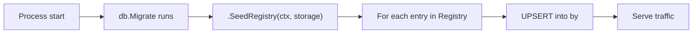
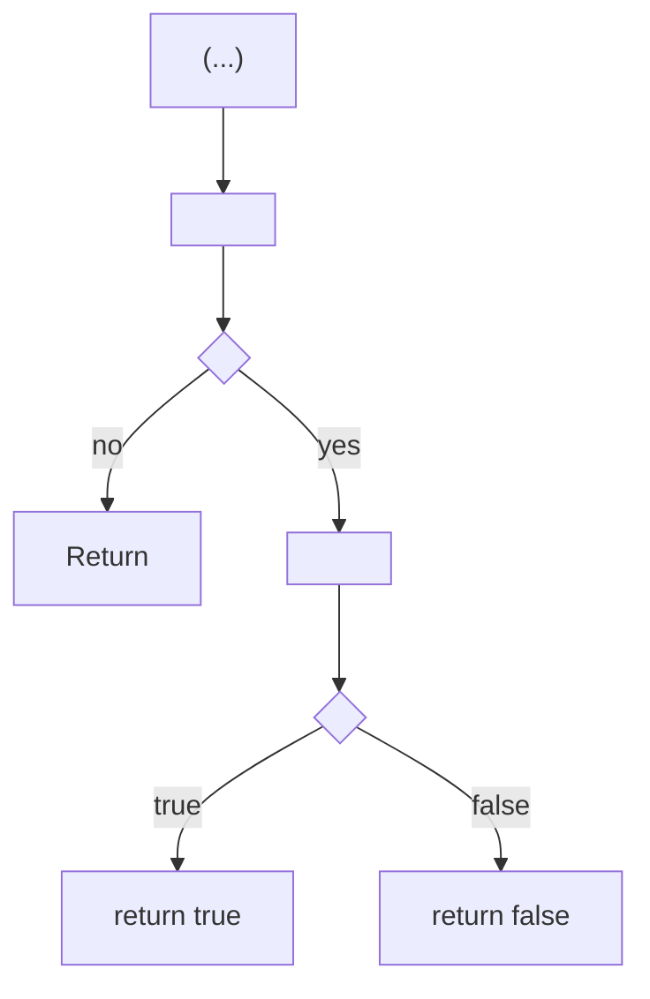
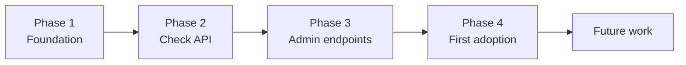
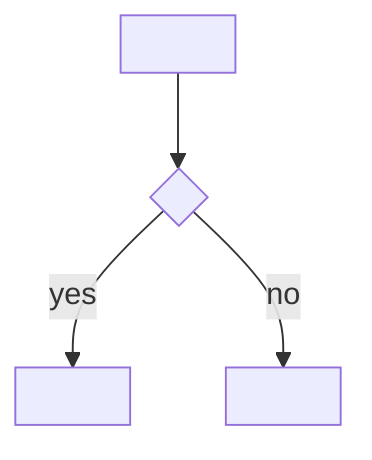
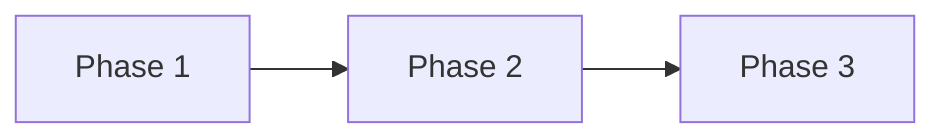

# Design Doc Template (VCP house style)

Section-by-section template for VCP architecture design docs. Organized as:

1. **[Common skeleton](#common-skeleton)** — sections every design includes.
2. **[Specialty sections — Structural / Refactor](#specialty-sections--structural--refactor)** — repo/module split, large refactor, build pipeline reorg.
3. **[Specialty sections — Feature / Subsystem](#specialty-sections--feature--subsystem)** — new capability, new API, new data model, new in-process library.
4. **[Recurring patterns](#recurring-patterns)** — tables, code blocks, diagram shapes used across both.

How to use:

- Copy the headings verbatim. Replace placeholder text in angle brackets `<like this>`.
- Always include every section in the common skeleton.
- For specialty sections, pick from the relevant menu based on the design type. Delete a section only if truly inapplicable; if so, note that decision in `Non-Goals`.
- Section ordering in a finished doc:
  ```
  Common (Title -> TL;DR -> Overview -> Goals/Non-Goals)
    -> Specialty middle (type-specific)
    -> Migration Plan / Implementation Phases
    -> Open Questions / Future Work
    -> (Optional) References
  ```

---

## Common skeleton

Every design includes these sections in this order.

### Title

```markdown
# <Component or Subject> — <Short Title>
```

For feature designs the form `# <Short Title>` is also acceptable (e.g. `# Account Feature Allowlist`). For structural / refactor designs, prefer `<Component> — <Short Title>` (e.g. `# VCM Service — Code Repository Structure`).

### (Optional) Status + Date

Include only when the design is large enough that "is this still being worked on?" is a real question (typically structural / multi-phase designs). Feature designs commonly omit these.

```markdown
## Status

<Draft | In Progress | Accepted | Superseded by NNNN>

## Date

<YYYY-MM-DD>

---
```

### TL;DR

```markdown
## TL;DR

- **Problem.** <One-paragraph statement of the pain that exists today. Concrete. Names the components affected.>
- **<Key concept #1>.** <The single most important architectural choice or pattern this design relies on. Link to the section that proves it if applicable.>
- **<Key concept #2>.** <The second most important choice.>
- **<Key concept #3>.** <The third most important choice.>
- **What is _not_ changing.** <Critical to call out — saves a round of "but does this affect X?" review comments.>
- **Phased delivery.** [Phase 1](#phase-1--<short-name>) (<N> steps) <what it ships>. [Phase 2](#phase-2--<short-name>) (<N> steps) <what it ships>. (structural style)

OR

- **Out of scope (v1)**: <bullet list of explicit non-goals>. (feature style)

---
```

Lead with `**Problem.**`. Each bullet uses a `**Bold lead-in.**` shape. End with either `**Phased delivery**` (structural) or `**Out of scope (v1)**` (feature). Keep each bullet to one sentence; if you need more, the content belongs in Overview or a specialty section.

### Overview

```markdown
## Overview

<2–4 paragraphs. State, in declarative voice, what this design is for. Name the components by their on-disk paths. Reference today's reality with bracketed file links, e.g. `[core/app.go](../../../core/app.go)`. End with a sentence saying what is **not** in this design (deployment topology, API surface, runtime config — whatever is out of scope).>

This document defines / describes:

1. <Concrete deliverable #1.>
2. <Concrete deliverable #2.>
3. <Concrete deliverable #3.>

<For feature designs, also reference any prior art or similar subsystems in adjacent codebases:>

The design mirrors the <name>-pattern in `[<file>](<link>)` but trades <X> for <Y>. The result is <observation>.

<For structural designs, end Overview with what is explicitly NOT in this design:>

It does **not** define:

- <Out-of-scope item #1.>
- <Out-of-scope item #2.>

---
```

### Goals and Non-Goals

```markdown
## Goals and Non-Goals

### Goals

- <Goal 1, phrased as a measurable outcome.>
- <Goal 2.>
- <Goal 3.>

### Non-Goals

- **<Topic 1>.** <Why excluded; what document or future phase covers it.>
- **<Topic 2>.** <Why excluded.>
- <For features, this often becomes "### Non-Goals (v1)" with explicit v1/v2 framing.>

---
```

Non-Goals must not be empty. If you cannot name 2–3 things this design is explicitly NOT doing, the design's scope is not yet thought through.

### Migration Plan / Implementation Phases (the connector)

Always phased. Use one of two phase shapes — don't mix within a single doc.

**Structural shape (`Steps + Exit criteria`)** — used when each step touches many files and needs explicit verification commands. See [Specialty — Structural — Migration Plan](#migration-plan) below for the full scaffold.

**Feature shape (`What lands + Acceptance`)** — used when phases are smaller scoped and naturally bullet-listable. See [Specialty — Feature — Implementation Phases](#implementation-phases) below for the full scaffold.

### Open Questions / Future Work

```markdown
## Open Questions <or "Open Questions and Future Work" for feature designs>

- **<Topic 1>** — <description of the open decision>. Default plan: <what we'll do absent further input>. Alternatives: <one or two>. Decide during <phase / review / date>.
- **<Topic 2>** — <description>. Default: <…>. Alternatives: <…>. Decide during <…>.
- **<Topic 3 — known follow-up>** — <e.g. caching, audit log, public read API; flag now even when it's deferred work, not an open decision>.

---
```

Non-empty even on simple designs. If everything is settled, list at least the known follow-ups (caching, observability, public-facing surface).

### (Optional) References

```markdown
## References

- [<NNNN — Related design title>](<NNNN-related-slug>.md)
- [<NNNN — Another related design>](<NNNN-related-slug>.md)
- `[<key source file>](../../../<key-source-file>)`
- `[.cursor/rules/<relevant-rule>.mdc](../../../.cursor/rules/<relevant-rule>.mdc)`
```

Common in structural designs; often omitted in small feature designs where the inline `[…](path)` links throughout the body do the job.

---

## Specialty sections — Structural / Refactor

Insert these between **Goals and Non-Goals** and **Migration Plan**, in the order shown. Skip any that don't apply.

### Background — Current State

```markdown
## Background — Current State

<Describe what exists today in concrete terms. Include:>

- The repo / module shape ("a single Go module today", "a four-service mesh", etc.).
- A table of existing services / components with their on-disk paths and role:

| Service | Path | Role |
|---|---|---|
| `<service-a>` | `[<path>/](../../../<path>/)` | <one-line role> |
| `<service-b>` | `[<path>/](../../../<path>/)` | <one-line role> |

<Continue with subsystem-level detail — directories, file counts, key imports. The reader should finish this section with a clear mental model of what is being changed.>

Approximate <metric, e.g. import counts> per top-level directory:

| Directory | <Metric> |
|---|---|
| `<dir-a>/` | <count> |
| `<dir-b>/` | <count> |

<End with a paragraph naming the pain points this design responds to — the "why we are doing this" linked back to the TL;DR.>

---
```

### <Strategy> — Options and Recommendation

```markdown
## <Strategy> — Options and Recommendation

<Open with one paragraph framing the trade-off. Then enumerate options.>

### Option 1 — <Short label>

<One-paragraph description of the option.>

- External / observable behavior: <what consumers see>.
- Pros:
  - <Pro 1>.
  - <Pro 2>.
- Cons:
  - <Con 1>.
  - <Con 2>.

### Option 2 — <Short label>

<Same shape.>

### Option 3 — <Short label>

<Same shape. Often used to describe an "intermediate state" or "Phase 1 of Option 2".>

### Recommendation — <Option N> (<short reason>)

Adopt **Option <N>**, <delivered in N phases | as the end-state>.

<Justification paragraph: why this option, why the others are worse for this context. Reference goals from the Goals section.>

<If a stricter reading of the requirements is mandatory, name the fallback.>

The rest of this document is written assuming **Option <N>**.

### Phasing — <Short label>

<If phased: one paragraph framing the phases and what each one delivers. Include a comparison table:>

| Phase | <Modules / Components created> | What ships | <Observable surface change> |
|---|---|---|---|
| **Phase 1** (<short-name>) | <list> | <one-line outcome> | <what changes externally> |
| **Phase 2** (<short-name>) | <list> | <one-line outcome> | <what changes externally> |
| **Phase 3** (<short-name>) | <list> | <one-line outcome> | <what changes externally> |

Why this phasing helps:

- **<Risk-reduction or speed argument #1.>**
- **<Argument #2.>**

Trade-offs of this phasing:

- **<Cost #1.>** <Explanation.>
- **<Cost #2.>** <Explanation.>

---
```

### Proposed Layout (or Proposed Architecture)

```markdown
## Proposed <Layout | Architecture>

<ASCII tree or block diagram showing the on-disk / topology shape. Mark each entry as NEW / EXISTING (changed) / EXISTING (unchanged).>

\`\`\`
<root>/
|
|-- NEW directories
|     |-- <new-dir-1>/    <one-line role>
|     `-- <new-dir-2>/    <one-line role>
|
|-- EXISTING dirs (changed)
|     |-- <changed-dir-1>/   <change description>
|     `-- <changed-dir-2>/   <change description>
|
`-- EXISTING (unchanged)
      |-- <unchanged-1>/
      `-- <unchanged-2>/
\`\`\`

<Then explicit "what stays / what moves / what's new" subsections:>

What stays in `<component>` (unchanged content):

- `<path>`, `<path>`, `<path>` — <one-line role>.

What leaves `<component>`:

- `<path>` → `<new-path>`. <Why: cycle-breaker / placement rule / etc.>

What moves **into** `<component>`:

- `<path>` → `<new-path>`. <Why.>

  *Impact on `<consumer>`:* <Concrete impact statement. Include any backward-compat traps — e.g. instrumentation library names, log message keys, generated client paths.>

---
```

### Dependency Graph (or Component Interaction)

```markdown
## <Dependency Graph | Component Interaction Diagram>

### Why <X> depends on <Y> — the <pattern-name> pattern

<Short subsection explaining a non-obvious edge in the graph. Use when one edge is going to cause "wait, why?" questions in review.>

\`\`\`
<small targeted diagram of just the edge in question>
\`\`\`

### <Module | Component>-level dependency graph

\`\`\`
<full ASCII or mermaid diagram showing all components and their edges>
\`\`\`

Key invariants:

- `<component-a>` depends on nothing else from this <repo / system>.
- `<component-b>` depends only on `<component-a>`. It does **not** depend on `<component-c>`, ...
- `<component-c>` is the **single hub** that owns the dependencies on ...
- <Continue listing the rules that keep the graph cycle-free.>

---
```

### How Components Consume Each Other

```markdown
## How Components Consume Each Other

<2–4 paragraphs explaining the consumption model. Then break into three subsections: source-level, declaration-level, local-dev.>

### Source-level imports

Before, in (for example) `<file>`:

\`\`\`go
import (
    "<old-import-path>"
    "<old-import-path>"
)
\`\`\`

After:

\`\`\`go
import (
    "<new-import-path>"
    "<new-import-path>"
)
\`\`\`

<One paragraph stating the rewrite rule that produces "after" from "before".>

### <Module-level | Service-level> dependency declarations

`<component-a>` <go.mod | manifest>:

\`\`\`
<concrete snippet>
\`\`\`

### Local development with `<tool / file>`

<How developers see the changes locally — `go.work`, helm dev profile, skaffold, etc.>

\`\`\`
<concrete config snippet>
\`\`\`

### What contributors actually need to do

| Task | What changes |
|---|---|
| <task 1> | <one-line change> |
| <task 2> | <one-line change> |

### <Version bumps | Release flow> (when it matters)

<Subsection answering "if I change X, do I need to bump Y?". Distinguish the in-repo workflow from the external-consumer workflow.>

---
```

### External Consumption Contract

Include only when the design exposes new public APIs or module surfaces.

```markdown
## External Consumption Contract

| Concern | Rule |
|---|---|
| **<Module / API path>** | `<rule>` |
| **Versioning** | <rule> |
| **Public surface** | <rule> |
| **What an external repo needs** | <rule> |
| **Forbidden imports in `<component>`** | <rule> |

---
```

### Build and Packaging

```markdown
## Build and Packaging

<Open with a paragraph naming the artifacts produced and what changes about how they are built.>

### Builder pipeline changes

<Describe what changes in `[builder/](../../../builder/)` and how `go build` / equivalent resolves the new layout.>

### Makefile impact

<The repo `[Makefile](../../../Makefile)` is the most-edited file in most designs. Structure as:>

#### <Workspace / tooling> mechanics

| Concern | Today | After |
|---|---|---|
| **<topic>** | <how it works today> | <how it works after> |

#### Per-target changes

| Target (line in `[Makefile](../../../Makefile)`) | Change |
|---|---|
| `<target-name>` | <one-line change> |
| `<target-name>` | <one-line change> |

#### New targets

| New target | Purpose |
|---|---|
| `<new-target-name>` | <purpose> |

#### <CI gotchas> to flag

1. **<Gotcha 1>** — <description and detection>.
2. **<Gotcha 2>** — <description and detection>.

### Dockerfile impact

| File | Change |
|---|---|
| `[<dockerfile-path>](../../../<dockerfile-path>)` | <change> |
| New: `<new-dockerfile-path>` | <shape> |

### Helm / Kubernetes chart impact

| Chart | Impact |
|---|---|
| `[<chart-path>](../../../<chart-path>)` | <impact> |

### Skaffold impact

<Bullet list of the artifacts and image entries that change.>

### Build flow

```mermaid
flowchart LR
    src[<input>]
    step1[<step 1>]
    out[<output artifact>]
    src --> step1 --> out
```



---
```

Keep only the pipeline subsections (Makefile, Dockerfile, Helm, Skaffold) that the design actually touches. Don't pad.

### Migration Plan (structural shape)

Each phase ships as one PR. Sizing target: ≤5000 +/- lines, ≤20 files, excluding generated. Structural refactors usually mean many small phases — that is the intent. Group related phases under named milestones if useful; the PR unit is the phase, not the milestone. Over-target phases are acceptable when justified (e.g. atomic import rewrites).

```markdown
## Migration Plan

<One-paragraph framing: number of phases, optional milestones, rollback story.>

<Optional table preview when there are 5+ phases.>

| Phase | Milestone | Action | Est. PR size (excl. gen) |
|---|---|---|---|
| 1 | A — <milestone> | Add `<dir>/go.mod` and update `go.work` | ~6 files, ~120 lines |
| 2 | A — <milestone> | Rewrite imports under `<service>/` | ~14 files, ~380 lines |
| 3 | B — <milestone> | Move `<src>` → `<dst>` (cycle-breaker) | ~9 files, ~210 lines |

---

## Phase 1 — <Verb-led label>

<Outcome in 1–2 sentences. What is in place at the end. What is *not* yet.>

PR size estimate: ~<N> files, ~<N> lines. Generated (excluded): <list or "none">.

Changes:

- <Concrete change.>
- <Concrete change.>

Verification:

- `<command>` produces `<artifact>`.
- `make verify-tidy` green.

Exit criteria:

- <Observable condition>.
- Repo builds and tests pass; no follow-up required.

---

## Phase 2 — <Verb-led label>

<Same structure.>

---

## Phase N — <Verb-led label> (post-rollout cleanup, optional)

<Same structure. Note scheduling rule — e.g. "scheduled after Phase <N-1> stable in production ≥ 1 release".>

Pre-conditions:

- <Conditions.>

PR size estimate: ~<N> files, ~<N> lines.

Changes / Verification / Exit criteria:

- ...
```

**Splitting tip:** one logical change to one logical area = one phase. "Add `<dir>/go.mod`" and "rewrite imports under `<service>/`" are separate phases. If a single import rewrite exceeds the target, split per-service or per-directory — or, if atomicity is required, state the reason in the phase intro.

### Failure Modes and Risks

```markdown
## Failure Modes and Risks

| Risk | Mitigation |
|---|---|
| <Risk 1 — one-line description> | <Mitigation: process / tool / verification> |
| <Risk 2> | <Mitigation> |
| <Risk 3> | <Mitigation> |

---
```

---

## Specialty sections — Feature / Subsystem

Insert these between **Goals and Non-Goals** and **Implementation Phases**, in roughly the order shown. Skip any that don't apply.

### Design Decisions

Use this when there isn't a clean 2–3 way fork between options — when each architectural choice is more or less independent. (If there IS a clean fork, use the structural `Options and Recommendation` shape instead.)

```markdown
## Design Decisions

| Decision | Choice | Rationale |
| --- | --- | --- |
| <Topic 1, e.g. Identity> | **<Choice>** | <Why this choice; trade-off accepted.> |
| <Topic 2, e.g. Storage shape> | <Choice> | <Why.> |
| <Topic 3, e.g. Default behavior> | <Choice> | <Why.> |
| <Topic 4, e.g. Caching> | <Choice> | <Why.> |
| <Topic 5, e.g. API surface> | <Choice> | <Why.> |

---
```

Each row should be one concrete, contestable choice — not a goal or a non-goal.

### Data Model

```markdown
## Data Model

### `<NewType>` (new table: `<tablename>`)

A new GORM model in `[database/datamodel/models.go](../../../database/datamodel/models.go)`:

\`\`\`go
type <NewType> struct {
    BaseModel
    Name        string `gorm:"column:name;uniqueIndex;not null"`
    <Field>     <type> `gorm:"<tags>"`
}
\`\`\`

Notes:

- `<Field>` is <semantic explanation; what's the contract>.
- `<Field>` defaults to <value>. After first insert, <ownership rule>.

The model is registered in `getVcpModels()` at `[database/vcp/datastore.go](../../../database/vcp/datastore.go)` so GORM AutoMigrate creates the table. <Note if a hand-written SQL migration is required.>

### `<ExistingType>` (extend existing field/column)

Today, `[database/datamodel/models.go](../../../database/datamodel/models.go)` defines:

\`\`\`go
type <ExistingType> struct {
    <existing fields>
}
\`\`\`

This becomes:

\`\`\`go
type <ExistingType> struct {
    <existing fields>
    <NewField>  <type>  `json:"<jsonName>,omitempty"`
}
\`\`\`

Semantics:

- `<NewField>` is treated as <semantic model: set, list, scalar, ...>.
- <Idempotency rules.>
- <How stale values are handled.>

<Round-trip note: the existing `Scan` / `Value` JSONB methods round-trip correctly because Go's `encoding/json` handles the new field automatically. No SQL migration is needed for this change.>

---
```

### <Subsystem-name> (e.g. Static Feature Registry)

```markdown
## <Subsystem Name>

A new package `<path>/` with <one-line purpose>. <Source-of-truth rule, e.g. "Every <thing> is declared as an exported `string` constant; `Registry()` returns the catalog the seed will upsert.">

\`\`\`go
package <pkgname>

type <Entry> struct {
    Name        string
    Description string
    <Field>     <type> // <semantic>
}

const (
    <ConstName> = "<value>"
)

func Registry() []<Entry> {
    return []<Entry>{
        {
            Name:        <ConstName>,
            Description: "<…>",
            <Field>:     <value>,
        },
    }
}
\`\`\`

### How to add a <thing>

1. Add a `<ConstName>` constant to `<path>/registry.go` using the convention `<naming-convention>`.
2. Append a `<Entry>` to the slice returned by `Registry()`.
3. Use the constant at the call site: `<call-site-shape>`.

### Renames are breaking (or similar gotcha section)

<Document the contract that prevents silent breakage. State the consequence and the workaround.>

---
```

### Init / Seeding

```markdown
## Init / Seeding

A new function `<pkg>.SeedRegistry(ctx, storage)` runs immediately after `db.Migrate(ctx)` in each binary that connects to the database:

- `[google-proxy/app.go](../../../google-proxy/app.go)`
- `[vcp-core/cmd/main.go](../../../vcp-core/cmd/main.go)`
- `[worker/main.go](../../../worker/main.go)`

The seed is idempotent and keyed by **<key>**:

\`\`\`sql
INSERT INTO <table> (...)
VALUES (...)
ON CONFLICT (<key>) DO UPDATE SET
    <field> = EXCLUDED.<field>,
    updated_at = now();
-- intentionally NOT updating <field-X>: <ownership rule>.
\`\`\`

<Explain the seed semantics on first insert vs subsequent restarts. Identify which fields are "code owns" vs "ops owns".>



---
```

### Core API (or Admin API, Internal API)

```markdown
## Core API (vcp-core admin)

<N> endpoints added to `[vcp-core/api.yaml](../../../vcp-core/api.yaml)`. Handlers land in `[vcp-core/handlers/](../../../vcp-core/handlers/)` via ogen generation, following the existing pattern (e.g. `pool_endpoint.go`).

| Method | Path | Purpose |
| --- | --- | --- |
| `GET` | `/v1/<resource>` | <one-line purpose> |
| `PATCH` | `/v1/<resource>/{<id>}` | <one-line purpose> |
| `POST` | `/v1/<resource>` | <one-line purpose>. Idempotent: <rule>. |
| `DELETE` | `/v1/<resource>/{<id>}` | <one-line purpose>. Idempotent: <rule>. |

### Identifier resolution

<How path params are resolved when the caller may pass either UUID or name.>

### Validation

- `<endpoint>` rejects <bad-input> with `<ErrorConstant>` (HTTP <code>).
- <Other validation rules>.
- <Auth/authorization rule.>

### DB layer additions

New methods on `Storage` (interface in `[database/vcp/interface.go](../../../database/vcp/interface.go)`):

In a new file `<path>/<file>.go`:

\`\`\`go
<MethodName>(ctx context.Context, <args>) error
<MethodName>(ctx context.Context, <args>) (<retType>, error)
\`\`\`

Added to `[database/vcp/<file>.go](../../../database/vcp/<file>.go)`, following the <existing-pattern>:

\`\`\`go
<MethodName>(ctx context.Context, <args>) error
<MethodName>(ctx context.Context, <args>) (<retType>, error)
\`\`\`

<Explain what each method does at the SQL level — what reads, what writes, transactional semantics, dedup rules.>

---
```

### Check Utilities (or Algorithm / Behavior)

```markdown
## Check Utilities

`<path>/<file>.go` exposes the only API call sites should use:

\`\`\`go
// <one-line>.
func <FuncName>(ctx context.Context, storage database.Storage, <args>) (<ret>, error)

// <one-line>.
func <FuncName>(ctx context.Context, storage database.Storage, <args>) (<ret>, error)
\`\`\`

### Algorithm

1. <Step 1 — what is checked, what error is returned on failure>.
2. <Step 2 — short-circuit if applicable>.
3. <Step 3 — load related resources>.
4. <Step 4 — return the answer>.

<One-paragraph rationale: why the steps are in this order (e.g. "The catalog lookup happens before the account lookup so an unknown name fails fast").>



### No caching in v1 (or other deliberate design constraint)

<Document the choice; quantify the cost ("one DB lookup per check; the table is small and indexed on <key>"); name the upgrade path ("Caching can be added later behind the same <pkg> API").>

---
```

### Error Taxonomy

```markdown
## Error Taxonomy

Add to `[core/errors/errors.json](../../../core/errors/errors.json)`:

| Code | Constant | HTTP | Meaning |
| --- | --- | --- | --- |
| `<code>` (next free in <range>) | `<ErrConstant>` | <httpCode> | <When this is returned.> |

<Note any existing errors that are reused, e.g. "The existing `ErrAccountNotFound` (2101) covers the missing-account branch.">

For workflows, follow the `[core/errors/README.md](../../../core/errors/README.md)` guidance: <retryable / non-retryable rule for this error>.

---
```

### Usage Pattern

```markdown
## Usage Pattern

A typical <feature-name>-gated code path looks like this:

\`\`\`go
allowed, err := <pkg>.<FuncName>(ctx, h.Storage, <args>)
if err != nil {
    return nil, err
}
if !allowed {
    return &<generated-response-type>{
        Code:    http.StatusForbidden,
        Message: "<user-facing message>",
    }, nil
}
\`\`\`

<Note any variant call sites — e.g. inside a workflow or activity, where the `false` branch returns a non-retryable Temporal error instead of an HTTP response.>

<Reiterate any explicit-vs-implicit-gating contract: "There is no implicit gating: every <feature>-gated path is an explicit check at the call site. This is intentional — it keeps the gating mechanism transparent in code review and avoids hidden behavior tied to JSON state.">

---
```

### Migration Impact

```markdown
## Migration Impact

- **`<table-name>` table** — <created by GORM AutoMigrate | needs explicit SQL>. <Note any hand-written migration files.>
- **`<TypeName>.<FieldName>`** — pure Go struct change. <Round-trip notes; whether existing rows are affected.>
- **Existing data** — <whether existing rows need backfill, what the implicit default is for absent values>.
- **Optional follow-up SQL** — <e.g. "a post-migration file under `[database/vcp/migrations/post/](../../../database/vcp/migrations/post/)` can add a redundant unique index">. Not required for correctness.

---
```

### Implementation Phases (feature shape)

Each phase ships as one PR. Sizing target: ≤5000 +/- lines, ≤20 files, excluding generated. Over-target phases are acceptable when justified — state the rationale inline.

```markdown
## Implementation Phases

<N> independently deployable phases. <One-line framing — what gates behavior change, what is purely additive.>

### Phase 1 — <Short label>

<Brief intro sentence.>

PR size estimate: ~<N> files, ~<N> lines. Generated (excluded): <list or "none">.

What lands:

- <Concrete artifact.>
- <Concrete artifact.>

Acceptance:

- <Observable condition>.
- <Observable condition>.
- Independently mergeable: repo builds and tests pass with no follow-up required.

### Phase 2 — <Short label>

<Same structure.>

### Phase 3 — <Short label>

<Same structure.>

### Phase 4 — First adoption (canary) <or similar>

<For features, the final phase is typically the first real adoption — a single call site gating on the new mechanism.>

What lands:

- One real <thing> added to `<Registry()>` — <one-line description>.
- The gated call site calls `<funcName>(...)` and returns <forbidden response | skip-branch>.
- A short runbook entry under `[doc/infrastructure/runbooks/](../../../doc/infrastructure/runbooks/)` describing <ops procedure>.

Acceptance:

- <Row appears in DB after deploy with default state>.
- <Pilot enablement works end-to-end>.
- <Non-allowlisted accounts do not see the new behavior>.
- <Promotion to GA works without a code change>.



---
```

### Testing Strategy

```markdown
## Testing Strategy

### Unit tests

- **<Test concern 1>**: <what is exercised, what is asserted>.
- **<Test concern 2>**: <what is exercised, what is asserted>.
- **<Decision matrix>** — full matrix when behavior depends on 2+ orthogonal inputs:
  - <input A state> + <input B state> → <expected>
  - <input A state> + <input B state> → <expected>
  - <input A state> + <input B state> → <expected>

### Integration tests

- All <N> <component>-level endpoints against a test DB:
  - `<HTTP-method> <path>` <expected behavior>.
  - <Round-trip case>.
- Idempotency: <POST twice, DELETE twice — returns 200 each time without changing state>.

### Mock pattern

`MockStorage` in the existing test infrastructure gains the <N> new methods, mirroring the existing approach for `<existing-mock-method>`.

---
```

### Rollout and Operations

```markdown
## Rollout and Operations

### Standard <thing> lifecycle

1. **<Step 1, e.g. Code lands>**: <what's deployed, what is not yet visible>.
2. **<Step 2, e.g. Add a feature / Register a rule>**: <developer action; what changes in DB>.
3. **<Step 3, e.g. Pilot enablement>**: <ops action; observable behavior change>.
4. **<Step 4, e.g. GA>**: <ops action; final state>.
5. **(Optional) Cleanup**: <what can be tidied; what is safe to leave>.

### Rollback

- <How to revert to a previous behavioral state without redeploying — e.g. flip a flag back, delete a per-account entry>.
- <How to revoke a single tenant/account>.
- <How to fully retire the feature: revert the call site; the catalog row remains harmlessly>.

### <Renames | breaking-change handling | versioning gotchas>

<For features that have a known footgun — e.g. renames are explicitly breaking, or there is a deprecation-without-removal contract — document the rule and the workaround.>

---
```

---

## Recurring patterns

Use these whenever the situation fits.

### 1. Concrete file table

Use a table whenever there are 3+ files or services with parallel structure:

```markdown
| Service | Path | Role |
|---|---|---|
| `core` | `[core/](../../../core/)` | Core API server, Temporal-driven orchestrator |
| `google-proxy` | `[google-proxy/](../../../google-proxy/)` | GCP-facing REST proxy |
```

### 2. "What stays / What moves / What's new" triple

After any structural change, use three labeled paragraphs or bullet lists:

```markdown
What stays in `<component>` (unchanged content): ...
What leaves `<component>`: ...
What moves **into** `<component>`: ...
```

### 3. Before / After import blocks (structural)

The most useful concrete artifact when a refactor changes import paths or call sites:

````markdown
Before, in `<file>`:

```go
import (
    "github.com/old/path"
)
```

After:

```go
import (
    "github.com/new/path"
)
```
````

### 4. Phased table preview

A single comparison table that previews all phases before the detail sections:

```markdown
| Phase | <Modules created> | What ships | <Externally visible surface> |
|---|---|---|---|
| **Phase 1** | ... | ... | ... |
| **Phase 2** | ... | ... | ... |
```

### 5. Pros / Cons under each Option (structural)

Every option in `Options and Recommendation` gets a Pros bullet list and a Cons bullet list. The recommendation paragraph then names which Cons were judged acceptable.

### 6. Design Decisions table (feature)

When there isn't a clean fork between options but several independent choices to document:

```markdown
| Decision | Choice | Rationale |
| --- | --- | --- |
| <Topic> | **<Choice>** | <Why> |
```

Each row is one concrete, contestable choice — not a goal.

### 7. Section-internal cross-links

Liberal use of `[Migration Plan](#migration-plan)`-style anchors so reviewers can navigate. Every reference to "see X below" or "as defined above" should be a clickable link.

### 8. Hedge-free assertions

Replace:
- "we might want to" → "we will" or move to Open Questions
- "this could potentially break X" → "this breaks X; mitigation: …" or move to Risks/Open Questions
- "ideally" → name the trade-off explicitly

### 9. Rule tables

For contracts, forbidden imports, naming rules — use a two-column table:

```markdown
| Concern | Rule |
|---|---|
| **Module path** | `github.com/...` |
| **Versioning** | Per-module semver tags |
```

### 10. Endpoint tables (feature)

For any API surface:

```markdown
| Method | Path | Purpose |
| --- | --- | --- |
| `GET` | `/v1/<resource>` | <one-line> |
| `POST` | `/v1/<resource>` | <one-line>. Idempotent: <rule>. |
```

### 11. Error taxonomy tables (feature)

```markdown
| Code | Constant | HTTP | Meaning |
| --- | --- | --- | --- |
| `<code>` | `<ErrConstant>` | <httpCode> | <when returned> |
```

### 12. Verification commands in steps (structural)

Every migration step ends with a runnable verification:

```markdown
- Verify: `make verify-tidy` green; `make build-<component>` produces the expected artifact.
```

### 13. What lands + Acceptance (feature phases)

Feature phases use a different shape than structural steps — bullet lists, no per-step verification command:

```markdown
What lands:

- <Concrete artifact.>
- <Concrete artifact.>

Acceptance:

- <Observable condition.>
- <Negative condition: no behavioral change in any binary>.
```

### 14. Mermaid for algorithm flow (feature)

For any non-trivial decision flow, use a `flowchart TD` immediately after the prose algorithm:

````markdown

````

### 15. Mermaid for phase progression (both)



### 16. Open Questions never empty

Even simple designs have deferred decisions. Common defaults:

- **Caching / observability / audit log** — common deferred items for new subsystems.
- **Granularity** — should `<X>` be split further? Defer until pain forces it.
- **Public / customer-facing API** — most v1 internal subsystems defer this.
- **Naming / cosmetic rename** — purely cosmetic; defer to whenever owner wants it.

### 17. TL;DR `**Bold lead-in.**` convention

```markdown
- **Problem.** <one-line>
- **<Key concept>.** <one-line>
- **What is _not_ changing.** <one-line>
- **Phased delivery.** <one-line linking to phase anchors> (structural)
- **Out of scope (v1)**: <bullet> (feature)
```

The lead-in is bolded and ends with a period (or colon for the closing scope bullet). Keep each bullet to one sentence; if you need more, the content belongs in Overview or a specialty section.
