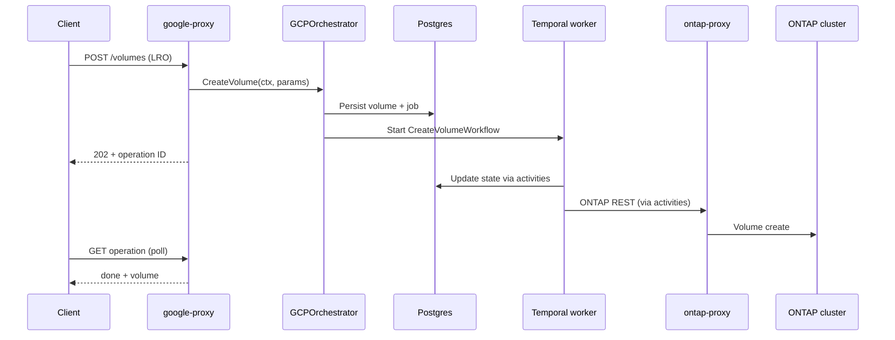

# VCP Architecture Map

High-level mental model for new hires. For deeper design, see `doc/architecture/` and ADRs under `doc/architecture/decisions/`.

## What VCP does

VSA Control Plane (VCP) is the **GCP-facing control plane** for Google Cloud NetApp Volumes (GCNV). It:

- Exposes the public GCNV REST API (`google-proxy`)
- Persists resource state in **Postgres**
- Orchestrates long-running work via **Temporal** workflows (`worker`)
- Talks to ONTAP clusters through **ontap-proxy** and **VLM** (VSA Lifecycle Manager)
- Integrates with GCP via **hyperscaler/google** (not from `core/` directly)

Downstream SDE services (CVS, CVP, CVN) exist on some request paths; VCP-local triage stays in this repo unless cross-repo mode is enabled in triagebot.

## Services (binaries)

| Service | Path | Role |
|---------|------|------|
| **google-proxy** | `google-proxy/app.go` | Public GCNV REST ingress; validation, LRO responses, calls orchestrator |
| **core** | `core/app.go` | Internal API, schedulers, same orchestrator wiring |
| **worker** | `worker/main.go` | Temporal worker — registers and runs workflows + activities |
| **ontap-proxy** | `ontap-proxy/main.go` | Auth + rule engine; passthrough to ONTAP REST |
| **telemetry** | `telemetry/main.go` | Metrics, billing ingestion, telemetry API |
| **oci-proxy** | `oci-proxy/` | OCI-facing API (parallel hyperscaler path) |

Shared libraries: `common/`, `utils/`, `clients/`, `database/`, `workflow_engine/temporal/`, `hyperscaler/`, `core/models/`, `core/datamodel/`.

## Request → workflow flow (conceptual)

## Layer responsibilities

| Layer | Location | Does | Must not |
|-------|----------|------|----------|
| API handlers | `google-proxy/api/endpoints/`, `oci-proxy/api/` | HTTP validation, auth, LRO wrapping | Long-running I/O |
| Orchestrator | `core/orchestrator/factory/gcp/`, `factory/oci/` | Business rules, DB writes, start workflows | Direct ONTAP calls in hot path (delegates to activities) |
| Workflows | `core/orchestrator/workflows/` | Deterministic orchestration, child workflows | DB/API I/O, `time.Now()` |
| Activities | `core/orchestrator/activities/` | DB, GCP, ONTAP, CVS calls | Complex branching logic |
| Data | `database/vcp/` | GORM models, migrations, repositories | Business orchestration |
| Cloud | `hyperscaler/google/`, `hyperscaler/oci/` | GCP/OCI SDK implementations | Imported from `core/` |

## State and async

- **Postgres** (`database/vcp/`) — pools, volumes, jobs, snapshots, backups, etc.
- **Temporal** — workflow execution; `workflow_id` often aligns with `job_id`
- **Task queues** — e.g. `CustomerTaskQueue`, `BackgroundTaskQueue` (see `workflow_engine/temporal/`)
- **LRO** — Long-running operations; API returns operation name; client polls until `done`

## Hyperscalers

- **GCP** (primary): `core/orchestrator/factory/gcp/`, `google-proxy/`, `hyperscaler/google/`
- **OCI**: `core/orchestrator/factory/oci/`, `oci-proxy/`, `hyperscaler/oci/`

Factory pattern selects orchestrator by provider. New hires on GCP should focus on `factory/gcp/` first.

## Key ADRs (read early)

| ADR | Topic |
|-----|-------|
| `doc/architecture/decisions/0010-temporal-as-orchestrator-engine.md` | Why Temporal |
| `doc/architecture/decisions/0011-slog-logging-framework.md` | Structured logging |
| `doc/architecture/decisions/0002-database-choice-for-vcp.md` | Postgres |
| `doc/architecture/decisions/0003-open-api-3-0-4-for-api-definition.md` | OpenAPI |

## Auto-generated design docs

Resource-centric overviews under `doc/architecture/auto-gen-designs-docs/`:

- `pool-design.md`, `volume-design.md`, `hostgroup-design.md`
- `backup-ecosystem-design.md`, `replication-design.md`, `storage-ecosystem-design.md`

## Observability

- **correlation_id** — propagated API → workflow → activities (see logging ADR)
- **Temporal UI** — local: see `doc/guides/getting-started.md` and `doc/guides/temporal-debugging.md`
- **Prometheus** — `/metrics` on worker, telemetry, proxy
- **Production triage** — `triagebot` (methodology: `/onboard operations`)

## Technical deep dives & root cause

To go deeper: trace failures to the **earliest on-path step**, attribute the **right layer** with evidence, and ship a **proven** fix — not a symptom patch. Curriculum: `/onboard trace volume` → `/onboard trace failure` → `/onboard deep-dive` → `triagebot` on staging → evidence-backed PR. See [deep-dive.md](deep-dive.md).

## Common nouns

| Term | Meaning |
|------|---------|
| **Pool** | Storage pool; backs a VSA cluster |
| **Volume** | Block or file export on a pool |
| **Host group** | Initiator grouping for block access |
| **LRO** | Long-running operation (async API pattern) |
| **VLM** | VSA Lifecycle Manager — cluster lifecycle worker |
| **SDE** | Storage Data Engine — CVS/CVP/CVN services behind some paths |
| **GCNV** | Google Cloud NetApp Volumes (product) |
