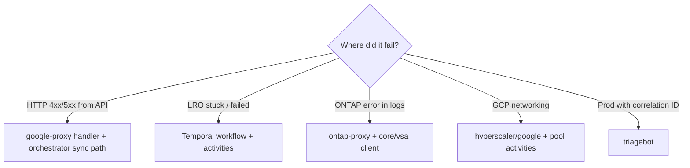

# Debugging Playbook

Local dev failures **and** the bridge to production debugging. For live incidents with a correlation ID, run **`triagebot`** — understand the methodology first via [deep-dive.md](deep-dive.md).

## Debug decision tree



## 1. API layer (synchronous errors)

**Symptoms:** Immediate 400/409/500; no operation ID or operation never created.

**Look at:**
- `google-proxy/api/endpoints/*_endpoint.go` — handler validation
- `core/orchestrator/factory/gcp/*.go` — pre-workflow validation
- `doc/api/error-taxonomy.md` — error code ranges and HTTP mapping

**Logs:** google-proxy / core-api container; search `correlation_id` or `tracking_id`.

## 2. Temporal / workflow failures

**Symptoms:** LRO returned but `done: true` with error; workflow FAILED in UI.

**Local:**
- Temporal UI — http://localhost:8071 (ports vary; see getting-started)
- Worker logs — workflow ID ≈ job ID from DB

**Commands** (from `doc/guides/temporal-debugging.md`):

```bash
# List workflows by type
tctl workflow list --query 'WorkflowType="CreateVolumeWorkflow"'

# History for a failed run
tctl workflow show --workflow-id <job-id>
```

**Code:**
- Workflow: `core/orchestrator/workflows/<resource>_workflow.go`
- Failing activity: stack trace in Temporal history → `core/orchestrator/activities/`
- Retry policy: `utils/setRetryPolicy.go`, `doc/workflows/README.md`

**Rules** (`.cursor/rules/workflow.mdc`):
- Workflows must be deterministic — no direct I/O
- Activities return `TemporalApplicationError` via `vsaerrors.WrapAsTemporalApplicationError`

## 3. Database state

**Check job + resource state:**
- Tables via `database/vcp/` models
- Local MCP postgres tool if configured, or psql against local `vcp` DB

**Correlate:** `job.job_id` = Temporal `workflow_id` for many flows.

## 4. ONTAP / ontap-proxy

**Symptoms:** ONTAP 4xx/5xx, rule engine denials, auth failures.

**Look at:**
- `ontap-proxy/` middleware and rules
- `core/vsa/` — ONTAP REST provider
- `clients/ontap-rest/swagger.yaml` — REST shapes

**Product context:** `/ontap <feature>` for ONTAP behavior, not VCP wiring.

## 5. GCP / networking (pools)

**Symptoms:** Pool stuck CREATING, PSA/peering errors.

**Look at:**
- `core/orchestrator/activities/pool_activities.go`
- `hyperscaler/google/`
- `doc/guides/onboarding.md` — PSA setup

## 6. Production triage (triagebot) — operational core

**This is how GCNV operational issues get solved.** Onboarding is incomplete until you've run triagebot at least once on a real correlation ID.

When you have **correlation ID + project**:

```
triagebot project=netapp-us-c1-staging-sde correlation_id=<uuid>
```

**What triagebot gives you (that ad-hoc log grep does not):**
- Progressive log fetch (correlation → job → resource history)
- Service attribution (VCP / CVS / CVP / CVN)
- Cross-boundary fault analysis (caller vs callee)
- Payload/code verification in the correct repo
- Evidence-confidence gate — earliest on-path failure, not loudest log line

Read `.cursor/rules/triagebot.mdc` and `.cursor/triagebot-agents/README.md`.

**Training:** `/onboard deep-dive` → run triagebot on a staging correlation → compare report to the merged fix.

**Not for:** Happy-path learning — use `/onboard trace volume`.

## 7. Cross-service paths

Some requests flow VCP → CVS → CVP/CVN. Triagebot cross-repo mode (`.cursor/state/memory.md`) expands scope. For onboarding, know the path exists; deep CVS/CVP/CVN study comes with your first cross-service task.

## Logging conventions

- **slog** with `correlation_id`, `workflow_id`, `job_id` (ADR 0011)
- No secrets or PII in logs
- Internal `ERROR` logs ≠ a user-visible failure — check the terminal job/workflow state and whether a 5xx was returned to the caller

## Useful doc links

| Topic | Path |
|-------|------|
| Temporal debugging | `doc/guides/temporal-debugging.md` |
| Error taxonomy | `doc/api/error-taxonomy.md` |
| VCP errors | `core/errors/README.md` |
| Workflow timeouts | `doc/workflows/` per resource |

## Local debug checklist

- [ ] Temporal UI shows workflow — note failed activity name
- [ ] Worker log line matches activity failure
- [ ] Read activity source — what external call failed?
- [ ] Check DB job state vs workflow terminal state
- [ ] If ONTAP: check ontap-proxy logs and `/ontap` for expected behavior
