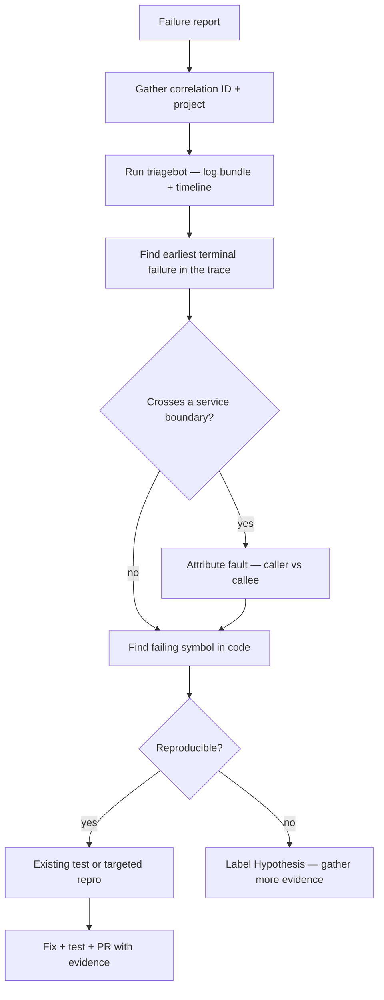

# Technical Deep Dives & Root Cause Analysis

Onboarding teaches **how the system works**. This module teaches **how it fails** and **how to prove the real root cause before writing a single line of fix code**.

The goal: go from "volume create returned an error" → pinpoint the exact layer, operation, and code path → write a fix that addresses the proven cause, not the symptom.

---

## Why real root cause matters

Fixing a symptom (retry more, increase timeout, suppress error) leaves the underlying bug in place. It resurfaces under different conditions, harder to trace the second time.

The bar for any fix in this repo:
1. Identify the **earliest on-path failure** — not the loudest log line
2. Attribute it to the **right layer** (API? workflow? activity? ONTAP? downstream service?)
3. **Prove** it with log evidence or a failing test
4. Fix **that** — not what looks plausible

---

## How failures surface in VCP (mental model)

Every user-facing operation follows one of two shapes:

```
Shape 1 — Synchronous (immediate response):
  Client → google-proxy handler → orchestrator validation → error returned

Shape 2 — Async LRO (operation ID returned, then polled):
  Client → google-proxy → orchestrator → DB + Temporal workflow started
                                          ↓
                                    activities run
                                          ↓
                                    LRO done: success | error
```

**Where you look depends on which shape failed:**

| Failure symptom | Shape | First place to look |
|-----------------|-------|---------------------|
| Immediate 4xx / 5xx, no operation ID | 1 | `google-proxy/api/endpoints/`, orchestrator validation |
| Operation created, LRO done with error | 2 | Temporal UI → failed activity → `core/orchestrator/activities/` |
| LRO never completes (stuck) | 2 | Worker logs, Temporal workflow history, downstream service |
| Error in logs but LRO succeeded | 2 | Check terminal state — may be a recovered transient |

---

## The RCA ladder (always follow this order)



**Rules:**
- Never declare root cause from a single log line if later logs show recovery
- Never blame a downstream service without validating the request it received was valid
- `ERROR` in logs ≠ user-visible failure — check the **terminal** job/workflow state
- Resource-history logs (pass-3 in triagebot) describe the resource's past, not this request

---

## Layer-by-layer failure guide

### 1. API layer (synchronous)

**Symptoms:** Immediate 4xx/5xx; no operation created.

**Files:**
- `google-proxy/api/endpoints/*_endpoint.go` — handler validation, feature flags
- `core/orchestrator/factory/gcp/*.go` — pre-workflow validation (pool exists, zone match, etc.)
- `doc/api/error-taxonomy.md` — which error codes map to which HTTP status

**Log field:** `tracking_id` on error responses; `correlation_id` throughout.

### 2. Workflow layer

**Symptoms:** LRO returns but `done: true` with error. Temporal shows FAILED.

**Triagebot does this automatically, but manually:**

```bash
# Local Temporal
tctl workflow show --workflow-id <job-id>

# List by type
tctl workflow list --query 'WorkflowType="CreateVolumeWorkflow"'
```

**Files:**
- `core/orchestrator/workflows/<resource>_workflow.go` — orchestration logic
- Workflow = deterministic; no I/O; any failure here is likely from a child activity

**Key rule:** A failed workflow is almost always a failed *activity*. Read the activity name from Temporal history, then jump to its implementation.

### 3. Activity layer

**Symptoms:** Activity stack trace in Temporal history; activity timed out or returned error.

**Files:**
- `core/orchestrator/activities/<resource>_activities.go`
- Activities do DB reads/writes, GCP calls, ONTAP calls — find which external call returned the error

**Error type:** Activities return `TemporalApplicationError` — check whether it's marked `NonRetryable`. If not, the workflow has already retried multiple times before failing.

### 4. ONTAP layer

**Symptoms:** ONTAP REST 4xx/5xx in activity logs.

**Files:**
- `core/vsa/volume.go`, `core/vsa/pool.go`, etc. — REST client
- `ontap-proxy/` — rule engine, auth, passthrough

**For expected behavior:** `/ontap <feature>` (e.g. `/ontap snapmirror` for replication ONTAP semantics).

**Common cases:**
- `409 Conflict` — resource already exists; check idempotency in the activity
- `500` — ONTAP cluster issue; check cluster health, not VCP code
- Auth failure — ontap-proxy credentials or rule engine denial

### 5. GCP / hyperscaler layer

**Symptoms:** Pool stuck CREATING, PSA peering error, GCP operation failure.

**Files:**
- `core/orchestrator/activities/pool_activities.go`
- `hyperscaler/google/` — GCP SDK calls

**Verification:** triagebot extracts Google operation IDs; verify with `gcloud ... operations describe`.

### 6. Cross-service (CVS / CVP / CVN)

**Symptoms:** VCP workflow failed after forwarding to SDE.

**Rule:** Never blame CVS/CVP/CVN without confirming VCP sent a valid request. Check boundary in triagebot cross-boundary verifier output.

**How:** Run `triagebot` with `cross_repo=true` in `.cursor/state/memory.md`. Triagebot fetches CVS/CVP/CVN logs, runs service specialists, and attributes fault (caller vs callee vs boundary).

---

## Deep dive exercises (do these in order)

### Exercise 1 — Happy path trace

Follow [golden-paths.md](golden-paths.md) Path 1 (volume create). Open each file in order. Understand what happens when everything works.

**Done when:** You can describe each step without looking at the file list.

### Exercise 2 — Failure surface trace

Follow [golden-paths.md](golden-paths.md) Path 4 (volume create failure). For each layer in the table, answer:
- What does the error look like from the caller's perspective?
- What evidence would you collect?
- What file would you read first?

**Done when:** You can fill in the failure table row from memory.

### Exercise 3 — Live triagebot run

Pick a resolved staging ticket with a correlation ID. Run:

```
triagebot project=<project> correlation_id=<uuid>
```

Compare the report to the actual fix that was merged. Answer:
1. Did triagebot identify the correct failed step?
2. Did the fix address the root cause triagebot pointed to?
3. If they differ — why?

**Done when:** You can explain the delta between the triage report and the fix.

### Exercise 4 — Write a targeted test first

Pick a small bug or edge case in `core/orchestrator/activities/` or a handler. Before fixing:
1. Write a test that demonstrates the bug (it should fail)
2. Fix the code
3. Confirm the test passes

**Done when:** PR has a failing-then-passing test that proves root cause.

---

## Common patterns that look like root cause but aren't

| What you see | What's actually happening | Real root cause location |
|---|---|---|
| Last ERROR line before failure | Recovery happened after; not the root cause | Earlier in the trace |
| CVS/ONTAP returned 5xx | Downstream failure | Check if VCP sent a valid request first |
| "Activity timeout" | Downstream stalled | Find *which* external call was slow |
| Retry exhausted | Multiple transient failures | Find *why* the first call failed |
| Resource history ERROR (pass-3 in triagebot) | Unrelated past event | Look only at correlation/job pass logs |

---

## From diagnosis to PR

Once root cause is proven:

1. **Isolate the symbol** — function, method, or activity step where fix belongs
2. **Check design doc** — `doc/architecture/designs/` or `doc/workflows/` — confirm expected behavior
3. **Write test first** when the bug is deterministic (handler, activity unit test)
4. **Fix minimal surface** — one root cause per PR
5. **PR description must include:**
   - What failed (correlation ID or repro steps)
   - Which layer / file / symbol
   - Why this change fixes it (not just what it changes)
   - How you verified (test name, or `tctl workflow show` output)

See [contribution-guide.md](contribution-guide.md) for PR standards.

---

## Quick reference

| Need | Tool / file |
|------|-------------|
| Log fetch + timeline for an incident | `triagebot` |
| Temporal workflow history | `doc/guides/temporal-debugging.md` |
| Error code meanings | `doc/api/error-taxonomy.md` |
| VCP error library | `core/errors/README.md` |
| Retry / timeout values | `doc/workflows/` per resource |
| ONTAP expected behavior | `/ontap <feature>` |
| Cross-service (CVS/CVP/CVN) | `triagebot` cross-repo mode |
| Code trace for volume create | [golden-paths.md](golden-paths.md) |
