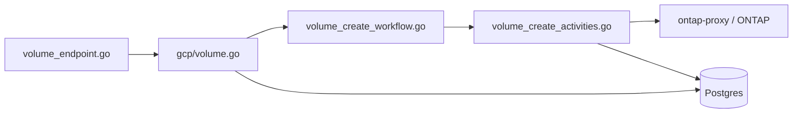

# Golden Paths — Code Traces

Step-by-step traces for the two flows every new hire should walk once.

## Path 1: Volume create (recommended first)

### Narrative

Customer calls GCNV API → google-proxy validates → GCP orchestrator persists volume + job → Temporal `CreateVolumeWorkflow` runs → activities hit DB and ONTAP → LRO completes.

### Trace (read in order)

| Step | File | Symbol / area | What happens |
|------|------|---------------|--------------|
| 1 | `google-proxy/api/endpoints/volume_endpoint.go` | `V1betaCreateVolume` | HTTP handler: validation, pool lookup, param prep |
| 2 | same | `prepareCreateVolumeParams` | Maps API request → `common.CreateVolumeParams` |
| 3 | `core/orchestrator/factory/gcp/volume.go` | `CreateVolume` → `_createVolume` | Validates pool/zone, creates DB records, starts workflow |
| 4 | `core/orchestrator/workflows/volume_create_workflow.go` | `CreateVolumeWorkflow` | Main workflow entry; selects block vs file child workflows |
| 5 | `core/orchestrator/activities/volume_create_activities.go` | `VolumeCreateActivity` | DB + ONTAP side effects |
| 6 | `core/vsa/volume.go` | `OntapRestProvider.CreateVolume` | ONTAP REST client layer |
| 7 | `database/vcp/volumes.go` | `CreateVolume` | Persistence |

### Diagram

### Doc companions

- `doc/workflows/core/volume-workflows.md` — workflow phases and child workflows
- `doc/api/resources/volumes.md` — API contract and LRO behavior
- `doc/architecture/auto-gen-designs-docs/volume-design.md` — design overview

### Exercise

1. Open `volume_create_workflow.go` and find `CreateVolumeWorkflow`.
2. Identify which **child workflow** runs for a NAS vs SAN volume.
3. Pick one activity call in `Run()` and jump to its implementation in `volume_create_activities.go`.
4. Answer: where would a validation error return **before** Temporal starts?

**Answer hint:** Orchestrator layer (`_createVolume` in `gcp/volume.go`) and API handler (`V1betaCreateVolume`) — synchronous 4xx paths.

---

## Path 2: Pool create

### Narrative

Pool create provisions a VSA cluster (via VLM/SDE path). It is heavier than volume create but teaches cluster + network concepts.

### Trace (read in order)

| Step | File | Symbol / area | What happens |
|------|------|---------------|--------------|
| 1 | `google-proxy/api/endpoints/pool_endpoints.go` | Create pool handler | API ingress + LRO |
| 2 | `core/orchestrator/factory/gcp/pool.go` | Pool orchestration | Validation, DB, workflow start |
| 3 | `core/orchestrator/workflows/pool_workflows.go` | Pool workflows | Cluster provisioning orchestration |
| 4 | `core/orchestrator/activities/pool_activities.go` | Pool activities | GCP networking, cluster ops |
| 5 | `hyperscaler/google/` | Provider impl | GCP API calls (not from `core/` directly in new code) |

### Doc companions

- `doc/workflows/core/pool-workflows.md`
- `doc/api/resources/pools.md`
- `doc/architecture/auto-gen-designs-docs/pool-design.md`
- `doc/guides/onboarding.md` §4 — create first pool via CCFE autopush API (consumer project)

### Exercise

1. Read `doc/api/resources/pools.md` create section — note LRO response shape.
2. Skim `pool_workflows.go` for the create workflow name registered with Temporal.
3. List three activities the pool workflow invokes (any three).

---

## Path 3: Host group → volume (local validation)

After setup (`doc/guides/getting-started.md`):

1. Create pool (CCFE or local proxy)
2. Create host group — `hostgroup_workflow.go`, `doc/api/resources/hostgroups.md`
3. Create volume — Path 1 above
4. Mount / validate per getting-started §6+

This connects API resources in the order customers use them.

---

## Path 4: Volume create failure (operational / PE bar)

Trace the **same path as Path 1**, but ask at each layer: *where does this error surface to the customer, and what evidence would prove it?*

| Layer | Failure surfaces as | Evidence to collect |
|-------|---------------------|---------------------|
| API handler | Sync 4xx/5xx (no LRO) | google-proxy log, `tracking_id`, HTTP body |
| Orchestrator | Sync 4xx/5xx or wrapped error | core log before workflow start |
| Workflow | LRO `done: true` + error | Temporal history — **failed activity name** |
| Activity | Retry then terminal fail | Activity stack, downstream status code |
| ONTAP | 409/5xx in activity log | ontap-proxy log, ONTAP message |
| SDE (CVS) | CVS container ERROR | triagebot cross-repo bundle |

**Exercise:** Given a failed volume create correlation ID, run `triagebot` and map the report's **failed step** back to one row in this table.

Full RCA methodology: [deep-dive.md](deep-dive.md).

---

## What to skip on day one

- Replication hybrid fallbacks (`replicationWorkflows/`)
- Background cleanup and auto-tiering cron paths
- OCI factory unless on OCI team
- Expert mode / ontap-proxy rule engine internals

Return to these when your first task touches them.
