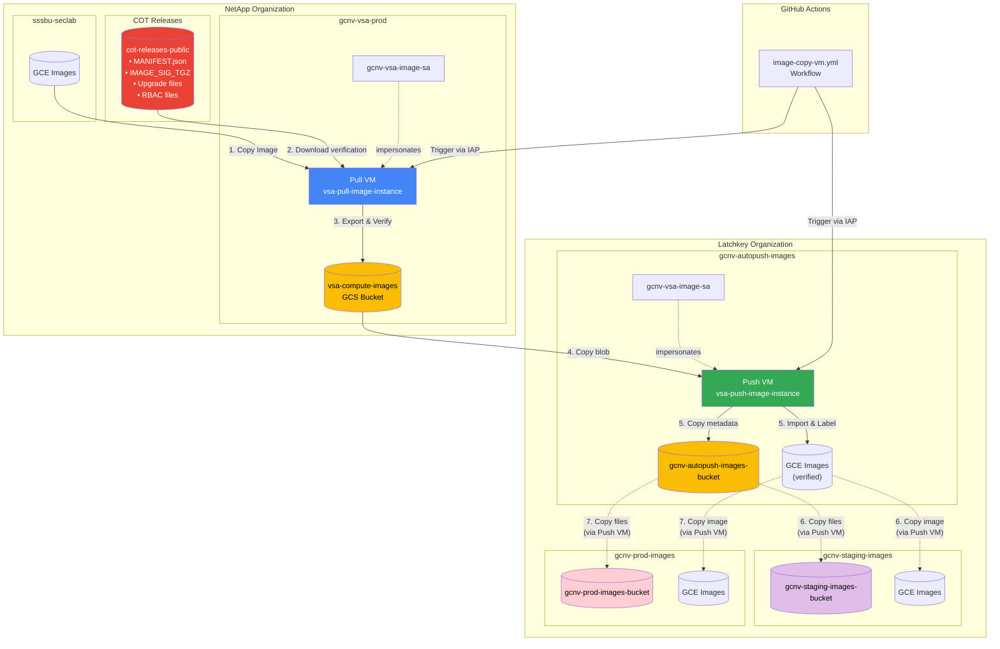
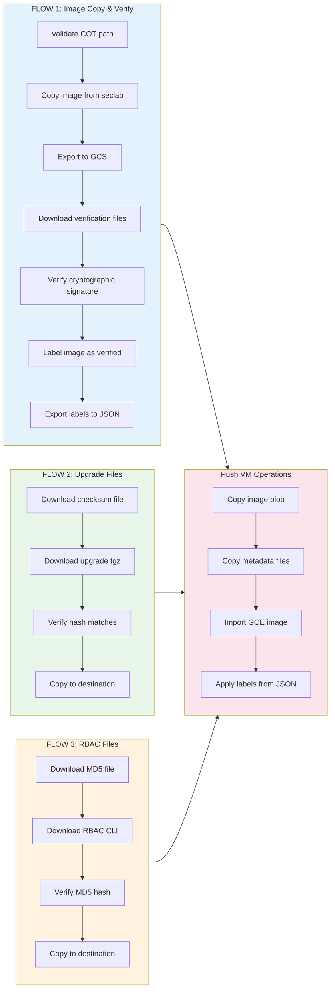
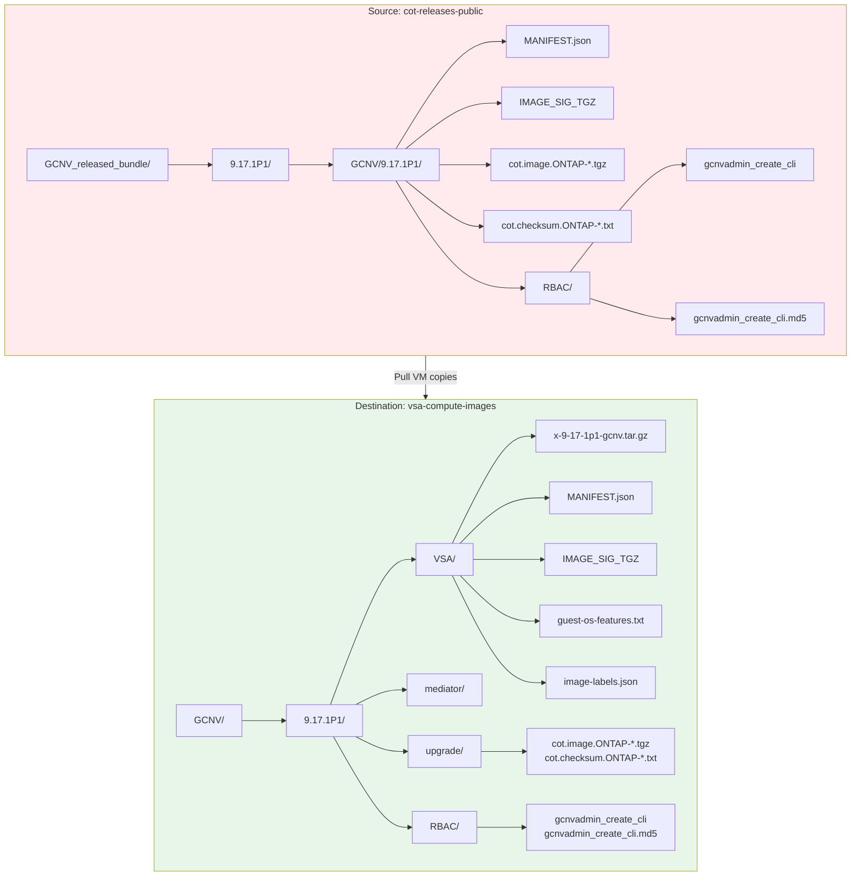

# VSA Image Management

Automated GCE image copying infrastructure for VSA (Virtual Storage Appliance) workloads across organizations.

## Overview

This repository manages the complete workflow for copying GCE compute images across Google Cloud Platform projects and organizations with two distinct flows:

**Full Flow (Autopush)**: `sssbu-seclab` (netapp.org) → `gcnv-vsa-prod` (netapp.org) → `gcnv-autopush-images` (latchkey.org)
- Includes cryptographic verification using Chain of Trust (COT)
- Copies verification files, upgrade files, and RBAC files
- Runs on Pull VM and Push VM

**Copy Flow (Staging/Prod)**: `gcnv-autopush-images` → `gcnv-staging-images` / `gcnv-prod-images` (latchkey.org)
- Direct image copy from verified autopush images
- No verification (images already verified in autopush)
- Runs on Push VM (in gcnv-autopush-images project)
- Bucket configuration managed via Terraform from config.yaml

## Deployment Stages

### Three-Stage Image Deployment

1. **Autopush** (`gcnv-autopush-images`)
   - **Flow:** Full validation flow with Chain of Trust (COT)
   - **Process:** seclab → Pull VM → Push VM → autopush
   - **Verification:** Cryptographic signature validation, checksum verification
   - **Files:** Image + MANIFEST.json + IMAGE_SIG_TGZ + upgrade files + RBAC files
   
2. **Staging** (`gcnv-staging-images`)
   - **Flow:** Direct copy from autopush (no validation)
   - **Process:** Push VM copies from autopush → staging
   - **Verification:** None (images already verified in autopush)
   - **Files:** Copies all files from autopush (image + metadata + upgrade + RBAC)
   
3. **Production** (`gcnv-prod-images`)
   - **Flow:** Direct copy from autopush (no validation)
   - **Process:** Push VM copies from autopush → prod
   - **Verification:** None (images already verified in autopush)
   - **Files:** Copies all files from autopush (image + metadata + upgrade + RBAC)

**Key Design Decision:** Only autopush receives images with full COT validation. Staging and prod receive pre-verified images from autopush, eliminating redundant verification while maintaining security through the single source of truth (autopush).

## Architecture

### High-Level Architecture Diagram



### Detailed Flow Diagram



### Bucket Structure Diagram



### Two-VM Architecture (Production)

The system uses **two separate VMs** in different projects with different service accounts:

#### VM 1: Pull VM (in gcnv-vsa-prod)
- **Purpose:** Pull images from sssbu-seclab to gcnv-vsa-prod, export to GCS with COT verification
- **Service Account:** `gcnv-vsa-image-sa@gcnv-vsa-prod.iam.gserviceaccount.com`
- **Script:** `pull-image.py`
- **Bucket:** `vsa-compute-images`
- **Flow:** FLOW 1 (Full validation with COT)

#### VM 2: Push VM (in gcnv-autopush-images)
- **Dual Purpose:**
  1. **Push to Autopush** - Copy images from gcnv-vsa-prod bucket to gcnv-autopush-images, import with verification
  2. **Copy to Higher Envs** - Copy verified images from autopush to staging/prod (no validation)
- **Service Account:** `gcnv-vsa-image-sa@gcnv-autopush-images.iam.gserviceaccount.com`
- **Scripts:** `push-image.py` (autopush), `copy-image.py` (staging/prod)
- **Buckets:** 
  - Autopush: `gcnv-autopush-images-bucket`
  - Staging/Prod: Configured via Terraform from config.yaml (`BUCKET_*` env vars)
- **Flows:** 
  - FLOW 1: Full validation (autopush)
  - FLOW 2: Direct copy (staging/prod)

### Legacy Deployment Options

1. **Cloud Function (Serverless)** - Gen2 HTTP-triggered function (single-step, deprecated)
2. **VM-Based (Single VM)** - Debian 12 VM with combined operation (deprecated)

### Workflow Pipeline

#### Part 1: Pull VM (seclab → netapp org)

The pull script supports **three independent flows** that can be enabled/disabled via command-line arguments:

**FLOW 1: Copy and Verify Image** (enabled with `--cot-bucket-path`)
```
1. Validate COT bucket path contains required verification files (MANIFEST.json, IMAGE_SIG_TGZ)
2. Check image exists in sssbu-seclab
3. Pull image from sssbu-seclab to gcnv-vsa-prod
4. Export image to vsa-compute-images bucket using COT structure:
   GCNV/{version}/{component}/{image}.tar.gz
   - VSA images: GCNV/9.17.1P1/VSA/x-9-17-1p1-gcnv.tar.gz
   - Mediator: GCNV/9.17.1P1/mediator/cvo-mediator-x-9-17-1p1.tar.gz
5. Save guest-os-features to bucket as comma-separated text file:
   - Fetches guest-os-features from image in gcnv-vsa-prod
   - Creates guest-os-features.txt with comma-separated feature names
   - Uploads to GCNV/{version}/{component}/guest-os-features.txt
6. Copy verification files from COT bucket to destination bucket:
   - MANIFEST.json (image metadata and name verification)
   - IMAGE_SIG_TGZ (signatures and certificates)
7. Verify image integrity using cryptographic signature validation:
   - Download image tar.gz from GCS bucket
   - Extract disk.raw and generate SHA256 hash
   - Verify image name in MANIFEST.json
   - Extract certificate and signature files from IMAGE_SIG_TGZ
   - Validate digest using OpenSSL cryptographic verification
8. Label verified image with verification metadata:
   - Applies label: image_digest_verified=true
   - Applies label: checksum=<sha256-of-IMAGE_SIG_TGZ>
9. Save image labels to bucket as JSON for cross-org propagation
10. Re-export labeled image to ensure labels are in tar.gz
```

**FLOW 2: Copy Upgrade Files** (enabled with `--upgrade-bucket-path`, VSA only)
```
1. Check if upgrade files already exist in destination (log and overwrite if exist)
2. Download and verify cot.checksum.ONTAP-{version}.txt checksum
3. Download cot.image.ONTAP-{version}.tgz and verify hash matches
4. Copy verified upgrade files to GCNV/{version}/upgrade/
```

**FLOW 3: Copy RBAC Files** (enabled with `--rbac-bucket-path`, VSA only)
```
1. Check if RBAC files already exist in destination (log and overwrite if exist)
2. Download and verify gcnvadmin_create_cli.md5 checksum
3. Download gcnvadmin_create_cli and verify MD5 hash matches
4. Copy verified RBAC files to GCNV/{version}/RBAC/
```

#### Part 2: Push VM (netapp org → latchkey org)
```
1. Verify image exists in vsa-compute-images bucket
2. Copy image blob to gcnv-autopush-images-bucket using same structure
3. Copy metadata files to destination bucket:
   - MANIFEST.json (image metadata and name verification)
   - IMAGE_SIG_TGZ (signatures and certificates)
   - guest-os-features.txt (comma-separated feature list)
   - image-labels.json (image labels including verification status)
   - For VSA images, copies upgrade directory files (COT upgrade files)
   - For VSA images, copies RBAC directory files (admin CLI tools)
4. Load guest-os-features from guest-os-features.txt in destination bucket
5. Import compute image in gcnv-autopush-images with guest-os-features:
   - Reads features from text file (no compute.images.get permission needed)
   - VSA features: UEFI_COMPATIBLE, GVNIC
   - Mediator features: UEFI_COMPATIBLE, GVNIC, VIRTIO_SCSI_MULTIQUEUE, 
     SEV_CAPABLE, SEV_LIVE_MIGRATABLE_V2
6. Apply image labels from image-labels.json:
   - Loads labels from JSON file in destination bucket
   - Applies verification labels: image_digest_verified=true, checksum=<sha256>
   - No cross-org API calls needed - reads from bucket
   - Labels applied immediately after image import
```

## Repository Structure

```
.
├── src/
│   ├── pull-image.py        # Part 1: Pull from seclab to netapp org
│   ├── push-image.py        # Part 2: Push from netapp to latchkey org (autopush)
│   ├── copy-image.py        # Part 3: Copy from autopush to staging/prod
│   ├── run-pull.sh          # Wrapper for pull-image.py
│   ├── run-push.sh          # Wrapper for push-image.py
│   ├── run-copy.sh          # Wrapper for copy-image.py
│   ├── main.py              # Legacy: Combined operation (deprecated)
│   └── requirements.txt     # Python dependencies
├── terraform/
│   ├── config.yaml          # Multi-project deployment configuration
│   ├── main.tf              # Root module with for_each deployment
│   ├── modules/
│   │   ├── vsa-pull-image-vm/  # Pull VM module (gcnv-vsa-prod)
│   │   ├── vsa-push-image-vm/  # Push VM module (multi-project support)
│   │   ├── github-workload-identity/  # GitHub Actions WIF module
│   │   ├── vsa-copy-image-cf/  # Legacy: Cloud Function
│   │   └── vsa-copy-image-vm/  # Legacy: Single VM
│   ├── nonprod/
│   │   └── gcnv-vsa-prod.yaml  # Non-production configuration
│   └── prod/
│       └── gcnv-vsa-prod.yaml  # Production configuration
├── .github/
│   └── workflows/
│       ├── image-copy-vm.yml   # Main workflow: Two-flow architecture (autopush + staging/prod)
│       ├── image-copy-cf.yml   # Legacy: Cloud Function triggering (deprecated)
│       └── README.md           # Workflow setup documentation
├── setup-permissions.sh        # Automated IAM permissions setup
└── README.md                   # This file
```

## Quick Start

### Deploy Infrastructure

```bash
cd terraform

# Initialize Terraform with GCS backend
terraform init -backend-config="bucket=gcnv-vsa-prod-tfstate"

# Deploy all infrastructure (Pull VM + Push VM + WIF + IAM)
terraform apply -var="data=./config.yaml"

# Or deploy specific modules
terraform apply -target=module.vsa_pull_image_vm -var="data=./config.yaml"     # Pull VM only
terraform apply -target=module.vsa_push_image_vm -var="data=./config.yaml"    # Push VM only (autopush)
```

**What gets deployed:**
- **Pull VM** in `gcnv-vsa-prod` (pulls from seclab with COT verification)
- **Push VM** in `gcnv-autopush-images` (pushes to autopush + copies to staging/prod)
- **GitHub Workload Identity Federation** for both VMs
- **IAM permissions** for cross-project and cross-org access
- **Bucket mappings** as environment variables on Push VM (from config.yaml)

**Note:** Only `gcnv-autopush-images` gets a dedicated Push VM. Staging and prod environments use the same Push VM via environment variable configuration.

```

> **⚠️ Important:** VMs have **no external IPs** for security compliance. All SSH access requires **IAP tunneling** using the `--tunnel-through-iap` flag.

### Run Image Copy Workflow

#### Option 1: Via GitHub Actions (Recommended)

The workflow supports two distinct flows based on the `push_vm_project` parameter:

**Full Flow (Autopush)** - With validation:
```bash
gh workflow run image-copy-vm.yml \
  -f image_name=x-9-17-1p1-gcnv \
  -f push_vm_project=gcnv-autopush-images \
  -f cot_bucket_path=GCNV_released_bundle/GCNV/9.17.1P1 \
  -f upgrade_bucket_path=GCNV_released_bundle/GCNV/9.17.1P1 \
  -f rbac_bucket_path=GCNV_released_bundle/9.17.1P1/RBAC
```

**Copy Flow (Staging/Prod)** - No validation:
```bash
# Copy to staging
gh workflow run image-copy-vm.yml \
  -f image_name=x-9-17-1p1-gcnv \
  -f push_vm_project=gcnv-staging-images

# Copy to prod
gh workflow run image-copy-vm.yml \
  -f image_name=x-9-17-1p1-gcnv \
  -f push_vm_project=gcnv-prod-images
```

**Workflow Parameters:**
- `image_name` (required): Name of the image to copy (e.g., 'x-9-17-1p1-gcnv')
- `push_vm_project` (required): Target project - determines flow type
  - `gcnv-autopush-images`: Full flow with COT validation
  - `gcnv-staging-images` or `gcnv-prod-images`: Direct copy from autopush
- `cot_bucket_path` (required for autopush): COT verification files path
- `upgrade_bucket_path` (optional for autopush): Upgrade files path (VSA only)
- `rbac_bucket_path` (optional for autopush): RBAC files path (VSA only)

**Note:** Staging/prod copies ignore COT/upgrade/RBAC paths - they copy pre-verified images from autopush

#### Option 2: Manual Execution

##### Step 1: Pull Image (seclab → netapp org)

```bash
# SSH into Pull VM
gcloud compute ssh vsa-pull-image-instance \
  --zone=us-central1-a \
  --project=gcnv-vsa-prod

# Run all three flows (image + upgrade + RBAC) - using relative paths
# COT_RELEASES_BUCKET env var (cot-releases-public) is prepended automatically
sudo /opt/vsa-pull-image/run-pull.sh x-9-17-1p1-gcnv \
  --cot-bucket-path=GCNV_released_bundle/9.17.1P1/GCNV/9.17.1P1 \
  --upgrade-bucket-path=GCNV_released_bundle/9.17.1P1/GCNV/9.17.1P1 \
  --rbac-bucket-path=GCNV_released_bundle/9.17.1P1/GCNV/9.17.1P1/RBAC

# Alternative: Run all three flows with full paths (explicit bucket)
sudo /opt/vsa-pull-image/run-pull.sh x-9-17-1p1-gcnv \
  --cot-bucket-path=cot-releases-public/GCNV_released_bundle/9.17.1P1/GCNV/9.17.1P1 \
  --upgrade-bucket-path=cot-releases-public/GCNV_released_bundle/9.17.1P1/GCNV/9.17.1P1 \
  --rbac-bucket-path=cot-releases-public/GCNV_released_bundle/9.17.1P1/GCNV/9.17.1P1/RBAC

# Run only image copy and verification (FLOW 1)
sudo /opt/vsa-pull-image/run-pull.sh x-9-17-1p1-gcnv \
  --cot-bucket-path=cot-releases-public/GCNV_released_bundle/9.17.1P1/GCNV/9.17.1P1

# Run only upgrade files copy (FLOW 2)
sudo /opt/vsa-pull-image/run-pull.sh x-9-17-1p1-gcnv \
  --upgrade-bucket-path=cot-releases-public/GCNV_released_bundle/9.17.1P1/GCNV/9.17.1P1

# Run only RBAC files copy (FLOW 3)
sudo /opt/vsa-pull-image/run-pull.sh x-9-17-1p1-gcnv \
  --rbac-bucket-path=cot-releases-public/GCNV_released_bundle/9.17.1P1/GCNV/9.17.1P1/RBAC

# Check logs
tail -f /opt/vsa-pull-image/vsa-image-pull.log
```

**Pull Script Arguments:**
- `image_name` (required): Name of the image (e.g., 'x-9-17-1p1-gcnv')
- `--cot-bucket-path`: Enables FLOW 1 - image copy and verification
  - Full path format: `bucket/path` (e.g., `cot-releases-public/GCNV_released_bundle/9.17.1P1/...`)
  - Relative path format: `path` only (e.g., `GCNV_released_bundle/9.17.1P1/...`)
  - When relative path is used, `COT_RELEASES_BUCKET` env var is prepended automatically
- `--upgrade-bucket-path`: Enables FLOW 2 - upgrade files copy with checksum verification (format: bucket/path)
- `--rbac-bucket-path`: Enables FLOW 3 - RBAC files copy with MD5 verification (format: bucket/path)

> **Note:** Each flow is independent. You can run any combination of flows by specifying the corresponding bucket path arguments.

##### Step 2: Push Image (netapp org → latchkey org)

```bash
# SSH into Push VM (using IAP tunnel - no external IP)
gcloud compute ssh vsa-push-image-instance \
  --zone=us-central1-a \
  --project=gcnv-autopush-images \
  --tunnel-through-iap

# Run push script
sudo /opt/vsa-push-image/run-push.sh mediator

# Check logs
tail -f /opt/vsa-push-image/vsa-image-push.log
```

##### Step 3: Copy Image to Staging/Prod (autopush → higher envs)

```bash
# SSH into Push VM (same VM, in gcnv-autopush-images)
gcloud compute ssh vsa-push-image-instance \
  --zone=us-central1-a \
  --project=gcnv-autopush-images \
  --tunnel-through-iap

# Copy to staging (bucket name read from environment variable)
sudo /opt/vsa-push-image/run-copy.sh x-9-17-1p1-gcnv gcnv-staging-images

# Copy to prod (bucket name read from environment variable)
sudo /opt/vsa-push-image/run-copy.sh x-9-17-1p1-gcnv gcnv-prod-images

# Check logs
tail -f /opt/vsa-push-image/vsa-image-copy.log
```

**Copy Script Arguments:**
- `image_name` (required): Name of the image (e.g., 'x-9-17-1p1-gcnv')
- `destination_project` (required): Target project (gcnv-staging-images or gcnv-prod-images)
- `destination_bucket` (optional): Destination bucket name (if not provided, reads from environment variable `BUCKET_<PROJECT_NAME>`)

**Environment Variables (set automatically by Terraform):**
- `BUCKET_GCNV_STAGING_IMAGES=gcnv-staging-images-bucket`
- `BUCKET_GCNV_PROD_IMAGES=gcnv-prod-images-bucket`

**What the copy script does:**
1. Checks if source image exists in gcnv-autopush-images
2. Copies image tarball from autopush bucket to destination bucket
3. Copies verification files (MANIFEST.json, IMAGE_SIG_TGZ, guest-os-features.txt, image-labels.json)
4. Imports compute image from bucket with guest-os-features and labels
5. For VSA images: copies upgrade/ and RBAC/ directories
6. For Mediator images: only copies image and verification files (no upgrade/RBAC)
```

### Legacy Deployment Options

<details>
<summary>Click to expand legacy single-VM and Cloud Function deployment instructions</summary>

#### Option 1: Deploy Cloud Function (Deprecated)

```bash
cd terraform
terraform init
terraform plan -var="data=./prod/gcnv-vsa-prod.yaml"
terraform apply -var="data=./prod/gcnv-vsa-prod.yaml"
```

#### Option 2: Deploy Single VM (Deprecated)

```bash
cd terraform
terraform init
terraform apply -target=module.vsa_copy_image_vm -var="data=./prod/gcnv-vsa-prod.yaml"
```

</details>

## Configuration

### YAML Configuration Format (config.yaml)

The Terraform configuration uses a nested YAML structure supporting multiple Push VM projects:

```yaml
# Pull VM Configuration (seclab -> netapp org)
pull:
  gcnv-vsa-prod:
    region: "us-central1"
    zone: "us-central1-a"
    service_account_email: "gcnv-vsa-image-sa@gcnv-vsa-prod.iam.gserviceaccount.com"
    source_image_project_id: "sssbu-seclab"
    source_bucket_name: "vsa-compute-images"
    cot_releases_bucket: "cot-releases-public"  # COT bucket for verification files
    network: "default"

# Push VM Configuration (netapp org -> latchkey autopush)
# Only autopush has a dedicated Push VM
push:
  gcnv-autopush-images:
    region: "us-central1"
    zone: "us-central1-a"
    environment: "autopush"
    service_account_email: "gcnv-vsa-image-sa@gcnv-autopush-images.iam.gserviceaccount.com"
    destination_bucket_name: "gcnv-autopush-images-bucket"
    network: "default"

# Copy Configuration (autopush -> staging/prod)
# Higher environments use copy flow (no validation, reuses Push VM from autopush)
copy:
  gcnv-staging-images:
    environment: "staging"
    region: "us-central1"
    zone: "us-central1-a"
    # SA from different project (gcnv-artifact-registry) - will use existing, not create
    service_account_email: "vsa-image-importer@gcnv-artifact-registry.iam.gserviceaccount.com"
    destination_bucket_name: "gcnv-staging-images-bucket"
    network: "default"
  gcnv-prod-images:
    environment: "prod"
    region: "us-central1"
    zone: "us-central1-a"
    # SA from different project (gcnv-artifact-registry) - will use existing, not create
    service_account_email: "vsa-image-importer@gcnv-artifact-registry.iam.gserviceaccount.com"
    destination_bucket_name: "gcnv-prod-images-bucket"
    network: "default"
```

### Push VM Deployment

The Push VM is deployed only to `gcnv-autopush-images` project and serves two purposes:

1. **Push to Autopush** (Full validation flow):
   - Receives images from Pull VM (netapp.org)
   - Imports to gcnv-autopush-images with full verification
   
2. **Copy to Higher Environments** (Staging/Prod):
   - Copies verified images from autopush to staging/prod
   - No validation (images already verified)
   - Bucket names configured via Terraform from `copy` node in config.yaml
   - Environment variables set automatically: `BUCKET_GCNV_STAGING_IMAGES`, `BUCKET_GCNV_PROD_IMAGES`

**Key features:**
- **Single VM**: Only autopush gets a dedicated Push VM (not staging/prod)
- **Project-specific buckets**: Scripts bucket per project (`vsa-push-image-{project_id}-scripts`)
- **External SA support**: If `service_account_email` is from a different project, uses existing SA
- **Network lookup**: Uses existing network via data source (network must exist)
- **Default labels**: All resources inherit labels from root Terraform provider

### Environment Variables

#### Pull VM Environment Variables (automatically set):
- `SOURCE_IMAGE_PROJECT_ID` - sssbu-seclab
- `DESTINATION_PROJECT_ID` - gcnv-vsa-prod
- `DESTINATION_BUCKET_NAME` - vsa-compute-images
- `SERVICE_ACCOUNT_EMAIL` - gcnv-vsa-image-sa@gcnv-vsa-prod.iam.gserviceaccount.com
- `COT_RELEASES_BUCKET` - cot-releases-public (configurable via config.yaml)

#### Push VM Environment Variables (automatically set):
- `SOURCE_BUCKET_NAME` - vsa-compute-images
- `SOURCE_BUCKET_PROJECT_ID` - gcnv-vsa-prod
- `DESTINATION_BUCKET_NAME` - gcnv-autopush-images-bucket
- `DESTINATION_PROJECT_ID` - gcnv-autopush-images
- `SERVICE_ACCOUNT_EMAIL` - gcnv-vsa-image-sa@gcnv-autopush-images.iam.gserviceaccount.com
- `BUCKET_GCNV_STAGING_IMAGES` - gcnv-staging-images-bucket (from config.yaml)
- `BUCKET_GCNV_PROD_IMAGES` - gcnv-prod-images-bucket (from config.yaml)

## Key Features

- ✅ **Two-Flow Architecture** - Full validation flow (autopush) and direct copy flow (staging/prod)
- ✅ **Single Push VM** - One Push VM serves both autopush and higher environments
- ✅ **Terraform-Driven Configuration** - Bucket mappings from config.yaml passed as environment variables
- ✅ **Impersonated Credentials** - Secure cross-project operations without key management
- ✅ **Cloud Build Integration** - Automated image export to Cloud Storage
- ✅ **Synchronous Execution** - Wait for operations to complete with detailed logging
- ✅ **Error Handling** - Comprehensive exception handling with specific error types
- ✅ **Idempotent Operations** - Safe to re-run, skips existing resources
- ✅ **Two-VM Architecture** - Separate VMs for pull and push operations
- ✅ **IAP Tunneling** - VMs have no external IPs, accessed via Identity-Aware Proxy
- ✅ **GitHub Actions** - Remote triggering with Workload Identity Federation
- 🔐 **Image Integrity Verification** - Automated cryptographic signature validation using COT (Chain of Trust)
- 📁 **COT Bucket Structure** - Hierarchical organization: GCNV/{version}/{component}/
- 🪣 **Configurable COT Releases Bucket** - COT bucket configurable via `cot_releases_bucket` in config.yaml, supports relative paths
- 🔄 **Metadata File Propagation** - MANIFEST.json, IMAGE_SIG_TGZ, and guest-os-features.txt copied alongside images
- 🖥️ **Guest OS Features Storage** - Features saved as comma-separated text file in bucket for permission-free access
- 🏗️ **Self-Contained Buckets** - All verification and metadata files stored with images, no external dependencies after pull
- 🔓 **Permission-Free Push** - Push VM reads features from text file instead of requiring compute.images.get permission on source project
- 🏷️ **Verified Image Labeling** - Automatically labels images with image_digest_verified=true and checksum after successful verification
- 📤 **Label Metadata Export** - Exports image labels to JSON file in bucket for cross-org propagation
- 🔄 **Automated Label Application** - Push VM automatically applies labels from bucket during image import
- 🔀 **Three Independent Flows** - Separate flows for image copy, upgrade files, and RBAC files with individual bucket path arguments
- 📦 **Upgrade Files with Checksum Verification** - Copies cot.checksum and cot.image files with hash verification before copy
- 🔑 **RBAC Files with MD5 Verification** - Copies gcnvadmin_create_cli with MD5 checksum validation
- ⚠️ **COT Path Validation** - Validates COT bucket path contains required verification files before proceeding
- 🔄 **Overwrite Existing Files** - Logs and overwrites if upgrade/RBAC files already exist in destination
- 🏭 **Multi-Project Deployment** - Deploy Push VMs to multiple projects using `for_each` from single config
- 🔑 **External SA Support** - Use existing service accounts from different projects without creating new ones
- 🏷️ **Default Labels** - All resources inherit consistent labels from root Terraform provider

## Terraform Resource Management

### Service Account Logic

The Push VM module automatically detects whether to create a new SA or use an existing one:

```
If service_account_email domain != project_id:
  → Use existing external SA (no creation)
Else:
  → Create new SA in the project
```

**Example:**
- `gcnv-vsa-image-sa@gcnv-autopush-images.iam.gserviceaccount.com` for project `gcnv-autopush-images` → **Creates new SA**
- `vsa-image-importer@gcnv-artifact-registry.iam.gserviceaccount.com` for project `gcnv-staging-images` → **Uses existing SA**

### Bucket Management

- **Scripts bucket**: Always creates new bucket per project (`vsa-push-image-{project_id}-scripts`)
- **Network**: Uses existing network via data source - network must exist in the project

## Required GCP APIs

Both deployment options enable these APIs automatically:
- Compute Engine API (`compute.googleapis.com`)
- Cloud Storage API (`storage.googleapis.com`)
- Cloud Build API (`cloudbuild.googleapis.com`)
- IAM API (`iam.googleapis.com`)
- Cloud Functions API (`cloudfunctions.googleapis.com`) - Cloud Function only
- Cloud Run API (`run.googleapis.com`) - Cloud Function only

## Required IAM Permissions

This solution operates across **three projects** in **two organizations**:
1. **Source Image Project** (`sssbu-seclab`, netapp.org) - Where original images exist
2. **Pull VM Project** (`gcnv-vsa-prod`, netapp.org) - Hosts Pull VM and intermediate storage
3. **Push VM Project** (`gcnv-autopush-images`, latchkey.org) - Hosts Push VM and destination storage

### Two-VM Architecture Permissions

#### Pull VM Service Account
**Service Account:** `gcnv-vsa-image-sa@gcnv-vsa-prod.iam.gserviceaccount.com`

```bash
# In Source Image Project (sssbu-seclab)
gcloud projects add-iam-policy-binding sssbu-seclab \
  --member="serviceAccount:gcnv-vsa-image-sa@gcnv-vsa-prod.iam.gserviceaccount.com" \
  --role="roles/compute.imageUser"

gcloud projects add-iam-policy-binding sssbu-seclab \
  --member="serviceAccount:gcnv-vsa-image-sa@gcnv-vsa-prod.iam.gserviceaccount.com" \
  --role="roles/compute.storageAdmin"

# In Pull VM Project (gcnv-vsa-prod)
gcloud projects add-iam-policy-binding gcnv-vsa-prod \
  --member="serviceAccount:gcnv-vsa-image-sa@gcnv-vsa-prod.iam.gserviceaccount.com" \
  --role="roles/compute.admin"

gcloud projects add-iam-policy-binding gcnv-vsa-prod \
  --member="serviceAccount:gcnv-vsa-image-sa@gcnv-vsa-prod.iam.gserviceaccount.com" \
  --role="roles/cloudbuild.builds.editor"

gcloud storage buckets add-iam-policy-binding gs://vsa-compute-images \
  --member="serviceAccount:gcnv-vsa-image-sa@gcnv-vsa-prod.iam.gserviceaccount.com" \
  --role="roles/storage.admin"
```

#### Push VM Service Account
**Service Account:** `vsa-image-importer@gcnv-artifact-registry.iam.gserviceaccount.com`

```bash
# In Pull VM Project (gcnv-vsa-prod) - read access to source bucket
gcloud storage buckets add-iam-policy-binding gs://vsa-compute-images \
  --member="serviceAccount:vsa-image-importer@gcnv-artifact-registry.iam.gserviceaccount.com" \
  --role="roles/storage.objectViewer"

# In Push VM Project (gcnv-autopush-images)
gcloud projects add-iam-policy-binding gcnv-autopush-images \
  --member="serviceAccount:vsa-image-importer@gcnv-artifact-registry.iam.gserviceaccount.com" \
  --role="roles/compute.admin"

gcloud storage buckets add-iam-policy-binding gs://gcnv-autopush-images-bucket \
  --member="serviceAccount:vsa-image-importer@gcnv-artifact-registry.iam.gserviceaccount.com" \
  --role="roles/storage.admin"
```

**Note:** The Push VM no longer requires `compute.imageUser` permission on gcnv-vsa-prod because it reads guest-os-features from the bucket text file instead of querying the Compute API. The Terraform configuration includes this permission for backwards compatibility, but it is optional.

#### Cross-Organization Requirements

For the Push VM to access resources from netapp.org:
1. Organization Admin in latchkey.org must approve external service account access
2. Org policy in latchkey.org must allow service accounts from netapp.org

### Automated Setup

Use the provided script to configure all permissions automatically:

```bash
chmod +x setup-permissions.sh
./setup-permissions.sh

# In Destination Project (gcnv-autopush-images)
gcloud projects add-iam-policy-binding gcnv-autopush-images \
  --member="serviceAccount:gcnv-vsa-image-sa@gcnv-vsa-prod.iam.gserviceaccount.com" \
  --role="roles/compute.imageUser"

gcloud storage buckets add-iam-policy-binding gs://vsa-vlm-image-export \
  --member="serviceAccount:gcnv-vsa-image-sa@gcnv-vsa-prod.iam.gserviceaccount.com" \
  --role="roles/storage.objectViewer"
```

### Cloud Build Service Account Permissions (Cloud Function Only)

**Service Account:** `[PROJECT_NUMBER]@cloudbuild.gserviceaccount.com`

```bash
# In Source Image Project (sssbu-seclab) - Required for image export
gcloud projects add-iam-policy-binding sssbu-seclab \
  --member="serviceAccount:[GCNV-VSA-PROD-PROJECT-NUMBER]@cloudbuild.gserviceaccount.com" \
  --role="roles/compute.admin"
```

### Destination Service Account Permissions

**Service Account:** `gcnv-vsa-image-sa@gcnv-autopush-images.iam.gserviceaccount.com`

```bash
# In Destination Project (gcnv-autopush-images)
gcloud projects add-iam-policy-binding gcnv-autopush-images \
  --member="serviceAccount:gcnv-vsa-image-sa@gcnv-autopush-images.iam.gserviceaccount.com" \
  --role="roles/compute.admin"

gcloud storage buckets add-iam-policy-binding gs://vsa-vlm-image-export \
  --member="serviceAccount:gcnv-vsa-image-sa@gcnv-autopush-images.iam.gserviceaccount.com" \
  --role="roles/storage.admin"
```

### Service Account Impersonation Setup

**For Cloud Function:**
```bash
# Allow Cloud Function SA to impersonate destination SA
gcloud iam service-accounts add-iam-policy-binding \
  gcnv-vsa-image-sa@gcnv-autopush-images.iam.gserviceaccount.com \
  --member="serviceAccount:gcnv-vsa-image-sa@gcnv-vsa-prod.iam.gserviceaccount.com" \
  --role="roles/iam.serviceAccountTokenCreator"
```

**For VM:**
```bash
# Allow VM SA to impersonate destination SA
gcloud iam service-accounts add-iam-policy-binding \
  gcnv-vsa-image-sa@gcnv-autopush-images.iam.gserviceaccount.com \
  --member="serviceAccount:gcnv-vsa-image-sa@gcnv-vsa-prod.iam.gserviceaccount.com" \
  --role="roles/iam.serviceAccountTokenCreator"
```

### GitHub Actions Service Account

**Service Account:** `github-actions-sa@gcnv-vsa-prod.iam.gserviceaccount.com`

```bash
# In Intermediate Project (gcnv-vsa-prod)

# For VM-based deployment
gcloud projects add-iam-policy-binding gcnv-vsa-prod \
  --member="serviceAccount:github-actions-sa@gcnv-vsa-prod.iam.gserviceaccount.com" \
  --role="roles/compute.instanceAdmin.v1"

gcloud projects add-iam-policy-binding gcnv-vsa-prod \
  --member="serviceAccount:github-actions-sa@gcnv-vsa-prod.iam.gserviceaccount.com" \
  --role="roles/iam.serviceAccountUser"

# For Cloud Function-based deployment
gcloud projects add-iam-policy-binding gcnv-vsa-prod \
  --member="serviceAccount:github-actions-sa@gcnv-vsa-prod.iam.gserviceaccount.com" \
  --role="roles/cloudfunctions.invoker"

gcloud projects add-iam-policy-binding gcnv-vsa-prod \
  --member="serviceAccount:github-actions-sa@gcnv-vsa-prod.iam.gserviceaccount.com" \
  --role="roles/run.invoker"

# Workload Identity Federation binding
gcloud iam service-accounts add-iam-policy-binding \
  github-actions-sa@gcnv-vsa-prod.iam.gserviceaccount.com \
  --member="principalSet://iam.googleapis.com/projects/323404478559/locations/global/workloadIdentityPools/github-pool/attribute.repository/VCP-VSA-control-Plane/vsa-vlm-img-mgmt" \
  --role="roles/iam.workloadIdentityUser"
```

### Cross-Org Admin Service Account (Recommended)

**Service Account:** `vsa-cross-org-admin@gcnv-vsa-prod.iam.gserviceaccount.com`

This account has full permissions across all three projects for simplified administration:

```bash
# In netapp.org projects (sssbu-seclab, gcnv-vsa-prod)
gcloud projects add-iam-policy-binding sssbu-seclab \
  --member="serviceAccount:vsa-cross-org-admin@gcnv-vsa-prod.iam.gserviceaccount.com" \
  --role="roles/compute.admin"

gcloud storage buckets add-iam-policy-binding gs://vsa-compute-images \
  --member="serviceAccount:vsa-cross-org-admin@gcnv-vsa-prod.iam.gserviceaccount.com" \
  --role="roles/storage.admin"

# In latchkey.org project (gcnv-autopush-images)
gcloud projects add-iam-policy-binding gcnv-autopush-images \
  --member="serviceAccount:vsa-cross-org-admin@gcnv-vsa-prod.iam.gserviceaccount.com" \
  --role="roles/compute.admin"

gcloud storage buckets add-iam-policy-binding gs://gcnv-autopush-images \
  --member="serviceAccount:vsa-cross-org-admin@gcnv-vsa-prod.iam.gserviceaccount.com" \
  --role="roles/storage.admin"
```

### Cross-Organization Considerations

**Projects are in different organizations:**
- `sssbu-seclab` and `gcnv-vsa-prod` are in **netapp.org**
- `gcnv-autopush-images` is in **latchkey.org**

**Requirements for cross-org operations:**
- **Organization Policy** must allow cross-org service account usage
- **Billing** must be enabled on all three projects
- **Domain restrictions** (`iam.allowedPolicyMemberDomains`) must permit external service accounts
- **VPC Service Controls** (if used) must allow cross-org API access
- **Org Admin approval** may be required for IAM bindings in latchkey.org

## Image Integrity Verification

The Pull VM automatically verifies the cryptographic integrity of all images after export using NetApp's Chain of Trust (COT) signature system.

### Verification Process

For each image (VSA or Mediator), the system:

1. **Saves guest-os-features to bucket** during pull:
   - Fetches guest-os-features from image in gcnv-vsa-prod
   - Creates comma-separated text file: `UEFI_COMPATIBLE,GVNIC` (VSA) or `UEFI_COMPATIBLE,GVNIC,VIRTIO_SCSI_MULTIQUEUE,SEV_CAPABLE,SEV_LIVE_MIGRATABLE_V2` (Mediator)
   - Uploads to: `gs://vsa-compute-images/GCNV/{version}/{component}/guest-os-features.txt`
2. **Copies verification files from COT** to destination bucket during pull:
   - Source: `gs://cot-releases-public/GCNV_released_bundle/{version}/{type}/{version}/`
   - Destination: `gs://vsa-compute-images/GCNV/{version}/{component}/`
   - Files: `MANIFEST.json` and `IMAGE_SIG_TGZ`
3. **Downloads the exported image** from GCS bucket (`vsa-compute-images`)
4. **Extracts disk.raw** from the tar.gz archive
5. **Generates SHA256 hash** of the disk.raw file
6. **Downloads verification files** from destination bucket (no longer needs COT access):
   - `MANIFEST.json` - Contains image metadata and name verification
   - `IMAGE_SIG_TGZ` - Contains signature and certificate files
6. **Verifies image name** matches the entry in MANIFEST.json
7. **Extracts signature files**:
   - **VSA images**: `Certificate-{image-name}_gcp.pem` and `{image-name}_gcp_digest.sig`
   - **Mediator images**: `csc-prod-ONTAP-Mediator.pem` and `{image-name}_digest.sig`
8. **Extracts public key** from the certificate using OpenSSL
9. **Validates the signature** using OpenSSL's dgst verification
10. **Calculates IMAGE_SIG_TGZ checksum** for verification tracking
11. **Labels the verified image** with:
    - `image_digest_verified=true` - Indicates successful verification
    - `checksum=<sha256-hash>` - SHA256 checksum of IMAGE_SIG_TGZ (truncated to 63 chars per GCP label limits)
12. **Saves image labels to bucket** as JSON file:
    - Exports labels to: `gs://vsa-compute-images/GCNV/{version}/{component}/image-labels.json`
    - Contains all image labels including verification metadata
    - Enables label propagation to destination project without cross-org API calls

**Push VM copies all metadata files** from source to destination bucket:
- `MANIFEST.json` and `IMAGE_SIG_TGZ` (verification files)
- `guest-os-features.txt` (feature list for import)
- `image-labels.json` (image labels including verification status)
- `upgrade/` directory (COT upgrade files for VSA)
- `RBAC/` directory (admin CLI tools for VSA)

This ensures both buckets are self-contained with all necessary metadata, and the Push VM can import images without requiring `compute.images.get` permission on the source project.

### Upgrade Files Verification (FLOW 2)

For VSA images, the upgrade files flow verifies checksums before copying:

1. **Downloads checksum file** (`cot.checksum.ONTAP-{version}.txt`)
2. **Detects hash algorithm** based on checksum length (MD5=32, SHA256=64)
3. **Downloads COT image** (`cot.image.ONTAP-{version}.tgz`) to temp file
4. **Calculates actual hash** using detected algorithm
5. **Compares checksums** - fails if mismatch
6. **Copies verified files** to `GCNV/{version}/upgrade/`

```
Verifying COT image checksum before copying...
Expected checksum from cot.checksum.ONTAP-9.17.1P1.txt: abc123...
Detected SHA256 checksum format (64 characters)
Actual SHA256 checksum of cot.image.ONTAP-9.17.1P1.tgz: abc123...
✅ SHA256 checksum verification passed for cot.image.ONTAP-9.17.1P1.tgz
✅ Copied cot.image.ONTAP-9.17.1P1.tgz to gs://vsa-compute-images/GCNV/9.17.1P1/upgrade/
✅ Copied cot.checksum.ONTAP-9.17.1P1.txt to gs://vsa-compute-images/GCNV/9.17.1P1/upgrade/
```

### RBAC Files Verification (FLOW 3)

For VSA images, the RBAC files flow verifies MD5 checksums before copying:

1. **Downloads MD5 file** (`gcnvadmin_create_cli.md5`)
2. **Parses expected MD5** from file content
3. **Downloads CLI file** (`gcnvadmin_create_cli`) to temp file
4. **Calculates actual MD5** using md5sum
5. **Compares checksums** - fails if mismatch
6. **Copies verified files** to `GCNV/{version}/RBAC/`

```
Verifying RBAC CLI file checksum before copying...
Expected MD5 from gcnvadmin_create_cli.md5: def456...
Downloaded gcnvadmin_create_cli for MD5 verification
Actual MD5 of gcnvadmin_create_cli: def456...
✅ RBAC CLI file MD5 checksum verified successfully
✅ Copied gcnvadmin_create_cli to gs://vsa-compute-images/GCNV/9.17.1P1/RBAC/
✅ Copied gcnvadmin_create_cli.md5 to gs://vsa-compute-images/GCNV/9.17.1P1/RBAC/
```

### Verification Output

Success (with labeling and metadata export):
```
✅ Image integrity verification PASSED for 'x-9-17-1p1-gcnv'
IMAGE_SIG_TGZ SHA256: abc123def456...
✅ Successfully labeled image with verification status
✅ Saved image labels to gs://vsa-compute-images/GCNV/9.17.1P1/VSA/image-labels.json: 
   {'image_digest_verified': 'true', 'checksum': 'abc123def456...'}
```

Failure:
```
❌ Image integrity verification failed for 'x-9-17-1p1-gcnv'
⚠️ Image exported but verification failed - manual review required
```

**Note:** If labeling or label export fails, the workflow continues since verification itself succeeded. These are logged as warnings rather than errors.

### Bucket Structure

All buckets now use COT-compliant hierarchical structure:

**Source COT Bucket** (cot-releases-public):
```
gs://cot-releases-public/GCNV_released_bundle/{VERSION}/{TYPE}/{VERSION}/
├── MANIFEST.json
└── IMAGE_SIG_TGZ
```

**Destination Buckets** (vsa-compute-images, gcnv-autopush-images-bucket):
```
gs://{bucket}/GCNV/{VERSION}/{COMPONENT}/
├── {image-name}.tar.gz           # Exported image tar.gz
├── MANIFEST.json                  # Image metadata and name verification
├── IMAGE_SIG_TGZ          # Cryptographic signatures and certificates
├── guest-os-features.txt          # Comma-separated feature list
└── image-labels.json              # Image labels (verification status, checksum)

# For VSA images only:
gs://{bucket}/GCNV/{VERSION}/upgrade/
├── cot.checksum.ONTAP-{VERSION}.txt  # COT upgrade checksum
└── cot.image.ONTAP-{VERSION}.tgz     # COT upgrade image

gs://{bucket}/GCNV/{VERSION}/RBAC/
├── gcnvadmin_create_cli              # RBAC admin CLI tool
└── gcnvadmin_create_cli.md5          # MD5 checksum for CLI tool
```

Where:
- `{VERSION}` - e.g., "9.17.1P1" (parsed from image name)
- `{TYPE}` - "GCNV" for VSA, "Mediator" for Mediator (COT bucket naming)
- `{COMPONENT}` - "VSA" for VSA, "mediator" for Mediator (our bucket naming)

Example paths:
- **VSA Image in vsa-compute-images**:
  - `gs://vsa-compute-images/GCNV/9.17.1P1/VSA/x-9-17-1p1-gcnv.tar.gz`
  - `gs://vsa-compute-images/GCNV/9.17.1P1/VSA/MANIFEST.json`
  - `gs://vsa-compute-images/GCNV/9.17.1P1/VSA/IMAGE_SIG_TGZ`
  - `gs://vsa-compute-images/GCNV/9.17.1P1/VSA/guest-os-features.txt`
  - `gs://vsa-compute-images/GCNV/9.17.1P1/VSA/image-labels.json`
  - `gs://vsa-compute-images/GCNV/9.17.1P1/upgrade/cot.checksum.ONTAP-9.17.1P1.txt`
  - `gs://vsa-compute-images/GCNV/9.17.1P1/upgrade/cot.image.ONTAP-9.17.1P1.tgz`
  - `gs://vsa-compute-images/GCNV/9.17.1P1/RBAC/gcnvadmin_create_cli`
  - `gs://vsa-compute-images/GCNV/9.17.1P1/RBAC/gcnvadmin_create_cli.md5`
- **Mediator Image in vsa-compute-images**:
  - `gs://vsa-compute-images/GCNV/9.17.1P1/mediator/cvo-mediator-x-9-17-1p1.tar.gz`
  - `gs://vsa-compute-images/GCNV/9.17.1P1/mediator/MANIFEST.json`
  - `gs://vsa-compute-images/GCNV/9.17.1P1/mediator/IMAGE_SIG_TGZ`
  - `gs://vsa-compute-images/GCNV/9.17.1P1/mediator/guest-os-features.txt`
  - `gs://vsa-compute-images/GCNV/9.17.1P1/mediator/image-labels.json`

### Required Permissions

The Pull VM service account needs read access to the COT releases bucket (only during initial copy):

```bash
# Grant read access to cot-releases-public bucket
gsutil iam ch serviceAccount:gcnv-vsa-image-sa@gcnv-vsa-prod.iam.gserviceaccount.com:objectViewer \
  gs://cot-releases-public
```

**Note:** Once verification files are copied to the destination bucket, verification no longer requires COT bucket access. The destination buckets become self-contained with all necessary files.

### COT Bucket Path Parameter

The `--cot-bucket-path` parameter specifies where to find verification files in the COT releases bucket:

**Full path (recommended - faster):**
```bash
--cot-bucket-path=cot-releases-public/GCNV_released_bundle/9.17.1P1/GCNV/9.17.1P1
```
- Assumes all files are in the specified path
- No searching/listing required
- Directly constructs paths: `{path}/MANIFEST.json`, `{path}/IMAGE_SIG_TGZ`, etc.

**Bucket only (fallback - slower):**
```bash
--cot-bucket-path=cot-releases-public
```
- Lists all blobs in bucket (max 200)
- Searches for files containing the version number
- Falls back to this mode if path not found

**File locations in COT bucket:**
- `MANIFEST.json` and `IMAGE_SIG_TGZ` - Required for all images
- `cot.checksum.ONTAP-{version}.txt` and `cot.image.ONTAP-{version}.tgz` - VSA only (upgrade files)
  - **Integrity Verification:** Before copying, the script downloads the checksum file and the image file, then calculates the hash (MD5 or SHA256 based on checksum length) of the image and compares it with the expected checksum. Both files are only copied if verification succeeds.
- `gcnvadmin_create_cli` and `gcnvadmin_create_cli.md5` - VSA only (RBAC files)

### RBAC Bucket Path Parameter

The optional `--rbac-bucket-path` parameter specifies where to find RBAC files separately from COT files:

**With RBAC path:**
```bash
--rbac-bucket-path=cot-releases-public/GCNV_released_bundle/9.17.1P1/RBAC
```
- Directly looks for RBAC files in the specified path
- Useful when RBAC files are in a separate directory from COT files

**Without RBAC path (auto-detect):**
- First tries the same path as COT files
- Then tries `{bundle_path}/RBAC/` directory
- Falls back to searching all blobs

**Example usage:**
```bash
sudo /opt/vsa-pull-image/run-pull.sh x-9-17-1p1-gcnv \
  --cot-bucket-path=cot-releases-public/GCNV_released_bundle/9.17.1P1/GCNV/9.17.1P1 \
  --rbac-bucket-path=cot-releases-public/GCNV_released_bundle/9.17.1P1/RBAC
```

### Manual Verification

To manually verify an image, see the detailed process in `image-verification.txt` or run:

```bash
# SSH into Pull VM
gcloud compute ssh vsa-pull-image-instance \
  --zone=us-central1-a \
  --project=gcnv-vsa-prod

# Download and verify manually
cd /tmp
gsutil -o GSUtil:check_hashes=never cp gs://vsa-compute-images/x-9-17-1p1-gcnv.tar.gz .
tar -zxvf x-9-17-1p1-gcnv.tar.gz
shasum -a 256 disk.raw | awk '{ print $1 }' > disk_raw.dig

# Download verification files (from destination bucket, not COT)
gsutil cp gs://vsa-compute-images/GCNV/9.17.1P1/VSA/IMAGE_SIG_TGZ .
gsutil cp gs://vsa-compute-images/GCNV/9.17.1P1/VSA/MANIFEST.json .

# Extract and verify
tar -xzvf IMAGE_SIG_TGZ
openssl x509 -pubkey -noout -in Certificate-x-9-17-1p1-gcnv_gcp.pem > vsa_public_key.pem
openssl dgst -verify vsa_public_key.pem -keyform PEM -sha256 \
  -signature x-9-17-1p1-gcnv_gcp_digest.sig -binary disk.raw
```

Expected output: `Verified OK`

### Checking Verification Labels

To check if an image has been verified and labeled:

```bash
# List image with labels
gcloud compute images describe x-9-17-1p1-gcnv \
  --project=gcnv-vsa-prod \
  --format="table(name,labels)"

# Check specific label
gcloud compute images describe x-9-17-1p1-gcnv \
  --project=gcnv-vsa-prod \
  --format="value(labels.image_digest_verified)"

# Get checksum label
gcloud compute images describe x-9-17-1p1-gcnv \
  --project=gcnv-vsa-prod \
  --format="value(labels.checksum)"
```

Expected output for verified images:
```
NAME                  LABELS
x-9-17-1p1-gcnv      image_digest_verified=true,checksum=abc123def456789...
```

**Note:** Images are only labeled after successful verification. If verification fails, no labels are applied.

## Monitoring & Logging

### Cloud Function
- View logs: Cloud Logging console
- Monitor: Cloud Functions metrics
- Debug: Function logs include build IDs and console URLs

### VM Execution
- View logs: `sudo cat /opt/vsa-copy-image/compute-image-pull.log`
- Follow live: `sudo tail -f /opt/vsa-copy-image/compute-image-pull.log`
- GitHub Actions: Download execution logs from workflow artifacts
- Verification logs: Included in pull execution logs with detailed step-by-step output

## Development

### Local Testing

```bash
cd src
python3 -m venv venv
source venv/bin/activate
pip install -r requirements.txt

# Set environment variables
export SOURCE_BUCKET_NAME="vsa-compute-images"
export SOURCE_IMAGE_PROJECT_ID="sssbu-seclab"
# ... (other vars)

# Test with mock request
python3 -c "
class MockRequest:
    def __init__(self, image_name):
        self.args = {'image_name': image_name}

from main import vsa_copy_image
request = MockRequest('mediator')
vsa_copy_image(request)
"
```

### Code Quality

The codebase follows Python best practices:
- PEP 8 compliant (line length, formatting)
- Lazy logging format for performance
- Specific exception handling (no bare `except Exception`)
- Type hints in docstrings
- No trailing whitespace

## Troubleshooting

### Common Issues

1. **Cloud Build Permission Errors**
   - Ensure Cloud Build SA has permissions in source project
   - Check that builds run in `SOURCE_BUCKET_PROJECT_ID`

2. **Image Not Found**
   - Verify image exists: `gcloud compute images list --project=sssbu-seclab`
   - Check image name matches exactly

3. **Authentication Failures**
   - Verify service account emails are correct (full email, not just ID)
   - Check impersonation permissions are granted

4. **VM SSH Issues**
   - Verify Workload Identity Federation is configured
   - Check firewall rules allow SSH (port 22)
   - Ensure service account has OS Login permissions

### Permission Errors: iam.serviceAccounts.getAccessToken

If you see an error like:

```
Unable to acquire impersonated credentials', '{
  "error": {
    "code": 403,
    "message": "Permission 'iam.serviceAccounts.getAccessToken' denied on resource (or it may not exist).",
    "status": "PERMISSION_DENIED",
    ...
```

**Solution:**
- The service account that is running the script (source or intermediate) must have the `roles/iam.serviceAccountTokenCreator` role on the target service account it is trying to impersonate.
- Double-check that the correct service account emails are used in all IAM bindings.
- If crossing organizations, ensure org policy allows external service accounts and that the IAM binding is approved by an Org Admin in the target org.

Example command:
```bash
gcloud iam service-accounts add-iam-policy-binding \
  TARGET_SA@PROJECT.iam.gserviceaccount.com \
  --member="serviceAccount:IMPERSONATOR_SA@PROJECT.iam.gserviceaccount.com" \
  --role="roles/iam.serviceAccountTokenCreator"
```

See the [Service Account Impersonation Setup](#service-account-impersonation-setup) section above for details.

## Documentation

- [Cloud Function Module](terraform/modules/vsa-copy-image-cf/README.md)
- [VM Module](terraform/modules/vsa-copy-image-vm/README.md)
- [GitHub Actions Setup](.github/workflows/README.md)

## Support

For issues or questions:
1. Check workflow logs in GitHub Actions or Cloud Logging
2. Review service account permissions
3. Verify configuration in `gcnv-vsa-prod.yaml`
4. Contact GCNV SRE team

## License

Internal NetApp infrastructure - not for external distribution.
