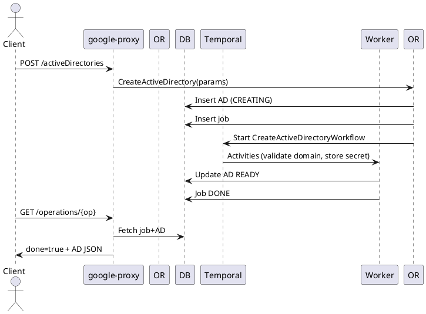

# Active Directories API Guide

Active Directory (AD) credential objects enable SMB integration (future NAS file support) and optional LDAP / Kerberos related security features.

## Endpoints
Base Prefix: `/v1beta/projects/{projectNumber}/locations/{locationId}`

| Operation | Path | LRO | Notes |
|-----------|------|-----|------|
| List | GET /activeDirectories | No | All AD configs for account/region |
| Bulk Get | POST /getMultipleActiveDirectories | No | Body: ActiveDirectoryIdList_v1beta |
| Create | POST /activeDirectories | Yes (202) | Stores credentials & validates domain join later |
| Describe | GET /activeDirectories/{activeDirectoryId} | No | AD by UUID |
| Update | PUT /activeDirectories/{activeDirectoryId} | Yes (202) | Rotate credentials / flags |
| Delete | DELETE /activeDirectories/{activeDirectoryId} | Yes (202) | Remove credentials (never 404 during process) |

## Create AD
```json
{
  "resourceId": "corp-ad",
  "username": "admin-user",
  "password": "********",
  "domain": "corp.example.com",
  "DNS": "10.10.0.10",
  "netBIOS": "CORP",
  "organizationalUnit": "CN=Computers",
  "aesEncryption": true,
  "ldapSigning": true,
  "encryptDCConnections": false,
  "backupOperators": ["op1","op2"],
  "description": "Primary production domain"
}
```
Response (202 Operation). Poll until credentials validated and state READY.

## Describe
```json
{
  "activeDirectoryId": "9760acf5-4638-11e7-9bdb-020073ca7773",
  "resourceId": "corp-ad",
  "username": "admin-user",
  "domain": "corp.example.com",
  "activeDirectoryState": "READY",
  "aesEncryption": true,
  "ldapSigning": true,
  "backupOperators": ["op1","op2"]
}
```

## Update
Rotate password / modify flags:
```json
{ "password": "********NEW", "aesEncryption": false, "description": "Rotated creds" }
```
Returns 202 (LRO) while domain validation re-runs.

## Delete
`DELETE /activeDirectories/{id}` → Operation 202 then completes (no 404 if already absent – returns done operation).

## Internal Create Flow
1. google-proxy validates JSON (required domain, username, password masks).
2. Orchestrator: Insert AD row (CREATING) + Job.
3. Workflow sequence:
   - Basic format validations.
   - Attempt domain connectivity (DNS lookup / LDAP bind if supported).
   - Store masked password (secret manager or encrypted at rest).
   - Mark READY.
4. Operation polling surfaces final AD config minus cleartext fields.

## Update Flow
- Set state UPDATING; rotate secret; optionally rebind; mark READY.

## Delete Flow
- State DELETING; remove secret; mark DONE (soft delete flags or row removed per retention policy).

## LRO Lifecycle
| Phase | State | Notes |
|-------|-------|-------|
| Insert | CREATING | Credentials pending validation |
| Validate | CREATING | DNS / LDAP operations |
| Ready | READY | Usable for SMB volume join |
| Update | UPDATING→READY | Re-validation after rotation |
| Delete | DELETING→DELETED | Secret cleanup |

## Sequence Diagram (Create)


## Polling Example
```bash
OPERATION_ID=<operation-uuid>
PROJECT_NUMBER=<project-number>
LOCATION=<region>
curl -sS -H "Authorization: Bearer $(gcloud auth print-access-token)" \
  "https://netapp.googleapis.com/v1beta/projects/${PROJECT_NUMBER}/locations/${LOCATION}/operations/${OPERATION_ID}" | jq .
```

## Errors (Examples)
| Scenario | HTTP | Message |
|----------|------|---------|
| Domain unreachable | 422 | cannot contact domain controllers |
| Duplicate resourceId | 409 | active directory with name exists |
| Invalid password (policy) | 422 | password policy violation |

## Observability
Metrics: `activedirectory_create_duration_seconds`, `activedirectory_state_transitions_total`.

---
End of Active Directories API Guide.
