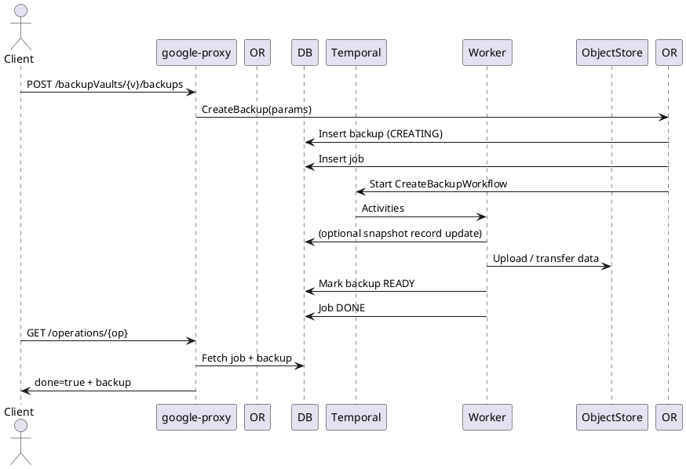

# Backups & Backup Vaults API Guide

Durable, vaulted point‑in‑time copies of volumes (object storage). Supports ad‑hoc and policy‑scheduled backups; enables restore / clone.

## Endpoints
Base Prefix: `/v1beta/projects/{projectNumber}/locations/{locationId}`

### Backup Vaults
| Operation | Path | LRO | Notes |
|-----------|------|-----|------|
| List Vaults | GET /backupVaults?includeDeleted=bool | No | All vaults |
| Create Vault | POST /backupVaults | Yes (202) | New logical vault (regional) |
| Bulk Get | POST /getMultipleBackupVaults | No | By UUID list |
| Describe | GET /backupVaults/{backupVaultId}?includeDeleted=bool | No | Single vault |
| Update | PUT /backupVaults/{backupVaultId} | Yes (202) | Description / labels |
| Delete | DELETE /backupVaults/{backupVaultId} | Yes (202/204) | Permanent removal |

### Backups (Inside a Vault)
| Operation | Path | LRO | Notes |
|-----------|------|-----|------|
| List Backups | GET /backupVaults/{vaultId}/backups?volumeId=&includeDeleted=&onlyOrphanedBackups= | No | Filter by volume or orphaned |
| Create Backup | POST /backupVaults/{vaultId}/backups | 201 or 202 | 201 if immediate metadata; 202 LRO otherwise |
| Bulk Get | POST /backupVaults/{vaultId}/getMultipleBackups | No | By UUID list |
| Describe | GET /backupVaults/{vaultId}/backups/{backupId}?volumeId= | No | Descriptor returns wrapper list |
| Update | PUT /backupVaults/{vaultId}/backups/{backupId} | 200 or 202 | Description only |
| Delete | DELETE /backupVaults/{vaultId}/backups/{backupId} | 200 or 202 | Sync if small, else LRO |

## Create Backup Vault
```json
{
  "resourceId": "vault-a",
  "description": "Primary region backups"
}
```
Response 202 Operation.

## Create Backup (Ad‑hoc)
```json
{
  "name": "pre-upgrade-2025-01-10",
  "volumeId": "<volume-uuid>",
  "description": "Before db upgrade",
  "useExistingSnapshot": false
}
```
Response 201 (inline) or 202 Operation.

## Describe Backup (Wrapper Form)
```json
{
  "backups": [
    {
      "backupId": "9760acf5-...",
      "name": "pre-upgrade-2025-01-10",
      "volumeId": "<volume-uuid>",
      "lifeCycleState": "READY",
      "volumeUsageBytes": 387860629999
    }
  ]
}
```

## Update Backup (Description)
```json
{ "description": "Pre-upgrade marker" }
```

## Internal Flow (Create Backup)
1. google-proxy validates JSON (volume & vault IDs).
2. Orchestrator `CreateBackup`:
   - Account & volume & vault fetch.
   - Validation (volume READY, snapshot existence if useExistingSnapshot).
   - Insert backup row (CREATING) + Job.
   - Launch `CreateBackupWorkflow`.
3. Workflow Activities:
   - Snapshot prepare / reuse.
   - Object store (GCS) transfer (SnapMirror-to-object or export pipeline).
   - Update size / metadata; mark READY.
4. Job DONE → Operation done=true.

## Delete Flow
- Mark DELETING; object store delete; set state DELETED (or remove row) + Job DONE.

## Orphaned Backups
- `onlyOrphanedBackups=true` returns backups whose source volume no longer exists (cleanup / retention tasks can process).

## LRO Lifecycle (Backup Create)
| Stage | DB State | Notes |
|-------|----------|-------|
| Insert | CREATING | UseExistingSnapshot flag stored |
| Transfer | CREATING | Activities may update progress stats (future) |
| Success | READY | Job DONE |
| Failure | ERROR | Snapshot cleanup attempted |

## Sequence Diagram (Create Backup)


## Polling Example
```bash
OPERATION_ID=<operation-uuid>
PROJECT_NUMBER=<project-number>
LOCATION=<region>
curl -sS -H "Authorization: Bearer $(gcloud auth print-access-token)" \
  "https://netapp.googleapis.com/v1beta/projects/${PROJECT_NUMBER}/locations/${LOCATION}/operations/${OPERATION_ID}" | jq .
```

## Errors (Examples)
| Scenario | HTTP | Message |
|----------|------|---------|
| Vault not found | 404 | Backup vault not found |
| Volume not READY | 422 | Volume not in available state |
| Duplicate name (READY) | 409 | backup already exists |
| Update state invalid | 409 | Backup can only be updated when in AVAILABLE state |

## Observability
Metrics: `backup_create_duration_seconds`, `backup_bytes_transferred_total`, `backup_state_transitions_total`.

---
End of Backups & Vaults API Guide.
