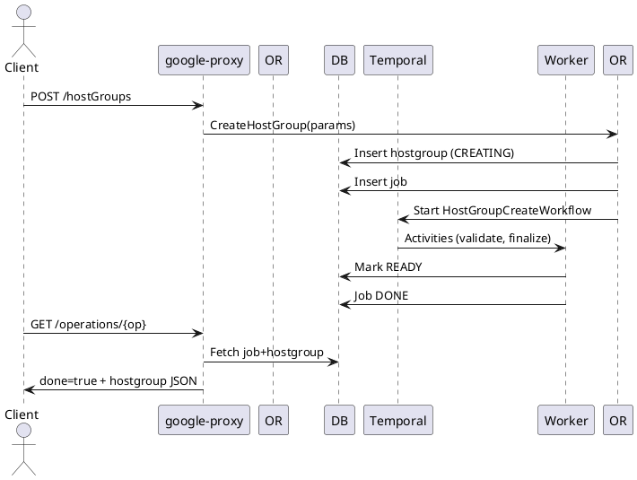

# HostGroups API Guide

iSCSI initiator grouping for block volume access control. A HostGroup holds one or more initiator IQNs and an OS type used to map LUNs consistently across volumes.

## Endpoints
Base Prefix: `/v1beta/projects/{projectNumber}/locations/{locationId}`

| Operation | Path | LRO | Notes |
|-----------|------|-----|------|
| List | GET /hostGroups | No | All host groups (account scoped) |
| Bulk Get | POST /getMultipleHostGroups | No | Body: hostGroupIdList_v1beta |
| Create | POST /hostGroups | Yes (202 or 200) | 202 when async provisioning path, 200 if immediately resolved |
| Describe | GET /hostGroups/{hostGroupId} | No | hostGroupId UUID |
| Update | PUT /hostGroups/{hostGroupId} | Yes (202) | Modify IQNs, description, osType |
| Delete | DELETE /hostGroups/{hostGroupId} | Yes (202/204) | Remove group after validation |

## Create HostGroup
```json
{
  "resourceId": "hg-db",
  "type": "ISCSI_INITIATOR",
  "hosts": ["iqn.1998-01.com.vmware:db1", "iqn.1998-01.com.vmware:db2"],
  "osType": "LINUX",
  "description": "Database initiators"
}
```
Response (202 Operation or 200 Operation.done=true):
```json
{ "done": false, "name": "/v1beta/projects/123/locations/us-east1/operations/<op-uuid>" }
```

## Describe HostGroup
```json
{
  "hostGroupId": "123e4567-e89b-12d3-a456-426614174000",
  "resourceId": "hg-db",
  "type": "ISCSI_INITIATOR",
  "hosts": ["iqn.1998-01.com.vmware:db1", "iqn.1998-01.com.vmware:db2"],
  "osType": "LINUX",
  "state": "READY"
}
```

## Update HostGroup
```json
{
  "description": "Updated description",
  "hosts": ["iqn.1998-01.com.vmware:db1", "iqn.1998-01.com.vmware:db3"],
  "osType": "LINUX"
}
```

## Delete HostGroup
No body required. Returns Operation (202) or 204 if already removed.

## Internal Create Flow
1. google-proxy validates request JSON (IQN format, osType enum).
2. Orchestrator stores HostGroup row (CREATING) + Job.
3. Minimal workflow (may be synchronous) reserves mapping metadata (future: IQN verification / device discovery).
4. Mark READY. Job DONE.

## Update Flow
- If hosts change: Orchestrator workflow updates LUN maps for volumes referencing the group (async) to ensure new initiators gain access.

## Delete Flow
- Validate no active volumes or block devices referencing group (or orchestrated cascade). Mark DELETING; remove mapping metadata; DONE.

## LRO Lifecycle
| Phase | State | Notes |
|-------|-------|-------|
| Insert | CREATING | Simple create; often very short |
| Update | UPDATING | LUN remap may occur |
| Delete | DELETING | Reference check + cleanup |
| Ready | READY | Steady state |

## Sequence Diagram (Create)


## Polling Example
```bash
OPERATION_ID=<operation-uuid>
PROJECT_NUMBER=<project-number>
LOCATION=<region>
curl -sS -H "Authorization: Bearer $(gcloud auth print-access-token)" \
  "https://netapp.googleapis.com/v1beta/projects/${PROJECT_NUMBER}/locations/${LOCATION}/operations/${OPERATION_ID}" | jq .
```

## Errors (Examples)
| Scenario | HTTP | Message |
|----------|------|---------|
| Duplicate resourceId | 409 | host group already exists |
| Invalid IQN | 422 | host IQN pattern invalid |
| In use (delete) | 409 | host group referenced by volume |

## Observability
Metrics: `hostgroup_create_duration_seconds`, `hostgroup_state_transitions_total`.

---
End of HostGroups API Guide.

