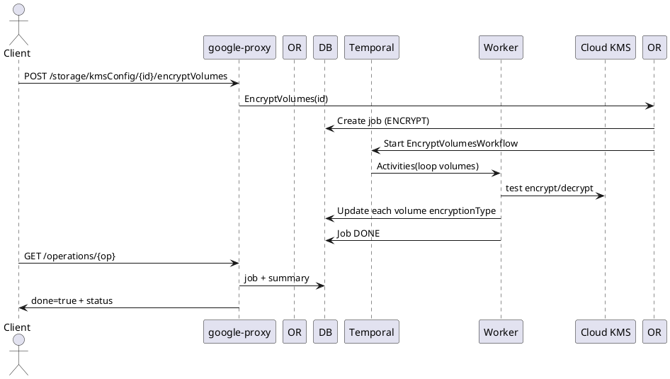

# KMS Configurations (CMEK) API Guide

Customer Managed Encryption Key (CMEK) integration allowing volumes and pools to use user-provided crypto keys. Supports creation, update (key path, description), reachability checks, deletion, bulk retrieval, and volume encryption migration.

## Endpoints
Base Prefix: `/v1beta/projects/{projectNumber}/locations/{locationId}`

| Operation | Path | LRO | Notes |
|-----------|------|-----|------|
| List | GET /storage/kmsConfig | No | Array of configs |
| Bulk Get | POST /storage/kmsConfig/getMultipleKmsConfigs | No | Body: kmsConfigIdList_v1beta |
| Create | POST /storage/kmsConfig | Yes (202) | Registers key path (keyFullPath) |
| Describe | GET /storage/kmsConfig/{kmsConfigId} | No | Single config |
| Update | PUT /storage/kmsConfig/{kmsConfigId} | 200 or 202 | In-place description / key change (may validate) |
| Delete | DELETE /storage/kmsConfig/{kmsConfigId} | 202/204 | Remove config (must not be IN_USE) |
| Check | GET /storage/kmsConfig/{kmsConfigId}/check | No | Reachability & permission validation |
| Encrypt Volumes | POST /storage/kmsConfig/{kmsConfigId}/encryptVolumes | Yes (202) | Migration of existing SERVICE_MANAGED volumes to CMEK |

## Create KMS Config
```json
{
  "resourceId": "kms-main",
  "keyFullPath": "projects/proj/locations/global/keyRings/ring/cryptoKeys/key",
  "description": "Primary CMEK"
}
```
Response (202 Operation):
```json
{"done": false, "name": "/v1beta/projects/123/locations/us-east1/operations/<op-uuid>"}
```

## Describe
```json
{
  "uuid": "9760acf5-4638-11e7-9bdb-020073ca7773",
  "resourceId": "kms-main",
  "keyFullPath": "projects/proj/locations/global/keyRings/ring/cryptoKeys/key",
  "kmsState": "READY",
  "kmsStateDetails": "Kms config is ready for use"
}
```

## Update
```json
{ "description": "Rotated key desc", "keyFullPath": "projects/proj/locations/global/keyRings/ring/cryptoKeys/newKey" }
```
Returns 200 (if validated synchronously) or 202 Operation if asynchronous verification required.

## Reachability Check
`GET /storage/kmsConfig/{kmsConfigId}/check` → returns status object (success / failure + details).

## Encrypt Volumes Migration
`POST /storage/kmsConfig/{kmsConfigId}/encryptVolumes` returns Operation. Workflow iterates eligible volumes, applies encryption migration sequentially/batched.

## Internal Create Flow
1. google-proxy validates JSON (keyFullPath format).
2. Orchestrator inserts KMS config (CREATING) + Job.
3. Workflow tasks:
   - Service account permission test (Cloud KMS encrypt/decrypt) or Key getIamPolicy.
   - Mark READY or ERROR.
4. Operation reflects final state.

## Update Flow
- If key path changes: set state UPDATING; re-run permission test; return READY.
- Description only can be synchronous.

## Delete Flow
- Validate not referenced by any ACTIVE pool (kmsState IN_USE forbids deletion).
- State DELETING; clean references; mark DELETED / remove row; Operation DONE.

## Volume Encryption Migration Flow
1. Validate KMS config READY.
2. Enumerate volumes with SERVICE_MANAGED encryption.
3. For each: schedule rekey (ONTAP / storage backend call) → WAIT completion.
4. Update volume encryptionType field.
5. Summarize results in Operation.response.

## LRO Lifecycle (Create / Encrypt)
| Stage | State | Notes |
|-------|-------|-------|
| Insert | CREATING | Job NEW |
| Validation | CREATING | Permission checks |
| Ready | READY | Config usable |
| Encrypt (vols) | UPDATING | Migration loops |
| Complete | READY | Operation done=true |

## Sequence Diagram (Encrypt Volumes)


## Errors (Examples)
| Scenario | HTTP | Message |
|----------|------|---------|
| Key permission denied | 422 | cannot access keyFullPath |
| Duplicate resourceId | 409 | kms config already exists |
| Delete while IN_USE | 409 | kms config in use by pools |

## Observability
Metrics: `kms_config_create_duration_seconds`, `kms_config_state_transitions_total`, `kms_encryption_migration_volume_count`.

---
End of KMS Configurations API Guide.

