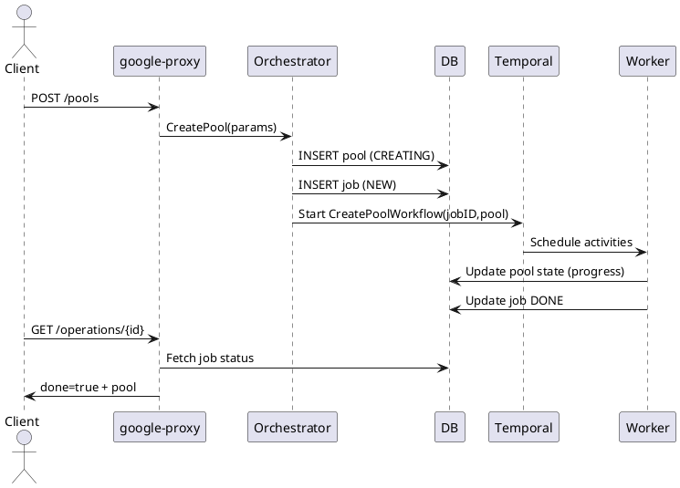
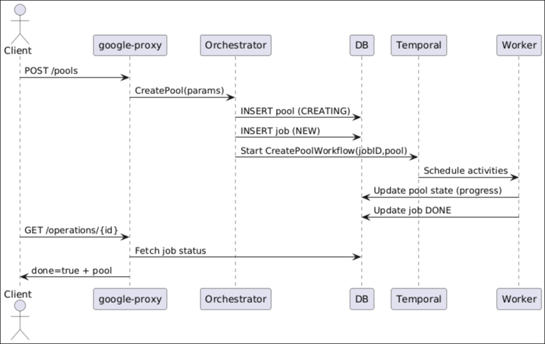

# Pools API Guide

Comprehensive reference for Storage Pool endpoints, request/response contracts, internal execution path, and LRO lifecycle.

## Endpoints
Base Prefix: `/v1beta/projects/{projectNumber}/locations/{locationId}`

| Operation | Method & Path | LRO | Description |
|-----------|---------------|-----|-------------|
| List Pools | GET /pools?includeDeleted=bool | No | Returns pools owned by caller |
| Create Pool | POST /pools | Yes (202) | Creates a new storage pool (backs a VSA cluster) |
| Bulk Get | POST /getMultiplePools | No | Returns specified pool UUIDs |
| Describe | GET /pools/{poolId} | No | Returns pool representation by UUID |
| Update | PUT /pools/{poolId} | Yes (202/204) | Resizes / changes labels / performance attributes |
| Delete | DELETE /pools/{poolId} | Yes (202/204) | Deletes a pool & underlying cluster |

### Create Pool (POST /pools)
Request Body (subset):
```json
{
  "resourceId": "my-pool",
  "serviceLevel": "FLEX",
  "sizeInBytes": 2199023255552,
  "allowAutoTiering": true,
  "primaryZone": "us-east1-b",
  "secondaryZone": "us-east1-c",
  "customPerformanceParams": { "throughputMibps": 64, "iops": 1024 },
  "kmsConfigId": "<kms-config-uuid>",
  "labels": { "env": "dev" },
  "description": "Demo pool"
}
```
Response (202):
```json
{
  "done": false,
  "name": "/v1beta/projects/123456789/locations/us-east1/operations/<operation-uuid>"
}
```
Once done=true, `response` contains the Pool object.

### Describe Pool (GET /pools/{poolId})
Sample (200):
```json
{
  "poolId": "9760acf5-4638-11e7-9bdb-020073ca7773",
  "resourceId": "my-pool",
  "serviceLevel": "FLEX",
  "sizeInBytes": 2199023255552,
  "storagePoolState": "READY",
  "allowAutoTiering": true,
  "labels": {"env": "dev"},
  "createdAt": "2024-01-24T13:54:14.374Z"
}
```

### Update Pool (PUT /pools/{poolId})
Request (example partial):
```json
{ "sizeInBytes": 4398046511104, "labels": {"env": "stage"} }
```
Response (202) Operation; final `response` echoes updated pool.

### Delete Pool (DELETE /pools/{poolId})
Response: Operation (202) until resources torn down. 204 if already finalized.

## Error Responses
Standard JSON:
```json
{ "code": 409, "message": "pool not found or already deleted" }
```
Codes: 400 validation, 401 auth, 403 permission, 404 unknown, 409 conflict (duplicate resourceId / invalid shrink), 422 semantic, 429 throttled, 500 internal.

## Internal Flow (Create)
1. google-proxy handler (Ogen generated) validates JSON & headers.
2. Orchestrator `_createPool`:
   - Account lookup / create
   - Validate *CreatePoolParams*
   - Insert pool row (state=CREATING)
   - Create Job (datamodel.Job) → workflow ID
   - Start Temporal `CreatePoolWorkflow` (parameters + pool model)
3. Workflow steps (high level):
   - Tenancy discovery (service/tenant projects)
   - Subnet + network provisioning (child workflow)
   - Service Account + GCS autotier bucket
   - KMS reachability (optional)
   - VMRS sizing → VLM cluster deployment
   - DNS + Node details + intercluster LIF capture
   - SVM creation + QoS + CMEK configure
   - Mark READY + update Operation response
4. Operation polling endpoint reads Job state / workflow completion.

## Internal Flow (Update)
1. Validate mutable fields (no shrink).
2. Create update Job + start `UpdatePoolWorkflow`.
3. Re-run VMRS if performance deltas require rescale; else DB only update.

## Internal Flow (Delete)
1. Mark pool state=DELETING.
2. Workflow orchestrates volume checks, cluster teardown, DNS cleanup, bucket & SA cleanup.

## LRO Lifecycle
| Stage | Actor | Data Persisted |
|-------|-------|----------------|
| Request accepted | google-proxy | Operation name (Job UUID) |
| Job CREATED | orchestrator | Job row (NEW) |
| Workflow start | Temporal | Workflow execution + history |
| Activities succeed | Worker | Pool state transitions (CREATING→READY) |
| Completion | Worker/orchestrator | Job DONE, Operation.done=true |

## Sequence Diagram (Create)



## Polling Example
Use a standardized poll for any Operation (see `doc/api/architecture/lro-generic-sequence.md`).
```bash
OPERATION_ID=<operation-uuid>
PROJECT_NUMBER=<project-number>
LOCATION=<region>
curl -sS -H "Authorization: Bearer $(gcloud auth print-access-token)" \
  "https://netapp.googleapis.com/v1beta/projects/${PROJECT_NUMBER}/locations/${LOCATION}/operations/${OPERATION_ID}" | jq .
```

## Idempotency Notes
- Create returns existing in-progress Job if same resourceId & state=CREATING.
- Update safe to retry (duplicate Operation name) with same payload.

## Observability
Metrics (examples): `pool_create_duration_seconds`, `pool_state_transitions_total`.
Logs keyed by correlation ID + pool UUID.

## Troubleshooting Quick Table
| Symptom | Check | Action |
|---------|-------|--------|
| LRO stuck CREATING | Job row & workflow events | Inspect activity retries; review worker logs |
| 409 on create | Existing pool name | Describe pool; if ERROR consider delete and recreate |
| KMS failure | Operation error message | Verify KMS config state / permissions |

---
End of Pools API Guide.
