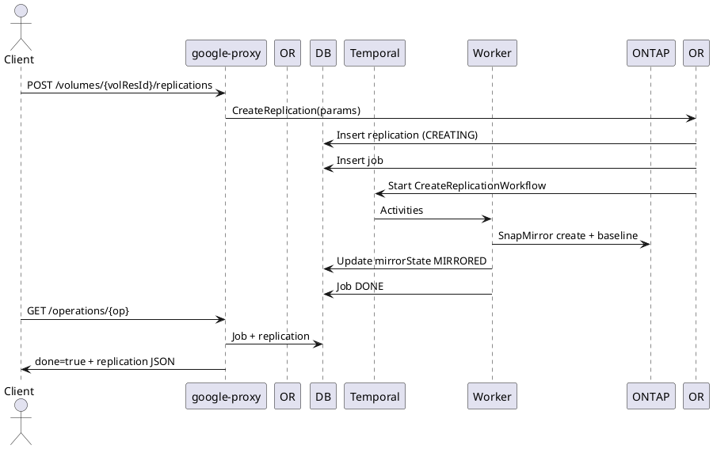

# Replications API Guide

Asynchronous volume data replication (DR / migration). Supports create, update (schedule/description), stop, resume, reverse & resume, sync, and delete.

## Endpoints
Base Prefix: `/v1beta/projects/{projectNumber}/locations/{locationId}`

| Operation | Path | LRO | Notes |
|-----------|------|-----|------|
| List All | GET /replications | No | All replications in region (source & dest roles) |
| Create | POST /volumes/{volumeResourceId}/replications | Yes (202) | Create SOURCE→DEST relationship |
| Bulk Get | POST /volumes/{volumeResourceId}/getMultipleReplications | No | Body: ReplicationURIList_v1beta |
| Update | PUT /volumes/{volumeResourceId}/replications/{replicationResourceId} | Yes (202) | Change schedule, description, labels |
| Stop | POST /volumes/{volumeResourceId}/replications/{replicationResourceId}/stop | Yes (202) | Quiesce & promote dest |
| Resume | POST /volumes/{volumeResourceId}/replications/{replicationResourceId}/resume | Yes (202) | Resume after stop |
| Reverse & Resume | POST /volumes/{volumeResourceId}/replications/{replicationResourceId}/reverseAndResumeReplication | Yes (202) | Swap roles |
| Sync (Manual) | POST /volumes/{volumeResourceId}/replications/{replicationResourceId}/sync | Yes (202) | Immediate incremental update |
| Delete | DELETE /volumes/{volumeResourceId}/replications/{replicationResourceId} | Yes (202) | Remove relationship |

## Create Replication
```json
{
  "resourceId": "my-replication",
  "description": "Primary to DR region",
  "replicationSchedule": "EVERY_10_MINUTES",
  "destination": {
    "volumeName": "projects/123456789/locations/us-west1/volumes/dest-vol"
  }
}
```
Response (202 Operation):
```json
{"done": false, "name": "/v1beta/projects/123/locations/us-east1/operations/<op-uuid>"}
```

## Describe (Excerpt)
```json
{
  "replications": [
    {
      "resourceId": "my-replication",
      "mirrorState": "MIRRORED",
      "role": "SOURCE",
      "replicationSchedule": "EVERY_10_MINUTES",
      "healthy": true,
      "transferStats": {"lagTime": 18, "totalTransferBytes": 18872 }
    }
  ]
}
```

## Update Replication
```json
{ "replicationSchedule": "HOURLY", "description": "Lower RPO window" }
```

## Stop / Resume
Stop (promote destination):
```json
{} // body required by spec even if empty
```
Resume (re-establish incremental transfers):
`POST .../resume` with empty body.

## Reverse & Resume
`POST .../reverseAndResumeReplication` – roles swapped, mirrorState cycles PREPARING→MIRRORED.

## Sync (On-Demand)
`POST .../sync` triggers immediate incremental; lagTime resets after completion.

## Delete
`DELETE .../replications/{replicationResourceId}` with JSON body per schema (may include force/delete flags in future) returns Operation.

## Internal Create Flow
1. google-proxy validates source volume existence, destination reference, schedule enum.
2. Orchestrator `_createReplication` builds create params; inserts Job.
3. Temporal workflow (CreateReplicationWorkflow) activities:
   - Validate peering / intercluster LIF reachability.
   - Initialize SnapMirror relationship (PREPARING).
   - Start baseline transfer (mirrorState transitions BASELINE_TRANSFERRING→MIRRORED).
   - Persist transfer stats + mark healthy=true.
4. Job DONE, Operation done=true.

## Update Flow
- Validate allowed fields; if schedule changed, SnapMirror policy updated; state UPDATING→MIRRORED.

## Stop / Resume Flow
- Stop: Quiesce & break relationship; mark destination writable; mirrorState STOPPED.
- Resume: Re-link, may perform incremental baseline if diverged; mirrorState PREPARING→MIRRORED.

## Reverse & Resume Flow
- Issues reverse resync; swap SOURCE/DEST metadata; baseline difference reconciled; mirrorState PREPARING→MIRRORED.

## Sync Flow
- Triggers manual update activity regardless of schedule timer; updates transferStats.lastTransferEndTime & lagTime.

## Delete Flow
- Quiesce if active, release SnapMirror, remove replication row once cleanup finished (state DELETING→DELETED).

## State / Fields
| Field | Meaning |
|-------|---------|
| mirrorState | PREPARING / MIRRORED / STOPPED / TRANSFERRING / BASELINE_TRANSFERRING |
| role | SOURCE or DESTINATION relative to reported endpoint |
| healthy | Missed schedule / failures toggle false |
| transferStats.lagTime | Seconds of replication delay (RPO proxy) |

## LRO Lifecycle
| Phase | State | Action |
|-------|-------|--------|
| Insert | CREATING | Job NEW |
| Baseline | PREPARING / BASELINE_TRANSFERRING | Data copy |
| Steady | MIRRORED | Incrementals on schedule |
| Control Ops | STOPPED / PREPARING | Role or state transitions |
| Delete | DELETING | Tear down |

## Sequence Diagram (Create)


## Polling Example
```bash
OPERATION_ID=<operation-uuid>
PROJECT_NUMBER=<project-number>
LOCATION=<region>
curl -sS -H "Authorization: Bearer $(gcloud auth print-access-token)" \
  "https://netapp.googleapis.com/v1beta/projects/${PROJECT_NUMBER}/locations/${LOCATION}/operations/${OPERATION_ID}" | jq .
```

## Errors (Examples)
| Scenario | HTTP | Message |
|----------|------|---------|
| Duplicate replication | 409 | replication already exists |
| Invalid schedule | 422 | replicationSchedule invalid |
| Peering/network failure | 500 | Error establishing replication |
| Operation invalid (stop while PREPARING) | 409 | replication in transient state |

## Observability
Metrics: `replication_create_duration_seconds`, `replication_lag_seconds`, `replication_state_transitions_total`, `replication_healthy_status`.

---
End of Replications API Guide.
