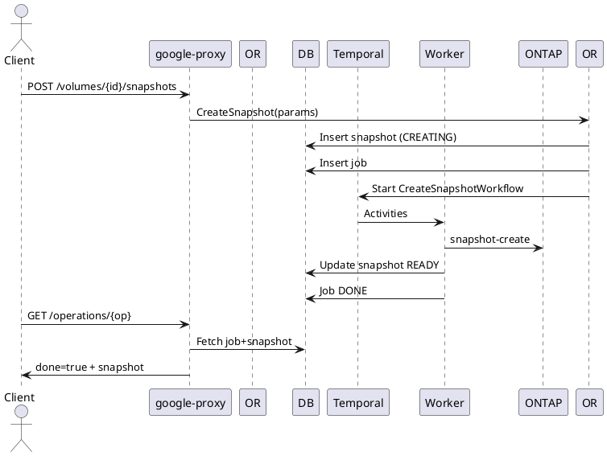

# Snapshots API Guide

Point‑in‑time, space‑efficient copies of a volume. Supports cloning, backup seeding, and volume revert.

## Endpoints
Base Prefix: `/v1beta/projects/{projectNumber}/locations/{locationId}/volumes/{volumeId}`

| Operation | Method & Path | LRO | Notes |
|-----------|---------------|-----|------|
| List | GET /snapshots | No | All snapshots for volumeId |
| Bulk Get | POST /getMultipleSnapshots | No | Body: SnapshotIdList_v1beta |
| Create | POST /snapshots | Yes (202) | Ad‑hoc snapshot |
| Describe | GET /snapshots/{snapshotId} | No | snapshotId UUID |
| Update | PUT /snapshots/{snapshotId} | Yes (202) | Name / description mutation |
| Delete | DELETE /snapshots/{snapshotId} | Yes (202/204) | Permanent removal |
| Revert Volume | POST /Revert | Yes (202/204) | Volume revert to snapshot (Volume API) |

## Create Snapshot
Request:
```json
{
  "resourceId": "manual-snap-01",
  "description": "Before schema upgrade",
  "isAppConsistent": false
}
```
Response (202 Operation):
```json
{ "done": false, "name": "/v1beta/projects/123/locations/us-east1/operations/<op-uuid>" }
```

## Describe Snapshot
```json
{
  "snapshotId": "9760acf5-4638-11e7-9bdb-020073ca3333",
  "resourceId": "manual-snap-01",
  "snapshotState": "READY",
  "usedBytes": 387860627927,
  "description": "Before schema upgrade"
}
```

## Update Snapshot
```json
{ "description": "Pre-release checkpoint" }
```

## Delete Snapshot
No body required.

## Internal Create Flow
1. google-proxy validates request (name pattern + reserved prefixes).
2. Orchestrator `_createSnapshot`:
   - Account & Volume ownership check.
   - Idempotency: existing in-progress snapshot creation returns existing job.
   - Insert snapshot row (CREATING) + Job row.
   - Launch `CreateSnapshotWorkflow`.
3. Workflow Activities:
   - ONTAP create snapshot (ontap-proxy).
   - Populate external UUID & logical size.
   - Mark READY.
4. Operation polling returns snapshot object.

## Update Flow
- State must be READY. Transition to UPDATING, mutate metadata, return to READY.

## Delete Flow
- Transition DELETING; call ONTAP delete; persist DELETED/soft delete.

## Revert Volume (Volume endpoint)
- Validates snapshotState READY then ONTAP revert.

## LRO Lifecycle (Create)
| Phase | DB State | Notes |
|-------|----------|-------|
| Insert | CREATING | Job NEW |
| Activity | CREATING | ONTAP snapshot create |
| Success | READY | Job DONE |
| Failure | ERROR | Job ERROR, snapshot may be cleaned up |

## Sequence Diagram (Create)


## Polling Example
```bash
OPERATION_ID=<operation-uuid>
PROJECT_NUMBER=<project-number>
LOCATION=<region>
curl -sS -H "Authorization: Bearer $(gcloud auth print-access-token)" \
  "https://netapp.googleapis.com/v1beta/projects/${PROJECT_NUMBER}/locations/${LOCATION}/operations/${OPERATION_ID}" | jq .
```

## Validation
- Name regex: `^[\w()+.-]+$` (no consecutive dots, not a single '.')
- Disallowed prefixes: `ref_ss_volmove`, `snapmirror`, `hourly.`, `daily.`, `weekly.`, `monthly.`
- Single app consistent snapshot at a time (`isAppConsistent=true`).

## Errors (Examples)
| Scenario | HTTP | Message |
|----------|------|---------|
| Duplicate name (READY) | 409 | snapshot already exists |
| Name pattern invalid | 422 | Snapshot name can only include ... |
| Volume not owned | 404 | volume not found |

## Observability
Metrics: `snapshot_create_duration_seconds`, `snapshot_state_transitions_total`.

---
End of Snapshots API Guide.
