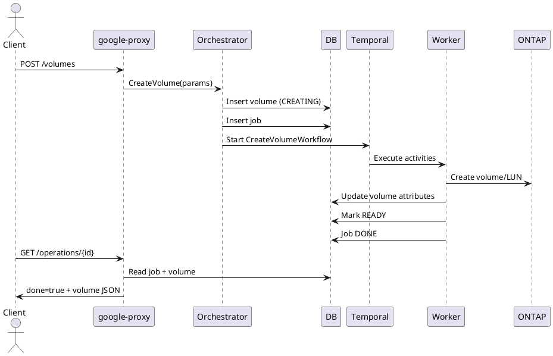

# Volumes API Guide

Covers file (NFS/SMB future) & block (iSCSI) volumes, CRUD semantics, special operations (revert), cloning (snapshot/backup), internal flows, and LRO lifecycle.

## Endpoints
Base Prefix: `/v1beta/projects/{projectNumber}/locations/{locationId}`

| Operation | Method & Path | LRO | Notes |
|-----------|---------------|-----|------|
| List | GET /volumes?poolId=&includeDeleted=&includePolicies=&includeSmbShareSettings= | No | Optional filters |
| Create | POST /volumes | Yes (202) | Empty, from snapshot, or from backup |
| Bulk Get | POST /getMultipleVolumes | No | Body: VolumeIdList_v1beta |
| Describe | GET /volumes/{volumeId} | No | volumeId = UUID |
| Update | PUT /volumes/{volumeId} | Yes (202/204) | Resize, policy, tiering, export/host group changes |
| Delete | DELETE /volumes/{volumeId} | Yes (202/204) | Optional deleteAssociatedBackups flag |
| Revert | POST /volumes/{volumeId}/Revert | Yes (202/204) | Revert to snapshotId |

## Create Volume
Request (empty new NFS volume):
```json
{
  "resourceId": "logs-vol",
  "poolId": "<pool-uuid>",
  "protocols": ["NFSV3"],
  "quotaInBytes": 107374182400,
  "snapReserve": 5,
  "snapshotDirectory": true,
  "unixPermissions": "0770",
  "labels": {"env": "dev"}
}
```
Clone from snapshot:
```json
{
  "resourceId": "clone-vol",
  "poolId": "<pool-uuid>",
  "snapshotId": "<snapshot-uuid>",
  "protocols": ["NFSV3"],
  "quotaInBytes": 214748364800
}
```
Block (iSCSI) with host groups:
```json
{
  "resourceId": "db-lun",
  "poolId": "<pool-uuid>",
  "protocols": ["ISCSI"],
  "quotaInBytes": 53687091200,
  "blockProperties": {"hostGroupIds": ["<hg-uuid>"], "osType": "LINUX"}
}
```
Response (202 Operation):
```json
{"done": false, "name": "/v1beta/projects/123/locations/us-east1/operations/<op-uuid>"}
```

## Describe Volume (200)
```json
{
  "volumeId": "49b96a2f-...",
  "resourceId": "logs-vol",
  "volumeState": "READY",
  "quotaInBytes": 107374182400,
  "usedBytes": 1409024,
  "protocols": ["NFSV3"],
  "exportPolicy": {"rules": [{"ruleIndex":1,"allowedClients":"0.0.0.0/0","accessType":"READ_WRITE"}]},
  "snapshotPolicy": {"enabled": true},
  "backupConfig": {"backupPolicyId": "...","scheduledBackupEnabled": true},
  "tieringPolicy": {"tierAction": "ENABLED", "coolingThresholdDays": 24}
}
```

## Update Volume
Partial example:
```json
{
  "quotaInBytes": 214748364800,
  "tieringPolicy": {"tierAction": "ENABLED", "coolingThresholdDays": 40},
  "exportPolicy": {"rules": [{"ruleIndex":1,"allowedClients":"10.0.0.0/24","accessType":"READ_WRITE"}]}
}
```

## Revert Volume
```json
{"snapshotId": "<snapshot-uuid>"}
```
Returns LRO (202). Final state returns updated volume (READY) with reset data to snapshot point.

## Delete Volume
Optional body:
```json
{"deleteAssociatedBackups": false}
```

## Internal Create Flow
1. google-proxy validates + builds `CreateVolumeParams`.
2. Orchestrator `_createVolume`:
   - Account & Pool lookup, zone compatibility.
   - Idempotency: existing CREATING volume with same name returns existing job.
   - Snapshot / backup (if provided) validation (state READY, protocol match).
   - Insert volume row (CREATING) + Job row.
   - Start `CreateVolumeWorkflow` (Temporal).
3. Workflow Activities:
   - SVM lookup & junction path generation (file).
   - HostGroup resolution (block) → LUN mapping creation.
   - ONTAP volume / LUN create (ontap-proxy).
   - Policies: export, snapshot, tiering, backup linkage.
   - Mount point assembly (NFS export path / iSCSI target IQNs + instructions).
   - Update volumeState READY.
4. Operation polling returns terminal representation.

## Internal Update Flow
- Validate new size (no shrink below used + snapReserve). HostGroup updates remap iSCSI LUNs. Tiering & policies applied via ONTAP + DB update.

## Delete Flow
- If body flag deleteAssociatedBackups=true (future extension) orchestrator will cascade; otherwise verifies no active replication (if implemented) then marks DELETING and runs workflow for ONTAP destroy & DB state.

## Revert Flow
- Validates snapshot belongs to volume and snapshotState READY.
- Executes ONTAP revert (disruptive) → refresh metrics → READY.

## LRO Lifecycle Table
| Phase | DB State | Notes |
|-------|----------|-------|
| Insert | CREATING | Row + Job NEW |
| Activities running | CREATING | May update interim details (mountPoints) |
| Success | READY | Job DONE, Operation done=true |
| Failure | ERROR | Job ERROR, Operation done=true + error |

## Sequence Diagram (Create)


## Polling Example
```bash
OPERATION_ID=<operation-uuid>
PROJECT_NUMBER=<project-number>
LOCATION=<region>
curl -sS -H "Authorization: Bearer $(gcloud auth print-access-token)" \
  "https://netapp.googleapis.com/v1beta/projects/${PROJECT_NUMBER}/locations/${LOCATION}/operations/${OPERATION_ID}" | jq .
```

## Idempotency
- Duplicate create with same name in same zone while original CREATING returns existing job.

## Error Mapping (Examples)
| Scenario | HTTP | Message |
|----------|------|---------|
| Pool zone mismatch | 409 | Volume zone does not match pool's primary zone |
| Snapshot not READY | 422 | Parent snapshot is not in a valid state |
| Name duplicate (READY) | 409 | Volume with resource_id exists |
| Invalid shrink | 422 | Cannot decrease size below usage |

## Observability
Metrics: `volume_create_duration_seconds`, `volume_state_transitions_total`.
Logs: correlationId + volume UUID.

## Troubleshooting
| Symptom | Check | Action |
|---------|-------|--------|
| LRO stuck | Job + workflow history | Inspect failing activity; retry or delete volume |
| Missing mount points | Export/LUN activities | Re-run describe; check ontap-proxy logs |
| Slow create | VSA cluster load | Examine worker concurrency & ONTAP latency |

---
End of Volumes API Guide.
