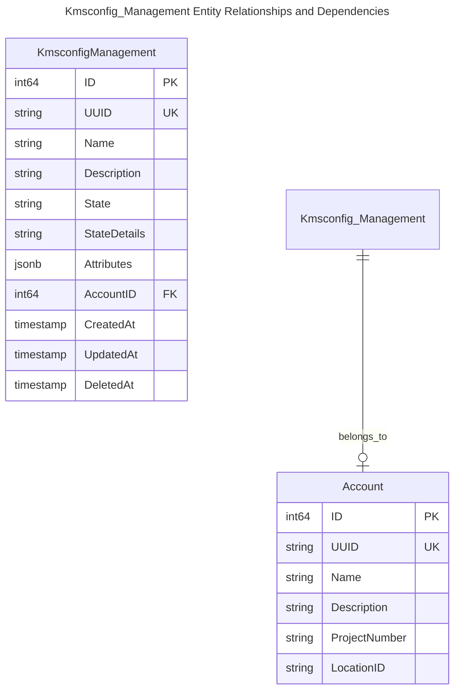
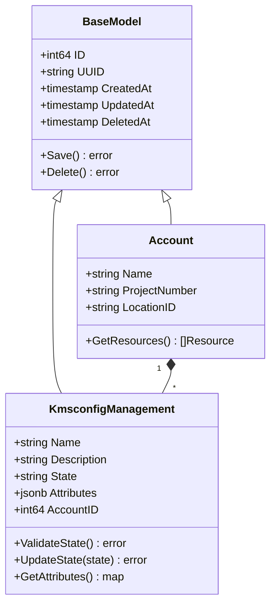
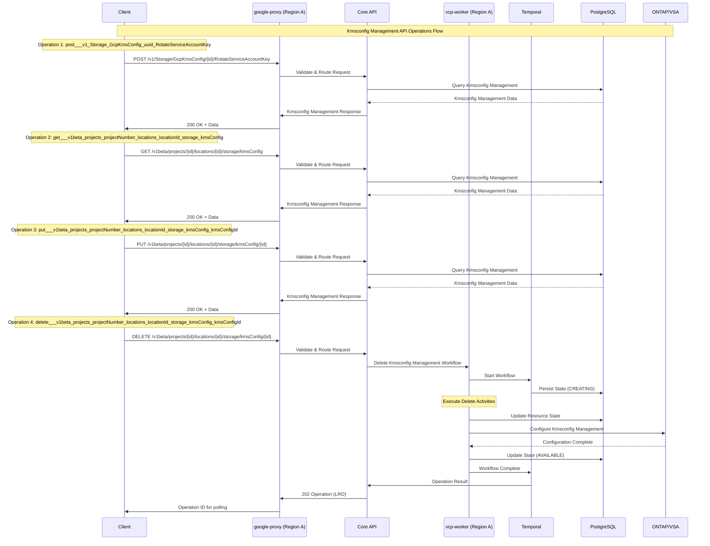
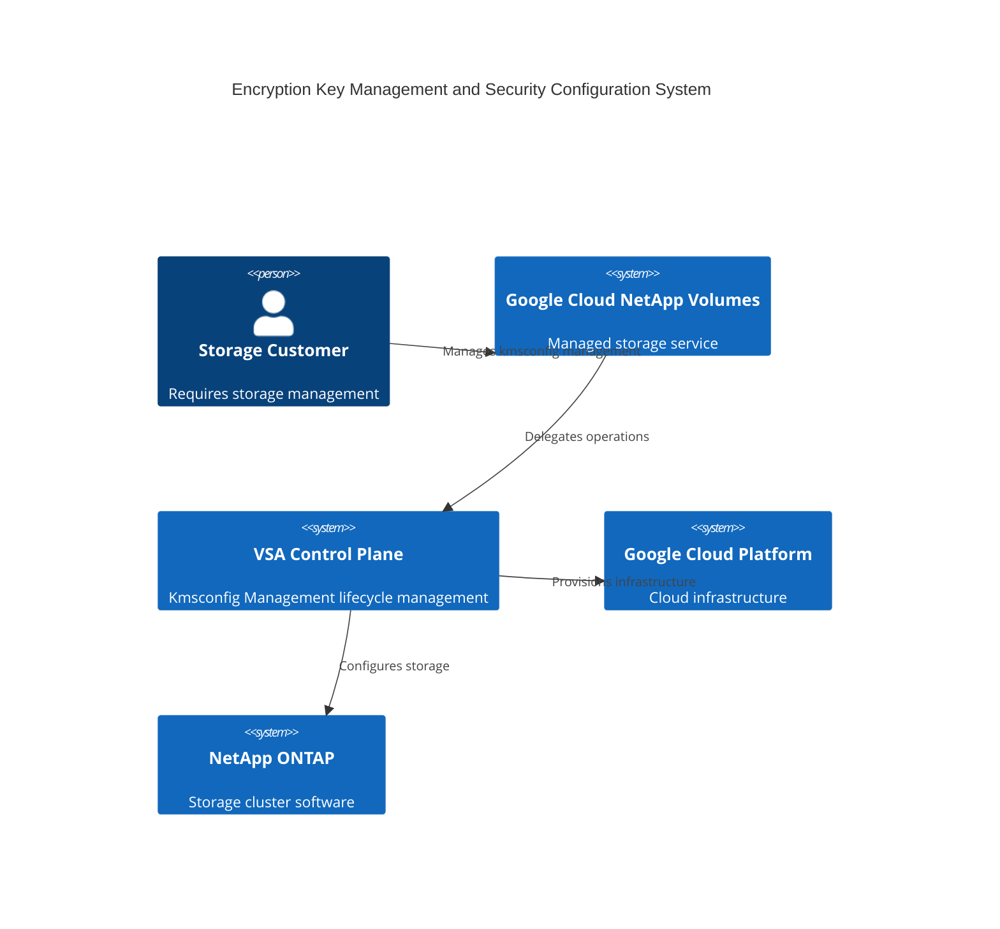
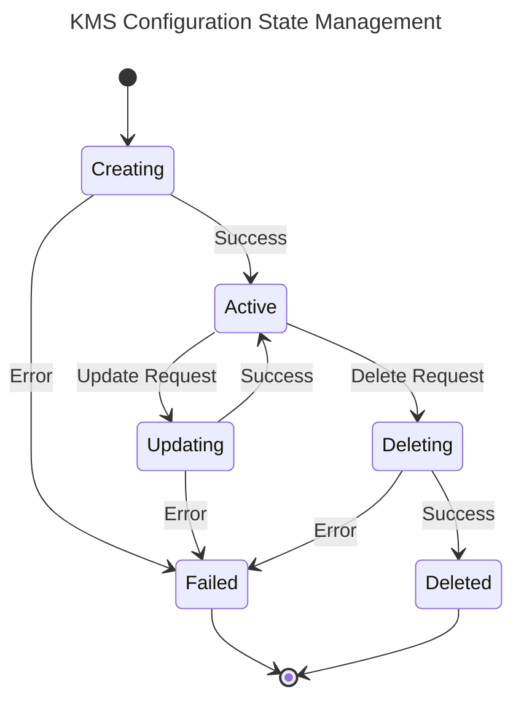

# Kmsconfig Management Lifecycle Management Workflow Design

> 🤖 **Note**: This document was automatically generated using AI-enhanced analysis of the VSA Control Plane codebase.

## Table of Contents
1. [Overview](#overview)
2. [Data Model](#data-model)
3. [API Operations](#api-operations)
4. [Architecture Components](#architecture-components)
5. [Workflow Architecture](#workflow-architecture)

## Overview

The Kmsconfig Management workflow provides foundational infrastructure for the VSA Control Plane.

### Key Features
- **Feature Type**: Foundational
- **Workflow Type**: Management
- **Complexity**: Moderate
- **Operations**: 9 API operations

## Data Model

### Entity Relationship Diagram - Kmsconfig_Management Data Structure

### Domain Model Architecture

### Core Attributes

| Field | Type | Description |
|-------|------|-------------|
| **ID** | `int64` | Primary key identifier |
| **UUID** | `string` | Universally unique identifier |
| **Name** | `string` | Human-readable resource name |
| **State** | `string` | Current lifecycle state |
| **Attributes** | `jsonb` | Resource-specific configuration |
| **AccountID** | `int64` | Associated account reference |

## API Operations

### Discovered Operations

Found 9 operations for Kmsconfig Management:

| Operation | Service |
|-----------|----------|
| post___v1_Storage_GcpKmsConfig_uuid_RotateServiceAccountKey | core-api |
| get___v1beta_projects_projectNumber_locations_locationId_storage_kmsConfig | google-proxy |
| post___v1beta_projects_projectNumber_locations_locationId_storage_kmsConfig | google-proxy |
| get___v1beta_projects_projectNumber_locations_locationId_storage_kmsConfig_kmsConfigId | google-proxy |
| put___v1beta_projects_projectNumber_locations_locationId_storage_kmsConfig_kmsConfigId | google-proxy |
| delete___v1beta_projects_projectNumber_locations_locationId_storage_kmsConfig_kmsConfigId | google-proxy |
| get___v1beta_projects_projectNumber_locations_locationId_storage_kmsConfig_kmsConfigId_check | google-proxy |
| post___v1beta_projects_projectNumber_locations_locationId_storage_kmsConfig_kmsConfigId_encryptVolumes | google-proxy |
| post___v1beta_projects_projectNumber_locations_locationId_storage_kmsConfig_getMultipleKmsConfigs | google-proxy |

## Architecture Components

### Communication Flow Diagram

The following diagram illustrates the API communication flow for Kmsconfig Management operations discovered from the API specifications:

**Key Components:**
- **Client**: External API consumer (gcloud, terraform, custom applications)
- **google-proxy**: Regional API gateway handling authentication and routing
- **Core API**: Business logic and orchestration layer
- **vcp-worker**: Temporal workflow worker executing background operations
- **Temporal**: Durable workflow engine managing long-running operations
- **PostgreSQL**: Persistent data store for resource state
- **ONTAP/VSA**: NetApp storage cluster for data plane operations

**Operation Types:**
- **Create**: 4 operation(s) - post___v1_Storage_GcpKmsConfig_uuid_RotateServiceAccountKey, post___v1beta_projects_projectNumber_locations_locationId_storage_kmsConfig, post___v1beta_projects_projectNumber_locations_locationId_storage_kmsConfig_kmsConfigId_encryptVolumes (+1 more)
- **Update**: 1 operation(s) - put___v1beta_projects_projectNumber_locations_locationId_storage_kmsConfig_kmsConfigId
- **Delete**: 1 operation(s) - delete___v1beta_projects_projectNumber_locations_locationId_storage_kmsConfig_kmsConfigId
- **Get**: 3 operation(s) - get___v1beta_projects_projectNumber_locations_locationId_storage_kmsConfig, get___v1beta_projects_projectNumber_locations_locationId_storage_kmsConfig_kmsConfigId, get___v1beta_projects_projectNumber_locations_locationId_storage_kmsConfig_kmsConfigId_check

**Total Operations**: 9 API endpoints for Kmsconfig Management

### System Context Diagram

## Workflow Architecture

### State Machine - KMS Configuration State Management

### Error Handling Strategy

- **Temporal Retries**: Automatic retry with exponential backoff
- **Compensation Logic**: Rollback on failure using Temporal compensation
- **Error Categorization**: Custom error codes (see `core/errors/`)
- **State Management**: PostgreSQL transactions ensure consistency

## Deployment Considerations

### Performance
- Workflow timeout configurations based on operation complexity
- Activity-level retries for transient failures
- Database connection pooling for high throughput

### Security
- IAM-based authentication for GCP operations
- Workload Identity for service account access
- Encrypted secrets in database
- Audit logging for all operations

### Monitoring
- Temporal workflow metrics
- Custom metrics via telemetry service
- GCP Cloud Monitoring integration
- Alert policies for failure scenarios

---
*Generated by VSA Control Plane Documentation Generator with AI Enhancement*
*Last Updated: 2025-10-12*
