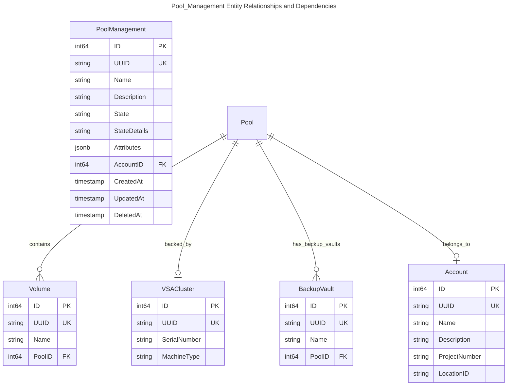
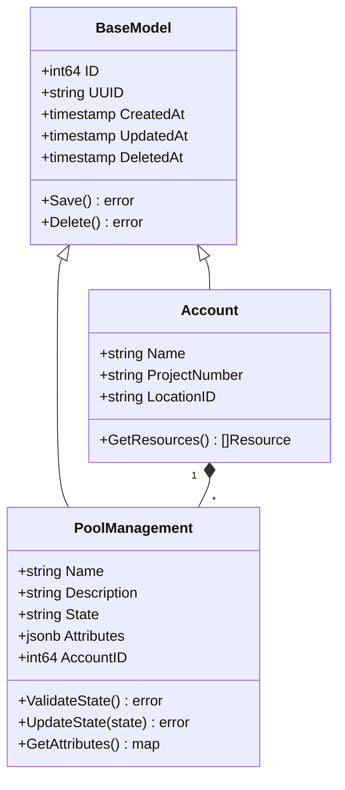
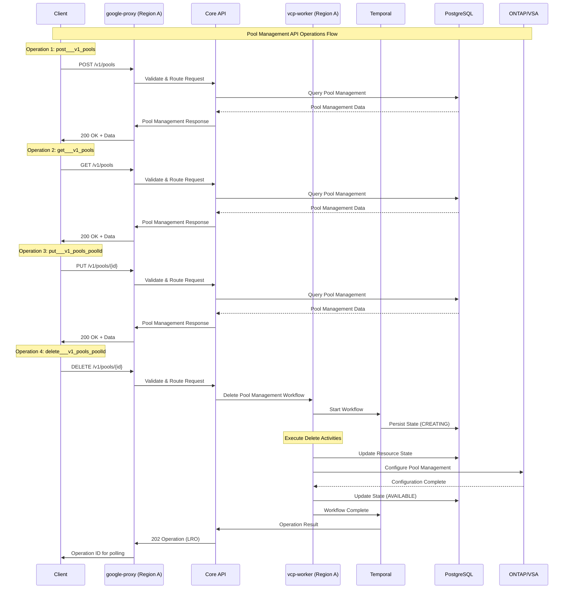
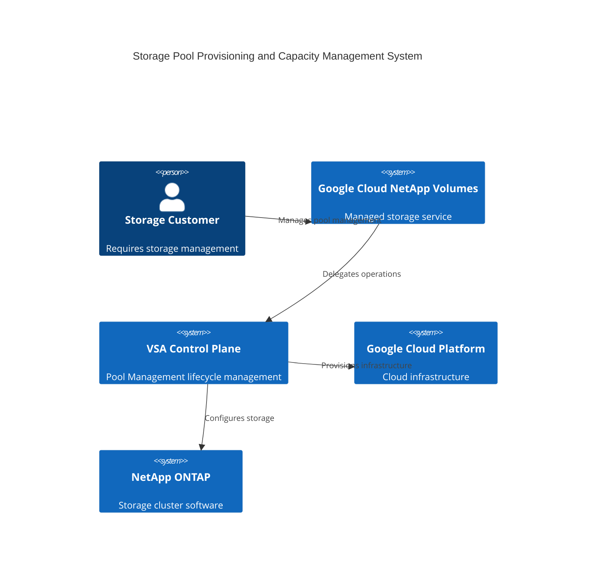
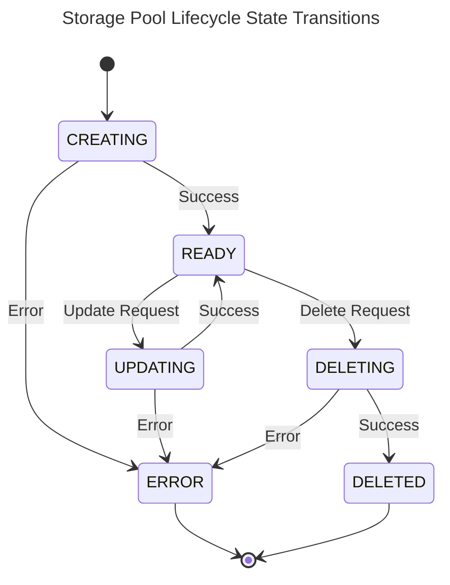
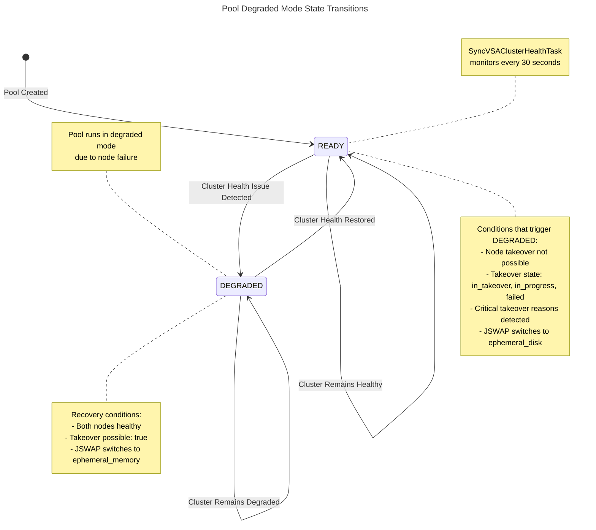

# Pool Management Lifecycle Management Workflow Design

> 🤖 **Note**: This document was automatically generated using AI-enhanced analysis of the VSA Control Plane codebase.

## Table of Contents
1. [Overview](#overview)
2. [Data Model](#data-model)
3. [API Operations](#api-operations)
4. [Architecture Components](#architecture-components)
5. [Workflow Architecture](#workflow-architecture)

## Overview

The Pool Management workflow provides foundational infrastructure for the VSA Control Plane.

### Key Features
- **Feature Type**: Foundational
- **Workflow Type**: Management
- **Complexity**: Complex
- **Operations**: 13 API operations

## Data Model

### Entity Relationship Diagram - Pool_Management Data Structure

### Domain Model Architecture

### Core Attributes

| Field | Type | Description |
|-------|------|-------------|
| **ID** | `int64` | Primary key identifier |
| **UUID** | `string` | Universally unique identifier |
| **Name** | `string` | Human-readable resource name |
| **State** | `string` | Current lifecycle state |
| **Attributes** | `jsonb` | Resource-specific configuration |
| **AccountID** | `int64` | Associated account reference |

## API Operations

### Discovered Operations

Found 13 operations for Pool Management:

| Operation | Service |
|-----------|----------|
| get___v1_pools | core-api |
| post___v1_pools | core-api |
| get___v1_pools_poolId | core-api |
| put___v1_pools_poolId | core-api |
| delete___v1_pools_poolId | core-api |
| get___v1_pools_poolName_ontap_credentials | core-api |
| get___v1beta_projects_projectNumber_locations_locationId_pools | google-proxy |
| post___v1beta_projects_projectNumber_locations_locationId_pools | google-proxy |
| post___v1beta_projects_projectNumber_locations_locationId_getMultiplePools | google-proxy |
| get___v1beta_projects_projectNumber_locations_locationId_pools_poolId | google-proxy |

## Architecture Components

### Communication Flow Diagram

The following diagram illustrates the API communication flow for Pool Management operations discovered from the API specifications:

**Key Components:**
- **Client**: External API consumer (gcloud, terraform, custom applications)
- **google-proxy**: Regional API gateway handling authentication and routing
- **Core API**: Business logic and orchestration layer
- **vcp-worker**: Temporal workflow worker executing background operations
- **Temporal**: Durable workflow engine managing long-running operations
- **PostgreSQL**: Persistent data store for resource state
- **ONTAP/VSA**: NetApp storage cluster for data plane operations

**Operation Types:**
- **Create**: 3 operation(s) - post___v1_pools, post___v1beta_projects_projectNumber_locations_locationId_pools, post___v1beta_projects_projectNumber_locations_locationId_getMultiplePools
- **Update**: 2 operation(s) - put___v1_pools_poolId, put___v1beta_projects_projectNumber_locations_locationId_pools_poolId
- **Delete**: 2 operation(s) - delete___v1_pools_poolId, delete___v1beta_projects_projectNumber_locations_locationId_pools_poolId
- **Get**: 6 operation(s) - get___v1_pools, get___v1_pools_poolId, get___v1_pools_poolName_ontap_credentials (+3 more)

**Total Operations**: 13 API endpoints for Pool Management

### System Context Diagram

## Workflow Architecture

### State Machine - Storage Pool Lifecycle State Transitions

### Degraded Mode State Transitions

The pool can enter a **DEGRADED** state when cluster health issues are detected (e.g., node failures, takeover issues). This is managed by the `SyncVSAClusterHealthTask` which runs periodically (every 30 seconds) to monitor cluster health and perform JSWAP operations.

**Key Characteristics:**
- Degraded mode transitions only occur when the pool is in `READY` or `DEGRADED` state (prevents race conditions with `UPDATING`, `DELETING`, etc.)
- State transitions are driven by cluster health assessment and JSWAP operations
- The system automatically recovers from degraded mode when cluster health is restored

**State Transition Details:**

| Transition | Trigger | Action | Notes |
|------------|---------|--------|-------|
| **READY → DEGRADED** | Cluster health issues detected | JSWAP to `ephemeral_disk` | Node failures, takeover issues, or critical reasons preventing takeover |
| **DEGRADED → READY** | Cluster health restored | JSWAP to `ephemeral_memory` | Both nodes healthy, takeover possible |
| **READY → READY** | Cluster remains healthy | No state change | Normal operation continues |
| **DEGRADED → DEGRADED** | Cluster remains degraded | No state change | Health issues persist |

**JSWAP Operations:**
- **JSWAP to ephemeral_disk**: Performed when cluster health issues are detected, updates pool state to `DEGRADED`
- **JSWAP to ephemeral_memory**: Performed when cluster health is restored, updates pool state to `READY`

**Monitoring:**
- `SyncVSAClusterHealthTask` runs every 30 seconds
- Only processes pools in `READY` or `DEGRADED` state
- Uses optimistic concurrency control to prevent race conditions

> **Note**: When a pool is in `DEGRADED` mode, all control plane CRUD operations (Create, Read, Update, Delete) will continue to execute as before but will have no effect on the pool's operational state. The pool remains in degraded mode until cluster health is restored and the system automatically transitions it back to `READY` state.

### Error Handling Strategy

- **Temporal Retries**: Automatic retry with exponential backoff
- **Compensation Logic**: Rollback on failure using Temporal compensation
- **Error Categorization**: Custom error codes (see `core/errors/`)
- **State Management**: PostgreSQL transactions ensure consistency

## Deployment Considerations

### Performance
- Workflow timeout configurations based on operation complexity
- Activity-level retries for transient failures
- Database connection pooling for high throughput

### Security
- IAM-based authentication for GCP operations
- Workload Identity for service account access
- Encrypted secrets in database
- Audit logging for all operations

### Monitoring
- Temporal workflow metrics
- Custom metrics via telemetry service
- GCP Cloud Monitoring integration
- Alert policies for failure scenarios

---
*Generated by VSA Control Plane Documentation Generator with AI Enhancement*
*Last Updated: 2025-10-12*
