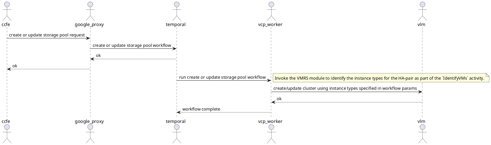
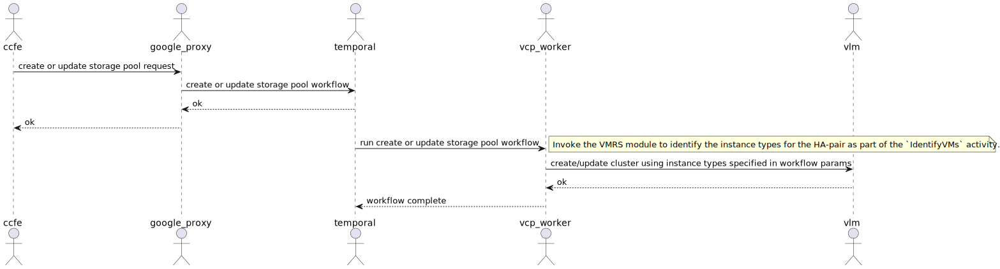
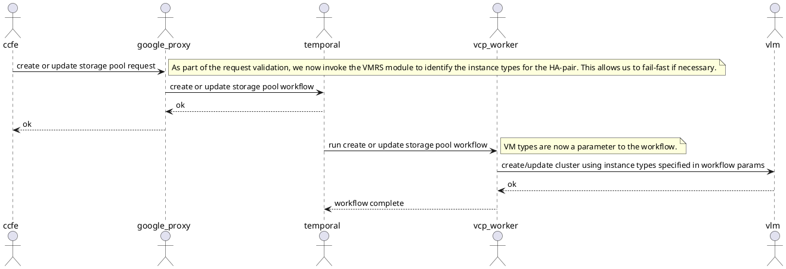
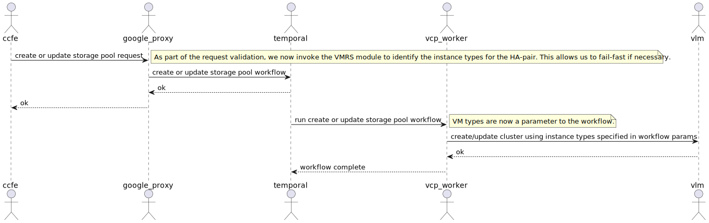

# 5. VMRS - Preview support.

Date: 2025-07-15

## Status

Accepted

## Context

Customers need to provision GCNV storage pools by specifying capacity and performance (IOPs, throughput) characteristics. VMRS (Virtual Machine Right Sizing) is our mechanism to select an optimal cluster configuration that guarantees to deliver up to the customer requested performance and capacity for a storage pool, while minimizing costs for us.

There are several challenges with optimizing just for cost, as detailed in Bhushan's documents: [1](#references) and [2](#references). Our most probable launch strategy for GA (as of June 24, 2025) will be to launch with sub-pools (sub-pool = HA-pair). Customers will have to specify an overall storage pool configuration, and additionally specify sub-pool configurations.

## Decision

For the Block launch (Preview), a Product decision was taken to constrain customers to a single HA-pair per storage pool.

The rest of the document provides details on how our implementation supports this decision.

## Assumptions.

1. We extract qualification numbers from the hyperscaler ([GCP example](https://cloud.google.com/compute/docs/disks/hyperdisk-perf-limits#per-vm-limits-summary)). Let's call the max. supported IOPs/throughput for a specific VM-disk combination $U_i$, $U_t$.
1. Perf team will quantify ONTAP performance on various GCP instance types, and provide a [sample data table like so](https://confluence.ngage.netapp.com/pages/viewpage.action?pageId=1163288632#GCNVBlockandUnifiedProductPositioningandVMRS-SampleVMRStablefordevtesting). These are raw numbers ($V_c$, $V_i$, $V_t$ without accounting for any overheads/headroom for a sizing workload that is identified by the Perf team.
1. Perf team will also quantify ONTAP amplification factors ($A_c$, $A_i$, $A_t$ for capacity, IOPs, throughput respectively), workload headrooms ($W_j$ for each workload $j$), and hot spotting prevention factors ($H_i$, $H_t$ for IOPs and throughput respectively). These numbers MUST be configurable in the application.

This information (from the perf team and from the hyperscaler) is captured in a yaml file, [like so](https://github.com/VCP-VSA-control-Plane/vsa-control-plane/blob/main/config/vmrs_gcp.yaml). The values in this file (as of June 24, 2025) are all dummy values. They've been chosen to match the max. values allowed by the hyperscaler (GCP) disk (hyperdisk-balanced).

## Logic.

For preview, we want to support only a single HA-pair.

Customers specify the performance characteristics they expect at the storage pool level only ($D_c$, $D_i$, $D_t$ for desired capacity, desired iops, and desired throughput respectively).

The logic for identifying the VMs for a single HA-pair, while optimizing for cost is below.

1. For each VM, derate the raw performance numbers provided by the perf team by the workload headroom factors.
    1. We don't need the ONTAP overheads in here because they are already accounted for by the raw performance numbers generated from the sizing workload (which was run against an ONTAP cluster).
    1. If a VM was quantified to support ($V_i$, $V_t$), we need to scale them down (by multiplying it with $(1 - \sum_j W_j))$. That is, we compute $V^{'}_i = V_i * (1 - \sum_j W_j)$. Similarly for throughput ($V^{'}_t$).
    1. The largest instance's ONTAP overheads are setup to offset derating. That is, after $V_i$ and $V_t$ are identified, just for the largest instance, we populate the VMRS config file with the values $V_t = V_t / (1 - \sum_j W_j))$ and $V_i = V_i / (1 - \sum_j W_j))$.
1. Use the derated numbers to decide if a customer's workload can be supported by that VM. We loop through the list of VM performance characteristics (sorted by cost), and finding the first (cheapest) VM that satisfies all 3 constraints for capacity, IOPs and throughput.
    1. That is, desired $\leq V^{'}_x$
1. We have now identified the instance type (or VM type) to use for the single HA-pair. When provisioning the disk, we need to over-provision that disk to account for all the overheads.
    1. This is needed because we don't want to provision with the max. capacity/IOPs/throughput that is allowed by the hyperscaler. We want to constrain the customer to only what they provision, while at the same time, allowing for them to achieve whatever performance they requested. For example, if the customer requested for 100 IOPs, and we identified that the `c4-standard-4-lssd` instance/VM type offered by GCP can be used, we don't want to provision the Hyperdisk with the max. IOPs possible. We only want to provision it with 100 IOPs (with additional IOPs to account for ONTAP overheads + workload headrooms) so that the customer will get 100 IOPs, and no more.
    1. At the same time, we don't want to overprovision by such a large factor that ONTAP cannot possibly utilize. So we also have a max overprovisioning factor ($M_i$, $M_t$). Which means that we never overprovision by more that this factor overall (after all other overheads are combined).
    1. iops_for_disk_provisioning = min($D_i * A_i * ( 1 + (\sum_j W_j) * H_i$, $M_i * U_i$)
    1. throughput_for_disk_provisioning = min($D_t * A_t * ( 1 + (\sum_j W_j) * H_t$, $M_t * U_t$)
    1. capacity_for_disk_provisioning = $D_c * A_c$ // we do not need workload specific capacity headroom
1. We have now identified the VM type, the disk provisioning numbers (for the entire storage pool), and the number of disks to attach to each VM (8 per VM for zonal shared HA-pairs, and 4 per VM for non-shared regional HA-pairs). We can now invoke VLM which takes care of creating the right number of hyperdisks, and provisioning them with the right performance characteristics (dividing by 8 or 4 as necessary).

## Sequence diagrams.

### Current implementation.

### Ideal implementation.

We are currently planning to use a constraint solver (Google's or-tools) to identify the right combination of VMs when we want to support multiple HA-pairs. Constraint solvers can take more than 30 seconds in some cases. While or-tools allows us to set timeouts (max. time before an optimal solution is found), the threshold we choose (2-5 mins) may be higher than generally acceptable latencies for synchronous API calls (< 30s). Until we finalize on a strategy for supporting multiple HA-pairs (using constraint solvers, or going with sub-pools, or something else), we choose to punt performing the VMRS checks on the synchronous request path.

##  References.

1. [SKU Based Provisioning (FSxN Model) versus VM Right Sizing Provisioning (Flex Model) White Paper](https://netapp-my.sharepoint.com/:w:/p/jbhushan/EQ6NWK0z149Gp3rzoWUnh8gBVMxz54KF0gPw8gu9AVrJIg?e=Ech5UK&wdLOR=cEBF27638-219B-C24F-8AB9-143FDDB0578E)
1. [GCNV Block and Unified Product Positioning and VMRS](https://confluence.ngage.netapp.com/display/PALM/GCNV+Block+and+Unified+Product+Positioning+and+VMRS)
