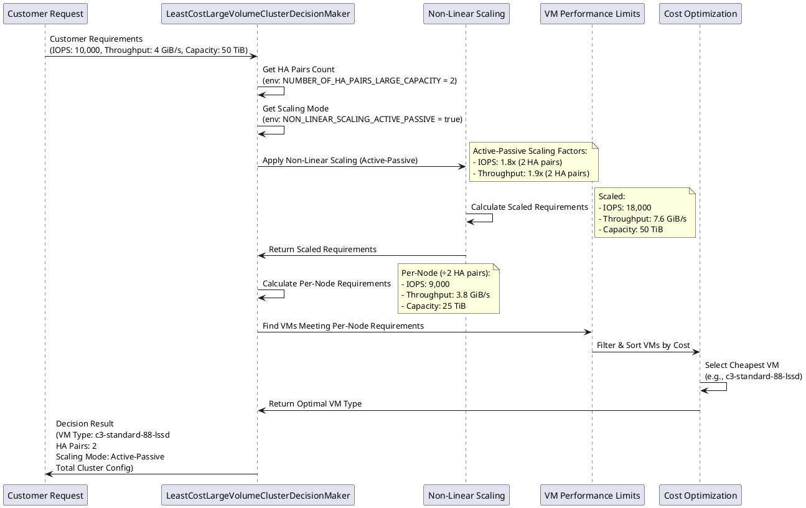
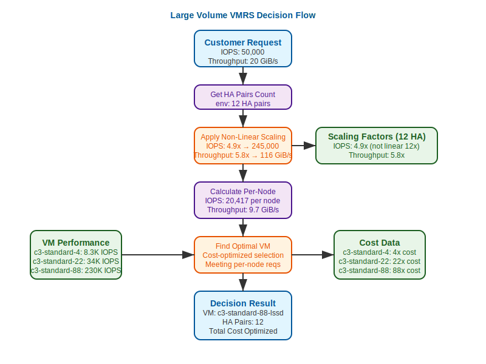

# 6. Large Volume VMRS Decision Maker

Date: 2025-09-18

Last Updated: 2025-09-18

## Status

Accepted

## Context

With the introduction of FlexGroup support in GCNV, customers can now provision large volume storage pools that require multiple HA pairs to deliver the requested performance and capacity. Unlike single HA-pair deployments, large volume clusters need specialized VM selection logic that accounts for:

1. **Non-linear Performance Scaling**: Performance doesn't scale linearly with the number of HA pairs due to cluster overhead
2. **Active-Passive vs Active-Active Scaling**: Different scaling factors needed for active-passive and active-active deployment modes
3. **Fixed HA Pair Count**: Large volume clusters use a fixed number of HA pairs (defaults to 2 for development, configurable via environment variables)
4. **Per-Node Performance Requirements**: Customer requirements must be scaled and distributed across multiple nodes
5. **Separation of Concerns**: VM selection logic should be separate from constraint validation
6. **Strict Configuration**: No interpolation between scaling factors - exact HA pair count scaling factors must be configured

## Decision

We have implemented a dedicated `LeastCostLargeVolumeClusterDecisionMaker` that extends the VMRS system to support large volume clusters while maintaining the existing single VM decision maker for regular deployments.

### Key Design Decisions:

1. **Strategy Pattern Implementation**: 
   - `LeastCostSingleVMDecisionMaker` for regular pools
   - `LeastCostLargeVolumeClusterDecisionMaker` for large volume pools
   - Both implement the common `DecisionMaker` interface

2. **Non-Linear Scaling Factors**:
   - Separate configurable scaling factors for active-passive and active-active modes
   - Environment variable `NON_LINEAR_SCALING_ACTIVE_PASSIVE` controls mode selection (defaults to true)
   - Example scaling factors:
     - Active-Passive: 2 HA pairs = 1.8x IOPS, 6 HA pairs = 4.0x IOPS, 12 HA pairs = 4.9x IOPS
     - Active-Active: 2 HA pairs = 1.8x IOPS, 6 HA pairs = 4.0x IOPS, 12 HA pairs = 4.9x IOPS
   - Accounts for cluster coordination overhead and deployment mode differences

3. **Fixed HA Pair Architecture**:
   - Uses environment variable `NUMBER_OF_HA_PAIRS_LARGE_CAPACITY` (defaults to 6)
   - Uses environment variable `NON_LINEAR_SCALING_ACTIVE_PASSIVE` (defaults to true)
   - Avoids dynamic HA pair calculation complexity
   - Aligns with product requirements for large volume clusters

4. **Constraint Validation Separation**:
   - Large volume constraints (capacity, throughput limits) validated at orchestrator layer
   - VMRS decision makers focus solely on VM selection and performance scaling
   - Improves separation of concerns and performance

5. **Enhanced Error Handling**:
   - Explicit error returns for missing scaling configurations
   - No interpolation fallback - requires exact HA pair count configuration
   - Clear error messages indicating missing active-passive or active-active configuration

6. **Shared Utilities**:
   - Common `FindVMsByType` for scaling-direction lookup; `CanonicalVMTypeInCatalog` when comparing catalog `vm_type` to pool/VLM instance strings (non-`-lssd` override); internal resolver prefers exact `vm_type` before trying a synthetic `-lssd` suffix
   - Standardized error handling across both decision makers
   - Early break optimization for performance

## Implementation Details

### Configuration Structure
```yaml
vmrs:
  selection_strategy: "least_cost_large_volume_cluster"  # or "least_cost_single_vm"
  
  # Active-passive mode scaling factors (selected when NON_LINEAR_SCALING_ACTIVE_PASSIVE=true)
  non_linear_scaling_active_passive:
    base_factor: 1.0
    max_scaling_factor: 10.0
    iops_factors:
      1: 1.0    # 1 HA pair = 100% performance
      2: 1.8    # 2 HA pairs = 180% performance
      6: 4.8    # 6 HA pairs = 480% performance  
      12: 4.9   # 12 HA pairs = 490% performance
    throughput_factors:
      1: 1.0    # 1 HA pair = 100% performance
      2: 1.9    # 2 HA pairs = 190% performance
      6: 4.8    # 6 HA pairs = 480% performance
      12: 5.8   # 12 HA pairs = 580% performance
      
  # Active-active mode scaling factors (selected when NON_LINEAR_SCALING_ACTIVE_PASSIVE=false)
  non_linear_scaling_active_active:
    base_factor: 1.0
    max_scaling_factor: 10.0
    iops_factors:
      1: 1.0    # Different scaling characteristics for active-active
      2: 1.8    # Both nodes actively serve traffic
      6: 4.0
      12: 4.9
    throughput_factors:
      1: 1.0
      2: 1.9
      6: 4.5
      12: 5.8
```

### Decision Flow
1. **Input**: Customer performance requirements (IOPS, throughput, capacity)
2. **Mode Selection**: Choose active-passive or active-active scaling based on `NON_LINEAR_SCALING_ACTIVE_PASSIVE` environment variable
3. **Scaling**: Apply non-linear scaling factors based on HA pair count and selected mode
4. **Validation**: Ensure exact scaling factors exist for the configured HA pair count (no interpolation)
5. **Per-Node Calculation**: Divide scaled requirements by number of HA pairs
6. **VM Selection**: Find cheapest VM that meets per-node requirements
7. **Output**: Selected VM types and cluster configuration

### Example Calculation (Active-Passive Mode)
- Customer Request: 10,000 IOPS, 4 GiB/s throughput
- HA Pairs: 2 (from `NUMBER_OF_HA_PAIRS_LARGE_CAPACITY` environment variable)
- Mode: Active-Passive (from `NON_LINEAR_SCALING_ACTIVE_PASSIVE=true`)
- Scaling Factors: 1.8x IOPS, 1.9x throughput (exact match for 2 HA pairs)
- Scaled Requirements: 18,000 IOPS, 7.6 GiB/s throughput
- Per-Node Requirements: 9,000 IOPS, 3.8 GiB/s throughput
- Selected VM: Cheapest VM type that can handle per-node load

## File Changes

### New Files
- `core/vmrs/decision/least_cost_large_volume_cluster.go` - Large volume decision maker implementation
- `core/vmrs/decision/least_cost_large_volume_cluster_test.go` - Comprehensive test suite
- `core/vmrs/decision/testdata/valid_large_volume.yaml` - Test configuration with both active-passive and active-active scaling factors
- `core/vmrs/decision/testdata/valid_large_volume_no_scaling.yaml` - Test configuration without scaling

### Modified Files
- `core/vmrs/types.go` - Added `NonLinearScalingActivePassive` and `NonLinearScalingActiveActive` fields, shared `FindVMsByType` / `CanonicalVMTypeInCatalog` utilities
- `core/vmrs/decision/least_cost_single_vm.go` - Fixed range loop bug in `sortVMsByCost`, updated to use shared utilities
- `core/vmrs/decision/factory.go` - Added comprehensive docstrings
- `core/orchestrator/activities/pool_activities.go` - Added dedicated `CreateLargeVolumeVMRSConfig` function for config modification
- `core/orchestrator/activities/testdata/valid_vmrs_gcp.yaml` - Added both active-passive and active-active scaling configurations
- `kubernetes/vcp-worker-chart/values.yaml` - Added `nonLinearScalingActivePassive` configuration
- `kubernetes/vcp-worker-chart/templates/configMap.yaml` - Added `NON_LINEAR_SCALING_ACTIVE_PASSIVE` environment variable
- `skaffold/k8s/vcp-worker.yaml` - Added `NON_LINEAR_SCALING_ACTIVE_PASSIVE` environment variable

### Removed Files
- `core/vmrs/decision/testdata/invalid_large_volume_constraints.yaml` - No longer needed after constraint validation removal

## Test Coverage

### VMRS Decision Maker Tests
- ✅ VM selection with various performance requirements
- ✅ Non-linear scaling factor application for both active-passive and active-active modes
- ✅ Error handling for missing scaling configurations
- ✅ Error handling for unconfigured HA pair counts (no interpolation)
- ✅ Error handling for invalid VM types
- ✅ Edge cases and boundary conditions
- ✅ Configuration loading and validation
- ✅ Range loop bug fix verification

### Orchestrator Integration Tests
- ✅ Successful VM identification for large volumes
- ✅ Config preparation failure scenarios
- ✅ VMRS config loading failures
- ✅ Decision maker creation failures
- ✅ Optimal VM finding failures

### Performance Ranges Tested
- **Capacity**: 12 TiB → 100 TiB
- **IOPS**: 5,000 → 25,000
- **Throughput**: 2 GiB/s → 16 GiB/s
- **HA Pairs**: 1, 2, 6, 12 (exact scaling factor matches)
- **Error Cases**: 3, 9, 15 HA pairs (missing scaling factors)

## Decision Flow Diagram

The following diagram illustrates the large volume VMRS decision-making process:

<div hidden>



</div>



## Environment Variables

The large volume VMRS decision maker is controlled by two key environment variables:

### `NUMBER_OF_HA_PAIRS_LARGE_CAPACITY`
- **Default**: `2`
- **Purpose**: Sets the fixed number of HA pairs for large volume clusters
- **Usage**: Determines cluster size and affects per-node performance calculations
- **Deployment**: Can be configured in Kubernetes ConfigMaps for different environments

### `NON_LINEAR_SCALING_ACTIVE_PASSIVE`
- **Default**: `true`
- **Purpose**: Selects between active-passive and active-active scaling factor configurations
- **Values**: 
  - `true`: Uses `non_linear_scaling_active_passive` configuration
  - `false`: Uses `non_linear_scaling_active_active` configuration
- **Impact**: Affects how customer performance requirements are scaled based on deployment architecture

## Consequences

### Positive
- **Scalability**: Supports large volume deployments with multiple HA pairs
- **Performance Accuracy**: Separate active-passive and active-active scaling factors provide realistic performance modeling
- **Maintainability**: Clear separation between single VM and large volume logic
- **Testability**: Comprehensive test coverage for both success and failure scenarios
- **Flexibility**: Configurable scaling factors, HA pair counts, and deployment modes
- **Robustness**: Strict error handling prevents interpolation-based miscalculations
- **Configuration Safety**: Dedicated function for large volume config modification improves code maintainability

### Considerations
- **Configuration Complexity**: Requires separate scaling factor configurations for both deployment modes
- **Exact Factor Requirements**: No interpolation means all supported HA pair counts must have explicit scaling factors
- **Performance Testing**: Both active-passive and active-active scaling factors need validation against real cluster performance
- **Environment Variable Management**: Proper configuration of environment variables across different deployment environments
- **Monitoring**: Need visibility into VM selection decisions and scaling mode selection for troubleshooting

## Future Enhancements

1. **Dynamic Scaling Mode Detection**: Automatic detection of optimal scaling mode based on workload characteristics
2. **Hybrid Scaling Configurations**: Support for mixed active-passive and active-active scaling within the same cluster
3. **Cost Optimization**: Advanced cost optimization considering different VM type combinations across deployment modes
4. **Performance Benchmarks**: Automated performance testing to validate both active-passive and active-active scaling factors
5. **Observability**: Enhanced logging and metrics for VM selection decisions and scaling mode selection
6. **Configuration Validation**: Runtime validation of scaling factor configurations against supported HA pair counts
7. **Adaptive HA Pair Selection**: Dynamic HA pair count selection based on performance and capacity requirements

## References

1. [VMRS Preview Implementation (ADR-0005)](./0005-vmrs-for-preview.md)
2. [NetApp FlexGroup Performance Documentation](https://docs.netapp.com/us-en/ontap/flexgroup/index.html)
3. [GCP VM Performance Limits](https://cloud.google.com/compute/docs/disks/hyperdisk-perf-limits#per-vm-limits-summary)
