# Backup Vault Design and Architecture

## Table of Contents
1. [Overview](#overview)
2. [Architecture Components](#architecture-components)
3. [Data Model](#data-model)
4. [Backup Vault Types](#backup-vault-types)
5. [Lifecycle Management](#lifecycle-management)
6. [API Design](#api-design)
7. [Workflow Architecture](#workflow-architecture)
8. [Storage Integration](#storage-integration)

## Overview

A Backup Vault is a storage entity in the VSA Control Plane that manages backup data with configurable retention policies and immutable storage capabilities.

### Key Features
- **Storage Container**: Organizes backups by account and region
- **Retention Policy Management**: Configurable backup retention with immutable options
- **Cross-Region Support**: Supports both in-region and cross-region backup vaults
- **Bucket Management**: Integrates with GCP storage buckets for data storage
- **Lifecycle State Management**: State tracking for all operations
- **Volume Association**: Links to volumes for backup operations
- **Lazy VCP Registration**: VCP database entries are created only when volumes are attached to the vault

### Important Architectural Note
Backup vaults are created directly in SDE (Storage Data Engine) and VCP database entries are created **lazily** when a volume is first attached to the backup vault. This means:
- Initial backup vault creation only involves SDE
- VCP database entries are created during volume creation workflow

## Architecture Components

### High-Level Architecture

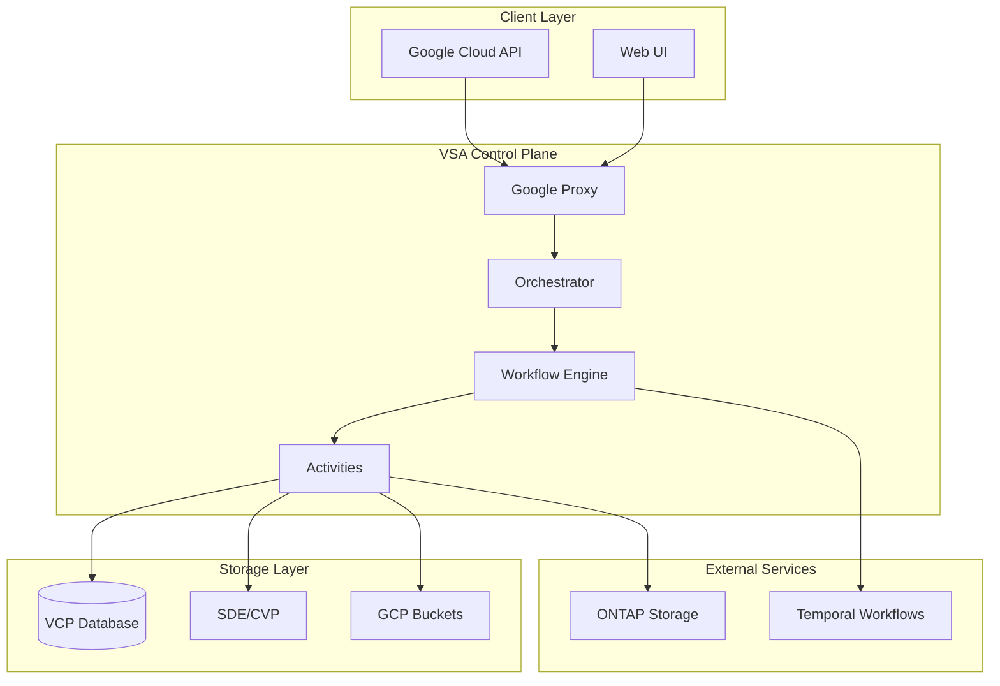

### Component Responsibilities

| Component | Responsibility |
|-----------|----------------|
| **Google Proxy** | API endpoint handling, request validation, response formatting |
| **Orchestrator** | Business logic, state management, workflow coordination |
| **Workflow Engine** | Long-running operation orchestration using Temporal |
| **Activities** | Individual operation implementations (CRUD, validation) |
| **VCP Database** | Local state persistence and metadata storage |
| **SDE/CVP** | External backup vault management service |
| **GCP Buckets** | Actual backup data storage |

## Data Model

### Core Backup Vault Entity

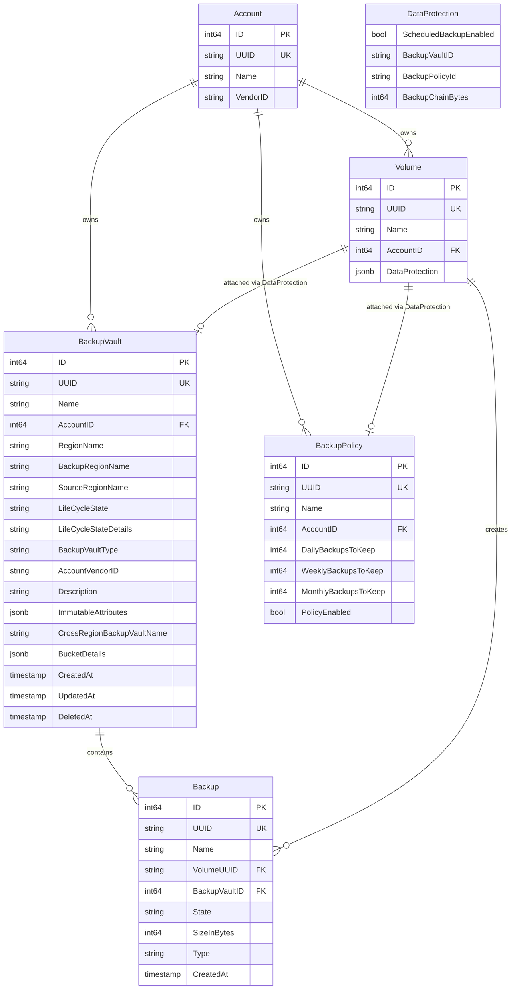

### Immutable Attributes Structure

```json
{
  "BackupMinimumEnforcedRetentionDuration": 30,
  "IsDailyBackupImmutable": true,
  "IsWeeklyBackupImmutable": false,
  "IsMonthlyBackupImmutable": true,
  "IsAdhocBackupImmutable": false
}
```

### Bucket Details Structure

```json
[
  {
    "bucket_name": "backup-vault-bucket-123",
    "service_account_name": "backup-service-account",
    "vendor_subnet_id": "subnet-123",
    "tenant_project_number": "123456789"
  }
]
```

## Backup Vault Types

### 1. In-Region Backup Vault
- **Type**: `IN_REGION`
- **Purpose**: Stores backups in the same region as the source volume
- **Use Case**: Fast backup and restore operations, lower latency
- **Configuration**: Single region specification

### 2. Cross-Region Backup Vault
- **Type**: `CROSS_REGION`
- **Purpose**: Stores backups in a different region for disaster recovery
- **Use Case**: Geographic redundancy, compliance requirements
- **Configuration**: Source region and backup region specification

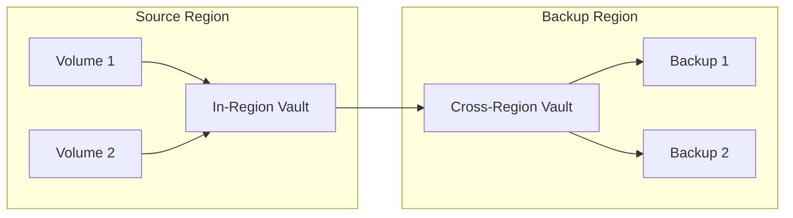

## Lifecycle Management

### State Transitions

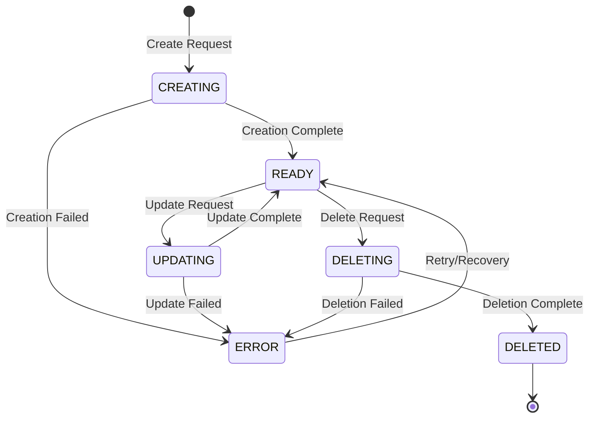

### State Descriptions

| State | Description | Details |
|-------|-------------|---------|
| `CREATING` | Initial creation in progress | Vault being provisioned in SDE and VCP |
| `READY` | Available for use | Vault ready to accept backups |
| `UPDATING` | Configuration update in progress | Retention policy or description being updated |
| `DELETING` | Deletion in progress | Vault and associated buckets being removed |
| `DELETED` | Soft deleted | Vault marked as deleted but data retained |
| `ERROR` | Operation failed | Requires manual intervention or retry |

## API Design

### REST Endpoints

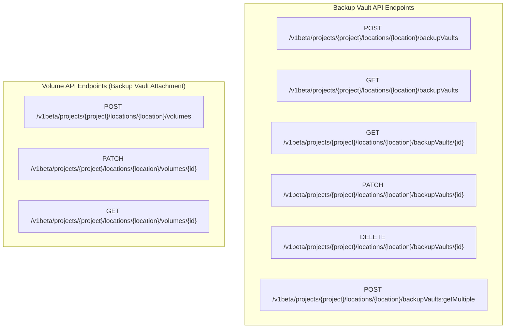

### Request/Response Models

#### Create Backup Vault Request
```json
{
  "resourceId": "my-backup-vault",
  "description": "Production backup vault",
  "backupRegion": "us-central1",
  "backupRetentionPolicy": {
    "backupMinimumEnforcedRetentionDays": 30,
    "dailyBackupImmutable": true,
    "weeklyBackupImmutable": false,
    "monthlyBackupImmutable": true,
    "manualBackupImmutable": false
  }
}
```

#### Backup Vault Response
```json
{
  "backupVaultId": "uuid-123",
  "resourceId": "my-backup-vault",
  "state": "READY",
  "stateDetails": "Available for use",
  "createdAt": "2024-01-01T00:00:00Z",
  "backupRegion": "us-central1",
  "sourceRegion": "us-east1",
  "backupVaultType": "CROSS_REGION",
  "backupRetentionPolicy": {
    "backupMinimumEnforcedRetentionDays": 30,
    "dailyBackupImmutable": true,
    "weeklyBackupImmutable": false,
    "monthlyBackupImmutable": true,
    "manualBackupImmutable": false
  }
}
```

#### Create Volume with Backup Vault Request
```json
{
  "volume": {
    "resourceId": "my-volume",
    "quotaInBytes": 1073741824,
    "poolId": "pool-123"
  },
  "backupConfig": {
    "backupVaultId": "projects/123/locations/us-central1/backupVaults/vault-123",
    "backupPolicyId": "projects/123/locations/us-central1/backupPolicies/policy-456",
    "scheduledBackupEnabled": true
  }
}
```

#### Update Volume Backup Configuration Request
```json
{
  "backupConfig": {
    "backupVaultId": "projects/123/locations/us-central1/backupVaults/new-vault-456",
    "scheduledBackupEnabled": false
  }
}
```

## Workflow Architecture

### Workflow Types

| Workflow | Purpose | Input Parameters | Output |
|----------|---------|------------------|--------|
| `UpdateBackupVaultWorkflow` | Update backup vault configuration | `BackupVaultParams`, `BackupVault` | `V1betaUpdateBackupVaultRes` |
| `DeleteBackupVaultWorkflow` | Delete backup vault and cleanup resources | `BackupVaultParams`, `BackupVault` | `V1betaDeleteBackupVaultRes` |

### Workflow Structure

```mermaid
classDiagram
    class BaseWorkflow {
        +string ID
        +string CustomerID
        +WorkflowStatus Status
        +Logger Logger
        +Setup(ctx, input) error
        +Run(ctx, args) (interface{}, CustomError)
        +UpdateJobStatus(ctx, state, err) error
    }
    
    class backupVaultUpdateWorkflow {
        +BaseWorkflow
        +Storage SE
    }
    
    class backupVaultDeleteWorkflow {
        +BaseWorkflow
        +Storage SE
    }
    
    BaseWorkflow <|-- backupVaultUpdateWorkflow
    BaseWorkflow <|-- backupVaultDeleteWorkflow
```

### Workflow Activities

| Activity | Purpose | Input | Output |
|----------|---------|-------|--------|
| `GetAuthJWTToken` | Get authentication token | `AccountName` | `JWT Token` |
| `UpdateBackupVaultInSDE` | Update backup vault in SDE | `BackupVaultParams` | `BackupVault` |
| `UpdateBackupVaultInVCP` | Update backup vault in VCP database | `BackupVault`, `BackupVault` | `BackupVault` |
| `DeleteBackupVaultInSDE` | Delete backup vault from SDE | `BackupVaultParams` | `BackupVault` |
| `DeleteBackupVaultBuckets` | Delete associated GCP buckets | `BackupVault` | `void` |
| `DeleteBackupVaultInVCP` | Delete backup vault from VCP database | `BackupVaultID` | `BackupVault` |
| `UpdateBackupVaultState` | Update backup vault state | `BackupVault`, `State`, `StateDetails` | `BackupVault` |
| `UpdateBackupVaultStateInCaseOfError` | Rollback state on error | `BackupVault`, `State`, `StateDetails` | `void` |
| `UpdateJobStatus` | Update job status | `JobID`, `State`, `Error` | `void` |

### Workflow Execution Details

#### Workflow Lifecycle

| Phase | Description | Activities |
|-------|-------------|------------|
| **Setup** | Initialize workflow with parameters | `Setup(ctx, input)` |
| **Processing** | Execute main workflow logic | `Run(ctx, args)` |
| **Completion** | Finalize workflow execution | `UpdateJobStatus(DONE)` |
| **Error Handling** | Handle failures and rollback | `UpdateJobStatus(ERROR)`, `UpdateBackupVaultStateInCaseOfError` |

#### Job Status Management

| Status | Description | Trigger |
|--------|-------------|---------|
| `NEW` | Job created, not started | Job creation |
| `PROCESSING` | Workflow execution in progress | Workflow start |
| `DONE` | Workflow completed successfully | Workflow completion |
| `ERROR` | Workflow failed | Workflow failure |

#### Error Handling and Rollback

| Error Type | Handling | Rollback Action |
|------------|----------|-----------------|
| **SDE Update Failure** | Mark workflow as failed | `UpdateBackupVaultStateInCaseOfError` |
| **VCP Update Failure** | Mark workflow as failed | `UpdateBackupVaultStateInCaseOfError` |
| **Authentication Failure** | Mark workflow as failed | `UpdateJobStatus(ERROR)` |
| **Bucket Deletion Failure** | Mark workflow as failed | Continue with VCP deletion |

#### Retry Policy Configuration

| Parameter | Value | Description |
|-----------|-------|-------------|
| `InitialInterval` | 5 seconds | Initial retry delay |
| `BackoffCoefficient` | 2.0 | Exponential backoff multiplier |
| `MaximumInterval` | 5 minutes | Maximum retry delay |
| `MaximumAttempts` | 3 | Maximum retry attempts |
| `NonRetryableErrorTypes` | `["PanicError"]` | Errors that should not be retried |

### Create Backup Vault Flow

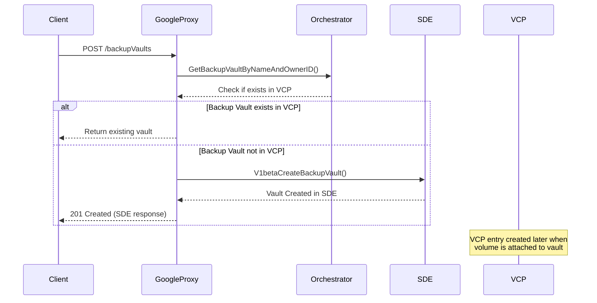

### VCP Entry Creation Flow

The VCP database entry for a backup vault is created **lazily** when a volume is attached to the backup vault, not during the initial backup vault creation. This happens in the volume creation workflow:

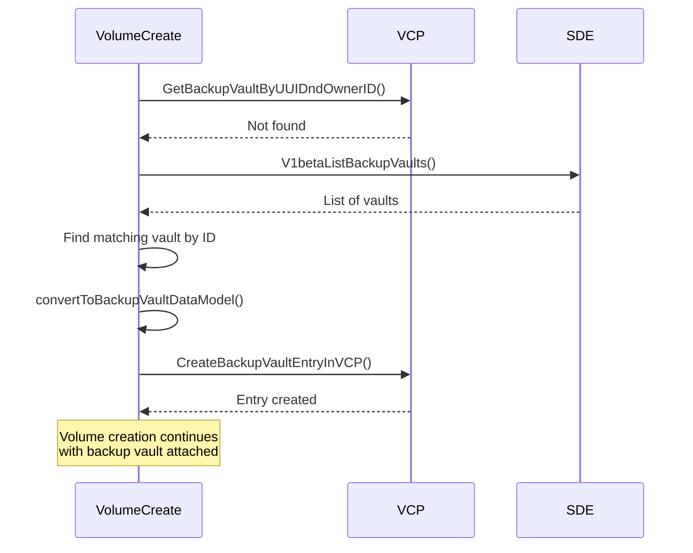

## Volume-Backup Vault Attachment

### Volume Creation with Backup Vault

When creating a volume with backup configuration, the backup vault is attached through the `BackupConfig` parameter:

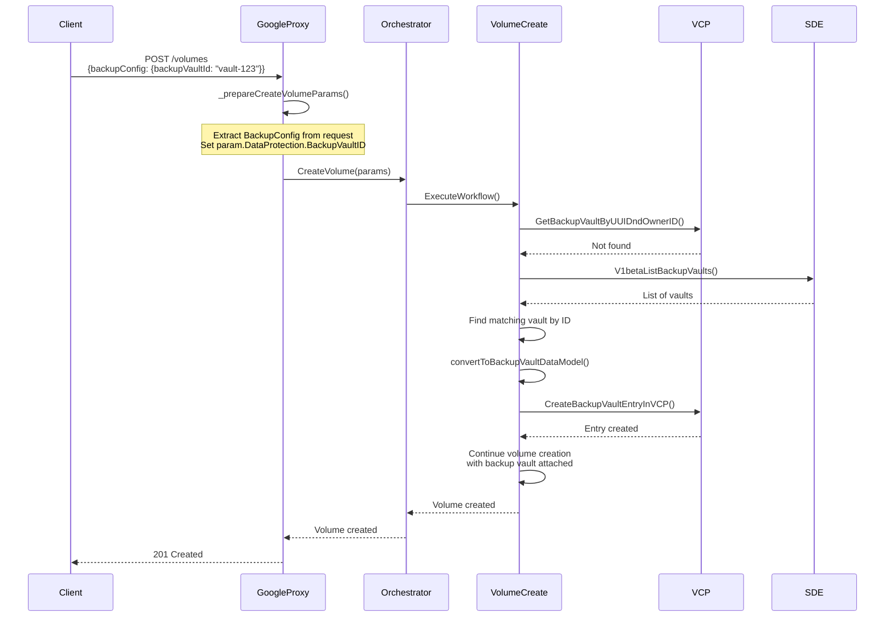

### Volume Update with Backup Vault

Volumes can have their backup vault configuration updated through the volume update API:

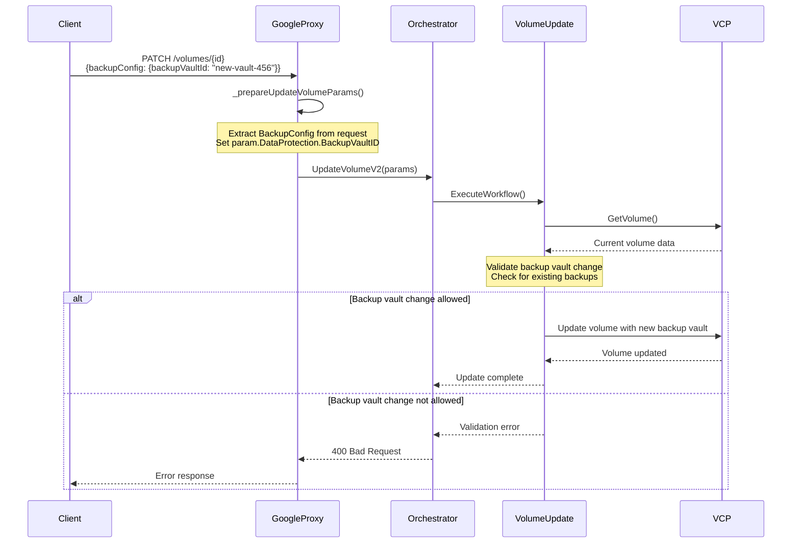

### Backup Configuration Structure

The backup configuration is passed through the `BackupConfig` parameter in both create and update operations:

```json
{
  "backupConfig": {
    "backupVaultId": "projects/123/locations/us-central1/backupVaults/vault-123",
    "backupPolicyId": "projects/123/locations/us-central1/backupPolicies/policy-456",
    "scheduledBackupEnabled": true,
    "backupChainBytes": 1073741824
  }
}
```

### Validation Rules

When attaching backup vaults to volumes, the system enforces several validation rules:

1. **Backup Vault Existence**: The backup vault must exist in SDE
2. **Cross-Region Restriction**: Cross-region backup vaults cannot be attached to volumes
3. **Backup Policy Validation**: If a backup policy is specified, it must be valid
4. **Existing Backups**: Cannot change backup vault if volume has existing backups
5. **Immutable Vault Updates**: Cannot update retention policy of vaults attached to volumes (returns error: "Immutable backup vaults are not supported for ISCSI volumes")

### Update Backup Vault Workflow

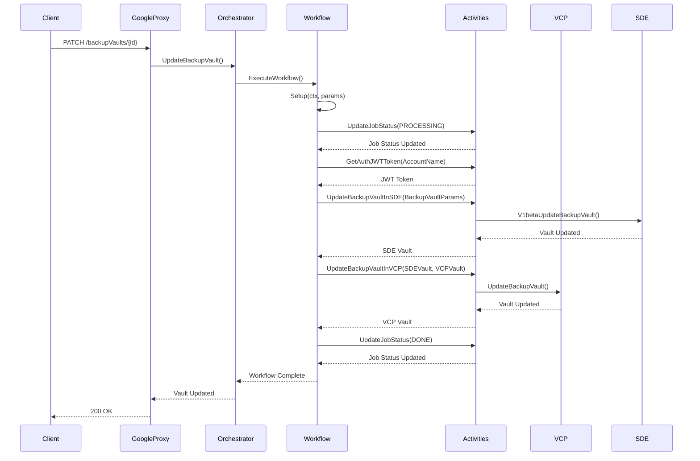

### Delete Backup Vault Workflow

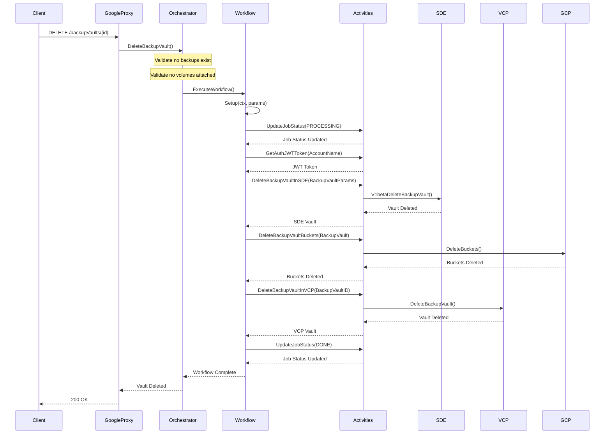

## Storage Integration

### GCP Bucket Management

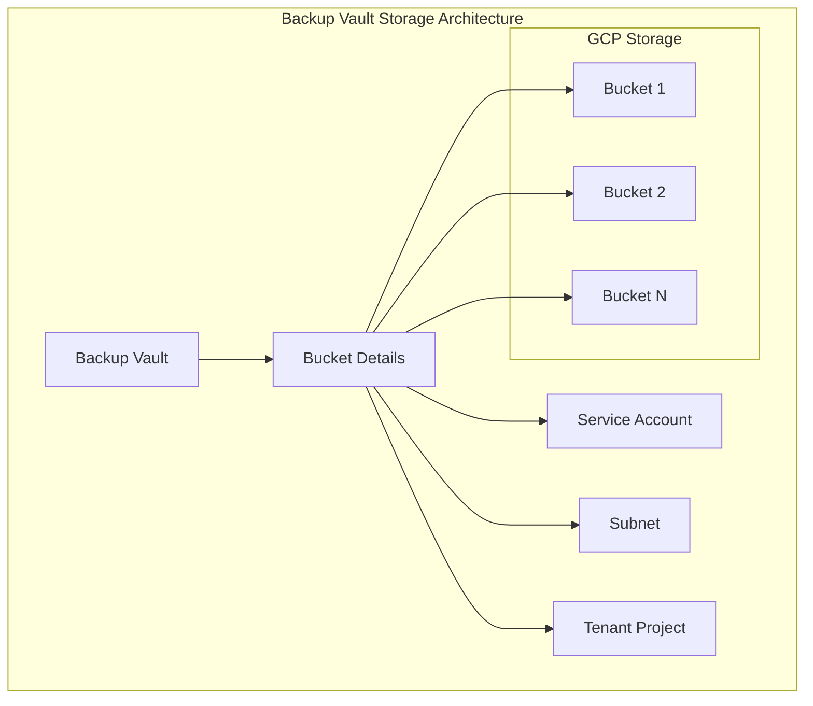


### Immutable Backup Configuration

| Backup Type | Immutable Setting | Description |
|-------------|------------------|-------------|
| Daily | `IsDailyBackupImmutable` | Daily backups cannot be deleted before retention period |
| Weekly | `IsWeeklyBackupImmutable` | Weekly backups cannot be deleted before retention period |
| Monthly | `IsMonthlyBackupImmutable` | Monthly backups cannot be deleted before retention period |
| Ad-hoc | `IsAdhocBackupImmutable` | Manual backups cannot be deleted before retention period |


### Database Indexes

Based on the code analysis, the following indexes are defined:

| Table | Index | Purpose |
|-------|-------|---------|
| `backup_vaults` | `(name)` | Fast lookup by backup vault name |
| `backup_vaults` | `(deleted_at)` | Soft delete filtering |
| `jobs` | `(state)` | Job state filtering |
| `jobs` | `(account_id)` | Job filtering by account |


