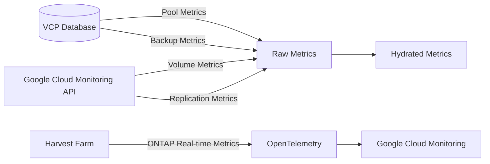
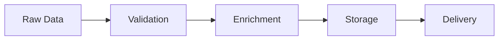
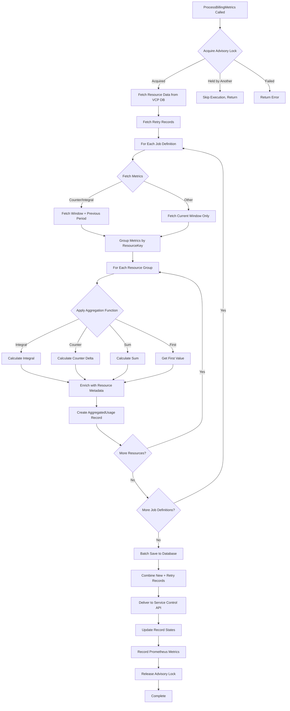
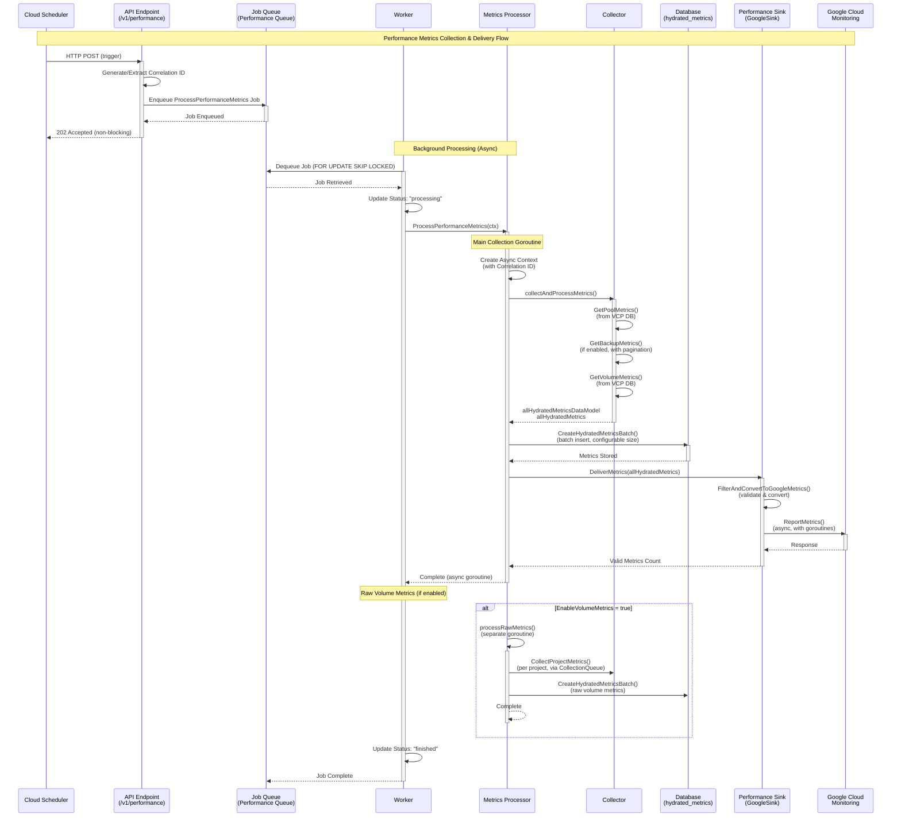
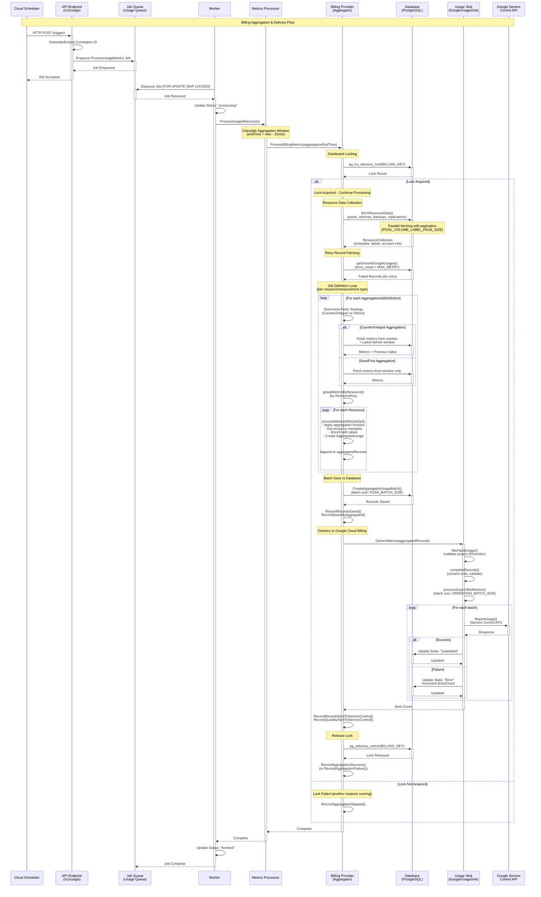
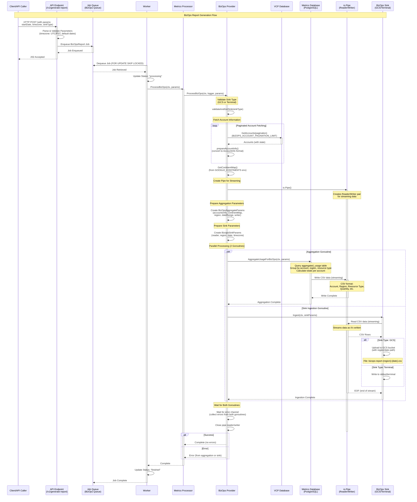

# Telemetry Component Design Document

## 1. Overview

The Telemetry Component is a critical microservice within the VSA (Virtual Storage Appliance) Control Plane that handles the collection, processing, aggregation, and delivery of performance and usage metrics for Google Cloud NetApp Volumes (GCNV) resources. It serves as the central hub for monitoring and billing operations, ensuring accurate metric reporting to Google Cloud's billing and monitoring systems.

This document is part of a series of design documents covering the Telemetry System architecture and implementation. For comprehensive understanding, refer to the following related documents:

| Document | Title | Description |
|----------|-------|-------------|
| [0014-telemetry-performance-test-design.md](./0014-telemetry-performance-test-design.md) | Telemetry Performance Testing Design | Performance testing framework, profiling strategies, and AI-powered analysis workflow |
| [0016-harvest-collector-system.md](./0016-harvest-collector-system.md) | Harvest-Based Collector System Design | Real-time metrics collection infrastructure using NetApp Harvest for ONTAP cluster monitoring |
| [0017-telemetry-deployer-design.md](./0017-telemetry-deployer-design.md) | Telemetry Deployer Design | Automated deployment tool for telemetry services as Google Cloud Run services with Cloud Scheduler integration |
| [0018-telemetry-low-level-design.md](./0018-telemetry-low-level-design.md) | Telemetry System Low-Level Design | Detailed implementation specifications including database schemas, job queue, aggregation algorithms, and security |


## 2. Architecture

### 2.1 High-Level Architecture

```mermaid
graph TB
    subgraph CP["Control Plane Subsystem"]
        direction TB
        Scheduler[Cloud Scheduler<br/>Hourly Triggers]
        API[API Endpoints<br/>REST API Server]
        Workers[Worker Orchestrator<br/>Job Management]
        Temporal[Temporal Workflows<br/>Harvest Registration]
        
        Scheduler -->|OIDC Auth| API
        Temporal -->|Creates Jobs| Workers
        API -->|Creates Jobs| Workers
    end
    
    subgraph RT["Real-time Collection Subsystem"]
        direction TB
        ONTAP[ONTAP Clusters<br/>Storage Nodes]
        HarvestPollers[Harvest Pollers<br/>PM2 Managed]
        HarvestFarm[Harvest Farm Service<br/>Port 3000]
        PollerManager[Poller Manager<br/>Lifecycle Control]
        OpenTel[OpenTelemetry Collector<br/>Metrics Processing]
        Prometheus[Prometheus<br/>Service Discovery]
        
        ONTAP -->|Metrics| HarvestPollers
        HarvestPollers -->|Exports| HarvestFarm
        HarvestFarm -->|Manages| PollerManager
        PollerManager -->|Config| OpenTel
        OpenTel -->|Scrapes| Prometheus
    end
    
    subgraph BP["Batch Processing Pipeline Subsystem"]
        direction TB
        
        subgraph JQ["Job Queue Subsystem"]
            JobQueue[(PostgreSQL<br/>Job Queue)]
            PerfWorkers[Performance Workers<br/>10 workers]
            UsageWorkers[Usage Workers<br/>1 worker]
            CollWorkers[Collection Workers<br/>10 workers]
            BizWorkers[BizOps Workers<br/>10 workers]
            
            JobQueue -->|FOR UPDATE<br/>SKIP LOCKED| PerfWorkers
            JobQueue -->|FOR UPDATE<br/>SKIP LOCKED| UsageWorkers
            JobQueue -->|FOR UPDATE<br/>SKIP LOCKED| CollWorkers
            JobQueue -->|FOR UPDATE<br/>SKIP LOCKED| BizWorkers
        end
        
        subgraph COL["Collector Subsystem"]
            VolumeCol[Volume Collector]
            PoolCol[Pool Collector]
            BackupCol[Backup Collector]
            ReplCol[Replication Collector]
            GoogleProv[Google Provider<br/>Monitoring API]
        end
        
        subgraph PROC["Processor Subsystem"]
            PerfProc[Performance Processor]
            UsageProc[Usage Processor]
            CollProc[Collection Processor]
            BizProc[BizOps Processor]
        end
        
        subgraph AGG["Aggregator Subsystem"]
            BillingProv[Billing Provider]
            JobDefs[Job Definitions]
            AggFuncs[Aggregation Functions]
            DistLock[Distributed Lock]
        end
        
        subgraph SINK["Sink Subsystem"]
            PerfSink[Performance Sink]
            UsageSink[Usage Sink]
            BizSink[BizOps Sink]
        end
        
        subgraph DATA["Data Stores"]
            HydratedMetrics[(Hydrated Metrics<br/>Table)]
            AggregatedUsage[(Aggregated Usage<br/>Table)]
        end
        
        %% Internal flows
        PerfWorkers -->|Triggers| PerfProc
        UsageWorkers -->|Triggers| UsageProc
        CollWorkers -->|Triggers| CollProc
        BizWorkers -->|Triggers| BizProc
        
        VolumeCol -->|Raw Metrics| PerfProc
        PoolCol -->|Raw Metrics| PerfProc
        BackupCol -->|Raw Metrics| PerfProc
        ReplCol -->|Raw Metrics| CollProc
        GoogleProv -->|Raw Metrics| CollProc
        
        PerfProc -->|Writes| HydratedMetrics
        CollProc -->|Writes| HydratedMetrics
        UsageProc -->|Triggers| BillingProv
        
        BillingProv -->|Reads| HydratedMetrics
        BillingProv -->|Writes| AggregatedUsage
        
        PerfProc -->|Sends| PerfSink
        BillingProv -->|Sends via| UsageSink
        BizProc -->|Sends| BizSink
        UsageSink -->|Reads| AggregatedUsage
    end
    
    subgraph DS["Data Sources Subsystem"]
        direction TB
        VCPDB[(VCP Database<br/>Pools/Volumes/Backups<br/>Replications)]
        MetricsDB[(Metrics Database<br/>Telemetry DB)]
        GoogleAPIs[Google Cloud APIs<br/>Monitoring API<br/>Service Control]
    end
    
    subgraph OUT["Output Destinations Subsystem"]
        direction LR
        GCMonitoring[Google Cloud Monitoring<br/>Performance Metrics]
        GCBilling[Google Cloud Billing<br/>Service Control API]
        GCS[Google Cloud Storage<br/>BizOps Reports]
    end
    
    %% Control Plane integrations
    Workers -->|Enqueues Jobs| JobQueue
    
    %% Collector integrations
    VolumeCol -->|Queries| VCPDB
    PoolCol -->|Queries| VCPDB
    BackupCol -->|Queries| VCPDB
    ReplCol -->|Queries| VCPDB
    GoogleProv -->|API Calls| GoogleAPIs
    
    %% Processor integrations
    PerfProc -->|Reads/Writes| MetricsDB
    CollProc -->|Reads/Writes| MetricsDB
    UsageProc -->|Reads/Writes| MetricsDB
    BizProc -->|Reads| MetricsDB
    
    %% Aggregator integrations
    BillingProv -->|Reads Resource Data| VCPDB
    BillingProv -->|Reads/Writes| MetricsDB
    
    %% Sink integrations
    PerfSink -->|Pushes Metrics| GCMonitoring
    UsageSink -->|Pushes Billing| GCBilling
    BizSink -->|Uploads Reports| GCS
    
    %% Real-time integrations
    Prometheus -->|Exports Metrics| GCMonitoring
    
    %% Temporal integrations
    Temporal -->|Registers Nodes| HarvestFarm
    
    style CP fill:#e1f5ff
    style RT fill:#fff4e1
    style BP fill:#e8f5e9
    style DS fill:#f3e5f5
    style OUT fill:#ffe0b2
    style JQ fill:#c8e6c9
    style DATA fill:#fff9c4
```




### 2.2 Component Interactions

The telemetry system operates through a pipeline architecture where each component has specific responsibilities:

1. **Collection**: Gathers raw metrics from various sources
2. **Processing**: Transforms and enriches raw data
3. **Aggregation**: Combines metrics for billing purposes
4. **Delivery**: Sends processed metrics to Google Cloud services

## 3. Core Components

### 3.1 API Layer

**File**: `telemetry/api/endpoints/`
**Purpose**: External interface for triggering metric collection operations

#### Endpoints
- `POST /v1/performance` - Triggers performance metrics collection
- `POST /v1/usage` - Triggers usage metrics aggregation and billing
- `POST /v1/generateReport` - Triggers BizOps report generation
- `GET /metrics` - Prometheus metrics endpoint
- `GET /debug/pprof/*` - Performance profiling endpoints (when `ENABLE_PPROF=true`)

#### Features
- RESTful API design using OpenAPI 3.0 specification (generated via `ogen`)
- Asynchronous processing (returns 202 Accepted)
- Cloud Scheduler integration via OIDC authentication
- Built-in logging and error handling
- Correlation ID support for request tracing
- Automatic correlation ID generation if not provided

### 3.2 Collector Module

**Files**: `telemetry/collector/`
**Purpose**: Responsible for gathering metrics from multiple data sources

#### Key Components

##### 3.2.1 Pool Collector
- **File**: `pool_collector.go`
- **Function**: Collects storage pool performance metrics from VCP database
- **Data Sources**: VCP database
- **Metrics Collected**:
  - `PoolAllocatedSize`: Total allocated size of the pool (in bytes)
  - `AllocatedUsed`: Quota/used size of the pool (in bytes)
  - `PoolTotalThroughputMibps`: Total throughput capacity (billable = total - 64 MiB/s base)
  - `PoolTotalIops`: Total IOPS capacity (billable = total - 16 * throughput)
- **Features**: 
  - Supports both zonal (`VolumePool`) and regional HA (`VolumePoolRegionalHA`) pool types
  - Generates metadata map for use by volume collector

##### 3.2.2 Volume Collector
- **File**: `volume_collector.go`
- **Function**: Collects volume-level metrics from VCP database
- **Data Sources**: VCP database
- **Metrics Collected** (from VCP database):
  - `BackupEnabledVolumeAllocatedSize`: Allocated size for volumes with backups (only when `ENABLE_BACKUP_BILLING_METRICS=true`)
  - `VolumeAllocatedThroughput`: Allocated throughput per volume (uses volume throughput if set, otherwise falls back to pool throughput)
- **Filters**: Only processes volumes with `BackupChainBytes > 0` for backup billing metrics
- **Note**: Additional volume metrics (read ops, write ops, latency, etc.) are collected from Google Cloud Monitoring API via `google_volume_metrics.go` (see Volume Replication Collector section)

##### 3.2.3 Backup Collector
- **File**: `backup_collector.go`
- **Function**: Collects backup logical size metrics from VCP database
- **Data Sources**: VCP database
- **Metrics Collected**:
  - `BackupLogicalSize`: Latest logical backup size (in bytes) for each backup
- **Features**:
  - Uses pagination to fetch all backups efficiently
  - Only processes backups in `available` state
  - Billing is based on the volume (not the backup itself)

##### 3.2.4 Volume Replication Collector
- **File**: `google_volume_metrics.go` (handled within volume metrics collection)
- **Function**: Collects volume replication and additional volume metrics from Google Cloud Monitoring
- **Data Sources**: Google Cloud Monitoring API
- **Metrics Collected** (from Google Cloud Monitoring):
  - **Volume Replication**:
    - `XregionReplicationTotalTransferBytes`: Cross-region replication total transfer bytes (used for billing)
    - Replication health, lag time, transfer duration, transfer size
    - Replication schedule and progress
  - **Volume Performance** (when `ENABLE_VOLUME_METRICS=true`):
    - Volume read/write operations, latency, throughput
    - Volume capacity utilization
- **Special Handling**: 
  - Resource type: `VolumeReplicationRelationship` for replication metrics
  - Uses `relationship_id` from metric labels as resource name for replication
  - Collected asynchronously per tenant project via job queue (`CollectionQueue`)
  - Batch enqueues collection jobs for all tenant projects
  - Metadata (replication name, schedule, type, source/destination locations) fetched from VCP database during aggregation
  - Supports both zonal (`Volume`) and regional HA (`VolumeRegionalHA`) volume types

#### Data Flow



### 3.3 Processor Module

**File**: `telemetry/processor/processor.go`
**Purpose**: Central orchestrator for metric processing workflows

#### Key Functions

##### 3.3.1 ProcessPerformanceMetrics()

**Purpose**: Orchestrates the collection, processing, storage, and delivery of performance metrics from multiple sources.

**Execution Flow**:

1. **Immediate Response (Non-blocking)**:
   - Returns immediately (202 Accepted) to avoid blocking the API caller
   - All processing happens asynchronously in background goroutines

2. **Primary Metrics Collection (Background Goroutine #1)**:
   - **Timestamp Generation**: Creates a truncated timestamp (minute precision) for all metrics
   - **Correlation ID Propagation**: Preserves correlation ID from request context for tracing
   - **Collection**:
     - **Pool Metrics**: Calls `collector.GetPoolMetrics()` to fetch all pools from VCP database
       - Collects: `PoolAllocatedSize`, `AllocatedUsed`, `PoolTotalThroughputMibps`, `PoolTotalIops`
       - Generates pool metadata map for use by volume collector
     - **Backup Metrics** (if `ENABLE_BACKUP_METRICS` or `ENABLE_BACKUP_BILLING_METRICS` enabled):
       - Calls `collector.GetBackupMetrics()` with pagination
       - Collects: `BackupLogicalSize` for all available backups
     - **Volume Metrics**: Calls `collector.GetVolumeMetrics()` 
       - Uses pool metadata map to determine zonal vs regional HA volumes
       - Collects: `BackupEnabledVolumeAllocatedSize` (if backup billing enabled), `VolumeAllocatedThroughput`
       - Filters volumes with `BackupChainBytes > 0` for backup billing

3. **Data Separation**:
   - **For Database Storage** (`allHydratedMetricsDataModel`):
     - Pool metrics (always stored)
     - Backup metrics (if `ENABLE_BACKUP_BILLING_METRICS=true`)
     - Volume metrics (if `ENABLE_BACKUP_BILLING_METRICS=true`)
   - **For Performance Sink** (`allHydratedMetrics`):
     - Pool metrics (for monitoring)
     - Volume allocated throughput metrics (for monitoring)
     - Backup metrics (if `ENABLE_BACKUP_METRICS=true`)

4. **Database Storage**:
   - Uses `CreateHydratedMetricsBatch()` with configurable batch size (`PUSH_BATCH_SIZE`, default 1000)
   - Batch inserts for efficiency
   - Stores in `hydrated_metrics` table for later aggregation

5. **Raw Volume Metrics Collection (Background Goroutine #2)**:
   - **Conditional Execution**: Only runs if `ENABLE_VOLUME_METRICS=true`
   - **Time Window Refresh**: Updates the time window for Google Cloud Monitoring API queries
   - **Per-Project Collection**: 
     - Gets list of all tenant projects from VCP database
     - Batch enqueues `CollectMetrics` jobs to `CollectionQueue` for each project
     - Each job processes one project's volume metrics asynchronously
   - **Metrics Collected**: Volume read/write ops, latency, throughput, replication transfer bytes, etc.

**Error Handling**:
- Errors in background goroutines are logged but don't affect API response
- Partial failures (e.g., backup collection fails) stop the entire batch
- Database and sink errors are logged with correlation ID for tracing

**Performance Characteristics**:
- Non-blocking API response (< 100ms typically)
- Parallel execution of database collection and raw metrics collection
- Configurable batch sizes for database operations

##### 3.3.2 ProcessUsageMetrics()

**Purpose**: Triggers billing aggregation to process hourly usage data and deliver to Google Cloud Billing.

**Execution Flow**:

1. **Time Window Calculation (15-minute offset)**:
   - **Problem Solved**: If aggregation runs at 1:45, it needs data from 12:45-1:45, but the 1:45 sample may not be hydrated yet
   - **Solution**: Uses `aggregationEndTime = now - 15 minutes`
   - **Example**: If triggered at 1:45, aggregates 12:30-1:30 (ensuring 1:30 sample is complete)
   - **Aggregation Window**: `aggregationStartTime = aggregationEndTime - 1 hour`

2. **Distributed Locking**:
   - Attempts to acquire PostgreSQL advisory lock (`pg_try_advisory_lock`)
   - **Lock Key**: `0x42494C4C494E47` ("BILLING" in hex)
   - **Behavior**:
     - If lock acquired: Proceeds with aggregation
     - If lock held by another pod: Skips execution, logs and returns (no error)
     - Ensures only one aggregator instance runs across all pods
   - **Lock Release**: Automatically released via `defer` when function exits

3. **Resource Data Fetching**:
   - Fetches metadata from VCP database for aggregation window:
     - **Pools**: Labels, account info, deployment names (with pagination)
     - **Volumes**: Labels, account info, pool relationships (with pagination)
     - **Backups**: Labels, account info, vault relationships (if backup billing enabled)
     - **Volume Replications**: Labels, replication attributes, source/destination locations (if replication billing enabled)
   - Uses configurable page size (`POOL_VOLUME_LABEL_PAGE_SIZE`, default 5000)
   - Handles partial failures gracefully (continues if one resource type fails)

4. **Retry Failed Records**:
   - Fetches previously failed records (`getUnsentGoogleUsages`)
   - Retries records with `attempt < MAX_GOOGLE_BILLING_PUSH_RETRY` (default 5)
   - Includes retry records in final delivery batch

5. **Per Job Definition Processing**:
   - Iterates through `DefaultAggregationJobDefinitions` (one per resource/measurement type combination)
   - **For Each Job Definition**:
     - **Counter/Integral Aggregation**: Fetches all records from window + latest record from previous period (for delta calculation)
     - **Other Aggregations**: Fetches only records from current window
     - **Grouping**: Groups metrics by `ResourceKey` (ResourceType, ResourceName, DeploymentName, ConsumerID)
     - **Per-Resource Processing**:
       - Applies aggregation function (Integral, Counter, Sum)
       - Enriches with resource metadata (labels, account info, replication details)
       - Creates `AggregatedUsage` records
       - Handles errors per resource (logs and continues)

6. **Batch Database Save**:
   - Saves all aggregated records using `CreateAggregatedUsageBatch()`
   - Uses configurable batch size (`PUSH_BATCH_SIZE`, default 1000)
   - Records Prometheus metrics for records saved and quantities aggregated

7. **Delivery to Google Cloud Billing**:
   - Delivers all aggregated records (new + retries) to Service Control API
   - Uses `usageSink.DeliverMetrics()` with batch processing
   - **Batch Size**: Configurable via `OPERATION_BATCH_SIZE` (default 200)
   - **Validation**: Filters invalid records (missing project ID/number)
   - **Retry Logic**: Configurable max retries (`MAX_GOOGLE_BILLING_PUSH_RETRY`)
   - Records Prometheus metrics for records sent and quantities sent

8. **Metrics Recording**:
   - Records aggregation success/failure with duration
   - Records lock attempts (acquired/skipped/failed)
   - Records resource data fetched counts
   - Records hydrated metrics fetched counts
   - Records records saved, quantities aggregated (by resource/measured/aggregation type)
   - Records records sent, quantities sent (by resource/measured/aggregation type)
   - Records retry counts, skip counts, batch sizes

**Error Handling**:
- Lock acquisition failures return error (prevents duplicate execution)
- Resource data fetch failures are logged but aggregation continues
- Per-resource processing errors are logged and skipped (continues with other resources)
- Database save failures return error (prevents data loss)
- Delivery failures are logged, records marked for retry

**Performance Characteristics**:
- Typically completes in 30-120 seconds depending on data volume
- Processes thousands of records efficiently using batching
- Parallel resource data fetching (pools, volumes, backups, replications)

##### 3.3.3 CollectMetrics()

**Purpose**: Collects volume and replication metrics from Google Cloud Monitoring API for a specific tenant project.

**Execution Flow**:

1. **Invocation**:
   - Called asynchronously via job queue (`CollectionQueue`)
   - One job per tenant project
   - Triggered by `ProcessPerformanceMetrics()` when `ENABLE_VOLUME_METRICS=true`

2. **Project-Specific Collection**:
   - **Input**: `projectId` (tenant project ID) and `timestamp`
   - **API Query**: Queries Google Cloud Monitoring API for the project
   - **Time Window**: Uses provider's configured time window (typically last 5 minutes)
   - **Metrics Queried**: Based on `metricList.yaml` configuration:
     - Volume metrics: read ops, write ops, latency, throughput, capacity
     - Replication metrics: `snapmirror_total_transfer_bytes` (mapped to `XregionReplicationTotalTransferBytes`)

3. **Metric Processing**:
   - Iterates through configured metrics in `VolumeMetrics` list
   - For each metric:
     - Builds filter: `metric.type="<resourceType>/<metric>" AND resource.type="k8s_cluster"` (or `generic_task` in dev)
     - Queries with pagination (`PAGE_SIZE`, default 1000)
     - Extracts time series data points
     - Maps to `HydratedMetrics` data model
     - **Special Handling**:
       - Regional HA volumes: Detects `is_regional_ha=true` label, sets `ResourceType=VolumeRegionalHA`
       - Replication: Uses `relationship_id` as resource name, sets `ResourceType=VolumeReplicationRelationship`

4. **Database Storage**:
   - Stores collected metrics using `CreateHydratedMetricsBatch()`
   - Uses configurable batch size (`PUSH_BATCH_SIZE`, default 1000)
   - Metrics stored in `hydrated_metrics` table for later aggregation

5. **Correlation ID Propagation**:
   - Preserves correlation ID from parent job for request tracing
   - All logs include correlation ID for debugging

**Error Handling**:
- API errors (e.g., project not found) are logged and returned
- Individual metric failures are logged but collection continues
- Database save failures return error (job will be retried)

**Performance Characteristics**:
- Processes one project at a time (parallelism via multiple workers)
- Typical execution: 5-30 seconds per project
- Handles projects with thousands of volumes efficiently

##### 3.3.4 ProcessBizOps()

**Purpose**: Generates business operations reports by aggregating billing data and writing to configured sink.

**Execution Flow**:

1. **Parameter Validation**:
   - Validates `BizOpsReportParams`:
     - `StartDate`: Start of report period
     - `EndDate`: End of report period
     - `TimeZone`: Timezone for report (e.g., "America/New_York")
     - `SinkType`: Sink type (GCS or Terminal)

2. **Sink Validation**:
   - Validates that requested sink type is available
   - Returns error if sink not configured

3. **Account Information Fetching**:
   - Fetches all enabled accounts from VCP database
   - Uses pagination (`BIZOPS_ACCOUNT_PAGINATION_LIMIT`, default 1000)
   - Includes account metadata for report generation

4. **Parallel Processing Setup**:
   - Creates `io.Pipe()` for streaming data between aggregation and sink
   - **Goroutine #1 (Aggregation)**:
     - Calls `AggregateBizOpsReport()` to generate report data
     - Reads from VCP and Metrics databases
     - Aggregates data by account, region, resource type
     - Writes CSV data to pipe writer
   - **Goroutine #2 (Sink)**:
     - Reads CSV data from pipe reader
     - Writes to configured sink (GCS bucket or terminal)
     - Handles file naming, date formatting, timezone conversion

5. **Report Generation**:
   - **Data Sources**:
     - `aggregated_usage` table: Billing records
     - VCP database: Account information, resource metadata
   - **Aggregation**:
     - Groups by account, region, resource type, measured type
     - Sums quantities for report period
     - Applies continent mapping for region grouping
   - **Output Format**: CSV with columns:
     - Account, Region, Resource Type, Measured Type, Quantity, etc.

6. **Sink Delivery**:
   - **GCS Sink**: 
     - Uploads CSV file to Google Cloud Storage bucket
     - File naming: `bizops-report-<date>-<timezone>.csv`
     - Handles authentication via service account
   - **Terminal Sink** (testing):
     - Prints CSV data to stdout
     - Useful for local testing and debugging

7. **Error Handling**:
   - Uses error channel to collect errors from both goroutines
   - Waits for both goroutines to complete
   - Returns combined error if any occurred

**Error Handling**:
- Sink validation failures return error immediately
- Account fetch failures return error
- Aggregation errors are logged and returned
- Sink write errors are logged and returned
- Pipe errors are handled gracefully

**Performance Characteristics**:
- Streaming processing (doesn't load entire report into memory)
- Parallel aggregation and sink writing
- Typical execution: 30-300 seconds depending on data volume and report period
- Handles reports spanning months of data efficiently

#### Processing Pipeline



### 3.4 Aggregator Module

**Files**: `telemetry/aggregator/`
**Purpose**: Aggregates raw metrics from `hydrated_metrics` table into billing-ready `aggregated_usage` records and delivers them to Google Cloud Billing.

#### Key Components

##### 3.4.1 BillingProvider

**File**: `metrics_processor.go`  
**Function**: `ProcessBillingMetrics()` - Orchestrates the complete billing aggregation pipeline

**Core Architecture**:

1. **Distributed Locking Mechanism**:
   - **Lock Type**: PostgreSQL advisory lock (`pg_try_advisory_lock`)
   - **Lock Key**: `0x42494C4C494E47` ("BILLING" in hex)
   - **Purpose**: Ensures only one aggregator instance runs across all pods in a distributed deployment
   - **Behavior**:
     - Non-blocking: Returns immediately if lock is held by another instance
     - Automatic release: Lock released via `defer` when function exits
     - Graceful fallback: For non-PostgreSQL databases (e.g., SQLite in tests), skips locking
   - **Lock States**: `acquired`, `skipped`, `failed` (tracked via Prometheus metrics)

2. **Resource Key Structure**:
   ```go
   type ResourceKey struct {
       ResourceType   metadata.ResourceType  // e.g., Volume, Pool, Backup
       ResourceName   string                  // e.g., "volume-123"
       DeploymentName string                  // e.g., "deployment-abc"
       ConsumerID     string                  // Account name
   }
   ```
   - **Uniqueness**: Combination of these four fields uniquely identifies a billable resource
   - **Grouping**: Metrics are grouped by `ResourceKey` before aggregation
   - **Purpose**: Ensures correct billing attribution (same resource, same customer, same deployment)

3. **Resource Data Collection**:
   - **Purpose**: Fetches metadata (labels, account info, replication details) from VCP database
   - **Timing**: Fetched at start of each aggregation cycle for the aggregation window
   - **Data Sources**:
     - **Pools**: Labels, account info, deployment names (with pagination, `POOL_VOLUME_LABEL_PAGE_SIZE`)
     - **Volumes**: Labels, account info, pool relationships (with pagination)
     - **Backups**: Labels, account info, vault relationships (if `ENABLE_BACKUP_BILLING_METRICS=true`)
     - **Volume Replications**: Labels, replication attributes, source/destination locations (if `ENABLE_REPLICATION_BILLING_METRICS=true`)
   - **Pagination**: Uses configurable page size (default 5000) to handle large datasets
   - **Error Handling**: Partial failures are logged but aggregation continues (graceful degradation)

4. **Metrics Fetching Strategy**:
   - **Per Job Definition**: Iterates through `DefaultAggregationJobDefinitions` (one per resource/measurement type)
   - **Fetch Strategies**:
     - **Counter/Integral Aggregation**: 
       - Fetches all records from aggregation window
       - **Plus**: Latest record from previous period (looks back 2 hours, filters to latest before window start)
       - **Reason**: Need previous value to calculate delta/integral
     - **Other Aggregations** (Sum, First):
       - Fetches only records from current aggregation window
   - **Filtering**: Uses time range, resource type, and measured type filters
   - **Sorting**: Database sorts by timestamp for efficient processing

5. **Resource Grouping**:
   - **Function**: `groupMetricsByResource()`
   - **Process**: Groups fetched metrics by `ResourceKey` (ResourceType, ResourceName, DeploymentName, ConsumerID)
   - **Output**: Map of `ResourceKey` → `[]HydratedMetrics`
   - **Purpose**: Enables per-resource aggregation (each resource gets its own aggregated record)

6. **Per-Resource Aggregation**:
   - **Function**: `processMetricsWithJobDef()`
   - **Process**:
     1. Applies aggregation function based on `JobType` (Integral, Counter, Sum, First)
     2. Retrieves resource metadata from `ResourceCollection`
     3. Enriches aggregated record with:
        - Billing labels (from resource metadata, limited to `GOOGLE_BILLING_LABELS_MAX_ENTRIES`)
        - Account information
        - Resource UUID
        - Replication details (for VolumeReplicationRelationship)
     4. Creates `AggregatedUsage` record with:
        - Aggregation window (start/end times)
        - Aggregated quantity
        - Resource metadata
        - SKU (for billable metrics)
        - State tracking (for retry logic)
   - **Error Handling**: Per-resource errors are logged and skipped (continues with other resources)

7. **Batch Database Save**:
   - Saves all aggregated records using `CreateAggregatedUsageBatch()`
   - **Batch Size**: Configurable via `PUSH_BATCH_SIZE` (default 1000)
   - **Table**: `aggregated_usage`
   - **Purpose**: Persists aggregated records for delivery and retry logic

8. **Retry Mechanism**:
   - Fetches previously failed records (`getUnsentGoogleUsages`)
   - **Criteria**: Records with `attempt < MAX_GOOGLE_BILLING_PUSH_RETRY` (default 5)
   - **Inclusion**: Retry records are included in delivery batch
   - **Tracking**: Each record tracks attempt count and error messages

9. **Delivery to Google Cloud Billing**:
   - Delivers all records (new + retries) via `usageSink.DeliverMetrics()`
   - **Batch Processing**: Uses `OPERATION_BATCH_SIZE` (default 200) for Service Control API
   - **Validation**: Filters invalid records (missing project ID/number)
   - **Success Tracking**: Updates record state on successful delivery
   - **Failure Handling**: Marks records for retry on failure

10. **Comprehensive Metrics**:
    - Emits Prometheus metrics for all operations (see `telemetry/aggregator/METRICS.md`)
    - Tracks: aggregation success/failure, records saved, quantities aggregated, records sent, lock attempts, etc.
    - Enables observability and anomaly detection

##### 3.4.2 Job Definitions

**File**: `common/job_definition.go`  
**Purpose**: Defines aggregation rules for each resource/measurement type combination

**Structure**:
```go
type AggregationJobDefinition struct {
    MeasuredType    metadata.MeasuredType  // What is being measured
    ResourceType    metadata.ResourceType  // What resource is being measured
    AggregationType JobType                // How to aggregate (Integral, Counter, Sum, First)
    IsBillable      bool                   // Whether this metric is billable
    SKU             string                  // SKU for billing (if billable)
}
```

**Job Definition Map**:
- **Key**: `CombinedKeyResourceTypeMeasuredType` (ResourceType + MeasuredType)
- **Value**: `AggregationJobDefinition`
- **Location**: `DefaultAggregationJobDefinitions` map

**Example Job Definitions**:

1. **Volume Allocated Size** (Non-billable):
   - ResourceType: `Volume` or `VolumeRegionalHA`
   - MeasuredType: `AllocatedSize`
   - AggregationType: `IntegralAggregation`
   - IsBillable: `false`
   - **Purpose**: Tracks capacity usage over time (for reporting)

2. **Replication Transfer Bytes** (Billable):
   - ResourceType: `VolumeReplicationRelationship`
   - MeasuredType: `XregionReplicationTotalTransferBytes`
   - AggregationType: `CounterAggregation`
   - IsBillable: `true`
   - SKU: `/ReplicationBytesTransferred`
   - **Purpose**: Bills for cross-region replication data transfer

3. **Backup Logical Size** (Billable):
   - ResourceType: `Backup`
   - MeasuredType: `BackupLogicalSize`
   - AggregationType: `IntegralAggregation`
   - IsBillable: `true`
   - SKU: `/BackupStorageKbBillable`
   - **Purpose**: Bills for backup storage capacity over time

4. **Pool Metrics** (Non-billable):
   - ResourceType: `VolumePool` or `VolumePoolRegionalHA`
   - MeasuredTypes: `PoolAllocatedSize`, `AllocatedUsed`, `PoolTotalThroughputMibps`, `PoolTotalIops`
   - AggregationType: `IntegralAggregation`
   - IsBillable: `false`
   - **Purpose**: Tracks pool capacity and performance metrics

**Aggregation Types**:

1. **Integral Aggregation** (`IntegralAggregation`):
   - **Purpose**: Calculates area under the curve (capacity × time)
   - **Formula**: `Σ(quantity[i] × duration[i-1 to i] in hours)`
   - **Use Cases**: 
     - Capacity metrics (allocated size, logical size)
     - Throughput/IOPS over time
   - **Example**: If a volume has 100GB allocated for 0.5 hours, integral = 50 GB-hours
   - **Implementation**: Sorts by timestamp, calculates duration between consecutive points, multiplies quantity by duration

2. **Counter Aggregation** (`CounterAggregation`):
   - **Purpose**: Calculates delta for monotonic counters
   - **Formula**: `Σ(max(0, quantity[i] - quantity[i-1]))` with reset handling
   - **Reset Detection**: If quantity decreases and new value < 25% of previous, assumes counter reset
   - **Use Cases**:
     - Replication transfer bytes (monotonic counter)
     - Network transfer bytes
   - **Example**: Counter goes 100 → 150 → 200, delta = 100
   - **Implementation**: Handles counter resets gracefully, skips anomalous dips

3. **Sum Aggregation** (`SumAggregation`):
   - **Purpose**: Sums all values in the window
   - **Formula**: `Σ(quantity[i])`
   - **Use Cases**: Cumulative values that should be summed
   - **Example**: Sum of 10, 20, 30 = 60

4. **First Aggregation** (`FirstAggregation`):
   - **Purpose**: Returns the first value in the window
   - **Formula**: `quantity[0]` (after sorting by timestamp)
   - **Use Cases**: Initial state values
   - **Example**: First value in sorted list

**Time Window Specifications**:
- **Standard Window**: 1 hour (`aggregationEndTime - 1 hour` to `aggregationEndTime`)
- **Offset**: 15 minutes from current time (to ensure data completeness)
- **Example**: If triggered at 1:45, aggregates 12:30-1:30

#### Aggregation Flow

**Detailed Process Flow**:



### 3.5 Sink Module

**Files**: `telemetry/performance/sink.go`, `telemetry/usage/sink.go`
**Purpose**: Delivers processed metrics to external systems

#### Performance Sink
- **Target**: Google Cloud Monitoring
- **Data**: Real-time performance metrics
- **Format**: Cloud Monitoring time series

#### Usage Sink (GoogleUsageSink)
- **Target**: Google Cloud Billing (Service Control API)
- **Data**: Aggregated usage for billing
- **Features**:
  - Batch processing for efficiency (configurable `OPERATION_BATCH_SIZE`, default 200)
  - Validation and filtering (skips records with missing project ID/number)
  - Error handling and retry logic (configurable `MAX_GOOGLE_BILLING_PUSH_RETRY`, default 5)
  - Billing label management (max 64 labels per record, configurable via `GOOGLE_BILLING_LABELS_MAX_ENTRIES`)
  - Returns count of successfully sent records

#### BizOps Sink
- **Files**: `telemetry/bizops/sink/`
- **Targets**: Google Cloud Storage (GCS) or Terminal (for testing)
- **Data**: Business operations reports
- **Features**:
  - Multiple sink implementations (GCS, Terminal)
  - Report generation with configurable time ranges and timezones
  - CSV format output

## 4. Data Models

### 4.1 HydratedMetrics

**File**: `telemetry/datamodel/telemetry_models.go`  
**Purpose**: Stores raw metrics collected from various sources before aggregation. This is the intermediate data model that contains individual metric data points.

**Database Table**: `hydrated_metrics`

**Complete Structure**:
```go
type HydratedMetrics struct {
    ID              int64                 // Primary key, auto-increment
    MetricTimestamp time.Time             // Timestamp when metric was collected (indexed)
    MeasuredType    metadata.MeasuredType // Type of measurement (e.g., AllocatedSize, BackupLogicalSize) (indexed)
    ResourceType    metadata.ResourceType // Type of resource (e.g., Volume, Pool, Backup) (indexed)
    Quantity        float64               // Metric value (e.g., bytes, IOPS, throughput)
    ResourceName    string                // Name of the resource (e.g., "volume-123") (indexed)
    ConsumerID      string                // Account/customer identifier (indexed)
    Location        string                // Geographic location/region (e.g., "us-west1") (indexed)
    Metadata        []byte                // Additional metadata in JSONB format
    DeploymentName  string                // Deployment identifier (indexed)
}
```

**Indexes**: 
- Composite indexes on `(resource_type, measured_type)` for efficient aggregation queries
- Indexes on `metric_timestamp` for time-range queries
- Indexes on `resource_name`, `consumer_id`, `location`, `deployment_name` for filtering

**Usage**:
- Populated by collectors (Pool, Volume, Backup, Volume Replication)
- Stored in batches for efficiency
- Queried by aggregator for time-windowed aggregation
- Source data for generating `AggregatedUsage` records

### 4.2 AggregatedUsage

**File**: `telemetry/datamodel/telemetry_models.go`  
**Purpose**: Stores aggregated billing records ready for delivery to Google Cloud Billing. Contains enriched data with resource metadata and billing information.

**Database Table**: `aggregated_usage`

**Complete Structure**:
```go
type AggregatedUsage struct {
    // Primary Key
    ID                     int64                 // Primary key, auto-increment
    
    // Resource Identification
    ResourceUUID           string                // UUID of the resource (indexed)
    ResourceName           *string               // Name of the resource (indexed)
    ResourceType           metadata.ResourceType // Type of resource (indexed)
    AccountID              string                // Account ID (indexed)
    VendorCustomerID       *string               // Customer identifier for billing (indexed)
    
    // Aggregation Window
    AggregationStart       time.Time             // Start of aggregation window (indexed)
    AggregationEnd         time.Time             // End of aggregation window (indexed)
    
    // Metric Information
    MeasuredType           metadata.MeasuredType // Type of measurement (indexed)
    Quantity               float64               // Aggregated quantity (in MiB for most metrics)
    AggregationType        string                // Aggregation method used (IntegralAggregation, CounterAggregation, etc.)
    LastCounterValue       *float64              // Last counter value (for counter metrics)
    
    // Geographic Information
    RegionName             *string               // Primary region (indexed)
    SourceRegion           *string               // Source region (for replication)
    DestinationRegion      *string               // Destination region (for replication/backup)
    
    // Billing Metadata
    BillingLabels          *string               // JSONB string of billing labels (max 64 labels)
    IsBillable             bool                  // Whether this metric is billable
    ServiceLevel           string                // Service level (e.g., "1", "2", "3" for replication schedules)
    
    // Replication-Specific Fields
    ReplicationDstVolumeID *string               // Destination volume UUID for replication
    ReplicationType        string                // Type of replication (e.g., "async", "sync")
    
    // Volume-Specific Fields
    VolumeStyle            string                // Volume style/type
    DoubleEncryption       *bool                 // Whether double encryption is enabled
    
    // State Tracking
    State                  TrackingState         // Current state (Unsubmitted, Submitted, Error, Ignored, Invalid)
    ErrorCount             int32                 // Number of delivery attempts that failed
    ErrorMessage           *string               // Last error message (if any)
    Submission             *string               // JSONB string of submission details
    
    // Metadata
    IsUnified              bool                  // Whether this is a unified service type
    CreatedAt              time.Time             // Record creation timestamp
    UpdatedAt              time.Time             // Record last update timestamp
}
```


**TrackingState Enum**:
```go
type TrackingState int32

const (
    Unsubmitted TrackingState = iota  // Not yet submitted to Google Cloud Billing
    Submitted                          // Successfully submitted
    Error                              // Submission failed (will retry)
    Ignored                            // Record ignored (not billable or invalid)
    Invalid                            // Record is invalid and won't be retried
)
```

**Indexes**:
- Composite indexes on `(resource_type, measured_type)` for efficient queries
- Indexes on `aggregation_start`, `aggregation_end` for time-range queries
- Indexes on `state`, `is_billable` for retry logic queries
- Indexes on `resource_uuid`, `account_id`, `vendor_customer_id`, `region_name` for filtering

**Usage**:
- Created by aggregator from `HydratedMetrics`
- Stored in database for persistence and retry logic
- Delivered to Google Cloud Billing via Service Control API
- State tracked for retry mechanism (up to `MAX_GOOGLE_BILLING_PUSH_RETRY` attempts)

### 4.3 Job

**File**: `telemetry/datamodel/telemetry_models.go`  
**Purpose**: Represents a job in the PostgreSQL-based job queue system.

**Database Table**: `jobs`

**Structure**:
```go
type Job struct {
    ID          int64     // Primary key, auto-increment
    TypeName    string    // Job type identifier (e.g., "ProcessPerformanceMetrics")
    Status      string    // Job status: "new", "processing", "finished", "failed"
    Queue       string    // Queue name: "performance", "usage", "collection", "bizops"
    Data        string    // JSON-encoded job payload
    Error       string    // Error message (if failed)
    Attempt     int32     // Number of execution attempts (max 3)
    CreatedAt   time.Time // When job was created
    StartedAt   time.Time // When job execution started
    FinishedAt  time.Time // When job execution completed
    ScheduledAt time.Time // When job should be executed (for delayed jobs)
}
```

**Indexes**:
- Composite index on `(queue, status)` for efficient job dequeueing
- Index on `scheduled_at` for scheduled job queries
- Index on `type_name` for job type filtering


## 5. Queue System

### 5.1 Queue Types
- **PerformanceQueue** (`"performance"`): Handles performance metric processing
- **UsageQueue** (`"usage"`): Manages billing aggregation jobs
- **CollectionQueue** (`"collection"`): Processes metric collection tasks (per-project volume metrics)
- **BizOpsReportQueue** (`"bizops"`): Handles BizOps report generation

### 5.2 Worker Architecture
- Multiple workers per queue type (configurable independently)
- Configurable worker counts:
  - `NUM_WORKERS_PERFORMANCE` (default: 10)
  - `NUM_WORKERS_USAGE` (default: 1)
  - `NUM_WORKERS_COLLECTION` (default: 10)
  - `NUM_WORKERS_BIZOPS` (default: 10)
- Background job processing with PostgreSQL-based queue
- Automatic retry and error handling (max 3 retries)
- Thread-safe job type registry using `sync.RWMutex`
- Job status tracking: `new` → `processing` → `finished` or `failed`

### 5.3 Job Processing
```go
// Performance metrics job
&jobs.ProcessPerformanceMetrics{
    Data: "{}",
    CorrelationID: "uuid-string", // Optional, for request tracing
}

// Usage metrics job  
&jobs.ProcessUsageMetrics{
    Data: "{}",
    CorrelationID: "uuid-string",
}

// Collection job (per-project)
&jobs.CollectMetrics{
    Data: `{"project_id": "project-id", "timestamp": "2024-01-01T00:00:00Z"}`,
    CorrelationID: "uuid-string",
}

// BizOps report job
&jobs.BizOpsReport{
    Data: `{"start_date": "...", "end_date": "...", "timezone": "..."}`,
    CorrelationID: "uuid-string",
}
```

### 5.4 Job Queue Features
- **Batch Enqueue**: `EnqueueBatch()` for efficient bulk job submission
- **Scheduled Jobs**: `EnqueueAt()` for delayed execution
- **Distributed Locking**: Uses `FOR UPDATE SKIP LOCKED` to prevent multiple workers from picking the same job
- **Status Management**: Jobs transition through states: `new` → `processing` → `finished`/`failed`
- **Polling**: Configurable polling interval (default: 1 second)

## 6. Configuration

### 6.1 Telemetry Configuration
- **File**: `telemetry/common/config.go`
- **Environment Variables**:
  - **Feature Flags**:
    - `ENABLE_VOLUME_METRICS`: Enable volume metrics collection from Google Cloud Monitoring (default: false)
    - `ENABLE_BACKUP_METRICS`: Enable backup metrics for performance monitoring (default: false)
    - `ENABLE_BACKUP_BILLING_METRICS`: Enable backup metrics for billing aggregation (default: false)
    - `ENABLE_REPLICATION_BILLING_METRICS`: Enable replication metrics for billing (default: false)
    - `ENABLE_BATCH_USAGE_UPDATES`: Enable batch updates for aggregated usage records (default: false)
  - **Performance**:
    - `PUSH_BATCH_SIZE`: Batch size for database operations (default: 1000)
    - `OPERATION_BATCH_SIZE`: Batch size for Service Control API operations (default: 200)
    - `PAGE_SIZE`: Page size for Google Cloud Monitoring API pagination (default: 1000)
    - `POOL_VOLUME_LABEL_PAGE_SIZE`: Page size for fetching pool/volume labels (default: 5000)
    - `RESULT_UPDATE_BATCH_SIZE`: Batch size for updating aggregated usage results (default: 100)
  - **Workers**:
    - `NUM_WORKERS_PERFORMANCE`: Number of performance metric workers (default: 10)
    - `NUM_WORKERS_USAGE`: Number of usage/billing workers (default: 1)
    - `NUM_WORKERS_COLLECTION`: Number of collection workers (default: 10)
    - `NUM_WORKERS_BIZOPS`: Number of BizOps report workers (default: 10)
  - **Service Configuration**:
    - `ROOT_URL`: Service Control API root URL (default: "https://servicecontrol.googleapis.com")
    - `PUSHER_SERVICE_NAME`: Service name for billing (default: "autopush-netapp.sandbox.googleapis.com")
    - `PUSHER_SERVICE_PROJECT`: GCP project for billing (default: "netapp-au-se1-autopush-sde-tst")
    - `LOCAL_REGION`: Local region name
    - `ENVIRONMENT`: Environment name (default: "dev")
  - **Billing**:
    - `MAX_GOOGLE_BILLING_PUSH_RETRY`: Max retries for billing submissions (default: 5)
    - `GOOGLE_BILLING_LABELS_MAX_ENTRIES`: Max labels per billing record (default: 64)
  - **Debugging**:
    - `ENABLE_PPROF`: Enable pprof endpoints at `/debug/pprof/` (default: false)
    - `RUN_MIGRATION_ON_START`: Run database migrations on startup (default: false)

### 6.2 Database Configuration
- **VCP Database**: Core application data (pools, volumes, backups, accounts)
- **Metrics Database**: Telemetry-specific data storage (hydrated_metrics, aggregated_usage, jobs)
- **Connection Pooling**: Configurable pool sizes and timeouts (via common database connection utilities)
- **Separate Connections**: VCP and Metrics databases use separate connection pools

## 7. Scheduling and Automation

### 7.1 Cloud Scheduler Integration
- **Performance Collection**: Every 5 minutes (`*/5 * * * *`)
- **Usage Processing**: Every hour (`15 * * * *`)
- **OIDC Authentication**: Service account-based security
- **Endpoints**:
  - `/v1/performance` for performance metrics
  - `/v1/usage` for billing aggregation

### 7.2 Deployment Automation
- **Tool**: `tools/telemetry-deployer/main.go`
- **Features**:
  - Cloud Run service deployment
  - Cloud Scheduler job creation/updates
  - Network and security configuration
  - Environment variable management

## 8. Monitoring and Observability

### 8.1 Metrics Exposure
- **Prometheus Endpoint**: `/metrics`
- **Custom Metrics**: 
  - Aggregator metrics (see `telemetry/aggregator/METRICS.md`):
    - Aggregation status (success/failure/skipped)
    - Records saved, quantity aggregated (by resource type, measured type, aggregation type)
    - Records sent to ServiceControl, quantity sent (by resource type, measured type, aggregation type)
    - Lock attempts (acquired/skipped/failed)
    - Records retried, skipped, hydrated metrics fetched
    - Resource data fetched (by resource type)
    - Batch sizes, aggregation duration
  - Processing times, error rates, queue depths
- **Health Checks**: Database connectivity, external API availability
- **Performance Profiling**: pprof endpoints available when `ENABLE_PPROF=true`

### 8.2 Logging
- **Structured Logging**: JSON format with correlation IDs
- **Log Levels**: Debug, Info, Warn, Error
- **Context Propagation**: Request tracing across components via correlation IDs
- **Correlation ID Flow**: 
  - Generated at API entry point if not provided
  - Propagated through job queue to background workers
  - Included in all log entries for request tracing

### 8.3 Error Handling
- **Graceful Degradation**: Continue processing on partial failures
- **Retry Logic**: Exponential backoff for transient failures
- **Dead Letter Queues**: Failed jobs for manual intervention

## 9. Security

### 9.1 Authentication
- **OIDC Tokens**: Cloud Scheduler authentication
- **Service Accounts**: Google Cloud API access
- **Network Security**: VPC-native networking

### 9.2 Data Protection
- **Encryption**: Data at rest and in transit
- **Access Control**: Role-based permissions
- **Audit Logging**: All metric operations logged

## 10. Scalability and Performance

### 10.1 Horizontal Scaling
- **Stateless Design**: Multiple replicas supported
- **Queue-Based Processing**: Distributed workload
- **Database Sharding**: Partition by time or resource

### 10.2 Performance Optimizations
- **Batch Processing**: Configurable batch sizes
- **Connection Pooling**: Efficient database utilization
- **Async Processing**: Non-blocking operations
- **Caching**: Metadata and configuration caching

## 11. Data Flow Diagrams

### 11.1 Performance Metrics Flow

This sequence diagram shows the complete flow of performance metrics from Cloud Scheduler trigger to Google Cloud Monitoring delivery.



**Key Points**:
- **Non-blocking API**: Returns 202 Accepted immediately, all processing happens asynchronously
- **Correlation ID**: Propagated through entire flow for request tracing
- **Batch Processing**: Metrics stored in configurable batches (default 1000)
- **Parallel Execution**: Main collection and raw volume metrics run in separate goroutines
- **Error Handling**: Errors logged but don't affect API response
- **Database Storage**: All metrics stored in `hydrated_metrics` table for later aggregation
- **Sink Delivery**: Metrics delivered to Google Cloud Monitoring asynchronously

### 11.2 Usage Metrics Flow (Billing Aggregation)

This sequence diagram shows the complete flow of usage metrics from Cloud Scheduler trigger through aggregation to Google Cloud Billing delivery.



**Key Points**:
- **Distributed Locking**: PostgreSQL advisory lock ensures only one aggregator instance runs across all pods
- **15-Minute Offset**: Aggregation window ends 15 minutes before current time to avoid missing samples
- **Resource Data Fetching**: Metadata fetched at start of cycle with pagination for large datasets
- **Retry Logic**: Previously failed records are included in delivery batch (up to MAX_RETRY attempts)
- **Job Definition Loop**: Processes each resource/measurement type combination separately
- **Fetch Strategies**: Counter/Integral aggregations fetch previous value for delta calculation
- **Resource Grouping**: Metrics grouped by ResourceKey (ResourceType, ResourceName, DeploymentName, ConsumerID)
- **Batch Processing**: Both database saves and Service Control API calls use configurable batch sizes
- **State Management**: Records track state (Unsubmitted → Submitted/Error) for retry mechanism
- **Metrics Recording**: Comprehensive Prometheus metrics emitted for observability

### 11.3 BizOps Report Generation Flow

This sequence diagram shows the complete flow of BizOps report generation from API request through data aggregation to sink delivery (GCS or Terminal).



**Key Points**:
- **Non-blocking API**: Returns 202 Accepted immediately, processing happens asynchronously
- **Parameter Validation**: Validates timezone (UTC/PST), sets default dates if not provided
- **Account Fetching**: Paginated fetching of all accounts from VCP database with state information
- **Streaming Architecture**: Uses `io.Pipe()` for efficient streaming of large datasets without loading into memory
- **Parallel Processing**: Two goroutines run concurrently:
  - **Aggregation Goroutine**: Queries database and writes CSV to pipe
  - **Sink Goroutine**: Reads from pipe and writes to destination (GCS or Terminal)
- **Error Handling**: Both goroutines report errors via channel, all errors collected and returned
- **Sink Types**: Supports GCS (uploads to bucket) and Terminal (writes to stdout)
- **CSV Format**: Report includes account, region, resource type, quantities, and other aggregated metrics
- **Resource Efficient**: Streaming approach handles large datasets without memory issues

## 12. Low-Level Design Details

For detailed low-level design specifications, including complete database schemas, job queue implementation details, aggregation algorithms, performance optimizations, and security mechanisms, please refer to the dedicated [Low-Level Design Document](./0018-telemetry-low-level-design.md).

**Key Topics Covered in Low-Level Design Document**:
- Complete database schema definitions with all fields and indexes
- Detailed job queue implementation with distributed locking
- Aggregation function algorithms (Integral, Counter, Sum, First)
- Metric collection implementation details
- Error handling and retry mechanisms
- Performance optimization strategies
- Security implementation specifics
- Monitoring and telemetry setup
- Troubleshooting guide and diagnostic queries

## 13. Future Enhancements

### 13.1 Planned Features
- **Real-time Streaming**: Event-driven metric collection using Pub/Sub
- **Machine Learning**: Anomaly detection and predictive analytics
- **Multi-cloud Support**: Azure and AWS metric collection
- **Advanced Aggregations**: Custom aggregation functions via configuration

### 13.2 Technical Debt
- **Code Coverage**: Increase test coverage to >90%
- **Documentation**: API documentation improvements
- **Performance**: Query optimization and indexing
- **Monitoring**: Enhanced observability and alerting
