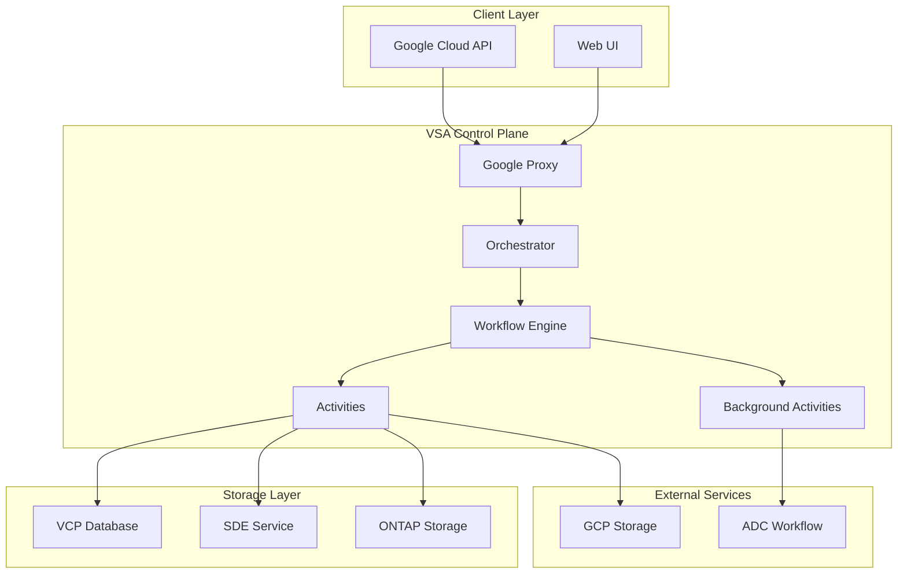
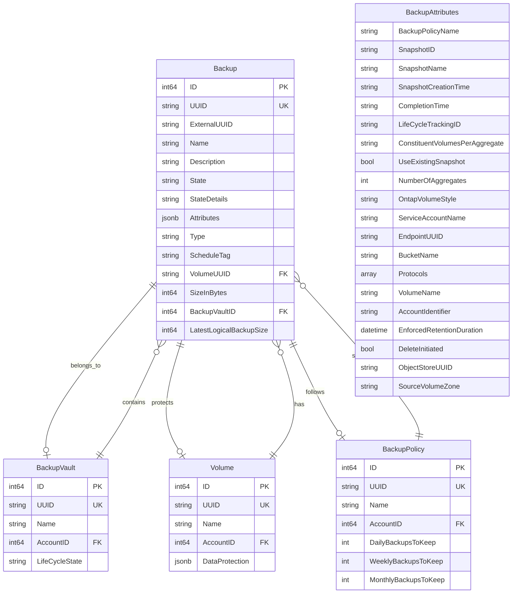
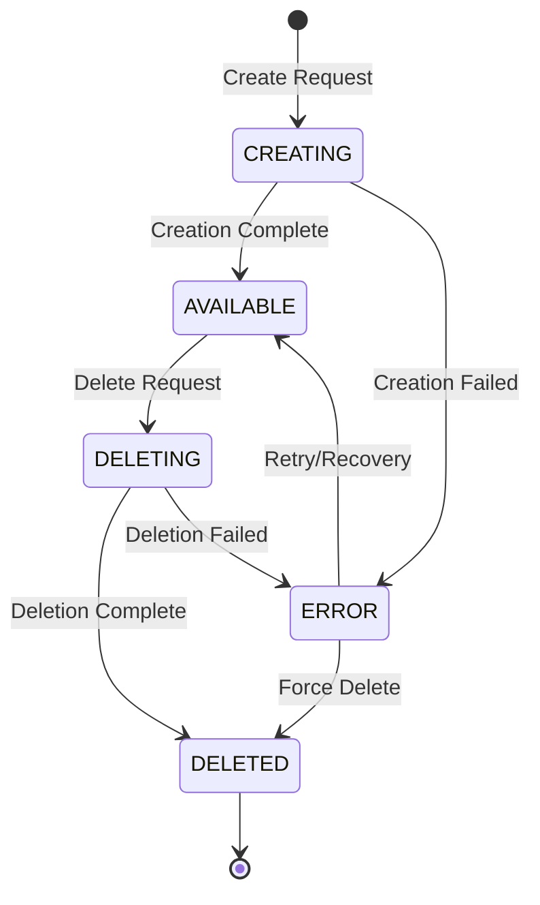
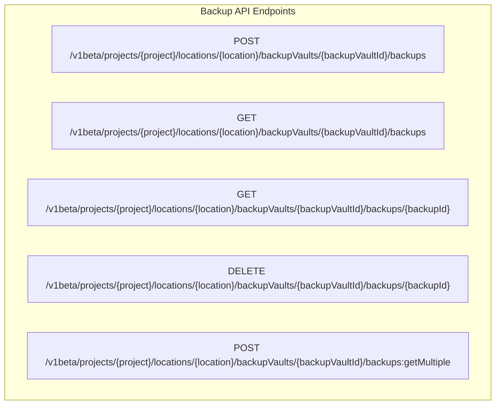
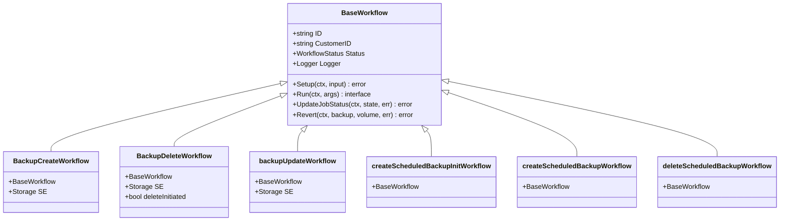
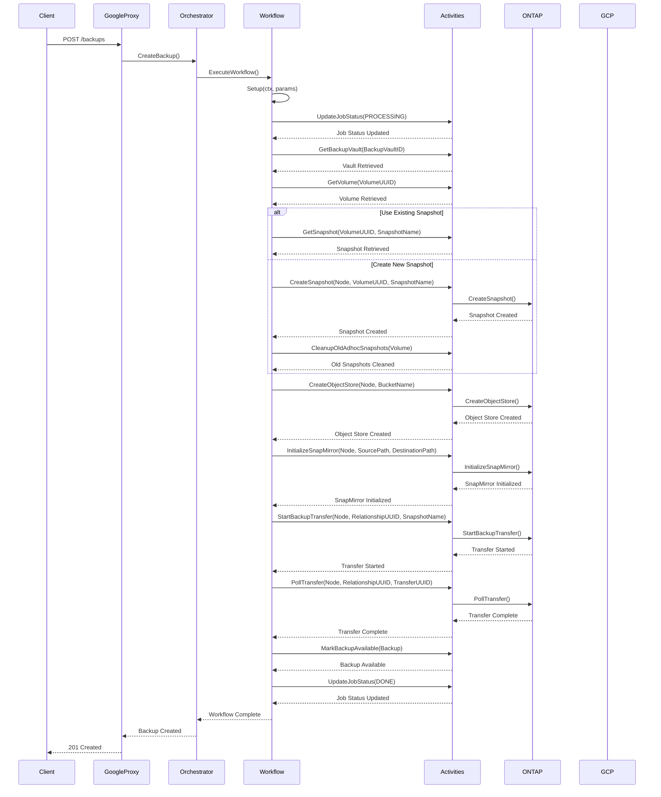
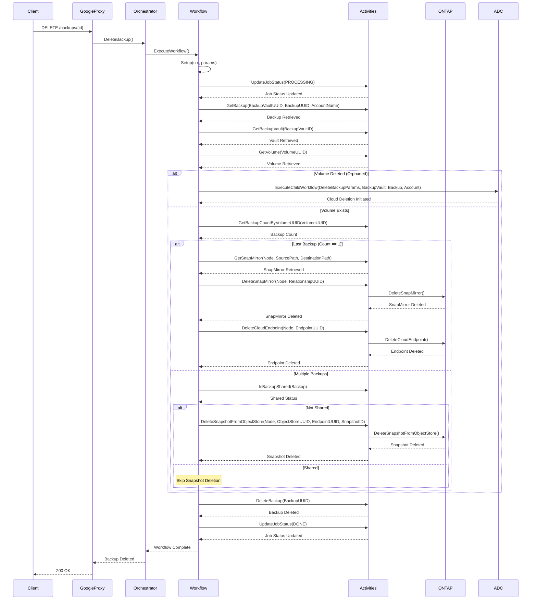
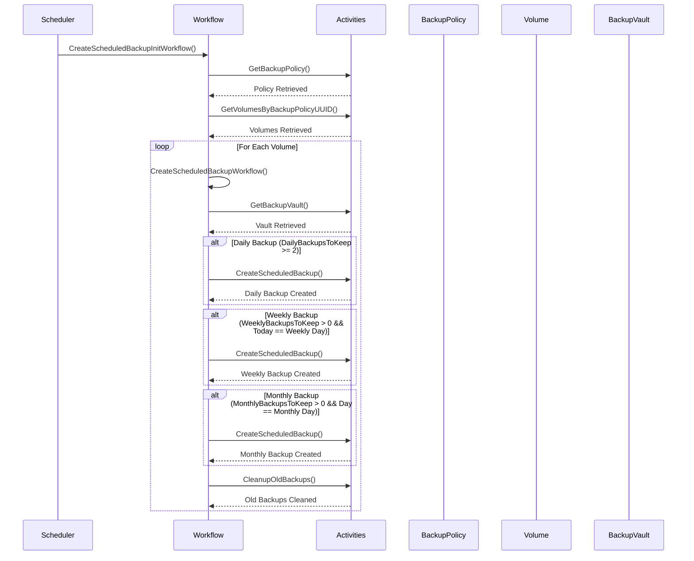
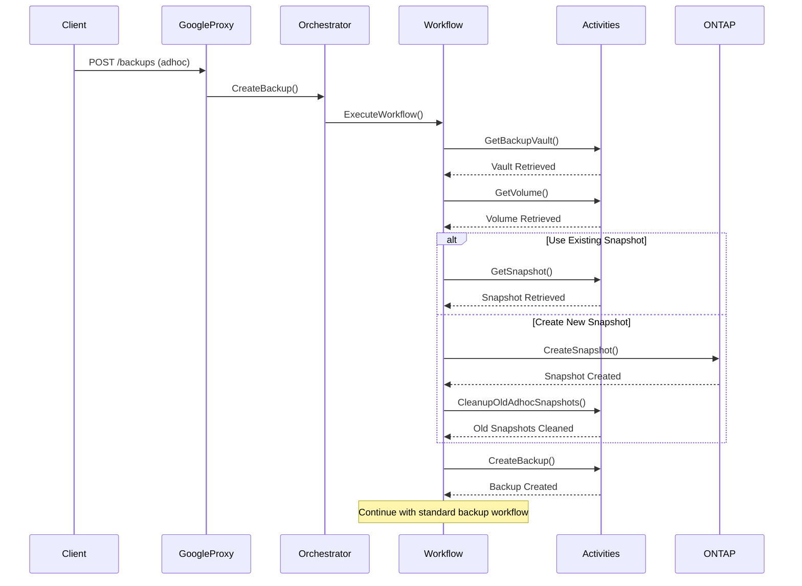
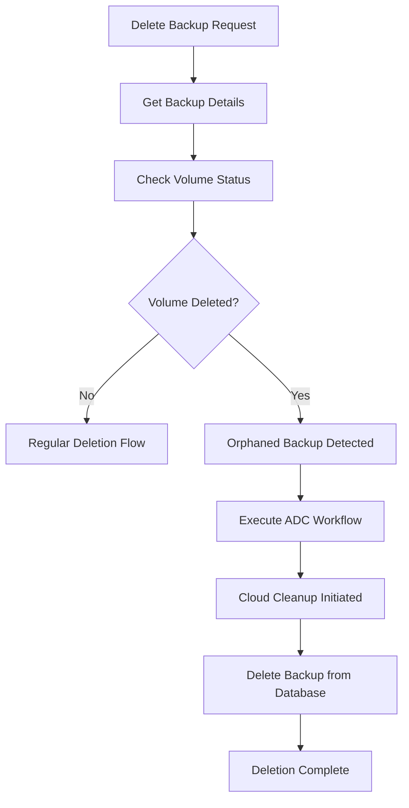

# Backup Design and Architecture

## Table of Contents
1. [Overview](#overview)
2. [Architecture Components](#architecture-components)
3. [Data Model](#data-model)
4. [Backup Types](#backup-types)
5. [Lifecycle Management](#lifecycle-management)
6. [API Design](#api-design)
7. [Workflow Architecture](#workflow-architecture)
8. [Scheduled Backup System](#scheduled-backup-system)
9. [Adhoc Backup System](#adhoc-backup-system)
10. [Backup Deletion and Cleanup](#backup-deletion-and-cleanup)
11. [Orphaned Backup Handling](#orphaned-backup-handling)

## Overview

The Backup system in the VSA Control Plane provides comprehensive backup and restore capabilities for volumes. It supports both scheduled (policy-based) and adhoc (manual) backups with robust lifecycle management, deletion handling, and orphaned backup cleanup.

### Key Features
- **Dual Backup Types**: Supports both scheduled and adhoc backups
- **Policy-Based Scheduling**: Automated backups based on backup policies
- **Manual Backup Creation**: On-demand backup creation via API/UI
- **Comprehensive Deletion**: Handles regular and orphaned backup cleanup
- **Lifecycle State Management**: Complete state tracking for all operations
- **Rollback Capabilities**: Error handling with rollback mechanisms
- **Shared Backup Detection**: Prevents deletion of shared snapshots

### Important Architectural Notes
- **Backup Types**: `MANUAL` (adhoc) and `SCHEDULED` (policy-based)
- **Feature Toggle**: Backup functionality controlled by `BACKUP_ENABLED` environment variable
- **Orphaned Backup Handling**: Uses ADC (Automated Data Cleanup) workflow for volume-deleted scenarios
- **Snapshot Management**: Automatic snapshot creation and cleanup for adhoc backups

## Architecture Components

### High-Level Architecture



### Component Responsibilities

| Component | Responsibility |
|-----------|----------------|
| **Google Proxy** | API endpoint handling, request validation |
| **Orchestrator** | Business logic, workflow orchestration |
| **Workflow Engine** | Temporal workflow execution |
| **Activities** | Individual operation implementations |
| **Background Activities** | Scheduled backup operations |
| **VCP Database** | Backup metadata storage |
| **SDE Service** | Storage data engine operations |
| **ONTAP Storage** | Snapshot and SnapMirror management |
| **GCP Storage** | Cloud backup storage |
| **ADC Workflow** | Orphaned backup cleanup |

## Data Model

### Backup Entity



### Backup Types

| Type | Description | ScheduleTag | Creation Trigger |
|------|-------------|-------------|------------------|
| `MANUAL` | Adhoc backup created manually | `null` | User/API request |
| `SCHEDULED` | Policy-based automated backup | `daily`, `weekly`, `monthly` | Backup policy schedule |

## Backup Types

### 1. Manual (Adhoc) Backup
- **Type**: `MANUAL`
- **Purpose**: On-demand backup creation
- **Trigger**: User or API request
- **Snapshot Management**: Automatic snapshot creation and cleanup
- **Retention**: Based on backup vault retention policy

### 2. Scheduled Backup
- **Type**: `SCHEDULED`
- **Purpose**: Automated backup based on backup policy
- **Trigger**: Backup policy schedule
- **Schedule Tags**: `daily`, `weekly`, `monthly`
- **Retention**: Based on backup policy limits

## Lifecycle Management

### Backup Lifecycle States



### State Descriptions

| State | Description | Details |
|-------|-------------|---------|
| `CREATING` | Initial creation in progress | Backup being created in ONTAP and transferred to cloud |
| `AVAILABLE` | Available for restore | Backup ready for restore operations |
| `DELETING` | Deletion in progress | Backup and associated resources being removed |
| `DELETED` | Soft deleted | Backup marked as deleted but data retained |
| `ERROR` | Operation failed | Requires manual intervention or retry |

## API Design

### REST Endpoints



### Request/Response Examples

#### Create Backup Request
```json
{
  "name": "my-backup",
  "description": "Manual backup before deployment",
  "volumeId": "volume-uuid-123",
  "useExistingSnapshot": false
}
```

#### Backup Response
```json
{
  "backupId": "backup-uuid-123",
  "name": "my-backup",
  "state": "CREATING",
  "stateDetails": "Creation in progress",
  "type": "MANUAL",
  "volumeId": "volume-uuid-123",
  "backupVaultId": "vault-uuid-123",
  "createdAt": "2024-01-01T00:00:00Z",
  "sizeInBytes": 1073741824
}
```

## Workflow Architecture

### Workflow Types

| Workflow | Purpose | Input Parameters | Output |
|----------|---------|------------------|--------|
| `CreateBackupWorkflow` | Create new backup (adhoc or scheduled) | `CreateBackupParams`, `Backup`, `BackupVault`, `Volume` | `void` |
| `DeleteBackupWorkflow` | Delete backup and cleanup resources | `DeleteBackupParams` | `void` |
| `UpdateBackupWorkflow` | Update backup metadata | `Backup` | `V1betaUpdateBackupRes` |
| `CreateScheduledBackupInitWorkflow` | Initialize scheduled backup for policy | `BackupPolicy` | `void` |
| `CreateScheduledBackupWorkflow` | Create scheduled backup for volume | `Volume`, `BackupPolicy` | `void` |
| `DeleteScheduledBackupWorkflow` | Delete scheduled backup | `BackupPolicy` | `void` |

### Workflow Structure



### Workflow Activities

#### Core Backup Activities

| Activity | Purpose | Input | Output |
|----------|---------|-------|--------|
| `GetBackupVault` | Get backup vault details | `BackupVaultID` | `BackupVault` |
| `GetVolume` | Get volume details | `VolumeUUID` | `Volume` |
| `GetSnapshot` | Get existing snapshot | `VolumeUUID`, `SnapshotName` | `Snapshot` |
| `CreateSnapshot` | Create new snapshot | `Node`, `VolumeUUID`, `SnapshotName` | `Snapshot` |
| `CreateObjectStore` | Create object store in ONTAP | `Node`, `BucketName` | `CloudTarget` |
| `GetObjectStore` | Get existing object store | `Node`, `BucketName` | `CloudTarget` |
| `InitializeSnapMirror` | Initialize SnapMirror relationship | `Node`, `SourcePath`, `DestinationPath` | `SnapMirrorRelationship` |
| `StartBackupTransfer` | Start backup transfer | `Node`, `RelationshipUUID`, `SnapshotName` | `OntapAsyncResponse` |
| `PollTransfer` | Poll transfer completion | `Node`, `RelationshipUUID`, `TransferUUID` | `void` |
| `MarkBackupAvailable` | Mark backup as available | `Backup` | `void` |
| `UpdateBackupError` | Mark backup as error | `Backup`, `Error` | `void` |
| `CreateBackup` | Create backup record | `Backup` | `Backup` |
| `DeleteBackup` | Delete backup record | `BackupUUID` | `void` |

#### Backup Deletion Activities

| Activity | Purpose | Input | Output |
|----------|---------|-------|--------|
| `GetBackup` | Get backup details | `BackupVaultUUID`, `BackupUUID`, `AccountName` | `Backup` |
| `GetBackupCountByVolumeUUID` | Get backup count for volume | `VolumeUUID` | `int64` |
| `IsBackupShared` | Check if backup snapshot is shared | `Backup` | `bool` |
| `DeleteSnapshotFromObjectStore` | Delete snapshot from object store | `Node`, `ObjectStoreUUID`, `EndpointUUID`, `SnapshotID` | `OntapAsyncResponse` |
| `GetSnapMirror` | Get SnapMirror relationship | `Node`, `SourcePath`, `DestinationPath` | `SnapMirrorRelationship` |
| `DeleteSnapMirror` | Delete SnapMirror relationship | `Node`, `RelationshipUUID` | `OntapAsyncResponse` |
| `DeleteCloudEndpoint` | Delete cloud endpoint | `Node`, `EndpointUUID` | `OntapAsyncResponse` |
| `IsSnapMirrorDeleted` | Check if SnapMirror is deleted | `Node`, `SnapMirrorParams` | `bool` |

#### Scheduled Backup Activities

| Activity | Purpose | Input | Output |
|----------|---------|-------|--------|
| `GetBackupPolicy` | Get backup policy details | `BackupPolicyUUID` | `BackupPolicy` |
| `GetVolumesByBackupPolicyUUID` | Get volumes for backup policy | `BackupPolicyUUID`, `AccountID` | `[]Volume` |
| `CreateScheduledBackup` | Create scheduled backup record | `Volume`, `BackupVault`, `Timestamp`, `ScheduleTag` | `Backup` |
| `GenerateScheduledSnapshotName` | Generate snapshot name | `Volume`, `Timestamp`, `ScheduleTag` | `string` |
| `CleanupOldScheduledBackups` | Cleanup old scheduled backups | `Volume`, `BackupPolicy` | `void` |
| `GetBackupsToDelete` | Get backups to delete based on policy | `Volume`, `BackupPolicy` | `[]Backup` |

#### Snapshot Management Activities

| Activity | Purpose | Input | Output |
|----------|---------|-------|--------|
| `CleanupOldAdhocSnapshots` | Cleanup old adhoc snapshots | `Volume` | `void` |
| `DeleteBackupSnapshot` | Delete snapshot from ONTAP | `Node`, `SnapshotUUID`, `VolumeUUID` | `void` |
| `markSnapshotAsError` | Mark snapshot as error state | `Snapshot`, `Error` | `void` |

#### Common Activities

| Activity | Purpose | Input | Output |
|----------|---------|-------|--------|
| `GetAuthJWTToken` | Get authentication token | `AccountName` | `JWT Token` |
| `UpdateJobStatus` | Update job status | `JobID`, `State`, `Error` | `void` |
| `WaitForONTAPJob` | Wait for ONTAP job completion | `OntapAsyncResponse`, `Node`, `Timeout` | `void` |

### Workflow Execution Details

#### Workflow Lifecycle

| Phase | Description | Activities |
|-------|-------------|------------|
| **Setup** | Initialize workflow with parameters | `Setup(ctx, input)` |
| **Processing** | Execute main workflow logic | `Run(ctx, args)` |
| **Completion** | Finalize workflow execution | `UpdateJobStatus(DONE)` |
| **Error Handling** | Handle failures and rollback | `UpdateJobStatus(ERROR)`, `Revert()` |

#### Job Status Management

| Status | Description | Trigger |
|--------|-------------|---------|
| `NEW` | Job created, not started | Job creation |
| `PROCESSING` | Workflow execution in progress | Workflow start |
| `DONE` | Workflow completed successfully | Workflow completion |
| `ERROR` | Workflow failed | Workflow failure |

#### Error Handling and Rollback

| Error Type | Handling | Rollback Action |
|------------|----------|-----------------|
| **Creation Failure** | Mark backup as ERROR | `Revert()` - cleanup created resources |
| **Transfer Failure** | Mark backup as ERROR | `Revert()` - cleanup partial transfer |
| **Snapshot Failure** | Mark snapshot as ERROR | Continue with other operations |
| **Authentication Failure** | Mark workflow as failed | `UpdateJobStatus(ERROR)` |

#### Rollback Mechanisms

| Rollback Type | Purpose | Activities |
|---------------|---------|------------|
| **Pre-Transfer Rollback** | Cleanup resources before data transfer | `DeleteSnapshot`, `DeleteObjectStore` |
| **Post-Transfer Rollback** | Cleanup resources after failed transfer | `DeleteSnapMirror`, `DeleteCloudEndpoint` |
| **State Rollback** | Restore backup to previous state | `MarkBackupAvailable`, `UpdateBackupError` |
| **Resource Cleanup** | Remove partially created resources | `DeleteBackup`, `DeleteSnapshot` |

#### Retry Policy Configuration

| Parameter | Value | Description |
|-----------|-------|-------------|
| `InitialInterval` | 5 seconds | Initial retry delay |
| `BackoffCoefficient` | 2.0 | Exponential backoff multiplier |
| `MaximumInterval` | 5 minutes | Maximum retry delay |
| `MaximumAttempts` | 3 | Maximum retry attempts |
| `NonRetryableErrorTypes` | `["PanicError"]` | Errors that should not be retried |

#### Activity Timeouts

| Activity | Timeout | Description |
|----------|---------|-------------|
| `WaitForONTAPJob` | 10 minutes | ONTAP job completion timeout |
| `StartToCloseTimeout` | 55 minutes | Default workflow activity timeout |
| `StartToCloseTimeoutLV` | 60 minutes | Large capacity workflow activity timeout |

### Create Backup Workflow



### Delete Backup Workflow



## Scheduled Backup System

### Scheduled Backup Creation Flow



### Scheduled Backup Naming Convention

| Schedule Type | Format | Example |
|---------------|--------|---------|
| Daily | `daily-scheduled-backup-{random}-{timestamp}` | `daily-scheduled-backup-a1b2c3d4-2024-01-01-150405` |
| Weekly | `weekly-scheduled-backup-{random}-{timestamp}` | `weekly-scheduled-backup-e5f6g7h8-2024-01-01-150405` |
| Monthly | `monthly-scheduled-backup-{random}-{timestamp}` | `monthly-scheduled-backup-i9j0k1l2-2024-01-01-150405` |

### Backup Policy Configuration

| Parameter | Description | Default |
|-----------|-------------|---------|
| `DailyBackupsToKeep` | Number of daily backups to retain | 0 |
| `WeeklyBackupsToKeep` | Number of weekly backups to retain | 0 |
| `MonthlyBackupsToKeep` | Number of monthly backups to retain | 0 |
| `SCHEDULED_WEEKLY_BACKUP_DAY` | Day of week for weekly backups (0=Sunday) | 1 (Monday) |
| `SCHEDULED_MONTHLY_BACKUP_DAY` | Day of month for monthly backups | 1 |

## Adhoc Backup System

### Adhoc Backup Creation Flow



### Adhoc Snapshot Management

- **Automatic Creation**: New snapshots created for each adhoc backup
- **Cleanup Logic**: Keeps only the latest snapshot, deletes older ones
- **Naming Convention**: `adhoc-backup-{timestamp}` format
- **Error Handling**: Failed snapshot deletions marked as error state

## Backup Deletion and Cleanup

### Deletion Scenarios

| Scenario | Condition | Action |
|----------|-----------|--------|
| **Regular Deletion** | Volume exists, multiple backups | Delete snapshot from object store |
| **Last Backup Deletion** | Volume exists, single backup | Delete SnapMirror relationship, cloud endpoint, snapshot |
| **Orphaned Backup** | Volume deleted | Use ADC workflow for cloud cleanup |
| **Shared Backup** | Snapshot shared with other backups | Skip snapshot deletion |

### Deletion Validation

1. **Restore Check**: Cannot delete backup if restore is in progress
2. **State Validation**: Only `AVAILABLE` backups can be deleted
3. **Feature Toggle**: Backup deletion requires `BACKUP_ENABLED=true`

### Cleanup Activities

| Activity | Purpose | Trigger |
|----------|---------|---------|
| `DeleteSnapshotFromObjectStore` | Remove snapshot from cloud storage | Non-shared backup deletion |
| `DeleteSnapMirror` | Remove SnapMirror relationship | Last backup deletion |
| `DeleteCloudEndpoint` | Remove cloud endpoint | Last backup deletion |
| `CleanupOldAdhocSnapshots` | Remove old adhoc snapshots | New adhoc backup creation |
| `CleanupOldScheduledBackups` | Remove old scheduled backups | New scheduled backup creation |

## Orphaned Backup Handling

### Orphaned Backup Detection



### ADC (Automated Data Cleanup) Workflow

- **Purpose**: Handle cleanup of backups when source volume is deleted
- **Trigger**: Volume deletion or orphaned backup detection
- **Process**: Cloud-side cleanup of backup data
- **State Management**: Tracks deletion initiation status

### Orphaned Backup States

| State | Description | Action Required |
|-------|-------------|-----------------|
| `Volume Deleted` | Source volume no longer exists | Execute ADC workflow |
| `SnapMirror Deleted` | SnapMirror relationship removed | Execute ADC workflow |
| `Cloud Deletion Initiated` | ADC workflow started | Monitor completion |
| `Cleanup Complete` | All resources cleaned | Mark backup as deleted |

## Error Handling and Rollback

### Error Scenarios

| Error Type | Handling | Rollback Action |
|------------|----------|-----------------|
| **Creation Failure** | Mark backup as ERROR | Delete created resources |
| **Deletion Failure** | Mark backup as ERROR | Restore backup state |
| **Transfer Failure** | Mark backup as ERROR | Cleanup partial transfer |
| **Snapshot Failure** | Mark snapshot as ERROR | Continue with other operations |

### Rollback Mechanisms

1. **Pre-Transfer Rollback**: Cleanup resources before data transfer
2. **Post-Transfer Rollback**: Cleanup resources after failed transfer
3. **State Rollback**: Restore backup to previous state on failure
4. **Resource Cleanup**: Remove partially created resources

## Database Indexes

Based on the code analysis, the following indexes are defined:

| Table | Index | Purpose |
|-------|-------|---------|
| `backups` | `(backup_vault_id)` | Fast backup listing by vault |
| `backups` | `(volume_uuid)` | Fast backup listing by volume |
| `backups` | `(state)` | Filter by backup state |
| `backups` | `(type)` | Filter by backup type |
| `backups` | `(schedule_tag)` | Filter by schedule type |
| `backups` | `(deleted_at)` | Soft delete filtering |
