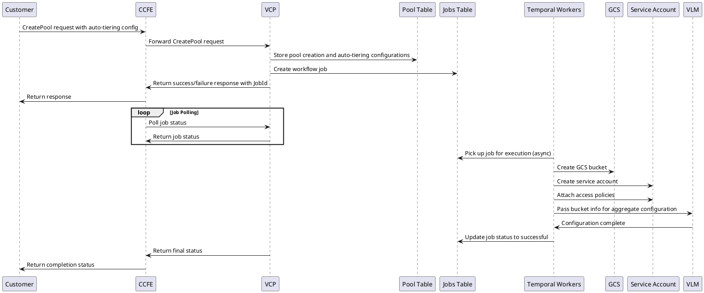
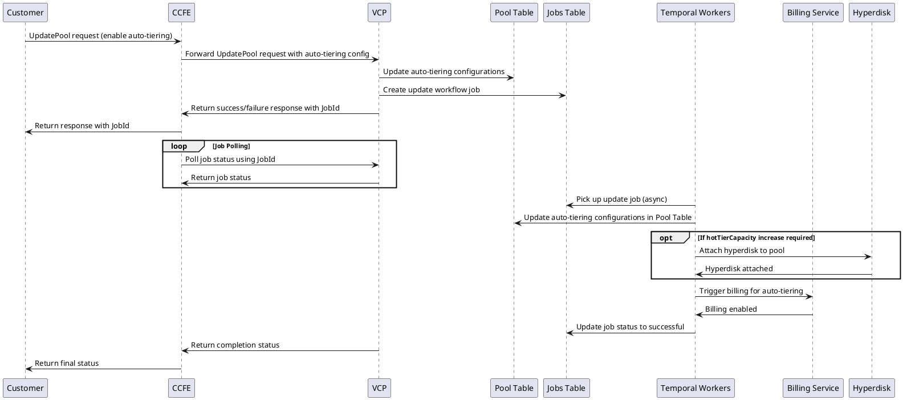
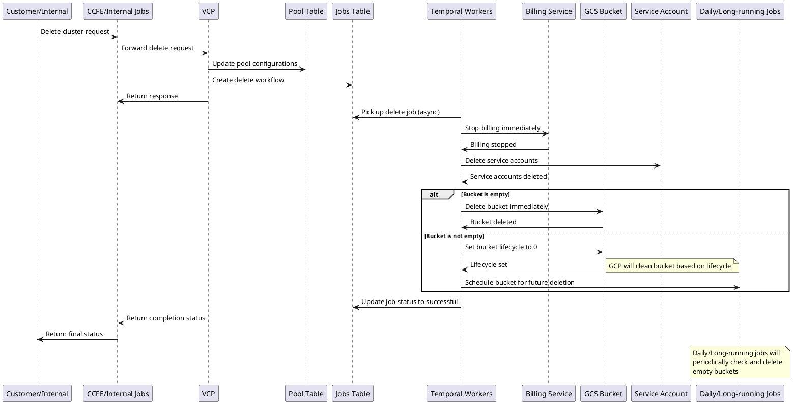

# VSA Auto-Tiering Design and Architecture

## Table of Contents
1. [Overview](#overview)
2. [Related Documents](#related-documents)
3. [Terminology](#terminology)
4. [Requirements](#requirements)
   - 4.1. [Functional Requirements](#functional-requirements)
   - 4.2. [Non Functional Requirements](#non-functional-requirements)
   - 4.3. [Not In Scope](#not-in-scope)
5. [Feature Details](#feature-details)
   - 5.1. [Auto-Tiering Policy](#auto-tiering-policy)
   - 5.2. [Retrieval Policy](#retrieval-policy)
   - 5.3. [User to modify cooling period for auto-tier policy](#user-to-modify-cooling-period-for-auto-tier-policy)
   - 5.4. [User to pause/resume auto-tiering for volume](#user-to-pauseresume-auto-tiering-for-volume)
   - 5.5. [User to enable auto-tiering on pool post creation](#user-to-enable-auto-tiering-on-pool-post-creation)
6. [Design](#design)
   - 6.1. [Create Pool](#create-pool)
   - 6.2. [Update Pool](#update-pool)
   - 6.3. [Delete Pool](#delete-pool)
   - 6.4. [Pause and Resume at Pool](#pause-and-resume-at-pool)
   - 6.5. [Auto Scale Hot Tier](#auto-scale-hot-tier)
7. [Billing and Metrics](#billing-and-metrics)
8. [Points Impacting Design Decisions](#points-impacting-design-decisions)
9. [Appendix](#appendix)
   - 9.1. [Open Questions](#open-questions)
   - 9.2. [Policies](#policies)

## Overview

Auto-Tiering is a feature of ONTAP designed to move cold data (infrequently accessed data) to more cost-effective storage, thereby freeing up space for hot data (frequently accessed data).

We plan to introduce this feature in GCNV VSA, allowing customers who opt for it to automatically transfer their data to cheaper storage (GCS) and reduce their storage costs. The Auto-Tiering feature is built on FabricPool technology in ONTAP. A key aspect of this feature is the addition of hot and cool tiers, enabling customers to manage their costs for large data sets more efficiently based on usage patterns. The expectation is that only critical data will be stored in the Pool's Hot tier, which will constitute the majority of the user's billing. Customers will have the flexibility to choose a cooling-tier policy that automates the transfer of data to the cold tier according to their preferences.

## Related Documents

**PRD** - [Auto-tiering for Flex Zonal and Regional volumes](https://docs.google.com/document/d/1UVwBiwwaGS2vAHuzzBM0-zU0ZOabQTKA3IlvDyc9YII/edit?tab=t.0#heading=h.ef98cgk4mmec)

## Terminology

| **Terminology Used** | **Explanation** |
|----------------------|-----------------|
| Volume | NetApp volume created within Storage Pool where customer's data resides |
| Storage Pool | The NetApp Volumes project resource that holds the volumes, and is used to charge for storage allocation and assign service level to volumes. |
| Fabric Pool | The feature in ONTAP that enables automatic policy based tiering to the Object store. |
| Hot-tier | Primary storage in which non-tiered volume resides. |
| Cold-tier | GCS storage class that meets performance and availability requirements |
| Hot-tier threshold | The capacity reserved in the hot-tier per storage pool |
| Cooling-period threshold | Duration after which Volume data is moved to cold-tier |
| GCS | Google Cloud Storage - Google's Solution for object storage which we will leverage for storage bucket creation |
| Bucket | GCS object store where Cold-Tier data will reside |

## Requirements

### Functional Requirements

1. Enable Auto-Tiering Feature for Pool during pool creation workflow.
2. Enable Auto-Tiering Feature for Volumes once pool is enabled for auto-tiering.
3. **Enable Auto-tier on pools post creation.**
4. Update the **cooling period threshold volumes (2 to 183 days - default 31 days)**
5. **Continued protocol(e.g - iscsi for block) to access cool tier data.**
6. **Pause/Resume auto-tiering on volume.**
7. **Set Hot Tier Bypass mode on volumes.**
8. **Throughput availability for auto-tiering enabled pools.**
   - The user will have an option to reduce the provisioned throughput if the expected throughput is not delivered due to cold tier access.
9. **SLA for auto-tiering enabled volumes i.e. 99.99%. (This will now be dependent on [Google Storage SLA](https://cloud.google.com/storage/sla?hl=en) which is >=99.9%.)**
10. **Auto-grow hot-tier size when reaching pool size threshold.**

### Non Functional Requirements

1. **Delete blocks from cold-tier with Volume revert.**
2. **New Volumes Created from Snapshots should retain cold store(auto-tiered) data on restored volumes.**
3. **Auto-tiering on CRR destination.**
4. **Auto-tiering on restored volumes from a backup - New volumes created from restoring a backup shall not propagate the auto-tiering setting from the source volume. User can enable auto-tiering and specify the cooling period threshold during volume creation.**
5. **Allow-listed Preview and GA(?) - Check on preview dates**
6. **Auto-tiering billing - Storage pools shall be billed by the hot-tier and cold-tier separately.**
7. **Minimum hot-tier billing capacity like 1TiB if auto-tier enabled.**
8. **Pause volume tiering for pool where hot-tier + cold-tier size >= pool size**
9. **Hot/Cold tier metrics:**

   Storage pools with auto-tiering enabled shall report the following metrics:
   - Total capacity in the hot-tier
   - Total capacity in the cold-tier
   - Capacity tiered to the cold tier in the last 24 hrs.
   - Total capacity tiered to the cold-tier
   - Capacity retrieved from the cold tier in the last 24hrs
   - Total capacity retrieved from the cold-tier

10. **Performance of hot and cold tier - The throughput and IOPS expectation is to be met only when the data access is from the hot-tier.**
11. **Authentication using workload Identity(Service Accounts) for buckets.**

### Not In Scope

1. **Allow changing the retrieval policy to "on-read" (Not required for GCNV?)**
2. **Feature compatibility for Auto-tiering enabled pools:**
   - Backup - supported
   - CRR - supported
   - Snapshots - supported

## Feature Details

### Auto-Tiering Policy

Available Auto-Tiering Policies for Volume:

**Supported Policies:**
- **auto**: Data blocks that have not been accessed for the cooling period will be tiered to the cold tier.
- **snapshot-only**: Only snapshot data blocks that are not shared with the active file system and have not been accessed for the cooling period will be tiered to the cold tier.
- **all**: All data blocks in a volume that have not been accessed for the cooling period will be tiered to the cold tier.
- **none**: Data blocks from the volume will not be tiered to the cold tier.

### Retrieval Policy

Available Retrieval Policies for Volume:

- **Default**: Data will be moved back to the hot-tier on random access.
- **On-Read**: Internal use only, this option will not be exposed to users.

### User to modify cooling period for auto-tier policy

**Supported values:** 2 ↔ 183 days. **Default - 31 days.**

### User to pause/resume auto-tiering for volume

When auto-tiering is paused on a volume, no new data blocks will be tiered. However, the retrieval of cold-tier data will continue as usual according to the existing policy. Any data blocks retrieved from the cold tier will not be tiered back until auto-tiering is resumed.

### User to enable auto-tiering on pool post creation

Users can choose to enable auto-tiering on a pool after its creation. On the backend, we will simply update the database to reflect that auto-tiering is enabled, making it visible to customers and initiating billing process. The creation of a GCS bucket and its configuration to aggregate will occur by default, even if users do not select auto-tiering feature during pool creation.

## Design

### Create Pool

#### High Level Design

```
                           Create Pool Architecture
                                       
    ┌─────────────┐      ┌─────────────┐      ┌─────────────┐
    │   Customer  │────► │    CCFE     │────► │     VCP     │
    │             │      │             │      │             │
    └─────────────┘      └─────────────┘      └─────────────┘
                                                      │
                                                      ▼
    ┌─────────────────────────────────────────────────────────────────┐
    │                    Pool Creation Configuration                   │
    │                                                                │
    │  • allowAutoTiering: boolean                                   │
    │  • hotTierCapacityInBytes: number (minimum 1 TiB)             │
    │  • poolCapacity: number                                        │
    │  • autoTieringEnabled: boolean (UI visibility)                │
    │                                                                │
    │  Validation Rules:                                             │
    │  - hotTierCapacityInBytes <= poolCapacity                      │
    │  - hotTierCapacityInBytes >= 1 TiB                            │
    └─────────────────────────────────────────────────────────────────┘
                                    │
                                    ▼
                           ┌─────────────┐
                           │ Pool Table  │ ── Store configurations
                           │             │    (always create bucket
                           └─────────────┘     backend, show if enabled)
```

Customers will have the option to enable Auto-Tiering when creating the pool. Once the customer selects the auto-tiering option, an additional field, `hotTierCapacityInBytes`, will appear. This field specifies the amount of hot storage (Hyperdisk) requested by the customer. To enable auto-tiering features, the customer must provision a minimum hot tier capacity of 1 TiB. The `hotTierCapacityInBytes` must be less than or equal to the pool capacity and greater than or equal to 1 TiB. If the customer does not select the auto-tiering option, we will still configure the cold storage bucket on the backend, but it will not be shown to the customer.

#### Sequence Diagram



**Sequence of Create Pool:**

1. VCP will receive auto-tiering configurations along with the CreatePool request.
2. All customer inputs for pool creation and auto-tiering configurations will be stored in the Pool Table.
3. Once the workflow job is created, VCP will return a success or failure response.
4. Google will keep polling the status of the job.
5. The pool creation workflow will be initiated in an asynchronous manner based on the availability of workers and Temporal Workers Queue will pick up the job for execution.
6. Temporal Workflow will create a GCS bucket, create a service account, attach access policies, and pass this information to VLM for configuration on aggregates.
7. Temporal Workers will update the jobs table once execution is successful, and the same will be returned to CCFE.

### Update Pool

#### High Level Design

```
                          Update Pool Architecture
                                       
    ┌─────────────┐      ┌─────────────┐      ┌─────────────┐
    │   Customer  │────► │    CCFE     │────► │     VCP     │
    │             │      │             │      │             │
    └─────────────┘      └─────────────┘      └─────────────┘
                                                      │
                                                      ▼
    ┌─────────────────────────────────────────────────────────────────┐
    │                 Update Pool Configuration                       │
    │                                                                │
    │  Post-Creation Auto-Tiering Enablement:                       │
    │  • allowAutoTiering: false → true                             │
    │  • hotTierCapacity: can increase, cannot decrease             │
    │  • Billing trigger: enabled when allowAutoTiering = true      │
    │                                                                │
    │  Backend Resources (Already Available):                        │
    │  • GCS Bucket: ✓ Created during initial pool creation         │
    │  • Service Account: ✓ Already configured                      │
    │  • Aggregate Configuration: ✓ Already in place                │
    └─────────────────────────────────────────────────────────────────┘
                                    │
                                    ▼
                           ┌─────────────┐
                           │ Pool Table  │ ── Update allowAutoTiering
                           │             │    Start billing process
                           └─────────────┘
```

If a user decides to enable auto-tiering after the pool has been created, they can do so through the update pool flow. On the backend, we will update the database by setting `allowAutoTiering` to true and enable billing for the customer. While enabling auto-tiering, customers can increase the `hotTierCapacity` but cannot decrease it.

All aggregate-level configurations, such as bucket creation, service account creation, and configuration on aggregates, will already be in place as part of the initial pool creation workflow.

#### Sequence Diagram



**Sequence of Update Pool:**

1. Customers can select the option to enable auto-tiering after cluster creation.
2. VCP will receive auto-tiering configurations along with the UpdatePool request.
3. VCP will update the configurations in the Pool Table and create an update workflow.
4. VCP will return a success or failure response along with the JobId, and CCFE will be able to poll the request using the JobId.
5. The pool update workflow will be initiated in an asynchronous manner based on the availability of workers.
6. The Workflow will update the auto-tiering configurations in the Pool Table and increase the `hotTierCapacity` by attaching a hyperdisk to the pool if required.
7. Once enabled, it will trigger the billing for auto-tiering.
8. Temporal Workers will update the jobs table once execution is successful, and the same will be returned to CCFE.

### Delete Pool

#### High Level Design

```
                          Delete Pool Architecture
                                       
    ┌─────────────┐      ┌─────────────────────┐      ┌─────────────┐
    │   Customer  │────► │ CCFE/Internal Jobs  │────► │     VCP     │
    │             │      │                     │      │             │
    └─────────────┘      └─────────────────────┘      └─────────────┘
                                                              │
                                                              ▼
    ┌─────────────────────────────────────────────────────────────────┐
    │                  Delete Pool Process                           │
    │                                                                │
    │  Immediate Actions:                                            │
    │  • Stop billing immediately                                   │
    │  • Prevent deletion if active volumes exist                   │
    │  • Resource retention based on GCP SLA                       │
    │                                                                │
    │  Resource Cleanup:                                             │
    │  • Delete service accounts                                    │
    │  • Handle GCS bucket deletion                                 │
    │                                                                │
    │  Bucket Deletion Strategy:                                     │
    │  ├─ Empty bucket    → Delete immediately                      │
    │  └─ Non-empty bucket → Set lifecycle = 0, schedule cleanup    │
    └─────────────────────────────────────────────────────────────────┘
                                    │
                                    ▼
                      ┌─────────────────────────────┐
                      │  Daily/Long-running Jobs    │
                      │  • Monitor bucket status    │
                      │  • Delete empty buckets     │
                      │  • Alarm after X retries    │
                      └─────────────────────────────┘
```

Customers may choose to delete a cluster, and if they do, we will stop the billing immediately. Based on the GCP SLA, we may retain the resources for a specified number of days, but a delete pool request will be triggered either by internal jobs or CCFE API calls after delta time. Regardless of this, the process for deleting a cluster will be the same whether Auto-Tiering is enabled or not. Note that we will not allow the deletion of a cluster if it has active volumes attached to it.

#### Sequence Diagram



**Sequence of delete pool:**

1. VCP will receive a request to delete a cluster.
2. VCP will update the configurations in the Pool/Job Table and create a delete workflow.
3. The pool delete workflow will be initiated asynchronously, based on the availability of workers.
4. The workflow will stop the billing, delete the clusters and service accounts, and attempt to delete the GCS bucket.
5. If the bucket is empty, it will be deleted immediately; otherwise, the workflow will set the bucket's lifecycle to 0.
6. Once marked Lifecycle to 0, GCP will clean the bucket, making it eligible for deletion.
7. Long-running or daily jobs will be used to delete the empty buckets.

#### Bucket Deletion Approaches

Based on the above information, we have 2 approaches to delete the non-empty buckets on VCP side:

##### Approach 1: Temporal Long Running Jobs

```
                    Temporal Long Running Jobs Approach
                               
    ┌─────────────────┐                  ┌─────────────────┐
    │  Delete Workflow│──────┐          │ Long Running    │
    │                 │      │          │ Temporal Job    │
    └─────────────────┘      │          └─────────────────┘
                             │                    │
                             ▼                    │
    ┌─────────────────────────────────────────────▼─────────────┐
    │           Bucket Deletion Process                         │
    │                                                           │
    │  ┌─ Start Job ──────────────────────────────────────────┐ │
    │  │                                                      │ │
    │  │  Every Hour (configurable interval):                │ │
    │  │  1. Check if bucket is empty                        │ │
    │  │  2. If empty → Delete bucket, mark job successful   │ │
    │  │  3. If not empty → Sleep, free worker               │ │
    │  │  4. Retry counter increment                         │ │
    │  │  5. If retries > X → Close job, trigger alarm      │ │
    │  │                                                      │ │
    │  └──────────────────────────────────────────────────────┘ │
    │                                                           │
    │  Resource Usage:                                          │
    │  • Workers freed during sleep                             │
    │  • Queue resources still consumed                         │
    │  • More complex state management                          │
    └───────────────────────────────────────────────────────────┘
```

In this approach, We will execute long-running Temporal jobs that continuously check if the bucket is empty at specified intervals. For example, every hour, a workflow will be picked up for processing to check the bucket's status. If the bucket is empty, it will be deleted, and the workflow will be marked as successful. If the bucket is not empty, the workflow will go to sleep, freeing the worker to execute other workflows. If, after X retries, the bucket is still not empty, we will close the workflow and trigger an alarm indicating that the bucket has not been emptied after X retries.

**Pros:**
1. Provides more frequent checks, allowing for quicker deletion of empty resources.
2. Frees up workers to handle other tasks while the job is sleeping, making efficient use of available resources.

**Cons:**
1. Implementing and managing long-running jobs that go to sleep can be more complex and require careful handling of state and retries.
2. Even while in a sleeping state, long-running jobs may still consume system resources (such as queues), potentially leading to higher overhead. Also, they may overwhelm the workers with too many retries.
3. More intricate error handling is required to manage scenarios where the job fails or encounters issues during its sleep cycles.

##### Approach 2: Daily Scheduled Job (Preferred)

```
                     Daily Scheduled Job Approach
                               
    ┌─────────────────┐                  ┌─────────────────────┐
    │  Delete Workflow│──────┐          │ Delete Resources    │
    │                 │      │          │ Table               │
    └─────────────────┘      │          └─────────────────────┘
                             │                    ▲
                             ▼                    │
    ┌─────────────────────────────────────────────┼─────────────┐
    │         Workflow Execution                  │             │
    │                                             │             │
    │  1. Update delete resources table           │             │
    │  2. Add bucket info for future deletion  ───┘             │
    │  3. Mark workflow as successful                           │
    │                                                           │
    └───────────────────────────────────────────────────────────┘
                             │
                             ▼
    ┌─────────────────────────────────────────────────────────────┐
    │              Daily Scheduled Job                           │
    │                                                             │
    │  Every 24 Hours:                                           │
    │  ┌─ Process All Pending Buckets ─────────────────────────┐ │
    │  │                                                       │ │
    │  │  FOR EACH bucket in delete_resources_table:          │ │
    │  │    1. Check if bucket is empty                       │ │
    │  │    2. If empty → Delete bucket, remove from table    │ │
    │  │    3. If not empty → Increment retry_count           │ │
    │  │    4. If retry_count > X → Trigger alarm             │ │
    │  │                                                       │ │
    │  └───────────────────────────────────────────────────────┘ │
    │                                                             │
    │  Benefits: Simple, Reliable, Lower Resource Usage          │
    │  Trade-off: Up to 24-hour cleanup delay                    │
    └─────────────────────────────────────────────────────────────┘
```

In this approach, the delete workflow will update the delete resources table with bucket information during its execution and mark the workflow as successful. A daily scheduled job will pick up these resources and attempt to delete the bucket. If the bucket is empty, it will be deleted; otherwise, the retry count will be increased, and the deletion will be rescheduled for the next job run. If the bucket is still not empty after X retries, an alarm will be triggered, indicating that the bucket has not been emptied even after X retries and requires manual intervention.

**Pros:**
1. Easier to implement and manage compared to long-running jobs, as it follows a straightforward schedule.
2. Consumes fewer resources as the job runs only once a day, reducing the overhead on the system.
3. Scheduled jobs are generally more reliable and easier to monitor and troubleshoot.

**Cons:**
1. Resources may remain undeleted for up to 24 hours, leading to slower cleanup.
2. May lead to higher load during the scheduled run time as it processes all resources in one go, potentially affecting system performance.
3. Overhead of maintaining additional table for resources deletion.

There are 2 ways in which we can handle the DB Scan for the buckets to be deleted:

##### Use the existing Pool DB to get the bucket details to be deleted

**Pros:**
- **Simplified Management:** Easier to manage and maintain a single database, as there is only one set of configurations, backups, and monitoring processes.
- **Data Consistency:** Ensures that both production usage and daily jobs are always working with the most up-to-date data, reducing the risk of inconsistencies.
- **Reduced Storage Costs:** Only one database is maintained, which can lead to reduced storage and infrastructure costs.

**Cons:**
- **Performance Impact:** Daily jobs may impact the performance of the production system, especially during peak usage times.
- **Complex Queries:** Filtering and managing data for both production and cleanup purposes can lead to more complex queries and potential performance bottlenecks.

### Pause and Resume at Pool

### Auto Scale Hot Tier

VCP will use the temporal job to fetch the percentage usage of hot tier capacity. If the capacity reaches to X%, we'll attach storage to the aggregate if the customers has enabled the auto scale functionality. The auto-resize is subject to constraint that hot-tier consumption and cold-tier consumption should not breach total pool size.

```
                        Auto Scale Hot Tier Architecture
                              
    ┌─────────────────┐      ┌─────────────────┐      ┌─────────────────┐
    │ Temporal Job    │────► │ VSA Cluster     │────► │ Hot Tier Usage  │
    │ (Every 5 min)   │      │ Sync API        │      │ Metrics         │
    └─────────────────┘      └─────────────────┘      └─────────────────┘
                                                              │
                                                              ▼
    ┌───────────────────────────────────────────────────────────────────┐
    │                    Auto Scale Decision Logic                      │
    │                                                                   │
    │  Conditions:                                                      │
    │  • Hot tier usage >= X% threshold                                │
    │  • Auto scale functionality enabled by customer                   │
    │  • (Hot tier + Cold tier) consumption < Total pool size          │
    │                                                                   │
    │  Actions:                                                         │
    │  • Attach additional Hyperdisk storage to aggregate              │
    │  • Update hot tier capacity in Pool Table                        │
    │  • Continue monitoring and scaling as needed                     │
    └───────────────────────────────────────────────────────────────────┘
```

#### Flow Chart

```
                          Auto Scale Flow Chart
                          
    ┌─────────────────┐
    │  Start: Temporal│
    │  Job Execution  │
    └─────────┬───────┘
              │
              ▼
    ┌─────────────────┐
    │ Fetch Hot Tier  │
    │ Usage % from    │
    │ VSA Cluster     │
    └─────────┬───────┘
              │
              ▼
    ┌─────────────────┐      No   ┌─────────────────┐
    │ Usage >= X%     │──────────►│ Continue        │
    │ Threshold?      │           │ Monitoring      │
    └─────────┬───────┘           └─────────────────┘
              │ Yes
              ▼
    ┌─────────────────┐      No   ┌─────────────────┐
    │ Auto Scale      │──────────►│ Skip Scaling    │
    │ Enabled?        │           │ (Log Event)     │
    └─────────┬───────┘           └─────────────────┘
              │ Yes
              ▼
    ┌─────────────────┐      No   ┌─────────────────┐
    │ Hot + Cold <    │──────────►│ Pause Tiering   │
    │ Pool Size?      │           │ (Pool Full)     │
    └─────────┬───────┘           └─────────────────┘
              │ Yes
              ▼
    ┌─────────────────┐
    │ Attach Hyperdisk│
    │ to Aggregate    │
    └─────────┬───────┘
              │
              ▼
    ┌─────────────────┐
    │ Update Pool     │
    │ Hot Tier        │
    │ Capacity        │
    └─────────┬───────┘
              │
              ▼
    ┌─────────────────┐
    │ Continue        │
    │ Monitoring      │
    └─────────────────┘
```

## Billing and Metrics

In the short term, VCP will directly retrieve metrics from the VSA Cluster using a sync API every 5 minutes and update them in Stackdriver. These metrics will be utilized for auto-scaling and pause/resume workflows.

```
                          Billing and Metrics Architecture
                                   
    ┌─────────────────┐      ┌─────────────────┐      ┌─────────────────┐
    │ Temporal Job    │────► │ VSA Cluster     │────► │ Metrics Data    │
    │ (Every 5 min)   │      │ Sync API        │      │ Collection      │
    └─────────────────┘      └─────────────────┘      └─────────────────┘
                                                              │
                                                              ▼
    ┌───────────────────────────────────────────────────────────────────┐
    │                      Metrics Collection                           │
    │                                                                   │
    │  Volume Level Metrics:                                            │
    │  • Hot tier capacity usage                                        │
    │  • Cold tier capacity usage                                       │
    │  • Data tiered in last 24hrs                                     │
    │  • Data retrieved from cold tier in last 24hrs                   │
    │                                                                   │
    │  Aggregate Level Metrics:                                         │
    │  • Total hot tier capacity                                        │
    │  • Total cold tier capacity                                       │
    │  • Total data tiered to cold tier                                │
    │  • Total data retrieved from cold tier                           │
    └───────────────────────────────────────────────────────────────────┘
                                    │
                                    ▼
                           ┌─────────────────┐
                           │  Stackdriver    │ ── Update metrics
                           │  (GCP Monitoring│    for monitoring
                           │   Service)      │    and billing
                           └─────────────────┘
                                    │
                                    ▼
    ┌───────────────────────────────────────────────────────────────────┐
    │                     Usage-Based Actions                           │
    │                                                                   │
    │  Auto-Scaling Workflow:                                           │
    │  • Monitor hot tier usage percentage                              │
    │  • Trigger scaling when thresholds are met                       │
    │                                                                   │
    │  Pause/Resume Workflow:                                           │
    │  • Monitor pool capacity constraints                              │
    │  • Pause tiering when hot + cold >= pool size                    │
    │                                                                   │
    │  Billing Process:                                                 │
    │  • Separate billing for hot and cold tiers                       │
    │  • Minimum 1TiB hot tier billing when enabled                    │
    └───────────────────────────────────────────────────────────────────┘
```

## Points Impacting Design Decisions

1. Based on our discussions with the VCP and VSA teams, we have agreed that the VCP team will create a bucket and provide it to the VSA team during the cluster creation process.
2. The VCP team will be responsible for managing the volume level backup configuration, including bucket lifecycle management.
3. We will enable auto-tiering even if the customer has not opted for it. We are applying insights from FSX, where VSA auto-tiering is enabled, but the tiering option is set to disabled.
4. We cannot use the backup bucket deletion strategy because it is managed by Backup Vault. At the time of bucket deletion, the BV bucket is already empty, and the deletion process is merely a sync call. Additionally, we cannot use the backup table for auto-tiering bucket information, as the information is stored exclusively in the backup vault table.


### Policies

| **Cloud retrieval policy** | **Retrieval behaviour** |
|----------------------------|-------------------------|
| default | Tiering policy decides what data should be pulled back, so there is no change to cloud data retrieval with "default," cloud-retrieval-policy. This policy is the default value for any volume regardless of the hosted aggregate type. |
| on-read | All client-driven data read is pulled from cloud tier to performance tier. |
| never | No client-driven data is pulled from cloud tier to performance tier |
| promote | • For tiering policy "none," all cloud data is pulled from the cloud tier to the performance tier<br>• For tiering policy "snapshot-only," AFS data is pulled. |

---

*This document contains confidential and proprietary information of NetApp, Inc. and is intended solely for the use of NetApp employees and authorized partners. Any reproduction or distribution of this document, in whole or in part, without written permission is strictly prohibited.*
