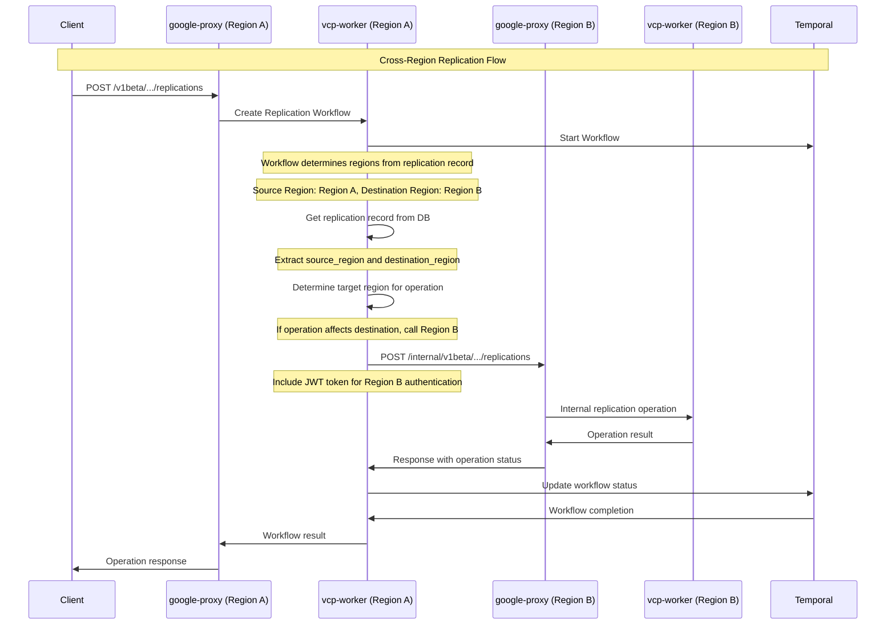

# Volume Replication Endpoints and Design

Date: 2025-08-22

## Status

Accepted

## Context

Volume replication is a critical feature that enables customers to create and manage data replication relationships between volumes across different regions, zones, and projects. This functionality is essential for disaster recovery, data migration, and business continuity scenarios.

The system needs to provide a comprehensive set of REST API endpoints that allow customers to:
- Create volume replication relationships
- Update replication configurations
- Monitor replication status and health
- Stop, resume, and sync replication
- Delete replication relationships
- List and query replication objects

The design must support both synchronous and asynchronous operations, handle cross-region and cross-project replication scenarios, and integrate with the existing workflow engine for long-running operations.

## Decision

We will implement a comprehensive volume replication API with the following design principles:

### API Endpoints Structure

The volume replication API follows the RESTful pattern with the following endpoints:

#### Public API Endpoints

1. **Create Replication**: `POST /v1beta/projects/{projectNumber}/locations/{locationId}/volumes/{volumeResourceId}/replications`
2. **List Replications**: `GET /v1beta/projects/{projectNumber}/locations/{locationId}/replications`
3. **Get Multiple Replications**: `POST /v1beta/projects/{projectNumber}/locations/{locationId}/volumes/{volumeResourceId}/getMultipleReplications`
4. **Update Replication**: `PUT /v1beta/projects/{projectNumber}/locations/{locationId}/volumes/{volumeResourceId}/replications/{replicationResourceId}`
5. **Delete Replication**: `DELETE /v1beta/projects/{projectNumber}/locations/{locationId}/volumes/{volumeResourceId}/replications/{replicationResourceId}`
6. **Stop Replication**: `POST /v1beta/projects/{projectNumber}/locations/{locationId}/volumes/{volumeResourceId}/replications/{replicationResourceId}/stop`
7. **Resume Replication**: `POST /v1beta/projects/{projectNumber}/locations/{locationId}/volumes/{volumeResourceId}/replications/{replicationResourceId}/resume`
8. **Reverse and Resume Replication**: `POST /v1beta/projects/{projectNumber}/locations/{locationId}/volumes/{volumeResourceId}/replications/{replicationResourceId}/reverseAndResumeReplication`
9. **Sync Replication**: `POST /v1beta/projects/{projectNumber}/locations/{locationId}/volumes/{volumeResourceId}/replications/{replicationResourceId}/sync`


#### Internal API Endpoints

10. **Internal Create Volume Replication**: `POST /v1beta/internal/projects/{projectNumber}/locations/{locationId}/volumeReplication`
11. **Internal Release Volume Replication**: `POST /v1beta/internal/projects/{projectNumber}/locations/{locationId}/volumeReplication/{volumeReplicationId}/release`
12. **Internal Get Multiple Replications**: `POST /v1beta/internal/projects/{projectNumber}/locations/{locationId}/getMultipleReplications`
13. **Internal Get Replication Count**: `GET /v1beta/internal/projects/{projectNumber}/locations/{locationId}/volumeReplication/count`
14. **Internal Describe Volume Replication**: `GET /v1beta/internal/projects/{projectNumber}/locations/{locationId}/volumeReplication/{volumeReplicationId}`
15. **Internal Authorize Volume Replication**: `POST /v1beta/internal/projects/{projectNumber}/locations/{locationId}/volumeReplication/authorize`

### GetMultipleReplications API Details

The GetMultipleReplications API is a specialized endpoint that allows customers to retrieve multiple replication objects in a single request. This API provides efficient bulk retrieval capabilities for scenarios where multiple replication objects need to be fetched simultaneously.

#### Endpoint Details
- **URL**: `POST /v1beta/projects/{projectNumber}/locations/{locationId}/volumes/{volumeResourceId}/getMultipleReplications`
- **Method**: POST
- **Content-Type**: application/json

#### Request Body Schema
```json
{
  "replicationUris": [
    "projects/123456789/locations/us-central1/volumes/vol-uuid1/replications/rep-uuid1",
    "projects/123456789/locations/us-central1/volumes/vol-uuid2/replications/rep-uuid2"
  ]
}
```

#### Request Parameters
- **replicationUris** (required): Array of replication URIs to retrieve
  - Each URI must follow the format: `projects/{projectNumber}/locations/{locationId}/volumes/{volumeResourceId}/replications/{replicationResourceId}`
  - Maximum array size: 100 replication URIs per request
  - URIs must belong to the same project and location

#### Response Format
```json
{
  "replications": [
    {
      "replicationId": "rep-uuid1",
      "resourceId": "my-replication-1",
      "description": "First replication",
      "state": "AVAILABLE",
      "mirrorState": "MIRRORED",
      "role": "SOURCE",
      "source": {
        "volumeId": "vol-uuid1",
        "volumeName": "projects/123456789/locations/us-central1/volumes/my-source-volume-1"
      },
      "destination": {
        "volumeId": "vol-uuid2",
        "volumeName": "projects/123456789/locations/us-central1/volumes/my-destination-volume-1"
      }
    },
    {
      "replicationId": "rep-uuid2",
      "resourceId": "my-replication-2",
      "description": "Second replication",
      "state": "CREATING",
      "mirrorState": "PREPARING",
      "role": "SOURCE",
      "source": {
        "volumeId": "vol-uuid3",
        "volumeName": "projects/123456789/locations/us-central1/volumes/my-source-volume-2"
      },
      "destination": {
        "volumeId": "vol-uuid4",
        "volumeName": "projects/123456789/locations/us-central1/volumes/my-destination-volume-2"
      }
    }
  ]
}
```

#### Use Cases
1. **Bulk Status Checking**: Retrieve status of multiple replications for monitoring dashboards
2. **Batch Operations**: Get details of multiple replications before performing batch operations
3. **Reporting**: Collect replication information for compliance and audit reports
4. **Synchronization**: Ensure multiple replications are in sync by checking their states
5. **Troubleshooting**: Investigate issues across multiple replication relationships

#### Performance Considerations
- **Batch Size**: Limit requests to 100 replication URIs for optimal performance
- **Caching**: Responses can be cached for frequently accessed replication lists
- **Parallel Processing**: The API processes multiple URIs in parallel for faster response times
- **Resource Optimization**: Reduces the number of individual API calls needed

#### Error Handling
- **400 Bad Request**: Invalid replication URIs or malformed request
- **401 Unauthorized**: Authentication required
- **403 Forbidden**: Insufficient permissions to access replications
- **404 Not Found**: One or more replication URIs not found
- **422 Unprocessable Entity**: Validation errors in request parameters
- **429 Too Many Requests**: Rate limit exceeded
- **500 Internal Server Error**: Server-side processing error

#### Implementation Details
The API implements a two-tier approach:
1. **VCP First**: Initially checks if all replications exist in the VCP database
2. **CVP Fallback**: If not all replications are found in VCP, makes a call to the CVP API to retrieve missing replications
3. **Response Aggregation**: Combines results from both sources into a unified response

**Internal Workflow Trigger**: When the GetMultipleReplications API is called, it automatically triggers an internal workflow (`GetMultipleReplicationsInternalWorkflow`) that performs a refresh operation. This workflow:
- Creates a job in the database with type `RefreshVolumeReplicationInternal`
- Executes asynchronously to refresh replication data from Ontap
- Ensures data consistency between VCP and the actual replication state
- Runs in the background without blocking the API response
- Uses the `CustomerTaskQueue` for workflow execution
- Implements workflow ID reuse policy to prevent duplicate executions

**Additional Operations**: The system also supports mount check operations for replications:
- **Mount Check Workflow**: `PerformMountCheckWorkflow` that verifies volume mount status
- **Job Creation**: Creates jobs with type `MountCheck` for tracking mount verification operations
- **Asynchronous Execution**: Mount checks run asynchronously without blocking API responses
- **Resource Validation**: Ensures volumes are properly mounted before replication operations

#### Security Features
- **Project Isolation**: Users can only access replications within their own projects
- **Location Validation**: Ensures URIs belong to the specified location
- **Correlation ID Tracking**: Supports request tracing and debugging
- **Rate Limiting**: Prevents abuse through request throttling

### Cross-Region API Communication Pattern

Volume replication requires communication between multiple regions (source and destination). The system implements a sophisticated cross-region communication pattern using internal APIs and region-specific base URLs.

#### Communication Flow Diagram



#### Region Determination Logic

The system determines which region to call based on the replication record and operation type:

```go
type ReplicationRegionLogic struct {
    SourceRegion      string
    DestinationRegion string
    OperationType     string
}

func (r *ReplicationRegionLogic) DetermineTargetRegion() string {
    switch r.OperationType {
    case "create_replication":
        // Create operation affects both regions
        // Primary operation in source region, secondary in destination
        return r.SourceRegion
        
    case "update_replication":
        // Update affects the region where the replication record exists
        return r.SourceRegion
        
    case "stop_replication":
        // Stop operation affects the destination region
        return r.DestinationRegion
        
    case "resume_replication":
        // Resume operation affects the destination region
        return r.DestinationRegion
        
    case "delete_replication":
        // Delete affects both regions
        // Primary deletion in source, cleanup in destination
        return r.SourceRegion
        
    case "sync_replication":
        // Sync operation affects the destination region
        return r.DestinationRegion
        
    default:
        return r.SourceRegion
    }
}
```

#### Paired Regions Configuration

The system uses the `VCP_PAIRED_REGIONS` environment variable to configure region-specific base URLs. This is a JSON-formatted string that maps regions to their corresponding google-proxy base URLs.

```yaml
# Environment configuration in Kubernetes ConfigMaps
VCP_PAIRED_REGIONS: '{"us-central1":"https://google-proxy-us-central1.example.com","us-east1":"https://google-proxy-us-east1.example.com","us-west1":"https://google-proxy-us-west1.example.com"}'
```

The configuration is set in the Kubernetes ConfigMaps for both google-proxy and vcp-worker services:

```yaml
# kubernetes/vcp-worker-chart/templates/configMap.yaml
VCP_PAIRED_REGIONS: {{ .Values.workerConfig.vcpPairedRegions | quote }}

# kubernetes/vsa-control-plane/charts/google-proxy/templates/configMap.yaml  
VCP_PAIRED_REGIONS: "{{ index .Values \"vcpPairedRegions\" }}"
```

The system reads this configuration using the `utils.GetPairedRegionURI()` function:

```go
// utils/util.go
var PairedRegions = env.GetString("VCP_PAIRED_REGIONS", "")

func _getPairedRegionURI(region string) (string, error) {
    if PairedRegions == "" {
        return "", errors.New("paired regions not defined for this region")
    }
    sMap, err := ConvertStringToMap(PairedRegions)
    if err != nil {
        return "", err
    }

    uri, ok := sMap[region]
    if !ok {
        return "", errors.New("region not found in paired regions list")
    }
    return uri, nil
}

func _convertStringToMap(s string) (map[string]string, error) {
    var mapSlice map[string]string
    sMapBytes := []byte(s)
    err := json.Unmarshal(sMapBytes, &mapSlice)
    if err != nil {
        return nil, errors.New("error when unmarshalling response")
    }
    return mapSlice, nil
}
```

Example configuration in values.yaml:
```yaml
# kubernetes/vsa-control-plane/values.yaml
vcpPairedRegions: '{"us-central1":"https://google-proxy-us-central1.example.com","us-east1":"https://google-proxy-us-east1.example.com","us-west1":"https://google-proxy-us-west1.example.com"}'
```

#### Cross-Region Authentication

Cross-region calls originate from vcp-worker to the proxy in either remote or local region. The system generates JWT tokens for cross-region communication using the service account configured in the ConfigMap. The service account must be configured in the accepted service accounts list in the target region.

#### Internal API Endpoints and Cross-Region Communication

Internal endpoints provide a mechanism to call the target region without maintaining awareness of the current region in the code. This reduces control flows and makes the code more manageable. This also gives flexibility to trigger remote workflows. This makes the entire code modular.

The internal endpoints abstract the complexity of cross-region communication by providing a unified interface for replication operations. They handle authentication, routing, and error handling transparently, allowing the business logic to focus on replication operations rather than infrastructure concerns.

**Key Features:**
- **Unified Interface**: Single interface for all replication operations
- **Transparent Communication**: Handles authentication, routing, and error handling
- **Modular Design**: Enables remote workflow triggering
- **Job Type Tracking**: Each endpoint has its own job type for monitoring

**Implementation Details:**
- Internal endpoints are added in `internal_endpoints.go` file
- Workflows triggered via internal endpoints should be named accordingly
- Each internal endpoint has its own job type for easy tracking
- Uses the same `gcp-api.yaml` file as google-proxy service for new endpoints
- Called via google-proxy-client package in `/clients` package
- The google-proxy-client can be generated via makefile target

**Example Internal Endpoint:**
```go
func (h Handler) InternalCreateReplication(ctx context.Context, req *gcpgenserver.ReplicationCreateV1beta, params gcpgenserver.V1betaCreateReplicationParams) (gcpgenserver.V1betaCreateReplicationRes, error) {
    // Validate cross-region token
    if err := validateCrossRegionToken(ctx, params.LocationId); err != nil {
        return &gcpgenserver.V1betaCreateReplicationUnauthorized{
            Code:    401,
            Message: "Invalid cross-region token",
        }, nil
    }
    
    // Process internal replication creation
    return h.processInternalReplicationCreation(ctx, req, params)
}
```

**Client Usage:**
```go
// Using google-proxy-client for cross-region calls
client := googleproxyclient.NewClient(targetRegionURL)
response, err := client.InternalCreateReplication(ctx, request, params)
```

#### Workflow Integration

Temporal workflows coordinate cross-region operations:

```go
func CrossRegionReplicationWorkflow(ctx workflow.Context, params *common.CreateVolumeReplicationParams) error {
    // 1. Create replication record in source region
    replicationRecord, err := createReplicationRecord(ctx, params)
    if err != nil {
        return err
    }
    
    // 2. Determine target region for cross-region call
    targetRegion := determineTargetRegion(replicationRecord, "create")
    
    // 3. Make cross-region call to destination region
    crossRegionParams := &CrossRegionParams{
        SourceRegion:      params.Region,
        DestinationRegion: targetRegion,
        ReplicationID:     replicationRecord.ID,
        Operation:         "create_replication",
    }
    
    err = workflow.ExecuteActivity(ctx, "MakeCrossRegionCall", crossRegionParams).Get(ctx, nil)
    if err != nil {
        // Handle cross-region call failure
        return workflow.ExecuteActivity(ctx, "RollbackReplicationCreation", replicationRecord.ID).Get(ctx, nil)
    }
    
    // 4. Update replication status
    return workflow.ExecuteActivity(ctx, "UpdateReplicationStatus", replicationRecord.ID, "available").Get(ctx, nil)
}
```

### Data Model Design

The volume replication system uses a hierarchical data model with the following key components:

#### Core Replication Model
```go
type VolumeReplication struct {
    BaseModel
    Name                  string
    Description           string
    State                 string              // creating, available, updating, disabled, deleting, deleted, error
    StateDetails          string
    Uri                   string
    RemoteUri             string
    ReplicationAttributes *ReplicationDetails
    MirrorState           *string
    RelationshipStatus    *string
    TotalProgress         int64
    TotalTransferBytes    int64
    TotalTransferTimeSecs int64
    LastTransferSize      int64
    LastTransferError     string
    LastTransferDuration  int64
    LastTransferEndTime   *time.Time
    ProgressLastUpdated   *time.Time
    LastUpdatedFromOntap  time.Time
    LagTime               int64
    AccountID             int64
    Account               *Account
    VolumeID              int64
    Volume                *Volume
    Jobs                  []*Job
    Healthy               bool
}
```

#### Replication Details
```go
type ReplicationDetails struct {
    EndpointType               string  // "src" or "dst"
    ReplicationType            string
    ReplicationSchedule        string  // 10minutely, hourly, daily, weekly, monthly
    SourcePoolUUID             string
    SourceVolumeUUID           string
    SourceRegion               string
    SourceHostName             string
    SourceReplicationUUID      string
    SourceSvmName              string
    SourceVolumeName           string
    DestinationPoolUUID        string
    DestinationVolumeUUID      string
    DestinationRegion          string
    DestinationHostName        string
    DestinationReplicationUUID string
    DestinationSvmName         string
    DestinationVolumeName      string
    ReplicationPolicy          string  // MirrorAllSnapshots
    ExternalUUID               string
}
```

#### Additional Models

**VolumeReplicationUpdateMaskRequest:**
```go
type VolumeReplicationUpdateMaskRequest struct {
    State                 VolumeReplicationHydrateState `json:"state"`
    HybridReplicationType HybridReplicationHydrateType  `json:"hybridReplicationType,omitempty"`
}
```

**ReplicationHydrateObject:**
```go
type ReplicationHydrateObject struct {
    ResourceId            string                        `json:"name"`
    ReplicationState      string                        `json:"state"`
    HybridReplicationType *HybridReplicationHydrateType `json:"hybridReplicationType,omitempty"`
    Labels                map[string]string             `json:"labels,omitempty"`
}
```

**UpdateVolumeReplicationAttributesParams:**
```go
type UpdateVolumeReplicationAttributesParams struct {
    ProjectNumber             string
    LocationId                string
    VolumeReplicationId       string
    VolumeReplicationInternal *gcpgenserver.VolumeReplicationInternalV1beta
}
```

### Workflow Architecture

The replication system uses Temporal workflows for managing long-running operations:

1. **Create Replication Workflow**: Handles the creation of replication relationships
2. **Update Replication Workflow**: Manages updates to existing replication configurations
3. **Resume Replication Workflow**: Handles resuming paused replication
4. **Stop Replication Workflow**: Manages stopping active replication
5. **Delete Replication Workflow**: Handles deletion of replication relationships
6. **Sync Replication Workflow**: Manages synchronization of replication data
7. **Reverse and Resume Replication Workflow**: Handles reversing replication direction and resuming
8. **Internal Create Workflow**: Manages internal replication creation processes
9. **Internal Update Workflow**: Handles internal replication updates
10. **Release Volume Replication Internal Workflow**: Manages internal release operations for volume replication
11. **GetMultipleReplicationsInternalWorkflow**: Handles bulk replication retrieval and refresh operations
12. **PerformMountCheckWorkflow**: Handles volume mount verification for replication operations

### State Management

The replication system supports the following lifecycle states:

- **creating**: Initial creation in progress
- **available**: Replication is active and healthy
- **updating**: Configuration update in progress
- **disabled**: Replication is paused/stopped
- **deleting**: Deletion in progress
- **deleted**: Replication has been deleted
- **error**: Replication is in error state

### Advanced Replication Features


#### Reverse and Resume Replication
A powerful feature that allows customers to:
- Reverse the direction of replication (source becomes destination, destination becomes source)
- Resume replication in the new direction
- Maintain data consistency during direction changes
- Support disaster recovery scenarios where roles need to be swapped

#### Sync Replication
Provides on-demand synchronization capabilities:
- Force immediate data synchronization between source and destination
- Override scheduled replication intervals
- Ensure data consistency for critical operations
- Support for manual sync operations during maintenance windows

### Mirror States

The system tracks detailed mirror states for replication health monitoring:

- **MIRROR_STATE_UNSPECIFIED**: Unknown state
- **PREPARING**: Initial setup in progress
- **UNINITIALIZED**: Replication not yet initialized
- **MIRRORED**: Replication is active and synchronized
- **STOPPED**: Replication is paused
- **ABORTED**: Replication was aborted
- **TRANSFERRING**: Data transfer in progress
- **BASELINE_TRANSFERRING**: Initial baseline transfer
- **EXTERNALLY_MANAGED**: Managed by external system

### Cross-Region and Cross-Project Support

The system supports replication across:
- **Cross-Region Replication**: Between different GCP regions
- **Cross-Zone Replication**: Within the same region but different zones
- **Cross-Project Replication**: Between different GCP projects

### Security and Authentication

- All endpoints require proper authentication and authorization
- Cross-project replication requires appropriate IAM permissions
- JWT tokens are used for secure communication between services
- Correlation IDs are used for request tracing

### Error Handling

The system implements comprehensive error handling:
- Input validation errors (400)
- Authentication errors (401)
- Authorization errors (403)
- Resource not found errors (404)
- Validation errors (422)
- Rate limiting (429)
- Internal server errors (500)

### Performance and Scalability

- Asynchronous operations for long-running tasks
- Pagination support for list operations
- Efficient database queries with proper indexing
- Caching strategies for frequently accessed data
- Retry mechanisms for transient failures

## Implementation Details

### Database Schema

The replication data is stored in the `volume_replications` table with reference to accounts and volumes.

### Workflow Activities

Key activities in the replication workflows include:
- `GetSrcBasePath`: Retrieve source volume information
- `GetDstBasePath`: Retrieve destination volume information
- `GetSignedSrcToken`: Generate authentication tokens for source
- `GetSignedDstToken`: Generate authentication tokens for destination
- `CreateReplication`: Create the actual replication relationship
- `MakeCrossRegionCall`: Execute cross-region API calls
- `ValidateCrossRegionToken`: Validate JWT tokens for cross-region communication
- `ReleaseReplicationOnSource`: Release replication on the source side during deletion
- `UpdateReplicationStateInDBForRelease`: Update replication state in database during release operations
- `ReverseAndResumeReplication`: Reverse replication direction and resume
- `ValidateReplicationForReversal`: Validate replication state for reversal operations
- `CreateBackupSnapshots`: Create backup snapshots before reversal
- `UpdateReplicationConfiguration`: Update replication configuration during reversal
- `VerifyReplicationHealth`: Verify replication health after operations
- `SyncReplication`: Synchronize replication data
- `StopReplication`: Stop active replication
- `ResumeReplication`: Resume paused replication
- `GetMultipleReplications`: Retrieve multiple replication objects
- `RefreshVolumeReplicationInternal`: Refresh replication data from Ontap
- `PerformMountCheck`: Verify volume mount status

### API Response Format

All API responses follow a consistent format with:
- Standard HTTP status codes
- JSON response bodies
- Operation tracking for async operations
- Detailed error messages

### Configuration

The system supports configuration through:
- Environment variables for feature flags (e.g., `CRR_ENABLED`)
- YAML configuration files for replication policies
- Database configuration for replication schedules and policies
- Environment variables for paired regions configuration (`VCP_PAIRED_REGIONS`)
- JWT secret configuration for cross-region authentication
- Replication schedule configuration (e.g., `EVERY_10_MINUTES`, `HOURLY`, `DAILY`, `WEEKLY`, `MONTHLY`)

- Cross-region replication policies and limits
- Volume replication type configuration (e.g., `ExternalDisasterRecovery`)

## Implementation Guidance

### Code Organization

The volume replication implementation follows a layered architecture pattern:

```
core/
├── models/
│   └── volume_replication.go          # Core data models
├── orchestrator/
│   ├── volume_replication.go          # Main orchestrator logic
│   ├── replication/                   # Replication-specific logic
│   ├── activities/                    # Replication activities
│   │   └── replicationActivities/     # Replication-specific activities
│   │       ├── replication_create_activities.go
│   │       ├── replication_update_activities.go
│   │       ├── replication_delete_activities.go
│   │       ├── replication_resume_activities.go
│   │       ├── replication_stop_activities.go
│   │       ├── replication_sync_activities.go
│   │       ├── replication_reverse_resume_activities.go
│   │       ├── replication_internal_activities.go
│   │       └── replication_cleanup_activities.go
│   └── workflows/replicationWorkflows/ # Temporal workflows
│       ├── replication_create_workflow.go
│       ├── replication_update_workflow.go
│       ├── replication_resume_workflow.go
│       ├── replication_stop_workflow.go
│       ├── replication_sync_workflow.go
│       ├── replication_reverse_resume_workflow.go
│       ├── replication_delete_workflow.go
│       ├── replication_cleanup_workflow.go
│       └── replication_internal_*.go
└── vsa/
    └── volume_replication.go          # VSA-specific operations

google-proxy/
└── api/
    └── endpoints/
        └── replication_endpoints.go   # REST API endpoints

clients/
└── cvp/
    └── cvpapi/
        └── replications/              # Generated client code
```

### API Endpoint Implementation Pattern

All replication endpoints follow a consistent pattern:

```go
func (h Handler) V1betaCreateReplication(ctx context.Context, req *gcpgenserver.ReplicationCreateV1beta, params gcpgenserver.V1betaCreateReplicationParams) (gcpgenserver.V1betaCreateReplicationRes, error) {
    logger := util.GetLogger(ctx)
    helper.AddLabelerAttributes(ctx, params.ProjectNumber, params.LocationId, nil)
    
    // 1. Feature flag check
    if !crrEnabled {
        return &gcpgenserver.V1betaCreateReplicationForbidden{
            Code:    400,
            Message: "CRR is not enabled",
        }, nil
    }
    
    // 2. Input validation
    region, _, parsingErr := parseAndValidateRegionAndZone(params.LocationId)
    if parsingErr != nil {
        return &gcpgenserver.V1betaCreateReplicationBadRequest{
            Code:    parsingErr.Code,
            Message: parsingErr.Message,
        }, nil
    }
    
    // 3. Prepare parameters
    replicationParams := prepareCreateVolumeReplicationParams(req, params, region)
    
    // 4. Call orchestrator
    volumeRep, jobUUID, err := h.Orchestrator.CreateVolumeReplication(ctx, replicationParams)
    if err != nil {
        // 5. Error handling
        if errors.IsUserInputValidationErr(err) || errors.IsNotFoundErr(err) {
            return &gcpgenserver.V1betaCreateReplicationBadRequest{
                Code:    400,
                Message: err.Error(),
            }, nil
        }
        logger.Error("Failed to create volume replication", "error", err.Error())
        return &gcpgenserver.V1betaCreateReplicationInternalServerError{Code: 500, Message: err.Error()}, nil
    }
    
    // 6. Prepare response
    resp, err := encodeVolumeReplicationV1(convertModelToVCPVolumeReplication(volumeRep))
    if err != nil {
        return &gcpgenserver.V1betaCreateReplicationInternalServerError{Code: 500, Message: err.Error()}, nil
    }
    
    // 7. Return operation or immediate response
    operationID := "/v1beta/projects/" + params.ProjectNumber + "/locations/" + params.LocationId + "/operations/" + jobUUID
    if volumeRep.State == models2.LifeCycleStateCreating {
        return &gcpgenserver.OperationV1beta{
            Name:     gcpgenserver.NewOptString(operationID),
            Response: resp,
            Done:     gcpgenserver.NewOptBool(false),
        }, nil
    }
    return &gcpgenserver.OperationV1beta{
        Name:     gcpgenserver.NewOptString(operationID),
        Response: resp,
        Done:     gcpgenserver.NewOptBool(true),
    }, nil
}
```

### Workflow Implementation Pattern

Temporal workflows follow a consistent structure:

```go
func CreateVolumeReplicationWorkflow(ctx workflow.Context, params *common.CreateVolumeReplicationParams, volumeRep *datamodel.VolumeReplication, event *replication.CreateReplicationEvent) (gcpgenserver.V1betaDescribeVolumeRes, error) {
    volumeRepWf := new(createVolumeReplicationWorkflow)
    err := volumeRepWf.Setup(ctx, params)
    if err != nil {
        return nil, err
    }
    
    // 1. Set initial status
    volumeRepWf.Status = workflows.WorkflowStatusRunning
    err = volumeRepWf.UpdateJobStatus(ctx, string(models.JobsStatePROCESSING), nil)
    if err != nil {
        return nil, err
    }
    
    // 2. Execute workflow logic
    _, err = volumeRepWf.Run(ctx, volumeRep, event)
    if err != nil {
        // 3. Handle failure
        volumeRepWf.Status = workflows.WorkflowStatusFailed
        err = volumeRepWf.UpdateJobStatus(ctx, string(models.JobsStateERROR), err)
        if err != nil {
            return nil, err
        }
    }
    
    // 4. Handle success
    volumeRepWf.Status = workflows.WorkflowStatusCompleted
    err = volumeRepWf.UpdateJobStatus(ctx, string(models.JobsStateDONE), nil)
    return nil, err
}
```

### Activities Implementation Pattern

Temporal activities follow a consistent structure and are organized by functionality:

```go
// Activity interface pattern
type ReplicationActivity interface {
    GetSrcBasePath(ctx context.Context, params *common.GetSrcBasePathParams) (*replication.GetSrcBasePathResult, error)
    GetDstBasePath(ctx context.Context, params *common.GetDstBasePathParams) (*replication.GetDstBasePathResult, error)
    CreateReplication(ctx context.Context, params *common.CreateReplicationParams) (*replication.CreateReplicationResult, error)
    UpdateReplication(ctx context.Context, params *common.UpdateReplicationParams) (*replication.UpdateReplicationResult, error)
    DeleteReplication(ctx context.Context, params *common.DeleteReplicationParams) (*replication.DeleteReplicationResult, error)
}

// Example activity implementation
func (a *CreateVolumeReplicationActivity) GetSrcBasePath(ctx context.Context, params *common.GetSrcBasePathParams) (*replication.GetSrcBasePathResult, error) {
    logger := util.GetLogger(ctx)
    logger.Info("Getting source base path", "volumeID", params.VolumeID, "region", params.Region)
    
    // 1. Validate input parameters
    if err := a.validateGetSrcBasePathParams(params); err != nil {
        logger.Error("Invalid parameters for GetSrcBasePath", "error", err.Error())
        return nil, err
    }
    
    // 2. Get volume information from database
    volume, err := a.storage.GetVolume(ctx, params.VolumeID)
    if err != nil {
        logger.Error("Failed to get volume from database", "error", err.Error())
        return nil, err
    }
    
    // 3. Call VSA provider to get base path
    basePath, err := a.vsaProvider.GetBasePath(ctx, volume)
    if err != nil {
        logger.Error("Failed to get base path from VSA", "error", err.Error())
        return nil, err
    }
    
    // 4. Return result
    return &replication.GetSrcBasePathResult{
        BasePath: basePath,
        VolumeID: params.VolumeID,
        Region:   params.Region,
    }, nil
}

// Activity registration pattern
func RegisterReplicationActivities(worker worker.Worker, activities ReplicationActivity) {
    worker.RegisterActivity(activities.GetSrcBasePath)
    worker.RegisterActivity(activities.GetDstBasePath)
    worker.RegisterActivity(activities.CreateReplication)
    worker.RegisterActivity(activities.UpdateReplication)
    worker.RegisterActivity(activities.DeleteReplication)
}
```

**Activity Organization**: Activities are grouped by functionality:
- **Create Activities**: Handle replication creation operations
- **Update Activities**: Manage replication updates and modifications
- **Delete Activities**: Handle replication deletion and cleanup
- **Resume Activities**: Handle replication resume operations
- **Stop Activities**: Handle replication stop operations
- **Sync Activities**: Handle replication synchronization operations
- **Reverse Resume Activities**: Handle replication direction reversal and resume operations
- **Internal Activities**: Manage internal cross-region operations
- **Cleanup Activities**: Handle cleanup operations and resource management

**Activity Best Practices**:
1. **Single Responsibility**: Each activity should perform one specific operation
2. **Error Handling**: Comprehensive error handling with proper logging
3. **Input Validation**: Validate all input parameters before processing
4. **Logging**: Structured logging with correlation IDs for tracing
5. **Retry Logic**: Implement retry mechanisms for transient failures
6. **Timeout Management**: Set appropriate timeouts for long-running operations
7. **Resource Cleanup**: Ensure proper cleanup in case of failures

### Database Operations

Database operations use the repository pattern:

```go
// Create replication
func (se *Storage) CreateVolumeReplication(ctx context.Context, replication *datamodel.VolumeReplication) (*datamodel.VolumeReplication, error) {
    // Implementation with proper error handling and validation
}

// Get replication by ID
func (se *Storage) GetVolumeReplication(ctx context.Context, replicationID string) (*datamodel.VolumeReplication, error) {
    // Implementation with proper error handling
}

// Update replication
func (se *Storage) UpdateVolumeReplication(ctx context.Context, replication *datamodel.VolumeReplication) error {
    // Implementation with proper validation
}
```

### Error Handling Strategy

The system implements a comprehensive error handling strategy:

```go
// Error types
var (
    ErrReplicationNotFound = errors.New("replication not found")
    ErrInvalidReplicationState = errors.New("invalid replication state")
    ErrReplicationAlreadyExists = errors.New("replication already exists")
    ErrCrossProjectNotSupported = errors.New("cross-project replication not supported")
)

// Error handling in endpoints
func handleReplicationError(err error, logger logger.Logger) gcpgenserver.V1betaCreateReplicationRes {
    switch {
    case errors.Is(err, ErrReplicationNotFound):
        return &gcpgenserver.V1betaCreateReplicationNotFound{
            Code:    404,
            Message: err.Error(),
        }
    case errors.Is(err, ErrInvalidReplicationState):
        return &gcpgenserver.V1betaCreateReplicationBadRequest{
            Code:    400,
            Message: err.Error(),
        }
    default:
        logger.Error("Unexpected error", "error", err.Error())
        return &gcpgenserver.V1betaCreateReplicationInternalServerError{
            Code:    500,
            Message: "Internal server error",
        }
    }
}
```

### Testing Strategy

The testing strategy includes:

1. **Unit Tests**: Test individual functions and methods
2. **Integration Tests**: Test workflow execution
3. **API Tests**: Test REST endpoints
4. **End-to-End Tests**: Test complete replication scenarios

```go
// Example unit test
func TestCreateVolumeReplication(t *testing.T) {
    // Setup
    ctx := context.Background()
    params := &common.CreateVolumeReplicationParams{
        AccountName: "test-account",
        Region:      "us-central1",
        // ... other parameters
    }
    
    // Execute
    result, jobUUID, err := orchestrator.CreateVolumeReplication(ctx, params)
    
    // Assert
    assert.NoError(t, err)
    assert.NotNil(t, result)
    assert.NotEmpty(t, jobUUID)
    assert.Equal(t, "creating", result.State)
}

// Example workflow test
func TestCreateVolumeReplicationWorkflow(t *testing.T) {
    // Setup test environment
    env := test.NewTestWorkflowEnvironment()
    
    // Mock activities
    env.OnActivity("GetSrcBasePath", mock.Anything).Return(&replicationResult, nil)
    env.OnActivity("GetDstBasePath", mock.Anything).Return(&replicationResult, nil)
    env.OnActivity("CreateReplication", mock.Anything).Return(&replicationResult, nil)
    
    // Execute workflow
    env.ExecuteWorkflow(CreateVolumeReplicationWorkflow, params, volumeRep, event)
    
    // Assert
    assert.True(t, env.IsWorkflowCompleted())
    assert.NoError(t, env.GetWorkflowError())
}
```