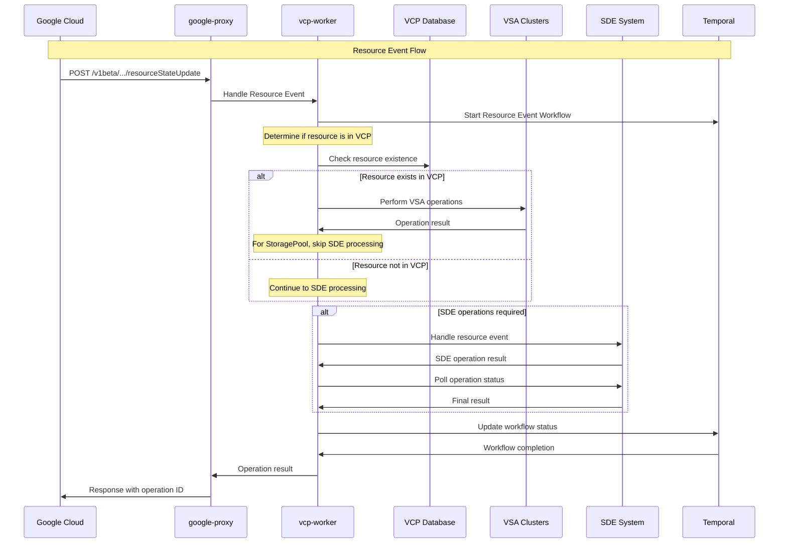

# Resource Event Endpoints and Design

Date: 2025-10-23

## Status

Accepted

## Context

Resource event management is a critical feature that enables the VSA Control Plane to handle lifecycle state changes for various cloud resources including projects, storage pools, volumes, snapshots, and other resource types once the customer decided to unsubscribe from GCNV. This functionality is essential for maintaining consistency between the hyperscaler control plane (Google Cloud NetApp Volumes) and the VSA Control Plane, ensuring proper resource state synchronization and handling project-level operations like enabling/disabling the service.

The system needs to provide a comprehensive set of REST API endpoints that allow Google Cloud to:
- Start project events (enable/disable GCNV service for a project)
- Handle resource events for various resource types
- Finish project events (cleanup and finalization operations)
- Integrate with both VSA clusters and legacy SDE (Service Delivery Engine) systems

The design must support both synchronous and asynchronous operations, handle cross-project scenarios, integrate with the existing workflow engine for long-running operations, and provide proper error handling and retry mechanisms.

## Decision

We will implement a comprehensive resource event API with the following design principles:

### API Endpoints Structure

The resource event API follows the RESTful pattern with the following endpoints:

#### Public API Endpoints

1. **Start Project Event**: `POST /v1beta/projects/{projectNumber}/locations/{locationId}/startProjectEvent`
2. **Finish Project Event**: `POST /v1beta/projects/{projectNumber}/locations/{locationId}/finishProjectEvent`
3. **Handle Resource Event**: `PUT /v1beta/projects/{projectNumber}/locations/{locationId}/handleResourceEvent`

### Start Project Event API Details

The Start Project Event API handles enabling and disabling the VSA service for a Google Cloud project. This is a critical operation that affects all VSA resources within the project scope.

#### Endpoint Details
- **URL**: `POST /v1beta/projects/{projectNumber}/locations/{locationId}/startProjectEvent`
- **Method**: POST
- **Content-Type**: application/json

#### Request Body Schema
Valid values: "ON", "OFF"
```json
{
  "state": "ON"
}
```

#### Request Parameters
- **projectNumber** (required): Google Cloud project number
- **locationId** (required): GCP location/region identifier (e.g., "us-central1", "us-central1-a")
- **X-Correlation-ID** (optional): Request correlation ID for tracing

#### Supported States
- **ON**: Enable VSA service for the project (power on VSA clusters, enable account)
- **OFF**: Disable VSA service for the project (power off VSA clusters, disable account)
- **DELETE**: Not implemented (returns 501 Not Implemented)

#### Response Format
```json
{
  "name": "/v1beta/projects/123456789/locations/us-central1/operations/ee5ca01c-221b-6c1f-e310-7bc413da3ef2",
  "done": false
}
```

#### Use Cases
1. **Service Enablement**: Enable VSA service when customer first uses Google Cloud NetApp Volumes
2. **Service Suspension**: Temporarily disable VSA service for maintenance or billing issues
3. **Resource Management**: Bulk power operations on all VSA clusters in a project
4. **Cross-Region Operations**: Handle project-level operations across multiple regions
5. **Zone-Specific Operations**: Handle zone-specific enable/disable operations

#### Workflow Behavior

**ON State Workflow**:
- Sets account state to "enabling" 
- Lists all disabled pools in the project
- Executes VSA cluster power-on operations in parallel with configurable timeout (45 minutes default)
- Handles SDE operations concurrently for legacy systems
- Updates pool lifecycle states to "available"
- Sets final account state to "enabled" on success
- Supports zone-specific operations (skips VSA operations if zone is specified)

**OFF State Workflow**:
- Sets account state to "disabling"
- Lists all pools in the project
- Filters out pools/volumes/snapshots in transient states
- Validates cluster health before shutdown
- Executes VSA cluster power-off operations in parallel with configurable timeout
- Handles SDE operations concurrently for legacy systems
- Updates pool lifecycle states to "disabled" 
- Sets final account state to "hyperscaler_disabled" on success
- Supports zone-specific operations (skips VSA operations if zone is specified)

#### Performance Considerations
- **Parallel Processing**: VSA cluster operations execute in parallel for faster completion
- **Timeout Management**: Configurable global timeout (45 minutes default via `VSA_OPERATION_TIMEOUT`)
- **SDE Integration**: Concurrent SDE operations with remaining timeout allocation
- **Resource Filtering**: Skips resources in transient states to avoid conflicts
- **Zone Optimization**: Bypasses VSA operations for zone-specific requests

### Finish Project Event API Details

The Finish Project Event API handles project cleanup and finalization operations, primarily for the DELETE state.

#### Endpoint Details
- **URL**: `POST /v1beta/projects/{projectNumber}/locations/{locationId}/finishProjectEvent`
- **Method**: POST
- **Content-Type**: application/json

#### Request Body Schema
// Only DELETE state is supported
```json
{
  "state": "DELETE"
}
```

#### Supported States
- **DELETE**: Perform project cleanup and resource finalization
- **ON**: Not implemented (returns 501 Not Implemented)
- **OFF**: Not implemented (returns 501 Not Implemented)

#### Use Cases
1. **Project Deletion**: Clean up resources when a GCP project is deleted
2. **Service Removal**: Remove VSA service from a project permanently
3. **Resource Cleanup**: Ensure proper cleanup of regional resources
4. **Billing Finalization**: Finalize billing and usage reporting

### Handle Resource Event API Details

The Handle Resource Event API handles lifecycle state changes for individual resources within a project.

#### Endpoint Details
- **URL**: `PUT /v1beta/projects/{projectNumber}/locations/{locationId}/handleResourceEvent`
- **Method**: PUT
- **Content-Type**: application/json

#### Request Body Schema
```json
{
  "state": "ON",
  "resourceType": "Volume", 
  "resourceId": "86280955-98b0-9094-1b65-785ee2b71552"
}
```

#### Request Parameters
- **state** (required): Target state ("ON", "OFF", "DELETE")
- **resourceType** (required): Type of resource being updated
- **resourceId** (required): Unique identifier of the resource
- **parentResourceId** (optional): Parent resource identifier (in case of snapshot, we need this to identify the volume to which the snapshot belongs)
- **parentResourceType** (optional): Parent resource type (in case of snapshot, we need this to identify the volume to which the snapshot belongs)

#### Supported Resource Types
- **Volume**: Storage volumes with block/file protocols
- **Snapshot**: Point-in-time volume snapshots
- **StoragePool**: VSA storage pools containing volumes
- **KmsConfig**: Key Management Service configurations
- **BackupPolicy**: Backup policy configurations
- **ActiveDirectory**: Active Directory configurations for SMB
- **HostGroup**: Host group configurations for block storage

#### Resource Type Behavior

**Common Resources** (KmsConfig, BackupPolicy, ActiveDirectory):
- Always processed through SDE path
- Used for shared configurations across multiple pools

**Storage Resources** (Volume, Snapshot, StoragePool):
- First checked in VCP database
- Falls back to SDE if not found in VCP
- DELETE state only supported for Volume and StoragePool types

**HostGroup Resources**:
- Must exist in VCP for OFF/ON state operations, is a VCP resource and does not exist in SDE
- Returns 404 error if not found in VCP during OFF state

#### Workflow Architecture

The resource event system uses multiple Temporal workflows for managing operations:

1. **StartProjectEventOnStateWorkflow**: Handles project-level ON operations
2. **StartProjectEventOffStateWorkflow**: Handles project-level OFF operations
3. **HandleResourceEventONWorkflow**: Handles ON state transitions
4. **HandleResourceEventOFFWorkflow**: Handles OFF state transitions
5. **HandleResourceEventDELETEWorkflow**: Handles DELETE state transitions
6. **HandleResourceEventCommonResourceONWorkflow**: Handles ON state for common resources
7. **HandleResourceEventCommonResourceOFFWorkflow**: Handles OFF state for common resources
8. **FinishProjectEventDeleteStateWorkflow**: Handles project deletion cleanup

### Cross-System Integration Pattern

Resource event operations integrate with multiple backend systems using a layered approach.

#### Integration Architecture Diagram



#### VCP-First Processing Logic

The system implements a "VCP-first" approach for resource processing:

```go
func (s handleResourceEventOFFWorkflow) processResource(ctx workflow.Context, params *HandleResourceEventParams) error {
    // 1. Check if resource exists in VCP
    isVCPResource, err := checkResourceInVCP(ctx, params)
    if err != nil {
        if isNotFoundError(err) && params.ResourceType == "HostGroup" {
            // HostGroup must exist in VCP for OFF operations
            return NewVCPError(ErrResourceNotFound, "HostGroup not found in VCP")
        }
        // For other resource types, continue to SDE processing
        isVCPResource = false
    }
    
    // 2. Handle VCP resource processing
    if isVCPResource {
        if params.ResourceType == "StoragePool" {
            // StoragePool operations handled at project level, skip individual processing
            return nil
        }
        // Process other VCP resources
        return processVCPResource(ctx, params)
    }
    
    // 3. Handle SDE resource processing
    if !isSDEConfigured() {
        return nil // Skip if SDE not configured
    }
    
    result, err := startSDEOperation(ctx, params)
    if err != nil {
        return err
    }
    
    return pollSDEOperation(ctx, params, result)
}
```

#### SDE Integration Flow

For resources not managed by VCP or when SDE operations are required:

1. **Start SDE Operation**: Initiate resource event with SDE system
2. **Poll Operation**: Monitor SDE operation status until completion
3. **Error Handling**: Handle SDE-specific errors with proper retry logic
4. **Timeout Management**: Use remaining workflow timeout for SDE operations

### Data Model Design

The resource event system uses several key data models:

#### Core Parameter Models
```go
type StartProjectEventParams struct {
    LocationId     string
    State          string
    ProjectNumber  string
    XCorrelationID string
    Zone           string
}

type HandleResourceEventParams struct {
    Description        string
    State              string
    ProjectNumber      string
    LocationId         string
    XCorrelationID     string
    ResourceType       string
    ResourceId         string
    IsCommonResource   bool
    ParentResourceID   string
    ParentResourceType string
}

type FinishProjectEventParams struct {
    LocationId     string
    State          string
    ProjectNumber  string
    XCorrelationID string
    Zone           string
}
```

#### Result Models
```go
type StartProjectEventResult struct {
    Done *bool   `json:"done,omitempty"`
    Name *string `json:"name,omitempty"`
}

type HandleResourceEventResult struct {
    Done *bool   `json:"done,omitempty"`
    Name *string `json:"name,omitempty"`
}

type FinishProjectEventResult struct {
    Done *bool   `json:"done,omitempty"`
    Name *string `json:"name,omitempty"`
}
```

#### Account State Management
```go
type AccountState string

const (
    AccountStateDisabled            = "DISABLED"
    AccountStateEnabled             = "ENABLED"
    AccountStateDeleted             = "DELETED"
    AccountStateEnabling            = "ENABLING"
    AccountStateDisabling           = "DISABLING"
    AccountStateHyperscalerDisabled = "HYPERSCALERDISABLED"
)
```

### Job Type Management

Each resource event operation creates specific job types for tracking and monitoring:

#### Project Event Job Types
```go
const (
    JobTypeStartProjectEventOnState     = "START_PROJECT_EVENT_ON_STATE"
    JobTypeStartProjectEventOffState    = "START_PROJECT_EVENT_OFF_STATE"
    JobTypeFinishProjectEventDeleteState = "FINISH_PROJECT_EVENT_DELETE_STATE"
)
```

#### Resource Event Job Types
```go
const (
    JobTypeHandleResourceEventOnState     = "HANDLE_RESOURCE_EVENT_ON_STATE"
    JobTypeHandleResourceEventOffState    = "HANDLE_RESOURCE_EVENT_OFF_STATE"
    JobTypeHandleResourceEventDeleteState = "HANDLE_RESOURCE_EVENT_DELETE_STATE"
)
```

### State Management and Lifecycle

The resource event system manages complex state transitions across multiple systems:

#### Account State Transitions

**Start Project Event ON State**:
```
Initial: hyperscaler_disabled (failure state)
Transition: enabling (during operation)
Success: enabled
Failure: hyperscaler_disabled (rollback)
```

**Start Project Event OFF State**:
```
Initial: enabled (failure state)  
Transition: disabling (during operation)
Success: hyperscaler_disabled
Failure: enabled (rollback)
```

#### Resource Lifecycle States

Resources maintain standard lifecycle states:
- **creating**: Resource creation in progress
- **available/ready**: Resource is operational
- **updating**: Configuration update in progress
- **disabled**: Resource is disabled/stopped
- **deleting**: Resource deletion in progress
- **deleted**: Resource has been deleted
- **error**: Resource is in error state

### Advanced Features

#### Zone-Specific Operations

The system supports zone-specific project operations:
- Detected when `Zone` parameter is provided in the location string
- Skips VSA cluster operations for zone-specific requests
- Bypasses account state transitions for zone operations
- Enables targeted operations without affecting entire project

#### Transient State Handling

For OFF state operations, the system implements sophisticated transient state filtering:
- Identifies pools, volumes, and snapshots in transient states
- Marks jobs as failed if any resources are in transient states
- Continues processing available resources while flagging conflicts
- Provides detailed logging for troubleshooting

#### Timeout and Resource Management

**Configurable Timeouts**:
```go
VSAOperationTimeout = env.GetString("VSA_OPERATION_TIMEOUT", "45m")
CVPJobRetryMaxAttempts = env.GetInt("CVP_JOB_RETRY_MAX_ATTEMPTS", 10)
InitialRetryIntervalForCVPClient = env.GetString("CVP_CLIENT_RETRY_INTERVAL", "60s")
```

**Resource Allocation**:
- VSA operations get full timeout allocation
- SDE operations use remaining time after VSA completion
- Minimum time allocation for critical SDE operations
- Proper timeout distribution for concurrent operations

#### Parallel Processing Architecture

The system implements parallel processing for VSA cluster operations:

```go
// Process pools in parallel using Temporal channels
results := ClusterOperationResults{
    TotalPools: len(poolList),
    Results:    make([]PoolProcessingResult, 0, len(poolList)),
}

// Create buffered channel for results
internalResultsChan := workflow.NewBufferedChannel(ctx, len(poolList))

// Process each pool in parallel
for _, pool := range poolList {
    workflow.Go(ctx, func(ctx workflow.Context) {
        result := processPool(ctx, pool, operation)
        internalResultsChan.Send(ctx, result)
    })
}

// Collect results
for i := 0; i < len(poolList); i++ {
    var result PoolProcessingResult
    internalResultsChan.Receive(ctx, &result)
    results.Results = append(results.Results, result)
}
```

### Error Handling and Recovery

The system implements comprehensive error handling strategies:

#### Error Categories
1. **Input Validation Errors** (400): Malformed requests or invalid parameters
2. **Authentication Errors** (401): Missing or invalid authentication
3. **Authorization Errors** (403): Insufficient permissions
4. **Resource Not Found** (404): Requested resource does not exist
5. **Validation Errors** (422): Business rule validation failures
6. **Rate Limiting** (429): Too many requests
7. **Internal Server Errors** (500): System-level failures
8. **Not Implemented** (501): Unsupported operations

#### Retry Mechanisms

**VSA Operations**:
- Configurable retry attempts for transient failures
- Exponential backoff for retry intervals
- Non-retryable error handling for permanent failures

**SDE Operations**:
- Separate retry configuration for SDE client operations
- Polling-based status checking with timeout management
- Proper error classification and handling

#### Failure Recovery

**Partial Failure Handling**:
- Continue processing successful resources when some fail
- Aggregate results for comprehensive reporting
- Proper state management for partially completed operations

**Account State Recovery**:
- Automatic rollback to safe states on workflow failures
- Proper state transitions during error conditions
- Logging and monitoring for operational visibility

### Security and Authentication

#### Request Authentication
- JWT token validation for all endpoints
- Correlation ID tracking for request tracing
- Project-level authorization and access control

#### Cross-System Security
- Service account authentication for VSA operations
- Secure token management for SDE integration
- Proper credential handling and rotation

### Performance and Scalability

#### Optimization Strategies
- **Concurrent Processing**: Parallel VSA cluster operations
- **Resource Filtering**: Skip transient resources to avoid conflicts
- **Efficient Polling**: Optimized SDE operation status polling
- **Database Optimization**: Efficient queries for resource listing
- **Caching**: Account and resource information caching

#### Monitoring and Observability
- Structured logging with correlation IDs
- Workflow execution metrics and monitoring
- Resource operation success/failure tracking
- Performance metrics for timeout optimization

## Implementation Details

### Code Organization

The resource event implementation follows a layered architecture:

```
core/
├── models/
│   ├── account.go                     # Account state models
│   ├── job.go                        # Job type definitions
│   └── lifecycle_states.go          # Resource lifecycle states
├── orchestrator/
│   ├── resource_events.go            # Main orchestrator logic
│   ├── activities/
│   │   └── resource_events_activities/
│   │       ├── start_project_event_activities.go
│   │       ├── handle_resource_events_activities.go
│   │       ├── finish_project_event_activities.go
│   │       └── common_handle_resource_event.go
│   └── workflows/
│       ├── start_project_event_workflow.go
│       ├── handle_resource_event_workflow.go
│       └── finish_project_event_workflow.go
└── common/
    ├── resourceEventParams.go        # Parameter definitions
    └── handleResourceEventsParams.go # Resource event parameters

google-proxy/
└── api/
    └── endpoints/
        └── resource_events_endpoints.go   # REST API endpoints
```

### API Endpoint Implementation Pattern

All resource event endpoints follow a consistent pattern:

```go
func (h Handler) V1betaStartProjectEvent(ctx context.Context, req *gcpgenserver.ProjectStateUpdateV1beta, params gcpgenserver.V1betaStartProjectEventParams) (gcpgenserver.V1betaStartProjectEventRes, error) {
    logger := util.GetLogger(ctx)
    helper.AddLabelerAttributes(ctx, params.ProjectNumber, params.LocationId, nil)
    
    // 1. Input validation
    _, zone, parsingErr := parseAndValidateRegionAndZone(params.LocationId)
    if parsingErr != nil {
        return &gcpgenserver.V1betaStartProjectEventBadRequest{
            Code:    parsingErr.Code,
            Message: parsingErr.Message,
        }, nil
    }
    
    // 2. State validation
    if req.State == gcpgenserver.ProjectStateUpdateV1betaStateDELETE {
        return &gcpgenserver.V1betaStartProjectEventNotImplemented{
            Code:    models.NotImplementedErrorCode,
            Message: "Start Project Event for DELETE is not implemented",
        }, nil
    }
    
    // 3. Prepare parameters
    reqParams := &commonparams.StartProjectEventParams{
        LocationId:     params.LocationId,
        ProjectNumber:  params.ProjectNumber,
        XCorrelationID: params.XCorrelationID.Value,
        State:          string(req.State),
        Zone:           zone,
    }
    
    // 4. Call orchestrator
    job, err := h.Orchestrator.CreateOrGetStartProjectEventJob(ctx, reqParams)
    if err != nil {
        // 5. Error handling
        if errors.IsBadRequestErr(err) {
            return &gcpgenserver.V1betaStartProjectEventBadRequest{Code: 400, Message: err.Error()}, nil
        }
        logger.Error("Failed to create startProjectEvent", "error", err.Error())
        return &gcpgenserver.V1betaStartProjectEventInternalServerError{Code: 500, Message: err.Error()}, nil
    }
    
    // 6. Return operation response
    operationID := "/v1beta/projects/" + params.ProjectNumber + "/locations/" + params.LocationId + "/operations/" + job
    return &gcpgenserver.V1betaStartProjectEventAccepted{
        Name: gcpgenserver.NewOptString(operationID),
        Done: gcpgenserver.NewOptBool(false),
    }, nil
}
```

### Workflow Implementation Pattern

Temporal workflows follow a consistent structure:

```go
func StartProjectEventOffStateWorkflow(ctx workflow.Context, params *common.StartProjectEventParams) (interface{}, error) {
    workflow := new(startProjectEventOffStateWorkflow)
    
    // 1. Setup workflow
    err := workflow.Setup(ctx, params)
    if err != nil {
        return nil, ConvertToVSAError(err)
    }
    
    // 2. Set initial status
    workflow.Status = WorkflowStatusRunning
    err = workflow.UpdateJobStatus(ctx, string(models.JobsStatePROCESSING), nil)
    if err != nil {
        return nil, ConvertToVSAError(err)
    }
    
    // 3. Execute workflow with error handling
    var customErr *vsaerrors.CustomError
    defer func() {
        if customErr != nil {
            workflow.Status = WorkflowStatusFailed
            err = workflow.UpdateJobStatus(ctx, string(models.JobsStateERROR), customErr)
        } else {
            workflow.Status = WorkflowStatusCompleted
            err = workflow.UpdateJobStatus(ctx, string(models.JobsStateDONE), nil)
        }
    }()
    
    // 4. Run workflow logic
    _, customErr = workflow.Run(ctx, params)
    if customErr != nil {
        return nil, customErr
    }
    
    return nil, nil
}
```

### Activity Implementation Pattern

Activities follow a consistent structure with proper error handling:

```go
func (a *StartProjectEventActivity) UpdateAccountStateForHandleResource(ctx context.Context, projectNumber string, newState string) error {
    logger := util.GetLogger(ctx)
    logger.Info("Updating account state", "project", projectNumber, "state", newState)
    
    // 1. Get account
    account, err := a.SE.GetAccount(ctx, projectNumber)
    if err != nil {
        logger.Error("Failed to get account", "error", err.Error())
        return vsaerrors.WrapAsTemporalApplicationError(vsaerrors.NewVCPError(vsaerrors.ErrDatabaseGetAccount, err))
    }
    
    // 2. Random delay for race condition handling
    sleepDuration := time.Duration(rand.Intn(5000)) * time.Millisecond
    time.Sleep(sleepDuration)
    
    // 3. Update account state
    err = a.SE.UpdateAccountStateForHandleResource(ctx, account.UUID, newState)
    if err != nil {
        logger.Error("Failed to update account state", "error", err.Error())
        return vsaerrors.WrapAsTemporalApplicationError(vsaerrors.NewVCPError(vsaerrors.ErrDatabaseUpdateAccountState, err))
    }
    
    logger.Info("Successfully updated account state", "project", projectNumber, "state", newState)
    return nil
}
```

### Database Operations

Database operations use the repository pattern with proper error handling:

```go
func (se *Storage) UpdateAccountStateForHandleResource(ctx context.Context, accountUUID string, state string) error {
    logger := util.GetLogger(ctx)
    
    // Begin transaction for consistency
    tx := se.DB.Begin()
    if tx.Error != nil {
        return tx.Error
    }
    defer func() {
        if r := recover(); r != nil {
            tx.Rollback()
        }
    }()
    
    // Update account state
    result := tx.Model(&datamodel.Account{}).
        Where("uuid = ?", accountUUID).
        Update("state", state)
    
    if result.Error != nil {
        tx.Rollback()
        return result.Error
    }
    
    // Commit transaction
    return tx.Commit().Error
}
```

### Configuration Management

The system supports extensive configuration through environment variables:

```yaml
# Timeout Configuration
VSA_OPERATION_TIMEOUT: "45m"           # Global VSA operation timeout
CVP_JOB_RETRY_MAX_ATTEMPTS: 10        # SDE retry attempts
CVP_CLIENT_RETRY_INTERVAL: "60s"      # SDE retry interval

# Feature Flags
CRR_ENABLED: "true"                    # Cross-region replication support
CVP_HOST: "https://sde.example.com"    # SDE system host

# System Configuration
TEMPORAL_NAMESPACE: "vcp-namespace"     # Temporal namespace
CUSTOMER_TASK_QUEUE: "customer-queue"  # Temporal task queue
```

### Testing Strategy

The testing approach includes comprehensive coverage:

#### Unit Tests
```go
func TestStartProjectEventOffStateWorkflow_Success(t *testing.T) {
    // Setup test environment
    env := testsuite.NewTestWorkflowEnvironment()
    env.RegisterWorkflow(StartProjectEventOffStateWorkflow)
    
    // Mock activities
    env.OnActivity("UpdateAccountStateForHandleResource", mock.Anything).Return(nil)
    env.OnActivity("ListPoolsForAccount", mock.Anything).Return([]*datamodel.PoolView{}, nil)
    env.OnActivity("StartProjectEventForSDEActivity", mock.Anything).Return(nil, nil)
    
    // Execute workflow
    params := &commonparams.StartProjectEventParams{
        ProjectNumber: "123456789",
        LocationId:    "us-central1",
        State:         models.StateOff,
    }
    env.ExecuteWorkflow(StartProjectEventOffStateWorkflow, params)
    
    // Assert results
    assert.True(t, env.IsWorkflowCompleted())
    assert.NoError(t, env.GetWorkflowError())
}
```

#### Integration Tests
```go
func TestResourceEventEndpoints_Integration(t *testing.T) {
    // Setup test server
    server := setupTestServer(t)
    defer server.Close()
    
    // Test start project event
    req := &gcpgenserver.ProjectStateUpdateV1beta{
        State: gcpgenserver.ProjectStateUpdateV1betaStateON,
    }
    
    response, err := server.StartProjectEvent(context.Background(), req, params)
    assert.NoError(t, err)
    assert.NotNil(t, response)
}
```

### Monitoring and Observability

#### Logging Strategy
- Structured logging with correlation IDs
- Request/response logging at API boundaries
- Workflow execution step logging
- Error context preservation across system boundaries

#### Metrics Collection
- API endpoint latency and success rates
- Workflow execution time and success rates
- VSA operation success/failure rates
- SDE integration performance metrics

#### Alerting Configuration
- Failed workflow executions
- High error rates on API endpoints
- VSA operation timeouts
- Account state inconsistencies

## Implementation Guidance

### Best Practices

1. **Error Handling**: Always wrap errors with appropriate VSA error types
2. **Logging**: Use structured logging with correlation IDs throughout
3. **Timeouts**: Set appropriate timeouts for all external operations
4. **Retries**: Implement retry logic for transient failures only
5. **State Management**: Ensure proper state transitions and rollback scenarios
6. **Testing**: Comprehensive unit and integration test coverage
7. **Monitoring**: Include proper metrics and alerting for all operations

### Common Pitfalls

1. **Race Conditions**: Use proper synchronization for concurrent operations
2. **Timeout Management**: Ensure SDE operations get adequate timeout allocation
3. **State Consistency**: Verify account state transitions are atomic
4. **Resource Filtering**: Handle transient state resources appropriately
5. **Error Classification**: Distinguish between retryable and permanent errors

### Deployment Considerations

1. **Feature Flags**: Use feature flags for gradual rollout
2. **Configuration**: Externalize all timeout and retry configurations
3. **Monitoring**: Deploy with comprehensive monitoring and alerting
4. **Rollback Strategy**: Ensure safe rollback procedures for failed deployments
5. **Performance Testing**: Validate performance under expected load

The resource event endpoints provide a robust, scalable solution for managing VSA service lifecycle operations while maintaining consistency with Google Cloud NetApp Volumes requirements and integrating seamlessly with existing VSA Control Plane architecture.
