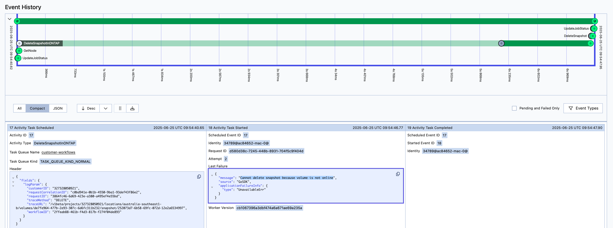
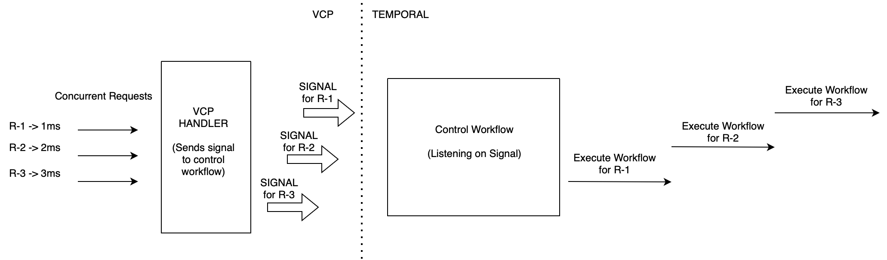
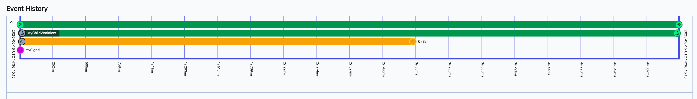
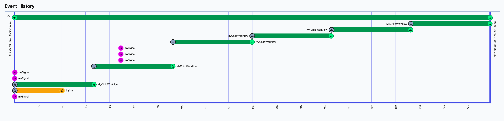
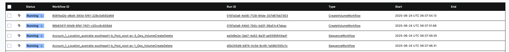
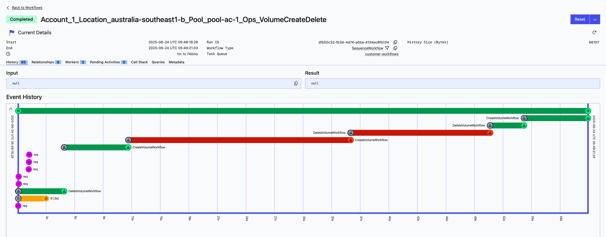

# VSA Queueing Mechanism

## Problem Statement

Certain flows in VSA interact & try to change common resources. For example, CREATE VOLUME & DELETE VOLUME both try to change the common resource, i.e., host group/i-group. The call to these flows can come almost concurrently. To avoid an unexpected outcome, such calls need to be executed in a sequential manner. Hence, we need a queueing mechanism in VSA.

## Requirements

1. Need to have a queue-like mechanism using Temporal provided functionalities, i.e., the overhead of managing a queue shouldn't lie on the VCP side but instead be propagated to Temporal.

2. Need to have clear categories defined for which calls need to be converted from parallel to sequential. Some of the possible options are listed below:
   - **Resource Level** - For a particular resource (e.g., all volume related calls for a specific pool should run sequentially)
   - **Customer Level** - For a particular customer (e.g., customer with ID - user123). Since we don't have multi-tenancy in VSA, this option might not be required.
   - **Flow Level** - For entire flows (e.g., all Volume Create/Delete Flows)

3. Flows which are allowed to run in parallel (e.g., Create Pool) should not be affected & continue to run in parallel.

4. Need to have a simple, easy-to-use interface which the developer can import & use whenever sequential execution is required.

## Resource Interactions in VSA

### For Different Pool Calls

Sequential Execution/Queueing is **not required** since 2 or more different pools are independent of each other.

### For Same Pool Calls

| Concurrent Operation 1 | Concurrent Operation 2 | Queueing Pros | Queueing Cons | Comments | Enable Queueing |
|------------------------|------------------------|---------------|---------------|----------|-----------------|
| CREATE | CREATE | - | - | The first call should pass. The subsequent calls will fail, since we don't allow same name pool creation. | **NO** |
| CREATE | UPDATE | No calls are discarded. Once CREATE Pool goes through, UPDATE pool will be picked up next automatically. | CREATE Pool is a long running operation. The UPDATE Pool call will be waiting for long duration for it to complete. | Pre-validation check can be used to handle this | **NO** |
| CREATE | DELETE | No calls are discarded. Once CREATE Pool goes through, DELETE pool will be picked up next automatically. | CREATE Pool is a long running operation. The DELETE Pool call will be waiting for long duration for it to complete. | Pre-validation check can be used to handle this | **NO** |
| UPDATE | UPDATE | No calls are discarded. Both UPDATE calls are taken up sequentially | UPDATE Pool is a long running operation. The subsequent UPDATE call will be waiting for long duration for it to complete. | As per current implementation, the subsequent calls are failed, since resource is already marked as UPDATING. We can handle it in the next phase by incorporating the logic to identify the delta & update accordingly. | **NO** |
| UPDATE | DELETE | No calls are discarded. Once UPDATE Pool goes through, DELETE pool will be picked up next automatically. | UPDATE Pool is a long running operation. The DELETE Pool call will be waiting for long duration for it to complete. | Pre-validation check can be used to handle this. Can be discussed further for Force Stop on Update → Delete | **NO** |
| DELETE | UPDATE | - | - | Pre-validation check can be used to handle this. The first call should pass. The subsequent calls will fail, since resource is already marked for deletion. | **NO** |

### For Different Volume Calls

| Concurrent Operation 1 | Concurrent Operation 2 | Queueing Pros | Queueing Cons | Comments | Enable Queueing |
|------------------------|------------------------|---------------|---------------|----------|-----------------|
| CREATE | CREATE | - | - | Both calls will go sequentially as CREATE & DELETE flow is sequential. | **YES** |
| CREATE | UPDATE | - | - | Both calls can go in parallel. | **NO** |
| CREATE | DELETE | No calls are discarded. Once CREATE volume goes through, DELETE volume will be picked up next automatically. | The CREATE & DELETE call only possesses a problem if it's the first volume CREATE & last volume DELETE. Since they both try to change the common resource, i.e., host group. Queueing the in-between calls will increase waiting time. | Since volume creation is short time taking operation, we can live with queueing. Also, getting 20 or more volume call concurrently is something that is not observed practically. Hence we can live with the few in-between calls getting queued. | **YES** |
| UPDATE | UPDATE | - | - | Both calls can go in parallel. | **NO** |
| UPDATE | CREATE | - | - | Both calls can go in parallel. | **NO** |
| UPDATE | DELETE | - | - | Both calls can go in parallel. | **NO** |
| DELETE | DELETE | - | - | Both calls will go sequentially as CREATE & DELETE flow is sequential. | **YES** |
| DELETE | CREATE | No calls are discarded. Once DELETE volume goes through, CREATE volume will be picked up next automatically. | The CREATE & DELETE call only possesses a problem if it's the first volume CREATE & last volume DELETE. Since they both try to change the common resource, i.e., host group. Queueing the in-between calls will increase waiting time. | Since volume creation is short time taking operation, we can live with queueing. Also, getting 20 or more volume call concurrently is something that is not observed practically. Hence we can live with the few in-between calls getting queued. | **YES** |
| DELETE | UPDATE | - | - | Both calls can go in parallel. | **NO** |

### For Same Volume Calls

| Concurrent Operation 1 | Concurrent Operation 2 | Queueing Pros | Queueing Cons | Comments | Enable Queueing |
|------------------------|------------------------|---------------|---------------|----------|-----------------|
| CREATE | CREATE | - | - | API Calls are idempotent. As per above table decisions for different volume calls, it will automatically go sequentially. | **NO** |
| CREATE | UPDATE | No calls are discarded. They are processed in the order they arrive. | - | This can be blocked from the code itself, since UPDATE should not be allowed on the resource if its still in CREATING state | **NO** |
| CREATE | DELETE | No calls are discarded. Once CREATE volume goes through, DELETE volume will be picked up next automatically | - | Can be handled using a resource transitioning check. As per above table decisions for different volume calls, it will automatically go sequentially. | **NO** |
| UPDATE | UPDATE | We don't want to discard requests, we can enable queuing for such back to back update operations. | - | As per current implementation, if resource is already marked as UPDATING, the subsequent calls return the jobID for the first one. No queueing required, calls should be blocked | **NO** |
| UPDATE | DELETE | No calls are discarded. Once UPDATE volume goes through, DELETE volume will be picked up next automatically | - | We need to block it from the code itself, if required. As per current implementation, calls are not being blocked. | **NO** |
| DELETE | UPDATE | - | - | We need to block it from the code itself. | **NO** |

### For Pool Calls & Volume Calls Within That Pool

| Pool Call | Volume Call | Queueing Pros | Queueing Cons | Comments | Enable Queueing |
|-----------|-------------|---------------|---------------|----------|-----------------|
| CREATE | CREATE | No calls are discarded. Once CREATE pool goes through, CREATE volume will be picked up next automatically. | CREATE Pool is a long running operation. The subsequent CREATE volume call will be waiting for long duration for it to complete. | Should be handled it from the code itself. | **NO** |
| UPDATE | UPDATE | Pool Update can include size/specification updates, which will indirectly affect volume updates | - | Currently, we are not having such checks, both at SDE/VCP level. For customer triggered update, block the call. For admin triggered update, we have to queue | **PARTIAL** |
| UPDATE | CREATE | Pool Update can include size/specification updates, which might indirectly affect new volume create | - | For customer triggered update, block the call. For admin triggered update, we have to queue | **PARTIAL** |
| UPDATE | DELETE | - | - | For customer triggered update, block the call. For admin triggered update, we have to queue | **PARTIAL** |
| DELETE | DELETE | - | - | Pool DELETE already has a check in place to check active volumes. If present, it returns back with error. | **NO** |
| DELETE | CREATE | - | - | We need to block it from the code itself, if required. | **NO** |
| DELETE | UPDATE | - | - | Pool DELETE already has a check in place to check active volumes. If present, it returns back with error. | **NO** |

| Volume Call | Pool Call | Queueing Pros | Queueing Cons | Comments | Enable Queueing |
|-------------|-----------|---------------|---------------|----------|-----------------|
| CREATE | UPDATE | No calls are discarded. Once CREATE volume goes through, UPDATE pool will be picked up next automatically. | - | We can have retry mechanism in volume flow | **NO** |
| CREATE | DELETE | No calls are discarded. Once CREATE volume goes through, DELETE pool will be picked up next automatically. | - | We need to block it from the code itself, if required. | **NO** |
| UPDATE | UPDATE | No calls are discarded. Once UPDATE volume goes through, UPDATE pool will be picked up next automatically. | - | We can have retry mechanism in volume flow | **NO** |
| UPDATE | DELETE | No calls are discarded. Once UPDATE volume goes through, DELETE pool will be picked up next automatically. | - | Pool DELETE already has a check in place to check active volumes. | **NO** |
| DELETE | DELETE | No calls are discarded. Once DELETE volume goes through, DELETE pool will be picked up next automatically. | - | Pool DELETE already has a check in place to check active volumes. | **NO** |
| DELETE | UPDATE | - | - | We can have retry mechanism in volume flow | **NO** |

### For Snapshot Calls

- **For Snapshot Calls for Different Volumes** - Sequential Execution/Queueing is **not required** since snapshots for 2 or more different volumes are independent of each other.

- **For Different Snapshot Calls Within a Volume** - Sequential Execution/Queueing is **not required** since 2 or more different snapshots are independent of each other within a volume.

- **For Same Snapshot Calls Within a Volume** - Sequential Execution/Queueing is **not required** since at per snapshot level, we don't allow any complex operation which needs queueing.

#### Tested Scenarios

Tested the DELETE snapshot & DELETE volume scenario. Below are the results (tested in multiple iterations):

**Case 1** - Snapshot DELETE call followed by Volume DELETE call
- **Observation**: Both calls are going through in parallel

**Case 2** - Volume DELETE call followed by Snapshot DELETE call
- **Observation**: On 1st attempt, DeleteSnapshotInONTAP fails with error - "Cannot delete snapshot because volume is not online". On 2nd retry attempt for the activity, it passes.
- Temporal activity retry mechanism is indirectly taking care of it, hence no queueing required

### Decision Options

As we can see above, there are certain complex resource interactions currently in VSA & it will be an increasing list. Hence we need to make a decision on how we want to proceed with queuing. Below are the possible options:

- **Option 1**: Implementing queuing for child flows for a particular parent resource. For eg, we can take pool acting as the parent resource & have all volume related flows sequential. Another example could be, Volume acting as parent resource & all snapshot flows for that particular volume sequential.

- **Option 2**: Implementing queuing for specific flows/scenarios. For eg, we only queue the first volume create & last volume delete calls for a pool, not the in-between volume related calls. The major catch in this approach is that we will need a separate code logic for queue insertion, i.e., which calls should go into the queue, which shouldn't. Another approach could be trying to limit such scenarios from code itself.

## Timeline

We will be implementing the queue related changes in phases and have an incremental solution.

### Phase 1

This phase will contain the initial queuing changes that we will go in VSA.

This will include **Option 1** as defined above.

The flows that we will be taking care of will be:
- Volume Related Flows
- Pool CREATE/DELETE Related Flows

### Next Phase(s)

- This phase will start with a deep dive on **Option 2** as defined above, mostly to check its feasibility first.
- If it seems unfeasible, we will be discarding it & continuing with Option 1.
- We will take up any additional enhancement or fixes required as per the feedback from phase 1.
- Take up the other flows for which queuing is required.

## Temporal Concepts Used

### Parent-Child Workflow

In Temporal, a parent-child workflow relationship allows a workflow (the parent) to start and manage another workflow (the child). This enables hierarchical workflow structures for complex business processes.

### Signals

In Temporal, signals are asynchronous messages sent to a running workflow to update its state or influence its behavior. They are a way to communicate with a workflow from external sources, like clients or other workflows, without waiting for a response. Temporal ensures that the signals get executed in the order they are sent.

### SignalWithStartWorkflow

In Temporal, `SignalWithStartWorkflow` is an API call that allows you to both start a new workflow execution and send a signal to it in a single, atomic operation. If a workflow with the specified ID is already running, the signal is delivered to that existing workflow. If no workflow with that ID is running, a new workflow execution is started, and the signal is delivered to the newly created workflow. This mechanism ensures that signals are not lost and are delivered either to an existing or newly started workflow.

### Future

In Temporal, a Future represents the eventual result of an asynchronous operation, such as an Activity or another Workflow execution.

### Workflow Timer

In Temporal, a workflow timer returns immediately and the future becomes ready after the specified duration.

### Selector

In Temporal, Selectors are similar and act as a replacement for Go Selectors. They can block on sending and receiving from Channels but as a bonus can listen on Future deferred work.

## Flow Diagram

### High Level View



### Zoomed-In View for a Particular Concurrency Case



## Approach

We will be using a **Control Workflow** for our use-case. All concurrent requests will trigger signals to a particular instance of control workflow.

The control workflow will be continuously listening to the signals and will ensure the signal requests coming to it should be executed sequentially.

Since Temporal ensures signals are received in the order they are sent, our control workflow will receive them in the correct order.

The control workflow will use the concept of child workflows to execute the actual workflows received as signal. The execution of these child workflows will be a blocking call, hence ensuring sequential execution.

To ensure that the signal requests go to the same instance of control workflow, we will be using a pre-defined workflowID. For example, assuming we are doing resource level separation, if 3 concurrent volume update requests for poolID - "pool123" come in, we will be starting our instance of control workflow with a workflowID like, `"Pool_Volume_Ops_pool123"`. This way all volume update operations for "pool123" will go to the same instance of the control workflow.

For sending signal to the control workflow we will be using `SignalWithStartWorkflow` asynchronous call. This will ensure that the signal requests go to the same running workflow, if any. Otherwise, it will start a new instance of control workflow & send the signal.

Now, as for the signal payload, it will contain all the information needed to run the actual workflow.

The control workflow will also be using a temporal timer logic to avoid the infinite execution of the control workflow. Though there is no extra overhead for a long running workflow in temporal, we want to avoid having multiple continuous running workflows. Anyways, `SignalWithStartWorkflow` call will take care of starting the control workflow if not already running.

Another good thing about temporal timers is that it doesn't abruptly close the workflow. The running signal requests are given priority over the timer closing the workflow, which is perfect for our use-case. The control workflow will only get closed if there is no signal being processed.

## How to Choose Control Workflow ID for Your Use Case

1. Control Workflow ID will define what needs to be sequenced & what not.

2. Your use case should have a clear definition of what type of calls & on what resource needs to be sequenced.

3. It's not a must, but having a parent-child type relationship defined, can make the process easy & clear to understand.

4. Ensure the calls you have chosen are not already part of some other control workflow, since two calls cannot run in two different instances of control workflow.

5. If your call is already part of some other control workflow (say, A → B) and you want it to be sequenced with another (say, B → C). The only option you have is to club all under a common control workflow (A → B → C), because of the same reason stated in above point.

## Proof of Concept (POC)

### Sample Control Workflow

```go
// ControlWorkflow is a workflow that listens for signals and executes child workflows sequentially.
func ControlWorkflow(ctx workflow.Context) error {
    logger := workflow.GetLogger(ctx)
    exitFlag := false
    signalChan := workflow.GetSignalChannel(ctx, Signal)
    
    // This timer is used to check if the workflow should exit, if sitting idle.
    timeout := workflow.NewTimer(ctx, 3*time.Second)
    
    for {
        selector := workflow.NewSelector(ctx)
        
        selector.AddReceive(signalChan, func(c workflow.ReceiveChannel, more bool) {
            var signalWf SignalWorkflowParams
            c.Receive(ctx, &signalWf)
            ctx = workflow.WithChildOptions(ctx, signalWf.Options)
            
            if err := workflow.ExecuteChildWorkflow(ctx, signalWf.Function, signalWf.Args...).Get(ctx, nil); err != nil {
                logger.Error("Failed to execute child workflow", "error", err)
                return
            }
        })
        
        selector.AddFuture(timeout, func(f workflow.Future) {
            exitFlag = true
            return
        })
        
        selector.Select(ctx)
        
        if exitFlag {
            // If the exit flag is set, we check if there are any pending signals.
            // The Selector selects any case randomly if multiple cases are ready.
            // Hence, we need to check if there are any pending signals before exiting to handle the random case.
            if selector.HasPending() {
                continue
            }
            
            // Exit the workflow.
            // This will ensure the workflow is not continuously waiting for signals.
            // This will also stop workflow from exceeding the maximum event history size.
            logger.Info("Current value reached threshold, exiting workflow")
            break
        }
    }
    
    return nil
}
```

### Execute Workflow Sequentially Function

```go
var ExecuteWorkflowSeq = _executeWorkflowSequentially

func _executeWorkflowSequentially(
    temporal client.Client,
    ctx context.Context,
    sequenceWfOptions client.StartWorkflowOptions,
    wfFunction interface{},
    wfOptions workflow.ChildWorkflowOptions,
    wfArgs ...interface{},
) error {
    if err := validateWorkflowParams(sequenceWfOptions.ID, wfOptions); err != nil {
        return customerrors.New(fmt.Sprintf("Invalid parameters for sequence workflow execution, error: %v", err))
    }
    
    // Defaulting to customer task queue for the workflows, if not provided.
    if wfOptions.TaskQueue == "" {
        wfOptions.TaskQueue = workflowengine.CustomerTaskQueue
    }
    if sequenceWfOptions.TaskQueue == "" {
        sequenceWfOptions.TaskQueue = workflowengine.CustomerTaskQueue
    }
    
    // SignalWithStartWorkflow is used to signal the sequence workflow if running.
    // If the sequence workflow is not running, it will start a new instance with the provided options and signal it.
    _, err := temporal.SignalWithStartWorkflow(
        ctx,
        sequenceWfOptions.ID,
        Signal,
        SignalWorkflowParams{
            Function: getWorkflowName(wfFunction),
            Args:     wfArgs,
            Options:  wfOptions,
        },
        sequenceWfOptions,
        SequenceWorkflow,
    )
    if err != nil {
        return err
    }
    
    return nil
}

func ExecuteWorkflowSequentially(
    temporal client.Client,
    ctx context.Context,
    sequenceWfOptions client.StartWorkflowOptions,
    wfFunction interface{},
    wfOptions workflow.ChildWorkflowOptions,
    wfArgs ...interface{},
) error {
    return ExecuteWorkflowSeq(temporal, ctx, sequenceWfOptions, wfFunction, wfOptions, wfArgs...)
}
```

## Consumption

### Existing Consumption (for parallel run)

```go
_, err = temporal.ExecuteWorkflow(ctx,
    client.StartWorkflowOptions{
        TaskQueue:             workflowengine.CustomerTaskQueue,
        ID:                    createdJob.WorkflowID,
        WorkflowIDReusePolicy: enums.WORKFLOW_ID_REUSE_POLICY_REJECT_DUPLICATE,
    },
    workflows.CreateVolumeWorkflow,
    params,
    dbVolume,
)
```

### New Consumption (for sequential run)

```go
// controlWorkflowID defines the workflow ID for the control workflow
// which runs all volume CREATE & DELETE operation calls for a specific pool sequentially.
controlWorkflowID := fmt.Sprintf(
    workflows.VolumeCreateDeleteSeq,
    dbVolume.Account.ID,
    location,
    dbVolume.Pool.Name,
)

err = workflows.ExecuteWorkflowSequentially(
    temporal,
    ctx,
    client.StartWorkflowOptions{
        TaskQueue: workflowengine.CustomerTaskQueue,
        ID:        controlWorkflowID,
    },
    workflows.CreateVolumeWorkflow,
    workflow.ChildWorkflowOptions{
        TaskQueue:             workflowengine.CustomerTaskQueue,
        WorkflowID:            createdJob.WorkflowID,
        WorkflowIDReusePolicy: enums.WORKFLOW_ID_REUSE_POLICY_REJECT_DUPLICATE,
    },
    params,
    dbVolume,
)
```

## Temporal Runs

### For CREATE & DELETE VOLUME Workflows

Executed multiple calls for CREATE & DELETE volume operations concurrently.



Executed multiple calls for CREATE & DELETE volume operations concurrently, with some failing calls.



For different pools, CREATE & DELETE volume operations running in parallel:



### Other Sample Workflow Runs



---

**Source:** [Confluence - VSA Queueing Mechanism](https://confluence.ngage.netapp.com/spaces/VSCP/pages/1205028452/VSA+Queueing+Mechanism)
