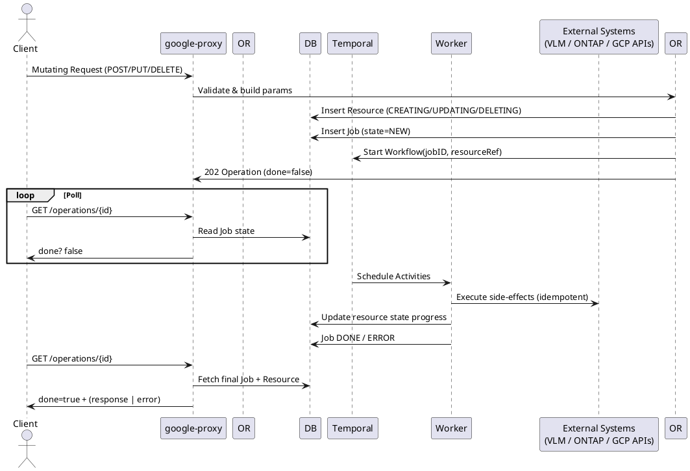
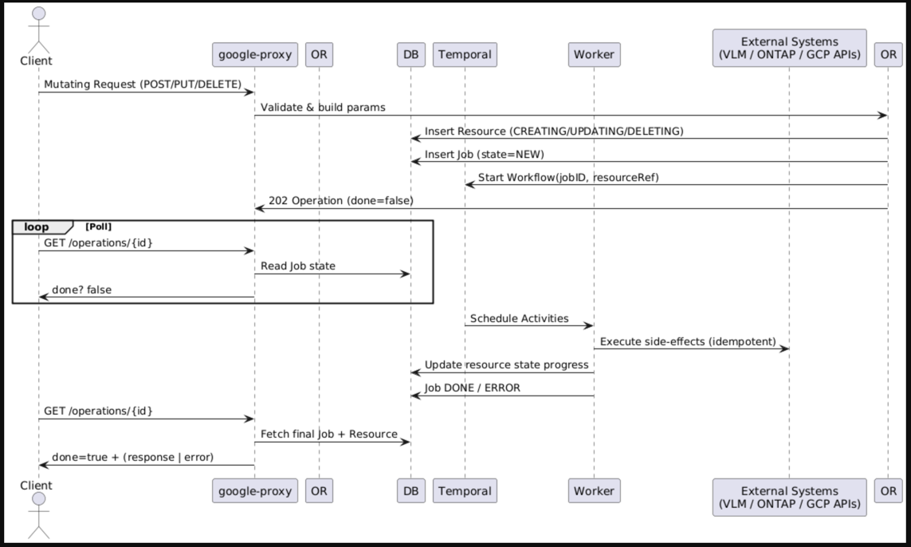

# Generic LRO Flow Diagram

Date: 2025-10-02

## Status
Accepted

## Context

Many mutating API calls in the VSA Control Plane are implemented as long-running operations (LROs). We need a single, canonical, high-level sequence diagram and an operational guide that per-resource docs can reference. The goal is to make lifecycle, polling, and error handling consistent across all resources and services.

## Decision

Maintain one reusable high-level "Request → Operation → Workflow → Activities" sequence and include it by reference from per-resource guides. Per-resource documentation should only document the activity blocks that differ.

- Use Temporal workflows to orchestrate side-effects.
- Persist a Job row in the database as the single source of truth for operation state and metadata.
- API returns 202 Accepted with an Operation resource (done=false) pointing to the Job/workflow ID.
- Clients poll GET /operations/{id} to determine final status; operations are backed by durable workflows in Temporal.

## Diagram

One reusable high-level sequence for all mutating API calls producing Long Running Operations (LROs).

## Rationale

- Centralizes lifecycle management: separating API surface from workflow lifecycle provides a single source of truth (Job row) for operation state.
- Uses Temporal for durable retries, visibility, and orchestration of multi-step operations.
- Idempotency tokens and idempotent activities prevent duplicated side-effects on retries.
- Having a single canonical diagram reduces documentation duplication and keeps behavior consistent across resources.

## Error taxonomy and mapping

This project uses a centralized error taxonomy. Link error code ranges to subsystems to make operational diagnosis straightforward.

- 1000-1999: Workflow and orchestration errors (core/orchestrator/)
- 2000-2999: Database and persistence errors (database/)
- 3000-3999: Hyperscaler / Cloud provider errors (hyperscaler/, google-proxy/)
- 4000-4999: VSA Cluster / ONTAP integration errors (core/vsa/, ontap-proxy/)
- 5000-5999: ONTAP-specific errors and data-plane failures

For implementation details and full mapping see: core/errors/README.md

## Admin / internal endpoints (ops-only)

Document any internal or administrative endpoints separately and restrict them to ops-only consumers. Typical endpoints include:

- /admin/health — Liveness and readiness checks
- /admin/metrics — Prometheus scrape target
- /admin/debug — Debug hooks (trace dumps, internal stats) guarded by RBAC
- /internal/operations/{id}/debug — Extended diagnostics for a specific operation (job)

Ensure these endpoints are listed in the service README and are restricted to internal networks or authenticated operators only.

## Client polling examples

Example: create a resource and poll the operation until completion.

1) Start a mutating request (returns 202 with operation id)

curl -v -X POST https://<proxy>/v1/projects/
/locations/<r>/volumes \
  -H "Authorization: Bearer $ACCESS_TOKEN" \
  -H "Content-Type: application/json" \
  -d '{"name":"vol1","size_gb":1024}'

Response (202):
{
  "name": "projects/.../operations/op-123",
  "metadata": {"job_id":"op-123"},
  "done": false
}

2) Poll the operation

curl -v -X GET https://<proxy>/v1/projects/
/locations/<r>/operations/op-123 \
  -H "Authorization: Bearer $ACCESS_TOKEN"

- If still running: { "name": ".../operations/op-123", "done": false }
- If succeeded: { "name": "...", "done": true, "response": { /* resource */ } }
- If failed: { "name": "...", "done": true, "error": { "code": 4000, "message": "..." } }

Recommendations for clients:
- Back off with jitter when polling (exponential backoff).
- Support Idempotency-Key header for create operations to deduplicate retries.

## ADR summary: LRO Design & Idempotency

Decision summary:
- Use a database-backed Job record plus Temporal workflows to implement long-running mutating operations.
- Deduplication: support Idempotency-Key header; server-side lookup prevents duplicate Jobs for identical client requests.
- Activities must be idempotent and use safe update semantics in DB and external systems.

Implications:
- Activities must be idempotent and retryable.
- Cloud-specific calls must be isolated behind hyperscaler/provider interfaces.
- Error codes emitted by activities must map to the centralized taxonomy above to aid support and monitoring.

## Where to extend this guide

- Put per-resource PlantUML fragments in doc/architecture/resource-fragments/ and include them into per-resource .puml files using !include.
- Add short curl snippets in each per-resource guide showing create + poll patterns.
- Link operation error codes back to core/errors/README.md for troubleshooting and runbook mapping.

## References

- core/errors/README.md
- doc/api/architecture/lro-generic-sequence.md (canonical diagram usage and per-resource guidance)
