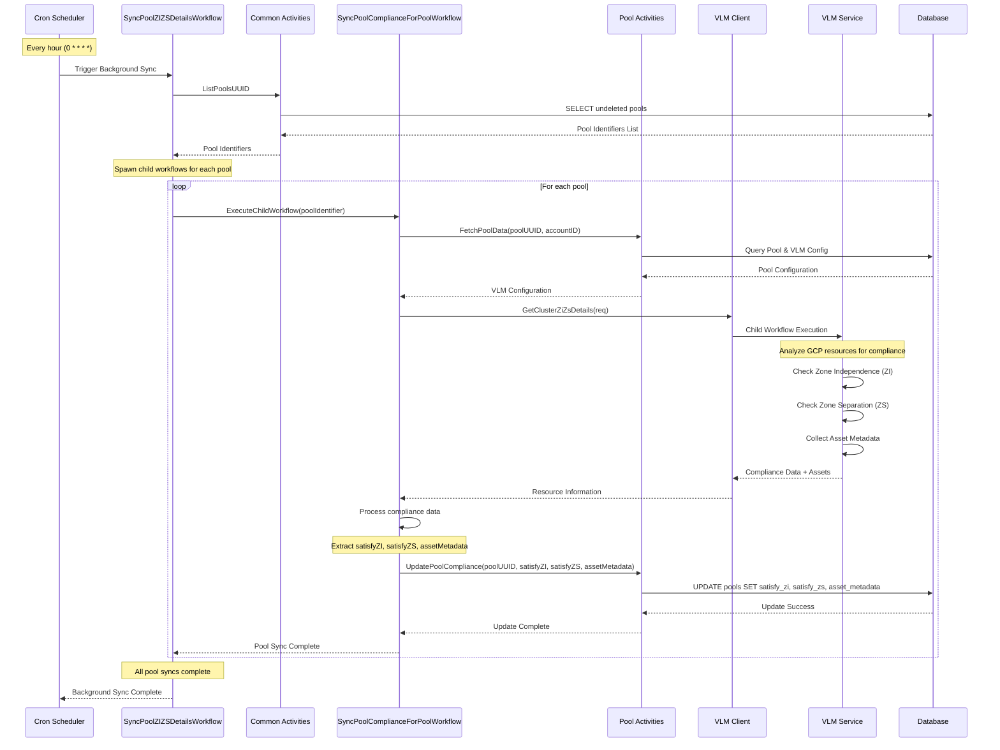
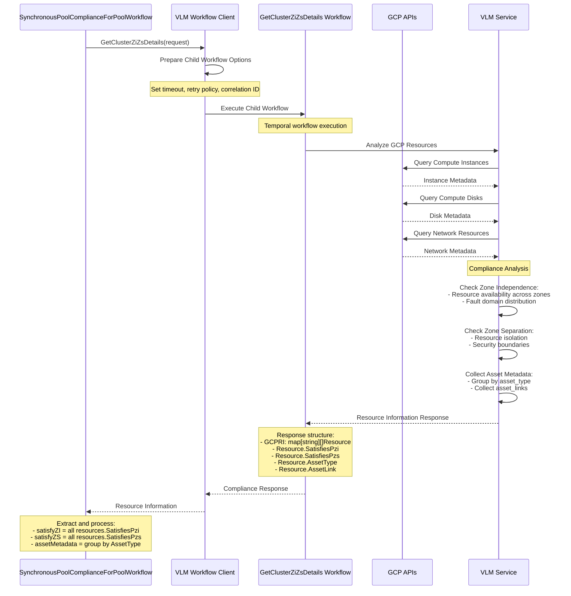
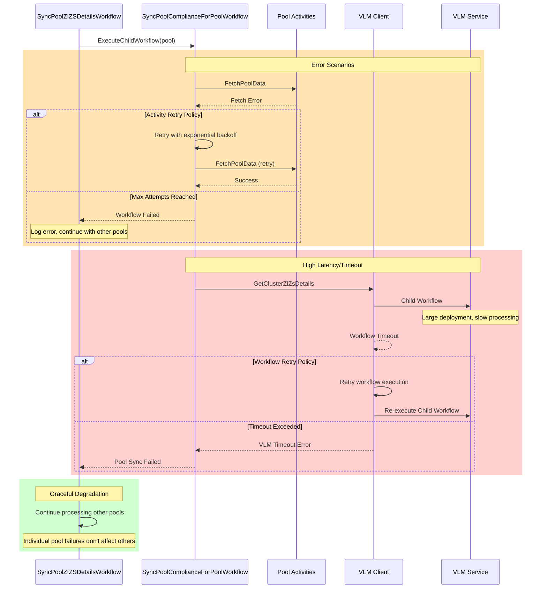

# Pool ZI/ZS Compliance Sequence Examples

This document provides sequence diagrams illustrating the key workflows for pool ZI/ZS compliance tracking.

## 1. Pool Creation with Compliance Sync Workflow

```mermaid
sequenceDiagram
    participant Client
    participant PoolWF as Pool Workflow
    participant Activities as Pool Activities
    participant ZIZSWF as ZI/ZS Compliance WF
    participant VLMClient as VLM Client
    parameter VLM as VLM Service
    participant DB as Database

    Client->>PoolWF: Create Pool Request
    PoolWF->>Activities: Execute Pool Creation Activities
    Activities->>DB: Create Pool Record
    DB-->>Activities: Pool Created
    Activities-->>PoolWF: Pool Creation Complete

    Note over PoolWF,ZIZSWF: Trigger Compliance Sync (Async)
    PoolWF->>ZIZSWF: ExecuteChildWorkflow(SyncPoolComplianceForPoolWorkflow)
    
    Note over PoolWF: Continue pool creation flow
    PoolWF->>Client: Pool Creation Response (Success)

    Note over ZIZSWF,VLM: Background compliance sync continues
    
    ZIZSWF->>Activities: FetchPoolData
    Activities->>DB: Query Pool Config
    DB-->>Activities: Pool Config
    Activities-->>ZIZSWF: VLM Config

    ZIZSWF->>VLMClient: GetClusterZiZsDetails(ProjectID, DeploymentID)
    VLMClient->>VLM: Execute Child Workflow
    
    Note over VLM: Process compliance check
    VLM-->>VLMClient: Resource Compliance Data
    VLMClient-->>ZIZSWF: Compliance Response

    ZIZSWF->>Activities: UpdatePoolCompliance(satisfyZI, satisfyZS, assetMetadata)
    Activities->>DB: Update Pool Compliance Fields
    DB-->>Activities: Update Complete
    Activities-->>ZIZSWF: Success

    Note over ZIZSWF: Workflow completes independently
```

## 2. Background Pool Compliance Sync Workflow



## 3. API Request Flow for Pool with Compliance Data

```mermaid
sequenceDiagram
    participant Client
    participant Proxy as Google Proxy
    participant CoreAPI as Core API
    participant Handler as Pool Handler
    parameter DB as Database

    Client->>Proxy: GET /pools/{poolID}
    Proxy->>CoreAPI: Forward Request
    CoreAPI->>Handler: Handle Pool Request
    
    Handler->>DB: SELECT pool with asset_metadata, satisfy_zi, satisfy_zs
    DB-->>Handler: Pool Record with Compliance Data
    
    Note over Handler: Include compliance fields in response
    Handler-->>CoreAPI: Pool Response Data
    CoreAPI-->>Proxy: Enhanced Pool Response
    Proxy-->>Client: Pool Data with ZI/ZS Compliance

    Note over Client: Client receives:<br/>- satisfies_pzi: boolean<br/>- satisfies_pzs: boolean<br/>- asset_metadata: object
```

## 4. VLM Compliance Data Processing Flow



## 5. Error Handling and Retry Flow



These sequence diagrams provide a comprehensive view of how the ZI/ZS compliance system operates across different scenarios, showing the integration points, error handling, and data flow between components.
