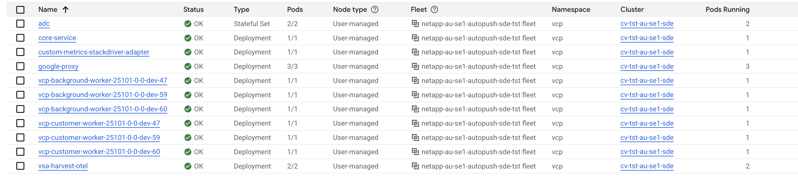
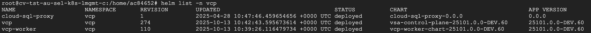
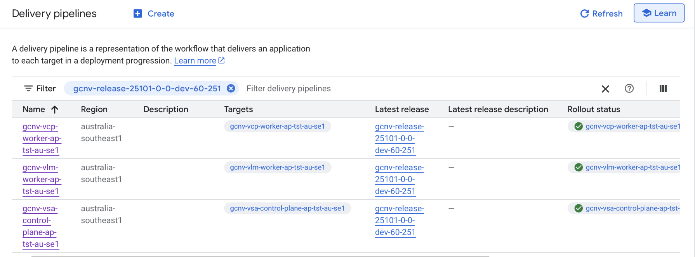
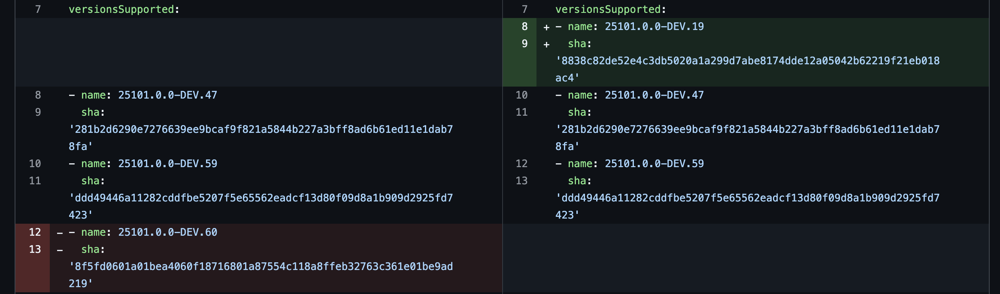
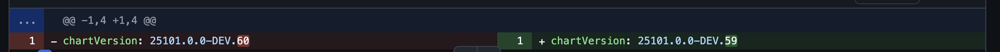
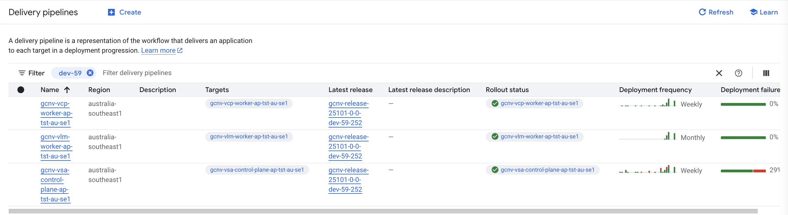
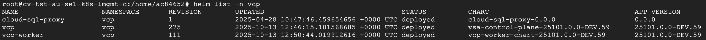
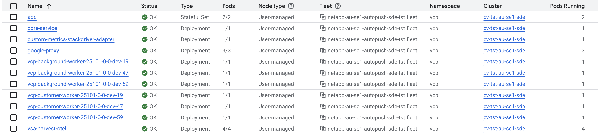

# Rollback Strategy for VSA Control Plane

## Introduction

In certain cases, there will be a need to rollback the complete VSA Control Plane. Reasons could include:

- Critical bugs are found in Post Assessment (via functional workflows or Probers) for a release.
- Performance degradations

This document outlines the end to end strategy that needs to be followed for a smooth & error free VCP Rollback. It does not includes rollback of data plane or related components.

## Pre-Rollback Preparation

1. Confirm Google Cloud Deploy VCP last stable release to rollback from engineering.
2. Inform Google SRE / Team to provide the status change / updates.
3. Ensure Google CCFE is compatible with the roll back version.
4. Validate current & rollback behavior (What's working & what's not working) over the environment before applying rollback.

5. **Review Monitoring Dashboards**

   **Control Plane SLO Dashboard** (Requires TVC access) - [https://monitoring.corp.google.com/slo?scope=borg_user%3Dnetapp-dev-jobs&granularity=DAY&slo_hidden_groupby=meta:product,meta:owning_group,meta:service_level_name&groupby_defaults=false&duration=604800&noncompliant=false&groupby=meta:product%7Cmeta:owning_group%7Cmeta:configuration_name%7Cmeta:service_level_name%7Cmeta:service_level_indicator_name%7Cmetric:location%7Cmetric:method&utc_end=1744700399&expand_slo=%3DCompliance%20Summary%2Fmeta:configuration_name%3Dprod_v2&universe=gdu](https://monitoring.corp.google.com/slo?scope=borg_user%3Dnetapp-dev-jobs&granularity=DAY&slo_hidden_groupby=meta:product,meta:owning_group,meta:service_level_name&groupby_defaults=false&duration=604800&noncompliant=false&groupby=meta:product%7Cmeta:owning_group%7Cmeta:configuration_name%7Cmeta:service_level_name%7Cmeta:service_level_indicator_name%7Cmetric:location%7Cmetric:method&utc_end=1744700399&expand_slo=%3DCompliance%20Summary%2Fmeta:configuration_name%3Dprod_v2&universe=gdu)

   

6. **Cloud Deploy Verification of current deployed setup**

   

7. **Helm List Verification of current deployed setup**

   

8. **Workloads Status Verification of current deployed setup**

9. **Notify all stakeholders of the deployment window.**

## Rollback Procedure

### We need to handle the rollback for the below listed services:

- Google-Proxy
- Core
- VCP worker
- VLM worker
- Postgres DB
- Harvest
- ADC

**Note:** Temporal is independent of the VCP rollback & need no extra work.

We will be required to raise a PR with below changes in the region's cloud deploy repo.

### Service Version Rollback

For all listed services, version needs to be rolled back by updating chart version to previous stable version.

For worker, we need to make additional changes as listed below:

### For VCP worker

We have n, n-1, n-2 versioning strategy where multiple versions run simultaneously. This ensures zero-downtime rollback by gradually shifting traffic from current version (n) to previous stable versions (n-1, n-2) while maintaining worker queue processing continuity.

We need to revert these versions to the previous stable versions. For example, as shown in below image (`cloud-deploy/vcp-worker/overrides.yaml`):



**Note:** Only the name field needs to be updated with build version. sha field will get automatically populated via github action.

### For VLM worker

For different Ontap versions, we support different vlm versions. We need to check if the version we want to rollback needs a vlm change as well.

If change is required, we need to revert back to older VLM details for its corresponding Ontap supported version.

This change will be done in below shown section (`cloud-deploy/vlm-worker/overrides.yaml`):

```yaml
ontapVersionVlmImageMappings:
  - ontapVersion: "9.17.1"
    vlmImageName: "vlm-worker"
    vlmImageTag: "R9.17.1Px_7825887"
    vlmImageDigest: "sha256:a1f1f3a9283a3ad5779069b8656b37e28219c125cb162314b837c80e7c6a1531"
  - ontapVersion: "9.18.1"
    vlmImageName: "vlm-worker"
    vlmImageTag: "R9.18.1Px_8028694"
    vlmImageDigest: "sha256:b43b5ae0d471ab668458070235d8a021b9e5cc5cbca7f8274bade66f88a49201"
  - ontapVersion: "9.18.1P2"
    vlmImageName: "vlm-worker"
    vlmImageTag: "R9.18.1x_8065561"
    vlmImageDigest: "sha256:c90b0bcb0cbf0f489812676d0a3921ec8eb15c20967d43700a6b239f360dcbef"
```



### For database rollback

For PostgreSQL, we have pre/post SQL migration scripts with versioned schema changes. We will be using the postgres auto-migrator for rollback.

This rollback of db can be controlled via some of the env variables for all databases.

We need to enable the rollback flag & set the number of migrations that needs to be rolled back for each database, using below variables (`cloud-deploy/vsa-control-plane/overrides.yaml`):

```yaml
global:
    coreConfig:
        enableDbRollback: "true"
        vcpDbPreRollbackSteps: "1"
        vcpDbPostRollbackSteps: "2"
        metricsDbPreRollbackSteps: "0"
        metricsDbPostRollbackSteps: "1"
```

**Note:** There is a flag defined, `RUN_MIGRATION_ON_START` (`runMigrationOnStart`). We need to ensure that it is set to false during rollbacks in below section of override files:

`cloud-deploy/vsa-control-plane/overrides.yaml`:

```yaml
global:
    coreConfig:
        runMigrationOnStart: false
```

`cloud-deploy/vsa-control-plane/overrides.yaml`:

```yaml
google-proxy:
    runMigrationOnStart: false
```

## Post-Rollback Verification

### Cloud Deploy Verification


### Helm List Verification


### Workloads Status Verification


### Google Prober Tests Verification

Verify that the tests run by Google Probers are successfully passing with expected result.

### DB Rollback Verification (optional, only required if db rollback was done as part of rollback)

In the Logs Explorer, put the below filter & time limit to check the db rollback logs. It should not show any failure.

```
resource.labels.container_name="vcp-dbmigrate-migrate"
```

### Review Monitoring Dashboards

- Monitoring dashboards and alerts for any outages and failures after the rollback.

- Harvest and OTel instances needs to be validated after rollback. e.g. new metrics and labels should be rolled back as well.

- Observability Dashboards for VCP and VSA: [https://console.cloud.google.com/monitoring/dashboards?project=vsa-monitoring-prod](https://console.cloud.google.com/monitoring/dashboards?project=vsa-monitoring-prod)

- Control Plane SLO Dashboard (Requires TVC access) - [https://monitoring.corp.google.com/slo?scope=borg_user%3Dnetapp-dev-jobs&granularity=DAY&slo_hidden_groupby=meta:product,meta:owning_group,meta:service_level_name&groupby_defaults=false&duration=604800&noncompliant=false&groupby=meta:product%7Cmeta:owning_group%7Cmeta:configuration_name%7Cmeta:service_level_name%7Cmeta:service_level_indicator_name%7Cmetric:location%7Cmetric:method&utc_end=1744700399&expand_slo=%3DCompliance%20Summary%2Fmeta:configuration_name%3Dprod_v2&universe=gdu](https://monitoring.corp.google.com/slo?scope=borg_user%3Dnetapp-dev-jobs&granularity=DAY&slo_hidden_groupby=meta:product,meta:owning_group,meta:service_level_name&groupby_defaults=false&duration=604800&noncompliant=false&groupby=meta:product%7Cmeta:owning_group%7Cmeta:configuration_name%7Cmeta:service_level_name%7Cmeta:service_level_indicator_name%7Cmetric:location%7Cmetric:method&utc_end=1744700399&expand_slo=%3DCompliance%20Summary%2Fmeta:configuration_name%3Dprod_v2&universe=gdu)

---

**Source:** [Confluence - Rollback Strategy for VSA Control Plane](https://confluence.ngage.netapp.com/spaces/VSCP/pages/1307654843/Rollback+Strategy+for+VSA+Control+Plane)

