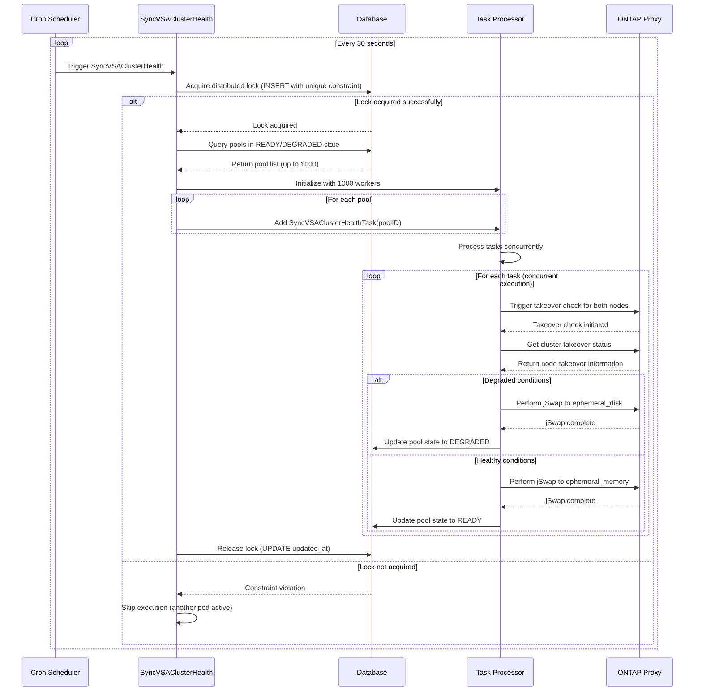

# VSA Cluster Health Status Sync (Pool DEGRADED Mode) Design


## Problem Statement
When we create a VSA cluster (ONTAP Cluster), we set up two HA pair nodes. If any of these nodes goes down, we need to inform the user that the VSA cluster is running in degraded mode, meaning one of the nodes is down. This information should be updated every 30 seconds to ensure high availability. The challenge is to monitor the health of the VSA cluster and update the database to indicate whether the VSA cluster is running in degraded mode (i.e., one of the two VMs is down).

## Requirements
High Availability: The system should update the health status every 30 seconds to ensure 99.999% availability.

Scalability: The solution should efficiently handle at least 1000 VSA clusters concurrently, with the ability to scale further as needed.

Real-Time Updates: The system should provide near real-time updates (within 30 seconds) about the health status of each VSA cluster.

## JSWAP Handling Based on Node Takeover Status

JSWAP (Journal Swap) is a feature designed to enhance data durability by dynamically switching between persistent and non-persistent write modes based on the state of High Availability (HA) in ONTAP systems. This mechanism ensures that data is protected during various HA states, particularly when storage failover is not possible. JSWAP operates by monitoring the takeover status of nodes and making real-time decisions to switch between ephemeral memory (for high write speed) and ephemeral disk (for durability) write modes. The system uses RESTAPI and CLI for querying and managing JSWAP status, ensuring timely transitions and robust data protection. In the context of VSA clusters, JSWAP helps maintain cluster health by performing necessary write mode transitions based on the takeover state of nodes, thereby ensuring the cluster operates efficiently and reliably.


## Approach

In this approach, we'll run a job every 30 seconds to sync the status of the VSA clusters. We will not use Temporal, even though it provides durability and reliability, because it may introduce more latency than a regular Go routines approach. Instead, we'll use the In-Memory Tasks Processor Framework (In-Memory Tasks Processor) to process 1000 records efficiently.

**Trigger SyncVSAClusterHealth**: Pull all pools in the READY or DEGRADED state.

**Create Task Processor**: Initialize inmemotasksprocessor.NewInMemoTasksProcessor with a buffer size of 1000 and 1000 workers.

**Add Tasks**: Iterate through all pools and add the task SyncVSAClusterHealthTask with the pool ID.

**Run Processor**: Execute the inmemotasksprocessor.NewInMemoTasksProcessor to process the 1000 SyncVSAClusterHealthTask concurrently.


## JSWAP Handling Based on Node Takeover Status

| Node Takeover State | Condition | Action | Notes |
|---------------------|-----------|--------|-------|
| **Unplanned Failover Detection** | - **Takeover State**: `not_possible`<br> - **Takeover Reason**: `Local node is already in takeover state`<br> - **Current Backing Type**: `ephemeral_memory` | Perform the jSwap to `ephemeral_disk` | Indicates an unplanned failover scenario where a node is already in takeover state. |
| **not_possible** with Critical Reasons | - **Takeover Reason**: `disabled`<br> - `Storage failover mailbox disks are in a degraded state`<br> - `Local node has encountered errors while reading the storage failover partner's mailbox disks`<br> - `Storage failover interconnect error`<br> - `Partner node halted after disabling takeover`<br> - `Mailbox disks are not healthy`<br> - `Local node missing partner disks`<br> - `Default` | Perform the jSwap to `ephemeral_disk` | Indicates critical reasons preventing takeover. |
| **in_takeover** | - **Takeover State**: `in_takeover` | Perform the jSwap to `ephemeral_disk` | Indicates that the takeover operation is complete, suggesting a node failure that necessitated the takeover. |
| **in_progress** | - **Takeover State**: `in_progress` | Perform the jSwap to `ephemeral_disk` | Indicates that a node went down and another node is taking over. |
| **failed** | - **Takeover State**: `failed` | Perform the jSwap to `ephemeral_disk` | Indicates a failed takeover state. |
| **Takeover Not Possible Check** | - **Takeover Possible**: `false` | Perform the jSwap to `ephemeral_disk` | Indicates that one of the nodes is not healthy. |
| **Both Nodes Healthy** | - **Takeover Possible**: `true` | Perform the jSwap to `ephemeral_memory` | Indicates the cluster is healthy and can use faster memory-backed storage. |
| **Default Case** | If none of the above conditions are met | No jSwap action is required. Update pool state to READY. | Default action when no specific conditions are met. |


## VSA Cluster State Updates

- When performing a jSwap to `ephemeral_disk`, update the VSA Cluster state to **DEGRADED**.
- When performing a jSwap to `ephemeral_memory`, update the VSA Cluster state to **READY**.

## Pool State Management

Pool states are updated based on cluster health assessment:

**State Transitions:**
- **READY → DEGRADED**: When cluster health issues are detected
- **DEGRADED → READY**: When cluster health is restored
- **READY → READY**: When cluster remains healthy
- **DEGRADED → DEGRADED**: When cluster remains in degraded state


## Triggering SyncVSAClusterHealthTask Every 30 Seconds

To run SyncVSAClusterHealthTask every 30 seconds, we'll use the cron library for Go: `github.com/robfig/cron`.

Here's the process:

### Create Job Records with Lock

Every 30 seconds, attempt to create job records in the table with a lock.
- If successful, run SyncVSAClusterHealthTask.
- If unsuccessful, try to update the existing job records if the updatedAt timestamp is more than 30 seconds old.
- If able to update the lock, run SyncVSAClusterHealthTask.
- If not, either not enough time has passed, or another pod holds the lock.

### Pod Startup Flow

When multiple pods (Pod A, Pod B, Pod C) start simultaneously:

#### Attempt to Create a Record

- All pods attempt to create a record with `job_type = "SYNC_VSA_CLUSTER_HEALTH_STATUS"`.
- Due to the database's unique constraint on `job_type`, only one pod succeeds.
- Other pods receive unique constraint violation errors.

#### Triggering the Task

- The winning pod immediately triggers SyncVSAClusterHealthTask.
- Losing pods skip execution and wait for the next cycle.


## Design

### Health Sync

#### High Level Design

```
                           Health Sync Architecture
                                       
    ┌─────────────┐      ┌─────────────┐      ┌─────────────┐
    │ Cron        │────► │ Health Sync │────► │ In-Memory   │
    │ Scheduler   │      │ Service     │      │ Task        │
    │ (30s)       │      │             │      │ Processor   │
    └─────────────┘      └─────────────┘      └─────────────┘
                                                      │
                                                      ▼
    ┌─────────────────────────────────────────────────────────────────┐
    │                    Health Sync Configuration                    │
    │                                                                 │
    │  • Workers: 1000 concurrent workers                             │
    │  • Buffer: 1000 task buffer size                                │
    │  • Interval: 30 seconds                                         │
    │                                                                 │
    │  Rationale for 1000 Workers/Buffer:                            │
    │  - Maximum expected VSA clusters per region: 1000              │
    │  - One worker per cluster ensures optimal processing           │
    │  - Buffer size matches worker count for efficient queuing      │
    │                                                                 │
    │  Processing Rules:                                              │
    │  - Query pools in READY/DEGRADED state                          │
    │  - Execute health check for each pool                           │
    │  - Determine jSwap action based on takeover status              │
    │  - Update pool state accordingly                                │
    └─────────────────────────────────────────────────────────────────┘
                                    │
                                    ▼
                    ┌─────────────────────────────┐
                    │ Database                    │ ── Store pool states
                    │ • Pool Table                │
                    └─────────────────────────────┘
```

The health sync system uses a cron scheduler to trigger health checks every 30 seconds. Upon trigger, the system acquires a distributed lock, queries pools that need health assessment, and processes them concurrently using the In-Memory Tasks Processor Framework. Each task queries the ONTAP cluster for takeover status and makes jSwap decisions based on the defined logic.

#### Sequence Diagram



**Sequence of Health Sync:**

1. Cron scheduler triggers SyncVSAClusterHealth every 30 seconds
2. Health sync service attempts to acquire distributed lock in database
3. If lock acquired, query all pools in READY or DEGRADED state
4. Initialize In-Memory Task Processor with 1000 workers and buffer
5. Create SyncVSAClusterHealthTask for each pool and add to processor
6. Execute tasks concurrently across worker pool
7. Each task queries ONTAP for cluster takeover status
8. Based on takeover status, determine and execute appropriate jSwap operation
9. Update pool state in database based on health assessment
10. Release distributed lock for next cycle
