# Telemetry Performance Testing Design Document

## Related Documents Index

This document is part of a series of design documents covering the Telemetry System architecture and implementation. For comprehensive understanding, refer to the following related documents:

| Document | Title | Description |
|----------|-------|-------------|
| [0003-metrics-and-billing.md](./0003-metrics-and-billing.md) | Metrics and Billing Architecture | High-level architecture document covering the complete telemetry system design, data flow, and components |
| **0014-telemetry-performance-test-design.md** | **Telemetry Performance Testing Design** | **Performance testing framework, profiling strategies, and AI-powered analysis workflow** |
| [0016-harvest-collector-system.md](./0016-harvest-collector-system.md) | Harvest-Based Collector System Design | Real-time metrics collection infrastructure using NetApp Harvest for ONTAP cluster monitoring |
| [0017-telemetry-deployer-design.md](./0017-telemetry-deployer-design.md) | Telemetry Deployer Design | Automated deployment tool for telemetry services as Google Cloud Run services with Cloud Scheduler integration |
| [0018-telemetry-low-level-design.md](./0018-telemetry-low-level-design.md) | Telemetry System Low-Level Design | Detailed implementation specifications including database schemas, job queue, aggregation algorithms, and security |

---

## Table of Contents

1. [AI Performance Analysis](#ai-performance-analysis)
2. [Overview](#overview)
3. [Architecture](#architecture)
4. [Test Data Setup](#test-data-setup)
5. [Mocking Strategy](#mocking-strategy)
6. [Performance Testing Workflow](#performance-testing-workflow)
7. [Profiling and Monitoring](#profiling-and-monitoring)
8. [Results Collection and Storage](#results-collection-and-storage)
9. [AI Analysis Workflow](#ai-analysis-workflow)
10. [Key Metrics and KPIs](#key-metrics-and-kpis)
11. [Implementation Details](#implementation-details)

## AI Performance Analysis

> **🤖 AI-Generated Analysis**: This section contains a summary of comprehensive performance analysis generated by AI agents after processing pprof profiles collected during telemetry aggregation testing. The analysis identifies critical bottlenecks, provides optimization recommendations, and quantifies expected performance improvements.
>
> **📄 Detailed Analysis Documents**:
> - **[CPU Profile Analysis](../scripts/metrics-performance/CPU_PROFILE_ANALYSIS.md)** - Detailed CPU profiling results and optimization recommendations
> - **[Memory Profile Analysis](../scripts/metrics-performance/MEMORY_PROFILE_ANALYSIS.md)** - Detailed memory allocation analysis and optimization recommendations

### Analysis Summary

The AI analysis of telemetry service performance profiles revealed significant optimization opportunities across CPU and memory usage. The analysis was performed on profiles collected during aggregation of **large-scale hydrated metrics** from **220k+ resources** (20k pools, 100k volumes, 50k backups, 50k replications).

#### Key Findings

**Memory Analysis** (Allocation Profile):
- **Total Allocations**: 1,978.06 MB (91.98% coverage)
- **Reflection Overhead**: 35% (694 MB) - GORM and JSON operations
- **Database Scanning**: 22% (438 MB) - PostgreSQL driver and GORM
- **JSON Processing**: 7.9% (156 MB) - Unmarshaling labels and metadata
- **Map Operations**: 8.4% (165 MB) - Map allocations and growth
- **Custom Aggregation**: 7.2% (143 MB) - Grouping and filtering functions

**CPU Analysis** (CPU Profile):
- **Total CPU Time**: 70.82 seconds (141.22% samples - multi-threaded)
- **Database Operations**: 50.41% (35.70s) - GORM Find operations
- **Garbage Collection**: 31.57% (22.36s) - Memory allocation pressure
- **Database Row Scanning**: 25.15% (17.81s) - Converting rows to structs
- **JSON Unmarshaling**: 9.22% (6.53s) - Data deserialization
- **Regex Operations**: 4.70% (3.33s) - String sanitization in logging

### Critical Performance Bottlenecks

#### Top 5 Critical Issues

1. **🔴 Memory: Reflection Overhead - 694 MB (35%)**
   - **Location**: `telemetry/aggregator/metrics_processor.go`, GORM operations
   - **Root Cause**: Heavy reflection usage in GORM struct scanning and JSON unmarshaling
   - **Expected Impact**: 200-300 MB reduction (10-15% of total)

2. **🔴 CPU: Database Query Operations - 50.41% (35.70s)**
   - **Location**: `database/vcp/volumes.go`, `telemetry/aggregator/metrics_processor.go`
   - **Root Cause**: N+1 queries, over-fetching, inefficient pagination
   - **Expected Impact**: 40-50% CPU reduction (20-25 seconds saved)

3. **🔴 Memory: Database String Scanning - 188.56 MB (9.5%)**
   - **Location**: `github.com/jackc/pgx/v5/pgtype` scanning operations
   - **Root Cause**: Excessive string allocations during database row scanning
   - **Expected Impact**: 50-60% reduction (~94-113 MB saved)

4. **🟠 Memory: groupMetricsByResource - 78.46 MB (3.97%)**
   - **Location**: `telemetry/aggregator/metrics_processor.go:738-752`
   - **Root Cause**: Maps and slices created without pre-allocation
   - **Expected Impact**: 50-70% reduction (30-50 MB saved)

5. **🟠 CPU: Garbage Collection Overhead - 31.57% (22.36s)**
   - **Root Cause**: Frequent allocations causing GC pressure
   - **Expected Impact**: 20-25% CPU reduction (10-12 seconds saved)

> **📖 For detailed analysis of all bottlenecks, code locations, and implementation examples, see:**
> - [CPU Profile Analysis - Detailed Breakdown](../scripts/metrics-performance/CPU_PROFILE_ANALYSIS.md)
> - [Memory Profile Analysis - Detailed Breakdown](../scripts/metrics-performance/MEMORY_PROFILE_ANALYSIS.md)

### Optimization Roadmap

#### Phase 1: Quick Wins (1-2 days)
**Expected Gain**: 50-80 MB memory, 5-7% CPU reduction
- Pre-allocate map/slice capacities in `groupMetricsByResource`
- Pre-allocate map capacity in `limitLabels`
- Filter in-place in `filterMetricsForCounterAndIntegralAggregationSorted`

#### Phase 2: Medium Effort (3-5 days)
**Expected Gain**: 100-150 MB memory, 10-15% CPU reduction
- Optimize `fetchMetricsForCounterAndIntegralAggregation` to fetch less data
- Implement cursor-based pagination
- Add object pooling for frequently allocated structs
- Optimize database query fetching (reduce columns, Select() specific fields)

#### Phase 3: Long-term (1-2 weeks)
**Expected Gain**: 200-300 MB memory, 15-20% CPU reduction
- Reduce GORM reflection usage with custom scanners
- Implement JSONB caching
- Use streaming JSON decoders for large fields
- Database query optimization (window functions, better indexes)

### Expected Overall Performance Improvements

**Memory Optimizations**:
- **Conservative Estimate**: 350-450 MB reduction (18-23% of total)
- **Optimistic Estimate**: 600-800 MB reduction (30-40% of total)

**CPU Optimizations**:
- **Total Expected Improvement**: 60-70% reduction in total execution time
- **Expected Performance**: 2.5x to 3.3x faster

### Top 5 Priority Optimizations

1. **Optimize `groupMetricsByResource`** - 30-50 MB saved, 50-70% reduction
2. **Optimize database query operations** - 20-25s saved, 40-50% CPU reduction
3. **Optimize `fetchMetricsForCounterAndIntegralAggregation`** - 40-60 MB saved
4. **Reduce reflection overhead** - 200-300 MB saved, 10-15% of total
5. **Optimize database string scanning** - 94-113 MB saved, 50-60% reduction

> **📖 Detailed Implementation Guide**: See [CPU Profile Analysis](../scripts/metrics-performance/CPU_PROFILE_ANALYSIS.md) and [Memory Profile Analysis](../scripts/metrics-performance/MEMORY_PROFILE_ANALYSIS.md) for:
> - Specific code locations with line numbers
> - Before/after code examples
> - Step-by-step implementation instructions
> - Additional optimization opportunities

### AI Analysis Methodology

The AI analysis was performed using the following workflow:

1. **Profile Collection**: pprof profiles collected during aggregation
2. **Profile Conversion**: Binary profiles converted to text format using `go tool pprof`
3. **AI Processing**: Text profiles fed into AI agents for analysis
4. **Bottleneck Identification**: AI identifies hotspots and memory allocations
5. **Recommendation Generation**: AI suggests optimizations with expected impact
6. **Prioritization**: AI categorizes optimizations by effort and impact

See [AI Analysis Workflow](#ai-analysis-workflow) section for detailed implementation.

---

## Overview

This document describes the design and implementation of performance testing for the telemetry service. The performance testing framework enables comprehensive analysis of the telemetry aggregation pipeline under realistic load conditions with large-scale test data with minimal cost and external dependencies.

### Objectives

- **Performance Analysis**: Measure CPU and memory usage during telemetry aggregation
- **Scalability Testing**: Validate system behavior with large datasets (20k pools, 100k volumes, 50k backups, 50k replications)
- **Bottleneck Identification**: Identify performance bottlenecks in the aggregation pipeline using AI-powered analysis
- **Resource Optimization**: Provide data-driven insights for resource allocation and optimization
- **AI-Powered Insights**: Generate comprehensive performance analysis reports with optimization recommendations using AI agents

### Key Features

- **Automated Profiling**: End-to-end automation from test data setup to profile collection
- **AI Analysis**: Automated analysis of pprof profiles using AI agents to identify bottlenecks and suggest optimizations
- **Comprehensive Coverage**: Captures CPU, memory, goroutine, trace, and periodic profiles
- **Cloud Integration**: Seamless upload to Google Cloud Storage for centralized analysis
- **Actionable Recommendations**: AI-generated optimization roadmap with quantified impact estimates

### Key Components

- Test Database with large-scale resource data
- Mock Metric Collectors
- Mock Service Control
- Telemetry Service with profiling enabled
- Automated Profiling Scripts
- Object Storage for results (GCS)
- AI Analysis Agents for performance insights

## Architecture

### System Architecture Diagram

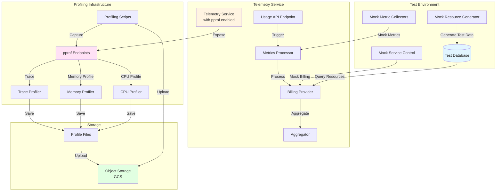

### Component Interaction Flow

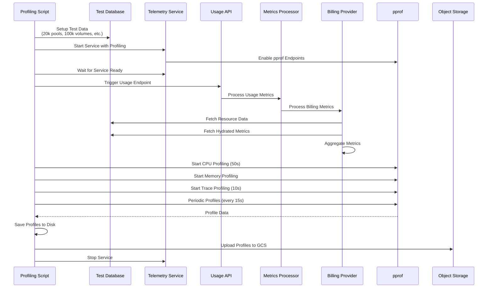

## Test Data Setup

### Database Schema and Test Data

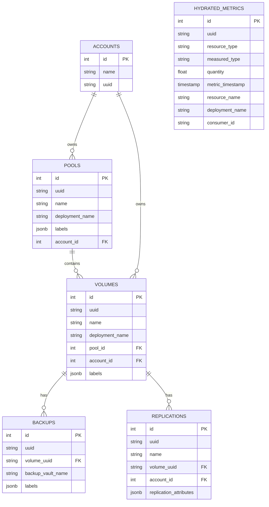

### Test Data Generation Process

```mermaid
flowchart TD
    Start([Start Test Data Generation]) --> Init[Initialize Database]
    Init --> CreateAccounts[Create Accounts]
    CreateAccounts --> CreatePools[Create 20,000 Pools]
    CreatePools --> CreateVolumes[Create 100,000 Volumes]
    CreateVolumes --> CreateBackups[Create 50,000 Backups]
    CreateBackups --> CreateReplications[Create 50,000 Replications]
    CreateReplications --> GenerateMetrics[Generate Hydrated Metrics<br/>for Past Hour]
    GenerateMetrics --> Validate[Validate Data Counts]
    Validate --> End([Test Data Ready])
    
    style CreatePools fill:#e1f5ff
    style CreateVolumes fill:#e1f5ff
    style CreateBackups fill:#e1f5ff
    style CreateReplications fill:#e1f5ff
    style GenerateMetrics fill:#fff4e1
```

### Test Data Statistics

| Resource Type | Count | Purpose |
|--------------|-------|---------|
| Pools | 20,000 | Test pool-level aggregation |
| Volumes | 100,000 | Test volume-level aggregation |
| Backups | 50,000 | Test backup billing metrics |
| Replications | 50,000 | Test replication billing metrics |
| Hydrated Metrics | ~2.2M | Metrics for past hour (1 per resource per 5 min) |

## Mocking Strategy

### Mock Architecture

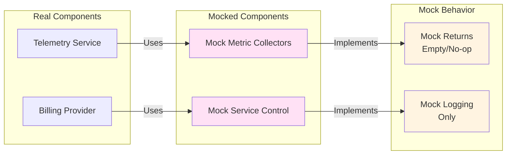

### Mock Implementation Details

#### 1. Mock Metric Collectors

**Purpose**: Prevent actual metric collection from external services during testing

**Implementation**:
- `MOCK_GOOGLE_METRICS=true` environment variable
- Mock implementations return empty results or no-op
- No actual API calls to Google Cloud Monitoring

**Benefits**:
- Eliminates external API latency
- Focuses profiling on aggregation logic
- Reduces test complexity and dependencies

#### 2. Mock Service Control

**Purpose**: Prevent actual billing data submission during testing

**Implementation**:
- Mock usage sink that logs but doesn't send
- No actual calls to Google Service Control API
- Validates data format without external dependencies

**Benefits**:
- Avoids billing charges during testing
- Faster test execution
- Isolated performance testing

## Performance Testing Workflow

### Complete Testing Workflow

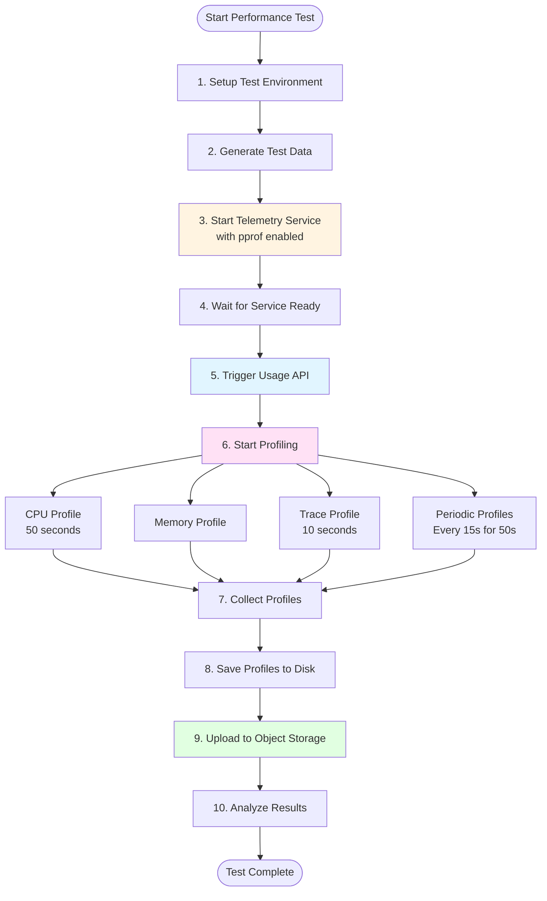

### Usage API Trigger Flow

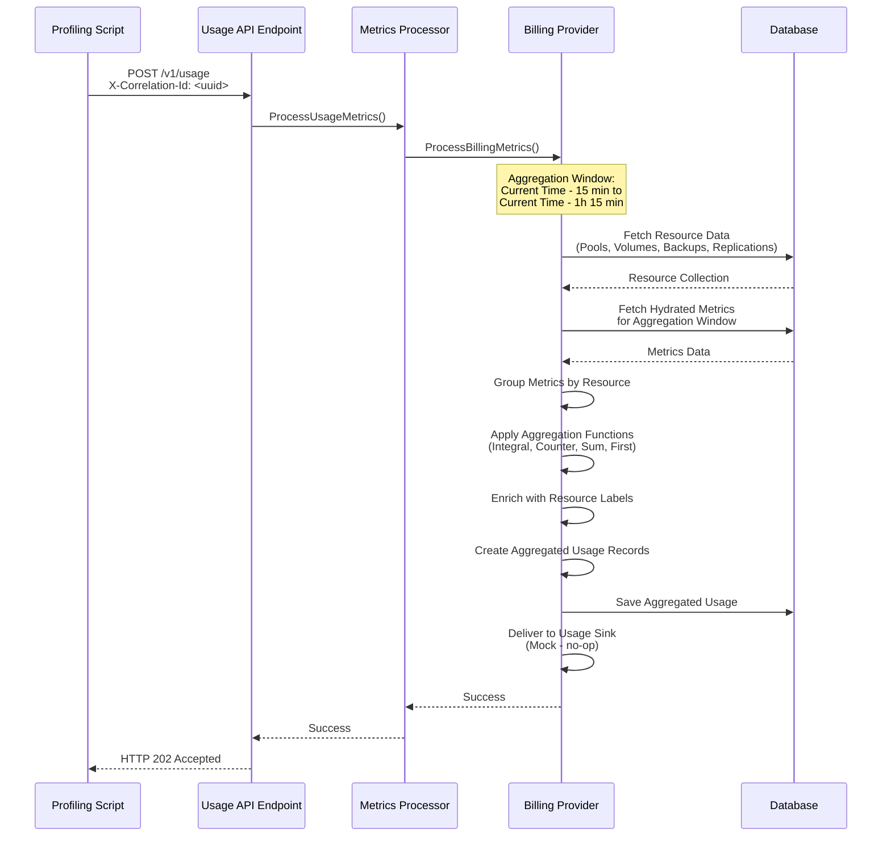

## Profiling and Monitoring

### Profiling Architecture

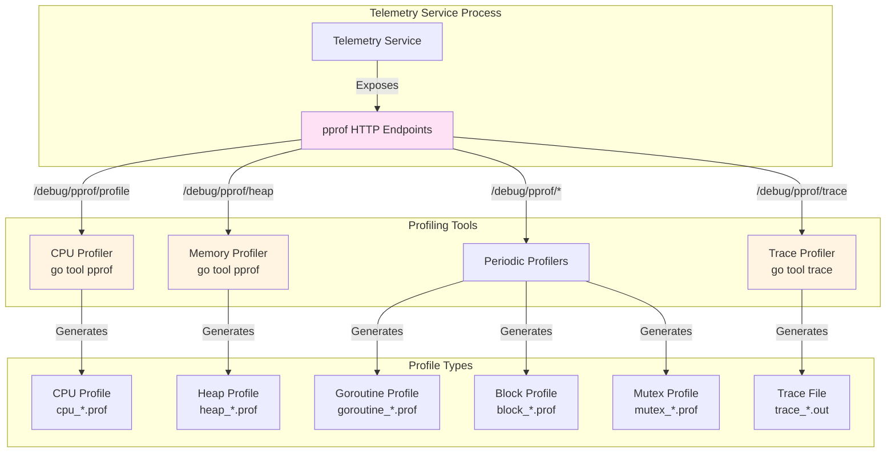

### Profiling Timeline

```mermaid
gantt
    title Profiling Timeline
    dateFormat X
    axisFormat %s
    
    section Service
    Start Service           :0, 5
    Wait for Ready          :5, 10
    Service Running         :10, 120
    
    section API
    Trigger Usage API       :15, 1
    
    section Profiling
    CPU Profile (50s)       :20, 50
    Memory Profile          :20, 2
    Trace Profile (10s)     :25, 10
    Periodic Profiles       :20, 50
    Periodic Interval 1    :20, 2
    Periodic Interval 2    :35, 2
    Periodic Interval 3    :50, 2
    Periodic Interval 4    :65, 2
    
    section Collection
    Collect Profiles        :70, 10
    Upload to Storage       :80, 10
```

### Profile Types and Metrics

| Profile Type | Duration/Interval | Purpose | Output Format |
|-------------|-------------------|---------|---------------|
| CPU Profile | 50 seconds | Identify CPU hotspots | `cpu_YYYYMMDD_HHMMSS.prof` |
| Memory/Heap Profile | Instant | Analyze memory allocation | `heap_YYYYMMDD_HHMMSS.prof` |
| Goroutine Profile | Instant | Analyze goroutine usage | `goroutine_YYYYMMDD_HHMMSS.prof` |
| Block Profile | Instant | Identify blocking operations | `block_YYYYMMDD_HHMMSS.prof` |
| Mutex Profile | Instant | Analyze mutex contention | `mutex_YYYYMMDD_HHMMSS.prof` |
| Trace Profile | 10 seconds | Detailed execution trace | `trace_YYYYMMDD_HHMMSS.out` |
| Periodic Profiles | Every 15s for 50s | Track changes over time | `*_periodic_*.prof` |

## Results Collection and Storage

### Results Storage Architecture

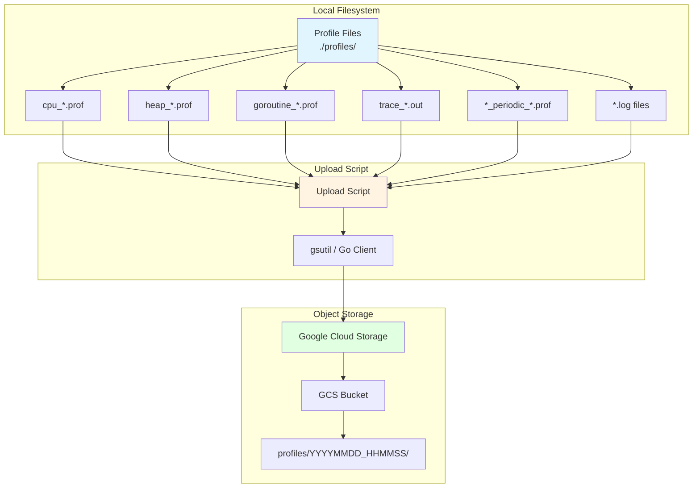

### Storage Structure

```
gs://<bucket-name>/
└── profiles/
    └── YYYYMMDD_HHMMSS/
        ├── cpu_YYYYMMDD_HHMMSS.prof
        ├── heap_YYYYMMDD_HHMMSS.prof
        ├── goroutine_YYYYMMDD_HHMMSS.prof
        ├── block_YYYYMMDD_HHMMSS.prof
        ├── mutex_YYYYMMDD_HHMMSS.prof
        ├── allocs_YYYYMMDD_HHMMSS.prof
        ├── threadcreate_YYYYMMDD_HHMMSS.prof
        ├── trace_YYYYMMDD_HHMMSS.out
        ├── cmdline_YYYYMMDD_HHMMSS.txt
        ├── symbol_YYYYMMDD_HHMMSS.txt
        ├── telemetry.log
        ├── metrics_generator.log
        └── periodic/
            ├── heap_periodic_1_YYYYMMDD_HHMMSS.prof
            ├── heap_periodic_2_YYYYMMDD_HHMMSS.prof
            ├── goroutine_periodic_1_YYYYMMDD_HHMMSS.prof
            └── ...
```

## Key Metrics and KPIs

### Performance Metrics

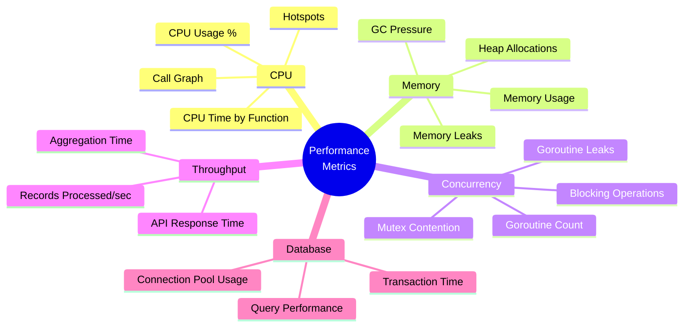

### Aggregation Performance Metrics

| Metric | Description | Target |
|--------|-------------|--------|
| Aggregation Time | Time to process all metrics | < 5 minutes |
| Records Processed | Number of aggregated records created | ~220k records |
| CPU Usage | Average CPU usage during aggregation | < 80% |
| Memory Usage | Peak memory usage | < 4GB |
| Database Query Time | Time for resource data fetch | < 30 seconds |
| Database Query Time | Time for metrics fetch | < 60 seconds |

## Implementation Details

### Environment Configuration

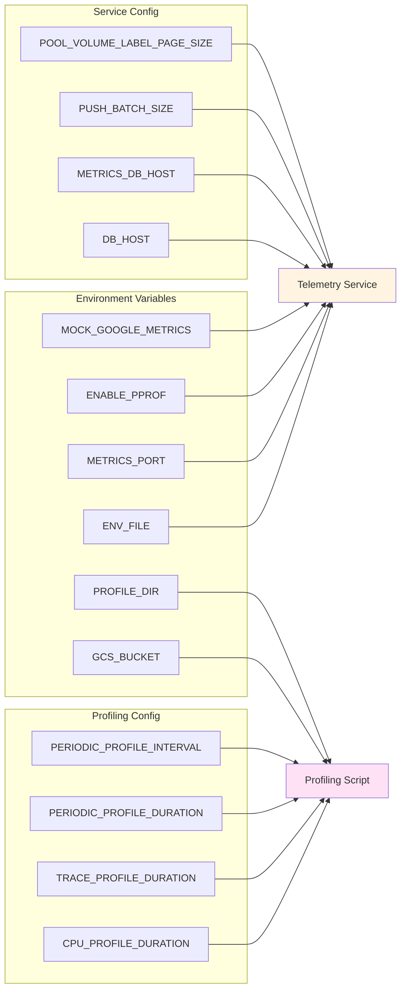

### Script Execution Flow

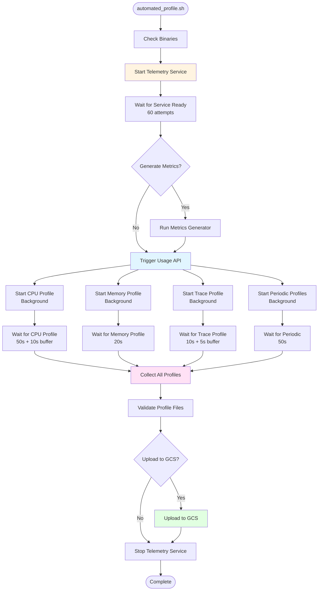

### Database Query Patterns

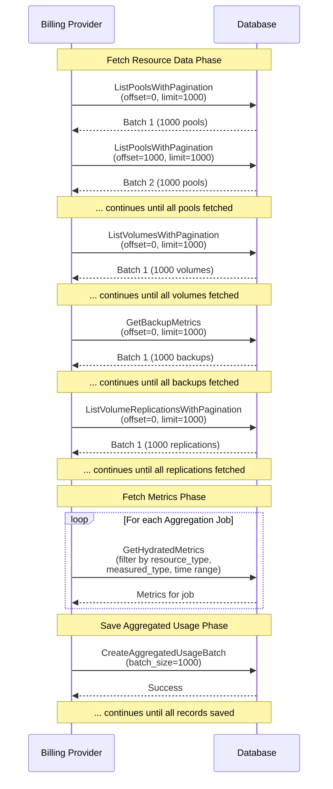

## AI Analysis Workflow

> **🤖 AI-Powered Analysis**: This section describes how pprof profiles are collected, converted to text format, and analyzed by AI agents to generate comprehensive performance insights and optimization recommendations.

### Complete AI Analysis Pipeline

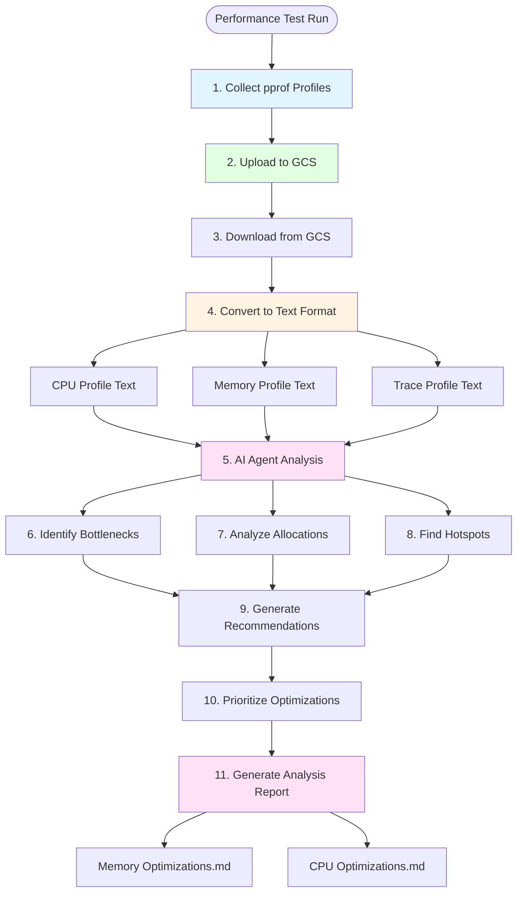

### Step-by-Step Process

#### Step 1: Profile Collection
Profiles are collected during telemetry aggregation using pprof endpoints:
- CPU profile: 50 seconds duration
- Memory/Heap profile: Instant snapshot
- Trace profile: 10 seconds duration
- Periodic profiles: Every 15 seconds for 50 seconds

#### Step 2: Upload to Object Storage
All profile files are uploaded to Google Cloud Storage (GCS) with organized structure:
```
gs://<bucket>/profiles/YYYYMMDD_HHMMSS/
├── cpu_*.prof
├── heap_*.prof
├── trace_*.out
└── periodic/
```

#### Step 3: Download from GCS
Profiles are downloaded from GCS for local analysis:
```bash
gsutil -m cp -r gs://<bucket>/profiles/YYYYMMDD_HHMMSS/ ./profiles/
```

#### Step 4: Convert to Text Format
Binary pprof profiles are converted to text format for AI analysis:

```bash
# Convert CPU profile to text
go tool pprof -top -cum -text cpu_*.prof > cpu_analysis.txt

# Convert memory profile to text (allocations)
go tool pprof -top -cum -text -alloc_space heap_*.prof > memory_allocations.txt

# Convert memory profile to text (inuse)
go tool pprof -top -cum -text -inuse_space heap_*.prof > memory_inuse.txt

# Get detailed function-level analysis
go tool pprof -list=<function> -text cpu_*.prof > cpu_functions.txt
go tool pprof -list=<function> -text -alloc_space heap_*.prof > memory_functions.txt

# Get call graph
go tool pprof -web -output=callgraph.svg cpu_*.prof
```

#### Step 5: AI Agent Analysis
Text profiles are fed into AI agents (LLM-based analysis) with prompts like:

**CPU Analysis Prompt**:
```
Analyze the following CPU profile from a Go telemetry service:
- Identify top CPU hotspots
- Find database I/O bottlenecks
- Analyze function call patterns
- Suggest optimizations with expected impact
- Prioritize by effort vs. impact
```

**Memory Analysis Prompt**:
```
Analyze the following memory profile from a Go telemetry service:
- Identify top memory allocations
- Find memory hotspots by function
- Analyze allocation patterns
- Suggest optimizations (pre-allocation, pooling, etc.)
- Quantify expected memory savings
```

#### Step 6: AI-Generated Analysis Output
AI agents generate comprehensive analysis documents:

1. **Memory Optimizations Document**:
   - Executive summary with total allocations
   - Critical issues with locations and code snippets
   - Recommendations with expected impact
   - Implementation priority (Phase 1, 2, 3)
   - Code examples for quick wins

2. **CPU Optimizations Document**:
   - Profile summary with total CPU time
   - Critical bottlenecks identified
   - Database I/O analysis
   - GC overhead analysis
   - Optimization recommendations with expected improvements

### AI Analysis Features

#### 1. Bottleneck Identification
AI analyzes profiles to identify:
- Functions consuming most CPU time
- Functions with highest memory allocations
- Database operations and I/O patterns
- Garbage collection overhead
- Lock contention and blocking operations

#### 2. Code-Level Analysis
AI provides:
- Exact file locations and line numbers
- Code snippets showing problematic patterns
- Before/after code examples
- Implementation recommendations

#### 3. Impact Quantification
AI estimates:
- Expected memory savings (MB and percentage)
- Expected CPU time reduction (seconds and percentage)
- Overall performance improvement
- Effort required for implementation

#### 4. Prioritization
AI categorizes optimizations by:
- **Priority 1**: Quick wins (1-2 days, high impact)
- **Priority 2**: Medium effort (3-5 days, medium-high impact)
- **Priority 3**: Long-term (1-2 weeks, incremental improvements)

### Example AI Analysis Output

The AI analysis generates documents like:

**Memory_Optimizations.md**:
- Executive Summary: 125.49MB total allocations
- Critical Issues: Top 5 functions (66.11% of memory)
- Recommendations: Pre-allocation, pooling, string interning
- Expected Impact: 30-45MB reduction (24-36%)

**CPU_Optimizations.md**:
- Profile Summary: 8.96 seconds total CPU time
- Critical Bottlenecks: Database I/O (41.63%)
- Recommendations: Batch processing, connection pooling, indexing
- Expected Impact: 40-60% reduction in execution time

### Benefits of AI Analysis

1. **Comprehensive Coverage**: AI analyzes all profile types simultaneously
2. **Context-Aware**: AI understands Go runtime, database patterns, and best practices
3. **Actionable Insights**: Provides specific code locations and recommendations
4. **Quantified Impact**: Estimates expected improvements with metrics
5. **Prioritized Roadmap**: Categorizes optimizations by effort and impact
6. **Code Examples**: Provides ready-to-use code snippets for implementation

### Integration with Performance Testing

The AI analysis workflow is integrated into the performance testing framework:

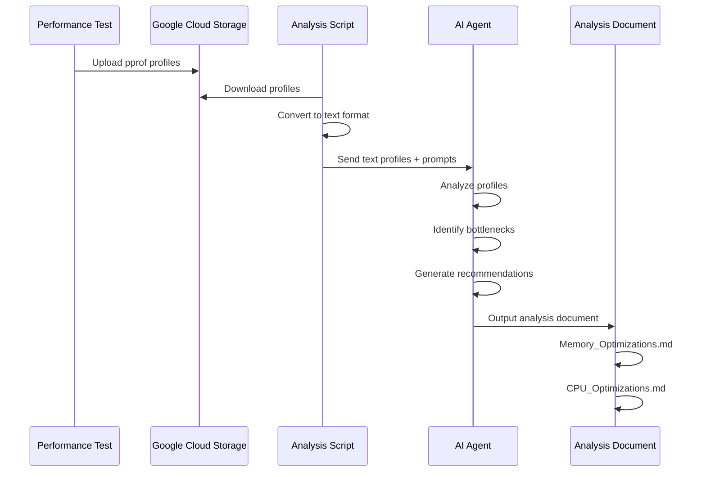

### Analysis Commands Reference

```bash
# Download profiles from GCS
gsutil -m cp -r gs://<bucket>/profiles/<timestamp>/ ./profiles/

# Convert CPU profile to text
go tool pprof -top -cum -text cpu_*.prof > cpu_analysis.txt

# Convert memory profile (allocations) to text
go tool pprof -top -cum -text -alloc_space heap_*.prof > memory_allocations.txt

# Get function-level details
go tool pprof -list=groupMetricsByResource -text -alloc_space heap_*.prof

# Interactive analysis (for manual review)
go tool pprof -http=:6060 cpu_*.prof
go tool pprof -http=:6060 heap_*.prof

# Trace analysis
go tool trace trace_*.out
```

## Analysis and Reporting

### Profile Analysis Workflow

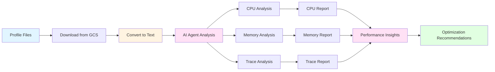

### Manual Analysis Commands

For manual analysis and verification:

```bash
# CPU Profile Analysis
go tool pprof -http=:6060 cpu_*.prof

# Memory Profile Analysis
go tool pprof -http=:6060 heap_*.prof

# Trace Analysis
go tool trace trace_*.out

# Command Line Analysis
go tool pprof -top cpu_*.prof
go tool pprof -top -cum cpu_*.prof
go tool pprof -list=<function> cpu_*.prof
```

## Best Practices

### Testing Best Practices

1. **Isolated Environment**: Use dedicated test database to avoid impacting production
2. **Consistent Data**: Use same test dataset across runs for comparison
3. **Multiple Runs**: Execute multiple test runs to identify patterns
4. **Profile Duration**: Use sufficient duration (50s+) for accurate CPU profiling
5. **Resource Monitoring**: Monitor system resources during testing
6. **Clean State**: Start with clean state for consistent results

### Profiling Best Practices

1. **Profile During Load**: Capture profiles during actual aggregation workload
2. **Multiple Profile Types**: Capture all profile types for comprehensive analysis
3. **Periodic Sampling**: Use periodic profiles to track changes over time
4. **Adequate Duration**: Ensure CPU profile duration covers full aggregation cycle
5. **Storage Organization**: Organize profiles with timestamps and metadata

## Troubleshooting

### Common Issues and Solutions

| Issue | Symptom | Solution |
|-------|---------|---------|
| Service Won't Start | Port already in use | Check for existing process, use different port |
| Profiles Not Generated | Empty profile files | Verify pprof endpoints accessible, check service logs |
| GCS Upload Fails | Authentication error | Verify GCP credentials, check bucket permissions |
| High Memory Usage | OOM errors | Increase memory limits, optimize batch sizes |
| Slow Aggregation | Timeout errors | Optimize database queries, increase timeouts |

## Conclusion

This performance testing framework provides a comprehensive solution for analyzing telemetry service performance under realistic load conditions. The design enables:

- **Scalable Testing**: Handles large datasets (220k+ resources)
- **Comprehensive Profiling**: Captures CPU, memory, and trace data
- **Automated Workflow**: End-to-end automation from setup to results
- **Cloud Integration**: Seamless upload to object storage for analysis
- **AI-Powered Analysis**: Automated bottleneck identification and optimization recommendations
- **Actionable Insights**: Detailed profiling data with quantified impact estimates

### AI Analysis Impact

The integration of AI-powered analysis transforms raw pprof profiles into actionable optimization roadmaps:

- **Identified Critical Bottlenecks**: Top 5 functions account for 66.11% of memory usage
- **Quantified Improvements**: Expected 24-36% memory reduction and 40-60% CPU time reduction
- **Prioritized Roadmap**: Categorized optimizations by effort and impact (Phase 1, 2, 3)
- **Code-Level Recommendations**: Specific file locations, code snippets, and implementation examples

The framework supports continuous performance monitoring and optimization of the telemetry aggregation pipeline, with AI analysis providing rapid insights that would otherwise require extensive manual analysis.

