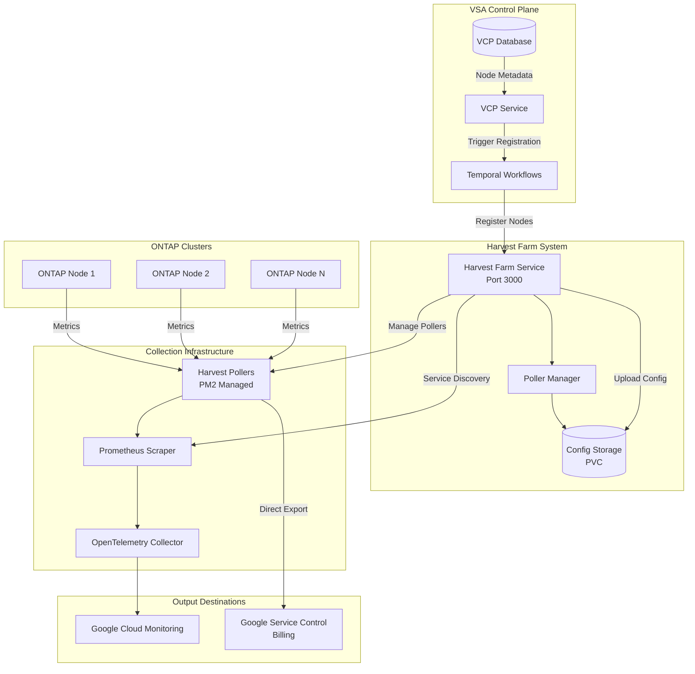
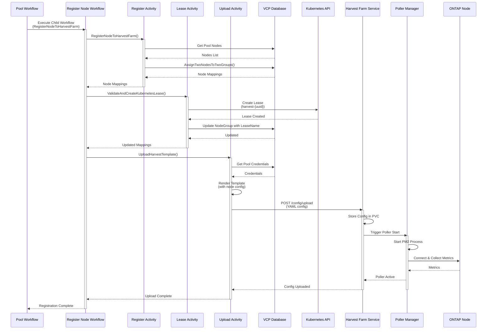

# Harvest-Based Collector System Design Document

## Related Documents Index

This document is part of a series of design documents covering the Telemetry System architecture and implementation. For comprehensive understanding, refer to the following related documents:

| Document | Title | Description |
|----------|-------|-------------|
| [0003-metrics-and-billing.md](./0003-metrics-and-billing.md) | Metrics and Billing Architecture | High-level architecture document covering the complete telemetry system design, data flow, and components |
| [0014-telemetry-performance-test-design.md](./0014-telemetry-performance-test-design.md) | Telemetry Performance Testing Design | Performance testing framework, profiling strategies, and AI-powered analysis workflow |
| **0016-harvest-collector-system.md** | **Harvest-Based Collector System Design** | **Real-time metrics collection infrastructure using NetApp Harvest for ONTAP cluster monitoring** |
| [0017-telemetry-deployer-design.md](./0017-telemetry-deployer-design.md) | Telemetry Deployer Design | Automated deployment tool for telemetry services as Google Cloud Run services with Cloud Scheduler integration |
| [0018-telemetry-low-level-design.md](./0018-telemetry-low-level-design.md) | Telemetry System Low-Level Design | Detailed implementation specifications including database schemas, job queue, aggregation algorithms, and security |

---

## 1. Overview

The Harvest-Based Collector System is a scalable, real-time metrics collection infrastructure that enables continuous monitoring of ONTAP storage clusters within the VSA (Virtual Storage Appliance) Control Plane. Built on NetApp's open-source Harvest tool, this system provides decoupled, multi-node telemetry collection that scales horizontally and integrates seamlessly with Google Cloud Monitoring.

### 1.1 Purpose

The Harvest Collector System addresses the following key requirements:

- **Real-time Metrics Collection**: Continuous collection of performance and health metrics from ONTAP nodes
- **Horizontal Scalability**: Support for hundreds of pollers on a single monitoring instance, reducing BOM costs
- **High Availability**: Redundant node assignments and automatic failover mechanisms
- **Cloud-Native Integration**: Direct integration with Google Cloud Monitoring, reducing database load
- **Decoupled Architecture**: Separation of concerns between collection, processing, and storage

### 1.2 Key Benefits

- **Cost Efficiency**: Up to 200 pollers per monitoring instance, significantly reducing infrastructure costs
- **Reduced Database Load**: Metrics sent directly to Google Cloud Monitoring, bypassing database storage
- **Future-Proof**: Adaptable to new paradigms when VSA starts pushing metrics directly to Cloud Monitoring
- **Operational Simplicity**: Automated registration/unregistration via Temporal workflows
- **Comprehensive Coverage**: Collects metrics for volumes, pools, backups, and replication relationships

## 2. Architecture

### 2.1 High-Level Architecture



### 2.2 Component Overview

| Component | Purpose | Technology |
|-----------|---------|------------|
| **Harvest Farm Service** | Central service managing poller lifecycle | Go/HTTP REST API |
| **Harvest Pollers** | Individual collectors for ONTAP nodes | NetApp Harvest (Python) |
| **OpenTelemetry Collector** | Metrics processing and forwarding | OpenTelemetry Collector |
| **Prometheus Scraper** | Service discovery and scraping | Prometheus |
| **Poller Manager** | Poller lifecycle management | Go |
| **Temporal Workflows** | Orchestration of registration/unregistration | Temporal |

## 3. Core Components

### 3.1 Harvest Farm Service

**Purpose**: Central service that manages the lifecycle of Harvest pollers, including registration, configuration management, and health monitoring.

**Key Responsibilities**:
- Accept poller configuration uploads via REST API
- Store configurations in persistent volume (PVC)
- Provide Prometheus service discovery endpoint
- Manage poller health and status
- Expose metrics and health endpoints

**API Endpoints**:
- `POST /config/upload`: Upload Harvest configuration for a poller
- `DELETE /config/{poller_name}`: Delete poller configuration
- `GET /pollers/prometheus-targets`: Service discovery endpoint for Prometheus
- `GET /health`: Health check endpoint
- `GET /metrics`: Prometheus metrics endpoint

**Configuration Storage**:
- Configurations stored in Kubernetes PersistentVolumeClaim (PVC)
- Path structure: `/configs/harvest/{lease_name}/{file_name}.yaml`
- Each poller has its own configuration file

### 3.2 Harvest Pollers

**Purpose**: Individual collectors that connect to ONTAP nodes and collect metrics.

**Technology**: NetApp Harvest (open-source Python-based tool)

**Key Features**:
- **Multiple Collectors**: Supports Rest, RestPerf, KeyPerf, Ems collectors
- **Dual Exporters**: 
  - Prometheus exporter (for OpenTelemetry integration)
  - Service Control exporter (for direct billing)
- **PM2 Management**: Process management via PM2 for auto-restart and monitoring
- **Dynamic Configuration**: Configuration loaded from PVC at startup

**Configuration Template Variables**:
```go
type HarvestConfig struct {
    POLLER_NAME      string  // Unique poller identifier
    DATACENTER       string  // Datacenter name
    NODE_IP          string  // ONTAP node IP address
    AUTH_STYLE       string  // Authentication style (certificate/password)
    USERNAME         string  // ONTAP username
    PASSWORD         string  // ONTAP password (if using password auth)
    AUTH_TYPE        string  // Auth type (secret_manager/password)
    SECRET_ID        string  // Secret Manager secret ID
    SECRET_PROJECT   string  // Secret Manager project
    PROJECT          string  // Customer project ID
    TENANT_PROJECT   string  // Tenant project ID
    DEPLOYMENT_NAME  string  // Deployment identifier
    POOL_NAME        string  // Pool name
    IS_REGIONAL_HA   string  // Regional HA flag
    LEASE_NAME       string  // Kubernetes lease name
    PORT             string  // Prometheus metrics port
}
```

### 3.3 OpenTelemetry Collector

**Purpose**: Processes and forwards metrics from Harvest pollers to Google Cloud Monitoring.

**Configuration**:
```yaml
receivers:
  prometheus:
    config:
      scrape_configs:
        - job_name: 'otel-collector'
          scrape_interval: 300s
          http_sd_configs:
            - url: http://localhost:3000/pollers/prometheus-targets
              refresh_interval: 30s

processors:
  batch:
    timeout: 10s
    send_batch_size: 1000
  groupbyattrs:
    keys:
      - tenant_project
  transform:
    error_mode: ignore
    metric_statements:
      - set(resource.attributes["gcp.project.id"], resource.attributes["tenant_project"])
      - delete_key(resource.attributes, "tenant_project")

exporters:
  googlecloud:
    project: "${GCP_PROJECT}"
    metric:
      prefix: custom.googleapis.com
      skip_create_descriptor: true
    sending_queue:
      enabled: true
      queue_size: 40000
```

**Key Features**:
- **Dynamic Service Discovery**: Automatically discovers new pollers via HTTP service discovery
- **Batch Processing**: Batches metrics for efficient transmission
- **Attribute Grouping**: Groups metrics by tenant_project for proper GCP project attribution
- **Transform Processing**: Transforms metric attributes for Google Cloud compatibility

### 3.4 Poller Manager

**Purpose**: Manages the lifecycle of Harvest poller processes.

**Responsibilities**:
- Start/stop poller processes based on configuration files
- Monitor poller health and restart failed pollers
- Manage PM2 process groups
- Coordinate with Harvest Farm Service for configuration updates

## 4. Workflows

### 4.1 Node Registration Workflow

**Workflow**: `RegisterNodeToHarvestFarmWorkflow`

**Trigger**: Automatically triggered when a new pool is created in the VCP system.

**Input Parameters**:
```go
type RegisterNodeToHarvestFarmWorkflowInput struct {
    PoolID            int64   // Pool database ID
    MaxNodesPerGroup  int     // Maximum nodes per group (default: 5)
    CustomerProjectID string  // Customer GCP project ID
    TenantProjectID   string  // Tenant GCP project ID
    PoolUUID          string  // Pool UUID
    AccountID         int64   // Account ID
    DeploymentName    string  // Deployment identifier
    PoolName         string  // Pool name
    IsRegionalHA      bool    // Whether pool is regional HA
}
```

**Workflow Steps**:

1. **Node Assignment** (`RegisterNodeToHarvestFarm` activity):
   - Fetches two nodes from the pool
   - Assigns nodes to two different node groups for redundancy
   - Creates node-to-group mappings in database
   - Validates node availability and uniqueness

2. **Kubernetes Lease Creation** (`ValidateAndCreateKubernetesLease` activity):
   - Creates Kubernetes lease for each node group
   - Lease name format: `harvest-{nodeGroupUUID}`
   - Lease namespace: Configurable via `LEASE_NAMESPACE` env var (default: "vcp")
   - Updates node group mapping with lease name

3. **Configuration Generation** (`UploadHarvestTemplate` activity):
   - Renders Harvest configuration template with node-specific values
   - Fetches pool credentials (password or Secret Manager reference)
   - Generates unique poller name: `{pool_name}-{node_id}`
   - Assigns unique Prometheus port per poller

4. **Configuration Upload**:
   - Uploads YAML configuration to Harvest Farm Service
   - Configuration stored in PVC at: `/configs/harvest/{lease_name}/{file_name}.yaml`
   - Harvest Farm Service triggers poller startup via PM2

**Sequence Diagram**:



### 4.2 Node Unregistration Workflow

**Workflow**: `UnRegisterNodeFromHarvestFarmWorkflow`

**Trigger**: Automatically triggered when a pool is deleted or nodes are removed.

**Input Parameters**:
```go
type unRegisterNodeFromHarvestFarmParams struct {
    PoolID            int64
    CustomerProjectID string
    TenantProjectID   string
}
```

**Workflow Steps**:

1. **Validate and Get Nodes** (`ValidateAndGetNodes` activity):
   - Fetches nodes in deleted state for the pool
   - Validates that nodes exist and are in correct state
   - Returns early if no nodes found (idempotent)

2. **Get Node Group Mappings** (`GetNodeGroupMapping` activity):
   - Retrieves node-to-group mappings that are not soft deleted
   - Returns early if no mappings found (idempotent)

3. **Delete Kubernetes Leases** (`DeleteKubernetesLeases` activity):
   - Deletes Kubernetes leases for all node groups
   - Handles missing leases gracefully (idempotent)

4. **Delete Pollers from Harvest** (`DeletePollersFromHarvestFarm` activity):
   - Sends DELETE request to Harvest Farm Service for each poller
   - Harvest Farm Service removes configuration files from PVC
   - PM2 automatically stops poller processes
   - HPA scales down pods if poller count reaches zero

**Sequence Diagram**:

```mermaid
sequenceDiagram
    participant PoolWF as Pool Workflow
    participant UnregWF as Unregister Node Workflow
    participant ValidateAct as Validate Activity
    participant MappingAct as Mapping Activity
    participant LeaseAct as Lease Activity
    participant DeleteAct as Delete Activity
    participant VCPDB as VCP Database
    participant K8s as Kubernetes API
    participant HarvestFarm as Harvest Farm Service
    participant PollerManager as Poller Manager
    
    PoolWF->>UnregWF: Execute Child Workflow<br/>(UnRegisterNodeFromHarvestFarm)
    activate UnregWF
    
    UnregWF->>ValidateAct: ValidateAndGetNodes()
    activate ValidateAct
    ValidateAct->>VCPDB: Get Deleted Nodes
    VCPDB-->>ValidateAct: Nodes (or empty)
    alt No Nodes Found
        ValidateAct-->>UnregWF: Early Return (Success)
        deactivate ValidateAct
        UnregWF-->>PoolWF: Complete (Idempotent)
        deactivate UnregWF
    else Nodes Found
        ValidateAct-->>UnregWF: Nodes List
        deactivate ValidateAct
        
        UnregWF->>MappingAct: GetNodeGroupMapping()
        activate MappingAct
        MappingAct->>VCPDB: Get Node Group Mappings
        VCPDB-->>MappingAct: Mappings (or empty)
        alt No Mappings Found
            MappingAct-->>UnregWF: Early Return (Success)
            deactivate MappingAct
            UnregWF-->>PoolWF: Complete (Idempotent)
            deactivate UnregWF
        else Mappings Found
            MappingAct-->>UnregWF: Node Group Mappings
            deactivate MappingAct
            
            UnregWF->>LeaseAct: DeleteKubernetesLeases()
            activate LeaseAct
            loop For each Node Group
                LeaseAct->>K8s: Delete Lease<br/>(harvest-{uuid})
                K8s-->>LeaseAct: Deleted (or NotFound)
            end
            LeaseAct-->>UnregWF: Leases Deleted
            deactivate LeaseAct
            
            UnregWF->>DeleteAct: DeletePollersFromHarvestFarm()
            activate DeleteAct
            loop For each Poller
                DeleteAct->>HarvestFarm: DELETE /config/{poller_name}
                activate HarvestFarm
                HarvestFarm->>HarvestFarm: Delete Config from PVC
                HarvestFarm->>PollerManager: Stop Poller Process
                activate PollerManager
                PollerManager->>PollerManager: PM2 Stop Process
                PollerManager-->>HarvestFarm: Poller Stopped
                deactivate PollerManager
                HarvestFarm-->>DeleteAct: Poller Deleted
                deactivate HarvestFarm
            end
            DeleteAct-->>UnregWF: Pollers Deleted
            deactivate DeleteAct
            
            UnregWF-->>PoolWF: Unregistration Complete
            deactivate UnregWF
        end
    end
```

### 4.3 Harvest Upgrade Workflow

**Workflow**: `HarvestUpgradeWorkflow`

**Purpose**: Upgrades Harvest version across all pollers without service interruption.

**Key Features**:
- Rolling upgrade strategy
- Health checks between upgrades
- Rollback capability on failure
- Zero-downtime upgrades

## 5. Configuration Management

### 5.1 Harvest Configuration Template

The Harvest configuration is generated from a Go template that includes:

**Exporters Configuration**:
- **Prometheus Exporter**: Exposes metrics on configurable port for scraping
- **Service Control Exporter**: Direct export to Google Service Control API for billing

**Metric Mappings**:
- Volume metrics: capacity, read_ops, write_ops, latency
- Backup metrics: transfer_size, progress, last_transfer_duration
- Replication metrics: healthy, lag_time, transfer_bytes, relationship_status

**Poller Configuration**:
- ONTAP connection details (IP, auth, credentials)
- Collectors enabled (Rest, RestPerf, KeyPerf, Ems)
- Labels for resource identification (project, tenant_project, deployment_name)
- TLS settings (insecure TLS for internal connections)

### 5.2 Template Rendering

**Process**:
1. Load template from `utils/harvest-template.yaml`
2. Populate template variables from node and pool metadata
3. Fetch credentials (password or Secret Manager reference)
4. Generate unique poller name and port
5. Render final YAML configuration

**Template Variables**:
- Node-specific: `NODE_IP`, `POLLER_NAME`, `PORT`
- Pool-specific: `POOL_NAME`, `IS_REGIONAL_HA`, `DEPLOYMENT_NAME`
- Project-specific: `PROJECT`, `TENANT_PROJECT`
- Auth-specific: `AUTH_TYPE`, `SECRET_ID`, `PASSWORD`

## 6. High Availability and Resilience

### 6.1 Node Group Strategy

**Redundancy Model**:
- Two nodes assigned to two different node groups
- Each node group can contain up to `MaxNodesPerGroup` nodes (default: 5)
- Automatic failover if one node in a group fails

**Load Distribution**:
- Metrics collection load distributed across multiple pollers
- No single point of failure for metric collection
- Graceful degradation if some nodes become unavailable

### 6.2 Kubernetes Lease Management

**Purpose**: Coordinate poller ownership and prevent conflicts in multi-pod deployments.

**Lease Structure**:
```go
const leasePrefix = "harvest-"
leaseName := leasePrefix + nodeGroup.UUID
namespace := env.GetString("LEASE_NAMESPACE", "vcp")
```

**RBAC Requirements**:
```yaml
rules:
  - apiGroups: ["coordination.k8s.io"]
    resources: ["leases"]
    verbs: ["get", "list", "watch", "create", "update", "patch", "delete"]
```

**Lease Lifecycle**:
- Created during node registration
- Updated periodically by poller owner (heartbeat)
- Deleted during node unregistration
- Used for leader election in multi-instance deployments

### 6.3 Error Handling

**Non-Retryable Errors**:
- Insufficient nodes available
- Invalid node configuration
- Template rendering failures
- Configuration validation errors

**Retryable Errors**:
- Network timeouts
- Temporary service unavailability
- Kubernetes API transient errors
- Harvest Farm Service temporary failures

**Retry Policy**:
- Initial interval: 1 second
- Backoff coefficient: 2.0
- Maximum interval: 60 seconds
- Maximum attempts: 10

### 6.4 Health Monitoring

**Poller Health Checks**:
- PM2 process status monitoring
- ONTAP connectivity checks
- Metrics collection success rate
- Configuration file validity

**Harvest Farm Service Health**:
- HTTP health endpoint: `/health`
- Prometheus metrics endpoint: `/metrics`
- Configuration storage availability
- Service discovery endpoint responsiveness

## 7. Security

### 7.1 Authentication Methods

**Secret Manager Integration**:
- Primary method for production environments
- Credentials stored in Google Secret Manager
- Secret ID and project number in configuration
- Automatic credential rotation support

**Password-Based Authentication**:
- Fallback for development/testing
- Passwords stored securely in VCP database
- Encrypted at rest
- Never logged or exposed in metrics

**Configuration**:
```go
if smHarvestAuthEnabled {
    mapping.HarvestConfig.AUTH_TYPE = "secret_manager"
    mapping.HarvestConfig.SECRET_ID = pool.PoolCredentials.SecretID
    mapping.HarvestConfig.SECRET_PROJECT = env.SecretManagerProjectID
} else {
    mapping.HarvestConfig.AUTH_TYPE = "password"
    mapping.HarvestConfig.PASSWORD = strconv.Quote(credentials.AdminPassword)
}
```

### 7.2 Network Security

**TLS Configuration**:
- Insecure TLS enabled for internal ONTAP connections
- Network isolation via Kubernetes network policies
- Service-to-service communication within cluster

**Access Control**:
- Kubernetes service accounts for API access
- RBAC for lease management
- Network policies restrict inter-pod communication

### 7.3 Credential Management

**Storage**:
- Credentials never stored in configuration files
- Secret Manager references only
- Encrypted database storage for password fallback

**Rotation**:
- Support for credential rotation via Secret Manager
- Poller restart on credential update
- No service interruption during rotation

## 8. Scalability

### 8.1 Horizontal Scaling

**Poller Density**:
- Up to 200 pollers per Harvest Farm instance
- Configurable via `MAX_NODES_PER_GROUP` environment variable
- HPA (Horizontal Pod Autoscaler) for automatic scaling

**Resource Efficiency**:
- Single monitoring instance handles multiple pollers
- Shared OpenTelemetry Collector across all pollers
- Efficient resource utilization reduces BOM costs

### 8.2 Performance Characteristics

**Collection Frequency**:
- Default scrape interval: 300 seconds (5 minutes)
- Configurable per poller
- Batch processing for efficient transmission

**Throughput**:
- Each poller collects metrics independently
- No contention between pollers
- Parallel collection from all nodes

**Queue Management**:
- OpenTelemetry Collector queue size: 40,000 metrics
- Batch size: 1,000 metrics per batch
- Automatic backpressure handling

## 9. Integration with Telemetry System

### 9.1 Real-time vs Batch Collection

**Real-time Collection (Harvest)**:
- Continuous metrics from ONTAP nodes
- Direct export to Google Cloud Monitoring
- Low latency (< 5 minutes)
- No database storage required

**Batch Collection (VCP Telemetry)**:
- Periodic collection from VCP database
- Aggregated metrics for billing
- Stored in database for historical analysis
- Higher latency (hourly aggregation)

**Complementary Roles**:
- Harvest: Real-time monitoring and alerting
- Batch: Billing and historical analytics
- Combined: Comprehensive observability

### 9.2 Metric Correlation

**Resource Identification**:
- Labels: `project`, `tenant_project`, `deployment_name`, `pool_name`
- Enables correlation between real-time and batch metrics
- Unified view in Google Cloud Monitoring dashboards

**Metadata Enrichment**:
- VCP database provides resource metadata
- Harvest metrics enriched with labels
- Consistent resource identification across systems

## 10. Monitoring and Observability

### 10.1 Harvest Farm Metrics

**Service Metrics**:
- Active poller count
- Configuration upload success/failure rate
- Service discovery endpoint response time
- PVC storage utilization

**Poller Metrics**:
- Poller health status (active/inactive)
- Collection success rate
- ONTAP connection errors
- Metrics export success rate

### 10.2 OpenTelemetry Collector Metrics

**Collection Metrics**:
- Scrapes per second
- Metrics received per second
- Export success/failure rate
- Queue depth

**Processing Metrics**:
- Batch processing latency
- Transformation errors
- Attribute grouping efficiency

### 10.3 Alerting

**Critical Alerts**:
- Poller failure rate > threshold
- Service discovery endpoint down
- PVC storage full
- OpenTelemetry Collector queue full

**Warning Alerts**:
- High collection latency
- Increased error rates
- Resource utilization approaching limits

## 11. Data Models

### 11.1 Node Group Assignment

```go
type NodeGroupAssignmentParams struct {
    Node1            *Node    // First node for redundancy
    Node2            *Node    // Second node for redundancy
    MaxNodesPerGroup int      // Maximum nodes per group
    CustomerProject  string   // Customer GCP project
    TenantProject    string   // Tenant GCP project
    DeploymentName   string   // Deployment identifier
}
```

### 11.2 Node-Node Group Mapping

**Database Table**: `node_node_group_map`

**Key Fields**:
- `node_id`: Reference to node
- `node_group_id`: Reference to node group
- `lease_name`: Kubernetes lease name
- `harvest_config`: Serialized Harvest configuration
- `deleted_at`: Soft delete timestamp

### 11.3 Harvest Configuration

```go
type HarvestConfig struct {
    POLLER_NAME      string
    DATACENTER       string
    NODE_IP          string
    AUTH_STYLE       string
    USERNAME         string
    PASSWORD         string
    AUTH_TYPE        string
    SECRET_ID        string
    SECRET_PROJECT   string
    PROJECT          string
    TENANT_PROJECT   string
    DEPLOYMENT_NAME  string
    POOL_NAME        string
    IS_REGIONAL_HA   string
    LEASE_NAME       string
    PORT             string
}
```

## 12. Deployment Architecture

### 12.1 Kubernetes Deployment

**Components**:
- Harvest Farm Service (Deployment)
- OpenTelemetry Collector (DaemonSet or Deployment)
- Harvest Pollers (managed by PM2 in Harvest Farm pods)
- PersistentVolumeClaim (for configuration storage)

**Resource Requirements**:
- Harvest Farm: 2 CPU, 4GB RAM (handles 200 pollers)
- OpenTelemetry Collector: 1 CPU, 2GB RAM per instance
- PVC: 10GB (for configurations)

### 12.2 High Availability Setup

**Multi-Instance Deployment**:
- Multiple Harvest Farm pods for redundancy
- Kubernetes leases for coordination
- Shared PVC for configuration storage
- Load balancer for service discovery

**Auto-Scaling**:
- HPA based on poller count
- Automatic pod scaling when pollers added/removed
- Graceful shutdown on scale-down

## 13. Future Enhancements

### 13.1 Direct Cloud Monitoring Push

**Current State**: Metrics collected via Harvest → OpenTelemetry → Google Cloud Monitoring

**Future State**: ONTAP nodes push metrics directly to Google Cloud Monitoring

**Migration Path**:
- Harvest system remains operational during transition
- Gradual migration of nodes to direct push
- Harvest system decommissioned after full migration
- No service interruption during migration

### 13.2 Enhanced Metric Collection

**Additional Collectors**:
- Backup-specific collectors
- Replication-specific collectors
- Custom application metrics

**Advanced Processing**:
- Real-time anomaly detection
- Predictive analytics
- Automated alerting based on patterns

### 13.3 Multi-Region Support

**Current**: Single-region deployment

**Future**: 
- Multi-region Harvest Farm instances
- Regional failover
- Cross-region metric aggregation

## 14. Troubleshooting

### 14.1 Common Issues

**Poller Not Starting**:
- Check configuration file exists in PVC
- Verify PM2 process status
- Check ONTAP connectivity
- Validate credentials

**Metrics Not Appearing in GCP**:
- Verify OpenTelemetry Collector is running
- Check service discovery endpoint
- Validate metric transformations
- Check GCP project permissions

**High Resource Usage**:
- Review poller count per instance
- Check collection frequency
- Optimize batch sizes
- Scale horizontally

### 14.2 Debugging Tools

**Harvest Farm Service**:
- `/health`: Health check endpoint
- `/metrics`: Prometheus metrics
- `/pollers/prometheus-targets`: Service discovery status

**Poller Debugging**:
- PM2 logs: `pm2 logs {poller_name}`
- Configuration validation
- ONTAP connectivity tests

**OpenTelemetry Collector**:
- Logs: Check collector logs for errors
- Metrics: Monitor queue depth and export rates
- Traces: Enable distributed tracing

## 15. References

- **NetApp Harvest**: https://github.com/NetApp/harvest
- **OpenTelemetry Collector**: https://opentelemetry.io/docs/collector/
- **Prometheus Service Discovery**: https://prometheus.io/docs/prometheus/latest/configuration/configuration/#http_sd_config
- **Kubernetes Leases**: https://kubernetes.io/docs/concepts/architecture/leases/
- **Google Cloud Monitoring**: https://cloud.google.com/monitoring

---

**Document Version**: 1.0  
**Last Updated**: 2025-01-XX  
**Author**: VSA Control Plane Team

