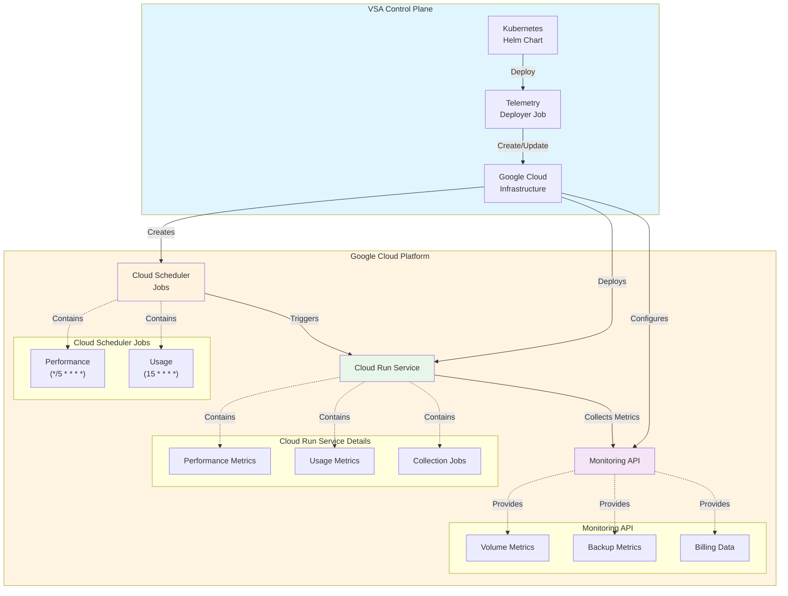
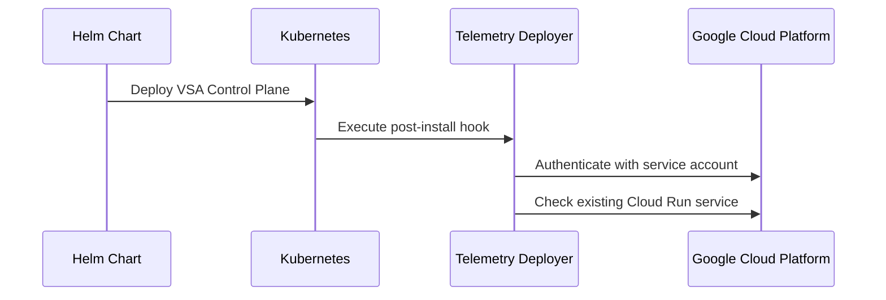
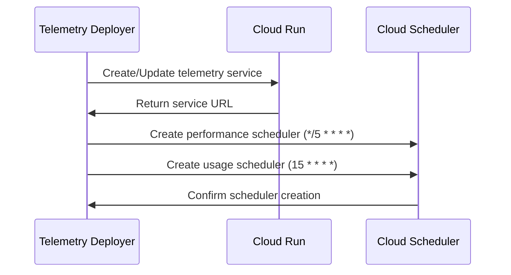
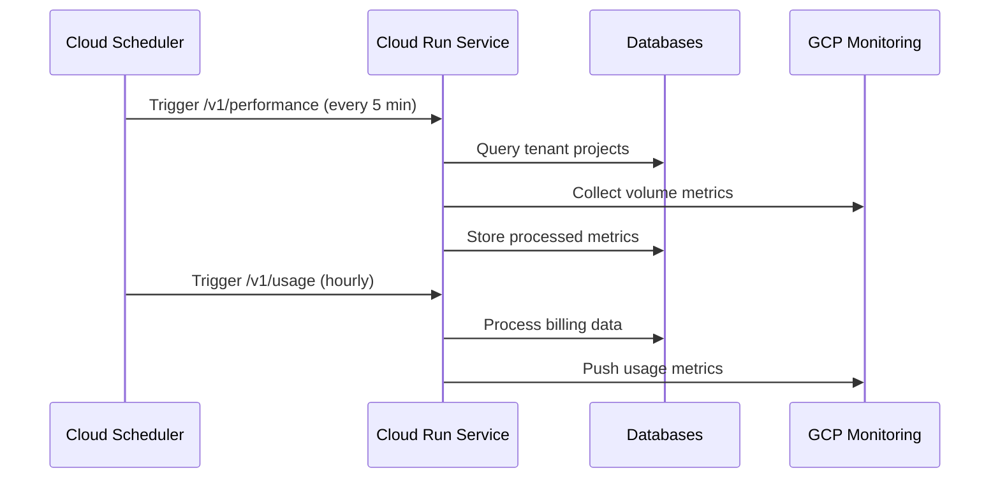

# Telemetry Deployer Design Document

## Related Documents Index

This document is part of a series of design documents covering the Telemetry System architecture and implementation. For comprehensive understanding, refer to the following related documents:

| Document | Title | Description |
|----------|-------|-------------|
| [0003-metrics-and-billing.md](./0003-metrics-and-billing.md) | Metrics and Billing Architecture | High-level architecture document covering the complete telemetry system design, data flow, and components |
| [0014-telemetry-performance-test-design.md](./0014-telemetry-performance-test-design.md) | Telemetry Performance Testing Design | Performance testing framework, profiling strategies, and AI-powered analysis workflow |
| [0016-harvest-collector-system.md](./0016-harvest-collector-system.md) | Harvest-Based Collector System Design | Real-time metrics collection infrastructure using NetApp Harvest for ONTAP cluster monitoring |
| **0017-telemetry-deployer-design.md** | **Telemetry Deployer Design** | **Automated deployment tool for telemetry services as Google Cloud Run services with Cloud Scheduler integration** |
| [0018-telemetry-low-level-design.md](./0018-telemetry-low-level-design.md) | Telemetry System Low-Level Design | Detailed implementation specifications including database schemas, job queue, aggregation algorithms, and security |

---

## Overview

The Telemetry Deployer is a specialized deployment tool within the VSA Control Plane that automates the deployment and configuration of telemetry services as Google Cloud Run services. It provides a streamlined approach to deploy telemetry collection and processing infrastructure with integrated Cloud Scheduler triggers for automated metrics collection.

## Architecture

### High-Level Architecture



### Component Architecture

The Telemetry Deployer consists of several key components:

1. **Deployment Controller** (`tools/telemetry-deployer/main.go`)
2. **Kubernetes Job Integration** (`kubernetes/vsa-control-plane/charts/core/templates/telemetry-deployer-job.yaml`)
3. **Telemetry Service** (`telemetry/main.go`)
4. **Configuration Management** (`telemetry/common/config.go`)

## Core Components

### 1. Deployment Controller

**Location**: `tools/telemetry-deployer/main.go`

The deployment controller is the main orchestrator that:

- **Cloud Run Service Management**: Creates or updates Cloud Run services with proper configuration
- **Cloud Scheduler Integration**: Sets up automated triggers for metrics collection
- **Network Configuration**: Configures VPC access and service accounts
- **Environment Management**: Handles environment variable injection and configuration

**Key Features**:
- Idempotent deployments (create or update existing services)
- Configurable scaling parameters (min/max instances)
- Environment-specific configuration support
- Retry logic and error handling

### 2. Kubernetes Integration

**Location**: `kubernetes/vsa-control-plane/charts/core/templates/telemetry-deployer-job.yaml`

The Kubernetes job provides:

- **Helm Hook Integration**: Executes as post-install/post-upgrade hooks
- **Configuration Injection**: Passes deployment parameters from Helm values
- **Service Account Management**: Uses appropriate GCP service accounts
- **Resource Management**: Configurable CPU/memory limits and requests

### 3. Telemetry Service

**Location**: `telemetry/main.go`

The telemetry service implements:

- **Multi-Database Connectivity**: Connects to both VCP and metrics databases
- **Metrics Processing Pipeline**: Handles performance, usage, and collection metrics
- **API Endpoints**: Exposes REST endpoints for triggering metric collection
- **Queue Management**: Manages job queues for asynchronous processing

## Deployment Flow

### 1. Initialization Phase



### 2. Service Deployment Phase



### 3. Runtime Operation Phase



## Configuration Management

### Environment Variables

The telemetry deployer supports extensive configuration through environment variables:

| Variable | Default | Description |
|----------|---------|-------------|
| `OPERATION_BATCH_SIZE` | 200 | Batch size for metric operations |
| `PUSHER_SERVICE_NAME` | autopush-netapp.sandbox.googleapis.com | Google service name for metrics |
| `PUSHER_SERVICE_PROJECT` | netapp-au-se1-autopush-sde-tst | GCP project for metrics pushing |
| `ENABLE_VOLUME_METRICS` | false | Enable volume metrics collection |
| `ENABLE_BACKUP_METRICS` | false | Enable backup metrics collection |
| `PUSH_BATCH_SIZE` | 1000 | Batch size for metric pushing |
| `MAX_GOOGLE_BILLING_PUSH_RETRY` | 5 | Maximum retry attempts for billing |

### Helm Configuration

**Location**: `kubernetes/vsa-control-plane/charts/core/values.yaml`

```yaml
telemetryDeployer:
  enabled: false
  serviceName: telemetry-service
  projectID: netapp-au-se1-autopush-sde-tst
  region: australia-southeast1
  network: "cv-tst-au-se1-k8s-vpc"
  subnet: "cloud-run"
  serviceAccount: "svc-sde-metrics-producer@netapp-au-se1-autopush-sde-tst.iam.gserviceaccount.com"
  minInstances: 1
  maxInstances: 5
```

## Metrics Collection Architecture

### Data Flow

1. **Tenant Discovery**: Query VCP database for active tenant projects
2. **Metrics Collection**: Use Google Cloud Monitoring API to collect metrics
3. **Data Processing**: Transform and hydrate metrics with metadata
4. **Storage**: Store processed metrics in telemetry database
5. **Billing Integration**: Push billing-relevant metrics to Google services

### Supported Metrics

- **Volume Metrics**: Allocated size, usage, performance counters
- **Backup Metrics**: Backup chain size, logical size, restore points
- **Replication Metrics**: Relationship status, lag time, transfer rates
- **Billing Metrics**: Usage-based billing data for cost allocation

### Collection Schedules

- **Performance Metrics**: Every 5 minutes (`*/5 * * * *`)
- **Usage Metrics**: Hourly at 15 minutes past the hour (`15 * * * *`)
- **Collection Jobs**: On-demand via API triggers

## Security Considerations

### Authentication & Authorization

- **Service Account**: Uses dedicated GCP service account with minimal required permissions
- **Workload Identity**: Integrates with Kubernetes Workload Identity when enabled
- **OIDC Tokens**: Cloud Scheduler uses OIDC tokens for secure service invocation
- **Network Security**: Deploys within private VPC with controlled subnet access

### Data Protection

- **Database Encryption**: Supports encrypted database connections
- **Transit Encryption**: All API communications use TLS
- **Access Control**: Role-based access control for metric data
- **Audit Logging**: Comprehensive logging for security monitoring

## Scalability & Performance

### Horizontal Scaling

- **Auto-scaling**: Cloud Run automatically scales based on request volume
- **Instance Limits**: Configurable min/max instance counts
- **Queue Management**: Job queue system handles burst loads
- **Batch Processing**: Configurable batch sizes for optimal performance

### Performance Optimizations

- **Connection Pooling**: Database connection pooling for efficiency
- **Metric Batching**: Batch processing for Google Cloud Monitoring API
- **Caching**: Authentication token caching to reduce API calls
- **Parallel Processing**: Concurrent processing of multiple tenant projects

## Monitoring & Observability

### Logging

- **Structured Logging**: JSON-formatted logs with correlation IDs
- **Request Tracing**: End-to-end request correlation
- **Error Tracking**: Comprehensive error logging and categorization
- **Performance Metrics**: Request duration and throughput metrics

### Health Checks

- **Readiness Probes**: Database connectivity checks
- **Liveness Probes**: Service health monitoring
- **Dependency Checks**: External service availability validation

### Alerting

- **Service Availability**: Cloud Run service health alerts
- **Job Failures**: Cloud Scheduler job failure notifications
- **Database Connectivity**: Database connection failure alerts
- **Metric Collection**: Missing or delayed metric collection alerts

## Deployment Scenarios

### Development Environment

```bash
# Local development deployment
cd tools/telemetry-deployer
go run main.go \
  -project="dev-project-id" \
  -region="us-central1" \
  -network="default" \
  -subnet="default" \
  -min-instances=0 \
  -max-instances=2
```

### Production Environment

```yaml
# Helm values for production
telemetryDeployer:
  enabled: true
  projectID: "prod-project-id"
  region: "us-central1"
  network: "prod-vpc"
  subnet: "telemetry-subnet"
  minInstances: 2
  maxInstances: 10
  resources:
    limits:
      cpu: 2000m
      memory: 1Gi
    requests:
      cpu: 500m
      memory: 512Mi
```

## Error Handling & Recovery

### Retry Mechanisms

- **Exponential Backoff**: Configurable backoff for failed operations
- **Circuit Breaker**: Prevents cascade failures in dependent services
- **Dead Letter Queue**: Failed jobs are moved to error queue for analysis
- **Manual Recovery**: Administrative tools for manual job reprocessing

### Failure Scenarios

1. **Database Connectivity**: Automatic retry with exponential backoff
2. **GCP API Limits**: Rate limiting and retry with jitter
3. **Network Partitions**: Graceful degradation and recovery
4. **Service Unavailability**: Health check failures trigger alerts

## Future Enhancements

### Planned Features

1. **Multi-Cloud Support**: Extend to Azure and AWS deployments
2. **Custom Metrics**: Support for user-defined metric collection
3. **Real-time Streaming**: WebSocket support for real-time metrics
4. **Advanced Analytics**: Machine learning-based anomaly detection

### Technical Debt

1. **Configuration Management**: Centralized configuration service
2. **Service Mesh Integration**: Istio integration for advanced traffic management
3. **Observability**: OpenTelemetry integration for distributed tracing
4. **Testing**: Comprehensive integration test suite

## Conclusion

The Telemetry Deployer provides a robust, scalable solution for deploying and managing telemetry infrastructure in the VSA Control Plane. Its integration with Google Cloud Platform services ensures reliable, automated metrics collection while maintaining security and performance standards. The modular architecture allows for future enhancements and multi-cloud support as requirements evolve. 