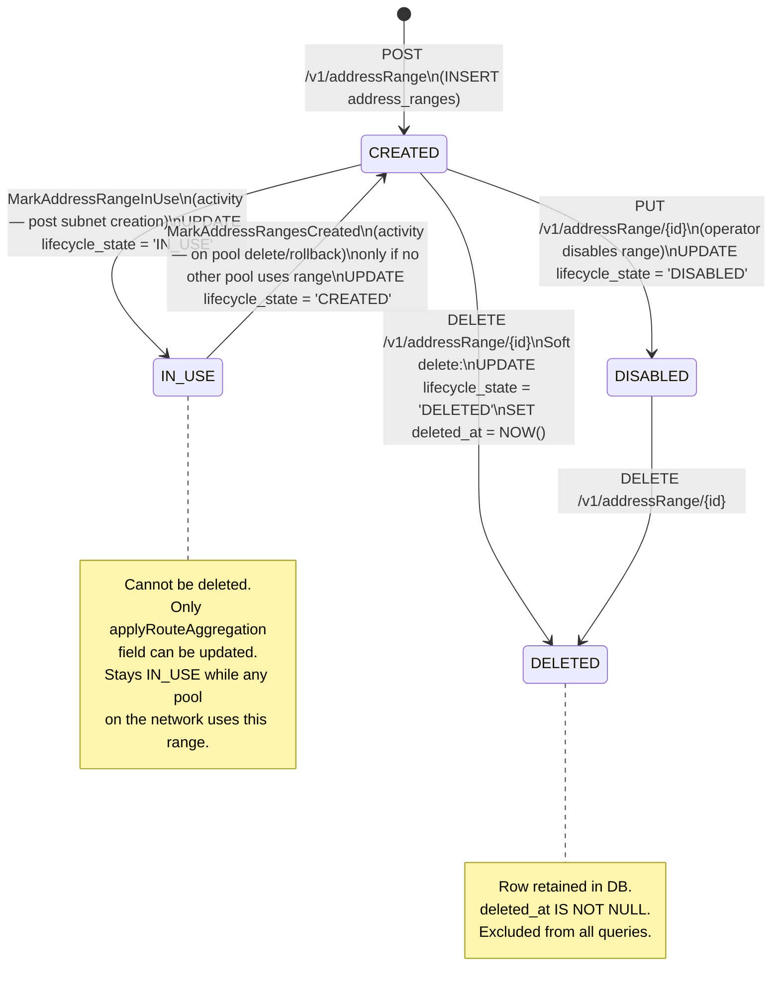
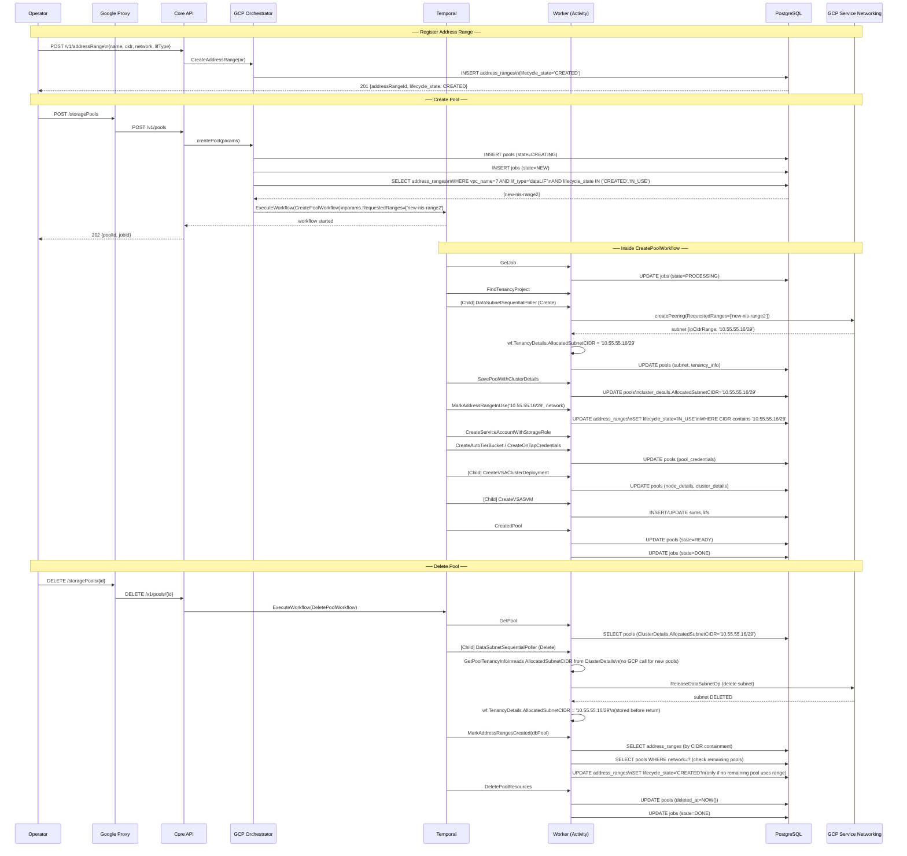
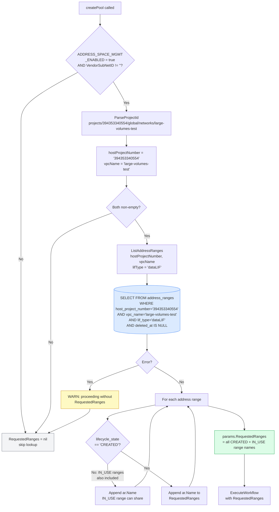

# Address Space Management — Flow Charts

---

## Diagram 1: Pool Creation Control Flow (End-to-End)

```mermaid
flowchart TD
    A([Operator: POST /storagePools]) --> B[Google Proxy\napi/endpoints]
    B --> C[Core API\nPOST /v1/pools]
    C --> D[GCP Orchestrator\nfactory/gcp/pool.go]

    D --> E[(DB: INSERT pools\nstate = CREATING)]
    D --> F[(DB: INSERT jobs\nstate = NEW)]

    D --> G{ADDRESS_SPACE_MGMT\n_ENABLED = true?}

    G -->|No| H[RequestedRanges = nil]
    G -->|Yes| I[ParseProjectId\nvendorSubNetID\n→ hostProjectNumber + vpcName]
    I --> J[(DB: SELECT address_ranges\nWHERE vpc_name=?\nAND host_project_number=?\nAND lif_type='dataLIF'\nAND deleted_at IS NULL)]
    J --> K[Filter: lifecycle_state == 'CREATED'\nor 'IN_USE']
    K --> L[params.RequestedRanges\n= &#91;'new-nis-range2', ...&#93;]
    L --> M

    H --> M[ExecuteWorkflow\nCustomerTaskQueue\nCreatePoolWorkflow]
    M --> N[Temporal Server]
    N --> O[VCP Worker\nCustomerTaskQueue]

    style E fill:#dbeafe,stroke:#3b82f6
    style F fill:#dbeafe,stroke:#3b82f6
    style J fill:#dbeafe,stroke:#3b82f6
    style L fill:#dcfce7,stroke:#16a34a
```

---

## Diagram 2: CreatePoolWorkflow — Activities & DB Updates

```mermaid
flowchart TD
    START([CreatePoolWorkflow starts]) --> S1

    S1[GetJob] --> S2
    S2[(DB: jobs\nstate → PROCESSING)] --> S3

    S3[FindTenancyProject\n→ tenantProjectNumber] --> S4

    S4[[Child Workflow:\nDataSubnetSequentialPoller]] --> S4a
    S4a[GetAvailableSubnet\nor GetCreateDataSubnetOp\n+ WaitForOperation] --> S4b
    S4b[GCP Service Networking API\ncreatePeering with\nRequestedRanges] --> S4c
    S4c[GetSubnetFromOperation\n→ subnet.IpCidrRange\nallocatedSubnetCIDR] --> S4d
    S4d[GetTenancyInfo\nwf.TenancyDetails = tenancyInfo] --> S4e
    S4e[GetTenancyDetails\nreturns AllocatedSubnetCIDR] --> S4f
    S4f[(DB: UPDATE pools\nsubnet + tenancy info)] --> S5

    S5[SavePoolWithClusterDetails] --> S5a
    S5a[(DB: UPDATE pools\ncluster_details JSON\nAllocatedSubnetCIDR persisted)] --> S5b

    S5b{ADDRESS_SPACE_MGMT\n_ENABLED AND\nAllocatedSubnetCIDR != ''?} -->|Yes| S5c
    S5b -->|No| S6
    S5c[MarkAddressRangeInUse\nCIDR containment match\n→ UPDATE lifecycle_state='IN_USE'] --> S5d
    S5d[(DB: UPDATE address_ranges\nlifecycle_state = 'IN_USE')] --> S6

    S6[[Child Workflow:\nConfigureNetworkWorkflow]] --> S7
    S7[CreateServiceAccountWithStorageRole\n→ serviceAccount] --> S8
    S8[CreateAutoTierBucket] --> S9
    S9[CreateOnTapCredentials] --> S9a
    S9a[(DB: UPDATE pools\npool_credentials)] --> S10

    S10[IdentifyVMs\n→ vlmConfig] --> S11
    S11[IdentifySecondaryAndMediatorZone\n→ resolvedLocationInfo] --> S12

    S12[[Child Workflow:\nCreateVSAClusterDeployment\nVLM Worker]] --> S12a
    S12a[AllocateClusterSerialNumber] --> S12b
    S12b[Deploy VSA Cluster\non GCP VMs] --> S12c
    S12c[CreateCloudDNSRecords] --> S12d
    S12d[(DB: UPDATE pools\nnode details\nsvm details\ncluster_details)] --> S13

    S13[GetInterClusterLifsFromVLMConfig] --> S14
    S14[AllocateSVMName] --> S15

    S15[[Child Workflow:\nCreateVSASVM\nVLM Worker]] --> S15a
    S15a[CreateQoSPolicyAndApplyToSVM] --> S15b
    S15b[SaveSVMAndLifData] --> S15c
    S15c[(DB: UPDATE pools\nsvms table\nlifs table)] --> S16

    S16{Expert Mode\nEnabled?} -->|Yes| S16a
    S16a[CreateExpertModeCredentials\nCreateVSAExpertModeUser] --> S16b
    S16b[(DB: UPDATE pools\nexpert_mode_credentials)] --> S17
    S16 -->|No| S17

    S17[CreatedPool] --> S17a
    S17a[(DB: UPDATE pools\nstate → READY\nstate_details = 'Available for use')] --> S18

    S18[(DB: UPDATE jobs\nstate → DONE)] --> DONE([Workflow Complete ✓])

    ERR([Any activity fails]) --> R1
    R1[RollbackManager] --> R2[ErroredPool]
    R2 --> R3[(DB: UPDATE pools\nstate → ERROR)]
    R2 --> R4[DeletePoolResourcesOnRollback]
    R4 --> R5[(DB: UPDATE jobs\nstate → ERROR)]

    style S2 fill:#dbeafe,stroke:#3b82f6
    style S4f fill:#dbeafe,stroke:#3b82f6
    style S5a fill:#dbeafe,stroke:#3b82f6
    style S5d fill:#dbeafe,stroke:#3b82f6
    style S9a fill:#dbeafe,stroke:#3b82f6
    style S12d fill:#dbeafe,stroke:#3b82f6
    style S15c fill:#dbeafe,stroke:#3b82f6
    style S16b fill:#dbeafe,stroke:#3b82f6
    style S17a fill:#dcfce7,stroke:#16a34a
    style R3 fill:#fee2e2,stroke:#dc2626
    style R5 fill:#fee2e2,stroke:#dc2626
    style S4b fill:#fef9c3,stroke:#ca8a04
    style S5c fill:#fef9c3,stroke:#ca8a04
```

---

## Diagram 3: DeletePoolWorkflow — Address Range Reset

```mermaid
flowchart TD
    START([DeletePoolWorkflow starts]) --> D1

    D1[GetPool\n→ dbPool with\nClusterDetails.AllocatedSubnetCIDR] --> D2
    D2[DeletingPoolResources\npool.State = DELETING] --> D3

    D3{hasClusterDetails?} -->|No| D10
    D3 -->|Yes| D4

    D4[[Child Workflow:\nDataSubnetSequentialPoller Delete]] --> D4a
    D4a[[PoolDataSubnetWorkFlow Delete]] --> D4b
    D4b[GetPool\n→ load pool from DB] --> D4c
    D4c[GetPoolTenancyInfo\n→ getPoolAllocatedSubnetCIDR] --> D4d

    D4d{AllocatedSubnetCIDR\nin ClusterDetails?} -->|Yes: return directly| D4e
    D4d -->|No: legacy pool| D4f
    D4f[GCP GetSubnetwork\nLIVE LOOKUP\nbefore deletion] --> D4e
    D4e[tenancyInfo.AllocatedSubnetCIDR\n= '10.55.55.16/29'] --> D4g

    D4g[ReleaseDataSubnetOp\n+ WaitForGCPNetworkOperationStatus\n← subnet DELETED here] --> D4h
    D4h[wf.TenancyDetails = tenancyInfo\nstored in query handler] --> D4i
    D4i[GetTenancyDetails\nquery PoolDataSubnetWorkFlow\nreturns AllocatedSubnetCIDR] --> D5

    D5[dbPool.ClusterDetails\n.AllocatedSubnetCIDR\n= '10.55.55.16/29'] --> D6

    D6[MarkAddressRangesCreated\ndbPool] --> D6a
    D6a[getPoolAllocatedSubnetCIDR\nreads from dbPool.ClusterDetails\nno GCP call] --> D6b
    D6b[findAddressRangeContainingSubnet\nCIDR containment match\n→ targetRange] --> D6c
    D6c[ListPools network=pool.Network\nexcluding deleted pool] --> D6d

    D6d{Any remaining pool's\nsubnet within targetRange?} -->|Yes| D6e
    D6d -->|No: last pool using range| D6f
    D6e[Leave IN_USE\nreturn] --> D10
    D6f[(DB: UPDATE address_ranges\nlifecycle_state = 'CREATED')] --> D10

    D10[DeletePoolResources\npool soft-deleted in DB] --> DONE([Workflow Complete ✓])

    style D1 fill:#dbeafe,stroke:#3b82f6
    style D4f fill:#fef9c3,stroke:#ca8a04
    style D6f fill:#dcfce7,stroke:#16a34a
    style D10 fill:#dbeafe,stroke:#3b82f6
```

---

## Diagram 4: Address Range Lifecycle State Machine

---

## Diagram 5: Address Range DB Interactions During Pool Lifecycle

---

## Diagram 6: Address Range Lookup Logic (factory/gcp/pool.go)

