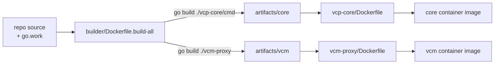

# VCM Service — Code Repository Structure

## Status

In Progress

## Date

2026-04-30

---

## TL;DR

- **Problem.** The repo is a single Go module today. Any external consumer that wants `core/` (or the soon-to-land `vlm/`) pulls the entire root module — `worker/`, every proxy, `telemetry/`, the works. There is no way to share `core` or `vlm` cleanly outside this repo.
- **End-state.** Split into peer Go modules — `core`, `database`, `hyperscaler`, `lib`, `vlm` — plus two app entrypoints: `vcp-core/` (the relocated core API server) and `vcm-proxy/` (the new gRPC binary). The root module retains today's services (`worker`, `google-proxy`, `ontap-proxy`, `oci-proxy`, `telemetry`). See [Module Dependency Graph](#module-dependency-graph).
- **Hub-and-spoke deps.** Apps go through `core`. `core` is the hub that direct-requires `database`, `hyperscaler`, `vlm`, and `lib`; apps just `require core` and pick the rest up transitively.
- **Where `vcm` fits.** `core/orchestrator/factory/` already hosts per-hyperscaler implementations of one `OrchestratorFactory` interface (`gcp/`, `oci/`). This work adds a third sibling — `core/orchestrator/factory/vcm/` — that calls into `vlm/`. `vcm-proxy` is a thin gRPC transport that runs with `HYPERSCALER=vcm` and dispatches through that interface, the same way `google-proxy` drives the `gcp/` impl today. See [Why `core` depends on `vlm`](#why-core-depends-on-vlm--the-orchestrator-pattern).
- **What is _not_ changing.** No refactor of `core/`'s internal logic. Temporal stays for `vcp-worker`, `google-proxy`, `oci-proxy`, and the relocated core API server (`vcp-core`). The "no Temporal SDK linked" goal applies *only* to the new `vcm` binary.
- **Phased delivery.** [Phase 1](#phase-1--ship-vcm-integrated-with-core-and-vlm) (5 steps) ships `vcm` integrated with `core` + `vlm` *and* relocates the existing core API server source from `core/app.go` to `vcp-core/cmd/main.go` — the image keeps its current name `core`, the Helm chart and Kubernetes manifests stay unchanged, and `core/` becomes `package main`-free at the end of Phase 1. Helpers / `database` / `hyperscaler` stay in the root module. [Phase 2](#phase-2--complete-the-four-module-option-2-end-state) (6 steps) promotes `lib` / `database` / `hyperscaler` to peer modules, applies the cycle-breakers (`core/datamodel` → `database/datamodel`, `core/errors` → `lib/errors`, `hyperscaler/ontap_provider.go` → `core/vsa/`), promotes `vcp-core/` to its own module (the source already moved in Phase 1; Phase 2 just adds `vcp-core/go.mod`), and re-points `vcm-proxy` at the new module paths. [Phase 3](#phase-3--split-existing-proxies-into-their-own-modules-post-vcm-cleanup) (housekeeping; ~1 sprint of one engineer's time, scheduled after VCM has been stable in production for ≥ 1 release) splits the existing root-resident proxies (`worker`, `google-proxy`, `oci-proxy`, `ontap-proxy`, `telemetry`) into their own modules so every binary in the repo is its own module.

---

## Overview

VCM (VSA Control Manager) is a new control-plane service packaged as a single Docker image and a single Go binary called `vcm`. The `vcm` binary is produced by a new top-level service, `vcm-proxy`, which is a gRPC server. `vcm-proxy` does not own business logic itself — it imports two libraries:

- `core` — the existing `[core/](../../../core/)` package tree, used as a library. Today it is the orchestrator service of the VCP stack. Under this design, its `package main` entrypoint is moved out so `core` is consumed only as a library.
- `vlm` — VSA Lifecycle Manager. Source moves into this repo; today it lives outside the repo and is consumed only as a container image (see `[kubernetes/vlm-worker/values.yaml](../../../kubernetes/vlm-worker/values.yaml)`).

Both `core` and `vlm` must be importable from external repositories **without dragging in unrelated parts of this repo** (e.g. `worker/`, `google-proxy/`, `ontap-proxy/`, `oci-proxy/`, `telemetry/`, `vcm-proxy/`). Today they cannot be: the whole repo is a single Go module, so any import path under it pulls the entire root module's dependency graph.

The current core API server (the HTTP server defined in `[core/app.go](../../../core/app.go)` and `[core/core-api/](../../../core/core-api/)`) **moves into a new top-level directory called `vcp-core/`**. `vcp-core` is the binary home for the core API server. It imports `core` to do orchestration. It is **not** a library to be reused elsewhere — it is the deployable shape of the existing core service, just relocated so the `core/` tree itself is library-only.

There is **no refactor of `core/`'s internal logic** in this design. Its Temporal-using packages (workflows, activities, scheduler, tasks) stay exactly where they are. The only changes to `core/` are (a) its `package main` entrypoint moves out, and (b) its import paths are rewritten to point at the new locations of the helpers it depends on.

This design also **keeps Temporal as the orchestration runtime** for the existing services that use it today: `vcp-worker` (the Temporal worker), `google-proxy`, `oci-proxy`, and the relocated core API server (`vcp-core`). Temporal is not being phased out here. The only Temporal-related dependency-hygiene goal is for the **new `vcm` binary** (`vcm-proxy`): it should avoid linking `go.temporal.io/sdk` if practical, by importing only the non-Temporal subset of `core/` (datamodel-shaped packages, validators, models). That goal is scoped strictly to `vcm` and does not apply to any other service in this repo.

This document defines the **code repository structure** for VCM:

- Where `vcm-proxy/`, `vcp-core/`, `vlm/` physically live, and what gets a separate `go.mod`.
- How shared helpers (today in `utils/`, `common/`, `clients/`, `workflow_engine/`, `core/errors/`) are placed in a generic `lib/` module so that `core`, `vlm`, `database`, and `hyperscaler` can be imported externally with a small, well-defined dependency surface.
- How `database/` and `hyperscaler/` are promoted to peer top-level modules so the DAO and the hyperscaler-client library each ship as cohesive units without being smashed into `lib/` or `core/`.
- How `worker/metrics/` (the only remaining core-aware package outside the DAO and hyperscaler trees) lands inside `core/` itself.
- How the existing core API server is relocated into `vcp-core/`.
- How the `vcm` binary is built and packaged.
- The high-level migration sequence.

It does **not** define the gRPC API surface, deployment topology, or any refactoring of `core/`'s internals. There is no Temporal phase-out — `vcp-worker`, `google-proxy`, `oci-proxy`, and `vcp-core` continue to use Temporal as today.

The migration is delivered in two phases (see [Phasing](#phasing--ship-vcm--core--vlm-first-defer-the-rest)) plus one post-rollout cleanup phase. **Phase 1** carves `core/` into its own module, lands `vlm/` source in-repo, ships the new `vcm` binary integrated with both, and relocates the existing core API server source from `core/app.go` to `vcp-core/cmd/main.go` (the image keeps its current name `core` — purely a code-side move, no operator-visible churn). Helpers, `database/`, and `hyperscaler/` stay in the root module. **Phase 2** promotes `lib/`, `database/`, and `hyperscaler/` to peer modules, applies cycle-breakers, and promotes `vcp-core/` itself to its own module — completing the four-module Option 2 end-state. **Phase 3** (post-VCM cleanup) splits the existing root-resident proxies into their own modules so every binary in the repo is its own module.

---

## Goals and Non-Goals

### Goals

- Define the top-level directory layout for `vcm-proxy/`, `vcp-core/`, `vlm/`, `lib/`, `database/`, `hyperscaler/`, and the helpers that `core` depends on.
- Define a Go module split that lets external repos `go get` `core`, `vlm`, `database`, and `hyperscaler` independently, with each pulling in only minimal, library-shaped dependencies from this repo (no services, no entrypoints, no Helm charts).
- Move the core API server (`[core/app.go](../../../core/app.go)`, `[core/core-api/](../../../core/core-api/)`) into `vcp-core/` without changing what it does or how it is deployed.
- Specify how the new and renamed binaries plug into today's `[builder/Dockerfile.build-all](../../../builder/Dockerfile.build-all)` / `[Makefile](../../../Makefile)` pipeline without introducing a parallel build system.
- Provide a high-level, incremental migration plan that keeps the existing system green throughout.
- Pin a dependency-hygiene goal for the **new `vcm` binary only** (no Temporal SDK linked into `vcm` if practical), enforced by review. This goal does **not** apply to `vcp-worker`, `google-proxy`, `oci-proxy`, or `vcp-core` — those services keep Temporal.

### Non-Goals

- **Refactoring `core/`'s logic.** Its workflows, activities, scheduler, tasks, datamodel stay as-is. No "Temporal-free execution" rework. Only import paths change.
- **Removing Temporal from any existing service.** `vcp-worker`, `google-proxy`, `oci-proxy`, and `vcp-core` keep using Temporal exactly as today. There is no phase-out plan or timeline. Only the new `vcm` binary attempts to avoid linking Temporal.
- The gRPC API surface of `vcm-proxy`.
- Helm chart and deployment topology for the `vcm` image and the relocated core API server.
- Runtime configuration / environment variables.
- Reorganization of unrelated services (`google-proxy`, `ontap-proxy`, `oci-proxy`, `worker`, `telemetry`) beyond the import-path rewrites required to track helper relocation.

---

## Background — Current State

The repository today is a **single-module Go project**:

- One root `[go.mod](../../../go.mod)` with module path `github.com/vcp-vsa-control-Plane/vsa-control-plane`.
- The only nested `go.mod` files belong to tooling and are isolated from the main build: `[cicd/go.mod](../../../cicd/go.mod)` and `[automations/tstctl/go.mod](../../../automations/tstctl/go.mod)`.

Each service is a `package main` directory at the repo root:

| Service | Path | Role |
|---|---|---|
| `core` | `[core/](../../../core/)` | Core API server, Temporal-driven orchestrator, background scheduler |
| `google-proxy` | `[google-proxy/](../../../google-proxy/)` | GCP-facing REST proxy |
| `ontap-proxy` | `[ontap-proxy/](../../../ontap-proxy/)` | ONTAP REST proxy with rule engine (see [0014](0014-ontap-proxy-rule-engine.md)) |
| `oci-proxy` | `[oci-proxy/](../../../oci-proxy/)` | OCI-facing proxy |
| `worker` | `[worker/](../../../worker/)` | Temporal worker (`vcp-worker`) |
| `telemetry` | `[telemetry/](../../../telemetry/)` | Telemetry / metrics service |

`core/`'s API server lives in:

- `[core/app.go](../../../core/app.go)` — `package main`; sets up DB, Temporal client, HTTP server, background cron.
- `[core/core-api/api.yaml](../../../core/core-api/api.yaml)` — OpenAPI spec.
- `[core/core-api/core-servergen/](../../../core/core-api/core-servergen/)` — generated server code.
- `[core/core-api/endpoints/](../../../core/core-api/endpoints/)` — handler implementations.

The remainder of `core/` (`orchestrator/`, `datamodel/`, `scheduler/`, `tasks/`, `flexcache/`, `mqos/`, `replication/`, `validators/`, `vmrs/`, `vsa/`, `errors/`, `helper/`, `inmemotasksprocessor/`, `kubernetes/`, `metricsinterface/`, `models/`, `ontap-rest/`, `sde/`) is library-shaped already.

`core/` directly imports root-level helper packages: `[utils/](../../../utils/)`, `[common/](../../../common/)`, `[database/](../../../database/)`, `[clients/](../../../clients/)`, `[hyperscaler/](../../../hyperscaler/)`, `[workflow_engine/](../../../workflow_engine/)`, `[worker/metrics](../../../worker/metrics/)`. Other services (`worker`, `google-proxy`, `ontap-proxy`, `oci-proxy`, `telemetry`) import the same set.

`[database/](../../../database/)` is internally cohesive — it is not just a bucket of generic helpers. It contains:

- `database/connection/` — connection wiring (`db.go`).
- `database/drivers/postgres/`, `database/drivers/sqllite/` — driver-specific init.
- `database/utils/` — gorm helpers, pagination, transactions, filters, logger.
- `database/metrics/` — bizops metrics aggregation DAO (`bizops_aggregate.go`, `bizops_sql.go`, its own `migrator.go`, `persistance_store.go`, `datastore.go`, `retryengine.go`).
- `database/vcp/` — VCP DAO (~70 files, every file imports `core/datamodel` and `core/errors`).

`[hyperscaler/](../../../hyperscaler/)` is similarly cohesive — it is the hyperscaler-specific client library:

- `hyperscaler/google/` — GCP API client (cert mgmt, cloud DNS, networks, secret manager).
- `hyperscaler/oci/` — OCI API client (provider, secret management).
- `hyperscaler/common/` — generic certificate / TLS helpers shared across cloud providers.
- `hyperscaler/leakedresources/` — leaked-resource detection helpers.
- `hyperscaler/models/` — shared response types (`CustomCertificateResponse`, …).
- `hyperscaler/provider.go`, `hyperscaler/ontap_provider.go`, `hyperscaler/google_services_mock.go` — provider interface plus a single ONTAP-provider factory file.

Splitting either tree across `lib/` and `core/` would shred a layer that today is one cohesive module. Both are also the natural unit of external reuse for a control plane that wants the storage schema or the cloud-API clients without the workflow logic on top.

Three root-level packages are **core-aware** today:

- `[database/vcp/](../../../database/vcp/)` — imports `core/datamodel` (e.g. `volume.UUID = utils.RandomUUID()`, returns `*datamodel.Volume`) and `core/errors` (e.g. `vsaerrors.NewVCPError(vsaerrors.ErrDatabaseDataInsertError, err)`).
- `[hyperscaler/ontap_provider.go](../../../hyperscaler/ontap_provider.go)` — imports `core/datamodel`, `core/models`, `core/orchestrator/common`, and `core/vsa`. The rest of `hyperscaler/` (the GCP/OCI/common subdirs) only imports `core/errors`. This single file is what stops `hyperscaler/` from being importable independently.
- `[worker/metrics/](../../../worker/metrics/)` — emits VCP business metrics keyed off `core/datamodel` types (e.g. `vcp_job_status_updates`, `vcp_certificate_rotation_failures_total`); imports `core/datamodel`, `core/metricsinterface`, and `worker/helper`.

A package that depends on `core` cannot also live in a module that `core` depends on, without creating a Go import cycle. See [Module Strategy](#module-strategy--options-and-recommendation) and the [Placement rule](#placement-rule-four-buckets) for how that plays out.

Approximate import counts per top-level directory (Go files referencing any of the above seven helper paths):

| Directory | Files |
|---|---|
| `core/` | ~700 |
| `clients/` | ~600 (cross-imports between generated clients) |
| `database/` | ~95 |
| `google-proxy/` | ~60 |
| `telemetry/` | ~50 |
| `utils/` | ~35 |
| `hyperscaler/` | ~35 |
| `ontap-proxy/` | ~30 |
| `workflow_engine/` | ~10 |
| `worker/`, `oci-proxy/` | ~5 each |
| `common/` | ~3 |

Build pipeline:

- `[builder/Dockerfile.build-all](../../../builder/Dockerfile.build-all)` produces a single builder image with all source mounted.
- `make build-all-binaries-prod` in `[Makefile](../../../Makefile)` runs `go build` for each service inside the builder container and emits binaries to `artifacts/`.
- Each service `Dockerfile` is a thin layer that does `COPY artifacts/<svc> /app` plus `COPY common/vsa_config /common/vsa_config`.

VLM is **not** in this repo today. It is referenced only as a Helm-deployed worker that consumes externally-built images, configured by `[kubernetes/vlm-worker/values.yaml](../../../kubernetes/vlm-worker/values.yaml)`.

---

## Module Strategy — Options and Recommendation

For `core`, `vlm`, `database`, and `hyperscaler` to be importable externally, each needs its own `go.mod`. The open question is **what to do with the generic helpers `core` depends on** (`utils/`, `common/`, `clients/`, `workflow_engine/`, `core/errors/`), because those are imported by `core`, by `database`, by `hyperscaler`, and by every other service in this repo.

`database/` and `hyperscaler/` are treated as peer top-level modules rather than helper buckets — each is internally cohesive (DAO + schema + migrations + driver init for `database`; cloud-provider-specific clients for `hyperscaler`) and is the natural unit of external reuse for consumers that want only the storage schema or only the cloud-API clients without the workflow logic on top.

`worker/metrics/` is the one remaining core-aware package outside the database and hyperscaler trees. It imports `core/datamodel` and `core/metricsinterface`, so it has to live inside `core/` regardless of which option is chosen for the generic helpers. See the [Placement rule](#placement-rule-four-buckets) below.

Three options:

### Option 1 — Helpers move INSIDE `core/`

Generic helpers are absorbed into `core/<helper>/`. The other services (`worker`, `google-proxy`, `ontap-proxy`, `oci-proxy`, `telemetry`) update their imports to point at `core/<helper>/...` paths.

- External consumption: `import "github.com/vcp-vsa-control-Plane/vsa-control-plane/core/..."` is the **only** generic-helper import path; consumers also pull `database` separately.
- Pros:
  - Single helper home — fewer module boundaries to manage.
- Cons:
  - `core/` becomes the de-facto kitchen sink (`core/utils/`, `core/clients/google-proxy-client/`, etc.). Naming gets awkward — e.g. `core/clients/google-proxy-client/` for a client used by `google-proxy` itself.
  - `core/` ends up importable as a library that contains generated clients for every cloud surface — heavy public surface.
  - Internal services (`worker`, `google-proxy`, etc.) all transitively depend on `core` even when they conceptually depend on shared helpers, blurring layering.

### Option 2 — Helpers move into a new `lib/` module; cohesive trees become peer modules

A new top-level `lib/` directory with its own `go.mod` holds the generic previously-root helpers: `lib/util/`, `lib/common/`, `lib/clients/`, `lib/workflow_engine/`, `lib/errors/`. `core`, `database`, `hyperscaler`, `vcm-proxy`, `vcp-core`, and the root services all depend on `lib/`. The cohesive trees (`database/`, `hyperscaler/`) become peer modules — each gets its own `go.mod` over its existing top-level directory and depends on `lib/` in turn. The one core-aware package outside those trees (`worker/metrics/`) moves into `core/`.

- External consumption: an external repo importing `core` pulls **four** vcp modules: `core`, `database`, `hyperscaler`, `lib`. All four are library-shaped, no services, no entrypoints. Consumers that only want the DAO can pull `database` + `lib`; consumers that only want cloud-API clients can pull `hyperscaler` + `lib`.
- Pros:
  - Clean Go-idiomatic split: workflow logic (`core`) is separate from generic helpers (`lib`), from storage (`database`), and from cloud clients (`hyperscaler`).
  - `core/` does not get bloated; its public surface stays meaningful.
  - `database/` and `hyperscaler/` are independently importable — useful for consumers that want only one of those surfaces.
  - Other services keep a clean conceptual layering (service → lib / database / hyperscaler), not (service → core → lib).
  - Each module can publish a stable v1 on its own timeline.
- Cons:
  - External consumers may pull two to four vcp modules depending on what they import. Strictly speaking, that violates a literal reading of "no other dependency in vcp repo". All are small and library-shaped, so the practical impact is minimal.
  - Four modules to version and tag instead of one. Initial release process is slightly heavier.

### Option 3 — Helpers stay in root module; export only the helper-free subset of `core` (intermediate state, not an end-state)

`core/` gets its own `go.mod`, but `lib/`, `database/`, and `hyperscaler/` are NOT yet promoted to peer modules. Helpers (`utils/`, `common/`, `clients/`, `workflow_engine/`, `core/errors/`) stay in the root module. Only the packages in `core/` that don't transitively pull a root helper become cleanly exportable: `core/models/`, `core/validators/`, etc. The Temporal/orchestrator / API-handling parts of `core/` and the entire `database/` and `hyperscaler/` trees remain locked inside the repo.

- External consumption: only a tiny helper-free subset of `core` is cleanly reachable externally; `database/` and `hyperscaler/` are unreachable.
- Pros:
  - Smallest possible migration: only `core/go.mod` and `go.work` are added; no helpers move.
  - Validates the workspace-mode CI mechanics (Makefile changes, Dockerfile changes, mockery cross-module behavior, vendor decision) on a small blast radius before the bulk helper rewrite.
- Cons:
  - Most of `core` is unavailable to external consumers as a standalone import — `core/datamodel`, `core/errors`, and the orchestrator transitively pull the root module.
  - `database/` and `hyperscaler/` cannot be imported externally at all.
  - In isolation, barely better than the status quo for external consumers.

**This option is most useful as Phase 1 of Option 2's end-state**, not as an alternative end-state. See the [Phasing](#phasing--option-3-as-phase-1-of-option-2) discussion below.

### Recommendation — Option 2 (`lib/` + peer `database/` + peer `hyperscaler/`), delivered in two phases

Adopt **Option 2** as the end-state, and reach it in two phases — Option 3 is the natural Phase 1 milestone. The end-state recommendation prioritizes long-term clarity and a clean public API surface for each module; the phasing prioritizes risk-reduction and earlier delivery of the new binaries.

End-state justification:

- The cost of pulling in three extra small, library-shaped modules (`lib`, `database`, `hyperscaler`) is negligible compared to the structural mess of pushing every helper inside `core`.
- `core` stays semantically meaningful — orchestrator / API handlers — instead of becoming the host for generated clients of every cloud, a database layer, a hyperscaler shim, and a dumping ground for utility code.
- `database` and `hyperscaler` become first-class, independently importable surfaces — useful for any future control plane that wants to read/write the same schema, or talk to GCP/OCI/ONTAP, without booting the orchestrator.
- All the other services in this repo continue to share helpers without becoming consumers of `core`. That layering matches how the codebase is reasoned about today.
- Each of `lib`, `database`, `hyperscaler`, `core` can be tightened, trimmed, or split further later, without re-shaping the others.

If a stricter reading of the requirement is mandatory ("external repos must depend on **only** `core`, period"), the design falls back to Option 1; the migration mechanics are similar but the public surface tradeoffs above apply.

The rest of this document is written assuming **Option 2** as the end-state, with the [Migration Plan](#migration-plan) split into Phase 1 and Phase 2.

### Phasing — Ship `vcm` + `core` + `vlm` first; defer the rest

The migration is split into two independently-mergeable phases (plus one post-rollout cleanup phase). The end-state remains the four-module Option 2 shape; Phase 1 lands the smallest set of modules required to ship `vcm` integrated with both `core` (as a library) and `vlm` (in-repo), and additionally moves the existing core API server source out of `core/` (image name unchanged) so that `core/` is `package main`-free. Everything else — the helper relocation, `database/` / `hyperscaler/` promotion, cycle-breakers, and the `vcp-core/` module promotion — slips to Phase 2.

| Phase | Modules created | What ships | Externally importable surface |
|---|---|---|---|
| **Phase 1** (`vcm` + `core` + `vlm` + core-API source move) | `core/go.mod`, `vlm/go.mod`, `vcm-proxy/go.mod`, root `go.work` | `vcm` binary in production. `vcm-proxy` direct-requires only `core`; `core` direct-requires `vlm`, so end-to-end the binary exercises a `vcm-proxy → core → vlm` call path. Existing core API server source relocated to `vcp-core/cmd/main.go` (artifact, image, Helm chart, manifests all still named `core` — operator-visible behavior unchanged); `core/` is `package main`-free | Helper-free subset of `core/` only (`core/models/`, `core/validators/`, …) and `vlm/` (curated to be self-contained). The orchestrator-side of `core/`, plus `database/` and `hyperscaler/`, remain root-coupled |
| **Phase 2** (rest of Option 2) | `lib/go.mod`, `database/go.mod`, `hyperscaler/go.mod`, `vcp-core/go.mod` | Cycle-breakers applied; helpers moved to `lib/`; `database/` and `hyperscaler/` promoted to peer modules; `vcp-core/` (whose source already moved in Phase 1) promoted to its own module. Image name still `core` — the optional `core → core-api` rename is a deferrable cosmetic | Full Option 2 shape: `core`, `database`, `hyperscaler`, `lib`, and `vlm` all independently importable |
| **Phase 3** (post-VCM cleanup) | `worker/go.mod`, `google-proxy/go.mod`, `oci-proxy/go.mod`, `ontap-proxy/go.mod`, `telemetry/go.mod` | The remaining root-resident proxies are split into their own modules. No code refactor — just `go.mod` per binary. After Phase 3 every binary in the repo is its own module | No change vs Phase 2 — these are services, not libraries; nothing new becomes externally importable |

Why this phasing helps:

- **Phase 1 ships the headline goal — `vcm` integrated with both `core` and `vlm` — on the shortest possible path.** Helper relocation, `database/` / `hyperscaler/` module promotion, and the `vcp-core/` carve-out are all skipped; they are work that is necessary for full external importability but not for `vcm` to function.
- **Phase 1 has a small blast radius.** Only three new modules and the in-repo landing of VLM are touched. The risky parts of the migration (workspace-mode CI mechanics, Makefile / Dockerfile / mockery edits, the `vendor/` policy decision, the in-repo VLM build pipeline) all get exercised at that small scope.
- **Phase 2 is mostly mechanical** once Phase 1 is live: the workspace mechanics are proven, so the bulk helper move, cycle-breakers, and `vcp-core/` relocation are import-path rewrites against a known-good baseline.
- **Each phase is independently mergeable and shippable.** If Phase 2 is ever blocked or deferred, the repo is in a sensible intermediate state at the end of Phase 1: `vcm` is running with `core` + `vlm`; the existing core API server is still running from `core/app.go`; the rest of the codebase is unchanged.

Trade-offs of putting `vcm + core + vlm` first and deferring everything else to Phase 2:

- **External importability of `database/`, `hyperscaler/`, and the orchestrator-side of `core/` is delayed** until Phase 2. In Phase 1, only the helper-free subset of `core/` and the self-contained `vlm/` module are cleanly importable. If an external consumer is waiting on `database/` or `hyperscaler/` specifically, that consumer waits for Phase 2.
- **The existing core API server keeps running from `core/app.go`** during Phase 1. That means the `core/` module retains a `package main` at its root, so `import "github.com/.../core"` (the module root) is not usable as a library — but sub-package imports (`core/models`, `core/datamodel`, …) work fine. The `vcp-core/` rename ships in Phase 2.
- **The Temporal-avoidance soft goal for `vcm`** (avoid linking `go.temporal.io/sdk` if practical) is harder in Phase 1 because the helper-free subset of `core/` that `vcm` can safely import is smaller than it will be in Phase 2 (some helpers `vcm` would want still live in the root module). Reviewer-watched in Phase 1; revisit after Phase 2.

The eight-step [Migration Plan](#migration-plan) below is grouped into these two phases.

---

## Proposed Top-Level Layout

```
vsa-control-plane/
|
|-- NEW directories
|     |-- vcm-proxy/      gRPC server, builds vcm binary
|     |-- vcp-core/       core API server entrypoint
|     |-- vlm/            VLM library, source moved in
|     |-- lib/            generic helpers, library-only
|     `-- go.work         root workspace file
|
|-- EXISTING dirs (new go.mod added)
|     |-- core/           library, OWN go.mod now
|     |-- database/       DAO + schema, OWN go.mod now
|     `-- hyperscaler/    cloud-API clients, OWN go.mod now
|
|-- EXISTING (layout unchanged, imports rewritten)
|     |-- google-proxy/
|     |-- ontap-proxy/
|     |-- oci-proxy/
|     |-- worker/
|     `-- telemetry/
|
`-- Build / packaging
      |-- builder/Dockerfile.build-all   extended to build vcm (core build path swap; artifact still named core)
      `-- Makefile                       new vcm targets; existing core targets get path swap only
```

Concrete additions, moves, and renames on disk:

```
vsa-control-plane/

  vcm-proxy/                      # NEW: gRPC server; produces the `vcm` binary
    go.mod                        # NEW module
    Dockerfile
    Dockerfile.dev
    main.go
    server/                       # gRPC server wiring
    handler/                      # gRPC handlers; thin adapters that call core / vlm

  vcp-core/                       # NEW: home of the relocated core API server
    go.mod                        # NEW module
    Dockerfile                    # MOVED from core/Dockerfile (adapted)
    Dockerfile.dev                # MOVED from core/Dockerfile.dev (adapted)
    cmd/
      main.go                     # MOVED from core/app.go
    api.yaml                      # MOVED from core/core-api/api.yaml
    server/                       # MOVED from core/core-api/core-servergen/
    handlers/                     # MOVED from core/core-api/endpoints/

  core/                           # gets its OWN go.mod
    go.mod                        # NEW
    orchestrator/ scheduler/ tasks/ flexcache/ mqos/ replication/
    validators/ vmrs/ vsa/ helper/ inmemotasksprocessor/ kubernetes/
    metricsinterface/ models/ ontap-rest/ sde/        # all unchanged content
    metrics/                      # MOVED from worker/metrics/ (core-aware: imports core/metricsinterface)
    vsa/provider_factory.go       # MOVED from hyperscaler/ontap_provider.go (cycle-breaker)
    # NOTE: datamodel/ and errors/ are NOT here anymore — see database/ and lib/ below

  database/                       # EXISTING top-level dir; only the go.mod is new
    go.mod                        # NEW (promotes the existing tree to its own module)
    connection/                   # unchanged
    drivers/                      # unchanged (postgres/, sqllite/)
    utils/                        # unchanged
    metrics/                      # unchanged (bizops aggregation DAO)
    vcp/                          # unchanged (the VCP DAO)
    datamodel/                    # MOVED from core/datamodel/ — schema lives next to the DAO

  hyperscaler/                    # EXISTING top-level dir; only the go.mod is new
    go.mod                        # NEW (promotes the existing tree to its own module)
    google/                       # unchanged (GCP client)
    oci/                          # unchanged (OCI client)
    common/                       # unchanged (shared cert/TLS helpers)
    leakedresources/              # unchanged
    models/                       # unchanged (response types)
    provider.go                   # unchanged (interface)
    google_services_mock.go       # unchanged
    # NOTE: ontap_provider.go is REMOVED from here (cycle-breaker — see below)

  lib/                            # NEW: generic helpers, library-only module (no core/db/hyperscaler/vlm deps)
    go.mod                        # NEW
    util/                         # MOVED from utils/
    common/                       # MOVED from common/
    clients/                      # MOVED from clients/
    workflow_engine/              # MOVED from workflow_engine/
    errors/                       # MOVED from core/errors/ — shared error registry

  vlm/                            # NEW: importable VLM library; source moved in
    go.mod                        # NEW
    ...

  go.work                         # NEW: ties root + core + database + hyperscaler + lib + vlm + vcm-proxy + vcp-core

  google-proxy/ ontap-proxy/ oci-proxy/ worker/ telemetry/
                                  # stay in root module; imports rewritten to point at:
                                  #   lib/...          (generic helpers)
                                  #   database/...     (storage layer + datamodel)
                                  #   hyperscaler/...  (cloud-API clients)
                                  #   core/...         (only where they consume core packages directly)

  builder/Dockerfile.build-all    # extended to build vcm (core build path swap; artifact still named core)
  Makefile                        # extended with vcm targets; core targets get path swap only
```

What stays in `core/` (unchanged content):

- `core/orchestrator/`, `core/scheduler/`, `core/tasks/`, `core/flexcache/`, `core/mqos/`, `core/replication/`, `core/validators/`, `core/vmrs/`, `core/vsa/`, `core/helper/`, `core/inmemotasksprocessor/`, `core/kubernetes/`, `core/metricsinterface/`, `core/models/`, `core/ontap-rest/`, `core/sde/`.

What leaves `core/`:

- `core/datamodel/` → `database/datamodel/`. The storage schema definitions naturally belong with the DAO that reads/writes them, and this relocation is what breaks the `core ↔ database/vcp` import cycle. Tiny refactor required: `core/datamodel/models.go` references `models.HybridReplicationStatus` and `models.ClusterPeeringStatus` from `core/models/` — those two enums move with `datamodel/` (or get inlined into `database/datamodel/`) so the new `database/` module has no `core/` imports.
- `core/errors/` → `lib/errors/`. The error registry (`errors.go`, `errors.json`, `errorhandler.go`, `ontap_error_classifier.go`) is shared by `core/`, `database/vcp/`, and `hyperscaler/`. Library-shaped, no business logic.

What moves **into** `core/` (the two core-aware relocations):

- `[worker/metrics/](../../../worker/metrics/)` → `core/metrics/`. Emits VCP business metrics keyed off `core/datamodel` types (e.g. `vcp_job_status_updates`, `vcp_certificate_rotation_failures_total`). After the relocation it imports `database/datamodel` (was `core/datamodel`) and `core/metricsinterface`. Still core-aware via `metricsinterface`, so it has to live inside `core/`.

  *Impact on `vcp-worker`:* none functionally. The `vcp-worker` binary (`[worker/main.go](../../../worker/main.go)`) is the primary consumer of this package — it calls 12 `metrics.Register*()` functions at startup and constructs `metrics.NewPrometheusCmekBackupMetricsEmitter()` / `metrics.NewPrometheusKmsMetricsEmitter()` to inject into Temporal activities. The move only changes the import path (`.../worker/metrics` → `.../core/metrics`); the package basename `metrics` is preserved so all call sites stay textually identical. All Prometheus metric names (`vcp_job_status_updates`, `vcp_certificate_rotation_failures_total`, `vcp_kms_key_limit_reached_total`, …) are unchanged, so dashboards and alerts continue to work without modification. The full set of usages of `core/datamodel` from this package is just two slice element types — `[]*datamodel.Volume` and `[]*datamodel.ExpertModeVolumes` — both used in function signatures (`EmitAutoTierEnabledMetric`, `EmitCRREnabledMetric`, `EmitLargeVolumeEnabledMetric`, `EmitCBSEnabledMetric`, `EmitEligibilityStringMetric`); these resolve through `database/datamodel` after Step 3 with no symbol renames.

  One thing to handle deliberately: `[worker/metrics/scheduler_metrics.go](../../../worker/metrics/scheduler_metrics.go)` calls `otel.Meter("github.com/vcp-vsa-control-Plane/vsa-control-plane/worker/metrics")` to construct its OTel meter. That string is the **instrumentation library name** that appears in OTel resource labels and on `target_info`. To avoid disrupting existing dashboards or alert queries keyed on this name, the migration should hard-code the historical `".../worker/metrics"` string in `core/metrics/scheduler_metrics.go` rather than letting it follow the new package path.

- `[hyperscaler/ontap_provider.go](../../../hyperscaler/ontap_provider.go)` → `core/vsa/provider_factory.go`. This single file is what stops `hyperscaler/` from being importable independently — it imports `core/datamodel`, `core/models`, `core/orchestrator/common`, and `core/vsa`. Its `GetProviderByNode` / `_getProviderByNodeWithFastConnection` functions build a `vsa.Provider` from a DB `Node`, which is workflow-level glue rather than a hyperscaler primitive. Once relocated, `hyperscaler/` only depends on `lib/` and third-party SDKs.

What moves to `vcp-core/`:

- `core/app.go` → `vcp-core/cmd/main.go` (the `main` entrypoint, OTel setup, DB init, Temporal client init, HTTP server, background cron).
- `core/core-api/api.yaml` → `vcp-core/api.yaml`.
- `core/core-api/core-servergen/` → `vcp-core/server/` (regenerated; updated `[Makefile](../../../Makefile)` `generate-core-api` target).
- `core/core-api/endpoints/` → `vcp-core/handlers/`.
- `core/Dockerfile`, `core/Dockerfile.dev`, `core/air.toml`, `core/cloud-run-deployer.Dockerfile`, `core/migrate.Dockerfile` → analogous files under `vcp-core/`.

What becomes the new `database/` module (the directory is already at the repo root today; "new" here means the Go module, not the directory):

- `database/connection/`, `database/drivers/`, `database/utils/`, `database/metrics/`, `database/vcp/` stay exactly where they are on disk; they get a single new `database/go.mod` placed at the top of the existing tree.
- `core/datamodel/` → `database/datamodel/` (cycle-breaker, see above) — this is the only physical move into `database/`.

What becomes the new `hyperscaler/` module (same pattern — directory already at the root, only the Go module is new):

- `hyperscaler/google/`, `hyperscaler/oci/`, `hyperscaler/common/`, `hyperscaler/leakedresources/`, `hyperscaler/models/`, `hyperscaler/provider.go`, `hyperscaler/google_services_mock.go` stay exactly where they are on disk; they get a single new `hyperscaler/go.mod` placed at the top of the existing tree.
- `hyperscaler/ontap_provider.go` → `core/vsa/provider_factory.go` (cycle-breaker, see above) — this is the only physical move *out of* `hyperscaler/`.

After the cycle-breaker, `hyperscaler/`'s only repo-internal dependency is `lib/` (for `lib/errors`, and a couple of `lib/util` helpers via the existing `vsaerrors` and `utils.RandomUUID`-style usage).

What moves to `lib/` (generic helpers only — nothing in this list imports `core/`, `database/`, `hyperscaler/`, or `vlm/`):

- `utils/` → `lib/util/`.
- `common/` → `lib/common/`.
- `clients/` → `lib/clients/`.
- `workflow_engine/` → `lib/workflow_engine/`.
- `core/errors/` → `lib/errors/` (the cycle-breaker for the error registry).

> Notably absent from `lib/`: anything under `database/` or `hyperscaler/`. The DAO and the cloud-API clients are their own modules, not helper buckets. And `worker/metrics/` is still core-aware → routed into `core/` not `lib/`.

### Placement rule: four buckets

Whenever a package is being moved out of the root (or being added new), run this check first:

```bash
rg -l 'vsa-control-plane/(core|database|hyperscaler|vlm)/' <package-dir>
```

| Hits | Bucket |
|---|---|
| Zero | Generic helper → `lib/`. |
| `database/...` only | Storage-layer code → `database/`. |
| `hyperscaler/...` only | Cloud-API client code → `hyperscaler/`. |
| `core/...` or `vlm/...` (alone or with any of the others) | Core- or VLM-aware → inside `core/`. (`core` is the only in-repo module that imports `vlm`; `vlm` itself is curated to be self-contained.) |

Today this rule routes:

- `database/{connection,drivers,utils,metrics,vcp}/` plus `core/datamodel/` → `database/`.
- `hyperscaler/{google,oci,common,leakedresources,models}/` plus `provider.go` and `google_services_mock.go` → `hyperscaler/`.
- `worker/metrics/` and `hyperscaler/ontap_provider.go` → `core/`.
- All other helpers → `lib/`.

If a future package drifts into importing `core/`, the same check catches it and the package gets relocated rather than smuggled into `lib/`, `database/`, or `hyperscaler/`.

What stays put:

- `worker/`, `google-proxy/`, `ontap-proxy/`, `oci-proxy/`, `telemetry/` keep their physical locations. Their internal logic is untouched; only their `import` blocks change to reference `lib/...`, `database/...`, and `core/...` as appropriate.

---

## Module Dependency Graph

### Why `core` depends on `vlm` — the orchestrator pattern

`core/` already exposes a single `OrchestratorFactory` interface in `[core/orchestrator/factory/orchestrator.go](../../../core/orchestrator/factory/orchestrator.go)` that covers ~190 operations (pools, volumes, snapshots, replications, backups, ADs, KMS, …). Multiple per-hyperscaler implementations of that interface live as siblings under `core/orchestrator/factory/`:

```
core/orchestrator/factory/
  orchestrator.go              # the OrchestratorFactory interface + GetOrchestratorForProvider() dispatch
  gcp/                         # gcp.NewGCPOrchestrator()  — used when HYPERSCALER=gcp (the default)
  oci/                         # oci.NewOCIOrchestrator()  — used when HYPERSCALER=oci
  vcm/                         # NEW: vcm.NewVCMOrchestrator() — used when HYPERSCALER=vcm
```

The new `vcm/` implementation is **parallel to `gcp/` and `oci/`** — same interface, same factory dispatch, different backend. Where `gcp/` calls into `hyperscaler/google/` and `oci/` calls into `hyperscaler/oci/`, the `vcm/` implementation calls into `vlm/`. `GetOrchestratorForProvider()` grows a `commonparams.ProviderVCM` case that returns the new orchestrator.

This is what concretely puts `vlm` into `core/go.mod` as a `require`: the vcm-flavored orchestrator is a `core/` package that imports `vlm/` packages. The `vcm-proxy` binary then sets `HYPERSCALER=vcm` at startup; its gRPC handlers translate gRPC requests into `OrchestratorFactory` method calls, which dispatch to the `vcm` implementation, which dispatches to `vlm/`. `vcm-proxy` itself never imports `vlm/` directly — it's purely a transport over `core`'s already-defined interface, the same way `google-proxy` is a transport for the `gcp/` implementation today.

```
                                                  +-----> hyperscaler/google
                          +--> orchestrator/factory/gcp -+
                          |
   gRPC request    HTTP   |                              +-----> hyperscaler/oci
       ===> vcm-proxy ====|--> core.OrchestratorFactory -|
                          |   (GetOrchestratorForProvider)|
                          +--> orchestrator/factory/oci  -+
                          |
                          +--> orchestrator/factory/vcm -+
                                                          +-----> vlm
```

### Module-level dependency graph

```
   +---------------+  +-------------+  +----------+  +-----------+
   | External repo |  | root module |  | vcp-core |  | vcm-proxy |
   +-------+-------+  +------+------+  +----+-----+  +-----+-----+
           |                 |              |              |
           +-----------------+--------------+--------------+
                                    |
                                    v
                                +------+
                                | core |                              hub
                                +--+---+
                                   |
              +--------------------+--------------------+
              |                    |                    |
              v                    v                    v
        +----------+        +-------------+          +-----+
        | database |        | hyperscaler |          | vlm |       peer libs
        +----+-----+        +------+------+          +-----+
             |                     |
             +----------+----------+
                        |
                        v
                     +-----+
                     | lib |                                          leaf
                     +-----+

  External repo  =  any control plane / tool that imports vsa-control-plane
                    modules from outside this repo.
  root module    =  the residual github.com/vcp-vsa-control-Plane/vsa-control-plane
                    module after Phase 2 - hosts the existing services
                    (worker, google-proxy, ontap-proxy, oci-proxy, telemetry).

  Architectural intent: apps go through `core`. `core` is the public API
  for orchestration, lifecycle, storage, and cloud operations - it owns
  the dependencies on `database`, `hyperscaler`, `vlm`, and `lib`. Apps
  do not need to direct-`require` the peer libs to function; they get
  them transitively through `core`.

  Direct `require` edges (what each go.mod actually lists):

    External repo  ->  core             (typical case; advanced consumers
                                         can also pull `database`,
                                         `hyperscaler`, `vlm`, or `lib`
                                         standalone for narrow surfaces)
    vcm-proxy      ->  core             (clean - new code, no legacy
                                         imports of peer libs)
    vcp-core       ->  core, database,  (legacy: the relocated
                       hyperscaler, lib  core/app.go code already imports
                                         these directly; out of scope to
                                         refactor in this design)
    root module    ->  core, database,  (same legacy reason - existing
                       hyperscaler, lib  worker/google-proxy/... services
                                         retain their direct imports)
    core           ->  database, hyperscaler, vlm, lib
    database       ->  lib
    hyperscaler    ->  lib
    vlm            ->  (self-contained, no in-repo deps)
    lib            ->  (leaf, no deps)

  The edge is one-way (core -> vlm, never the reverse), so `vlm` stays
  cycle-free and externally importable as a standalone module.
```

Key invariants:

- `lib` depends on nothing else from this repo. It is the shared library substrate.
- `database` depends only on `lib`. It does **not** depend on `core`, `hyperscaler`, `vlm`, `vcm-proxy`, `vcp-core`, or the root module.
- `hyperscaler` depends only on `lib`. It does **not** depend on `core`, `database`, `vlm`, `vcm-proxy`, `vcp-core`, or the root module.
- `vlm` depends on nothing else from this repo. The edge is `core → vlm`, never the reverse, so `vlm` stays self-contained and the graph is cycle-free. External consumers can still pull `vlm` standalone.
- `core` is the **single hub** that owns the dependencies on `database`, `hyperscaler`, `lib`, and `vlm`. The `vlm` dep is concrete: a new `core/orchestrator/factory/vcm/` package implements the existing `OrchestratorFactory` interface (parallel to the `gcp/` and `oci/` implementations) and dispatches to `vlm`. See [Why `core` depends on `vlm`](#why-core-depends-on-vlm--the-orchestrator-pattern). `core` does **not** depend on the root module, on `vcm-proxy`, or on `vcp-core`.
- **Apps go through `core`.** New code (`vcm-proxy`) direct-requires only `core` and gets `database`, `hyperscaler`, `vlm`, and `lib` transitively. Existing apps (`vcp-core` after relocation, plus the root services `worker`, `google-proxy`, `ontap-proxy`, `oci-proxy`, `telemetry`) keep their pre-existing direct imports of `database/`, `hyperscaler/`, and the helpers — refactoring them to "go through `core`" is out of scope for this design.
- External consumers typically pull just `core` and let it transitively bring in `database` + `hyperscaler` + `lib` + `vlm`. Advanced consumers that want a narrow surface can pull any subset of `{database, hyperscaler, lib, vlm}` standalone — for example, a tool that only needs the storage schema can pull `database` alone (which transitively pulls only `lib`).
- External consumers do **not** pull `worker`, `google-proxy`, `ontap-proxy`, `oci-proxy`, `telemetry`, `vcm-proxy`, or `vcp-core`.
- Root services keep working because their imports are rewritten from root paths (`utils`, `database`, `hyperscaler`, `core/datamodel`, `core/errors`, …) to the new `lib/...`, `database/...`, `hyperscaler/...`, `core/...` paths (most of these stay textually identical — only `core/datamodel`, `core/errors`, `utils`, `common`, `clients`, `workflow_engine` change).

---

## How Components Consume Each Other

Once `core/`, `database/`, `hyperscaler/`, `lib/`, and the rest are separate modules, code inside `core/` no longer reaches `utils/`, `database/`, `hyperscaler/`, etc. as if they were sibling packages of one big module. Instead, every cross-module reference goes through three layers: the Go source-level `import` statement, the consuming module's `go.mod`, and the local `go.work` overlay used during development.

### Source-level imports

The actual Go code in any `core/` package changes only its import paths — nothing else. Every existing function call, struct, and type stays the same.

Before, in (for example) `core/orchestrator/activities/common_activities.go`:

```go
import (
    "github.com/vcp-vsa-control-Plane/vsa-control-plane/core/datamodel"
    vsaerrors "github.com/vcp-vsa-control-Plane/vsa-control-plane/core/errors"
    "github.com/vcp-vsa-control-Plane/vsa-control-plane/database/utils"
    database "github.com/vcp-vsa-control-Plane/vsa-control-plane/database/vcp"
    "github.com/vcp-vsa-control-Plane/vsa-control-plane/hyperscaler/google"
    "github.com/vcp-vsa-control-Plane/vsa-control-plane/utils/middleware/log"
    "github.com/vcp-vsa-control-Plane/vsa-control-plane/workflow_engine/temporal"
    "github.com/vcp-vsa-control-Plane/vsa-control-plane/worker/metrics"
)
```

After:

```go
import (
    // generic helpers — moved to lib/
    vsaerrors "github.com/vcp-vsa-control-Plane/vsa-control-plane/lib/errors"
    "github.com/vcp-vsa-control-Plane/vsa-control-plane/lib/util/middleware/log"
    "github.com/vcp-vsa-control-Plane/vsa-control-plane/lib/workflow_engine/temporal"

    // storage layer + schema — same database/ tree as today, now its own Go module
    "github.com/vcp-vsa-control-Plane/vsa-control-plane/database/datamodel"  // MOVED from core/datamodel/
    "github.com/vcp-vsa-control-Plane/vsa-control-plane/database/utils"      // path unchanged
    database "github.com/vcp-vsa-control-Plane/vsa-control-plane/database/vcp"  // path unchanged

    // cloud-API clients — same hyperscaler/ tree as today, now its own Go module
    "github.com/vcp-vsa-control-Plane/vsa-control-plane/hyperscaler/google"  // path unchanged

    // core-aware relocation — moved INTO core/
    "github.com/vcp-vsa-control-Plane/vsa-control-plane/core/metrics"
)
```

Four buckets, four import-path prefixes. Most package basenames stay textually unchanged; what changes is which `go.mod` Go resolves the import against. Specifically:

- `core/datamodel/` → `database/datamodel/` (schema travels with the DAO)
- `core/errors/` → `lib/errors/` (registry shared by core, database, and hyperscaler)
- `database/{connection,drivers,utils,metrics,vcp}/` keeps its physical path but is now its own module
- `hyperscaler/{google,oci,common,leakedresources,models}/` keeps its physical path but is now its own module
- `hyperscaler/ontap_provider.go` → `core/vsa/provider_factory.go` (the cycle-breaker)
- `worker/metrics/` → `core/metrics/`
- everything else (root `utils/`, `common/`, `clients/`, `workflow_engine/`) → `lib/...`

This rewrite is mechanical (Phase 2 Step 3 of the [Migration Plan](#migration-plan)) and applies symmetrically to every other module that consumes these paths — `vcp-core`, `vcm-proxy`, and the existing root services (`worker`, `google-proxy`, `ontap-proxy`, `oci-proxy`, `telemetry`).

### Module-level dependency declarations

Each module's `go.mod` lists what it depends on. Go treats inter-module references in this repo exactly like any other third-party module, even though they happen to live under the same git tree.

`lib/go.mod` (no other repo deps):

```
module github.com/vcp-vsa-control-Plane/vsa-control-plane/lib

go 1.24

require (
    // third-party only — gorm/postgres/temporal/etc. as needed by the helpers
    gorm.io/gorm v1.25.0
    // ...
)
```

`database/go.mod`:

```
module github.com/vcp-vsa-control-Plane/vsa-control-plane/database

go 1.24

require (
    github.com/vcp-vsa-control-Plane/vsa-control-plane/lib v0.1.0

    // third-party DAO deps
    gorm.io/gorm v1.25.0
    gorm.io/driver/postgres v1.5.0
    // ...
)
```

`hyperscaler/go.mod`:

```
module github.com/vcp-vsa-control-Plane/vsa-control-plane/hyperscaler

go 1.24

require (
    github.com/vcp-vsa-control-Plane/vsa-control-plane/lib v0.1.0

    // third-party cloud SDK deps
    cloud.google.com/go/compute v1.x.x
    cloud.google.com/go/secretmanager v1.x.x
    github.com/oracle/oci-go-sdk/v65 v65.x.x
    // ...
)
```

`core/go.mod`:

```
module github.com/vcp-vsa-control-Plane/vsa-control-plane/core

go 1.24

require (
    github.com/vcp-vsa-control-Plane/vsa-control-plane/database    v0.1.0
    github.com/vcp-vsa-control-Plane/vsa-control-plane/hyperscaler v0.1.0
    github.com/vcp-vsa-control-Plane/vsa-control-plane/lib         v0.1.0
    github.com/vcp-vsa-control-Plane/vsa-control-plane/vlm         v0.1.0  // pulled in by core/orchestrator/factory/vcm/

    // third-party deps that core uses directly
    go.temporal.io/sdk v1.33.0
    github.com/google/uuid v1.6.0
    // ...
)
```

`vcm-proxy/go.mod` follows the "apps go through `core`" rule and is minimal — `database`, `hyperscaler`, `vlm`, and `lib` come in transitively through `core`:

```
module github.com/vcp-vsa-control-Plane/vsa-control-plane/vcm-proxy

go 1.24

require (
    github.com/vcp-vsa-control-Plane/vsa-control-plane/core v0.1.0

    // gRPC deps
    google.golang.org/grpc v1.79.3
    // ...
)
```

After `go mod tidy`, `vcm-proxy/go.mod` will also list `database`, `hyperscaler`, `lib`, and `vlm` as `// indirect` requires (Go's standard treatment of transitive deps), but they are not first-class requires of the `vcm-proxy` module.

`vcp-core/go.mod` is the legacy shape: it direct-requires `core`, `database`, `hyperscaler`, and `lib` because the relocated `core/app.go` and `core/core-api/` code already imports those packages directly. Refactoring `vcp-core` to "go through `core`" is out of scope for this design — it would touch every handler in the existing core API server. `vlm` shows up only as `// indirect` in `vcp-core/go.mod` (transitive via `core`).

`vlm/go.mod` is independent and intentionally lean — it does **not** require `core`, `database`, `hyperscaler`, or `lib`. The edge is one-way (`core → vlm`), which keeps `vlm` cycle-free and standalone-importable.

The root module's `go.mod` keeps its existing direct requires on `database`, `hyperscaler`, and the helpers (now `lib/...`), and adds `core` for the same legacy reason — `worker`, `google-proxy`, etc. already import those packages directly today.

The root module's `go.mod` adds `core`, `database`, `hyperscaler`, and `lib` to its own `require` list so the existing services (`worker`, proxies, `telemetry`) can resolve them after the import-path rewrite.

### Local development with `go.work`

The risk of multi-module is "I edited `lib/foo.go` but `core` still builds against the released version of `lib`". A root `go.work` file solves it:

```
go 1.24

use (
    .
    ./core
    ./database
    ./hyperscaler
    ./lib
    ./vlm
    ./vcp-core
    ./vcm-proxy
)
```

When `go.work` is present, Go's resolver overrides the `require` lines in every module's `go.mod` for the modules listed in `use`. So during local development:

- Building `./core/...` resolves `import ".../database/vcp"` to `./database/vcp/` on disk, **not** to whatever `database v0.1.0` was tagged as.
- Editing `database/vcp/volumes.go` is immediately visible when `go test ./core/...` is run.
- No `replace` directives, no `go mod tidy` dance, no separate clones.

For CI / production builds inside `[builder/Dockerfile.build-all](../../../builder/Dockerfile.build-all)`, `go.work` is automatically picked up because the whole repo is mounted at `/src` and `GOWORK=auto` is the Go default.

For external consumers, `go.work` does not exist in their checkout — they consume `core` (or `database`, `hyperscaler`, `lib`, `vlm`) at a tagged version, and Go's resolver follows the `require` lines in the tagged `go.mod`. For when internal PRs must bump those `require` lines vs when workspace mode covers `vcp-worker` / `google-proxy` builds, see [Version bumps, semver tags, and CI (when it matters)](#version-bumps-semver-tags-and-ci-when-it-matters) below.

```mermaid
flowchart LR
    subgraph local [Local development - go.work overrides]
        coreLocal[core/orchestrator/*.go<br/>imports database/vcp/* and hyperscaler/google/*]
        dbLocal[./database/vcp/*.go<br/>edits seen instantly]
        hsLocal[./hyperscaler/google/*.go<br/>edits seen instantly]
        coreLocal -.->|"go.work"| dbLocal
        coreLocal -.->|"go.work"| hsLocal
    end

    subgraph release [External consumption - resolves to tagged module]
        coreReleased["core@v0.1.0<br/>(go.mod: require database, hyperscaler, lib)"]
        dbReleased[database@v0.1.0]
        hsReleased[hyperscaler@v0.1.0]
        libReleased[lib@v0.1.0]
        coreReleased -->|"go get"| dbReleased
        coreReleased -->|"go get"| hsReleased
        coreReleased -->|"go get"| libReleased
        dbReleased -->|"go get"| libReleased
        hsReleased -->|"go get"| libReleased
    end
```

### What contributors actually need to do

| Task | What changes |
|---|---|
| Add a function to `lib/util/` and call it from `core/` | Edit both files. `go.work` makes the change visible immediately. No version bump required during development |
| Add a column to a `database/vcp/` model | Edit the struct in `database/vcp/` (or schema in `database/datamodel/`). `core/` picks it up via `go.work`. No version bump required during development |
| Cut a release of `core` | Tag `lib/v0.x.y` first, then `database/v0.x.y` and `hyperscaler/v0.x.y` (their `require lib` lines are current), then `core/v0.x.y` (its `require database, hyperscaler, lib` are current). |
| Pull a fresh clone and build | `git clone` then `go build ./...`. `go.work` is committed; nothing else to configure |
| Refactor an `import` block to use the new paths | One-time scripted sed at migration time (Step 3 of [Phase 2](#phase-2--complete-the-four-module-option-2-end-state)); afterwards new code uses the new paths from day one |

### Version bumps, semver tags, and CI (when it matters)

This section answers: *“If `lib` changes but `core/go.mod` does not bump its `require` on `lib`, will root services like `vcp-worker` or `google-proxy` miss the change?”*

**Inside this repository (normal PR flow, Phase 2 end-state): no — as long as workspace mode is active.**

- Root binaries (`./worker` → `vcp-worker`, `./google-proxy` → `google-proxy`, etc.) are built with `go build ./worker`, `go build ./google-proxy` from the repo root, with the **full tree** present (see `[Makefile](../../../Makefile)` `build-all-binaries-*` and `[builder/Dockerfile.build-all](../../../builder/Dockerfile.build-all)` `COPY . /src`).
- The committed root `[go.work](../../../go.work)` must list **every** peer library module (`./core`, `./lib`, `./database`, `./hyperscaler`, `./vlm`, `./vcp-core`, `./vcm-proxy` in the Phase 2 shape). With `GOWORK=auto` (the default), Go resolves those modules to the **directories in the clone**, overriding the semver in each `go.mod`'s `require` lines for workspace members.
- Therefore: editing `lib/…` and `core/…` in the same branch **does not** require bumping `core`’s `require` on `lib` for `go build ./google-proxy` or `go build ./worker` to compile against the **current** `lib` sources. The same applies transitively (`core` → `database` → `lib`, etc.).

**When semver `require` bumps and per-module tags *do* matter:**

- **External consumers** cloning only module zips from the proxy — they have **no** `go.work`; Go follows the **`require`** graph in the tagged `go.mod` files. Publishing a new **`core/v…`** tag usually means updating `core/go.mod` to **`require`** the **`lib`**, **`database`**, and **`hyperscaler`** versions you intend to support, then tagging those modules in dependency order (see the “Cut a release of `core`” row in [What contributors actually need to do](#what-contributors-actually-need-to-do) above).
- **Documenting the minimum API contract** — even for in-repo work, `require` lines record “`core` at this commit expects at least `lib` v0.3.x” for reviewers and for any workflow that runs with **`GOWORK=off`**.
- **Any automation that disables the workspace** — e.g. `GOWORK=off`, or a partial checkout that omits `go.work` / a `use` entry — falls back to module-cache resolution and **will** pin to whatever semver appears in `go.mod`/`go.sum`. That is the main foot-gun to avoid in CI.

**How CI / the build pipeline should handle it:**

1. **Keep `go.work` committed and complete** for the Phase 2 layout (extend the root `use ( … )` list whenever a new top-level module is added). Do not drop a peer module from `go.work` while code still imports it through workspace paths.
2. **Do not set `GOWORK=off`** in GitHub Actions, Jenkins, or Docker build stages that run `go test ./...`, `go build ./worker`, `go build ./google-proxy`, `build-all-binaries-*`, or generators that resolve cross-module packages. Prefer leaving `GOWORK` unset (`auto`). Optionally add an explicit guard in CI: fail fast if `GOWORK` is set to `off` (already flagged in [Multi-module gotchas to flag in CI](#multi-module-gotchas-to-flag-in-ci) below).
3. **Treat `make verify-tidy` as the merge gate** — it ensures each module’s `go.mod`/`go.sum` is consistent with `go mod tidy` at the versions recorded in files. That catches accidental drift; it does **not** replace the need to **manually** bump cross-module `require` versions when cutting **external-facing releases** (tag bumps), which remains a release-engineering step.
4. **Docker / builder images** should continue **`COPY . /src`** (or equivalent) so `go.work` lands next to the modules; partial copies that omit `go.work` break the model.

In short: **day-to-day merges rely on `go.work` so root services always see the `lib`/`core`/`database` sources in the branch.** **Semver tags and `require` bumps are for external consumption, reproducible snapshots, and any non-workspace build — not for every internal `lib` edit.**

---

## External Consumption Contract

| Concern | Rule |
|---|---|
| **`core` module path** | `github.com/vcp-vsa-control-Plane/vsa-control-plane/core` |
| **`database` module path** | `github.com/vcp-vsa-control-Plane/vsa-control-plane/database` |
| **`hyperscaler` module path** | `github.com/vcp-vsa-control-Plane/vsa-control-plane/hyperscaler` |
| **`lib` module path** | `github.com/vcp-vsa-control-Plane/vsa-control-plane/lib` |
| **`vlm` module path** | `github.com/vcp-vsa-control-Plane/vsa-control-plane/vlm` |
| **Versioning** | Per-module semver tags: `core/v0.1.0`, `database/v0.1.0`, `hyperscaler/v0.1.0`, `lib/v0.1.0`, `vlm/v0.1.0`, `vcp-core/v0.1.0`, `vcm-proxy/v0.1.0`. The root module continues using its existing tag stream |
| **Public surface** | Only packages directly under each module's root are public. Anything under `core/internal/`, `database/internal/`, `hyperscaler/internal/`, `lib/internal/`, or `vlm/internal/` is unexported and may change without notice |
| **What an external repo needs** | `import` from any subset of `{core, database, hyperscaler, lib, vlm}` directly. They get **none** of `worker`, `google-proxy`, `ontap-proxy`, `oci-proxy`, `telemetry`, `vcm-proxy`, or `vcp-core` |
| **Forbidden imports in `vlm`** | Same hygiene rules as `[.cursor/rules/go-coding-standards.mdc](../../../.cursor/rules/go-coding-standards.mdc)`: no GCP/cloud SDKs, no Temporal SDK, no DB drivers in `vlm`'s `go.mod` unless behind interface boundaries. `vlm` does **not** depend on `lib`, `database`, `hyperscaler`, or `core` |
| **Forbidden imports in `lib`** | `lib` must not import `core`, `database`, `hyperscaler`, `vlm`, the root module, or any service entrypoint. It must remain library-shaped |
| **Forbidden imports in `database`** | `database` must not import `core`, `hyperscaler`, `vlm`, the root module, or any service entrypoint. It may import `lib` |
| **Forbidden imports in `hyperscaler`** | `hyperscaler` must not import `core`, `database`, `vlm`, the root module, or any service entrypoint. It may import `lib` |
| **`vcm` binary linkage goal** | The new `vcm` binary should not link `go.temporal.io/sdk` if practical. Soft goal — checked in code review, not by a CI gate. Driven by which `core` packages `vcm-proxy` chooses to import. Does **not** apply to other services: `vcp-worker`, `google-proxy`, `oci-proxy`, and `vcp-core` continue to link and use Temporal |

---

## Build and Packaging

Two binaries come out of the new layout:

- `core` — the existing core service binary, now built from `vcp-core/cmd` (relocated from `./core` in Phase 1 Step 5). Artifact name, image name, Helm chart references, and Kubernetes manifests are all unchanged from today; only the source path differs.
- `vcm` — the new gRPC server, built from `vcm-proxy`.

Everything else (`google-proxy`, `oci-proxy`, `ontap-proxy`, `vcp-worker`, `telemetry`) builds exactly as today, just with their import paths pointing at the new `lib/...`, `database/...`, and `core/...` locations after Phase 2's helper relocation.

### Builder pipeline changes

`[builder/Dockerfile.build-all](../../../builder/Dockerfile.build-all)` already runs in a Go toolchain image with the entire repo mounted at `/src`. With `go.work` at the root, `go build` from any sub-module resolves the local dependencies (`core`, `database`, `lib`, `vlm`) without `replace` directives at runtime.

`[Makefile](../../../Makefile)`'s `build-all-binaries-prod` target swaps the source path for the existing `core` build line (artifact name unchanged):

```bash
# was:
go build -o /src/artifacts/core ./core
# becomes (Phase 1 Step 5):
go build -o /src/artifacts/core ./vcp-core/cmd
```

…and adds one more line for the new gRPC binary:

```bash
go build -o /src/artifacts/vcm ./vcm-proxy
```

The `dev` and `prod-on-mac` targets in `[Makefile](../../../Makefile)` get the same two changes.

### Runtime images

`vcp-core/Dockerfile` is identical in shape to today's `[core/Dockerfile](../../../core/Dockerfile)` — same artifact name, just relocated:

```dockerfile
ARG BASE
FROM $BASE
COPY artifacts/core /app
COPY common/vsa_config /common/vsa_config
USER nonroot:nonroot
```

`vcm-proxy/Dockerfile` mirrors the same shape with `artifacts/vcm`.

The `COPY common/vsa_config` line in every service Dockerfile points at the relocated path `lib/common/vsa_config` after Phase 2; the Dockerfile sources are updated as part of that migration step.

### Build flow



### Makefile impact

The repo splitting into multiple Go modules is more than a path-rename exercise for `[Makefile](../../../Makefile)` — it changes the semantics of every Go-tool invocation through workspace mode (`go.work`), `vendor/` handling, and `./...` expansion. The cross-cutting mechanics below apply to every target; the per-target table that follows lists the concrete edits.

#### Workspace and tooling mechanics

| Concern | Today | After multi-module |
|---|---|---|
| **Workspace activation** | One `go.mod` at the repo root; no `go.work`. | A `go.work` at the root listing `.`, `core/`, `database/`, `hyperscaler/`, `lib/`, `vlm/`, `vcm-proxy/`, `vcp-core/` is the prerequisite for every Make target that runs `go build`/`go test`/`go run`/`go list`/`go install`. Without it, a command like `go build ./vcp-core/cmd` from the repo root fails with *"directory vcp-core/cmd is contained in a module that is not one of the workspace modules"*. The Makefile assumes the default `GOWORK=auto`. The builder containers (`[builder/Dockerfile.build-all](../../../builder/Dockerfile.build-all)` and `[builder/Dockerfile.build-all.dev](../../../builder/Dockerfile.build-all.dev)`) must NOT export `GOWORK=off`. |
| **Vendoring** | `[vendor/](../../../vendor/)` at the root with ~15 entries; root module builds in `-mod=vendor` mode if `vendor/modules.txt` is consistent. | With `go.work` active, `vendor/` directories are ignored by default — workspace mode forces `-mod=readonly`/`-mod=mod`. The recommended migration step is to **delete the root `vendor/`** and rely on the module cache (the same `GOMODCACHE` mount the builder containers already use). Maintaining one `vendor/` per module would be a large permanent maintenance burden, and forcing `-mod=vendor` via `GOFLAGS` defeats workspace mode and is fragile. Tracked as an [Open Question](#open-questions). |
| **`./...` expansion from root** | Lists packages under `.` in the single root module. | Lists packages under `.` across **all** main modules in `go.work`. So `go test ./...` from the root suddenly tests `core/`, `database/`, `hyperscaler/`, `lib/`, `vlm/`, `vcp-core/`, `vcm-proxy/` plus the residual root packages — the desired behavior for a CI run, but a behavior change worth pinning. The `grep -v scripts/sanity` filter in the `test` target keeps working because it filters on import paths, not directories. |
| **Coverage profile across modules** | One `vcp-coverage.out` for one module. | One `vcp-coverage.out` for the whole workspace works on Go ≥1.20 (we are on 1.24.13). No code change, but the file mixes packages from multiple modules. Any downstream tooling that splits coverage by module needs to be aware. |
| **Builder container `COPY .` step** | `[builder/Dockerfile.build-all](../../../builder/Dockerfile.build-all)` does `COPY . /src` and runs `go build` from `/src`. | Still works — `COPY .` brings `go.work` along. The container's first `go build` triggers `go mod download` for every workspace module (slower first build, same steady-state thanks to the mounted `GOMODCACHE`). No Dockerfile edit is needed for workspace mode itself; only the `go build` lines and the `lib/common/vsa_config` / `lib/errors/errors.json` `COPY` paths in the service Dockerfiles change. |
| **`go mod tidy` becomes per-module** | One root `go.mod`; `go mod tidy` in one place. | Each of the 7 new modules has its own `go.mod`. Contributors editing imports across modules must tidy each one touched. A new `tidy` Make target is added that loops through every workspace module. |
| **`go install <tool>@<version>`** | Workspace-independent. | Unchanged. `generate-mocks` (`mockery`), `generate-cvp-client` (`go-swagger`), and `safesql-install` keep working. |
| **Mockery cross-module behavior** | `mockery` reads packages from a single module via `go/packages`. | `mockery` v2.53.4 uses `go/packages` which is workspace-aware, so it spans modules — but only when invoked from the workspace root. Any CI step that `cd`s into a sub-module before running `make generate-mocks` will silently regress. |
| **Generator-source import paths** | `[cmd/retry-engine-generator/main.go](../../../cmd/retry-engine-generator/main.go)` imports `github.com/vcp-vsa-control-Plane/vsa-control-plane/utils/middleware/log`. | After `utils/` → `lib/util/`, the generator source must be edited to import `…/lib/util/middleware/log`. The Makefile target line is unchanged, but the target stops working until the generator source is updated. |

#### Per-target changes

All path / artifact-name edits are mechanical. The set of services and the artifacts produced are unchanged; only the `core` source path moves from `./core` to `./vcp-core/cmd`, and a new `vcm` artifact is added. The optional future `core → core-api` rename is tracked separately in [Open Questions](#open-questions); none of the rows below assume that rename has happened.

| Target (line in `[Makefile](../../../Makefile)`) | Change |
|---|---|
| `build-all-binaries-dev`, `build-all-binaries-test`, `build-all-binaries-prod`, `build-all-binaries-prod-on-mac` (~140–212) | `go build … -o /src/{app,artifacts}/core ./core` → `go build … -o /src/{app,artifacts}/core ./vcp-core/cmd` (artifact name unchanged); add `go build … -o /src/{app,artifacts}/vcm ./vcm-proxy`. All other lines (`vcp-worker`, `google-proxy`, `oci-proxy`, `telemetry`, `ontap-proxy`) are unchanged — `go.work` resolves their cross-module imports automatically. |
| `build-core` (~267) | `go build … -o /src/app/core ./core` → `… -o /src/app/core ./vcp-core/cmd` (target name and artifact name unchanged). Add a new `build-vcm` target with the same shape. |
| `core-dev-image` (~26 in image section) | `-f core/Dockerfile.dev` → `-f vcp-core/Dockerfile.dev` (image tag `core` unchanged). Add `vcm-dev-image` target with the same shape. |
| `vcp-db-migrate-linux` (~75) and `vcp-db-migrate-image` (~71) | Output path `core/build/linux/bin/vcp-db-migrate` → `vcp-core/build/linux/bin/vcp-db-migrate`; `-f core/migrate.Dockerfile` → `-f vcp-core/migrate.Dockerfile`. The `go build … ./tools/migrate` part is unchanged — `tools/` stays in the root module — but `tools/migrate`'s own imports of `core/datamodel`, `core/errors`, and `utils/...` are rewritten to `database/datamodel`, `lib/errors`, `lib/util/...`. |
| `vcp-cloudrun-deployer-linux` (~84) and `vcp-cloudrun-deployer-linux-image` (~80) | Same shape as migrate: output path `core/build/...` → `vcp-core/build/...`; `-f core/cloud-run-deployer.Dockerfile` → `-f vcp-core/cloud-run-deployer.Dockerfile`. `tools/telemetry-deployer` stays in the root module. |
| `generate-core-api` (~97–99) | `core/core-api/.ogenserver.yml`, `core/core-api/core-servergen`, `core/core-api/api.yaml` → `vcp-core/.ogenserver.yml`, `vcp-core/core-servergen`, `vcp-core/api.yaml`; `clients/core-api/...` → `lib/clients/core-api/...`. The generated code lands in another module (`vcp-core` and `lib`) — `go.work` stitches everything. |
| `generate-google-proxy` (~88–90) | `clients/google-proxy-client/...` → `lib/clients/google-proxy-client/...`. (`google-proxy/api/...` paths are unchanged.) |
| `generate-ontap-proxy` (~93–95), `generate-metrics-api` (~102–104) | No change (their paths stay under `ontap-proxy/api/` and `telemetry/api/`). |
| `generate-retry-engine-wrapper` (~106–110) | Makefile lines are unchanged: the args (`vcp core`, `metrics telemetry`) are subdirectory + package names, not Go import paths. The work is in the *generator source* (see `cmd/retry-engine-generator/main.go` import rewrite above) and the input/output dirs `database/vcp/`, `database/metrics/` (unchanged — `database/` stays at the repo root as its own module). `[scripts/generate-retry-engine.sh](../../../scripts/generate-retry-engine.sh)` is unchanged. |
| `generate-mocks`, `generate-monkey-mocks` (~19–28) | The Makefile lines are unchanged. The work is in `[.mockery.yaml](../../../.mockery.yaml)` — ~7 of the listed packages get import-path rewrites: `clients/core-api`, `clients/cvp`, `clients/google-proxy-client`, `clients/vlm` → `lib/clients/...`; `core/core-api/core-servergen` → `vcp-core/core-servergen`; `workflow_engine` → `lib/workflow_engine`; `utils/middleware/log` → `lib/util/middleware/log`. All other entries (`core/...`, `database/...`, `hyperscaler`, `google-proxy/api/...`, `telemetry/...`, `ontap-proxy/handlers`) keep their import paths. `[.monkeyMocks.yaml](../../../.monkeyMocks.yaml)` references `…/core` — path unchanged but it now spans a sub-module; `mockery` handles this through workspace-aware `go/packages` resolution as long as it is invoked from the workspace root. |
| `validate-errors` (~47–49) and `error-status` (~70–73) | `cd core/errors && ./validate.sh` → `cd lib/errors && ./validate.sh`. The script `[validate.sh](../../../core/errors/validate.sh)` is path-relative (`cd $SCRIPT_DIR`) and moves with `errors.go` / `errors.json`, so no script edits are needed. |
| `test` (~120–123), `run-single-test` (~357–360) | Makefile lines are unchanged. **Behavior change** from workspace mode: `go list ./...` from the root now lists packages across every workspace module, so `make test` becomes a workspace-wide test. This is the desired behavior for CI; pin `GOWORK=auto` in CI so the target does not silently regress to root-module-only tests. Optionally add per-module convenience targets (`test-core`, `test-database`, `test-lib`, `test-hyperscaler`, `test-vlm`) that `cd` into a module and run `go test ./...`. |
| `docs-validate` (~52–63) | `find . -name "*.go" -path "./core/*"` is unchanged — top-level `core/` is preserved. |
| `fix-imports` (~14–17) | Unchanged. `goimports -local -format-only -w .` walks the whole tree regardless of module count. |
| `link-check` (~30–32) | Unchanged. `scripts/` stays in the root module. |
| `generate-cvp-client` (~64–68), `safesql-{build,build-linux,install,test}` (~331–345) | Unchanged. All paths involved (`clients/cvp/`, `tools/safesql/`) stay in the root module. |
| `skaffold-dev` (~166–169), `base-image` (~294–297), `clean-artifacts` (~219–221) | Unchanged at the Makefile layer; `[skaffold.yaml](../../../skaffold.yaml)` gets the artifact-rename and the new `vcm` entry covered in the [Skaffold impact](#skaffold-impact) subsection. |
| `worker-dev-image`, `google-proxy-dev-image`, `oci-proxy-dev-image`, `ontap-proxy-dev-image` (~299–322) | Unchanged. Their underlying Dockerfiles get the `lib/common/vsa_config` and `lib/errors/errors.json` `COPY` rewrites covered in the [Dockerfile impact](#dockerfile-impact) subsection. |

#### New targets

| New target | Purpose |
|---|---|
| `build-vcm` | Mirrors `build-core` for the new gRPC binary (`go build -o artifacts/vcm ./vcm-proxy`). |
| `vcm-dev-image` | Mirrors `core-dev-image`. |
| `tidy` | Loops `go mod tidy` over each workspace module: `for d in . core database hyperscaler lib vlm vcp-core vcm-proxy; do (cd $$d && go mod tidy); done`. Without this, contributors will forget to tidy non-root modules. |
| `verify-tidy` | Runs `make tidy` and then `git diff --exit-code -- '**/go.mod' '**/go.sum'`, failing if any module's `go.mod`/`go.sum` differs from what `go mod tidy` would produce. This is the actual enforcement target that CI calls — see [bullet 2 below](#multi-module-gotchas-to-flag-in-ci) for wiring. |
| `test-{core,database,hyperscaler,lib,vlm}` (optional) | Per-module test convenience for granular CI runs. |

#### Multi-module gotchas to flag in CI

1. **`GOWORK=off` in any CI step silently breaks** workspace-spanning targets (`test`, the `build-all-binaries-*` cross-module entrypoints, `generate-mocks`). Detect early with a guard like `[ -z "$$GOWORK" ] || [ "$$GOWORK" = "auto" ]`. With `GOWORK=off`, `core`’s `require` lines pin transitive versions (e.g. `lib`) from the module cache — **not** the in-branch sources — which is why internal CI should stay on `auto` unless a job is explicitly testing “published module” behavior. See [Version bumps, semver tags, and CI (when it matters)](#version-bumps-semver-tags-and-ci-when-it-matters).
2. **`go mod tidy` is per-module — enforce automatically, don't rely on reviewers.** With 6+ modules, contributors will routinely forget to tidy the one(s) they touched. Two layers of enforcement:

   **CI gate (required).** Add a `verify-tidy` job to `[.github/workflows/main.yaml](../../../.github/workflows/main.yaml)` (or a new `pre-merge.yaml`) that runs as a required PR check:

   ```yaml
   verify-tidy:
     runs-on: ubuntu-22.04
     steps:
       - uses: actions/checkout@v4
       - uses: actions/setup-go@v3
         with:
           go-version: '1.24.13'
       - name: Configure Git for private modules
         run: git config --global url."https://${{ secrets.GHVSA_PAT }}@github.com/".insteadOf "https://github.com/"
       - name: Verify all module go.mod/go.sum are tidied
         run: make verify-tidy
   ```

   `make verify-tidy` runs `make tidy` over every workspace module and then `git diff --exit-code -- '**/go.mod' '**/go.sum'`; the diff exits non-zero on any drift, with a message telling the contributor to run `make tidy` locally and amend.

   **Local pre-commit hook (optional, opt-in).** The repo has no pre-commit framework today (no `.pre-commit-config.yaml`, no `.husky/`), and `.git/hooks/` is per-clone and not tracked. Recommended path: add a tracked `[scripts/install-git-hooks.sh](../../../scripts/install-git-hooks.sh)` that contributors run once to symlink `.git/hooks/pre-commit` → `scripts/hooks/pre-commit.sh`. The hook script checks whether any staged file matches `**/go.mod` or `**/go.sum` and, if so, runs `make verify-tidy` on just the affected module(s) for fast feedback (under a second when there's no drift). The hook is purely a developer convenience — the CI gate above is the actual enforcement; nothing in the repo should *require* the hook to be installed.
3. **Mockery, ogen, swagger generators must run from the workspace root**, not from inside a sub-module, otherwise their cross-module package references do not resolve through `go.work`. `make generate*` already runs from the repo root — keep it that way.
4. **`vendor/` policy** must be decided before the migration starts (recommend deleting it; tracked in [Open Questions](#open-questions)).

### Dockerfile impact

Service Dockerfiles are tiny (`FROM $BASE`, `COPY artifacts/<name> /app`, plus a few config files). Three categories of edit:

| File | Change |
|---|---|
| `[core/Dockerfile](../../../core/Dockerfile)`, `[core/Dockerfile.dev](../../../core/Dockerfile.dev)`, `[core/migrate.Dockerfile](../../../core/migrate.Dockerfile)`, `[core/cloud-run-deployer.Dockerfile](../../../core/cloud-run-deployer.Dockerfile)`, `[core/air.toml](../../../core/air.toml)` | Move to `vcp-core/` (Phase 1 Step 5). Inside `vcp-core/Dockerfile`: `COPY artifacts/core /app` is unchanged — artifact name preserved. Inside `vcp-core/Dockerfile.dev`: `COPY core/air.toml /app/air.toml` → `COPY vcp-core/air.toml /app/air.toml`. Inside `vcp-core/migrate.Dockerfile` and `vcp-core/cloud-run-deployer.Dockerfile`: source paths `core/build/linux/bin/...` → `vcp-core/build/linux/bin/...`. |
| `[google-proxy/Dockerfile](../../../google-proxy/Dockerfile)`, `[google-proxy/Dockerfile.dev](../../../google-proxy/Dockerfile.dev)`, `[oci-proxy/Dockerfile](../../../oci-proxy/Dockerfile)`, `[oci-proxy/Dockerfile.dev](../../../oci-proxy/Dockerfile.dev)`, `[worker/Dockerfile](../../../worker/Dockerfile)`, `[worker/Dockerfile.dev](../../../worker/Dockerfile.dev)`, `vcp-core/Dockerfile(.dev)` | `COPY common/vsa_config /common/vsa_config` → `COPY lib/common/vsa_config /common/vsa_config`. The container path (`/common/vsa_config`) is unchanged, so app code is unaffected. |
| `[google-proxy/Dockerfile.dev](../../../google-proxy/Dockerfile.dev)`, `[worker/Dockerfile.dev](../../../worker/Dockerfile.dev)` | `COPY core/errors/errors.json /app/errors.json` → `COPY lib/errors/errors.json /app/errors.json`. |
| `[worker/Dockerfile](../../../worker/Dockerfile)`, `[worker/Dockerfile.dev](../../../worker/Dockerfile.dev)` | `COPY config/vmrs_gcp.yaml /config/vmrs_gcp.yaml` is unchanged — `[config/](../../../config/)` is runtime data, not source code, and stays at the repo root. |
| `[ontap-proxy/Dockerfile](../../../ontap-proxy/Dockerfile)`, `[telemetry/Dockerfile](../../../telemetry/Dockerfile)`, `[common/Dockerfile](../../../common/Dockerfile)` (base), `[builder/Dockerfile.build-all](../../../builder/Dockerfile.build-all)`, `[builder/Dockerfile.build-all.dev](../../../builder/Dockerfile.build-all.dev)`, `[cicd/Dockerfile](../../../cicd/Dockerfile)`, `[automations/tstctl/Dockerfile](../../../automations/tstctl/Dockerfile)`, `[tools/vsa-builder/Dockerfile](../../../tools/vsa-builder/Dockerfile)`, `[scripts/metrics-performance/Dockerfile.profiling](../../../scripts/metrics-performance/Dockerfile.profiling)` | No change. The base image and the build-all image already mount the whole repo and don't reference moved paths. |
| New: `vcm-proxy/Dockerfile` | New file, mirrors `vcp-core/Dockerfile`: `COPY artifacts/vcm /app`, `COPY lib/common/vsa_config /common/vsa_config`. |

### Helm / Kubernetes chart impact

Helm charts deploy **images**, not source paths. The structural change in this design has near-zero impact on the existing charts:

| Chart | Impact |
|---|---|
| `[kubernetes/vcp-worker-chart/](../../../kubernetes/vcp-worker-chart/)` | None. Image is `vcp-worker` (unchanged). All `values.yaml` keys (`workerConfig`, `database`, `metricsDb…`, `hyperscaler…`, `coreApiClient…`, `coreApiPort`) are runtime config and unaffected by source moves. |
| `[kubernetes/vsa-control-plane/](../../../kubernetes/vsa-control-plane/)` (umbrella chart that includes the core API server, google-proxy, telemetry) | **No change in this design.** The image stays named `core`, so `values.yaml` image references, `app:` / `name:` selectors, and runtime keys (`coreConfig`, `coreApiPort`, `dbName: coredb`) are all unaffected. If a future, separately-decided cleanup renames the image to `core-api` (see [Open Questions](#open-questions)), the chart values + template selectors need a parallel rename at that point. |
| `[kubernetes/ontap-proxy/](../../../kubernetes/ontap-proxy/)`, `[kubernetes/OCI/oci-proxy/](../../../kubernetes/OCI/oci-proxy/)`, `[kubernetes/temporal/](../../../kubernetes/temporal/)`, `[kubernetes/OCI/temporal/](../../../kubernetes/OCI/temporal/)`, `[kubernetes/vsa-harvest-otel/](../../../kubernetes/vsa-harvest-otel/)` | None. |
| `[kubernetes/vlm-worker/](../../../kubernetes/vlm-worker/)`, `[kubernetes/OCI/vlm-worker/](../../../kubernetes/OCI/vlm-worker/)` | None for this design. The chart still consumes a VLM image; only the image's source repo changes (now built from in-repo `vlm/`). The eventual collapse of VLM's standalone deployment into the `vcm` chart is out of scope for this design. |
| New chart for `vcm` | Required, separate from the source/module work. Tracked in [Open Questions](#open-questions). |

### Skaffold impact

`[skaffold.yaml](../../../skaffold.yaml)` and the profiles under `[skaffold/](../../../skaffold/)` reference Dockerfile paths and image names for local dev. Two changes:

- `image: core` artifact: `dockerfile: core/Dockerfile.dev` → `dockerfile: vcp-core/Dockerfile.dev`. Image name `core` is unchanged.
- New `image: vcm` artifact pointing at `vcm-proxy/Dockerfile.dev` (added when the `vcm` binary exists).

All other artifacts (`base`, `google-proxy`, `ontap-proxy`, `oci-proxy`, `worker`, `telemetry`) keep their existing entries.

---

## Migration Plan

The migration is mechanical (no logic changes) but touches many files because of the import-path rewrites. Each step is a separate change and the system stays green throughout.

The eight steps are grouped into two phases per the [Phasing](#phasing--ship-vcm--core--vlm-first-defer-the-rest) discussion: **Phase 1** lands the smallest set of modules required to ship `vcm` integrated with `core` and `vlm`; **Phase 2** completes the four-module Option 2 end-state and relocates the existing core API server to `vcp-core/`.

---

## Phase 1 — Ship `vcm` integrated with `core` and `vlm`

Phase 1 outcome: `core/go.mod`, `vlm/go.mod`, `vcm-proxy/go.mod`, and root `go.work` are in place. The `vcm` binary ships to production. `vcm-proxy` direct-requires only `core` (per the "apps go through `core`" rule); `core` direct-requires `vlm`, so the deployed binary exercises an end-to-end `vcm-proxy → core → vlm` call path. The existing core API server source has been relocated from `core/app.go` to `vcp-core/cmd/main.go`; `core/` is now `package main`-free. The relocation is **code-side only** — the artifact is still named `core`, the image is still named `core`, and the Helm chart, Kubernetes manifests, monitoring labels, and Cloud Run service name are all unchanged. From the deployment / operator perspective, the existing core API service is byte-for-byte equivalent to today; only the source path differs. `vcp-core/` itself is *not yet* its own module — it lives as a sub-directory of the root module during Phase 1 (its `go.mod` lands in Phase 2). Helpers, `database/`, and `hyperscaler/` stay in the root module — that is the Phase 2 work. Externally, only the helper-free subset of `core/` (`core/models/`, `core/validators/`, …) and the self-contained `vlm/` are cleanly importable; the rest of `core/` remains root-coupled until Phase 2 moves the helpers into `lib/` / `database/` / `hyperscaler/`.

Phase 1 has five steps: bootstrap the new modules, carve `core` into its own module, land `vlm`, add the `vcm` orchestrator implementation in `core/` plus the `vcm-proxy` binary, and relocate the core API server source out of `core/` into `vcp-core/` (image name unchanged).

### Step 1 — Bootstrap modules (Phase 1 scope)

- Add `vcm-proxy/`, `vlm/` directories with empty/skeletal `go.mod` files. (`core/go.mod` is added in Step 2; `lib/`, `database/go.mod`, `hyperscaler/go.mod`, and `vcp-core/` are all deferred to Phase 2.)
- Add a root `go.work` listing the root module plus `vcm-proxy/` and `vlm/` (`core/` is added in Step 2).
- Decide and execute the `vendor/` policy (recommended: delete the root `[vendor/](../../../vendor/)` and rely on `GOMODCACHE`). See the [`vendor/` Open Question](#open-questions).
- Validate the multi-module CI mechanics ([`go.work` activation, `./...` semantics, mockery cross-module behavior, builder containers](#workspace-and-tooling-mechanics)) on the small skeleton. Fix any CI surprises here, before the bulk rewrite that Phase 2 brings.
- Goal: "the repo still builds with the new modules in place."

### Step 2 — Carve `core` into its own module

- Add `core/go.mod`. Set the module path to `github.com/vcp-vsa-control-Plane/vsa-control-plane/core`.
- Update `go.work` to include `core/`.
- `core/` keeps its existing `package main` entrypoint at `[core/app.go](../../../core/app.go)` *for now* — through Steps 2-4 the existing core API service continues to build and deploy from `go build ./core` exactly as today. The relocation to `vcp-core/cmd/main.go` happens later in this same phase (Step 5), with the image name preserved as `core`.
- `core/` continues to import root helpers (`utils/`, `common/`, `clients/`, `workflow_engine/`, `core/errors/`) and the root-resident `database/`, `hyperscaler/` packages; this works in Phase 1 because `go.work` resolves them locally. The cleanly-exportable subset of `core/` is the helper-free packages (`core/models/`, `core/validators/`, …).
- Update `[Makefile](../../../Makefile)`, `[builder/Dockerfile.build-all](../../../builder/Dockerfile.build-all)`, `[skaffold.yaml](../../../skaffold.yaml)` for the new `core/` module boundary. (Skip the path rewrites that depend on Phase 2 moves; the existing `go build ./core` line is unchanged.)

### Step 3 — Land VLM source

- Move VLM source from its current external location into `vlm/` with its own `go.mod` (module path `github.com/vcp-vsa-control-Plane/vsa-control-plane/vlm`).
- Curate `vlm/go.mod` to be self-contained: it must not depend on the root `vsa-control-plane` module, on `core`, or on any in-repo helper. (Phase 2's `lib/`, `database/`, `hyperscaler/` modules don't exist yet, so the curation requirement is automatically satisfied for those three.)
- Add a build target for VLM and verify the existing `[kubernetes/vlm-worker/](../../../kubernetes/vlm-worker/)` deployment still works against an image built from in-repo VLM (image build pipeline lands here, not in this doc).
- After this step, `vlm/` is independently importable from external repos.

### Step 4 — Add the `vcm` orchestrator implementation in `core/`, then scaffold `vcm-proxy`

This step has two halves: first, add the new `vcm` implementation of `core`'s existing `OrchestratorFactory` interface, parallel to the existing `gcp/` and `oci/` implementations; then, scaffold the `vcm-proxy` gRPC binary that drives it.

**4a. New orchestrator implementation in `core/`:**

- Create `core/orchestrator/factory/vcm/` as a sibling of `core/orchestrator/factory/gcp/` and `core/orchestrator/factory/oci/`.
- Implement `vcm.NewVCMOrchestrator(storage, temporalClient) OrchestratorFactory`. The implementation calls into `vlm/` packages to fulfill operations (the same way `gcp/` calls into `hyperscaler/google/`).
- Add `commonparams.ProviderVCM` and update `GetOrchestratorForProvider()` in `[core/orchestrator/factory/orchestrator.go](../../../core/orchestrator/factory/orchestrator.go)` to dispatch to `vcm.NewVCMOrchestrator(...)` when `env.GetHyperscaler()` returns `vcm`.
- Add `require github.com/vcp-vsa-control-Plane/vsa-control-plane/vlm v0.0.0` to `core/go.mod`. This is the concrete edge that makes `core` depend on `vlm` — see [Why `core` depends on `vlm`](#why-core-depends-on-vlm--the-orchestrator-pattern).
- Land the implementation incrementally: scaffolds + interface stubs first (returning `errors.New("not implemented")`), real method bodies as separate follow-up changes outside this design's scope.

**4b. New gRPC binary:**

- Add `vcm-proxy/main.go` plus `vcm-proxy/server/` with a minimal gRPC server. `vcm-proxy` is the transport layer for the `vcm` orchestrator the same way `google-proxy` is the HTTP transport layer for the `gcp` orchestrator today: `vcm-proxy` calls `factory.GetOrchestratorForProvider(...)` (which returns the `vcm` impl when `HYPERSCALER=vcm`) and dispatches each gRPC handler into the corresponding `OrchestratorFactory` method.
- `vcm-proxy/go.mod` direct-requires only `core` (resolved locally via `go.work`) per the "apps go through `core`" rule. `vcm-proxy` itself never imports `vlm/`; `vlm`, today's helpers, `database/`, and `hyperscaler/` are reached transitively through `core/`. After `go mod tidy`, `vcm-proxy/go.mod` will list those as `// indirect` requires.
- Add `vcm-proxy/Dockerfile` and wire `go build -o artifacts/vcm ./vcm-proxy` into `[builder/Dockerfile.build-all](../../../builder/Dockerfile.build-all)` and `[Makefile](../../../Makefile)` (new `build-vcm` and `vcm-dev-image` targets). The `vcm-proxy` deployment manifest sets `HYPERSCALER=vcm` so the factory dispatches correctly.
- Verify the `vcm` image builds, starts, and exercises an end-to-end `gRPC client → vcm-proxy → core.OrchestratorFactory → vcm impl → vlm` call path.

### Step 5 — Relocate the core API server source from `core/` to `vcp-core/` (image keeps name `core`)

The structural goal is to make `core/` `package main`-free so it is a true library module. The deployment artifact / image / chart all keep their current name `core` — this is purely a code-side move, with no operator-visible change.

Source moves:

- `[core/app.go](../../../core/app.go)` → `vcp-core/cmd/main.go` (and any associated `package main` test files / DB-init helpers under the same path).
- `[core/core-api/api.yaml](../../../core/core-api/api.yaml)` → `vcp-core/api.yaml`
- `core/core-api/core-servergen/` → `vcp-core/core-servergen/`
- `core/core-api/endpoints/` → `vcp-core/handlers/`
- `[core/Dockerfile](../../../core/Dockerfile)`, `[core/Dockerfile.dev](../../../core/Dockerfile.dev)`, `[core/migrate.Dockerfile](../../../core/migrate.Dockerfile)`, `[core/cloud-run-deployer.Dockerfile](../../../core/cloud-run-deployer.Dockerfile)`, `[core/air.toml](../../../core/air.toml)` → `vcp-core/`

Build pipeline updates (artifact / image name preserved):

- `[Makefile](../../../Makefile)`: `go build ./core` → `go build -o artifacts/core ./vcp-core/cmd`. Artifact name stays `core`. Update `generate-core-api`, `vcp-db-migrate-image`, and `vcp-cloudrun-deployer-linux-image` paths to point at the new Dockerfile locations under `vcp-core/`.
- `[builder/Dockerfile.build-all](../../../builder/Dockerfile.build-all)`: same path swap, artifact name unchanged.
- `[skaffold.yaml](../../../skaffold.yaml)`: artifact entry's `dockerfile:` field points at `vcp-core/Dockerfile`; `image:` field stays `core`.
- `[.mockery.yaml](../../../.mockery.yaml)`: `core/core-api/core-servergen` → `vcp-core/core-servergen`.
- `vcp-core/Dockerfile`: `COPY artifacts/core /app` (unchanged from today's `core/Dockerfile`).

Module shape:

- `vcp-core/` is **not** a separate module yet. It lives as a sub-directory of the root module — its packages have import paths like `github.com/vcp-vsa-control-Plane/vsa-control-plane/vcp-core/cmd`, resolved as part of the root module. The `vcp-core/go.mod` skeleton is added in Phase 2 Step 1, and `vcp-core/` is promoted to its own module in Phase 2 Step 4.
- `vcp-core/cmd/main.go` direct-imports `core/...` (cross-module, resolved via `go.work`) plus root-resident `database/`, `hyperscaler/`, helpers (same-module, since `vcp-core/` is in root). This import shape mirrors the existing root services (`worker`, `google-proxy`, `oci-proxy`).

Unchanged (operator-visible):

- Image name: `core` (NOT renamed to `core-api` in this phase; that rename is a deferrable cosmetic future change tracked in [Open Questions](#open-questions)).
- `[kubernetes/vsa-control-plane/values.yaml](../../../kubernetes/vsa-control-plane/values.yaml)` and chart templates: zero changes.
- Kubernetes Deployment / Service / ConfigMap names, selectors, labels: zero changes.
- Cloud Run service name (if applicable): unchanged.
- Monitoring / alerting labels keyed on the service name: unchanged.
- Container port, env-var names, runtime config: unchanged.
- Operator runbooks: unchanged.

Verification:

- `make build-core` produces `artifacts/core` — same artifact, different source path.
- `make core-dev-image` produces a runnable container, byte-equivalent in behavior.
- Deployed `core` service in dev cluster is functionally identical to pre-Step-5 behavior.
- `cd core && rg -l 'package main' .` returns zero results — `core/` is `package main`-free.
- `make verify-tidy` green.

### Phase 1 exit criteria

- `make build-all-binaries-prod` produces a `vcm` artifact alongside today's `vcp-worker`, `google-proxy`, `oci-proxy`, `core`, `telemetry`, `ontap-proxy` artifacts. The `core` artifact is byte-for-byte equivalent in behavior to today's, just produced from `./vcp-core/cmd` instead of `./core`.
- `vcm` is deployed and serves traffic. The `vcm-proxy → core → vlm` call path is exercised end-to-end (`vcm-proxy` direct-requires only `core`; `core` direct-requires `vlm`).
- The existing core API server is deployed from the relocated `vcp-core/cmd/main.go` source. Image name (`core`), Helm chart, Kubernetes manifests, monitoring labels, and operator runbooks are unchanged. `core/` is `package main`-free.
- `vlm/` is buildable and importable as a standalone module; the existing `vlm-worker` deployment runs from an in-repo build.
- All workspace-mode mechanics (`go.work`, mockery, generators, builder containers, vendor decision) are validated in CI.
- The `core/` module's helper-free packages and the entire `vlm/` module are importable from a sample external consumer; the rest of `core/` and the entirety of `database/` / `hyperscaler/` remain root-coupled — that is the Phase 2 work.

---

## Phase 2 — Complete the four-module Option 2 end-state

Phase 2 outcome: helpers move to `lib/`; `database/` and `hyperscaler/` are promoted to peer modules; cycle-breakers are applied; `vcp-core/` (whose source already moved out of `core/` in Phase 1 Step 5) is promoted to its own module. After Phase 2, all of `core`, `database`, `hyperscaler`, `lib`, and `vlm` are independently importable as peer library modules, and every binary except the existing root-resident proxies has its own `go.mod`.

Phase 2 has six steps: bootstrap the remaining modules, apply the cycle-breaker relocations, route helpers into the right buckets, promote `vcp-core/` to its own module, re-point `vcm-proxy` at the new module paths, then iterate on the `vcm-proxy` handlers.

### Step 1 — Bootstrap remaining modules

- Add `lib/` directory with a skeletal `go.mod`.
- Add `vcp-core/go.mod` (skeletal). The `vcp-core/` directory already exists from Phase 1 Step 5 — only the `go.mod` file is new.
- Add `database/go.mod` and `hyperscaler/go.mod` (the directories already exist at the repo root; only the `go.mod` files are new).
- Update `go.work` to include the four new entries (`lib/`, `vcp-core/`, `database/`, `hyperscaler/`).
- No production code change yet; goal is "the repo still builds with the additional modules in place."

### Step 2 — Cycle-breaker relocations

Three small moves break the two `core ↔ peer-module` import cycles so the modules can compile independently:

- Move `core/datamodel/` → `database/datamodel/`. This is the storage schema; it lives next to the DAO that owns it. Tiny refactor inside `core/datamodel/models.go`: pull the two enum references (`models.HybridReplicationStatus`, `models.ClusterPeeringStatus`) either by inlining the enums into `database/datamodel/` or by having `core/models/` consume the enums *from* `database/datamodel/`. The latter is cleaner — those enums are storage status values.
- Move `core/errors/` → `lib/errors/`. The error registry (`errors.go`, `errors.json`, `errorhandler.go`, `ontap_error_classifier.go`) is a static lookup table used by `core/`, `database/vcp/`, and `hyperscaler/`. Library-shaped, no business logic, no orchestration deps.
- Move `hyperscaler/ontap_provider.go` → `core/vsa/provider_factory.go`. This single file imports `core/datamodel`, `core/models`, `core/orchestrator/common`, and `core/vsa` — every other file under `hyperscaler/` imports only `core/errors` (which becomes `lib/errors` per the previous bullet). The file's two functions (`GetProviderByNode`, `_getProviderByNodeWithFastConnection`) build a `vsa.Provider` from a DB `Node`, which is workflow-level glue rather than a hyperscaler primitive. Co-located mock helpers (`google_services_mock.go` if it references `ontap_provider`'s types) follow.

After this step:

- `database/vcp/` imports only `database/datamodel/` (local) and `lib/errors/` (peer module).
- `hyperscaler/{google,oci,common,leakedresources,models}/` imports only `lib/errors/` (and `lib/util` where it currently uses `utils.RandomUUID` etc.).
- `core/` no longer owns `datamodel/` or `errors/`, and now hosts the relocated `vsa/provider_factory.go`.

### Step 3 — Route helpers into the right buckets

Run the [placement rule](#placement-rule-four-buckets) on each candidate first; the result is the routing table below.

- Move into **`lib/`** (generic helpers — zero `core/`, `database/`, `hyperscaler/`, `vlm/` imports):
  - `utils/` → `lib/util/`
  - `common/` → `lib/common/`
  - `clients/` → `lib/clients/`
  - `workflow_engine/` → `lib/workflow_engine/`
- Promote **`database/`** to its own module:
  - Add `database/go.mod` with module path `github.com/vcp-vsa-control-Plane/vsa-control-plane/database` and `require lib`.
  - Existing `database/{connection,drivers,utils,metrics,vcp}/` content is unchanged.
  - `database/datamodel/` is already in place from Step 2.
- Promote **`hyperscaler/`** to its own module:
  - Add `hyperscaler/go.mod` with module path `github.com/vcp-vsa-control-Plane/vsa-control-plane/hyperscaler` and `require lib`.
  - Existing `hyperscaler/{google,oci,common,leakedresources,models}/`, `hyperscaler/provider.go`, and `hyperscaler/google_services_mock.go` content is unchanged.
  - `hyperscaler/ontap_provider.go` is already gone (moved to `core/` in Step 2).
- Move into **`core/`** (the lone core-aware helper not in the database or hyperscaler trees):
  - `worker/metrics/` → `core/metrics/`
- Update `lib/go.mod` to declare module path `github.com/vcp-vsa-control-Plane/vsa-control-plane/lib`.
- Run a single, scripted import-path rewrite across the entire tree (apply the longer prefixes first to avoid collisions; the list below is already in safe order):
  - `vsa-control-plane/core/datamodel` → `vsa-control-plane/database/datamodel`
  - `vsa-control-plane/core/errors` → `vsa-control-plane/lib/errors`
  - `vsa-control-plane/utils` → `vsa-control-plane/lib/util`
  - `vsa-control-plane/common` → `vsa-control-plane/lib/common`
  - `vsa-control-plane/clients` → `vsa-control-plane/lib/clients`
  - `vsa-control-plane/workflow_engine` → `vsa-control-plane/lib/workflow_engine`
  - `vsa-control-plane/worker/metrics` → `vsa-control-plane/core/metrics`
  - `vsa-control-plane/database/...` paths stay as-is (the directory didn't move; only its `go.mod` is new).
  - `vsa-control-plane/hyperscaler/...` paths stay as-is (same reason).
  - The single file `vsa-control-plane/hyperscaler` (root package, importing the package itself) → `vsa-control-plane/core/vsa` for the call sites that referenced `GetProviderByNode` etc. — handled per-call-site since the function name moves with it.
- Update `core/go.mod`, `database/go.mod`, root `go.mod`, and per-service `go.mod`s as they appear.
- Update `[Makefile](../../../Makefile)` paths for codegen targets (see [Other affected build targets](#other-affected-build-targets)).
- Update Dockerfile `COPY common/vsa_config` lines to `COPY lib/common/vsa_config`.
- Run the test suite. Expect compile errors only where the rewrite missed a corner case (test fixtures, generated files, scripts in `[scripts/](../../../scripts/)`).
- Sanity-check the placement rule still holds after the move:
  - `rg -l 'vsa-control-plane/(core|database|hyperscaler|vlm)/' lib/` → expect zero hits.
  - `rg -l 'vsa-control-plane/(core|hyperscaler|vlm)/' database/` → expect zero hits.
  - `rg -l 'vsa-control-plane/(core|database|vlm)/' hyperscaler/` → expect zero hits.
  - Any non-zero output indicates a file leaked into the wrong bucket and needs relocation.

### Step 4 — Promote `vcp-core/` to its own module

The `vcp-core/` directory and all its contents (`cmd/main.go`, `server/`, `handlers/`, `api.yaml`, Dockerfiles, `air.toml`) were moved out of `core/` in Phase 1 Step 5. What remains for Phase 2 is the module promotion — a small mechanical change.

- Fill in `vcp-core/go.mod` (skeletal version added in Step 1 of this phase). Declare requires for whatever `vcp-core/` directly imports — typically `core`, `database`, `hyperscaler`, `lib` (resolved locally via `go.work`).
- The Step 3 scripted import-path rewrite has already re-pointed `vcp-core/*`'s imports of root-resident helpers to the new `lib/` / `database/` / `hyperscaler/` paths. No additional manual rewrite is needed here.
- `[Makefile](../../../Makefile)`, `[builder/Dockerfile.build-all](../../../builder/Dockerfile.build-all)`, `[skaffold.yaml](../../../skaffold.yaml)`: no path changes (everything was already relocated in Phase 1 Step 5). The build target `go build -o artifacts/core ./vcp-core/cmd` continues to work — module-aware resolution Just Works once `vcp-core/go.mod` is in place.
- `vcp-core/Dockerfile` and the Helm chart values: unchanged. Image still named `core`.
- Verify `make build-core` (artifact still named `core`), `make verify-tidy` green; `vcp-core/go.mod`'s requires reflect actual direct imports; deployment unchanged.
- Optional cosmetic future work (deferrable indefinitely): rename the artifact, image, and Helm chart references from `core` → `core-api`. Tracked in [Open Questions](#open-questions).

### Step 5 — Re-point `vcm-proxy/` imports at the new module paths

`vcm-proxy/` was scaffolded in Phase 1 with a single `require core` in its `go.mod`. Through `core`, it transitively pulls today's root-resident helpers + the still-in-root `database/` / `hyperscaler/` packages. After Step 3, the same scripted import-path rewrite repoints those transitive references to `lib/`, `database/`, `hyperscaler/`. `vcm-proxy/go.mod` itself does not change — the indirect requires get re-resolved automatically by `go mod tidy`. Verify the `vcm` image still builds and serves traffic.

### Step 6 — Iterate

- Implement gRPC handlers in `vcm-proxy/handler/` that call into `core/` packages directly. Each handler is its own change; the design of those handlers is out of scope here.
- Watch in review whether `vcm-proxy` is pulling in Temporal-using `core/` packages. Prefer the non-Temporal ones (`database/datamodel/`, `core/validators/`, `core/models/`, …) where the same logic is reachable without going through the orchestrator. This is a `vcm-proxy`-only concern — `vcp-worker`, `google-proxy`, `oci-proxy`, and `vcp-core` continue to link Temporal as today, and their import patterns are not affected.

### Phase 2 exit criteria

- `core`, `database`, `hyperscaler`, `lib`, and `vlm` each build, test, and `go mod tidy` cleanly as standalone modules.
- `vcp-core/` is its own module; the existing core API server runs from `vcp-core/cmd` (relocated in Phase 1 Step 5; promoted to a separate module here in Phase 2 Step 4). Artifact and image still named `core` — the optional `core → core-api` rename is deferred to whenever the deployment team wants it.
- `core/` remains `package main`-free (became so in Phase 1 Step 5); `core/go.mod` is now a clean library module with no `main` package at the root.
- The placement-rule sanity checks (`rg -l 'vsa-control-plane/(core|database|hyperscaler|vlm)/' lib/`, etc.) all return zero hits.
- A sample external repo can `go get` `github.com/.../core`, `…/database`, `…/hyperscaler`, `…/lib`, and `…/vlm` independently, and each pulls only the modules listed in the [External Consumption Contract](#external-consumption-contract).
- All seven service binaries (`vcp-worker`, `google-proxy`, `oci-proxy`, `ontap-proxy`, `telemetry`, `core` (built from `vcp-core/cmd`), `vcm`) continue to build and deploy unchanged behaviorally.

---

## Phase 3 — Split existing proxies into their own modules (post-VCM cleanup)

Phase 3 is the housekeeping pass that splits the remaining root-resident services (`worker`, `google-proxy`, `oci-proxy`, `ontap-proxy`, `telemetry`) into their own Go modules. It does **not** refactor their imports — they keep their pre-existing direct imports of `core`, `database`, `hyperscaler`, and `lib`. The only change is that each proxy gets its own `go.mod`, joins the workspace, and is built as an independent module. After Phase 3 every binary in the repo is its own module and the dependency graph is fully uniform.

This phase is deliberately scheduled **after VCM has been stable in production for at least one release** so the cleanup carries no risk to the active VCM rollout.

### Pre-conditions

- Phase 2 complete: `lib`, `database`, `hyperscaler`, `vlm`, and `core` are all peer modules; the root module no longer hosts shared library packages.
- VCM in production for ≥ 1 release. No active rollback risk.

### Steps

The five proxy splits are independent — one engineer can pick them up in any order, one per PR. Step 6 is the final tidy-up.

#### Step 1 — Split `google-proxy`

- Add `google-proxy/go.mod` with module path `github.com/vcp-vsa-control-Plane/vsa-control-plane/google-proxy` and explicit `require` entries for the modules `google-proxy/main.go` and friends actually import (typically `core`, `database`, `hyperscaler`, `lib`).
- Update root `go.work` to include `google-proxy/`.
- `[Makefile](Makefile)` build target unchanged (`go build -o artifacts/google-proxy ./google-proxy`); module-aware resolution Just Works once the `go.mod` is in place.
- `[google-proxy/Dockerfile](google-proxy/Dockerfile)` and the chart manifests require no change.
- Verify: `make build-google-proxy` and `make verify-tidy` green; deployment unchanged.

#### Step 2 — Split `oci-proxy`

Same pattern as Step 1, applied to `[oci-proxy/](oci-proxy/)`.

#### Step 3 — Split `ontap-proxy`

Same pattern, applied to `[ontap-proxy/](ontap-proxy/)`.

#### Step 4 — Split `worker` (`vcp-worker`)

Same pattern, applied to `[worker/](worker/)`. This module pulls in more transitive deps than the others (Temporal SDK, scheduler, metrics), so verify `make verify-tidy` carefully and confirm the `vcp-worker` Prometheus / OTel scope name is preserved (the same risk we already flagged for the `worker/metrics/` move).

#### Step 5 — Split `telemetry`

Same pattern, applied to `[telemetry/](telemetry/)`.

#### Step 6 — Shrink the root module (optional)

Once every binary lives in its own module, the root module has no production code. Practical end state: keep root `go.mod` as a thin shell that owns build orchestration (`[Makefile](Makefile)`, `[scripts/](scripts/)`, CI configs) and shared static assets (`[config/](config/)` runtime data, `[builder/](builder/)`). Deleting the root `go.mod` entirely is possible but creates awkward edge cases with `go.work` activation, `make` targets that `cd` to the repo root, and assorted tooling — not worth it for the marginal cleanup. Recommend keeping root as a non-importable shell.

### Phase 3 exit criteria

- Every binary builds from its own module: `core` (built from `vcp-core/cmd`), `vcm`, `vcp-worker`, `google-proxy`, `oci-proxy`, `ontap-proxy`, `telemetry` — 7 binaries from 7 app modules.
- `go.work` lists 12+ modules: 5 library (`core`, `database`, `hyperscaler`, `lib`, `vlm`) + 7 app + 1 root shell.
- Each proxy's `go.mod` direct-requires only what its `main.go` actually imports — `make verify-tidy` enforces.
- Deployment behavior unchanged for every existing service.
- Dependency graph is fully uniform — every binary is its own module; every library is its own module; no production code lives in the root module.

---

## Failure Modes and Risks

| Risk | Mitigation |
|---|---|
| Import-path rewrite (Phase 2 Step 3) misses generated files or scripts | Run the rewrite as a scripted, repeatable sed/`gofmt -w` pass; rerun until `go build ./...` is clean across all modules; verify `make verify-generated` still passes |
| Cycle-breaker (Phase 2 Step 2) leaves dangling references — e.g. `core/models/` still importing the old `core/datamodel/` path, or call sites referencing `hyperscaler.GetProviderByNode` after the function moves | Apply the rewrites in the order given in Phase 2 Step 3; run the placement-rule sanity-checks (one per module) before merging |
| `lib/` module accumulates unrelated cross-cutting code over time and becomes a kitchen sink | Document the "library-shaped, no services, no cloud-specific business logic" rule in `lib/README.md`. Reviewers reject additions that violate it |
| `database/` or `hyperscaler/` accidentally grow a `core/` import again (e.g. someone wires a Temporal interface into a DAO method, or a hyperscaler client starts depending on a `core/orchestrator` helper) | The placement-rule sanity checks (`rg -l 'vsa-control-plane/(core\|vlm)/' database/`, same for `hyperscaler/`) are part of build verification; pre-commit hook can run them locally |
| `core`, `database`, `hyperscaler`, and `lib` module versions drift relative to root services that depend on them | All new modules + root are tagged together until VCM reaches v1; after v1, each module has its own release pipeline |
| Two parallel images (`core` and `vcm`) cause deployment confusion during rollout | Out of scope for this design (deployment topology is a Non-Goal); flagged for the Helm follow-up |
| `vcm` binary unintentionally pulls Temporal via a deep `core/` import | Soft goal. Reviewer-watched, not CI-gated. If it becomes a real problem, add a `go list -deps ./vcm-proxy` check at that point |
| External consumers of `core` still pull in heavy third-party deps via `database` (GORM, postgres driver), `hyperscaler` (cloud SDKs), and `lib` | Document the dep budget per-module README. Consumers that need only models can import `database/datamodel/` without the full DAO; consumers that need only one cloud can import `hyperscaler/google` or `hyperscaler/oci` without the others. Future option: split `database` into schema/DAO, or split `hyperscaler` into per-cloud modules. Out of scope for this design |
| `vcp-worker` Prometheus / OTel metrics break when `worker/metrics/` → `core/metrics/` because the OTel instrumentation library name (`otel.Meter("…/worker/metrics")`) silently follows the new package path | Hard-code the historical `".../worker/metrics"` string in the relocated `scheduler_metrics.go`. Add a quick check during Phase 2 Step 3 verification: `curl localhost:<port>/metrics` on the running `vcp-worker` should still report the same `target_info{...,otel_scope_name="github.com/vcp-vsa-control-Plane/vsa-control-plane/worker/metrics"}` series as before |
| `go.work` semantics confuse CI | `go build` inside the builder uses `GOWORK=auto` (default). Fall-back is per-module `cd` + `go build` |
| Stale root `[vendor/](../../../vendor/)` directory becomes inert under workspace mode and rots silently — contributors update modules but their vendored copies don't move | Delete `vendor/` as part of Phase 1 Step 1 of the migration. Rely on the mounted `GOMODCACHE` (already used by the builder containers) for hot incremental builds. See the `vendor/` Open Question for the explicit decision |
| `cmd/retry-engine-generator/main.go` import of `utils/middleware/log` is missed during the rename, breaking `make generate-retry-engine-wrapper` | Include `cmd/` in the import-path rewrite scope of Phase 2 Step 3. The `verify-generated.sh` check at CI catches the regression at PR time |
| `.mockery.yaml` package-path entries (~7 lines) are missed during the rename, breaking `make generate-mocks` | Treat `.mockery.yaml` and `.monkeyMocks.yaml` as first-class artifacts to update in Phase 2 Step 3. The `verify-generated.sh` check at CI catches drift |

---

## Open Questions

- **Cycle-breaker enum landing spot** — the two enums `models.HybridReplicationStatus` and `models.ClusterPeeringStatus` referenced from `core/datamodel/models.go` need a home that both `database/datamodel/` and `core/models/` can read without a cycle. Default plan: move them into `database/datamodel/` (they're storage status values). Alternative: a tiny `lib/enums/` if other shared enums emerge. Decide during Phase 2 Step 2.
- **`provider_factory.go` final landing spot in `core/`** — the file relocated out of `hyperscaler/` (the `ontap_provider.go` cycle-breaker) needs a stable home. Default: `core/vsa/provider_factory.go` since the factory's product is a `vsa.Provider`. Alternatives: `core/orchestrator/common/`, `core/ontap-rest/`. Pick during Phase 2 Step 2 based on which existing core sub-package most cleanly absorbs it.
- **`lib/` granularity** — should `lib` later be split into smaller modules (`lib-clients`, `lib-workflow`, …) so external consumers can pull only what they use? Defer until pain forces it.
- **`database/` granularity** — does it make sense to split `database/datamodel/` (just structs, lightweight) from `database/vcp/` (full GORM-backed DAO) so consumers can pull only the schema? Defer until external consumers ask.
- **`hyperscaler/` granularity** — should `hyperscaler` later be split into per-cloud modules (`hyperscaler-google`, `hyperscaler-oci`) so external consumers can pull only the cloud they use? Defer until external consumers ask.
- **`vlm` source migration logistics** — branch strategy, history-preservation, and CI changes when bringing the external repo in.
- **Helm chart for the `vcm` image** — new chart alongside `[kubernetes/vlm-worker/](../../../kubernetes/vlm-worker/)`, or a single chart that supersedes it once VLM is embedded in `vcm`?
- **Strict mode (Option 1) fallback** — if the "external repos depend on **only** `core`" reading is hard, do we collapse `lib/`, `database/`, and `hyperscaler/` into `core/` in Phase 2 instead of promoting them to peer modules? Decision deferred to before Phase 2 begins.
- **Phase 2 trigger / scheduling** — Phase 1 leaves the repo in a viable intermediate state indefinitely (`vcm` running with `core` + `vlm`; existing core API server already relocated to `vcp-core/cmd/main.go` but `vcp-core/` still part of the root module; helpers / `database` / `hyperscaler` still in the root module). When does Phase 2 start? Default: schedule it once Phase 1 is stable in production for one release, and either an external consumer of `database` / `hyperscaler` / the broader orchestrator-side of `core/` appears, or the team wants to finish promoting `vcp-core/` and the helpers into peer modules.
- **Image rename `core` → `core-api`** — Phase 1 Step 5 deliberately keeps the artifact and image named `core` even after the source moves to `vcp-core/`, so that the Phase 1 release has zero operator-visible churn. Renaming the artifact / image / Helm chart references / Kubernetes selectors / monitoring labels from `core` to `core-api` is a purely cosmetic future change that aligns the binary name with the source directory name. It can happen during Phase 2, during Phase 3, or never — purely a deployment-team decision. Recommend doing it once VCM is stable, in a single coordinated PR + manifest update.
- **`vendor/` policy** — the existing root `[vendor/](../../../vendor/)` directory becomes inert under workspace mode (Go ignores `vendor/` when `go.work` is active). Default plan: **delete `vendor/`** in Phase 1 Step 1 and rely on the mounted `GOMODCACHE` the builder containers already use. Alternatives — vendor-per-module (high maintenance) or force `GOFLAGS=-mod=vendor` for production (defeats the workspace) — are not recommended. Confirm during Phase 1 Step 1.

---

## References

- [0014 — ONTAP Proxy Rule Engine](0014-ontap-proxy-rule-engine.md)
- [0015 — Workflow Supervisor Task](0015-workflow-supervisor-task.md)
- [0018 — Workflow Cancellation Framework](0018-workflow-cancellation-framework.md)
- [0023 — Leaked Resources Framework](0023-leaked-resources-framework.md)
- `[builder/Dockerfile.build-all](../../../builder/Dockerfile.build-all)`
- `[Makefile](../../../Makefile)`
- `[core/Dockerfile](../../../core/Dockerfile)`, `[core/app.go](../../../core/app.go)`
- `[core/core-api/](../../../core/core-api/)`
- `[skaffold.yaml](../../../skaffold.yaml)`
- `[kubernetes/vlm-worker/values.yaml](../../../kubernetes/vlm-worker/values.yaml)`
- `[.cursor/rules/go-coding-standards.mdc](../../../.cursor/rules/go-coding-standards.mdc)`
