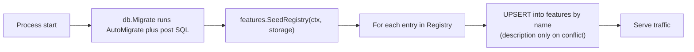
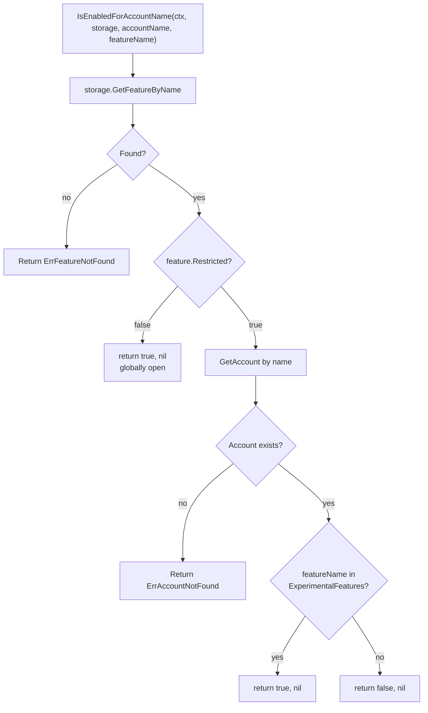
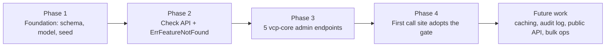

# Account Feature Allowlist

## TL;DR

- **Problem**: VCP has no way to opt a specific account into an experimental code path. Existing env-based flags and allowlists stay as deployment-wide controls; this system is the missing per-account layer.
- **Catalog**: a static registry of `Feature{Name, Description, Restricted}` in `core/features/registry.go`, upserted into a new `features` table at startup. Code is the source of truth for what features exist.
- **Allowlist**: per-account list of feature names stored on the existing `accounts.account_metadata` JSONB as a new `ExperimentalFeatures []string`. No new join table, no foreign keys.
- **Restricted flag**: `true` (default for new features) means allowlist-only; `false` means globally open. Ops flips this at GA via PATCH; the seed never overwrites it after first insert.
- **Check API**: one call at the gated code site — `features.IsEnabledForAccountName(ctx, storage, accountName, featureName) (bool, error)`. Returns `ErrFeatureNotFound` for unregistered names.
- **Admin API**: 5 vcp-core endpoints — list catalog, PATCH restricted, list-for-account, enable, disable. Idempotent.
- **Out of scope (v1)**: caching, audit log, public customer-facing API, bulk operations, feature renames.

---

## Overview

VCP needs a way to opt specific accounts into experimental code paths — features that exist in the binary but should only run for accounts that have been explicitly enabled for them. Examples are early-access capabilities offered to a pilot customer, internal-only validation paths, and behavior changes that need real-world soak time on a small subset of traffic before going everywhere.

This is a different concern from existing controls and does not replace any of them:

- Deployment-wide env flags such as `ENABLE_LDAP` and `ENABLE_MQOS` in [google-proxy/api/endpoints/pool_endpoints.go](../../../google-proxy/api/endpoints/pool_endpoints.go) continue to gate features at the cluster/binary level.
- Env-based allowlists such as `EXPERIMENTAL_VERSION_ALLOWLISTED_ACCOUNTS` in [utils/util.go](../../../utils/util.go) continue to serve their purpose for SRE-managed, deploy-time per-account toggles.

What is missing is a runtime-toggleable, admin-managed, per-account opt-in for experimental features that does not require a redeploy or an env var change. This document describes that subsystem:

1. Lets a developer declare a feature in code (a static string name).
2. Persists those features in a `features` catalog table seeded at startup.
3. Stores the per-account allowlist on the existing `accounts.account_metadata` JSONB column, avoiding a new join table.
4. Exposes admin REST endpoints on vcp-core for ops to enable/disable features per account and to flip a feature from allowlist-only to globally-open at runtime.
5. Provides a small `core/features` Go API that any code path can call: `IsEnabledForAccountName(ctx, storage, accountName, featureName)`.

The design mirrors the CVS `featuresv1` pattern in [cloud-volumes-service/infrastructure/database/features.go](https://github.com/) and [pkg/authorizer/authorization.go](https://github.com/) but trades the separate `access_control_rule` junction table for VCP's existing `account_metadata` JSONB. The result is fewer moving parts and a smaller schema delta.

---

## Goals and Non-Goals

### Goals

- Per-account, runtime-toggleable feature gates without redeploying.
- Catalog of all known features is the source of truth: code declares them, DB persists them, ops administers them.
- A single, simple call site for code paths: `if !allowed { return forbidden }`.
- A clean operational story: launch a feature in allowlist-only mode, enable for pilot accounts, flip to globally-open at GA, all without a code change.

### Non-Goals (v1)

- No public customer-facing API to read the feature catalog or per-account state. Admin-only.
- No audit log of enable/disable/restricted-flip events.
- No bulk operations (enable a feature on N accounts in one call, list accounts that have feature X).
- This system does **not** replace deployment-wide env flags or the existing env-based allowlists in [utils/util.go](../../../utils/util.go). Those continue to serve their purpose; this is purely additive.
- No in-process caching. Every check is a DB lookup. Caching is explicitly future work.
- No support for renaming a feature. A renamed feature is a brand-new feature; the old name persists in the catalog and on accounts that had it (as a harmless no-op) and the allowlist must be re-applied under the new name.
- No feature deprecation lifecycle.

---

## Design Decisions

| Decision | Choice | Rationale |
| --- | --- | --- |
| Identity | **Name only** | Names are immutable by contract. Storing names (not UUIDs) in `account_metadata` makes the JSON readable and the API URLs natural. The BaseModel `UUID` column on the `features` row exists but is not part of the contract. |
| Allowlist storage | `account_metadata.experimentalFeatures []string` | Reuses the existing JSONB column. Avoids a new join table, foreign keys, and migration. Per-account read pattern is already established. |
| Restricted semantics | `Restricted=true` -> allowlist-only; `Restricted=false` -> globally open | Matches CVS `is_restricted` and the plain-English meaning of the word. Default for new features is `true` (safe rollout). |
| Seed behavior | First insert seeds `Restricted` from code; subsequent seeds only refresh `description` and `updated_at`. | Code is the source of truth for **what features exist**. Once a row exists, ops owns the `Restricted` flag, so a runtime flip via PATCH is not clobbered on the next deploy. |
| Caching | None in v1 | The catalog is small; checks are cheap. PATCH is immediately consistent across pods. Caching can be added later behind the same `core/features` API. |
| API surface | 5 admin endpoints on vcp-core (list catalog, patch restricted, list-for-account, enable, disable) | Matches CVS feature/access-control surface. Sufficient for ops to manage features end-to-end. |

---

## Data Model

### `Feature` (new table: `features`)

A new GORM model in [database/datamodel/models.go](../../../database/datamodel/models.go):

```go
type Feature struct {
    BaseModel
    Name        string `gorm:"column:name;uniqueIndex;not null"`
    Description string `gorm:"column:description"`
    Restricted  bool   `gorm:"column:restricted;not null;default:true"`
}
```

Notes:

- `Name` is the public identifier and the key for all external references: code constants, API URL paths, account metadata, error payloads.
- `BaseModel.UUID` (inherited) still exists on the row as a uniqueness invariant of the base model. It is **not** referenced from code constants, account metadata, or APIs and must not become part of any contract.
- `Description` is sourced from code; it can be refreshed by re-running the seed.
- `Restricted` defaults to `true`. After first insert, ops owns this value via the PATCH endpoint; the seed will not overwrite it.

The model is registered in `getVcpModels()` at [database/vcp/datastore.go](../../../database/vcp/datastore.go) so GORM AutoMigrate creates the table. No hand-written SQL migration is required to create the table; an optional post-migration SQL file can add a redundant unique index on `name` if ops wants belt-and-suspenders.

### `AccountMetadata` (extend existing JSONB)

Today, [database/datamodel/models.go](../../../database/datamodel/models.go) defines:

```go
type AccountMetadata struct {
    VolumeRefreshWorkflowLastCompletionAt time.Time `json:"volumeRefreshWorkflowLastCompletionAt"`
}
```

This becomes:

```go
type AccountMetadata struct {
    VolumeRefreshWorkflowLastCompletionAt time.Time `json:"volumeRefreshWorkflowLastCompletionAt"`
    ExperimentalFeatures                       []string  `json:"experimentalFeatures,omitempty"`
}
```

Semantics:

- `ExperimentalFeatures` is treated as a **set** of feature names. Enable and disable are idempotent (no-op if already in the desired state). The DB layer is responsible for dedup on insert.
- Values are feature names (e.g. `"vsa-control-plane.pools.largeCapacity"`), not UUIDs.
- A name appearing here that is no longer in the catalog (because a developer renamed it in code) is a harmless no-op — the check helper resolves names through the catalog and treats unknown-in-catalog as `ErrFeatureNotFound`, while names that are still in-catalog but not in this list resolve to `false`.

The existing `Scan` / `Value` JSONB methods on `AccountMetadata` already round-trip correctly because Go's `encoding/json` handles the new field automatically. No SQL migration is needed for this change.

---

## Static Feature Registry

A new package `core/features/` with a single source-of-truth file `core/features/registry.go`. Every feature is declared as an exported `string` constant; `Registry()` returns the catalog the seed will upsert.

```go
package features

type RegistryEntry struct {
    Name        string
    Description string
    Restricted  bool // initial value used only on first insert; ops owns it after that
}

const (
    FeatureLargeCapacityPool = "vsa-control-plane.pools.largeCapacity"
)

func Registry() []RegistryEntry {
    return []RegistryEntry{
        {
            Name:        FeatureLargeCapacityPool,
            Description: "Allows allocating pools above the standard capacity ceiling.",
            Restricted:  true,
        },
    }
}
```

### How to add a feature

1. Add a `Feature<Name>` constant to `core/features/registry.go` using the convention `vsa-control-plane.<domain>.<feature>` (lowercase, dotted).
2. Append a `RegistryEntry` to the slice returned by `Registry()`.
3. Use the constant at the call site: `features.IsEnabledForAccountName(ctx, storage, accountName, features.FeatureLargeCapacityPool)`.

### Renames are breaking

Renaming a constant value is **not** supported. The old name will remain in the `features` table (because the seed never deletes) and on any account that had it. The new name becomes a separate feature with no allowlist. Consumers must explicitly re-allowlist accounts under the new name. The doc-comment on `RegistryEntry.Name` will state this contract.

---

## Init / Seeding

A new function `features.SeedRegistry(ctx, storage)` runs immediately after `db.Migrate(ctx)` in each binary that connects to the database:

- [google-proxy/app.go](../../../google-proxy/app.go)
- [vcp-core/cmd/main.go](../../../vcp-core/cmd/main.go)
- [worker/main.go](../../../worker/main.go)

The seed is idempotent and keyed by **name**:

```sql
INSERT INTO features (uuid, created_at, updated_at, name, description, restricted)
VALUES (?, now(), now(), ?, ?, ?)
ON CONFLICT (name) DO UPDATE SET
    description = EXCLUDED.description,
    updated_at  = now();
-- intentionally NOT updating restricted: ops owns this flag once the row exists.
```

First-time insert uses the registry's `Restricted` value as the bootstrap default. Subsequent restarts only refresh `description` and `updated_at`. This is the linchpin of the operational story: ops can flip `Restricted` to `false` at GA time and the next deploy will not silently revert it.

A feature constant **removed** from `Registry()` is not deleted from the table. The row remains, the column on accounts that had it remains, and any code path that no longer references the constant simply stops calling the check helper. Stale-row cleanup is explicit ops work, deferred to future work.



---

## Core API (vcp-core admin)

Five endpoints added to [vcp-core/api.yaml](../../../vcp-core/api.yaml). Handlers land in [vcp-core/handlers/](../../../vcp-core/handlers/) via ogen generation, following the existing pattern (e.g. `pool_endpoint.go`).

| Method | Path | Purpose |
| --- | --- | --- |
| `GET` | `/v1/features` | List catalog. Returns `[{name, description, restricted, createdAt, updatedAt}]`. |
| `PATCH` | `/v1/features/{featureName}` | Body `{restricted: bool}`. Flips the `Restricted` flag. Description is not editable through the API; it is owned by code. |
| `GET` | `/v1/accounts/{accountIdentifier}/features` | List enabled feature names for one account. |
| `POST` | `/v1/accounts/{accountIdentifier}/features` | Body `{featureName}`. Enables a feature for the account. Idempotent: no error if already enabled. |
| `DELETE` | `/v1/accounts/{accountIdentifier}/features/{featureName}` | Disables. Idempotent: no error if not enabled. |

### Identifier resolution

`{accountIdentifier}` accepts either the account UUID or the account name (the GCP project number, used everywhere else as the account identifier). The handler probes UUID first via `GetAccountByUUID`, falling back to `GetAccount` (by name), both already in [database/vcp/accounts.go](../../../database/vcp/accounts.go).

### Validation

- `POST /v1/accounts/{id}/features` rejects unknown feature names with `ErrFeatureNotFound` (404). The catalog is consulted before the JSONB write.
- `PATCH /v1/features/{featureName}` rejects unknown features with `ErrFeatureNotFound` (404).
- All endpoints require admin authentication; vcp-core is internal-only.

### DB layer additions

New methods on `Storage` (interface in [database/vcp/interface.go](../../../database/vcp/interface.go)):

In a new file `database/vcp/features.go`:

```go
UpsertFeature(ctx context.Context, f *datamodel.Feature) error
GetFeatureByName(ctx context.Context, name string) (*datamodel.Feature, error)
ListFeatures(ctx context.Context) ([]*datamodel.Feature, error)
SetFeatureRestricted(ctx context.Context, name string, restricted bool) error
```

Added to [database/vcp/accounts.go](../../../database/vcp/accounts.go), following the JSONB-update pattern of the existing `UpdateAccountVolumeRefreshTimestamp`:

```go
EnableFeatureForAccount(ctx context.Context, accountUUID, featureName string) error
DisableFeatureForAccount(ctx context.Context, accountUUID, featureName string) error
ListExperimentalFeaturesForAccount(ctx context.Context, accountUUID string) ([]string, error)
```

Each enable/disable reads the account, mutates the `ExperimentalFeatures` slice (dedup on enable, remove on disable, no-op on either when already in target state), and writes the updated `account_metadata` JSONB back in a single `Update` call.

---

## Check Utilities

`core/features/check.go` exposes the only API call sites should use:

```go
// Looks up by account UUID.
func IsEnabledForAccountUUID(ctx context.Context, storage database.Storage, accountUUID, featureName string) (bool, error)

// Looks up by account name (GCP project number).
func IsEnabledForAccountName(ctx context.Context, storage database.Storage, accountName, featureName string) (bool, error)
```

### Algorithm

1. `feature, err := storage.GetFeatureByName(ctx, featureName)`.
   - If not found, return `ErrFeatureNotFound`. The caller passed an unregistered name; this is a programming error or a stale deployment, not a user-input problem.
2. If `feature.Restricted == false`, return `(true, nil)` — the feature is globally open.
3. Otherwise load the account by UUID or name.
   - If not found, return `ErrAccountNotFound`.
4. Return `(slices.Contains(account.AccountMetadata.ExperimentalFeatures, featureName), nil)`.

The catalog lookup happens **before** the account lookup so that an unknown feature name fails fast with a clear error, regardless of whether the caller's account exists.



### No caching in v1

Every call performs one `features` row lookup plus, in the restricted case, one `accounts` row lookup. The features table is small (tens of rows expected, indexed on `name`) and the accounts table is already heavily cached by Postgres. PATCH on `Restricted` is therefore immediately consistent across all pods. Caching is explicitly future work behind the same `core/features` API.

---

## Error Taxonomy

Add to [core/errors/errors.json](../../../core/errors/errors.json):

| Code | Constant | HTTP | Meaning |
| --- | --- | --- | --- |
| `2xxx` (next free in DB range) | `ErrFeatureNotFound` | 404 | Feature name is not in the catalog. Returned by check helpers, the PATCH endpoint, and POST `/accounts/{id}/features` validation. |

The existing `ErrAccountNotFound` (2101) covers the missing-account branch. The existing `ErrForbidden` (1020) is what call sites wrap around a `false` return from `IsEnabledForAccountName` when the gated code path needs to refuse the request. Idempotent enable/disable do not return an error when the desired state already matches.

For workflows, follow the [core/errors/README.md](../../../core/errors/README.md) guidance: wrap as a non-retryable Temporal application error so the workflow fails fast rather than retrying a forbidden operation.

---

## Usage Pattern

A typical feature-flagged code path looks like this:

```go
allowed, err := features.IsEnabledForAccountName(ctx, h.Storage, projectNumber, features.FeatureLargeCapacityPool)
if err != nil {
    return nil, err
}
if !allowed {
    return &gcpgenserver.V1betaCreatePoolForbidden{
        Code:    http.StatusForbidden,
        Message: "Large capacity pools not enabled for this account",
    }, nil
}
```

The same shape works inside a workflow or activity, except the `false` branch returns a non-retryable Temporal error instead of an HTTP response. There is no implicit gating: every feature-flagged path is an explicit check at the call site. This is intentional — it keeps the gating mechanism transparent in code review and avoids hidden behavior tied to JSON state.

---

## Migration Impact

- **`features` table** — created by GORM AutoMigrate when `&datamodel.Feature{}` is registered in `getVcpModels()`. No hand-written SQL needed for table creation.
- **`AccountMetadata.ExperimentalFeatures`** — pure Go struct change. The `account_metadata` JSONB column already exists; the new field is additive and `omitempty`-tagged, so existing rows round-trip unchanged.
- **Existing data** — no Account rows are touched by this design. Every account starts with `ExperimentalFeatures` absent (i.e. nil), which the check helper treats correctly as "no features enabled".
- **Optional follow-up SQL** — a post-migration file under `database/vcp/migrations/post/` can add `CREATE UNIQUE INDEX IF NOT EXISTS features_name_idx ON features (name);` if AutoMigrate's index name or attributes are not what ops wants. Not required for correctness.

---

## Implementation Phases

The work is broken into four small, independently deployable phases. Each phase lands behind no new behavior change to existing code paths; the gating only takes effect when a real call site adopts it in Phase 4.

### Phase 1 — Foundation (schema, model, seed plumbing)

What lands:

- New `Feature` GORM model in [database/datamodel/models.go](../../../database/datamodel/models.go) with `Name` (unique), `Description`, `Restricted`.
- Extension of `AccountMetadata` with `ExperimentalFeatures []string` (additive, `omitempty`).
- Registration of `&datamodel.Feature{}` in `getVcpModels()` at [database/vcp/datastore.go](../../../database/vcp/datastore.go).
- New file `database/vcp/features.go` with `UpsertFeature`, `GetFeatureByName`, `ListFeatures`, `SetFeatureRestricted` and matching entries on the `Storage` interface in [database/vcp/interface.go](../../../database/vcp/interface.go) and `MockStorage`.
- Per-account JSONB methods on `database/vcp/accounts.go`: `EnableFeatureForAccount`, `DisableFeatureForAccount`, `ListExperimentalFeaturesForAccount`.
- New `core/features` package with the empty `RegistryEntry` type and an empty `Registry()` slice.
- `features.SeedRegistry(ctx, storage)` wired into [google-proxy/app.go](../../../google-proxy/app.go), [vcp-core/cmd/main.go](../../../vcp-core/cmd/main.go), and [worker/main.go](../../../worker/main.go) immediately after `db.Migrate(ctx)`.

Acceptance:

- AutoMigrate creates the `features` table on next deploy.
- Seed runs on every binary start with no rows to insert; logs "seeded 0 features".
- All three pods (google-proxy, vcp-core, worker) come up cleanly.
- No behavioral change anywhere; nothing reads the new column or the new table.

### Phase 2 — Check API (`core/features.IsEnabledFor*`)

What lands:

- `core/features/check.go` with `IsEnabledForAccountUUID` and `IsEnabledForAccountName`, implementing the four-step Restricted-aware algorithm.
- New `ErrFeatureNotFound` in [core/errors/errors.json](../../../core/errors/errors.json) (next free 2xxx code, HTTP 404).
- Unit tests covering the full check matrix described in Testing Strategy.

Acceptance:

- Unit tests green.
- Package is imported nowhere except its own tests; no behavioral change in any binary.

### Phase 3 — Admin API (5 vcp-core endpoints)

What lands:

- OpenAPI definitions in [vcp-core/api.yaml](../../../vcp-core/api.yaml) for the 5 endpoints (list catalog, PATCH restricted, list-for-account, enable, disable).
- Generated server stubs regenerated via the existing ogen flow.
- Handler implementations in [vcp-core/handlers/](../../../vcp-core/handlers/) backed by the Phase 1 DB methods.
- Identifier resolution helper that accepts either UUID or account name.
- Integration tests for all 5 endpoints, idempotency cases, and unknown-feature/unknown-account errors.

Acceptance:

- vcp-core deploys with the new routes; integration tests green.
- Ops can list, PATCH, enable, disable end-to-end against a staging account, but no production code path consults the data yet.

### Phase 4 — First adoption (canary feature)

What lands:

- One real experimental feature constant added to `Registry()` — the first new code path that needs per-account opt-in. The choice is made by the team owning that feature and is independent of any existing env-based control.
- The gated call site calls `features.IsEnabledForAccountName(...)` and returns the appropriate forbidden response (or skips the experimental branch) when the feature is not enabled for the account.
- A short runbook entry under [doc/infrastructure/runbooks/](../../../doc/infrastructure/runbooks/) describing how ops enables the feature for an account and how to flip it to globally-open at GA.

Acceptance:

- Feature row appears in `features` after deploy with `Restricted=true`.
- Pilot account gets enabled via `POST /v1/accounts/{id}/features` and exercises the gated path.
- Accounts not in the allowlist do not see the experimental behavior.
- The feature graduates to globally-open via `PATCH /v1/features/{name}` when ready, with no code change required.



---

## Testing Strategy

### Unit tests

- **Registry seeding idempotency**: run `SeedRegistry` twice, verify that an in-DB row whose `Restricted` was flipped between runs is not reverted on the second run; verify `description` and `updated_at` are updated.
- **JSONB round-trip**: serialize and deserialize `AccountMetadata` with `ExperimentalFeatures` empty, single, multiple, and with a duplicate (verify dedup at the enable layer, not at JSON layer).
- **Check helper matrix**:
  - feature missing from catalog -> `ErrFeatureNotFound`
  - feature unrestricted -> `true` regardless of allowlist contents
  - feature restricted, account in allowlist -> `true`
  - feature restricted, account not in allowlist -> `false`
  - account missing -> `ErrAccountNotFound`
- **Restricted flip behavior**: PATCH `Restricted=false` followed by an `IsEnabled` call returns `true` for an account not in the allowlist.

### Integration tests

- All five vcp-core endpoints against a test DB:
  - `GET /v1/features` after seed lists registry entries.
  - `PATCH /v1/features/{name}` flips the column and shows in subsequent list.
  - `POST /v1/accounts/{id}/features` adds the name to `account_metadata.experimentalFeatures` JSONB.
  - `DELETE` removes it.
  - `GET /v1/accounts/{id}/features` reflects current state.
- Idempotent enable/disable (POST twice, DELETE twice) returns 200 each time without changing state.

### Mock pattern

`MockStorage` in the existing test infrastructure gains the four new feature methods plus the three account-feature methods, mirroring the existing approach for `UpdateAccountVolumeRefreshTimestamp`.

---

## Rollout and Operations

### Standard feature lifecycle

1. **Code lands** with no registry entries. Behavior is unchanged.
2. **Add a feature**: a developer adds the constant and a `RegistryEntry` with `Restricted: true`. Deploy. The seed inserts the row; no account is in any allowlist; every check returns `false` on the new feature.
3. **Pilot enablement**: ops calls `POST /v1/accounts/{pilot-account}/features` with `{featureName}` for each pilot account. Those accounts immediately see the gated path.
4. **GA**: ops calls `PATCH /v1/features/{featureName}` with `{restricted: false}`. Every account is now allowed. The per-account allowlist entries become harmless no-ops.
5. **(Optional) Cleanup**: once the feature is permanently on, ops can leave the row as-is or remove the per-account entries via `DELETE` to keep `account_metadata` tidy.

### Rollback

- Flip `Restricted` back to `true` via PATCH to revert to allowlist-only behavior.
- `DELETE` an account's entry to revoke a single account.
- Remove the call site (revert the calling code's gate) to fully retire the feature; the row remains in the catalog harmlessly.

### Renames

Out of scope. A new constant value is a new feature; the old name lingers in the table and on accounts that had it (no-op). Consumers must re-allowlist under the new name.

---

## Open Questions and Future Work

- **In-process cache** for the catalog and per-account allowlist with TTL or change-broadcast invalidation. Current design pays one or two DB round-trips per check; acceptable for orchestrator/handler usage but worth revisiting if a hot path emerges.
- **Audit log** of enable/disable/PATCH events with actor identity. Currently nothing records who flipped what when.
- **Public read-only API** so customers can see which features are enabled for their account.
- **Bulk operations**: enable a feature across many accounts in one call; list all accounts that have a given feature.
- **Deprecated state** for features: hide from new enables but keep existing accounts working, with a warning surfaced via the catalog API.
- **Stale-row cleanup**: a tool or admin endpoint to delete features removed from `Registry()` along with their references on accounts.
