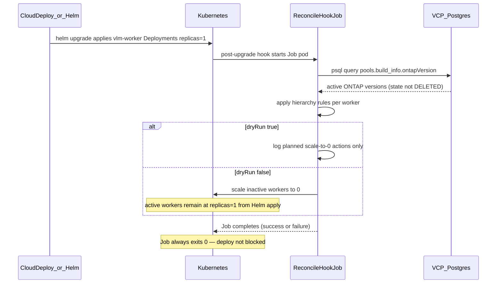

# VLM Worker Reconciler Design

## Related Documents

| Document | Title | Description |
|----------|-------|-------------|
| [0011-vcp-worker_versioning-design.md](./0011-vcp-worker_versioning-design.md) | Worker Versioning | VLM worker versioning model and `ontapVersionVlmImageMappings` |
| [0017-telemetry-deployer-design.md](./0017-telemetry-deployer-design.md) | Telemetry Deployer Design | Precedent for post-install/post-upgrade Helm hook Jobs |
| [ontap-version-consumption-and-testing.md](../../guides/ontap-version-consumption-and-testing.md) | ONTAP Version Consumption | How to add VLM mappings when consuming new ONTAP versions |

**Confluence origin:** [VLM Worker Reconciler — Design & POC Options](https://netapp.atlassian.net/wiki/spaces/~71202008ac629bdb2d4ca18c7b1f4834af180c/pages/624933203)

---

## Overview

The `vlm-worker` Helm chart creates one Deployment per ONTAP version from `ontapVersionVlmImageMappings`. On every `helm upgrade`, each Deployment is rendered with `replicas: {{ .Values.app.replicas }}` (typically **1**). Over time, mappings accumulate for versions no longer in use, so idle workers keep running and consuming cluster resources.

The **VLM Worker Reconciler** is a post-upgrade Helm hook Job that queries the VCP database for active ONTAP versions, applies version-hierarchy rules, and scales **inactive** `vlm-worker-*` Deployments to **0**. Active and protected versions remain at **1** from the Helm apply; the Job does not scale them explicitly.

---


## Decision Summary

| Topic | Decision |
| --- | --- |
| §1 Helm hook timing | Post-install / post-upgrade hook Job |
| §2 Inactive action | Scale Deployment to **0** (do not delete) |
| §3 Job execution model | Go binary in `gcr.io/distroless/static:nonroot` image |
| §4 Version hierarchy | Active-set and hierarchy rules below |
| §5 Job failure handling | Reconciler always exits 0; deploy never blocked; ops guide for manual investigation |
| §6 Rollout | Staging dry-run → live, then production dry-run → live |

---

## 1. When to Run Reconcile: Deployment Timing (Helm Hooks)

Because Helm reapplies desired replica counts during upgrade, **reconcile must run after** worker Deployments are updated — not before.

### Options Compared

| Option | How it works | Pros | Cons |
| --- | --- | --- | --- |
| **A. Post-install / post-upgrade Helm hook Job** | After chart applies all `vlm-worker-*` Deployments at `replicas=1`, a hook Job queries VCP Postgres for active ONTAP versions and scales inactive Deployments to 0. | Matches Helm lifecycle: scale-down survives the upgrade that just set replicas to 1. Validated in minikube POC. | Brief window where idle workers may run at 1 until hook completes. Hook must re-run on every upgrade (by design). |
| **B. Pre-install / pre-upgrade Helm hook Job** | Job runs before main Deployment manifests are applied/updated. | Hook machinery is the same as post-hook (single Job pattern). | **Does not work for this use case:** Helm still applies `replicas: 1` on all mappings after the hook, undoing any pre-scale-down. On first install, target Deployments may not exist yet. |

### Why Pre-Deploy Hooks Do Not Work

**Root cause:** Helm owns Deployment `spec.replicas` from chart values on every upgrade.

1. **pre-upgrade hook runs first** — a Job might scale `vlm-worker-9-15-1` to 0.
2. **Helm applies/updates Deployments** — template sets `replicas: {{ .Values.app.replicas }}` (1) for every mapped version.
3. **Pre-hook work is overwritten** — inactive workers are back at 1; no reconcile ran after the authoritative manifest apply.

This was confirmed in local POC: after `helm upgrade`, all versioned workers return to `replicas=1` until a **post-upgrade** reconcile Job runs.

### Hook Configuration

- `helm.sh/hook: post-install,post-upgrade`
- `helm.sh/hook-weight` after Deployments (e.g. weight 5)
- `helm.sh/hook-delete-policy: before-hook-creation` (retain Job logs until next upgrade)
- Hook failures are handled by the Job itself via `exit 0` on all error paths — Helm sees a successful hook regardless of reconcile outcome
- Feature flag: `vlmWorkerReconciler.enabled: false` until staging sign-off

### Decision

**Use post-install + post-upgrade hook Job**. Do not use pre-install/pre-upgrade hooks for replica reconciliation.

---

## 2. Reconcile Action Model: Scale to 0 vs Delete Deployment

For inactive ONTAP versions, there are two main reconcile actions:

1. **Scale existing Deployment to 0 replicas**
2. **Delete Deployment object and recreate later when needed**

### Options Compared

| Option | How it works | Pros | Cons |
| --- | --- | --- | --- |
| **A. Scale Deployment to 0 replicas** | Keep all versioned `vlm-worker-*` Deployment objects. For inactive versions, set `spec.replicas = 0`. Active/protected versions stay at `replicas = 1` from the Helm apply (reconcile does not patch them). | Fast recovery: reactivation is scale-up only. Safer with Helm lifecycle: chart manages Deployments; reconcile only scales inactive workers down. | Object count remains: inactive versions still exist as Deployment resources. |
| **B. Delete inactive Deployments** | Remove Deployment objects for inactive versions. Recreate when version becomes active again. | Maximum cleanup: removes pods and Deployment objects. Reduced object footprint. | Higher complexity for safe recreation. Risk of drift between runtime state and chart-declared state. |

### Decision

**Scale inactive Deployments to 0 replicas** (do not delete). This aligns with the existing chart model where Helm owns one Deployment per `ontapVersionVlmImageMappings` entry.

---

## 3. Reconciler Job Execution Model

The post-upgrade reconcile Job must run **both**:

1. Query VCP Postgres for active ONTAP versions
2. Scale `vlm-worker-*` Deployments (Kubernetes scale API)

**Design principle:** The reconcile logic is compiled into a **Go binary** embedded in the image — not injected at runtime via the Helm template. The binary reads config from environment variables wired by the Helm Job spec.

### Options Compared

| Option | How it works | Pros | Cons |
| --- | --- | --- | --- |
| **A. Multi-step pod (init + main containers)** | **Init:** `postgres:16` (or slim `psql` client) runs DB fetch → writes shared file. **Main:** `kubectl` image runs reconcile script from Helm. | No custom image to publish. Reuses standard or existing org images. Script changes via Helm only. | Two images per Job run. More complex pod spec (`initContainers`, `emptyDir`). Two log streams on failure. |
| **B. Single-container pod (custom Alpine image + Helm bash script)** | One container uses a custom tools image (`bash`, `curl`, `jq`, `psql`) pushed to GAR. Reconcile logic rendered as bash in the Helm Job template. | Single image pull. Script/logic changes ship with Helm deploy only. | Alpine image with exec-capable tools does not meet prod security policy (`exec` disallowed on non-distroless images). |
| **C. Single-container pod (Go binary in distroless image)** | Reconcile logic compiled as a static Go binary into `gcr.io/distroless/static:nonroot`. No shell, no external tooling. K8s API calls via `net/http` + SA token; DB via `database/sql`. | Meets prod security policy (distroless, non-root, no exec). Single image pull, one log stream. Consistent with `vcp-iam-lifecycle` and `vcp-core` image pattern in this repo. | Logic changes require image rebuild and push. |

### Decision

**Go binary in `gcr.io/distroless/static:nonroot`** (Option C). The image is built via the multi-stage `tools/vlm-worker-reconciler/Dockerfile` and pushed to GAR as `secondary: true`, consistent with other hook images (`vcp-iam-lifecycle`). The chart references it via `vlmWorkerReconciler.image`.

The binary uses `net/http` with the pod's SA token for in-cluster K8s API calls and `github.com/lib/pq` (already in `go.mod`) for Postgres. No shell or external binaries are required.

---

## 4. ONTAP Version Hierarchy and Inactive-Worker Handling

The reconcile Job decides, per `vlm-worker-*` worker, whether it stays **active** or is treated as **inactive**. Inactive workers are scaled to **0** per Section 2.

### Active Version Set

- Pool `build_info.ontapVersion` where `state <> 'DELETED'`

If the set is **empty**, the Job takes **no inactive action** (guardrail G4).

### Version Model

- **Line** = `major.minor.patch` (e.g. `9.18.1`) — P1/P2 share the same line
- **Patch level** on a line: base = 0, P1 = 1, P2 = 2
- Deployment `vlm-worker-9-18-1p1` → `9.18.1P1`

### When a Worker Stays Active

A worker is **kept** if **any** rule matches:

| Rule | Meaning | Example |
| --- | --- | --- |
| **Direct** | Version is in the active set | `9.17.1P2` in DB → `vlm-worker-9-17-1p2` stays active |
| **Lower-line** | Any active version on a **lower** line keeps **all higher-line** workers active | Only `9.17.1P2` active → all `9.18.x`, `9.19.x` stay active (migration) |
| **Patch ladder** | On the **same line**, if level **L** is active, workers with level **≥ L** stay active | `9.18.1` + `9.18.1P1` active → `9.18.1P2` stays active even with no P2 pool |

Otherwise → worker is **inactive** (scale to 0).

### Patch Ladder (Same Line)

| Active on line | Stays active |
| --- | --- |
| base only | base, P1, P2 |
| P1 only | P1, P2 (not base) |
| P2 only | P2 only |

### Guardrails

- **G4:** Empty active set → skip all scale-down (prevent mass outage).
- **G5:** If hierarchy logic would scale **all** workers to 0 → abort Job with error.

### Flow

```
helm upgrade → all workers at default replicas (e.g. 1)
→ Job builds active set from pools table (state <> 'DELETED')
→ per Deployment: direct | lower-line | patch ladder
→ active: unchanged (Helm already at 1) | inactive: scale to 0
```

---

## 5. Failure Handling and Alerting

If the reconcile Job fails, the **Helm release must still succeed**. Inactive-worker handling is **best-effort**, not a deploy gate.

### On Reconcile Job Failure

| Behavior | Detail |
| --- | --- |
| **Helm / deploy** | Does **not** fail — the reconciler Job always exits 0 on all failure paths |
| **Worker state** | Unchanged from pre-hook (typically all workers at default replicas, e.g. 1) |
| **Impact** | Idle workers may keep running until the next successful reconcile |

We do **not** mark the Deployment or Helm release as failed because reconcile failed.

**Implementation note:** The reconciler exits 0 on all failure paths (DB failure, K8s API error, guardrail abort, missing credentials) so the Helm release and Cloud Deploy / skaffold pipelines are never blocked. An `ERR` trap catches any unhandled bash errors and exits 0. Secret references use `optional: true` so the pod starts even when the K8s Secret is missing.

### Decision

Do **not** page on-call for reconcile Job failure alone. See [vlm-worker-reconciler-operations.md](../../guides/vlm-worker-reconciler-operations.md) for the operations guide.

---

## 6. Rollout Plan and Deployment Flow

Rollout is **staged by environment**, with **dry-run first** in each env before live reconcile. Reconciler stays behind a feature flag until sign-off.

### Rollout Phases

| Phase | Environment | `enabled` | `dryRun` | Goal |
| --- | --- | --- | --- | --- |
| **1** | Staging | `true` | `true` | Hook runs; logs show planned actions; **no** replica changes |
| **2** | Staging | `true` | `false` | Live reconcile; confirm idle inactive, active stay up |
| **3** | Production | `true` | `true` | Same dry-run validation as staging |
| **4** | Production | `true` | `false` | Live reconcile in production |

**Before phase 1:** Merge Helm templates + RBAC + script; tools image published to GAR; feature flag **off** in default chart values.

**Exit criteria per phase:** Job completes; active/inactive decisions match expectations; no unexpected worker impact (dry-run: logs only; live: verify deployments).

**Rollback:** Set `enabled: false` or `dryRun: true`; next `helm upgrade` skips live reconcile.

### Deployment Flow (Sequence)



### Per-Environment Checklist

**Staging — dry-run**

- Enable reconciler + `dryRun: true`
- Run `helm upgrade`; confirm Job success
- Review logs: expected active vs inactive workers
- Confirm no replica changes

**Staging — live**

- Set `dryRun: false`
- Run `helm upgrade`; verify idle workers inactive, active at default replicas
- Re-run upgrade to confirm hook re-applies after Helm resets replicas

**Production**

- Repeat dry-run then live, same as staging
- Confirm alerting for Job failure (Section 5)

---

## Implementation Pointers

| Artifact | Location |
| --- | --- |
| Helm hook Job + inline bash script | `kubernetes/vlm-worker/templates/vlm-worker-reconciler-job.yaml` |
| RBAC (get/list Deployments, patch scale) | `kubernetes/vlm-worker/templates/vlm-worker-reconciler-rbac.yaml` |
| Feature flag and config | `kubernetes/vlm-worker/values.yaml` → `vlmWorkerReconciler` |
| Tools image Dockerfile | `tools/vlm-worker-reconciler/Dockerfile` |
| Versioned worker Deployments | `kubernetes/vlm-worker/templates/deployment.yaml` |

### Key Values

```yaml
vlmWorkerReconciler:
  enabled: false   # enable in staging before production
  dryRun: true     # dry-run first in each environment
  image:
    name: vlm-worker-reconciler
    tag: v1.0.0
    secondary: true   # GAR registry (see global.secondaryImageRegistry)
  database:
    host: ""
    secretName: vlm-worker-reconciler-db-secret
  externalSecrets:
    dbUsername:
      secretName: ""   # GCP Secret Manager secret name for DB username
    dbPassword:
      secretName: ""   # GCP Secret Manager secret name for DB password
```
