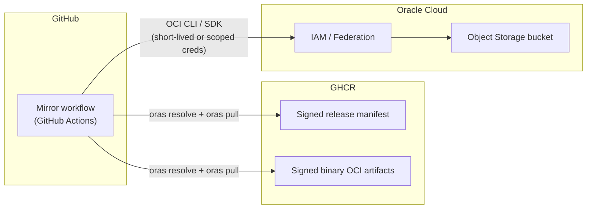

# Design: GHCR to OCI Object Storage — Binary and Manifest Mirror

| Field | Value |
|--------|--------|
| **Status** | Draft |
| **Scope** | CI/CD design — mirror release manifest artifacts from GitHub Container Registry (GHCR) and source VSA artifacts from OCI source tenancy into OCI Object Storage |
| **Related** | `.github/workflows/build_common.yaml` (binary `oras push`, manifest generation, `cosign sign` / `cosign verify`) |
| **See also** | [Workload Identity Federation (GitHub ↔ OCI)](./workload-identity-federation-github-oci.md) — SCIM/REST setup and GitHub Actions workflow for Object Storage uploads |

## 1. Problem statement

The VCP release pipeline already:

- Pushes container binaries as OCI artifacts to GHCR (ORAS), with `*.sha256` sidecars.
- Signs each binary artifact and the release manifest with Cosign (key-based, transparency log disabled in current flow).
- Publishes a machine-readable `ReleaseManifest` (`release-manifest.json`) as a signed OCI artifact on GHCR.

**New requirement:** Operate a follow-on pipeline that copies those artifacts (and associated metadata) into an **OCI Object Storage** bucket for consumers that cannot pull from GHCR, while preserving **digest/hash integrity** end-to-end.

## 2. Goals and non-goals

### 2.1 Goals

- Treat the **signed release manifest** as the trust root after verification.
- For each binary listed in the manifest: verify digest alignment, verify content hash and size, then upload to Object Storage.
- Mirror selected Helm OCI charts (chart name contains `oci`), deployment kit files, build-context archive, and VSA source artifacts from the source OCI tenancy.
- Document **authentication** to OCI Object Storage from GitHub Actions, with a clear preference order (short-lived credentials first).
- Define object key layout, failure behavior, and audit-friendly logging (no secrets in logs).

### 2.2 Non-goals (this design)

- Replacing the existing GHCR publish path.
- Mirroring full container **images** (for example Temporal component image retag/push handled by `scripts/temporal/mirror-images.sh` to GHCR/GCR).
- Changing Cosign key management in the build pipeline (mirror consumes existing public key material).

## 3. Background

### 3.1 Source artifacts

- **Manifest:** `ghcr.io/<org>/<manifest-path>/release-manifest:<version>` (also addressable by digest).
- **Binaries:** `ghcr.io/<org>/<binary-path>/<name>:<version>` with artifact type `application/vnd.netapp.vcp.binary.v1` and layers including `application/octet-stream` and optional `text/plain` for SHA-256.

### 3.2 Manifest content (relevant fields)

- `vcpArtifacts.binaries[]`: `name`, `sha256`, `sizeBytes`, `platform`, `ghcr_oci`, `digest` (OCI manifest digest).
- `vcpArtifacts.dockerfiles[]`: `name`, `sourcePath` — **paths in the Git repository at build time**, not GHCR URIs (see [Section 8](#8-dockerfiles-and-the-manifest-gap)).

## 4. High-level architecture



**Principle:** No object is uploaded until **per-artifact checks** pass: pinned OCI **digest** matches the manifest, pulled content **SHA-256** and **size** match the manifest. The current workflow does not run Cosign verification; it relies on digest pinning and hash/size validation.

## 5. Workflow phases (logical)

The following phases map cleanly to discrete GitHub Actions jobs or steps.

| Phase | Description |
|-------|-------------|
| **P0 — Bootstrap** | Install pinned versions of `oci` CLI, `oras`, `helm`, `jq` and ensure local Python/venv exists for OCI CLI install. Non-interactive mode. |
| **P1 — GHCR authentication** | `oras login ghcr.io` using a token with `read:packages` (and org/repo scope as required). |
| **P2 — Manifest pin** | Resolve immutable reference: prefer `release-manifest@sha256:…`. If input is a tag, run `oras resolve` once and pin digest for the remainder of the workflow. |
| **P3 — OCI OIDC exchange and session setup** | Request GitHub OIDC token (default audience `https://cloud.oracle.com`), exchange to OCI UPST via `.github/scripts/oci-github-wif-token-exchange.sh`, verify `oci os ns get --auth security_token`. |
| **P4 — Guardrails** | Verify target bucket exists and is accessible; configure additional source-tenancy OCI CLI profile (`ENGOPENLABCP`) for VSA artifact copy. |
| **P5 — Manifest pull and validation** | `oras pull` the manifest JSON. Validate with `jq`: required keys (`apiVersion`, `kind`, `metadata.version`, `vcpArtifacts.binaries` non-empty, each binary has `name`, `sha256`, `sizeBytes`, `ghcr_oci`, `digest`). |
| **P6 — Per-binary verification** | For each entry: (1) `oras resolve "$ghcr_oci"` must equal `digest`; (2) `oras pull`; (3) verify mirrored `*.sha256` sidecar first field equals manifest hash; (4) verify blob SHA-256 and size match the manifest. |
| **P7 — Upload additional release content** | Mirror matching Dockerfiles, selected Helm OCI charts (name contains `oci`), deployment-kit files, and build-context archive under deterministic prefix (see [Section 6](#6-object-storage-layout)). |
| **P8 — Copy VSA source artifacts** | Copy source tenancy artifacts from `VSA_SOURCE_BUCKET_NAME`/`VSA_SOURCE_PREFIX_ROOT` into `vcp-releases/<version>/VSA/<ontapVersion>/`. |
| **P9 — Release marker** | Write `…/RELEASED` as final marker so partial uploads are not mistaken for complete releases. |

### 5.1 Concurrency and idempotency

- Use `workflow_dispatch` input `release_manifest_ref` and optional `manifest_image`.
- GitHub Actions `concurrency` group keyed by `version` to avoid overlapping writes.
- Re-runs: `oci os object put --force` or equivalent overwrite policy; document whether overwrites are allowed for the same `version` prefix.

### 5.2 Observability

- Job summary should include version, bucket, prefix, mirrored layout, and binary validation guidance (`*.sha256` and `sha256sum` parity).
- Never print API private keys, PEM bodies, or raw session tokens.

## 6. Object Storage layout

Recommended prefix (adjust naming to your tenancy standards):

| Object key | Content |
|------------|---------|
| `vcp-releases/<version>/release-manifest.json` | Pulled manifest (post-verify) |
| `vcp-releases/<version>/release-manifest.digest` | Single line: pinned manifest digest |
| `vcp-releases/<version>/artifacts/<name>/<name>` | Binary blob (filename matches manifest `name`) |
| `vcp-releases/<version>/artifacts/<name>/…` | ORAS sidecars (`*.sha256` must match manifest `sha256` in mirror; `*.sig`, …) and matched `Dockerfile.*` |
| `vcp-releases/<version>/dockerfiles/...` | Dockerfiles with no single matching binary (Section 8) |
| `vcp-releases/<version>/helm/<chart>/...` | Helm OCI pull contents (charts whose names contain `oci`) |
| `vcp-releases/<version>/deploymentKit/...` | Files listed under `deploymentKit.files` in release manifest |
| `vcp-releases/<version>/build-context/<filename>` | Build context archive from `vcpArtifacts.buildContext.filename` |
| `vcp-releases/<version>/VSA/<ontapVersion>/...` | Source tenancy VSA artifacts copied from configured OCI profile |
| `vcp-releases/<version>/RELEASED` | Optional completion marker |

**Immutability:** Prefer addressing the release by **manifest digest** in internal systems, not only by version tag.

## 7. OCI Object Storage authentication from GitHub Actions

GitHub Actions runners are **not** OCI compute instances. Therefore **Instance Principal** and **Resource Principal** (workload identity attached to OCI resources) do **not** apply directly to the default GitHub-hosted runner. Authentication choices reduce to patterns that work from arbitrary egress IPs.

### 7.1 Preferred: Short-lived credentials via identity federation (OIDC)

**Objective:** Avoid long-lived API private keys in GitHub Secrets where possible. Use GitHub’s OIDC token (`id-token: write`) and exchange it for a **short-lived OCI session token** scoped to a **dedicated IAM user** or **group-assigned policies** that can only manage objects in the target bucket (or compartment).

**Why this is “best” for GitHub Actions**

- No permanent private key stored in GitHub (only federation configuration and, at most, non-secret identifiers).
- Each workflow run receives credentials that **expire automatically**.
- Trust can be bound to **repository**, **environment**, and **branch/tag** via claims in the OIDC token (configure matching rules on the OCI side).

**High-level setup steps (OCI side)**

1. In OCI IAM, configure an **identity provider** / **federation** trust relationship that accepts GitHub as an external IdP (JWT bearer), following Oracle documentation for **GitHub Actions and OCI** (token exchange / session token patterns).
2. Create a **dedicated IAM user** (or group + user) used only for this mirror; attach a **minimal policy** (see [Section 7.4](#74-example-iam-policy-shape-minimal)).
3. Map federated identities (e.g., `sub` / `repository` claims) to that user or to **dynamic group** membership rules supported by your OCI identity domain model.
4. Restrict mapping to specific repositories and, if using GitHub Environments, to `ref` / environment name.

**High-level setup steps (GitHub Actions side)**

1. Add workflow permissions:

   ```yaml
   permissions:
     id-token: write
     contents: read   # if checkout needed for Dockerfiles path
   ```

2. Request OIDC token (audience must match what OCI IdP expects):

   ```yaml
   - name: Get GitHub OIDC token
     id: oidc
     uses: actions/github-script@v7
     with:
       script: |
         const token = await core.getIDToken('<audience-configured-in-OCI>');
         core.setOutput('token', token);
   ```

   *Note:* Exact action or `curl` step depends on your federation recipe; some teams use a small custom step to POST the JWT to OCI token endpoint and parse the session token.

3. Exchange the GitHub JWT for an OCI **security token** / **session token** using the flow documented by Oracle (token endpoint, scope, and grant type per your IdP configuration).

4. Configure OCI CLI:

   - Either write `~/.oci/config` with `security_token_file` pointing to the token file and `key_file` pointing to a **delegation** or **session** key pair issued for that user (Oracle’s session-token flows often pair a short-lived token with a local key; follow the official tutorial for the supported combination), **or**
   - Export token env vars supported by your chosen SDK/CLI version.

5. Run `oci os object put …` using that session.

**Operational notes**

- Pin **OCI CLI** and client library versions; token exchange endpoints and claim validation rules should be treated as security-sensitive configuration.
- Rotate federation certificates and review IAM mappings on a schedule.
- Use a **GitHub Environment** with required reviewers for production bucket uploads.

**References (external)**

- GitHub: [OpenID Connect in cloud providers](https://docs.github.com/en/actions/how-tos/secure-your-work/security-harden-deployments/oidc-in-cloud-providers) (`id-token: write`, OIDC claims).
- Oracle: session-token / GitHub authentication tutorials (search Oracle Help Center for *GitHub Actions* + *OCI* + *session token* / *security token*).

### 7.2 Acceptable fallback: API user + auth token + private API key (GitHub Secrets)

**When to use:** Federation is not yet available in your tenancy, or organizational policy mandates API keys with strict rotation and vaulting.

**Pattern**

1. Create IAM user `github-actions-vcp-binary-mirror` (example name).
2. Generate API key for that user; store **private PEM** and related metadata (`tenancy`, `user`, `fingerprint`) in GitHub **encrypted secrets** (split across secrets if desired).
3. In the workflow, write `~/.oci/config` from secrets (use heredoc with `umask` and delete file in `post` step where possible).
4. Run `oci os object put`.

**Hardening**

- **Single-purpose user**; policy limited to one bucket or prefix.
- **Key rotation** procedure documented; calendar-based rotation; break-glass user.
- Prefer **GitHub Environment secrets** so production keys are not available on every branch workflow.

### 7.3 Patterns that do not apply to default GitHub-hosted runners

| Pattern | Reason |
|---------|--------|
| **Instance Principal** | Requires OCI instance metadata service. |
| **Resource Principal** | Targets OCI resources (e.g., Functions, OKE pods) with configured trust; not the generic GitHub runner. |
| **User password** | Unsuitable for automation; avoid. |

*If* the mirror runs on **self-hosted runners inside OCI** (e.g., OCI Compute or OKE), **Instance Principal** or **Workload Identity** for that compute becomes viable and may be preferred over federation — that is a **different deployment model** and should be documented as a variant.

### 7.4 Example IAM policy shape (minimal)

Policy language must be validated in your tenancy; illustrative intent only:

```text
Allow group <mirror-uploaders> to manage objects in compartment <compartment> where target.bucket.name = '<bucket-name>'
```

Tighten with `any { request.permission = 'OBJECT_CREATE', request.permission = 'OBJECT_OVERWRITE', … }` if your organization uses permission-level conditions.

Avoid `manage all-resources` or broad `inspect` on the tenancy.

### 7.5 Network path

- GitHub-hosted runners use public internet; ensure **no IP allow-list** on the bucket that blocks GitHub egress, **or** use **self-hosted runners** with stable egress and allow-listed IPs.
- If using **Private Endpoint** for Object Storage, uploads from GitHub-hosted runners require a **proxy or VPN** path — usually paired with self-hosted runners in OCI or on-prem with network access.

## 8. Dockerfiles and the manifest gap

Current manifest entries describe Dockerfiles by **repository path** (`sourcePath`), not by GHCR artifact reference. A mirror that only reads GHCR **cannot** retrieve those files unless you extend the pipeline.

**Option A (recommended for pure GHCR-to-bucket mirroring):** During the existing release build, also push Dockerfile(s) (or a tarball) to GHCR with ORAS, and extend `ReleaseManifest` with `ghcr_oci`, `digest`, and `sha256` for each Dockerfile artifact. The mirror then uses the same verify-and-upload loop as binaries.

**Option B:** In the mirror workflow, `actions/checkout` at `ref` matching `metadata.version` (tag), copy `sourcePath` files, and optionally record `git commit` in the manifest in a future schema revision for traceability.

Choose one; do not assume Dockerfiles exist on GHCR without schema support.

## 9. Threat model (abbreviated)

| Threat | Mitigation |
|--------|------------|
| Tampered manifest | Pin digest and validate required manifest fields before trusting content. |
| Tag mutable / wrong artifact | Pin digest; compare `oras resolve` to manifest `digest`. |
| Tampered binary | SHA-256 sidecar + blob SHA-256 + size match against manifest. |
| Leaked upload credentials | Federation + short-lived tokens; or narrow API user + rotation + Environment secrets. |
| Partial upload | Optional `RELEASED` marker; multipart completion; re-run concurrency policy. |

## 10. Open items

- [ ] Confirm OCI tenancy uses **Domains** vs **classic IAM** for federation UI steps.
- [ ] Decide Dockerfile strategy (Section 8).
- [ ] Define retention and encryption defaults for the bucket (KMS, versioning).
- [ ] Add JSON Schema for `ReleaseManifest` if strict validation is required.

## 11. Implementation follow-up

Implementation in this repo:

- Workflow: `.github/workflows/oci-vcp-vsa-image-copy.yaml` — `workflow_dispatch` input `release_manifest_ref` (e.g. `26051.0.0-DEV.24` or `release-manifest:26051.0.0-DEV.24`), optional `manifest_image` default `ghcr.io/vcp-vsa-control-plane/oci_release_manifest/release-manifest`. Uses **two** `actions/checkout` steps: default ref (so `.github/scripts` always exists) and `path: release-ref` at the release tag for Dockerfile paths.
- Script: `.github/scripts/mirror-release-to-oci.sh` — ORAS pull, digest + SHA-256 + size checks (no Cosign in the reference implementation); upload layout per [Section 6](#6-object-storage-layout).
- Related image mirror helper: `scripts/temporal/mirror-images.sh` mirrors Temporal images to GHCR/GCR and is outside the OCI Object Storage workflow scope.

Additional tasks: JSON Schema for `ReleaseManifest`, retention/KMS, and (if needed) mirroring container **images** from `vcpArtifacts.images` (non-goal above; same auth patterns).

---

*End of design document.*
