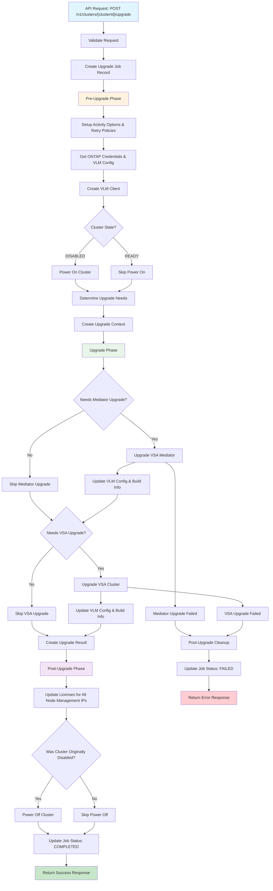
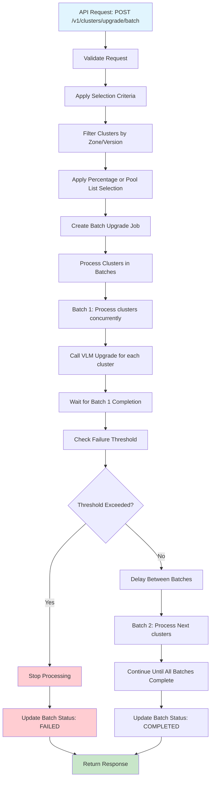
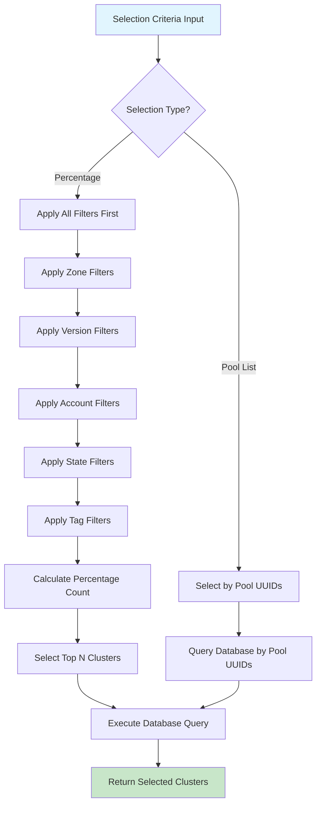
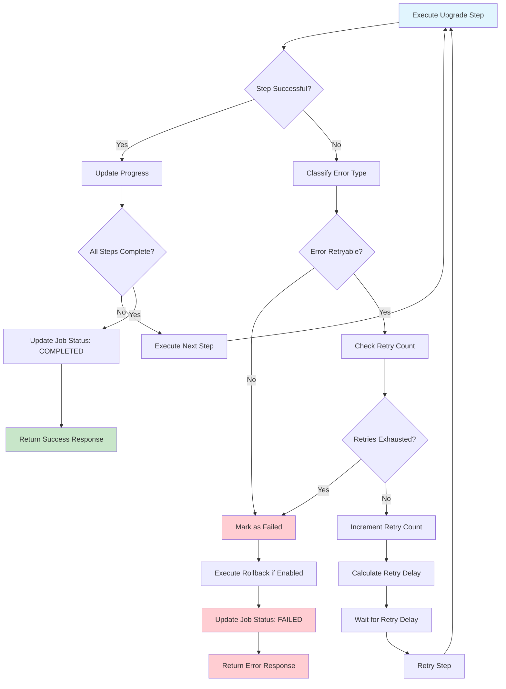
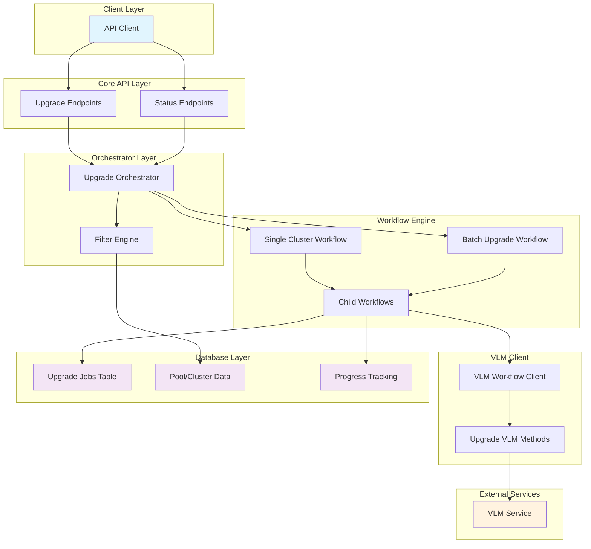
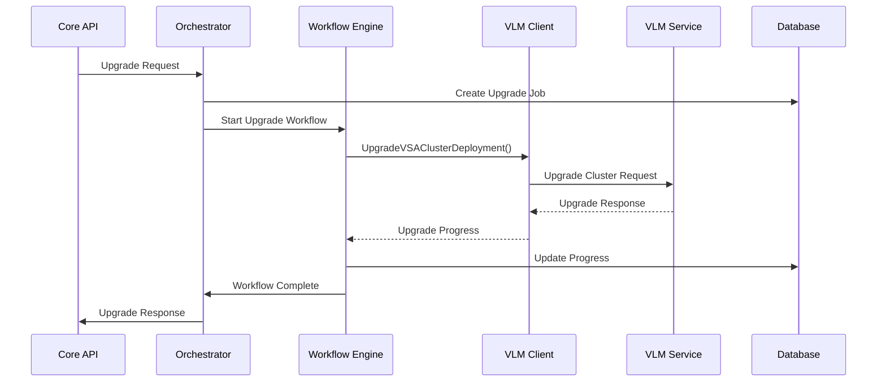

# VSA Cluster Upgrade Workflow Design

## Overview

This document outlines the design for implementing VSA cluster upgrade workflows in the VCP (VSA Control Plane). The upgrade workflow supports both single cluster upgrades and batch upgrades with various filtering and selection criteria.

## Current Implementation Status

### ✅ **Phase 1: Single Cluster Upgrade - COMPLETED**

The single cluster upgrade functionality has been implemented with a three-phase architecture and includes:

#### **Key Features Implemented:**
- **Three-Phase Architecture**: Pre-upgrade, upgrade, and post-upgrade phases for better separation of concerns
- **Build Image-Based Upgrades**: Uses VSA and mediator build images for precise upgrade decisions
- **Incremental Progress Updates**: Updates build info and VLM config after each successful upgrade step
- **Selective Component Upgrades**: Only upgrades VSA or mediator components that don't match target build images
- **Force Upgrade Support**: Allows arbitrary build image combinations with proper validation
- **Disabled Cluster Support**: Automatic power on/off management for disabled clusters
- **License Update Integration**: Updates licenses for all node management IPs after upgrades
- **Enhanced Error Handling**: Phase-specific error handling with cleanup on failure
- **Soft Delete for Jobs**: Completed upgrade jobs are soft-deleted but remain visible in status queries
- **Comprehensive Error Handling**: Detailed error responses and retry logic
- **Version Management**: Database-driven version management with environment variable fallback

#### **API Endpoints Available:**
- `POST /v1/clusters/{clusterId}/upgrade` - Single cluster upgrade
- `GET /v1/clusters/{clusterId}/upgrade/status` - Get upgrade status
- `GET /v1/clusters/versions` - List available versions

#### **Database Schema:**
- `cluster_upgrade_jobs` table for tracking upgrade jobs
- `image_versions` table for supported build image combinations
- `pools.build_info` JSONB column for tracking current build images

### 🚧 **Phase 2: Batch Cluster Upgrade - PENDING**

Batch upgrade functionality is planned for future implementation and will build upon the single cluster upgrade foundation.

### Important Note: Cluster ID and Pool UUID

In the VCP system, **Cluster ID is the same as Pool UUID**. This means:
- When referring to a cluster in the context of upgrades, we use the pool's UUID
- The API endpoints use `{clusterId}` as the path parameter, which maps to the pool UUID
- All database references use the pool UUID as the cluster identifier
- This maintains consistency with the existing VCP data model where pools represent VSA clusters

## Table of Contents

1. [Architecture Overview](#architecture-overview)
2. [API Design](#api-design)
3. [Data Models](#data-models)
4. [Version Management](#version-management)
5. [VLM Worker Selection](#vlm-worker-selection)
6. [Workflow Design](#workflow-design)
7. [Filtering and Selection Logic](#filtering-and-selection-logic)
8. [Batch Processing](#batch-processing)
9. [Handling Disabled Clusters](#handling-disabled-clusters)
10. [License Updates](#license-updates)
11. [Error Handling and Rollback](#error-handling-and-rollback)
12. [Implementation Plan](#implementation-plan)

## Architecture Overview

The VSA cluster upgrade workflow follows the existing VCP architecture patterns:

```
Core API → Orchestrator → Workflow Engine → VLM Client → VLM Service
    ↓           ↓              ↓              ↓
Database ← Activities ← Child Workflows ← VLM Workflows
```

### Key Components

1. **Core API Layer**: REST endpoints for upgrade operations
2. **Orchestrator Layer**: Business logic and workflow coordination
3. **Workflow Engine**: Temporal-based workflow execution
4. **VLM Client**: Interface to VLM service for cluster operations
5. **Database Layer**: Persistent storage for upgrade state and metadata

## API Design

### 1. Single Cluster Upgrade

```yaml
POST /v1/clusters/{clusterId}/upgrade
```

**Request Body:**
```json
{
  "vsaBuildImage": "vsa:9.17.1-build456",        // Optional: VSA build image to upgrade to (requires forceUpgrade=true)
  "mediatorBuildImage": "mediator:9.17.1-build456", // Optional: Mediator build image to upgrade to (requires forceUpgrade=true)
  "forceUpgrade": false,                          // Optional: Required when specifying build images, or when upgrade gap > 1
  "metadata": {                                   // Optional: Custom metadata for the upgrade
    "reason": "security-patch",
    "maintenance-window": "2024-01-15T02:00:00Z"
  }
}
```

**Response:**
```json
{
  "clusterId": "cluster-67890",
  "status": "IN_PROGRESS",
  "jobId": "job-abc123",
  "createdAt": "2024-01-15T02:00:00Z",
  "updatedAt": "2024-01-15T02:00:00Z"
}
```

### 2. Batch Cluster Upgrade

```yaml
POST /v1/clusters/upgrade/batch
```

**Request Body:**
```json
{
  "vsaBuildImage": "vsa:9.17.1-build456",        // Optional: VSA build image to upgrade to (requires forceUpgrade=true)
  "mediatorBuildImage": "mediator:9.17.1-build456", // Optional: Mediator build image to upgrade to (requires forceUpgrade=true)
  "forceUpgrade": false,                          // Optional: Required when specifying build images, or when upgrade gap > 1
  "metadata": {                                   // Optional: Custom metadata for the batch upgrade
    "reason": "quarterly-upgrade",
    "maintenance-window": "2024-01-15T02:00:00Z"
  },
  "selectionCriteria": {
    "type": "percentage|poolList",
    "filters": {
      "zones": ["us-central1-a", "us-central1-b"],
      "ontapVersions": ["9.17.1", "9.16.1"],
      "accountIds": ["account-123", "account-456"],
      "clusterStates": ["HEALTHY", "DEGRADED"],
      "tags": {
        "environment": "production",
        "tier": "critical"
      }
    },
    "percentage": 25,
    "poolIds": ["pool-1", "pool-2", "pool-3"],
    "maxClusters": 100
  }
}
```

**Response:**
```json
{
  "batchUpgradeId": "batch-upgrade-12345",
  "totalClusters": 25,
  "selectedClusters": [
    {
      "clusterId": "cluster-1",
      "poolId": "pool-1",
      "currentVersion": "9.17.1",
      "priority": 1
    }
  ],
  "status": "PENDING",
  "jobId": "job-batch-abc123"
}
```

### 3. List Available Versions

```yaml
GET /v1/clusters/versions
```

**Response:**
```json
{
  "versions": [
    {
      "ontapVersion": "9.17.1",
      "vsaImagePath": "/path/to/vsa:9.17.1-build456",
      "mediatorImagePath": "/path/to/mediator:9.17.1-build456",
      "vsaName": "vsa:9.17.1-build456",
      "mediatorName": "mediator:9.17.1-build456",
      "isCurrent": true,
      "isActive": true
    },
    {
      "ontapVersion": "9.17.0",
      "vsaImagePath": "/path/to/vsa:9.17.0-build445",
      "mediatorImagePath": "/path/to/mediator:9.17.0-build445",
      "vsaName": "vsa:9.17.0-build445",
      "mediatorName": "mediator:9.17.0-build445",
      "isCurrent": false,
      "isActive": true
    },
    {
      "ontapVersion": "9.18.0",
      "vsaImagePath": "/path/to/vsa:9.18.0-build452",
      "mediatorImagePath": "/path/to/mediator:9.18.0-build452",
      "vsaName": "vsa:9.18.0-build452",
      "mediatorName": "mediator:9.18.0-build452",
      "isCurrent": false,
      "isActive": true
    }
  ],
  "current": "9.17.1"
}
```

### 4. Upgrade Status and Progress

```yaml
GET /v1/clusters/upgrade/{upgradeId}
GET /v1/clusters/upgrade/batch/{batchUpgradeId}
```

**Response:**
```json
{
  "upgradeId": "upgrade-12345",
  "status": "IN_PROGRESS",
  "clusters": [
    {
      "clusterId": "cluster-1",
      "status": "COMPLETED",
      "startTime": "2024-01-15T02:00:00Z",
      "endTime": "2024-01-15T03:30:00Z"
    },
    {
      "clusterId": "cluster-2",
      "status": "IN_PROGRESS",
      "startTime": "2024-01-15T02:30:00Z"
    }
  ],
  "errors": [],
  "warnings": []
}
```

## Data Models

### 1. Upgrade Request Models

```go
// Single cluster upgrade request
type ClusterUpgradeRequest struct {
    ClusterID           string                 `json:"clusterId"`
    VSABuildImage       *string                `json:"vsaBuildImage,omitempty"`      // Optional: VSA build image to upgrade to (requires forceUpgrade=true)
    MediatorBuildImage  *string                `json:"mediatorBuildImage,omitempty"`  // Optional: Mediator build image to upgrade to (requires forceUpgrade=true)
    ForceUpgrade        bool                   `json:"forceUpgrade,omitempty"`        // Required when specifying build images, or when upgrade gap > 1
    Metadata            map[string]string      `json:"metadata,omitempty"`
}

// Batch cluster upgrade request
type BatchClusterUpgradeRequest struct {
    VSABuildImage       *string                `json:"vsaBuildImage,omitempty"`      // Optional: VSA build image to upgrade to (requires forceUpgrade=true)
    MediatorBuildImage  *string                `json:"mediatorBuildImage,omitempty"`  // Optional: Mediator build image to upgrade to (requires forceUpgrade=true)
    ForceUpgrade        bool                   `json:"forceUpgrade,omitempty"`        // Required when specifying build images, or when upgrade gap > 1
    SelectionCriteria   *SelectionCriteria     `json:"selectionCriteria"`
    Metadata            map[string]string      `json:"metadata,omitempty"`
}

type SelectionCriteria struct {
    Type        SelectionType `json:"type"`           // "percentage" or "poolList"
    Filters     *ClusterFilters `json:"filters"`      // Always applicable for filtering
    Percentage  int           `json:"percentage,omitempty"`  // Required when type is "percentage"
    PoolIDs     []string      `json:"poolIds,omitempty"`     // Required when type is "poolList"
    MaxClusters int           `json:"maxClusters,omitempty"`
}

type SelectionType string
const (
    SelectionTypePercentage SelectionType = "percentage"
    SelectionTypePoolList   SelectionType = "poolList"
)

type ClusterFilters struct {
    Zones         []string          `json:"zones,omitempty"`
    OntapVersions []string          `json:"ontapVersions,omitempty"`
    AccountIDs    []string          `json:"accountIds,omitempty"`
    ClusterStates []string          `json:"clusterStates,omitempty"`
    Tags          map[string]string `json:"tags,omitempty"`
    CreatedAfter  *time.Time        `json:"createdAfter,omitempty"`
    CreatedBefore *time.Time        `json:"createdBefore,omitempty"`
}

```

### 2. Upgrade Response Models

```go
// Single cluster upgrade response
type ClusterUpgradeResponse struct {
    ClusterID          string        `json:"clusterId"`
    Status             UpgradeStatus `json:"status"`
    JobID              string        `json:"jobId"`
    CreatedAt          time.Time     `json:"createdAt"`
    UpdatedAt          time.Time     `json:"updatedAt"`
}

// Batch cluster upgrade response
type BatchClusterUpgradeResponse struct {
    BatchUpgradeID     string              `json:"batchUpgradeId"`
    TotalClusters      int                 `json:"totalClusters"`
    SelectedClusters   []SelectedCluster   `json:"selectedClusters"`
    Status             UpgradeStatus       `json:"status"`
    JobID              string              `json:"jobId"`
    CreatedAt          time.Time           `json:"createdAt"`
    UpdatedAt          time.Time           `json:"updatedAt"`
}

type SelectedCluster struct {
    ClusterID      string `json:"clusterId"`
    PoolID         string `json:"poolId"`
    CurrentVersion string `json:"currentVersion"`
    Priority       int    `json:"priority"`
}

type UpgradeStatus string
const (
    UpgradeStatusPending     UpgradeStatus = "PENDING"
    UpgradeStatusInProgress  UpgradeStatus = "IN_PROGRESS"
    UpgradeStatusCompleted   UpgradeStatus = "COMPLETED"
    UpgradeStatusFailed      UpgradeStatus = "FAILED"
    UpgradeStatusCancelled   UpgradeStatus = "CANCELLED"
    UpgradeStatusRollingBack UpgradeStatus = "ROLLING_BACK"
)
```

### 3. Database Models

```go
// Upgrade job tracking
type ClusterUpgradeJob struct {
    BaseModel
    ClusterID          string                 `gorm:"column:cluster_id;index"`
    PoolID             string                 `gorm:"column:pool_id;index"`
    TargetVersion      string                 `gorm:"column:target_version"`
    CurrentVersion     string                 `gorm:"column:current_version"`
    VSABuildImage      string                 `gorm:"column:vsa_build_image"`
    MediatorBuildImage string                 `gorm:"column:mediator_build_image"`
    Status             string                 `gorm:"column:status"`
    ErrorDetails       *UpgradeErrorDetails   `gorm:"column:error_details;type:jsonb"`
    StartedAt          *time.Time             `gorm:"column:started_at"`
    CompletedAt        *time.Time             `gorm:"column:completed_at"`
    Metadata           *JSONB                 `gorm:"column:metadata;type:jsonb"`
    BatchUpgradeID     *string                `gorm:"column:batch_upgrade_id;index"`
    ForceUpgrade       bool                   `gorm:"column:force_upgrade;default:false"`
}

type UpgradeErrorDetails struct {
    ErrorCode    string            `json:"errorCode"`
    ErrorMessage string            `json:"errorMessage"`
    ErrorType    string            `json:"errorType"`
    Retryable    bool              `json:"retryable"`
    Details      map[string]string `json:"details"`
    StackTrace   string            `json:"stackTrace,omitempty"`
}
```

### 4. Version Management Models

```go
// Image version for supported ONTAP versions
type ImageVersion struct {
    BaseModel
    OntapVersion      string `gorm:"column:ontap_version;uniqueIndex;not null" json:"ontapVersion"`
    VSAImagePath      string `gorm:"column:vsa_image_path;not null" json:"vsaImagePath"`
    MediatorImagePath string `gorm:"column:mediator_image_path;not null" json:"mediatorImagePath"`
    VSAName           string `gorm:"column:vsa_name;not null" json:"vsaName"`
    MediatorName      string `gorm:"column:mediator_name;not null" json:"mediatorName"`
    IsActive          bool   `gorm:"column:is_active;default:true" json:"isActive"`
}

// Available version for API responses
type AvailableVersion struct {
    OntapVersion      string `json:"ontapVersion"`
    VSAImagePath      string `json:"vsaImagePath"`
    MediatorImagePath string `json:"mediatorImagePath"`
    VSAName           string `json:"vsaName"`
    MediatorName      string `json:"mediatorName"`
    IsCurrent         bool   `json:"isCurrent"` // Computed field
    IsActive          bool   `json:"isActive"`
}

// Response for listing available versions
type ListAvailableVersionsResponse struct {
    Versions []AvailableVersion `json:"versions"`
    Current  string             `json:"current"` // From ONTAP_VERSION env var
}
```

## Build Information Management

### Pool Build Info

The VSA cluster upgrade system now tracks build information for each pool to enable precise upgrade decisions and progress tracking:

```go
// Pool build information stored as JSONB in pools table
type PoolBuildInfo struct {
    VSABuildImage      string     `json:"vsaBuildImage"`      // VSA build image used
    MediatorBuildImage string     `json:"mediatorBuildImage"` // Mediator build image used
    OntapVersion       string     `json:"ontapVersion"`       // ONTAP version
    BuildTimestamp     *time.Time `json:"buildTimestamp,omitempty"`
}
```

### Incremental Progress Updates

The upgrade workflow now updates both build information and VLM configuration after each successful upgrade step:

#### After Mediator Upgrade
- **Build Info**: Updates `MediatorBuildImage` and `OntapVersion`
- **VLM Config**: Updates with `mediatorUpgradeResponse.VLMConfig`
- **Preservation**: Maintains existing VSA build info

#### After VSA Upgrade
- **Build Info**: Updates `VSABuildImage` and `OntapVersion`
- **VLM Config**: Updates with `upgradeResponse.VLMConfig`
- **Preservation**: Maintains existing mediator build info

### Upgrade Decision Logic

The system now compares build images instead of ONTAP versions to determine if an upgrade is needed:

```go
// Check if mediator needs upgrade
if params.Pool.BuildInfo.MediatorBuildImage == params.MediatorImageName {
    needsMediatorUpgrade = false
}

// Check if VSA needs upgrade
if params.Pool.BuildInfo.VSABuildImage == params.VSAImageName {
    needsVSAUpgrade = false
}
```

## Version Selection Logic

### Target Build Image Handling

The upgrade workflow uses the following logic to determine the target build images:

#### Normal Upgrade (Default Behavior)
1. **VSA Build Image**: Use `VSA_IMAGE_NAME` from environment variable
2. **Mediator Build Image**: Use `VSA_MEDIATOR_IMAGE_NAME` from environment variable
3. **Target Version**: Get from `image_versions` table using environment VSA image
4. **Validation**: No build images required in request

#### Force Upgrade (Arbitrary Version)
1. **VSA Build Image**: Use `vsaBuildImage` from request
2. **Mediator Build Image**: Use `mediatorBuildImage` from request
3. **Validation**: Both build images must be provided and exact combination must exist in `image_versions` table
4. **Force Flag**: `forceUpgrade` must be `true` when specifying build images

```go
func determineTargetBuildImages(params *ClusterUpgradeParams) (string, string, string, string, error) {
    // Get VSA image from environment
    vsaImageFromEnv := env.GetString("VSA_IMAGE_NAME", "")
    
    // If VSA build is not sent in request, use environment VSA image
    if params.VSABuildImage == "" {
        // Find version details from image_versions table using environment VSA image
        imageVersions, err := se.ListImageVersions(ctx, true)
        if err != nil {
            return "", "", "", "", err
        }
        
        var targetVersion *datamodel.ImageVersion
        for i := range imageVersions {
            if imageVersions[i].VSAName == vsaImageFromEnv {
                targetVersion = imageVersions[i]
                break
            }
        }
        
        return targetVersion.OntapVersion, targetVersion.VSAImagePath, 
               targetVersion.VSAName, targetVersion.MediatorName, nil
    }
    
    // VSA build is sent in request - validate force flag
    if params.VSABuildImage != vsaImageFromEnv && !params.ForceUpgrade {
        return "", "", "", "", errors.New("Force flag must be true when specifying a VSA build image different from environment")
    }
    
    // Validate that both VSA and mediator build images are provided
    if params.VSABuildImage == "" || params.MediatorBuildImage == "" {
        return "", "", "", "", errors.New("Both VSA and mediator build images are required when specifying build images")
    }
    
    // Find the version details from image_versions table using specified combination
    imageVersions, err := se.ListImageVersions(ctx, true)
    if err != nil {
        return "", "", "", "", err
    }
    
    var targetVersion *datamodel.ImageVersion
    for i := range imageVersions {
        if imageVersions[i].VSAName == params.VSABuildImage && 
           imageVersions[i].MediatorName == params.MediatorBuildImage {
            targetVersion = imageVersions[i]
            break
        }
    }
    
    if targetVersion == nil {
        return "", "", "", "", errors.New("Specified VSA and mediator build image combination not found in available versions")
    }
    
    return targetVersion.OntapVersion, targetVersion.VSAImagePath, 
           targetVersion.VSAName, targetVersion.MediatorName, nil
}
```

This approach allows for:
- **Standard Upgrades**: Use VCP's configured build images for consistent upgrades
- **Force Upgrades**: Upgrade to any supported build image combination in the database
- **Build Validation**: Ensure only supported build image combinations can be used for force upgrades

### Already Upgraded Cluster Handling

The upgrade workflow includes logic to check if clusters are already upgraded to the target build images:

```go
func checkClusterUpgradeStatus(pool *datamodel.Pool, targetVSABuild, targetMediatorBuild string) (bool, bool, error) {
    if pool.BuildInfo == nil {
        return true, true, nil  // No build info means both need upgrade
    }
    
    needsVSAUpgrade := pool.BuildInfo.VSABuildImage != targetVSABuild
    needsMediatorUpgrade := pool.BuildInfo.MediatorBuildImage != targetMediatorBuild
    
    return needsVSAUpgrade, needsMediatorUpgrade, nil
}

func shouldSkipUpgrade(pool *datamodel.Pool, targetVSABuild, targetMediatorBuild string, forceUpgrade bool) (bool, error) {
    if forceUpgrade {
        return false, nil  // Force upgrade - don't skip
    }
    
    needsVSAUpgrade, needsMediatorUpgrade, err := checkClusterUpgradeStatus(pool, targetVSABuild, targetMediatorBuild)
    if err != nil {
        return false, err
    }
    
    // Skip if both components are already up to date
    return !needsVSAUpgrade && !needsMediatorUpgrade, nil
}
```

**Behavior:**
- **Normal Upgrade**: Skip clusters where both VSA and mediator are already at target build images
- **Force Upgrade**: Upgrade all clusters regardless of current build images (useful for re-running upgrades or testing)
- **Selective Upgrade**: Only upgrade components that are not matching (VSA or mediator)

## Workflow Charts

### 1. Single Cluster Upgrade Flow



### 2. Batch Cluster Upgrade Flow



### 3. Cluster Selection and Filtering Flow



### 4. Error Handling and Retry Flow



### 5. System Architecture Overview



### 6. VLM Client Integration Flow



## Version Management

### Overview

The VSA cluster upgrade system supports two types of version management based on build images:

1. **Normal Upgrades**: Clusters are upgraded using VCP's current build images from environment variables
2. **Force Upgrades**: Clusters can be upgraded to any supported build image combination using the `forceUpgrade` flag

### Version Sources

#### Current VCP Build Images (Environment Variables)
- **VSA Image**: `VSA_IMAGE_NAME` environment variable
- **Mediator Image**: `VSA_MEDIATOR_IMAGE_NAME` environment variable
- **Usage**: Default target for normal upgrades
- **Storage**: Not stored in database, retrieved at runtime

#### Supported Build Image Combinations (Database)
- **Source**: `image_versions` database table
- **Usage**: Available build image combinations for force upgrades
- **Images**: Stored in database with both image paths and names
- **Storage**: Persistent storage for previous/supported build image combinations

### Database Schema

```sql
CREATE TABLE image_versions (
    id SERIAL PRIMARY KEY,
    ontap_version VARCHAR(20) NOT NULL UNIQUE,
    vsa_image_path VARCHAR(255) NOT NULL,
    mediator_image_path VARCHAR(255) NOT NULL,
    vsa_name VARCHAR(100) NOT NULL,
    mediator_name VARCHAR(100) NOT NULL,
    is_active BOOLEAN DEFAULT true,
    created_at TIMESTAMP DEFAULT CURRENT_TIMESTAMP,
    updated_at TIMESTAMP DEFAULT CURRENT_TIMESTAMP
);

-- Indexes
CREATE INDEX idx_image_versions_ontap_version ON image_versions(ontap_version);
CREATE INDEX idx_image_versions_vsa_name ON image_versions(vsa_name);
CREATE INDEX idx_image_versions_mediator_name ON image_versions(mediator_name);
CREATE INDEX idx_image_versions_is_active ON image_versions(is_active);
```

### Version Resolution Logic

#### Normal Upgrade Flow
```go
// 1. Get VCP's current build images from environment
vsaImageFromEnv := env.GetString("VSA_IMAGE_NAME", "")
mediatorImageFromEnv := env.GetString("VSA_MEDIATOR_IMAGE_NAME", "")

// 2. Find version details from image_versions table using environment VSA image
imageVersions, err := se.ListImageVersions(ctx, true)
if err != nil {
    return "", "", "", "", err
}

var targetVersion *datamodel.ImageVersion
for i := range imageVersions {
    if imageVersions[i].VSAName == vsaImageFromEnv {
        targetVersion = imageVersions[i]
        break
    }
}

// 3. Use database values for target build images
targetOntapVersion := targetVersion.OntapVersion
vsaImagePath := targetVersion.VSAImagePath
vsaImageName := targetVersion.VSAName
mediatorImageName := targetVersion.MediatorName
```

#### Force Upgrade Flow
```go
// 1. Validate both VSA and mediator build images are provided
if params.VSABuildImage == "" || params.MediatorBuildImage == "" {
    return "", "", "", "", errors.New("Both VSA and mediator build images are required when specifying build images")
}

// 2. Find the version details from image_versions table using specified combination
imageVersions, err := se.ListImageVersions(ctx, true)
if err != nil {
    return "", "", "", "", err
}

var targetVersion *datamodel.ImageVersion
for i := range imageVersions {
    if imageVersions[i].VSAName == params.VSABuildImage && 
       imageVersions[i].MediatorName == params.MediatorBuildImage {
        targetVersion = imageVersions[i]
        break
    }
}

if targetVersion == nil {
    return "", "", "", "", errors.New("Specified VSA and mediator build image combination not found in available versions")
}

// 3. Use database values for target build images
targetOntapVersion := targetVersion.OntapVersion
vsaImagePath := targetVersion.VSAImagePath
vsaImageName := targetVersion.VSAName
mediatorImageName := targetVersion.MediatorName
```

### API Behavior

#### Normal Upgrade (Default)
```json
POST /v1/clusters/{clusterId}/upgrade
{
  "clusterId": "cluster-123"
  // Uses VCP's current build images from VSA_IMAGE_NAME and VSA_MEDIATOR_IMAGE_NAME env vars
}
```

#### Force Upgrade to Specific Build Images
```json
POST /v1/clusters/{clusterId}/upgrade
{
  "clusterId": "cluster-123",
  "vsaBuildImage": "vsa:9.18.0-build452",
  "mediatorBuildImage": "mediator:9.18.0-build452",
  "forceUpgrade": true
  // Upgrades to specified build images if combination exists in image_versions table
}
```

#### Invalid Force Upgrade
```json
POST /v1/clusters/{clusterId}/upgrade
{
  "clusterId": "cluster-123",
  "vsaBuildImage": "vsa:9.99.0-build999",
  "mediatorBuildImage": "mediator:9.99.0-build999",
  "forceUpgrade": true
  // Returns error: "Specified VSA and mediator build image combination not found in available versions"
}
```

#### Force Upgrade Without Build Images
```json
POST /v1/clusters/{clusterId}/upgrade
{
  "clusterId": "cluster-123",
  "forceUpgrade": true
  // Uses VCP's current build images but skips already upgraded check
}
```

### Migration Strategy

#### Database Migration Scripts
```sql
-- 0007_create_image_versions_table.sql
-- 0008_insert_initial_image_versions.sql
-- 0009_add_build_info_to_pools.sql
-- 0010_add_image_names_to_image_versions.sql
-- 0011_add_build_images_to_cluster_upgrade_jobs.sql
```

#### Data Migration
```go
// Insert previous/supported build image combinations into database
// Current build images remain in environment variables
// Add build_info JSONB column to pools table for tracking current build images
// No need to migrate current build images to database
```

### Error Handling

#### Build Image Combination Not Found
- **Error Code**: `4001`
- **Message**: "Specified VSA and mediator build image combination not found in available versions"
- **Resolution**: Check available versions via `/v1/clusters/versions` endpoint

#### Missing Build Images
- **Error Code**: `4002`
- **Message**: "Both VSA and mediator build images are required when specifying build images"
- **Resolution**: Provide both VSA and mediator build images in the request

#### Force Flag Required
- **Error Code**: `4003`
- **Message**: "Force flag must be true when specifying a VSA build image different from environment"
- **Resolution**: Set `forceUpgrade: true` when specifying custom build images

#### Build Image Not Active
- **Error Code**: `4004`
- **Message**: "Requested build image combination is not active"
- **Resolution**: Contact administrator to activate the build image combination

## VLM Worker Selection

### Overview

The VSA cluster upgrade system uses VLM (VSA Lifecycle Manager) workers to perform the actual cluster upgrade operations. The system automatically selects the appropriate VLM worker based on the target ONTAP version for the upgrade.

### Worker Selection Logic

#### Current Version Upgrades (Normal Flow)
- **Target Version**: VCP's current version from `ONTAP_VERSION` environment variable
- **Worker Selection**: Uses the latest configured VLM worker for the current version
- **Task Queue**: `VSALifecycleManagerQueuePrefix + "-" + currentVersion`
- **Example**: If `ONTAP_VERSION=9.17.1`, uses `vsa-lifecycle-manager-9.17.1` queue

#### Force Upgrade (Arbitrary Version)
- **Target Version**: Requested version from `image_versions` database table
- **Worker Selection**: Uses the VLM worker configured for the specific target version
- **Task Queue**: `VSALifecycleManagerQueuePrefix + "-" + targetVersion`
- **Example**: If upgrading to `9.18.0`, uses `vsa-lifecycle-manager-9.18.0` queue

### Implementation Details

#### VLM Client Configuration
```go
// VLM client configuration for upgrade workflows
type VLMClientConfig struct {
    WorkflowName    string
    TaskQueue       string
    Timeout         time.Duration
    RetryPolicy     *temporal.RetryPolicy
}

// Get VLM client configuration for upgrade
func getVLMClientConfig(targetVersion string) *VLMClientConfig {
    return &VLMClientConfig{
        WorkflowName: "vlm.UpgradeVSAClusterDeploymentWorkflow",
        TaskQueue:    fmt.Sprintf("%s-%s", VSALifecycleManagerQueuePrefix, targetVersion),
        Timeout:      getUpgradeTimeout(targetVersion),
        RetryPolicy:  getUpgradeRetryPolicy(targetVersion),
    }
}
```

#### Worker Queue Resolution
```go
// Resolve VLM worker queue for upgrade
func resolveVLMWorkerQueue(targetVersion string) string {
    // For current version, use environment variable
    if targetVersion == env.GetString("ONTAP_VERSION", "9.17.1") {
        return VSALifecycleManagerQueuePrefix + "-" + targetVersion
    }
    
    // For force upgrade, validate version exists and use specific queue
    imageVersion, err := db.GetImageVersion(ctx, targetVersion)
    if err != nil {
        return "", err // Version not supported
    }
    
    return VSALifecycleManagerQueuePrefix + "-" + imageVersion.OntapVersion
}
```

### Worker Availability and Health Checks

#### Pre-Upgrade Validation
```go
// Validate VLM worker availability before starting upgrade
func validateVLMWorkerAvailability(targetVersion string) error {
    taskQueue := resolveVLMWorkerQueue(targetVersion)
    
    // Check if worker is available and healthy
    workerInfo, err := temporalClient.DescribeTaskQueue(ctx, taskQueue)
    if err != nil {
        return fmt.Errorf("VLM worker not available for version %s: %w", targetVersion, err)
    }
    
    // Check worker capacity and health
    if workerInfo.Pollers == nil || len(workerInfo.Pollers) == 0 {
        return fmt.Errorf("No active VLM workers for version %s", targetVersion)
    }
    
    return nil
}
```

#### Worker Selection Strategy
1. **Version-Specific Workers**: Each ONTAP version has its own VLM worker queue
2. **Load Balancing**: VLM handles load balancing across multiple workers in the same queue
3. **Health Monitoring**: System validates worker availability before starting upgrades
4. **Fallback Handling**: If specific version worker is unavailable, upgrade fails with clear error

### Configuration

#### Environment Variables
```bash
# VLM worker queue configuration
VSA_LIFECYCLE_MANAGER_QUEUE_PREFIX=vsa-lifecycle-manager

# Worker timeouts per version
VLM_WORKER_TIMEOUT_9_17_1=180m
VLM_WORKER_TIMEOUT_9_18_0=200m
VLM_WORKER_TIMEOUT_9_18_1=200m

# Worker retry configuration
VLM_WORKER_RETRY_MAX_ATTEMPTS=3
VLM_WORKER_RETRY_INITIAL_DELAY=1m
VLM_WORKER_RETRY_MAX_DELAY=10m
```

#### Dynamic Worker Registration
- **Auto-Discovery**: VLM workers automatically register with their version-specific queues
- **Version Validation**: Workers validate their ONTAP version compatibility before registration
- **Queue Management**: System manages multiple version-specific queues dynamically

### Error Handling

#### Worker Unavailable
- **Error Code**: `5001`
- **Message**: "VLM worker not available for requested version"
- **Resolution**: Check worker status or wait for worker to become available

#### Version Mismatch
- **Error Code**: `5002`
- **Message**: "VLM worker version mismatch"
- **Resolution**: Ensure correct worker version is deployed

#### Worker Overload
- **Error Code**: `5003`
- **Message**: "VLM worker overloaded, please retry later"
- **Resolution**: Implement exponential backoff and retry

### Monitoring and Observability

#### Metrics
- Worker availability per version
- Upgrade success/failure rates per worker
- Worker processing time and throughput
- Queue depth and processing latency

#### Logging
- Worker selection decisions
- Worker health check results
- Upgrade workflow execution per worker
- Error details and resolution steps

## Workflow Design

### 1. Single Cluster Upgrade Workflow - Implemented Architecture

The cluster upgrade workflow has been implemented with a clean three-phase architecture for better separation of concerns, improved error handling, and enhanced maintainability.

#### **Three-Phase Architecture**

```
┌─────────────────┐    ┌─────────────────┐    ┌─────────────────┐
│  Pre-Upgrade    │ -> │    Upgrade      │ -> │  Post-Upgrade   │
│     Phase       │    │     Phase       │    │     Phase       │
└─────────────────┘    └─────────────────┘    └─────────────────┘
```

#### **Enhanced Data Structures**

```go
// UpgradeContext holds the context and state for the upgrade process
type UpgradeContext struct {
    Params               *ClusterUpgradeWorkflowParams
    Pool                 *datamodel.Pool
    Credentials          *vlm.OntapCredentials
    CurrentVlmConfig     *vlm.VLMConfig
    VlmClient            vlm.VlmWorkflowClient
    ClusterWasDisabled   bool
    NeedsMediatorUpgrade bool
    NeedsVSAUpgrade      bool
}

// UpgradeResult holds the results of the upgrade process
type UpgradeResult struct {
    MediatorUpgradeResponse *vlm.UpdateMediatorResponse
    VSAUpgradeResponse      *vlm.UpgradeVSAClusterDeploymentResponse
    FinalVlmConfig          *vlm.VLMConfig
    Success                 bool
    Error                   error
}
```

#### **Main Workflow Implementation**

```go
// Main workflow for single cluster upgrade
func (wf *clusterUpgradeWorkflow) Run(ctx workflow.Context, args ...interface{}) (interface{}, *vsaerrors.CustomError) {
    params := args[0].(*ClusterUpgradeWorkflowParams)

    wf.Logger.Info("Starting cluster upgrade workflow", "jobID", params.JobID, "clusterID", params.ClusterID, "targetVersion", params.TargetVersion)

    // Pre-upgrade phase: Prepare cluster and determine upgrade needs
    upgradeContext, err := wf.preUpgradePhase(ctx, params)
    if err != nil {
        wf.Logger.Error("Pre-upgrade phase failed", "jobID", params.JobID, "clusterID", params.ClusterID, "error", err)
        return nil, err
    }

    // Upgrade phase: Perform mediator and VSA upgrades
    upgradeResult, err := wf.upgradePhase(ctx, upgradeContext)
    if err != nil {
        wf.Logger.Error("Upgrade phase failed", "jobID", params.JobID, "clusterID", params.ClusterID, "error", err)
        // Attempt post-upgrade cleanup even on failure
        cleanupErr := wf.postUpgradePhase(ctx, upgradeContext, upgradeResult, err)
        if cleanupErr != nil {
            wf.Logger.Error("Post-upgrade cleanup failed", "jobID", params.JobID, "clusterID", params.ClusterID, "error", cleanupErr)
        }
        return nil, err
    }

    // Post-upgrade phase: License update and power off
    err = wf.postUpgradePhase(ctx, upgradeContext, upgradeResult, nil)
    if err != nil {
        wf.Logger.Error("Post-upgrade phase failed", "jobID", params.JobID, "clusterID", params.ClusterID, "error", err)
        // Don't fail the workflow for post-upgrade issues, just log the error
    }

    wf.Logger.Info("Cluster upgrade workflow completed successfully", "jobID", params.JobID, "clusterID", params.ClusterID)
    return params, nil
}
```

#### **Phase 1: Pre-Upgrade Phase**

```go
// preUpgradePhase prepares the cluster for upgrade and determines what needs to be upgraded
func (wf *clusterUpgradeWorkflow) preUpgradePhase(ctx workflow.Context, params *ClusterUpgradeWorkflowParams) (*UpgradeContext, *vsaerrors.CustomError) {
    wf.Logger.Info("Starting pre-upgrade phase", "jobID", params.JobID, "clusterID", params.ClusterID)

    // Setup: Activity options, retry policies, timeouts
    // Authentication: Get ONTAP credentials
    // Configuration: Parse VLM config
    // Power Management: Power on cluster if disabled
    // Upgrade Analysis: Determine what needs upgrading (mediator/VSA)
    // Context Creation: Build UpgradeContext with all necessary data

    upgradeContext := &UpgradeContext{
        Params:               params,
        Pool:                 params.Pool,
        Credentials:          credentials,
        CurrentVlmConfig:     currentVlmConfig,
        VlmClient:            vlmClient,
        ClusterWasDisabled:   clusterWasDisabled,
        NeedsMediatorUpgrade: needsMediatorUpgrade,
        NeedsVSAUpgrade:      needsVSAUpgrade,
    }

    wf.Logger.Info("Pre-upgrade phase completed successfully", "jobID", params.JobID, "clusterID", params.ClusterID)
    return upgradeContext, nil
}
```

#### **Phase 2: Upgrade Phase**

```go
// upgradePhase performs the actual mediator and VSA upgrades
func (wf *clusterUpgradeWorkflow) upgradePhase(ctx workflow.Context, upgradeContext *UpgradeContext) (*UpgradeResult, *vsaerrors.CustomError) {
    wf.Logger.Info("Starting upgrade phase", "jobID", upgradeContext.Params.JobID, "clusterID", upgradeContext.Params.ClusterID)

    upgradeResult := &UpgradeResult{Success: false}

    // Step 1: Upgrade VSA Mediator if needed
    if upgradeContext.NeedsMediatorUpgrade {
        // Mediator upgrade logic
        // Update VLM config with response
        // Update build info and persist to database
    }

    // Step 2: Upgrade VSA Cluster Deployment if needed
    if upgradeContext.NeedsVSAUpgrade {
        // VSA cluster upgrade logic
        // Update VLM config with response
        // Update build info and persist to database
    }

    upgradeResult.FinalVlmConfig = upgradeContext.CurrentVlmConfig
    upgradeResult.Success = true

    wf.Logger.Info("Upgrade phase completed successfully", "jobID", upgradeContext.Params.JobID, "clusterID", upgradeContext.Params.ClusterID)
    return upgradeResult, nil
}
```

#### **Phase 3: Post-Upgrade Phase**

```go
// postUpgradePhase handles license updates and power off operations
func (wf *clusterUpgradeWorkflow) postUpgradePhase(ctx workflow.Context, upgradeContext *UpgradeContext, upgradeResult *UpgradeResult, upgradeError error) *vsaerrors.CustomError {
    wf.Logger.Info("Starting post-upgrade phase", "jobID", upgradeContext.Params.JobID, "clusterID", upgradeContext.Params.ClusterID)

    // Step 1: Update license if upgrade was successful
    if upgradeResult != nil && upgradeResult.Success {
        err := wf.updateLicenseIfNeeded(ctx, upgradeContext.Params, upgradeResult.FinalVlmConfig, upgradeContext.Credentials, upgradeContext.VlmClient)
        if err != nil {
            wf.Logger.Error("Failed to update license after upgrade", "error", err)
            // Don't fail the workflow for license update failure, just log the error
        }
    }

    // Step 2: Power off cluster if it was originally disabled
    if upgradeContext.ClusterWasDisabled {
        // Power off cluster logic
        // Handle power off failures gracefully
    }

    wf.Logger.Info("Post-upgrade phase completed", "jobID", upgradeContext.Params.JobID, "clusterID", upgradeContext.Params.ClusterID)
    return nil
}
```

#### **Key Benefits of the Implemented Architecture**

1. **Better Separation of Concerns**: Each phase has a single, clear responsibility
2. **Improved Error Handling**: Clear error boundaries between phases with cleanup on failure
3. **Enhanced Testability**: Each phase can be tested independently
4. **Better Logging & Monitoring**: Phase-specific logging with clear boundaries
5. **Future Extensibility**: Easy to add pre/post upgrade steps
6. **Rollback Capability**: Post-upgrade phase can handle rollback on failure

### 2. Batch Cluster Upgrade Workflow

```go
// Main batch upgrade workflow
func BatchUpgradeVSAClustersWorkflow(ctx workflow.Context, params *BatchClusterUpgradeParams) error {
    // 1. Apply selection criteria
    // 2. Create batch upgrade job
    // 3. Process clusters in batches
    // 4. Monitor overall progress
    // 5. Handle batch-level rollback if needed
}

// Individual cluster upgrade within batch
func BatchClusterUpgradeChildWorkflow(ctx workflow.Context, params *ClusterUpgradeParams) error {
    // Similar to single cluster upgrade but with batch context
}
```

### 3. VLM Client Integration

```go
// Enhanced VLM client methods with license update support
type VlmWorkflowClient interface {
    // Existing methods...
    UpgradeVSAMediatorWorkflow(ctx workflow.Context, req UpdateMediatorRequest) (UpdateMediatorResponse, error)
    UpgradeVSAClusterDeploymentWorkflow(ctx workflow.Context, req UpdateVSAClusterDeploymentRequest) (UpgradeVSAClusterDeploymentResponse, error)
    UpdateLicenseWorkflow(ctx workflow.Context, req UpdateLicenseRequest) error
    ClusterPowerOp(ctx workflow.Context, req ClusterPowerOpReq) error
}

type UpdateMediatorRequest struct {
    VLMConfig        VLMConfig            `json:"vlm_config"`
    MediatorUpdate   MediatorUpdateConfig `json:"mediator_update"`
    OntapCredentials OntapCredentials     `json:"ontap_credentials"`
}

type UpdateMediatorResponse struct {
    VLMConfig VLMConfig `json:"vlmConfig"`
}

type UpdateVSAClusterDeploymentRequest struct {
    VLMConfig        VLMConfig            `json:"vlm_config"`
    OntapUpgrade     OntapUpgradeConfig   `json:"ontap_upgrade"`
    OntapCredentials OntapCredentials     `json:"ontap_credentials"`
}

type UpgradeVSAClusterDeploymentResponse struct {
    VLMConfig   VLMConfig `json:"vlmConfig"`
    OntapVersion string   `json:"ontapVersion"`
}

// New license update request/response types
type UpdateLicenseRequest struct {
    OntapLicense     OntapLicense     `json:"ontap_license"`
    OntapCredentials OntapCredentials `json:"ontap_credentials"`
    VSAManagementIP  string           `json:"vsa_management_ip"`
}

type OntapLicense struct {
    SecretUri []string `json:"secret_uri"`
}

// Power operation request type
type ClusterPowerOpReq struct {
    VLMConfig        VLMConfig        `json:"vlm_config"`
    OntapCredentials OntapCredentials `json:"ontap_credentials"`
    Operation        ClusterPowerOp   `json:"operation"`
}

type ClusterPowerOp string

const (
    ClusterPowerOn  ClusterPowerOp = "power_on"
    ClusterPowerOff ClusterPowerOp = "power_off"
)
```

## Filtering and Selection Logic

### 1. Cluster Filtering

The filtering system will support complex queries using the existing database filter infrastructure:

```go
func BuildClusterFilter(criteria *SelectionCriteria) (*database.Filter, error) {
    filter := database.CreateFilterWithConditions()
    
    if criteria.Filters != nil {
        // Zone filtering
        if len(criteria.Filters.Zones) > 0 {
            filter.SetConditions(append(filter.Conditions, 
                database.NewFilterCondition("pool_attributes->>'primary_zone'", "IN", criteria.Filters.Zones)))
        }
        
        // Ontap version filtering
        if len(criteria.Filters.OntapVersions) > 0 {
            filter.SetConditions(append(filter.Conditions,
                database.NewFilterCondition("cluster_details->>'ontap_version'", "IN", criteria.Filters.OntapVersions)))
        }
        
        // Account filtering
        if len(criteria.Filters.AccountIDs) > 0 {
            filter.SetConditions(append(filter.Conditions,
                database.NewFilterCondition("account_id", "IN", criteria.Filters.AccountIDs)))
        }
        
        // State filtering
        if len(criteria.Filters.ClusterStates) > 0 {
            filter.SetConditions(append(filter.Conditions,
                database.NewFilterCondition("state", "IN", criteria.Filters.ClusterStates)))
        }
        
        // Tag filtering
        for key, value := range criteria.Filters.Tags {
            filter.SetConditions(append(filter.Conditions,
                database.NewFilterCondition(fmt.Sprintf("pool_attributes->>'labels'->>'%s'", key), "=", value)))
        }
    }
    
    return filter, nil
}
```

### 2. Percentage-based Selection

```go
func SelectClustersByPercentage(clusters []*datamodel.Pool, percentage int, maxClusters int) []*datamodel.Pool {
    totalCount := len(clusters)
    selectedCount := (totalCount * percentage) / 100
    
    if maxClusters > 0 && selectedCount > maxClusters {
        selectedCount = maxClusters
    }
    
    // Sort by creation date
    sort.Slice(clusters, func(i, j int) bool {
        return clusters[i].CreatedAt.Before(clusters[j].CreatedAt)
    })
    
    return clusters[:selectedCount]
}
```

### 3. Pool List Selection

```go
func SelectClustersByPoolList(poolIDs []string) ([]*datamodel.Pool, error) {
    var pools []*datamodel.Pool
    err := db.Where("uuid IN ?", poolIDs).Find(&pools).Error
    return pools, err
}
```

## Batch Processing

**Note**: VCP handles all batching logic. VLM does not support batching and only processes single cluster upgrades.

### 1. Concurrency Control

```go
func ProcessBatchUpgrade(ctx workflow.Context, clusters []*datamodel.Pool, concurrency int) error {
    semaphore := make(chan struct{}, concurrency)
    var wg sync.WaitGroup
    
    for i, cluster := range clusters {
        wg.Add(1)
        go func(index int, c *datamodel.Pool) {
            defer wg.Done()
            
            semaphore <- struct{}{} // Acquire
            defer func() { <-semaphore }() // Release
            
            // Call VLM upgrade method for single cluster
            err := callVLMUpgrade(ctx, c)
            if err != nil {
                // Handle error and update job status
                handleUpgradeError(ctx, c, err)
            }
        }(i, cluster)
    }
    
    wg.Wait()
    return nil
}
```

### 2. Progress Tracking

```go
func TrackBatchProgress(ctx workflow.Context, batchUpgradeID string) {
    ticker := workflow.NewTimer(ctx, 30*time.Second)
    
    for {
        select {
        case <-ticker.GetChannel():
            // Update progress
            progress := calculateBatchProgress(batchUpgradeID)
            updateBatchProgress(ctx, batchUpgradeID, progress)
            
            // Check for completion
            if progress.IsComplete() {
                return
            }
            
            ticker = workflow.NewTimer(ctx, 30*time.Second)
        }
    }
}
```

## Handling Disabled Clusters

### Overview

This section outlines the implemented approach for handling upgrades of disabled VSA clusters. The functionality has been fully integrated into the three-phase upgrade architecture.

### Current Status

**Status**: ✅ **IMPLEMENTED**  
**Implementation**: Fully integrated into the pre/post upgrade workflow architecture  
**Features**: Power on/off management, license updates, comprehensive error handling

### Implemented Approach

#### Cluster State Detection and Power Management

The system automatically detects disabled clusters and handles power operations seamlessly:

```go
// Pre-upgrade phase: Power management for disabled clusters
func (wf *clusterUpgradeWorkflow) preUpgradePhase(ctx workflow.Context, params *ClusterUpgradeWorkflowParams) (*UpgradeContext, *vsaerrors.CustomError) {
    // Check if cluster is in DISABLED state (powered off)
    clusterWasDisabled := false
    if params.Pool.State == models.LifeCycleStateDisabled {
        wf.Logger.Info("Cluster is in DISABLED state, will power on before upgrade", "jobID", params.JobID, "clusterID", params.ClusterID)
        clusterWasDisabled = true
        
        // Power on the cluster
        powerOnRequest := &vlm.ClusterPowerOpReq{
            VLMConfig:        *currentVlmConfig,
            OntapCredentials: *credentials,
            Operation:        vlm.ClusterPowerOn,
        }
        
        err = vlmClient.ClusterPowerOp(ctx, powerOnRequest)
    if err != nil {
            wf.Logger.Error("Failed to power on cluster", "error", err)
            return nil, ConvertToVSAError(err)
        }
        
        wf.Logger.Info("Cluster powered on successfully")
    }
    
    // Continue with upgrade preparation...
}
```

#### Post-Upgrade Power Management

After successful upgrades, disabled clusters are automatically powered off:

```go
// Post-upgrade phase: Power off if originally disabled
func (wf *clusterUpgradeWorkflow) postUpgradePhase(ctx workflow.Context, upgradeContext *UpgradeContext, upgradeResult *UpgradeResult, upgradeError error) *vsaerrors.CustomError {
    // Power off cluster if it was originally disabled
    if upgradeContext.ClusterWasDisabled {
        wf.Logger.Info("Cluster was originally disabled, powering off after upgrade")
        
        powerOffRequest := &vlm.ClusterPowerOpReq{
            VLMConfig:        *upgradeResult.FinalVlmConfig,
            OntapCredentials: *upgradeContext.Credentials,
            Operation:        vlm.ClusterPowerOff,
        }
        
        err := upgradeContext.VlmClient.ClusterPowerOp(ctx, powerOffRequest)
        if err != nil {
            wf.Logger.Error("Failed to power off cluster after upgrade", "error", err)
            // Don't fail the workflow for power off failure, just log the error
        } else {
            wf.Logger.Info("Cluster powered off successfully after upgrade")
        }
    }
    
    return nil
}
```


### Workflow Flow for Disabled Clusters

```
1. Pre-Upgrade Phase
   ├── Detect cluster state (DISABLED?)
   ├── Power on cluster (if disabled)
   ├── Setup credentials & VLM config
   └── Determine upgrade needs

2. Upgrade Phase
   ├── Mediator upgrade (if needed)
   ├── VSA cluster upgrade (if needed)
   ├── Update VLM config & build info
   └── Persist changes to database

3. Post-Upgrade Phase
   ├── Power off cluster (if originally disabled)
   └── Handle cleanup operations
```

### Error Handling Strategy

- **Pre-upgrade failure**: Workflow fails immediately (no cluster modification)
- **Upgrade failure**: Post-upgrade cleanup still runs for power management
- **Post-upgrade failure**: Logged but doesn't fail the workflow
- **Power operation failures**: Non-blocking, logged for monitoring
- **License update failures**: Continue with other nodes, log errors

### Key Features Implemented

1. **Automatic State Detection**: Detects disabled clusters automatically
2. **Seamless Power Management**: Powers on before upgrade, powers off after
3. **Robust Error Handling**: Graceful handling of power operation failures
4. **State Preservation**: Maintains original cluster state after upgrade
5. **Enhanced Logging**: Detailed logging for all power operations

### Configuration

The disabled cluster upgrade functionality is automatically enabled and requires no additional configuration. The system uses existing VLM client methods for power operations and license updates.

### Monitoring and Observability

- **Power Operation Logs**: Detailed logging for all power on/off operations
- **License Update Tracking**: Logs for each node management IP license update
- **State Transition Tracking**: Clear visibility into cluster state changes
- **Error Monitoring**: Comprehensive error logging for troubleshooting

#### Feature Flags
```bash
# Disabled cluster upgrade feature flags
DISABLED_CLUSTER_UPGRADE_ENABLED=true
HRE_INTEGRATION_ENABLED=true
AUTOMATED_RECOVERY_ENABLED=false
```

### Error Handling (Planned)

#### Disabled Cluster Specific Errors
- **Error Code**: `6001`
- **Message**: "Cluster is disabled and cannot be upgraded"
- **Resolution**: Enable cluster first or use force upgrade flag

#### HRE Integration Errors
- **Error Code**: `6002`
- **Message**: "HRE service unavailable for cluster state management"
- **Resolution**: Check HRE service status and retry

#### Recovery Failures
- **Error Code**: `6003`
- **Message**: "Failed to recover cluster after upgrade"
- **Resolution**: Manual intervention required

### Monitoring and Observability (Planned)

#### Metrics
- Disabled cluster upgrade success/failure rates
- HRE integration response times
- Recovery operation success rates
- Cluster state transition times

#### Logging
- Disabled cluster upgrade decisions
- HRE integration calls and responses
- Recovery operation details
- State transition events

### API Changes (Future)

#### Enhanced Request Models
```go
// Enhanced cluster upgrade request with disabled cluster support
type ClusterUpgradeRequest struct {
    ClusterID           string                 `json:"clusterId"`
    TargetOntapVersion  *string                `json:"targetOntapVersion,omitempty"`
    ForceUpgrade        bool                   `json:"forceUpgrade,omitempty"`
    AllowDisabledUpgrade bool                  `json:"allowDisabledUpgrade,omitempty"` // New field
    RecoveryOptions     *RecoveryOptions       `json:"recoveryOptions,omitempty"`      // New field
    Metadata            map[string]string      `json:"metadata,omitempty"`
}

type RecoveryOptions struct {
    AutoRecovery        bool   `json:"autoRecovery"`
    RecoveryTimeout     string `json:"recoveryTimeout,omitempty"`
    BackupBeforeUpgrade bool   `json:"backupBeforeUpgrade"`
}
```

#### New Endpoints (Future)
```yaml
# Validate disabled cluster for upgrade
POST /v1/clusters/{clusterId}/upgrade/validate

# Get cluster state and upgrade eligibility
GET /v1/clusters/{clusterId}/state

# Force enable cluster for upgrade
POST /v1/clusters/{clusterId}/enable
```

### Documentation Updates

#### User Guides (Future)
- Disabled cluster upgrade procedures
- HRE integration setup and configuration
- Recovery planning and execution
- Troubleshooting disabled cluster upgrades

#### API Documentation (Future)
- Enhanced API endpoints for disabled clusters
- HRE integration API specifications
- Error codes and resolution procedures
- Configuration and environment variables

### Testing Strategy (Future)

#### Unit Testing
- Disabled cluster validation logic
- HRE integration mocking
- State transition testing
- Error handling scenarios

#### Integration Testing
- End-to-end disabled cluster upgrade
- HRE service integration
- Recovery operation testing
- Performance and reliability testing

#### User Acceptance Testing
- Disabled cluster upgrade workflows
- HRE integration user experience
- Recovery operation procedures
- Error handling and resolution

---

**Note**: This section will be updated with detailed implementation plans once the HRE work is completed and integration requirements are finalized.

## License Updates

### Overview

This section outlines the implemented approach for handling ONTAP license updates after cluster upgrades. The functionality has been integrated into the post-upgrade phase of the three-phase upgrade architecture.

### Current Status

**Status**: ✅ **IMPLEMENTED**  
**Implementation**: Fully integrated into the post-upgrade phase  
**Features**: License updates for all node management IPs, comprehensive error handling

### Implemented Approach

#### License Update for All Node Management IPs

The system handles license updates for all node management IPs across all HA pairs after successful upgrades:

```go
// License update for all node management IPs
func (wf *clusterUpgradeWorkflow) updateLicenseIfNeeded(ctx workflow.Context, params *ClusterUpgradeWorkflowParams, currentVlmConfig *vlm.VLMConfig, credentials *vlm.OntapCredentials, vlmClient vlm.VlmWorkflowClient) error {
    // Get all node management IPs from HA pairs
    var nodeManagementIPs []string
    
    // Iterate through all HA pairs in the cloud config
    for haPairIndex, haPair := range currentVlmConfig.Cloud.HAPairs {
        // Get node management IP from VM1
        if nodeMgmtLIF, exists := haPair.VM1.SystemLIFs[vlm.LIFTypeNodeMgmt]; exists {
            nodeManagementIPs = append(nodeManagementIPs, nodeMgmtLIF.IP)
            wf.Logger.Info("Found VM1 node management IP", "haPairIndex", haPairIndex, "nodeMgmtIP", nodeMgmtLIF.IP)
        }
        
        // Get node management IP from VM2
        if nodeMgmtLIF, exists := haPair.VM2.SystemLIFs[vlm.LIFTypeNodeMgmt]; exists {
            nodeManagementIPs = append(nodeManagementIPs, nodeMgmtLIF.IP)
            wf.Logger.Info("Found VM2 node management IP", "haPairIndex", haPairIndex, "nodeMgmtIP", nodeMgmtLIF.IP)
        }
    }
    
    // Update license for each node management IP
    for _, nodeMgmtIP := range nodeManagementIPs {
        updateLicenseRequest := vlm.UpdateLicenseRequest{
            OntapLicense: vlm.OntapLicense{
                SecretUri: []string{}, // TODO: Get from environment variable
            },
            OntapCredentials: *credentials,
            VSAManagementIP:  nodeMgmtIP,
        }
        
        err := vlmClient.UpdateLicenseWorkflow(ctx, updateLicenseRequest)
        if err != nil {
            wf.Logger.Error("Failed to update license for node", "nodeMgmtIP", nodeMgmtIP, "error", err)
            // Continue with other nodes even if one fails
            continue
        }
        
        wf.Logger.Info("ONTAP license updated successfully for node", "nodeMgmtIP", nodeMgmtIP)
    }
    
    return nil
}
```

#### Integration with Post-Upgrade Phase

License updates are performed in the post-upgrade phase after successful upgrades:

```go
// Post-upgrade phase: License update and power off
func (wf *clusterUpgradeWorkflow) postUpgradePhase(ctx workflow.Context, upgradeContext *UpgradeContext, upgradeResult *UpgradeResult, upgradeError error) *vsaerrors.CustomError {
    // Step 1: Update license if upgrade was successful
    if upgradeResult != nil && upgradeResult.Success {
        err := wf.updateLicenseIfNeeded(ctx, upgradeContext.Params, upgradeResult.FinalVlmConfig, upgradeContext.Credentials, upgradeContext.VlmClient)
        if err != nil {
            wf.Logger.Error("Failed to update license after upgrade", "error", err)
            // Don't fail the workflow for license update failure, just log the error
        }
    }
    
    // Step 2: Power off cluster if it was originally disabled
    // ... power off logic ...
}
```

### Key Features Implemented

1. **Comprehensive Coverage**: Updates licenses for all node management IPs across all HA pairs
2. **Robust Error Handling**: Continues with other nodes even if one fails
3. **Non-Blocking Operations**: License update failures don't fail the entire workflow
4. **Detailed Logging**: Logs for each node management IP license update
5. **Integration with VLM**: Uses VLM client for license update operations

### Error Handling Strategy

- **License update failures**: Continue with other nodes, log errors
- **Non-blocking**: License update failures don't fail the workflow
- **Comprehensive logging**: Detailed error logging for troubleshooting

### Configuration

The license update functionality is automatically enabled and requires no additional configuration. The system uses existing VLM client methods for license update operations.

### Monitoring and Observability

- **License Update Tracking**: Logs for each node management IP license update
- **Error Monitoring**: Comprehensive error logging for troubleshooting
- **Success Tracking**: Clear visibility into successful license updates

## Error Handling and Rollback

### 1. Error Classification

```go
type UpgradeError struct {
    Code        string `json:"code"`
    Message     string `json:"message"`
    Type        ErrorType `json:"type"`
    Retryable   bool   `json:"retryable"`
    ClusterID   string `json:"clusterId"`
}

type ErrorType string
const (
    ErrorTypeValidation    ErrorType = "VALIDATION"
    ErrorTypeInfrastructure ErrorType = "INFRASTRUCTURE"
    ErrorTypeTimeout       ErrorType = "TIMEOUT"
    ErrorTypeVLMError      ErrorType = "VLM_ERROR"
    ErrorTypeDatabase      ErrorType = "DATABASE"
)
```

### 2. Retry Logic

```go
func executeWithRetry(ctx workflow.Context, operation func() error, maxRetries int, retryDelay time.Duration) error {
    var lastErr error
    
    for attempt := 0; attempt <= maxRetries; attempt++ {
        err := operation()
        if err == nil {
            return nil
        }
        
        lastErr = err
        
        // Check if error is retryable
        if !isRetryableError(err) {
            return err
        }
        
        if attempt < maxRetries {
            workflow.Sleep(ctx, retryDelay)
        }
    }
    
    return lastErr
}
```

### 3. Rollback Strategy

```go
func executeRollback(ctx workflow.Context, clusterID string, rollbackPoint string) error {
    // 1. Stop current upgrade process
    // 2. Restore from backup
    // 3. Verify cluster health
    // 4. Update job status
    // 5. Notify stakeholders
}
```

## Implementation Plan

### Phase 1: Single Cluster Upgrade ✅ **COMPLETED**

#### ✅ Core Infrastructure (Completed)
1. **Database Models**: Created upgrade job tables and image_versions table with migrations
2. **API Models**: Defined request/response structures for single cluster and version management
3. **VLM Client**: Added upgrade methods to VLM client interface
4. **Version Management**: Implemented image version resolution logic (env vs database)
5. **Basic Workflow**: Implemented single cluster upgrade workflow

#### ✅ Single Cluster Implementation (Completed)
1. **Core API Endpoints**: Implemented single cluster upgrade endpoints and version listing
2. **Orchestrator Logic**: Added upgrade methods with force flag support
3. **Workflow Implementation**: Completed single cluster upgrade workflow with version resolution
4. **Version Selection**: Implemented normal vs force upgrade logic
5. **Error Handling**: Added version validation and error responses

#### ✅ Advanced Features (Completed)
1. **Build Information Management**: Added PoolBuildInfo JSONB column to track build images
2. **Incremental Updates**: Implemented build info and VLM config updates after each upgrade step
3. **Selective Upgrades**: Only upgrade components that don't match target build images
4. **Soft Delete**: Implemented soft delete for completed upgrade jobs
5. **API Refinement**: Updated API to use build images instead of ONTAP versions

#### ✅ Testing and Refinement (Completed)
1. **Unit Testing**: Comprehensive unit tests for single cluster upgrade
2. **Integration Testing**: End-to-end testing with VLM
3. **Error Handling**: Advanced error handling and retry logic
4. **Documentation**: Complete API documentation for single cluster upgrade

### Phase 2: Batch Cluster Upgrade (Weeks 7-12)

#### Week 7-8: Filtering and Selection
1. **Filter Engine**: Implement cluster filtering logic
2. **Selection Algorithms**: Percentage and pool list selection
3. **Database Queries**: Optimize cluster selection queries
4. **Version Management**: Extend version resolution to batch upgrades
5. **Testing**: Test filtering and selection logic

#### Week 9-10: Batch Processing
1. **Batch Workflow**: Implement batch upgrade workflow with force flag support
2. **Concurrency Control**: Add batch processing with concurrency limits
3. **Progress Tracking**: Implement batch progress monitoring
4. **API Endpoints**: Add batch upgrade endpoints with version management
5. **Force Upgrade**: Support arbitrary version upgrades in batch mode

#### Week 11-12: Advanced Features and Testing
1. **Error Handling**: Advanced error handling and rollback
2. **Monitoring**: Comprehensive logging and monitoring
3. **Performance Testing**: Load and stress testing
4. **Documentation**: Complete API documentation and user guides

## Configuration

### Environment Variables

```bash
# ONTAP version for upgrades (VCP's current version)
ONTAP_VERSION=9.17.1

# VSA and Mediator image names for current version
VSA_IMAGE_NAME=x-9-17-1x49-gcnv
VSA_MEDIATOR_IMAGE_NAME=cvo-mediator-x-9-17-1x49

# Upgrade workflow timeouts
VLM_UPGRADE_VSA_CLUSTER_WF_TIMEOUT_MINUTES=180
VLM_BATCH_UPGRADE_VSA_CLUSTER_WF_TIMEOUT_MINUTES=480

# Batch processing settings (configurable)
BATCH_UPGRADE_DEFAULT_CONCURRENCY=5
BATCH_UPGRADE_DEFAULT_DELAY_BETWEEN_BATCHES=30m
BATCH_UPGRADE_DEFAULT_FAILURE_THRESHOLD=10

# Retry settings
UPGRADE_RETRY_MAX_ATTEMPTS=3
UPGRADE_RETRY_INITIAL_DELAY=1m
UPGRADE_RETRY_MAX_DELAY=10m

# Version management settings
ENABLE_FORCE_UPGRADE=true
VERSION_VALIDATION_ENABLED=true
```

### Feature Flags

```bash
# Enable/disable upgrade features
VSA_CLUSTER_UPGRADE_ENABLED=true
BATCH_UPGRADE_ENABLED=true
UPGRADE_ROLLBACK_ENABLED=true
UPGRADE_MAINTENANCE_WINDOW_ENABLED=true
```

## Monitoring and Observability

### 1. Metrics
- Upgrade success/failure rates
- Average upgrade duration
- Batch processing efficiency
- Error rates by type and step

### 2. Logging
- Structured logging for all upgrade operations
- Correlation IDs for request tracing
- Step-by-step progress logging

### 3. Alerts
- Upgrade failure alerts
- Batch processing timeout alerts
- Rollback execution alerts
- High error rate alerts

## Security Considerations

1. **Authentication**: All upgrade operations require proper authentication
2. **Authorization**: Role-based access control for upgrade operations
3. **Audit Logging**: Complete audit trail of all upgrade operations
4. **Data Protection**: Sensitive data encryption during upgrade process
5. **Network Security**: Secure communication with VLM service

## Future Enhancements

1. **Scheduled Upgrades**: Support for scheduled maintenance windows
2. **Blue-Green Deployments**: Zero-downtime upgrade strategies
3. **Canary Upgrades**: Gradual rollout of upgrades
4. **Upgrade Dependencies**: Handle inter-cluster dependencies
5. **Custom Upgrade Scripts**: Support for custom pre/post upgrade scripts
6. **Upgrade Validation**: Automated health checks and validation
7. **Multi-Cloud Support**: Extend to other cloud providers beyond GCP

---

This design provides a comprehensive foundation for implementing VSA cluster upgrade workflows that are scalable, reliable, and maintainable while following the existing VCP architecture patterns.
