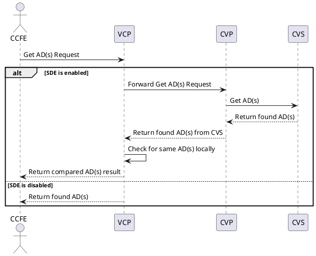
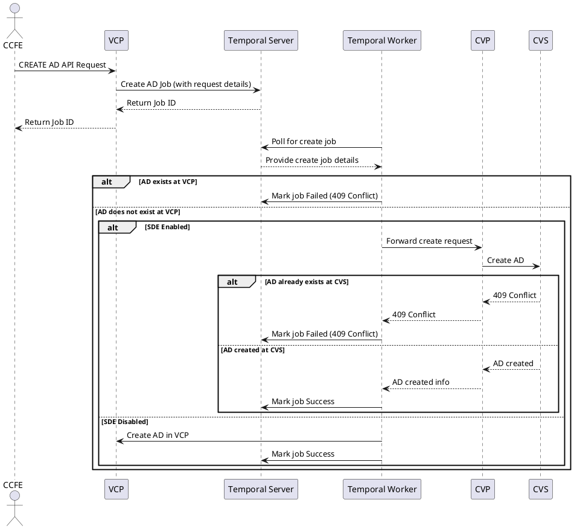
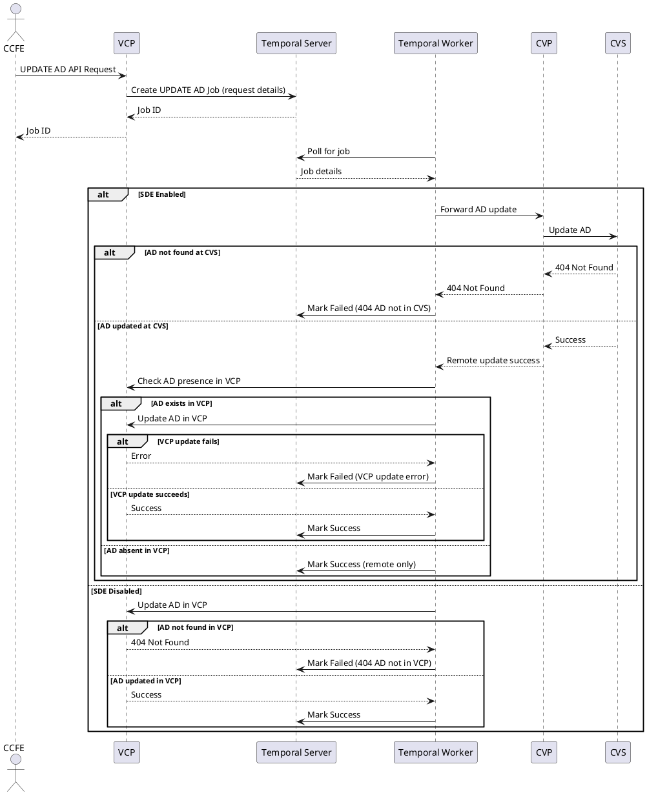
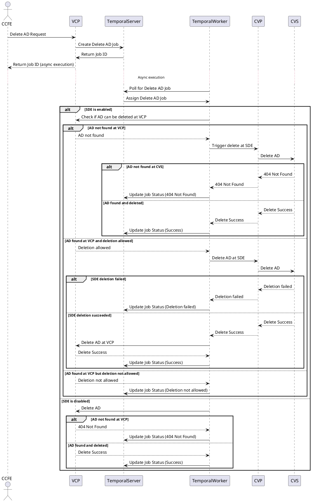

# Active Directory Design (VSA)

## Context

We need to support CRUD operations for Active Directory in VSA while ensuring that we preserve the existing functionality and behavior currently provided by SDE. While most of this document focuses specifically on CRUD operations for Active Directories, some sections also introduce a general pattern and practice for validating API inputs going forward.

## Key Considerations

- With VSA, AD create and update operations will be handled asynchronously, whereas in SDE they are handled synchronously.
- The AD DB table in VSA would hold less frequently updated fields as a single json field.
- The AD table in VSA would hold the more frequently updated fields as separate columns.
- In VSA, we don't use passphrase for storing passwords; instead, passwords are stored as secrets in GKE and the path to the secret is stored in the `CredentialPath` column in the DB.
- VSA DB would have eventual consistency with SDE db wrt AD table.
- AD table in VSA does not need a region value to be stored.
- We need to find out a mechanism to compare two DB entries for same AD- one each from VCP DB and SDE DB and decide the resultant response. - **Open Question**

## DB Table schema

The proposal is to have the AD related data organised such that the fields that are frequently updated fields have their dedicated columns, while, the remaining information is packed into a json and saved as active directory attributes.

The resultant ActiveDirectory Table is thus expected to have the following schema -

| Column | Type |
|--------|------|
| ID | Integer PRIMARY_KEY |
| UUID | Varchar UNIQUE |
| AccountID | Integer NOT_NULL FOREIGN_KEY |
| CreatedAt | DateTime |
| UpdatedAt | DateTime |
| DeletedAt | DateTime |
| ActiveDirectoryAttributes | Json |
| Name | Varchar |
| Username | Varchar |
| CredentialPath | Varchar |
| Domain | Varchar |
| DNS | Varchar |
| NetBios | Varchar |
| State | Varchar |
| StateDetails | Varchar |

## Go Structs

Based on the above proposed DB schema, we can layout the structs (DB Models) in go lang for AD in three parts -

- **BaseModel Struct** - contains high level info including ID and timestamps.
- **ActiveDirectoryAttributes Struct** - contains in-frequently updated AD details
- **ActiveDirectory struct** - contains BaseModel, ActiveDirectoryAttributes in addition to frequently updated AD details.

### BaseModel

```go
type BaseModel struct {
	ID        int64           `json:"id" gorm:"primaryKey"`
	UUID      string          `json:"uuid" gorm:"unique"`
	CreatedAt time.Time       `json:"createdAt"`
	UpdatedAt time.Time       `json:"updatedAt"`
	DeletedAt *gorm.DeletedAt `gorm:"index" json:"deletedAt"`
}
```

### ActiveDirectoryAttributes

```go
type ActiveDirectoryAttributes struct {
	PrimaryAD                     *bool
	ManagedAD                     *bool
	Label                         string
	OrganizationalUnit            string
	Site                          *string
	AccountID                     int64
	SvmId                         string
	AdUsers                       map[string][]string
	KdcIP                         string
	UserDN                        *string
	GroupDN                       *string
	GroupMembershipFilter         *string
	AesEncryption                 *bool
	EncryptDCConnections          *bool
	ServerRootCaCertificate       *string
	LdapSigning                   *bool
	AllowLocalNFSUsersWithLdap    *bool
	LdapOverTLS                   *bool
	PreferredServersForLdapClient *string
	Description                   *string
}
```

### ActiveDirectory

```go
type ActiveDirectory struct {
	BaseModel
	AdName                     *string                   `json:"name"`
	Username                   string                    `json:"username"`
	CredentialPath             string                    `json:"credentialPath"`
	Domain                     string                    `json:"domain"`
	DNS                        string                    `json:"dns"`
	NetBIOS                    string                    `json:"netbios"`
	State                      string                    `json:"status"`
	StateDetails               string                    `json:"stateDetails"`
	ActiveDirectoryAttributes   *ActiveDirectoryAttributes `gorm:"column:active_directory_attributes;type:jsonb"`
}
```

#### SDE - ActiveDirectoryV2 struct

( + `HTTPRequest *http.Request \`json:"-"\`` → V2CreateActiveDirectoryParams )

```go
DNS *string `json:"DNS"`
UUID string `json:"UUID,omitempty"`
AdName string `json:"adName,omitempty"`
Administrators []string `json:"administrators"`
AesEncryption *bool `json:"aesEncryption,omitempty"`
AllowLocalNFSUsersWithLdap *bool `json:"allowLocalNFSUsersWithLdap,omitempty"`
BackupOperators []string `json:"backupOperators"`
CreatedAt strfmt.DateTime `json:"createdAt,omitempty"`
DeletedAt *strfmt.DateTime `json:"deletedAt,omitempty"`
Description *string `json:"description,omitempty"`
Domain *string `json:"domain"`
EncryptDCConnections *bool `json:"encryptDCConnections,omitempty"`
GroupDN *string `json:"groupDN,omitempty"`
GroupMembershipFilter *string `json:"groupMembershipFilter,omitempty"`
Jobs []*JobV2 `json:"jobs"`
KdcIP string `json:"kdcIP,omitempty"`
Label string `json:"label,omitempty"`
LdapOverTLS *bool `json:"ldapOverTLS,omitempty"`
LdapSigning *bool `json:"ldapSigning,omitempty"`
ManagedAD *bool `json:"managedAD,omitempty"`
Name *string `json:"name,omitempty"`
NetBIOS *string `json:"netBIOS"`
OrganizationalUnit *string `json:"organizationalUnit,omitempty"`
Password *string `json:"password"`
PreferredServersForLdapClient *string `json:"preferredServersForLdapClient,omitempty"`
PrimaryAD *bool `json:"primaryAD,omitempty"`
Region *string `json:"region"`
SecurityOperators []string `json:"securityOperators"`
ServerRootCaCertificate *string `json:"serverRootCaCertificate,omitempty"`
Site *string `json:"site,omitempty"`
Status string `json:"status,omitempty"`
UpdatedAt strfmt.DateTime `json:"updatedAt,omitempty"`
UserDN *string `json:"userDN,omitempty"`
Username *string `json:"username"`
```

#### SDE - ActiveDirectoryUpdateV2 Struct

( + `HTTPRequest *http.Request \`json:"-"\`` + `ActiveDirectoryID string` → V2UpdateActiveDirectoryParams )

```go
DNS string `json:"DNS,omitempty"`
AdName string `json:"adName,omitempty"`
Administrators []string `json:"administrators"`
AesEncryption *bool `json:"aesEncryption,omitempty"`
AllowLocalNFSUsersWithLdap *bool `json:"allowLocalNFSUsersWithLdap,omitempty"`
BackupOperators []string `json:"backupOperators"`
Description *string `json:"description,omitempty"`
Domain string `json:"domain,omitempty"`
EncryptDCConnections *bool `json:"encryptDCConnections,omitempty"`
GroupDN *string `json:"groupDN,omitempty"`
GroupMembershipFilter *string `json:"groupMembershipFilter,omitempty"`
KdcIP string `json:"kdcIP,omitempty"`
Label string `json:"label,omitempty"`
LdapOverTLS *bool `json:"ldapOverTLS,omitempty"`
LdapSigning *bool `json:"ldapSigning,omitempty"`
ManagedAD *bool `json:"managedAD,omitempty"`
Name *string `json:"name,omitempty"`
NetBIOS string `json:"netBIOS,omitempty"`
OrganizationalUnit *string `json:"organizationalUnit,omitempty"`
Password string `json:"password,omitempty"`
PreferredServersForLdapClient *string `json:"preferredServersForLdapClient,omitempty"`
PrimaryAD *bool `json:"primaryAD,omitempty"`
SecurityOperators []string `json:"securityOperators"`
ServerRootCaCertificate *string `json:"serverRootCaCertificate,omitempty"`
Site *string `json:"site,omitempty"`
UserDN *string `json:"userDN,omitempty"`
Username string `json:"username,omitempty"`
```

## Key Considerations (CRUD)

- No record duplication occurs during any CRUD operation.
- Record duplication in VCP (from SDE) occurs only when an SDE AD is used in VCP (/VSA).
- For eventual cutoff from SDE to VCP, we need to ensure all the AD entries in SDE are present in VCP as well. - this can be done by implementing some core APIs.

---

## Interaction Diagram for Get AD(s)



In case an AD is found at both VCP and SDE, the state of the AD would be the higher (in the state hierarchy) state as found in either of the entries(VCP/SDE).

---

## Interaction Diagram for Create AD

Active Directory is expected to be a shared resource between SDE and VCP. This means a request to create a new AD should ensure that the new resource is created either at VCP level or at SDE level & replicated at VCP level based on existence of CVP_HOST.

The following interaction diagram represents a typical create request flow.



---

## Interaction Diagram for Update AD



At VCP/SDE, if an update is partially successful, the Update operation fails, however, the downstream resources already updated stay updated with the new values.

At a combined Level for VCP & SDE taken together, if either of the jobs fails, the operation would be considered failed.

---

## Interaction Diagram for Delete AD



---

## API input validation

We have multiple resources in SDE(and VCP) and their associated request params pertaining to the different supported CRUD API functionalities. With respect to validation of input params received from CCFE, the following observations stand out -

### Sequential validation of the input params

- Single code block invokes the sequential calls.
- Any addition/deletion of validation touches the same code fragment.
- Often un-readable
- Often un-manageable
- Often un-extendable.

With VCP, we would ideally want to go with a well established pattern for doing API request validations.

The next segment discusses couple of approaches to achieve this -

### Standard Chain of Responsibility principle implementation

As the heading suggests, the idea is to chain up the validations pertaining to different input fields and params. The following points describe the suggested implementation in a step-by-step manner:

- In SDE the input validation is done as a code block which calls multiple methods sequentially to perform validations on different input params.
- While this works without any issue, it results in the same code block being updated(directly/indirectly) whenever we intend to update the validation for any one or more parameters.
- We would ideally like to keep the validation logic for each parameter separate and independent of each other.
- Also, we would like to keep the code extendible for more parameters and their validations to be added/removed in future with minimal changes to existing code.
- The chain of responsibility principle/pattern seems to fit the bill here.
- We can have a base validator interface implemented by several concrete validators validating a single/group of parameters.
- Each Validator shall be responsible for validating the parameters fields its responsible for and then invoking the next validator in sequence.
- At any stage, if a validator encounters an unexpected input, it returns an  appropriate error.

The following class diagram explains the above details graphically - (TBD)

### Leveraging go-playground/validator Validator package

Validator package allows tag based validation of Go Structs.

#### Built-in validators

The following code fragment shows how built in validation tags can be added to achieve the intended validations.

```go
type ActiveDirectory struct {
    Username     string `json:"username" validate:"required,min=5,max=20"`
    Password     string `json:"email" validate:"required,password"`
    DNS          int    `json:"age" validate:"regexp=some_regex"`
}
```

#### Custom Validators

**Defining custom validators**

```go
func MyCustomValidator(fieldLevel validator.FieldLevel) bool {
    if (some logic)
        return true
    return false
}
```

**Registering the custom validator**

```go
validate := validator.New()
// Registering the custom validator
validate.RegisterValidation("myValidation", MyCustomValidator)
```

**Using the custom validator**

```go
type ActiveDirectory struct {
    Username     string `json:"username" validate:"required,min=5,max=20"`
    Password     string `json:"email" validate:"required,password"`
    DNS          int    `json:"age" validate:"regexp=some_regex"`
    SomeField    int    `json:"someField" validate:"myValidation"`
}
```

**Invoking Validation**

```go
err = validate.Struct(user)
```

---

