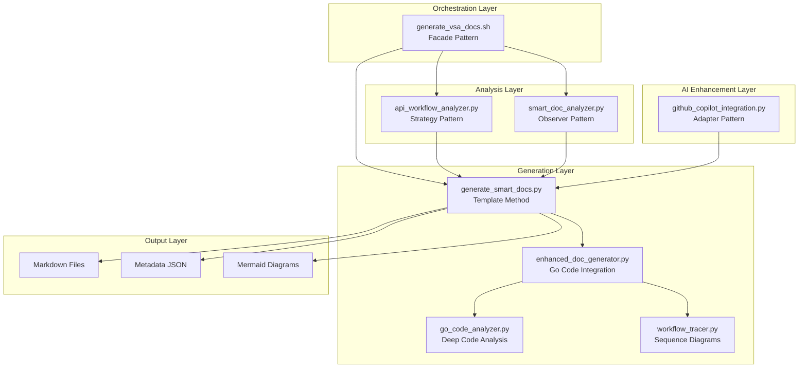
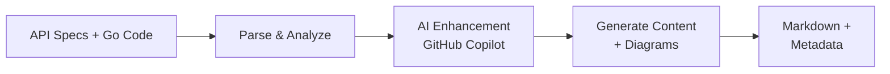

# Prototype Documentation Agent

## Design Overview

The **Prototype Documentation Agent** is an AI-powered intelligent documentation generation system that follows a **modular, multi-stage architecture** with integrated GitHub Copilot AI enhancement. It automates the creation of comprehensive architectural documentation for the VSA Control Plane by analyzing OpenAPI specifications, Go code patterns, and existing documentation.

### Core Design Principles

1. **AI-First Approach**: Leverages GitHub Copilot for intelligent content generation
2. **Modular Architecture**: Each component has a single responsibility
3. **Incremental Enhancement**: Only updates missing or incomplete documentation
4. **Pattern-Based Generation**: Uses proven software design patterns

### Architectural Patterns Used

- **Facade Pattern**: Orchestration shell provides simple interface
- **Strategy Pattern**: Pluggable parsing strategies for different API specs
- **Observer Pattern**: Documentation state monitoring
- **Adapter Pattern**: GitHub Copilot CLI integration
- **Template Method Pattern**: Document generation skeleton

## System Architecture



## Component Responsibilities

| Component | File | Purpose | Design Pattern |
|-----------|------|---------|----------------|
| **Orchestration Shell** | `generate_vsa_docs.sh` | Environment validation, phase coordination | Facade |
| **API Workflow Analyzer** | `api_workflow_analyzer.py` | OpenAPI parsing, operation discovery | Strategy |
| **Smart Doc Analyzer** | `smart_doc_analyzer.py` | Documentation gap analysis | Observer |
| **GitHub Copilot Integration** | `github_copilot_integration.py` | AI content generation | Adapter |
| **Document Generator** | `generate_smart_docs.py` | Main generation orchestration | Template Method |
| **Enhanced Doc Generator** | `enhanced_doc_generator.py` | Go code integration | - |
| **Go Code Analyzer** | `go_code_analyzer.py` | Deep Go code pattern analysis | - |
| **Workflow Tracer** | `workflow_tracer.py` | Sequence diagram generation | - |

## Data Flow



## Key Features

### 1. Intelligent Analysis
- **OpenAPI Discovery**: Automatically discovers API operations and resources
- **Code Pattern Recognition**: Analyzes Go workflows and activities
- **Gap Detection**: Identifies missing or incomplete documentation

### 2. AI-Powered Generation
- **Contextual Content**: Uses actual codebase context for relevant documentation
- **Architecture Descriptions**: Generates system purpose and design decisions
- **Code Snippets**: Includes relevant code examples and patterns

### 3. Multi-Diagram Support
- **Communication Flow**: Sequence diagrams showing system interactions
- **Entity Relationship**: Database model relationships
- **C4 Context**: System boundaries and external dependencies
- **State Machine**: Resource lifecycle and state transitions

### 4. Smart Enhancement
- **Incremental Updates**: Only regenerates missing or outdated content
- **Metadata Tracking**: Tracks API fingerprints for change detection
- **Coverage Analysis**: Assesses documentation completeness

## File Structure & Purpose

```
prototype-doc-agent/
├── generate_vsa_docs.sh           # Entry point & orchestration
├── api_workflow_analyzer.py       # OpenAPI parsing & workflow discovery
├── smart_doc_analyzer.py          # Documentation gap analysis
├── github_copilot_integration.py  # AI-powered content generation
├── generate_smart_docs.py         # Main document generation engine
├── enhanced_doc_generator.py      # Go code analysis integration
├── go_code_analyzer.py            # Deep Go code pattern analysis
├── workflow_tracer.py             # Sequence diagram generation
└── ARCHITECTURE.md               # Detailed architecture documentation
```

## Usage

```bash
# Basic usage (requires GitHub Copilot for AI features)
./generate_vsa_docs.sh

# The script automatically:
# 1. Validates environment (Python, Git, API files)
# 2. Detects GitHub Copilot availability
# 3. Analyzes existing documentation
# 4. Generates missing documentation
# 5. Updates metadata for change tracking
```

## Extension Points

### Adding New Diagram Types
```python
def generate_custom_diagram(workflow):
    """Add custom diagram generation logic"""
    return generate_mermaid_diagram(workflow)
```

### Custom Analysis Metrics
```python
def analyze_custom_metrics(workflow):
    """Add custom workflow analysis"""
    return custom_analysis_results
```

### AI Prompt Customization
```python
def build_custom_prompt(context):
    """Customize AI prompts for specific needs"""
    return enhanced_prompt
```

## Benefits

1. **Automated Documentation**: Reduces manual documentation effort
2. **Consistent Quality**: Standardized format and comprehensive coverage
3. **AI-Enhanced Content**: Contextual, intelligent descriptions
4. **Incremental Updates**: Only updates what's needed
5. **CI/CD Ready**: Designed for automated pipeline integration

## Future Enhancements

- **Parallel Generation**: Concurrent diagram and content generation
- **Multi-Language Support**: Beyond Go codebases
- **Custom Templates**: Per-resource-type documentation templates
- **Validation**: Automated diagram syntax checking
- **Metrics Dashboard**: Generation statistics and insights

---

**Version**: 1.0 | **Last Updated**: 2025-10-13 | **Author**: VSA Control Plane Team

